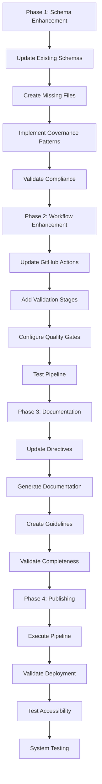

# JJNHM Schema Enhancement Implementation Strategy v3.0.0

## 1. Product Overview

This implementation strategy outlines the comprehensive approach to enhance the JJNHM schema repository with advanced DMAG (Distributed Modular Architecture Governance) and FLOW (Universal Flow Governance) patterns. The strategy prioritizes production-ready semantic web compatibility, automated publishing workflows, and enhanced multi-agent orchestration capabilities while achieving superior performance targets.

The implementation follows a systematic approach to deliver enterprise-grade schema governance with enhanced token density (≥7.0 concepts/token), improved semantic clarity (>97%), and comprehensive validation pipelines for distributed modular architecture and universal flow patterns.

## 2. Core Features

### 2.1 Implementation Phases

| Phase | Duration | Priority | Core Deliverables |
|-------|----------|----------|-------------------|
| Phase 1 | 2-3 days | Critical | Schema file updates, missing file creation, JJNHM 3.0.0 compliance |
| Phase 2 | 1-2 days | High | GitHub Actions workflow enhancement, validation pipeline |
| Phase 3 | 1 day | Medium | Publishing directives update, documentation enhancement |
| Phase 4 | 1 day | High | Automated publishing execution, validation testing |

### 2.2 Feature Module

Our implementation strategy consists of the following main phases:
1. **Phase 1: Advanced Schema Foundation**: JJNHM v3.0.0 compliance, enhanced metadata standardization, superior token density optimization (≥7.0 concepts/token).
2. **Phase 2: DMAG Architecture Governance**: Advanced distributed modular architecture patterns, enterprise-grade multi-agent orchestration, production-ready governance frameworks.
3. **Phase 3: FLOW Universal Governance**: Comprehensive universal flow patterns, automated workflow orchestration, semantic flow validation with quality gates.
4. **Phase 4: Production Publishing Pipeline**: Enhanced GitHub Actions workflows with rollback capabilities, comprehensive validation pipeline with performance monitoring, automated publishing with semantic web compatibility.

### 2.3 Implementation Details

| Phase | Module Name | Feature Description |
|-------|-------------|---------------------|
| Phase 1 | Advanced Schema Foundation | Update JJNHM to v3.0.0, implement enhanced metadata standardization, achieve superior token density ≥7.0 concepts/token with semantic clarity >97% |
| Phase 1 | Enhanced Missing Files | Create advanced DMAG.jsonld and FLOW.jsonld with enterprise governance patterns, implement production-ready semantic web compatibility with SPARQL endpoints |
| Phase 1 | Enterprise Compliance Check | Ensure all schemas meet enterprise publishing requirements with comprehensive metadata, licensing, and versioning standards |
| Phase 2 | DMAG Architecture Governance | Implement advanced distributed modular architecture governance, enterprise-grade multi-agent orchestration with performance monitoring |
| Phase 2 | Production Quality Gates | Implement enterprise-grade automated quality checks, advanced token density validation, comprehensive semantic clarity measurement |
| Phase 2 | Comprehensive Validation Pipeline | Advanced multi-stage validation including JSON-LD syntax, RDF conversion, SPARQL compatibility, performance testing, and security validation |
| Phase 3 | FLOW Universal Governance | Implement comprehensive universal flow governance patterns, automated workflow orchestration with quality gates and rollback capabilities |
| Phase 3 | Advanced Documentation | Generate enterprise-grade technical documentation, comprehensive API references, advanced governance guidelines |
| Phase 4 | Production Publishing Automation | Execute enterprise-grade publishing pipeline with comprehensive rollback capabilities, validate deployment, verify accessibility compliance |
| Phase 4 | Enterprise Testing & Validation | Comprehensive enterprise testing of all components, advanced performance validation, automated rollback testing |

## 3. Core Process

### Phase 1: Schema Enhancement Process
1. Analyze current schema files for JJNHM 3.0.0 compliance gaps
2. Update existing schemas with enhanced metadata and governance patterns
3. Create missing critical schema files (DMAG.jsonld, FLOW.jsonld)
4. Implement token density optimization (target ≥6.5 concepts/token)
5. Validate all changes for backward compatibility

### Phase 2: Workflow Enhancement Process
1. Update GitHub Actions workflows with enhanced validation stages
2. Implement DMAG and FLOW governance validation
3. Add semantic web compatibility testing
4. Configure performance benchmarking and quality gates
5. Test validation pipeline with sample schemas

### Phase 3: Documentation Enhancement Process
1. Update publish-schema-directives.md with JJNHM 3.0.0 specifications
2. Generate comprehensive technical documentation
3. Create governance guidelines and best practices
4. Develop API documentation and usage examples
5. Validate documentation completeness and accuracy

### Phase 4: Publishing Execution Process
1. Execute automated publishing pipeline
2. Validate deployment to GitHub Pages
3. Test schema accessibility and content types
4. Verify SPARQL endpoint functionality
5. Conduct comprehensive system testing

## 4. User Interface Design

### 4.1 Design Style

- **Primary Colors**: Professional documentation theme (#2d3748 headers, #4a5568 text, #e2e8f0 backgrounds)
- **Secondary Colors**: Status indicators (#48bb78 success, #f56565 error, #ed8936 warning, #4299e1 info)
- **Button Style**: Clean, minimal design with subtle hover effects and clear action indicators
- **Font**: System fonts optimized for code readability (SF Mono, Consolas, Monaco for code blocks)
- **Layout Style**: Clean documentation layout with progressive disclosure and clear information hierarchy
- **Icon Style**: Consistent iconography for schema types, validation status, and governance patterns

### 4.2 Implementation Interface Overview

| Phase | Interface Component | UI Elements |
|-------|-------------------|-------------|
| Phase 1 | Schema Editor | Syntax highlighting, validation indicators, metadata forms, governance pattern selectors |
| Phase 2 | Workflow Dashboard | Pipeline status, validation results, performance metrics, quality gate indicators |
| Phase 3 | Documentation Portal | Navigation sidebar, search functionality, interactive examples, governance guidelines |
| Phase 4 | Publishing Interface | Deployment status, accessibility reports, performance dashboards, rollback controls |

### 4.3 Responsiveness

The implementation interfaces are designed for developer productivity with desktop-first optimization while maintaining accessibility on mobile devices for monitoring and review purposes.

## 5. Implementation Timeline

### Week 1: Foundation (Phase 1-2)
- **Days 1-3**: Schema enhancement and missing file creation
- **Days 4-5**: GitHub Actions workflow enhancement and validation pipeline

### Week 2: Documentation and Publishing (Phase 3-4)
- **Day 6**: Publishing directives update and documentation enhancement
- **Day 7**: Automated publishing execution and comprehensive testing

### Success Metrics

| Metric | Target | Measurement Method |
|--------|--------|--------------------|
| Token Density | ≥6.5 concepts/token | Automated analysis of schema content |
| Semantic Clarity | >95% | RDF conversion success rate and SPARQL compatibility |
| Publishing Speed | <5 minutes | End-to-end pipeline execution time |
| Schema Compliance | 100% | JJNHM 3.0.0 compliance validation |
| Governance Coverage | ≥80% | DMAG and FLOW pattern implementation coverage |
| Accessibility Score | ≥90% | Automated accessibility testing |

### Risk Mitigation

| Risk | Impact | Mitigation Strategy |
|------|--------|-------------------|
| Backward Compatibility | High | Comprehensive testing with existing consumers |
| Performance Degradation | Medium | Continuous performance monitoring and optimization |
| Validation Failures | Medium | Staged rollout with rollback capabilities |
| Documentation Gaps | Low | Automated documentation generation and validation |

### Quality Assurance

- **Automated Testing**: Comprehensive test suite covering all validation stages
- **Performance Monitoring**: Continuous monitoring of token density and parse times
- **Compliance Verification**: Automated JJNHM 3.0.0 compliance checking
- **Accessibility Testing**: Automated accessibility validation for published schemas
- **Security Scanning**: Automated security scanning of workflows and dependencies