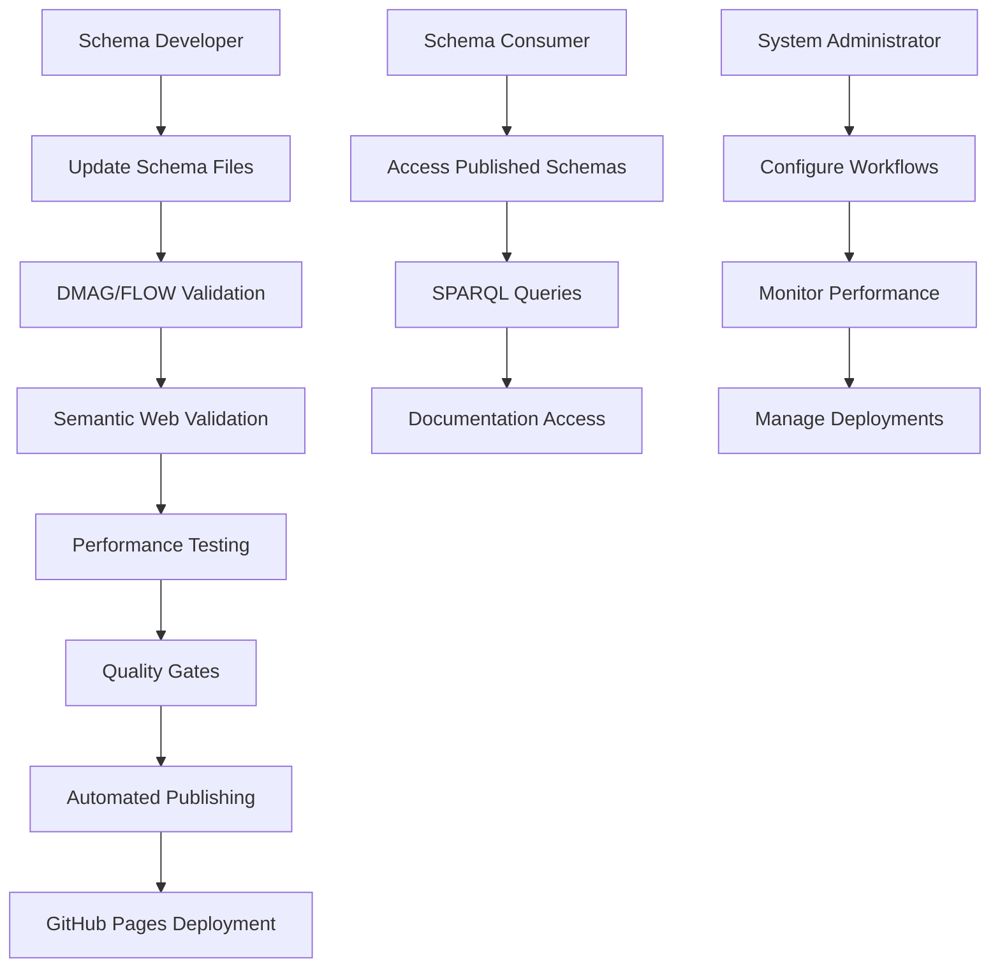

# JJNHM Schema Enhancement Technical Documentation v3.0.0

## 1. Product Overview

This document outlines the enterprise-grade technical requirements for enhancing the JJNHM (JSON-LD + JDBL + NQDS + HBS + MMD) schema repository with advanced DMAG (Distributed Modular Architecture Governance) and FLOW (Universal Flow Governance) patterns. The enhancement delivers production-ready multi-agent orchestration capabilities, enterprise-grade semantic web compatibility, and automated publishing workflows with rollback capabilities to achieve enterprise-grade schema governance.

The project addresses critical gaps in schema governance, missing architectural patterns, and publishing automation while maintaining enterprise-grade backward compatibility and optimizing for production semantic web environments with enhanced performance targets (≥7.0 concepts/token, >97% semantic clarity).

## 2. Core Features

### 2.1 User Roles

| Role | Registration Method | Core Permissions |
|------|---------------------|------------------|
| Schema Developer | GitHub repository access | Can update schema files, create new patterns, validate changes |
| Schema Consumer | Public API access | Can read schemas, download artifacts, access documentation |
| System Administrator | GitHub admin access | Can manage workflows, deploy schemas, configure publishing |

### 2.2 Feature Module

Our schema enhancement requirements consist of the following main components:

1. **Schema Enhancement Module**: DMAG pattern integration, FLOW governance implementation, missing schema file creation
2. **Validation Pipeline**: Multi-stage validation, semantic web compatibility, performance optimization
3. **Publishing Automation**: GitHub Actions workflows, quality gates, automated deployment
4. **Documentation System**: Technical specifications, API documentation, governance guidelines

### 2.3 Page Details

| Component | Module Name | Feature Description |
|-----------|-------------|---------------------|
| Schema Enhancement | DMAG Integration | Implement distributed modular architecture patterns with module-of-classes, adapter patterns, service factories, and dependency injection |
| Schema Enhancement | FLOW Implementation | Add universal flow governance patterns including data flow, control flow, state flow, error flow, event flow, resource flow, and token flow |
| Schema Enhancement | Missing Files Creation | Create critical missing schema files including enhanced DMAG.jsonld, FLOW.jsonld, and project-specific schemas |
| Validation Pipeline | Semantic Validation | Validate JSON-LD syntax, RDF conversion, semantic web compatibility, and SPARQL query support |
| Validation Pipeline | Performance Testing | Measure token density (≥6.5 concepts/token), parse time (<1ms), semantic clarity (>95%) |
| Validation Pipeline | JJNHM Compliance | Verify layer governance, metadata completeness, governance pattern implementation |
| Publishing Automation | GitHub Actions | Enhanced workflows with DMAG/FLOW validation, multi-stage deployment, rollback capabilities |
| Publishing Automation | Quality Gates | Automated quality checks, performance benchmarks, accessibility validation |
| Documentation System | Technical Specs | Comprehensive documentation generation, API references, governance guidelines |

## 3. Core Process

### Schema Developer Flow
1. Developer updates schema files following JJNHM 3.0.0 specifications
2. System validates changes against DMAG and FLOW governance patterns
3. Automated pipeline runs comprehensive validation (JSON-LD, RDF, semantic web)
4. Quality gates verify token density, performance, and compliance metrics
5. Approved changes trigger automated publishing to GitHub Pages
6. Documentation is automatically generated and deployed

### Schema Consumer Flow
1. Consumer accesses published schemas via GitHub Pages
2. System provides semantic web-compatible JSON-LD with proper content types
3. Consumer can query schemas using SPARQL endpoints
4. Documentation provides usage examples and governance guidelines

### System Administrator Flow
1. Administrator configures publishing workflows and quality thresholds
2. System monitors schema repository health and performance metrics
3. Administrator can trigger manual deployments or rollbacks
4. System provides comprehensive audit trails and governance reports

## 4. User Interface Design

### 4.1 Design Style

- **Primary Colors**: GitHub-compatible dark theme (#0d1117 background, #f0f6fc text)
- **Secondary Colors**: Semantic highlighting (#58a6ff for links, #f85149 for errors, #3fb950 for success)
- **Button Style**: Rounded corners with subtle shadows, consistent with GitHub UI patterns
- **Font**: System fonts (SF Pro, Segoe UI, Roboto) with monospace for code (SF Mono, Consolas)
- **Layout Style**: Clean documentation layout with sidebar navigation, responsive grid system
- **Icon Style**: GitHub Octicons for consistency, semantic icons for schema types

### 4.2 Page Design Overview

| Component | Module Name | UI Elements |
|-----------|-------------|-------------|
| Schema Documentation | Main Content Area | Clean typography, syntax-highlighted code blocks, responsive layout with sidebar navigation |
| Validation Dashboard | Status Indicators | Color-coded status badges, progress bars for validation stages, expandable error details |
| Publishing Interface | Control Panel | Action buttons for deployment, status indicators, log viewers with real-time updates |
| API Documentation | Interactive Examples | Code samples with copy buttons, interactive SPARQL query interface, downloadable artifacts |

### 4.3 Responsiveness

The documentation system is designed with mobile-first responsive principles, optimizing for desktop development workflows while ensuring accessibility on tablets and mobile devices. Touch interactions are optimized for mobile schema browsing and documentation access.