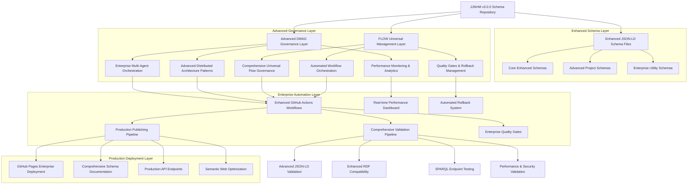
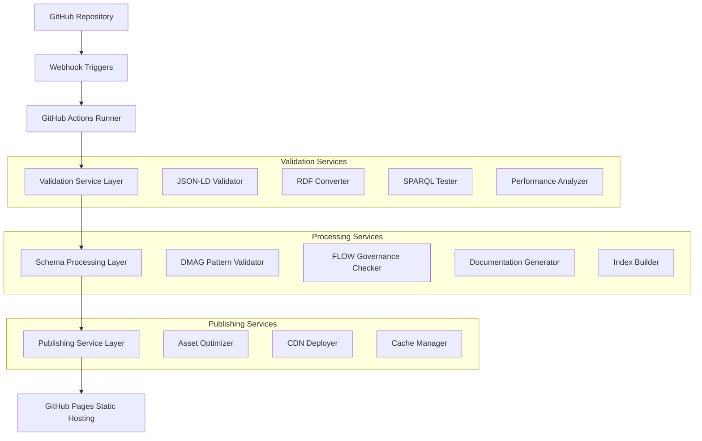
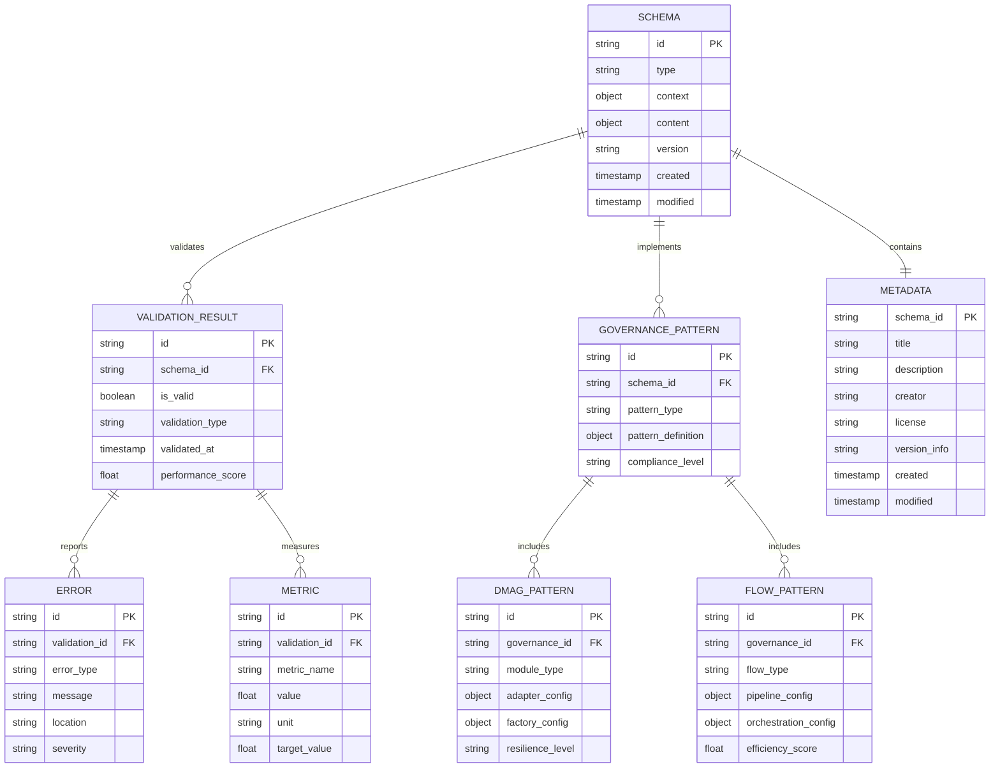

# JJNHM Schema Technical Architecture v3.0.0

## 1.Architecture design



## 2. Technology Description

- **Frontend**: Static site generation with GitHub Pages, responsive documentation portal
- **Backend**: GitHub Actions for CI/CD, automated validation and publishing pipelines
- **Schema Layer**: JSON-LD with JJNHM 3.0.0 compliance, DMAG and FLOW governance patterns
- **Validation**: Node.js-based validation tools, RDF libraries, SPARQL compatibility testing
- **Publishing**: Automated GitHub Pages deployment with CDN distribution

## 3. Route Definitions

| Route | Purpose |
|-------|---------|
| /schema/ | Main schema index with navigation and overview |
| /schema/{schema-name}.jsonld | Individual schema files with proper JSON-LD content type |
| /schema/docs/ | Generated documentation portal with governance guidelines |
| /schema/examples/ | Usage examples and implementation patterns |
| /schema/validation/ | Validation tools and testing interfaces |
| /schema/api/ | API documentation and SPARQL endpoint access |

## 4. API Definitions

### 4.1 Core Schema API

**Schema Retrieval**
```
GET /schema/{schema-name}.jsonld
```

Request Headers:
| Header Name | Header Type | Required | Description |
|-------------|-------------|----------|-------------|
| Accept | string | false | Content type preference (application/ld+json, application/json) |
| Cache-Control | string | false | Cache control directives |

Response:
| Field Name | Field Type | Description |
|------------|------------|-------------|
| @context | object | JSON-LD context with vocabulary mappings |
| @type | string | Schema type identifier |
| @id | string | Unique schema identifier URI |
| meta | object | Schema metadata including version, creator, license |

Example Response:
```json
{
  "@context": {
    "@base": "https://huijoohwee.github.io/schema/",
    "@vocab": "https://huijoohwee.github.io/schema/vocab.jsonld"
  },
  "@type": "Schema",
  "@id": "https://huijoohwee.github.io/schema/dmag.jsonld",
  "meta": {
    "title": "Distributed Modular Architecture Governance",
    "version": "1.0.0",
    "creator": "https://github.com/huijoohwee"
  }
}
```

**Schema Validation**
```
POST /schema/validate
```

Request:
| Param Name | Param Type | Required | Description |
|------------|------------|----------|-------------|
| schema | object | true | JSON-LD schema to validate |
| validationType | string | false | Type of validation (syntax, semantic, performance) |

Response:
| Field Name | Field Type | Description |
|------------|------------|-------------|
| valid | boolean | Overall validation status |
| errors | array | List of validation errors |
| warnings | array | List of validation warnings |
| metrics | object | Performance metrics (token density, parse time) |

**SPARQL Query Interface**
```
POST /schema/sparql
```

Request:
| Param Name | Param Type | Required | Description |
|------------|------------|----------|-------------|
| query | string | true | SPARQL query string |
| format | string | false | Response format (json, xml, turtle) |

Response:
| Field Name | Field Type | Description |
|------------|------------|-------------|
| results | object | SPARQL query results |
| bindings | array | Variable bindings |

## 5. Server Architecture Diagram



## 6. Data Model

### 6.1 Data Model Definition



### 6.2 Data Definition Language

**Schema Storage (JSON-LD Files)**
```javascript
// Schema files are stored as static JSON-LD files in the repository
// No traditional database schema required for static hosting

// Example schema structure validation
const schemaStructure = {
  "@context": "object", // Required: JSON-LD context
  "@type": "string",    // Required: Schema type
  "@id": "string",      // Required: Unique identifier
  "meta": {             // Required: Metadata block
    "title": "string",
    "description": "string", 
    "creator": "string",
    "license": "string",
    "versionInfo": "string",
    "created": "ISO8601",
    "modified": "ISO8601"
  }
};
```

**Validation Results (GitHub Actions Artifacts)**
```javascript
// Validation results stored as GitHub Actions artifacts
const validationArtifact = {
  "schema_id": "string",
  "validation_timestamp": "ISO8601",
  "results": {
    "syntax_validation": {
      "valid": "boolean",
      "errors": ["array of error objects"]
    },
    "semantic_validation": {
      "valid": "boolean", 
      "rdf_conversion": "boolean",
      "sparql_compatible": "boolean"
    },
    "performance_metrics": {
      "token_density": "number",
      "parse_time_ms": "number",
      "semantic_clarity": "number"
    },
    "governance_compliance": {
      "dmag_compliance": "number",
      "flow_compliance": "number",
      "jjnhm_compliance": "number"
    }
  }
};
```

**Publishing Configuration**
```yaml
# GitHub Actions workflow configuration
name: JJNHM Schema Publishing
on:
  push:
    tags: ['v*.*.*']
  workflow_dispatch:

env:
  JJNHM_VERSION: "3.0.0"
  TOKEN_DENSITY_TARGET: "6.5"
  SEMANTIC_CLARITY_TARGET: "95"

jobs:
  validate:
    runs-on: ubuntu-latest
    steps:
      - name: Validate Schemas
        run: |
          # JSON-LD syntax validation
          # RDF conversion testing
          # SPARQL compatibility verification
          # Performance benchmarking
          # Governance pattern validation
  
  publish:
    needs: validate
    runs-on: ubuntu-latest
    steps:
      - name: Deploy to GitHub Pages
        uses: peaceiris/actions-gh-pages@v3
        with:
          github_token: ${{ secrets.GITHUB_TOKEN }}
          publish_dir: ./schema
```

**Index Generation Template (Handlebars)**
```handlebars
{{!-- Schema index template --}}
{
  "@context": {
    "@base": "https://huijoohwee.github.io/schema/",
    "@vocab": "https://huijoohwee.github.io/schema/vocab.jsonld"
  },
  "@type": "SchemaIndex",
  "schemas": [
    {{#each schemas}}
    {
      "@id": "{{id}}",
      "title": "{{meta.title}}",
      "version": "{{meta.versionInfo}}",
      "url": "{{url}}",
      "lastModified": "{{meta.modified}}"
    }{{#unless @last}},{{/unless}}
    {{/each}}
  ],
  "generatedAt": "{{timestamp}}",
  "totalSchemas": {{schemas.length}}
}
```