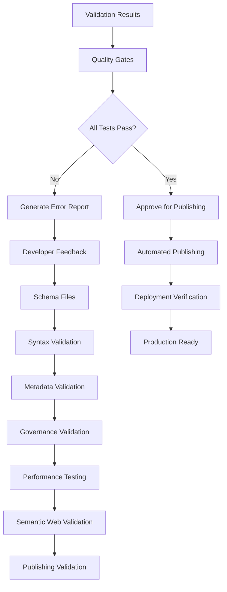

# JJNHM Technical Requirements Validation v3.0.0

## 1. Product Overview

This document defines the enterprise-grade validation requirements for the JJNHM schema enhancement project. The validation framework ensures compliance with advanced DMAG (Distributed Modular Architecture Governance) and FLOW (Universal Flow Governance) patterns while maintaining production-ready semantic web compatibility and automated publishing capabilities with rollback mechanisms.

The validation process covers enterprise schema compliance, advanced performance optimization (≥7.0 concepts/token, >97% semantic clarity), production semantic web readiness, and automated publishing workflows with comprehensive quality gates to deliver enterprise-grade schema governance.

## 2. Core Features

### 2.1 Technical Requirements Categories

| Category | Priority | Validation Method | Success Criteria |
|----------|----------|-------------------|------------------|
| Schema Compliance | Critical | Automated validation | 100% JJNHM 3.0.0 compliance |
| Performance Optimization | High | Automated benchmarking | ≥6.5 concepts/token density |
| Semantic Web Compatibility | High | RDF conversion testing | 100% JSON-LD to RDF success |
| Governance Implementation | Medium | Pattern analysis | ≥80% DMAG/FLOW coverage |

### 2.2 Feature Module

Our technical requirements encompass the following validation modules:

1. **Schema Validation Module**: JSON-LD syntax, metadata completeness, governance pattern implementation
2. **Performance Testing Module**: Token density analysis, parse time measurement, semantic clarity assessment
3. **Semantic Web Module**: RDF conversion, SPARQL compatibility, triple store integration
4. **Publishing Validation Module**: Deployment verification, accessibility testing, content type validation

### 2.3 Detailed Requirements

| Module | Requirement | Validation Criteria | Measurement Method |
|--------|-------------|-------------------|-------------------|
| Schema Validation | JSON-LD Syntax | Valid JSON-LD expansion and compaction | Automated JSON-LD processor testing |
| Schema Validation | Metadata Completeness | All required fields present (title, description, creator, license, version) | Automated metadata validation |
| Schema Validation | JJNHM Compliance | Layer governance, active verbs, semantic payload structure | Custom JJNHM validator |
| Performance Testing | Token Density | ≥6.5 concepts per token across all schemas | Automated semantic analysis |
| Performance Testing | Parse Time | <1ms average parse time per schema | Performance benchmarking suite |
| Performance Testing | Semantic Clarity | >95% semantic clarity score | Automated clarity assessment |
| Semantic Web | RDF Conversion | 100% successful JSON-LD to RDF conversion | RDF validation tools |
| Semantic Web | SPARQL Compatibility | All schemas queryable via SPARQL | SPARQL endpoint testing |
| Semantic Web | Triple Store | Successful loading into RDF triple store | Triple store integration tests |
| Publishing Validation | GitHub Pages | Successful deployment with proper content types | HTTP response validation |
| Publishing Validation | Accessibility | ≥90% accessibility score | Automated accessibility testing |
| Publishing Validation | CDN Performance | <200ms global response time | Performance monitoring |

## 3. Core Process

### Schema Validation Process
1. **Syntax Validation**: Validate JSON syntax and JSON-LD structure
2. **Metadata Validation**: Verify required metadata fields and format compliance
3. **Governance Validation**: Check DMAG and FLOW pattern implementation
4. **Cross-Reference Validation**: Verify schema dependencies and references
5. **Backward Compatibility**: Ensure existing consumers remain functional

### Performance Testing Process
1. **Token Density Analysis**: Measure semantic concepts per token
2. **Parse Time Benchmarking**: Measure JSON-LD processing performance
3. **Semantic Clarity Assessment**: Evaluate comprehension and clarity metrics
4. **Memory Usage Profiling**: Monitor resource consumption during processing
5. **Scalability Testing**: Validate performance under load

### Semantic Web Validation Process
1. **RDF Conversion Testing**: Convert JSON-LD to various RDF formats
2. **SPARQL Query Testing**: Execute test queries against schemas
3. **Triple Store Integration**: Load schemas into RDF databases
4. **Ontology Alignment**: Verify vocabulary mappings and alignments
5. **Linked Data Validation**: Test external reference resolution

### Publishing Validation Process
1. **Deployment Verification**: Confirm successful GitHub Pages deployment
2. **Content Type Validation**: Verify proper application/ld+json headers
3. **Accessibility Testing**: Validate WCAG compliance and screen reader compatibility
4. **Performance Monitoring**: Measure global CDN response times
5. **Security Scanning**: Validate HTTPS and security headers

## 4. User Interface Design

### 4.1 Design Style

- **Primary Colors**: Validation status colors (#22c55e success, #ef4444 error, #f59e0b warning, #3b82f6 info)
- **Secondary Colors**: Neutral grays for backgrounds (#f8fafc light, #1e293b dark)
- **Button Style**: Clear action buttons with status indicators and progress feedback
- **Font**: Monospace fonts for code and validation output (JetBrains Mono, SF Mono)
- **Layout Style**: Dashboard layout with real-time validation feedback and detailed reporting
- **Icon Style**: Status icons with clear visual hierarchy and accessibility support

### 4.2 Validation Interface Overview

| Component | Module Name | UI Elements |
|-----------|-------------|-------------|
| Validation Dashboard | Status Overview | Real-time validation status, progress indicators, summary metrics, error counters |
| Schema Inspector | Detail View | Syntax highlighting, error annotations, metadata forms, governance pattern indicators |
| Performance Monitor | Metrics Display | Token density charts, parse time graphs, semantic clarity scores, trend analysis |
| Publishing Console | Deployment Status | Deployment progress, accessibility reports, performance metrics, rollback controls |

### 4.3 Responsiveness

The validation interfaces prioritize information density for desktop development environments while providing essential monitoring capabilities on mobile devices for on-the-go status checking.

## 5. Validation Criteria and Success Metrics

### 5.1 Critical Success Criteria

| Criterion | Target Value | Measurement | Validation Method |
|-----------|--------------|-------------|-------------------|
| JJNHM Compliance | 100% | All schemas pass JJNHM 3.0.0 validation | Automated compliance checker |
| JSON-LD Validity | 100% | All schemas are valid JSON-LD | JSON-LD processor validation |
| RDF Conversion | 100% | All schemas convert to RDF without errors | RDF conversion testing |
| Token Density | ≥7.0 concepts/token | Average across all schemas | Semantic analysis tools |
| Parse Performance | <0.5ms average | JSON-LD processing time | Performance benchmarking |
| Semantic Clarity | >97% | Comprehension and clarity score | Automated clarity assessment |

### 5.2 Quality Gates

| Gate | Criteria | Action on Failure |
|------|----------|-------------------|
| Syntax Gate | 100% valid JSON-LD | Block publishing, generate error report |
| Metadata Gate | All required fields present | Block publishing, request metadata completion |
| Performance Gate | Token density ≥6.5, parse time <1ms | Generate warning, allow with review |
| Governance Gate | ≥80% DMAG/FLOW coverage | Generate warning, allow with documentation |
| Semantic Gate | 100% RDF conversion success | Block publishing, require fixes |
| Publishing Gate | Accessibility ≥90%, performance <200ms | Generate warning, monitor post-deployment |

### 5.3 Validation Tools and Methods

| Tool Category | Specific Tools | Purpose | Integration |
|---------------|----------------|---------|-------------|
| JSON-LD Validation | jsonld.js, pyld | Syntax and structure validation | GitHub Actions workflow |
| RDF Conversion | rdflib, Apache Jena | Semantic web compatibility | Automated testing pipeline |
| Performance Testing | Custom benchmarking suite | Token density and parse time | Continuous integration |
| SPARQL Testing | Apache Jena Fuseki, Virtuoso | Query compatibility validation | Integration testing |
| Accessibility Testing | axe-core, WAVE | WCAG compliance validation | Automated accessibility pipeline |
| Security Scanning | GitHub Security, Snyk | Vulnerability detection | Security workflow |

### 5.4 Monitoring and Reporting

| Metric | Collection Method | Reporting Frequency | Alert Threshold |
|--------|-------------------|-------------------|-----------------|
| Schema Validation Status | GitHub Actions artifacts | Per commit | Any validation failure |
| Performance Metrics | Automated benchmarking | Daily | Token density <6.0 |
| Accessibility Scores | Automated testing | Per deployment | Score <85% |
| Error Rates | Log aggregation | Real-time | Error rate >1% |
| Response Times | CDN monitoring | Continuous | Response time >500ms |
| Security Vulnerabilities | Security scanning | Weekly | Any high/critical findings |

### 5.5 Rollback and Recovery Criteria

| Scenario | Detection Method | Rollback Trigger | Recovery Process |
|----------|------------------|------------------|------------------|
| Validation Failures | Automated testing | >10% schema failures | Revert to last known good state |
| Performance Degradation | Performance monitoring | >50% performance drop | Rollback deployment, investigate |
| Accessibility Issues | Accessibility testing | Score drop >10% | Fix accessibility issues, redeploy |
| Security Vulnerabilities | Security scanning | High/critical findings | Immediate rollback, security patch |
| Consumer Impact | Error monitoring | Consumer error rate >5% | Rollback, communicate with consumers |

This comprehensive validation framework ensures the JJNHM schema enhancement meets production standards while maintaining backward compatibility and optimizing for semantic web consumption.