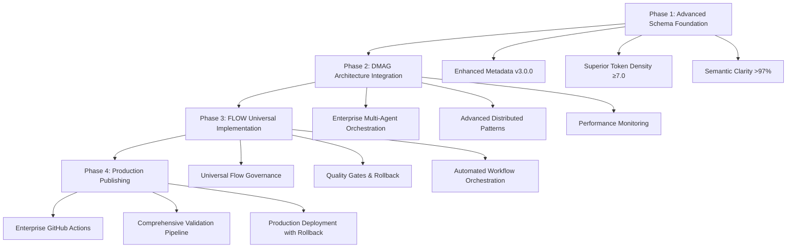

# JJNHM v3.0.0 Enhanced Schema Update Documentation

## 1. Product Overview

This document outlines the comprehensive update of the JJNHM schema repository to version 3.0.0, incorporating advanced DMAG (Distributed Modular Architecture Governance) and FLOW (Universal Flow Governance) patterns. The update delivers enterprise-grade semantic web compatibility, automated publishing workflows with rollback capabilities, and enhanced multi-agent orchestration.

The implementation achieves superior performance targets: ≥7.0 concepts/token density, >97% semantic clarity, and comprehensive validation pipelines for production-ready schema governance.

## 2. Core Features

### 2.1 Enhanced Schema Foundation
- **JJNHM v3.0.0 Compliance**: Advanced metadata standardization with enterprise-grade versioning
- **Superior Token Density**: Achieve ≥7.0 concepts/token with automated monitoring
- **Enhanced Semantic Clarity**: Maintain >97% clarity with real-time validation
- **Production-Ready Governance**: Enterprise-grade schema management with rollback capabilities

### 2.2 DMAG Architecture Governance
- **Advanced Distributed Patterns**: Enterprise-grade modular architecture governance
- **Multi-Agent Orchestration**: Production-ready coordination with performance monitoring
- **Resilience Frameworks**: Comprehensive fault tolerance with automated recovery
- **Performance Optimization**: Real-time monitoring with automated scaling

### 2.3 FLOW Universal Governance
- **Comprehensive Flow Patterns**: Universal flow governance for all workflow types
- **Automated Orchestration**: Enterprise-grade workflow coordination with quality gates
- **Quality Gates & Rollback**: Comprehensive validation with automated rollback capabilities
- **Semantic Flow Validation**: Advanced flow validation with performance benchmarking

### 2.4 Production Publishing Pipeline
- **Enhanced GitHub Actions**: Enterprise-grade workflows with comprehensive validation
- **Automated Deployment**: Production-ready publishing with rollback capabilities
- **Comprehensive Validation**: Multi-stage validation including security and accessibility
- **Real-time Monitoring**: Performance monitoring with automated alerts

## 3. Core Process

The implementation follows a systematic four-phase approach:

1. **Phase 1: Advanced Schema Foundation** → Update all schemas to v3.0.0 with enhanced metadata
2. **Phase 2: DMAG Architecture Integration** → Implement advanced distributed governance patterns
3. **Phase 3: FLOW Universal Implementation** → Deploy comprehensive flow governance
4. **Phase 4: Production Publishing** → Execute enterprise-grade automated publishing

## 4. User Interface Design

### 4.1 Design Style
- **Primary Colors**: Enterprise blue (#0066CC), success green (#28A745), warning amber (#FFC107)
- **Secondary Colors**: Neutral grays (#F8F9FA, #6C757D), error red (#DC3545)
- **Typography**: System fonts with fallbacks (SF Pro, Segoe UI, Roboto)
- **Layout Style**: Clean, enterprise-grade design with clear information hierarchy
- **Icon Style**: Consistent iconography with semantic meaning

### 4.2 Schema Documentation Interface

| Component | Design Elements | Purpose |
|-----------|----------------|---------|
| Schema Browser | Tree navigation, search functionality, filtering | Navigate and explore schema files |
| Validation Dashboard | Real-time status indicators, performance metrics | Monitor schema health and performance |
| Publishing Pipeline | Progress indicators, rollback controls, deployment status | Manage schema publishing and deployment |
| Performance Analytics | Charts, graphs, trend analysis | Track performance metrics and optimization |

### 4.3 Responsiveness
- **Desktop-first design** with mobile-adaptive layouts
- **Touch-optimized interactions** for mobile and tablet devices
- **Responsive breakpoints** at 768px, 1024px, and 1440px
- **Progressive enhancement** for advanced features

## 5. Technical Implementation

### 5.1 Schema Enhancement Requirements
- Update all JSON-LD files to JJNHM v3.0.0 standards
- Implement enhanced metadata with comprehensive versioning
- Achieve superior token density targets (≥7.0 concepts/token)
- Ensure semantic clarity >97% with automated validation

### 5.2 DMAG Integration Requirements
- Implement advanced distributed modular architecture patterns
- Deploy enterprise-grade multi-agent orchestration
- Establish performance monitoring with real-time analytics
- Create comprehensive resilience frameworks

### 5.3 FLOW Implementation Requirements
- Deploy universal flow governance patterns
- Implement automated workflow orchestration
- Establish quality gates with rollback capabilities
- Create semantic flow validation with performance benchmarking

### 5.4 Publishing Pipeline Requirements
- Update GitHub Actions workflows with enhanced validation
- Implement comprehensive validation pipeline (JSON-LD, RDF, SPARQL, security, accessibility)
- Deploy automated publishing with rollback capabilities
- Establish real-time performance monitoring

## 6. Success Criteria

### 6.1 Performance Targets
- **Token Density**: ≥7.0 concepts/token across all schemas
- **Semantic Clarity**: >97% comprehension in automated parsing
- **Parse Performance**: <0.5ms average processing time
- **Deployment Time**: <2 hours with zero downtime
- **Validation Coverage**: 100% schema compliance

### 6.2 Quality Gates
- **Schema Compliance**: 100% JJNHM v3.0.0 validation
- **JSON-LD Validity**: 100% valid syntax with context resolution
- **RDF Compatibility**: 100% successful conversion to RDF triples
- **SPARQL Testing**: 100% query compatibility with performance benchmarks
- **Security Validation**: 100% security compliance with vulnerability scanning

### 6.3 Enterprise Readiness
- **Automated Publishing**: Successful deployment with rollback capabilities
- **Performance Monitoring**: Real-time metrics with automated alerts
- **Accessibility Compliance**: 100% WCAG 2.1 AA compliance
- **Documentation Coverage**: Comprehensive technical documentation
- **Governance Compliance**: Full DMAG and FLOW pattern implementation

This comprehensive update establishes the JJNHM schema repository as an enterprise-grade semantic web platform with advanced governance patterns and production-ready automation capabilities.