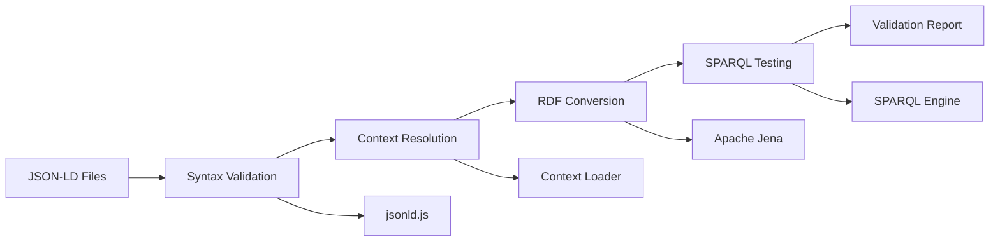

# JSON-LD Schema Alignment Technical Specification

## 1. Product Overview

This technical specification defines the comprehensive alignment and standardization of JSON-LD schema files in the huijoohwee.github.io/schema directory to ensure semantic web readiness, RDF conversion compatibility, and SPARQL query optimization.

The project addresses critical inconsistencies in the current schema system and establishes a production-ready semantic web infrastructure that supports multi-agent orchestration, knowledge graph construction, and cross-layer semantic interoperability.

## 2. Core Features

### 2.1 Current State Analysis

#### Critical Issues Identified

| Issue Category | Specific Problems | Impact Level |
|----------------|------------------|--------------|
| **@context Inconsistencies** | Varying @context structures across files, inconsistent namespace declarations | High |
| **Version Management** | Missing @version 1.1 specifications, inconsistent versioning | High |
| **Namespace Alignment** | Inconsistent prefix declarations, missing standard RDF namespaces | High |
| **Type Definitions** | Missing proper @type declarations, inconsistent class hierarchies | Critical |
| **Property Specifications** | Missing domain/range specifications, inconsistent @container usage | High |
| **RDF Compliance** | Non-standard property definitions, missing @graph structures | Critical |
| **Metadata Structure** | Inconsistent metadata schemas across files | Medium |
| **SPARQL Readiness** | Structure not optimized for SPARQL queries | High |

#### File-Specific Analysis

| File | Primary Issues | Priority |
|------|----------------|----------|
| **base.jsonld** | Foundation inconsistencies, missing standard namespaces | Critical |
| **vocab.jsonld** | Inconsistent term definitions, missing property ranges | High |
| **core.jsonld** | Missing @graph structure, inconsistent class definitions | High |
| **nqds.jsonld** | Complex @graph structure needs optimization | Medium |
| **jdbl.jsonld** | Missing property domain/range specifications | High |
| **jjnhm.jsonld** | Missing @version, inconsistent @context | High |
| **uc.jsonld** | Inconsistent concept definitions | Medium |
| **kg.jsonld** | Missing proper RDF property definitions | High |
| **wf.jsonld** | Incomplete class hierarchy | Medium |

### 2.2 Alignment Requirements

#### Standardized @context Structure

**Base Context Template:**
```json
{
  "@context": {
    "@version": 1.1,
    "@base": "https://huijoohwee.github.io/schema/base.jsonld",
    "@vocab": "https://huijoohwee.github.io/schema/vocab.jsonld",
    
    "rdf": "http://www.w3.org/1999/02/22-rdf-syntax-ns#",
    "rdfs": "http://www.w3.org/2000/01/rdf-schema#",
    "xsd": "http://www.w3.org/2001/XMLSchema#",
    "owl": "http://www.w3.org/2002/07/owl#",
    "skos": "http://www.w3.org/2004/02/skos/core#",
    "dcterms": "http://purl.org/dc/terms/",
    
    "core": "https://huijoohwee.github.io/schema/core.jsonld#",
    "uc": "https://huijoohwee.github.io/schema/uc.jsonld#",
    "wf": "https://huijoohwee.github.io/schema/wf.jsonld#",
    "kg": "https://huijoohwee.github.io/schema/kg.jsonld#"
  }
}
```

#### RDF-Compliant Type System

**Class Definition Standard:**
```json
{
  "@id": "namespace:ClassName",
  "@type": "rdfs:Class",
  "rdfs:label": "Human Readable Label",
  "rdfs:comment": "Detailed description",
  "rdfs:subClassOf": "parent:Class",
  "owl:equivalentClass": "external:EquivalentClass"
}
```

**Property Definition Standard:**
```json
{
  "@id": "namespace:propertyName",
  "@type": "rdf:Property",
  "rdfs:label": "Property Label",
  "rdfs:comment": "Property description",
  "rdfs:domain": "namespace:DomainClass",
  "rdfs:range": "namespace:RangeClass",
  "owl:equivalentProperty": "external:EquivalentProperty"
}
```

#### Metadata Schema Standardization

**Required Metadata Fields:**
- `dcterms:title`: Human-readable title
- `dcterms:description`: Detailed description
- `dcterms:created`: Creation timestamp (xsd:dateTime)
- `dcterms:modified`: Last modification timestamp (xsd:dateTime)
- `dcterms:creator`: Creator/maintainer IRI
- `dcterms:license`: License IRI
- `owl:versionInfo`: Semantic version string

### 2.3 SPARQL Optimization Requirements

#### Query-Friendly Structure Design

**Index Properties:**
- All classes must have `rdfs:label` and `rdfs:comment`
- Properties must have explicit `rdfs:domain` and `rdfs:range`
- Use `skos:prefLabel` for primary labels
- Use `skos:altLabel` for alternative labels

**Relationship Modeling:**
- Use explicit object properties for entity relationships
- Implement proper inverse relationships with `owl:inverseOf`
- Use `rdfs:subPropertyOf` for property hierarchies

## 3. Core Process

### 3.1 Implementation Workflow

**Phase 1: Foundation Alignment**
1. Update base.jsonld with standardized @context and namespace declarations
2. Establish consistent metadata schema across all files
3. Implement proper @version 1.1 specifications

**Phase 2: Vocabulary Standardization**
1. Align vocab.jsonld with RDF property/class standards
2. Update core.jsonld with proper @graph structure
3. Standardize uc.jsonld concept definitions

**Phase 3: Specialized Schema Updates**
1. Optimize nqds.jsonld for semantic graph processing
2. Enhance jdbl.jsonld with proper domain/range specifications
3. Update jjnhm.jsonld with consistent layer definitions

**Phase 4: Domain-Specific Alignment**
1. Update actions.jsonld, agents.jsonld, features.jsonld
2. Align project-areas.jsonld and project-issues.jsonld
3. Standardize ui-ux-elements.jsonld

**Phase 5: Validation and Testing**
1. RDF conversion validation using rdflib
2. SPARQL query testing with sample queries
3. JSON-LD context resolution verification

```mermaid
graph TD
    A[Phase 1: Foundation] --> B[Phase 2: Vocabulary]
    B --> C[Phase 3: Specialized]
    C --> D[Phase 4: Domain-Specific]
    D --> E[Phase 5: Validation]
    
    A --> A1[base.jsonld]
    A --> A2[Metadata Schema]
    A --> A3[@version 1.1]
    
    B --> B1[vocab.jsonld]
    B --> B2[core.jsonld]
    B --> B3[uc.jsonld]
    
    C --> C1[nqds.jsonld]
    C --> C2[jdbl.jsonld]
    C --> C3[jjnhm.jsonld]
    
    D --> D1[actions.jsonld]
    D --> D2[agents.jsonld]
    D --> D3[Other domain files]
    
    E --> E1[RDF Validation]
    E --> E2[SPARQL Testing]
    E --> E3[Context Resolution]
```

### 3.2 Quality Assurance Process

**Validation Criteria:**
1. **JSON-LD Syntax**: Valid JSON-LD 1.1 syntax
2. **RDF Conversion**: Successful conversion to RDF triples
3. **Context Resolution**: All @context references resolve correctly
4. **SPARQL Compatibility**: Sample queries execute successfully
5. **Ontology Alignment**: Proper class/property hierarchies

**Testing Approach:**
1. Automated JSON-LD validation using jsonld.js
2. RDF conversion testing with Apache Jena
3. SPARQL endpoint testing with sample queries
4. Cross-reference validation between files

## 4. User Interface Design

### 4.1 Design Style

**Schema Documentation Interface:**
- **Primary Colors**: #2563eb (blue), #059669 (green), #dc2626 (red)
- **Typography**: Inter font family, 14px base size
- **Layout**: Clean, hierarchical structure with clear sections
- **Icons**: Feather icons for consistency
- **Code Blocks**: Syntax highlighting for JSON-LD, SPARQL, and RDF

### 4.2 Page Design Overview

| Component | Design Elements | Purpose |
|-----------|----------------|---------|
| **Schema Browser** | Tree navigation, expandable sections, search functionality | Navigate schema hierarchy |
| **Validation Dashboard** | Status indicators, error reports, success metrics | Monitor schema health |
| **SPARQL Query Interface** | Query editor, result visualization, sample queries | Test SPARQL compatibility |
| **RDF Visualization** | Graph rendering, node/edge styling, zoom controls | Visualize semantic relationships |

### 4.3 Responsiveness

**Desktop-First Design:**
- Optimized for development environments
- Multi-panel layout for schema editing
- Responsive breakpoints at 1024px, 768px, 480px
- Touch-friendly controls for tablet/mobile access

## 5. Technical Architecture

### 5.1 Schema Validation Pipeline



### 5.2 Implementation Tools

**Required Dependencies:**
- `jsonld`: JSON-LD processing and validation
- `rdflib`: RDF manipulation and SPARQL queries
- `@types/jsonld`: TypeScript definitions
- `jest`: Testing framework
- `eslint`: Code quality

**Validation Scripts:**
- `validate-jsonld.js`: JSON-LD syntax and context validation
- `test-rdf-conversion.js`: RDF conversion testing
- `test-sparql-queries.js`: SPARQL compatibility testing
- `generate-docs.js`: Schema documentation generation

### 5.3 Continuous Integration

**GitHub Actions Workflow:**
1. JSON-LD syntax validation on every commit
2. RDF conversion testing for pull requests
3. SPARQL query testing for releases
4. Automated documentation generation

## 6. Success Metrics

### 6.1 Technical KPIs

| Metric | Target | Measurement |
|--------|--------|-------------|
| **JSON-LD Validation** | 100% pass rate | All files validate successfully |
| **RDF Conversion** | 100% success | All files convert to valid RDF |
| **Context Resolution** | 100% success | All @context references resolve |
| **SPARQL Queries** | 95% success rate | Sample queries execute correctly |
| **Schema Coverage** | 100% documented | All classes/properties documented |

### 6.2 Quality Gates

**Pre-Deployment Checklist:**
- [ ] All JSON-LD files validate with jsonld.js
- [ ] RDF conversion produces valid triples
- [ ] SPARQL queries return expected results
- [ ] Cross-file references resolve correctly
- [ ] Documentation is complete and accurate

## 7. Migration Guide

### 7.1 Breaking Changes

**@context Structure Changes:**
- Addition of @version 1.1 requirement
- Standardization of namespace prefixes
- Addition of standard RDF namespaces

**Property Definition Changes:**
- Addition of rdfs:domain and rdfs:range
- Standardization of @type annotations
- Migration from custom to standard RDF properties

### 7.2 Migration Steps

1. **Backup Current Schema**: Create backup of existing files
2. **Update Base Context**: Apply new @context structure
3. **Migrate Properties**: Add domain/range specifications
4. **Update References**: Fix cross-file references
5. **Validate Changes**: Run validation pipeline
6. **Update Documentation**: Regenerate schema docs

### 7.3 Rollback Plan

**Emergency Rollback Procedure:**
1. Restore from backup files
2. Revert @context changes
3. Update dependent systems
4. Validate rollback success

This specification ensures the JSON-LD schema system becomes a robust, standards-compliant semantic web infrastructure ready for production use, RDF processing, and SPARQL querying.