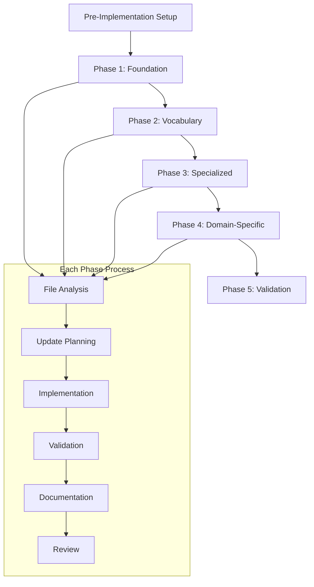

# JSON-LD Schema Implementation Plan

## 1. Product Overview

This implementation plan provides detailed, actionable steps for aligning and updating all JSON-LD schema files in the huijoohwee.github.io/schema directory. The plan ensures systematic transformation from the current inconsistent state to a production-ready semantic web infrastructure.

The implementation follows a phased approach that minimizes disruption while maximizing semantic web compatibility, RDF conversion success, and SPARQL query optimization.

## 2. Core Features

### 2.1 Implementation Phases

#### Phase 1: Foundation Alignment (Priority: Critical)

**Objective**: Establish consistent foundation across all schema files

**Tasks**:
1. **Update base.jsonld** - Standardize core @context structure
2. **Implement @version 1.1** - Add JSON-LD 1.1 version specification
3. **Standardize namespaces** - Align all namespace declarations
4. **Create metadata schema** - Establish consistent metadata structure

**Deliverables**:
- Updated base.jsonld with standardized @context
- Namespace alignment document
- Metadata schema template

#### Phase 2: Vocabulary Standardization (Priority: High)

**Objective**: Align vocabulary files with RDF standards

**Tasks**:
1. **Restructure vocab.jsonld** - Add proper @graph structure and RDF compliance
2. **Update core.jsonld** - Implement proper class/property definitions
3. **Standardize uc.jsonld** - Align universal concepts with RDF standards

**Deliverables**:
- RDF-compliant vocabulary definitions
- Proper class hierarchies
- Standardized property definitions with domain/range

#### Phase 3: Specialized Schema Updates (Priority: High)

**Objective**: Optimize specialized schemas for semantic processing

**Tasks**:
1. **Enhance nqds.jsonld** - Optimize for semantic graph processing
2. **Update jdbl.jsonld** - Add proper domain/range specifications
3. **Align jjnhm.jsonld** - Standardize layer definitions and contracts

**Deliverables**:
- Optimized semantic graph schemas
- Enhanced directive metadata schemas
- Aligned multi-layer architecture definitions

#### Phase 4: Domain-Specific Alignment (Priority: Medium)

**Objective**: Update domain-specific schemas for consistency

**Tasks**:
1. **Update actions.jsonld** - Align with standardized @context
2. **Update agents.jsonld** - Add proper RDF type definitions
3. **Update remaining domain files** - Apply consistent patterns

**Deliverables**:
- Aligned domain-specific schemas
- Consistent cross-file references
- Standardized type definitions

#### Phase 5: Validation and Testing (Priority: Critical)

**Objective**: Ensure semantic web readiness and SPARQL compatibility

**Tasks**:
1. **RDF conversion validation** - Test all files convert to valid RDF
2. **SPARQL query testing** - Verify query compatibility
3. **Context resolution testing** - Ensure all references resolve
4. **Cross-file validation** - Verify reference integrity

**Deliverables**:
- Validation test suite
- SPARQL query examples
- Quality assurance report

### 2.2 File-Specific Updates

#### Critical Files (Phase 1-2)

| File | Updates Required | Implementation Priority |
|------|------------------|------------------------|
| **base.jsonld** | @context standardization, namespace alignment | 1 |
| **vocab.jsonld** | @graph structure, RDF property definitions | 2 |
| **core.jsonld** | Class hierarchy, property domain/range | 3 |

#### High Priority Files (Phase 3)

| File | Updates Required | Implementation Priority |
|------|------------------|------------------------|
| **nqds.jsonld** | Semantic graph optimization, property alignment | 4 |
| **jdbl.jsonld** | Domain/range specifications, RDF compliance | 5 |
| **jjnhm.jsonld** | @version addition, layer standardization | 6 |

#### Medium Priority Files (Phase 4)

| File | Updates Required | Implementation Priority |
|------|------------------|------------------------|
| **uc.jsonld** | Concept definition alignment | 7 |
| **kg.jsonld** | Property definition enhancement | 8 |
| **wf.jsonld** | Class hierarchy completion | 9 |
| **actions.jsonld** | @context alignment | 10 |
| **agents.jsonld** | Type definition standardization | 11 |
| **features.jsonld** | RDF compliance updates | 12 |

### 2.3 Validation Requirements

#### JSON-LD Validation Criteria

**Syntax Validation**:
- Valid JSON-LD 1.1 syntax
- Proper @context structure
- Correct @type annotations
- Valid @container specifications

**Semantic Validation**:
- Resolvable @context references
- Consistent namespace usage
- Proper class/property relationships
- Valid cross-file references

#### RDF Conversion Requirements

**Triple Generation**:
- All entities generate valid RDF triples
- Proper subject-predicate-object structure
- Correct datatype specifications
- Valid IRI generation

**SPARQL Compatibility**:
- Queryable class hierarchies
- Accessible property relationships
- Efficient query execution
- Proper result formatting

## 3. Core Process

### 3.1 Implementation Workflow

**Pre-Implementation Setup**:
1. Create backup of all existing schema files
2. Set up validation environment with required tools
3. Establish testing framework for RDF/SPARQL validation
4. Create implementation tracking system

**Phase Execution Process**:
1. **File Analysis** - Review current state and identify specific issues
2. **Update Planning** - Create detailed update specification for each file
3. **Implementation** - Apply updates following standardized patterns
4. **Validation** - Test JSON-LD syntax, RDF conversion, and SPARQL compatibility
5. **Documentation** - Update documentation and examples
6. **Review** - Conduct peer review and quality assurance



### 3.2 Quality Assurance Process

**Validation Pipeline**:
1. **Syntax Check** - JSON-LD syntax validation using jsonld.js
2. **Context Resolution** - Verify all @context references resolve
3. **RDF Conversion** - Test conversion to RDF triples
4. **SPARQL Testing** - Execute sample queries
5. **Cross-Reference Check** - Validate inter-file references

**Testing Strategy**:
- Automated validation on every file update
- Regression testing for existing functionality
- Performance testing for large-scale queries
- Integration testing across all schema files

## 4. User Interface Design

### 4.1 Implementation Dashboard

**Progress Tracking Interface**:
- **Primary Colors**: #10b981 (success), #f59e0b (warning), #ef4444 (error)
- **Layout**: Kanban-style board with phase columns
- **Progress Indicators**: Completion percentages and status badges
- **File Status**: Color-coded indicators for each schema file

### 4.2 Validation Interface

| Component | Design Elements | Functionality |
|-----------|----------------|---------------|
| **Validation Dashboard** | Status grid, error summaries, success metrics | Real-time validation status |
| **Error Details** | Expandable error cards, line-by-line highlighting | Detailed error information |
| **Test Results** | Tabular results, query execution times | SPARQL and RDF test outcomes |
| **Progress Tracker** | Phase completion bars, file status indicators | Implementation progress |

### 4.3 Documentation Interface

**Schema Documentation Portal**:
- Interactive schema browser with search functionality
- Visual graph representation of class/property relationships
- Example queries and usage patterns
- Migration guides and best practices

## 5. Technical Implementation Details

### 5.1 Standardized @context Template

**Base Context Structure**:
```json
{
  "@context": {
    "@version": 1.1,
    "@base": "https://huijoohwee.github.io/schema/base.jsonld",
    "@vocab": "https://huijoohwee.github.io/schema/vocab.jsonld",
    
    "rdf": "http://www.w3.org/1999/02/22-rdf-syntax-ns#",
    "rdfs": "http://www.w3.org/2000/01/rdf-schema#",
    "xsd": "http://www.w3.org/2001/XMLSchema#",
    "owl": "http://www.w3.org/2002/07/owl#",
    "skos": "http://www.w3.org/2004/02/skos/core#",
    "dcterms": "http://purl.org/dc/terms/",
    
    "core": "https://huijoohwee.github.io/schema/core.jsonld#",
    "uc": "https://huijoohwee.github.io/schema/uc.jsonld#",
    "wf": "https://huijoohwee.github.io/schema/wf.jsonld#",
    "kg": "https://huijoohwee.github.io/schema/kg.jsonld#",
    "nqds": "https://huijoohwee.github.io/schema/nqds.jsonld#",
    "jdbl": "https://huijoohwee.github.io/schema/jdbl.jsonld#",
    "jjnhm": "https://huijoohwee.github.io/schema/jjnhm.jsonld#",
    "hbs": "https://huijoohwee.github.io/schema/hbs.jsonld#",
    "mmd": "https://huijoohwee.github.io/schema/mmd.jsonld#"
  }
}
```

### 5.2 RDF Class Definition Pattern

**Standard Class Definition**:
```json
{
  "@id": "namespace:ClassName",
  "@type": "rdfs:Class",
  "rdfs:label": "Human Readable Class Name",
  "rdfs:comment": "Detailed description of the class purpose and usage",
  "rdfs:subClassOf": "parent:ParentClass",
  "owl:equivalentClass": "external:EquivalentClass",
  "dcterms:created": "2025-01-15T00:00:00Z",
  "dcterms:modified": "2025-01-15T00:00:00Z"
}
```

### 5.3 RDF Property Definition Pattern

**Standard Property Definition**:
```json
{
  "@id": "namespace:propertyName",
  "@type": "rdf:Property",
  "rdfs:label": "Property Label",
  "rdfs:comment": "Detailed property description",
  "rdfs:domain": "namespace:DomainClass",
  "rdfs:range": "namespace:RangeClass",
  "owl:equivalentProperty": "external:EquivalentProperty",
  "rdfs:subPropertyOf": "parent:ParentProperty"
}
```

### 5.4 Metadata Schema Template

**Required Metadata Fields**:
```json
{
  "meta": {
    "dcterms:title": "Schema Title",
    "dcterms:description": "Detailed schema description",
    "dcterms:created": "2025-01-15T00:00:00Z",
    "dcterms:modified": "2025-01-15T00:00:00Z",
    "dcterms:creator": "https://github.com/huijoohwee",
    "dcterms:license": "https://opensource.org/licenses/MIT",
    "owl:versionInfo": "1.0.0",
    "dcterms:conformsTo": "https://www.w3.org/TR/json-ld11/"
  }
}
```

## 6. Risk Management

### 6.1 Implementation Risks

| Risk | Impact | Mitigation Strategy |
|------|--------|-------------------|
| **Breaking Changes** | High | Comprehensive backup and rollback plan |
| **Context Resolution Failures** | High | Staged deployment with validation |
| **Performance Degradation** | Medium | Performance testing and optimization |
| **Cross-File Reference Breaks** | High | Automated reference validation |

### 6.2 Rollback Procedures

**Emergency Rollback Plan**:
1. Immediate restoration from backup files
2. Revert @context changes in dependent systems
3. Update documentation to reflect rollback
4. Conduct post-rollback validation
5. Root cause analysis and prevention planning

## 7. Success Criteria

### 7.1 Technical Validation

**Completion Criteria**:
- [ ] All 19 schema files validate with JSON-LD 1.1 syntax
- [ ] 100% successful RDF conversion rate
- [ ] All @context references resolve correctly
- [ ] Sample SPARQL queries execute successfully
- [ ] Cross-file references maintain integrity
- [ ] Performance benchmarks meet requirements

### 7.2 Quality Metrics

| Metric | Target | Measurement Method |
|--------|--------|--------------------|
| **Validation Success Rate** | 100% | Automated validation pipeline |
| **RDF Triple Generation** | 100% success | RDF conversion testing |
| **SPARQL Query Success** | 95%+ | Query execution testing |
| **Context Resolution** | 100% | Context loading validation |
| **Documentation Coverage** | 100% | Schema documentation audit |

This implementation plan provides the detailed roadmap for transforming the JSON-LD schema system into a production-ready semantic web infrastructure that fully supports RDF processing, SPARQL querying, and standards-compliant semantic web operations.