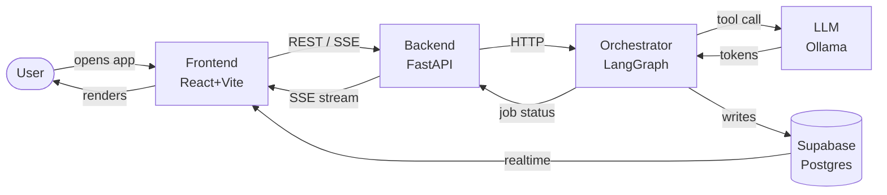
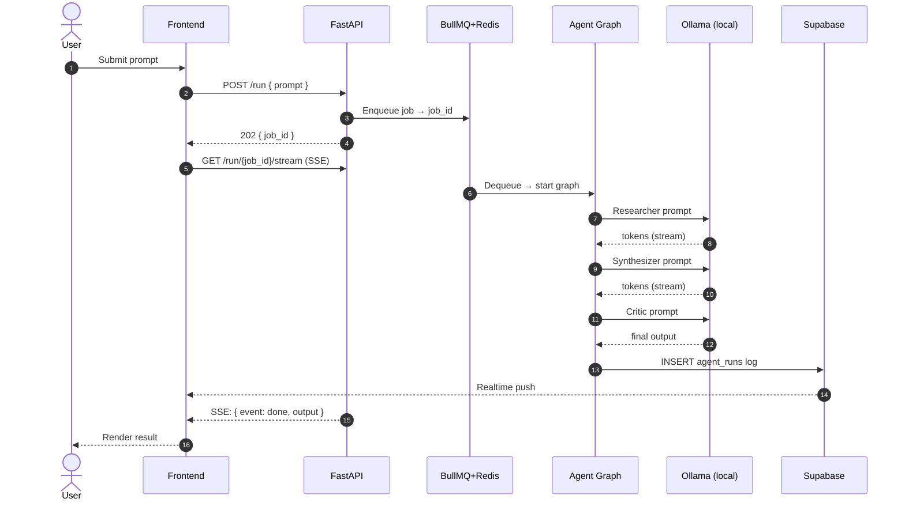
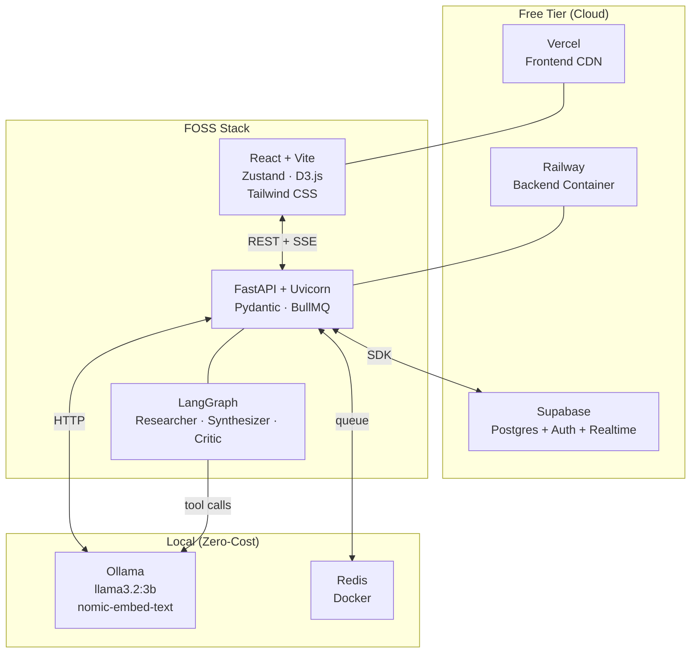

# Full-Stack 0→1 Critical Path Tracker
<!-- Universal · FOSS · Free Tier · Local-first · Solo Founder MVP · 3-Hour Sprint -->
<!-- Scope: Frontend → Backend → LLM → Multi-Agent Orchestration → Deploy -->

---

## Diagrams

### User Journey

### Data Flow

### Architecture

---

## Legend

### Layer Codes

| Code | Layer | Responsibility |
|------|-------|----------------|
| `F` | Frontend | UI, state, routing, visualisation |
| `B` | Backend | API, business logic, data access |
| `L` | LLM | Local inference, prompts, embeddings |
| `O` | Orchestration | Agent coordination, task routing, queues |
| `D` | DevOps / Infra | Docker, CI/CD, env, deploy |
| `DA` | Data Layer | DB schema, migrations, realtime |
| `UX` | UX / Design | Styling, polish, accessibility |
| `SEC` | Security / Auth | Auth, RBAC, JWT, RLS |

### Phase Clock

| Code | Phase | Sprint Window | Budget |
|------|-------|---------------|--------|
| `0` | Pre-flight | T−00:30 → T+00:00 | 30 min |
| `1` | Scaffold | T+00:00 → T+00:30 | 30 min |
| `2` | Core Build | T+00:30 → T+01:30 | 60 min |
| `3` | Integration | T+01:30 → T+02:00 | 30 min |
| `4` | E2E & Polish | T+02:00 → T+02:30 | 30 min |
| `5` | Deploy | T+02:30 → T+03:00 | 30 min |

### Priority

| Code | Level | Rule |
|------|-------|------|
| `P1` | Critical Path | Ship or everything blocks |
| `P2` | Important | Ship if clock allows |
| `P3` | Backlog | Post-MVP iteration |

### Stack Constraint

| Code | Meaning | Examples |
|------|---------|---------|
| `OS` | Open Source | FastAPI, React, D3.js, LangGraph |
| `FT` | Free Tier | Supabase, Vercel, Railway |
| `LC` | Local / On-device | Ollama, Redis (Docker) |
| `HY` | Hybrid | Supabase (FT) + Ollama (LC) |

> **Category format:** `Layer, Phase, Priority, Stack` → e.g. `B,2,P1,OS`
> Multi-layer: `F+B,3,P1,OS` — Stack constraint applies left-to-right.

---

## Reference Stack Matrix

| Layer | Primary | Fallback | OS | FT | LC |
|-------|---------|---------|:--:|:--:|:--:|
| Frontend Framework | React + Vite | Next.js | ✓ | ✓ | ✓ |
| Styling | Tailwind CSS v4 | UnoCSS | ✓ | ✓ | ✓ |
| State Management | Zustand | Jotai | ✓ | ✓ | ✓ |
| Visualisation | D3.js | Observable Plot | ✓ | ✓ | ✓ |
| Streaming UI | EventSource (SSE) | WebSocket | ✓ | ✓ | ✓ |
| Backend API | FastAPI + Uvicorn | Hono (TS) | ✓ | ✓ | ✓ |
| Schema Validation | Pydantic v2 | Zod (TS) | ✓ | ✓ | ✓ |
| Database | Supabase Postgres | PocketBase | ✓ | ✓ | — |
| Realtime | Supabase Realtime | Socket.io | ✓ | ✓ | — |
| Auth | Supabase Auth | Lucia | ✓ | ✓ | — |
| LLM Runtime | Ollama | LM Studio | ✓ | — | ✓ |
| LLM Model | llama3.2:3b | mistral:7b | ✓ | — | ✓ |
| Embeddings | nomic-embed-text | mxbai-embed-large | ✓ | — | ✓ |
| LLM Framework | LangChain | LlamaIndex | ✓ | ✓ | ✓ |
| Agent Framework | LangGraph | Autogen | ✓ | ✓ | ✓ |
| Task Queue | BullMQ + Redis | RQ + Redis | ✓ | — | ✓ |
| Container | Docker Compose | Podman Compose | ✓ | ✓ | ✓ |
| Frontend Deploy | Vercel | Netlify | — | ✓ | — |
| Backend Deploy | Railway | Render | — | ✓ | — |
| CI/CD | GitHub Actions | Forgejo | ✓ | ✓ | — |

---

## Phase 0 — Pre-flight `T−00:30 → T+00:00`

| # | Task | Status | Window | Category | Tool | Est |
|---|------|--------|--------|----------|------|-----|
| 001 | Verify Node.js ≥20 (`node -v`) | Todo | T−00:30 | D,0,P1,OS | nvm | 2m |
| 002 | Verify Python ≥3.11 (`python --version`) | Todo | T−00:30 | D,0,P1,OS | pyenv | 2m |
| 003 | Verify Git installed (`git --version`) | Todo | T−00:29 | D,0,P1,OS | git | 1m |
| 004 | Verify Docker Desktop running | Todo | T−00:28 | D,0,P1,OS | docker | 2m |
| 005 | Install Ollama (`brew install ollama` / apt) | Todo | T−00:26 | D,0,P1,LC | ollama | 5m |
| 006 | Pull LLM model: `ollama pull llama3.2:3b` | Todo | T−00:21 | L,0,P1,LC | ollama | 10m |
| 007 | Pull embedding: `ollama pull nomic-embed-text` | Todo | T−00:11 | L,0,P1,LC | ollama | 5m |
| 008 | Create Supabase project (free tier dashboard) | Todo | T−00:06 | DA,0,P1,FT | supabase | 5m |
| 009 | Copy Supabase URL + anon key to clipboard | Todo | T−00:01 | DA,0,P1,FT | supabase | 1m |
| 010 | Create private GitHub repo + clone locally | Todo | T+00:00 | D,0,P1,OS | git | 3m |
| 011 | Create `.env` + `.env.example` (keys skeleton) | Todo | T+00:00 | D,0,P1,OS | dotenv | 2m |
| 012 | Create `.gitignore` (node / python / .env) | Todo | T+00:00 | D,0,P1,OS | git | 1m |

---

## Phase 1 — Scaffold `T+00:00 → T+00:30`

| # | Task | Status | Window | Category | Tool | Est |
|---|------|--------|--------|----------|------|-----|
| 013 | `mkdir backend && cd backend` | Todo | T+00:00 | B,1,P1,OS | shell | 1m |
| 014 | `python -m venv .venv && source .venv/bin/activate` | Todo | T+00:01 | B,1,P1,OS | pyenv | 2m |
| 015 | `pip install fastapi uvicorn supabase httpx python-dotenv` | Todo | T+00:03 | B,1,P1,OS | pip | 3m |
| 016 | Create `main.py` (FastAPI instance + lifespan) | Todo | T+00:06 | B,1,P1,OS | fastapi | 3m |
| 017 | Add `GET /health` endpoint → `{"status":"ok"}` | Todo | T+00:09 | B,1,P1,OS | fastapi | 2m |
| 018 | Add `CORSMiddleware` (allow all origins for dev) | Todo | T+00:11 | B,1,P1,OS | fastapi | 2m |
| 019 | Create `config.py` (Pydantic BaseSettings + .env) | Todo | T+00:13 | B,1,P1,OS | pydantic | 3m |
| 020 | Scaffold dirs: `routers/ services/ models/ prompts/ agents/` | Todo | T+00:16 | B,1,P1,OS | shell | 1m |
| 021 | Smoke test: `uvicorn main:app --reload` → `/health` 200 | Todo | T+00:17 | B,1,P1,OS | uvicorn | 2m |
| 022 | `npm create vite@latest frontend -- --template react` | Todo | T+00:19 | F,1,P1,OS | vite | 3m |
| 023 | `npm install` (node_modules) | Todo | T+00:22 | F,1,P1,OS | npm | 2m |
| 024 | `npm install tailwindcss @tailwindcss/vite` + configure | Todo | T+00:24 | F,1,P1,OS | tailwind | 3m |
| 025 | `npm install zustand react-router-dom d3 sonner` | Todo | T+00:27 | F,1,P1,OS | npm | 2m |
| 026 | Create `src/api/client.js` (base fetch + error wrapper) | Todo | T+00:29 | F,1,P1,OS | js | 4m |
| 027 | Create `src/store/appStore.js` (Zustand root store) | Todo | T+00:33 | F,1,P1,OS | zustand | 4m |
| 028 | Setup `App.jsx` with `BrowserRouter` + route skeleton | Todo | T+00:37 | F,1,P1,OS | react | 3m |
| 029 | Create `docker-compose.yml` (redis:7-alpine service) | Todo | T+00:40 | D,1,P1,LC | docker | 4m |
| 030 | `docker compose up -d` (start Redis) | Todo | T+00:44 | D,1,P1,LC | docker | 2m |
| 031 | Create Supabase table: `projects` (id, name, desc, created_at) | Todo | T+00:46 | DA,1,P1,FT | supabase | 3m |
| 032 | Create Supabase table: `tasks` (id, project_id, content, status) | Todo | T+00:49 | DA,1,P1,FT | supabase | 3m |
| 033 | Create Supabase table: `agent_runs` (id, task_id, agent, output, ts) | Todo | T+00:52 | DA,1,P1,FT | supabase | 3m |
| 034 | Enable Row Level Security on all three tables | Todo | T+00:55 | DA,1,P1,FT | supabase | 3m |
| 035 | Verify DB connection: `from supabase import create_client` | Todo | T+00:58 | DA,1,P1,FT | supabase-py | 2m |

---

## Phase 2 — Core Build `T+00:30 → T+01:30`

| # | Task | Status | Window | Category | Tool | Est |
|---|------|--------|--------|----------|------|-----|
| 036 | Create `services/db.py` (Supabase client singleton) | Todo | T+01:00 | B,2,P1,HY | supabase-py | 3m |
| 037 | Create `models/project.py` (Pydantic: Project, ProjectCreate) | Todo | T+01:03 | B,2,P1,OS | pydantic | 4m |
| 038 | Create `models/task.py` (Pydantic: Task, TaskCreate, TaskStatus) | Todo | T+01:07 | B,2,P1,OS | pydantic | 4m |
| 039 | Create `models/agent_run.py` (Pydantic: AgentRun, RunStatus) | Todo | T+01:11 | B,2,P1,OS | pydantic | 3m |
| 040 | Create `routers/projects.py` (CRUD: list / get / create / update / delete) | Todo | T+01:14 | B,2,P1,OS | fastapi | 10m |
| 041 | Create `routers/tasks.py` (CRUD) | Todo | T+01:24 | B,2,P1,OS | fastapi | 8m |
| 042 | Mount routers in `main.py` with `/api/v1` prefix | Todo | T+01:32 | B,2,P1,OS | fastapi | 2m |
| 043 | Smoke test CRUD via `/docs` (Swagger UI) | Todo | T+01:34 | B,2,P1,OS | fastapi | 4m |
| 044 | Create `services/llm_client.py` (Ollama HTTP via httpx) | Todo | T+01:38 | L,2,P1,LC | httpx | 5m |
| 045 | Add `generate(prompt) → str` (sync, non-streaming) | Todo | T+01:43 | L,2,P1,LC | ollama | 4m |
| 046 | Add `stream_generate(prompt) → AsyncIterator[str]` (SSE) | Todo | T+01:47 | L,2,P1,LC | ollama | 8m |
| 047 | Create `routers/llm.py` (`POST /generate`, `GET /stream`) | Todo | T+01:55 | L,2,P1,LC | fastapi | 5m |
| 048 | Create `services/embeddings.py` (`embed_text(content) → list[float]`) | Todo | T+02:00 | L,2,P1,LC | ollama | 5m |
| 049 | Create `prompts/base.py` (system prompt template dataclass) | Todo | T+02:05 | L,2,P1,OS | python | 4m |
| 050 | Create `prompts/tasks.py` (researcher / synthesizer / critic templates) | Todo | T+02:09 | L,2,P1,OS | python | 5m |
| 051 | Add token estimate util (`len(text) // 4` fast approx) | Todo | T+02:14 | L,2,P1,OS | python | 2m |
| 052 | `pip install langgraph langchain-community` | Todo | T+02:16 | O,2,P1,OS | pip | 2m |
| 053 | Create `agents/base.py` (abstract `BaseAgent` + `run()`) | Todo | T+02:18 | O,2,P1,OS | langgraph | 8m |
| 054 | Create `agents/researcher.py` (context search + summarise) | Todo | T+02:26 | O,2,P1,OS | langgraph | 10m |
| 055 | Create `agents/synthesizer.py` (draft structured output) | Todo | T+02:36 | O,2,P1,OS | langgraph | 10m |
| 056 | Create `agents/critic.py` (validate + score + suggest fixes) | Todo | T+02:46 | O,2,P1,OS | langgraph | 8m |
| 057 | Create `orchestrator.py` (StateGraph: researcher→synthesizer→critic) | Todo | T+02:54 | O,2,P1,OS | langgraph | 10m |
| 058 | Create `routers/orchestrate.py` (`POST /run` → job_id, `GET /run/{id}`) | Todo | T+03:04 | O,2,P1,OS | fastapi | 8m |
| 059 | Wire orchestrator to LLM client inside agent nodes | Todo | T+03:12 | O,2,P1,LC | langgraph | 4m |
| 060 | Test: `curl -X POST /api/v1/run` → job_id returned | Todo | T+03:16 | O,2,P1,OS | curl | 4m |
| 061 | Create `components/ChatInterface.jsx` (layout shell) | Todo | T+03:20 | F,2,P1,OS | react | 8m |
| 062 | Create `components/MessageList.jsx` (turn renderer) | Todo | T+03:28 | F,2,P1,OS | react | 5m |
| 063 | Create `components/InputBar.jsx` (textarea + send btn) | Todo | T+03:33 | F,2,P1,OS | react | 5m |
| 064 | Create `hooks/useSSE.js` (EventSource lifecycle wrapper) | Todo | T+03:38 | F,2,P1,OS | js | 8m |
| 065 | Create `components/StatusBadge.jsx` (agent phase pill) | Todo | T+03:46 | F,2,P1,OS | react | 3m |
| 066 | Create `components/LoadingSpinner.jsx` (CSS keyframe) | Todo | T+03:49 | F,2,P1,OS | react | 2m |
| 067 | Create `pages/Home.jsx` (project list + create form) | Todo | T+03:51 | F,2,P1,OS | react | 5m |
| 068 | Create `pages/Run.jsx` (orchestration run view + log) | Todo | T+03:56 | F,2,P1,OS | react | 5m |
| 069 | Wire Zustand store → `ChatInterface` + `MessageList` | Todo | T+04:01 | F,2,P1,OS | zustand | 5m |

---

## Phase 3 — Integration `T+01:30 → T+02:00`

| # | Task | Status | Window | Category | Tool | Est |
|---|------|--------|--------|----------|------|-----|
| 070 | Connect `InputBar` → `POST /api/v1/run` | Todo | T+04:06 | F+B,3,P1,OS | fetch | 5m |
| 071 | Open SSE stream `GET /run/{id}/stream` on job_id receipt | Todo | T+04:11 | F+B,3,P1,OS | EventSource | 5m |
| 072 | Render streaming tokens in `MessageList` as they arrive | Todo | T+04:16 | F+B,3,P1,OS | react | 8m |
| 073 | Connect project list → `GET /api/v1/projects` on mount | Todo | T+04:24 | F+B,3,P1,HY | fetch | 4m |
| 074 | Connect create-project form → `POST /api/v1/projects` | Todo | T+04:28 | F+B,3,P1,HY | fetch | 4m |
| 075 | Add `GET /run/{id}/status` endpoint (job phase + pct done) | Todo | T+04:32 | B+O,3,P1,OS | fastapi | 5m |
| 076 | Poll `/run/{id}/status` every 2s → update `StatusBadge` | Todo | T+04:37 | F+B,3,P1,OS | react | 5m |
| 077 | Display `agent_runs` log entries in `Run.jsx` panel | Todo | T+04:42 | F+B,3,P1,OS | react | 5m |
| 078 | Enable Supabase Realtime on `agent_runs` table | Todo | T+04:47 | DA,3,P2,FT | supabase | 3m |
| 079 | Create `hooks/useAgentLog.js` (Supabase realtime sub) | Todo | T+04:50 | F,3,P2,HY | supabase-js | 5m |
| 080 | Handle LLM timeout + retry (3× with backoff) in backend | Todo | T+04:55 | B,3,P1,OS | httpx | 5m |
| 081 | Fix CORS for frontend localhost origin | Todo | T+05:00 | B,3,P1,OS | fastapi | 2m |
| 082 | Add `422` validation error response serialiser | Todo | T+05:02 | B,3,P1,OS | fastapi | 2m |
| 083 | **Full E2E smoke test:** prompt → orchestrator → LLM → UI | Todo | T+05:04 | F+B,3,P1,OS | manual | 10m |

---

## Phase 4 — E2E & Polish `T+02:00 → T+02:30`

| # | Task | Status | Window | Category | Tool | Est |
|---|------|--------|--------|----------|------|-----|
| 084 | Dark mode toggle (Tailwind `dark:` + localStorage flag) | Todo | T+05:14 | UX,4,P2,OS | tailwind | 5m |
| 085 | Toast notifications via `sonner` (success / error) | Todo | T+05:19 | UX,4,P2,OS | sonner | 3m |
| 086 | `Ctrl+Enter` keyboard shortcut to submit prompt | Todo | T+05:22 | UX,4,P2,OS | react | 3m |
| 087 | Inline SVG empty-state illustration (no projects yet) | Todo | T+05:25 | UX,4,P2,OS | svg | 4m |
| 088 | Responsive layout: `sm` / `md` Tailwind breakpoints | Todo | T+05:29 | UX,4,P2,OS | tailwind | 5m |
| 089 | Set `<title>` + Vite favicon | Todo | T+05:34 | UX,4,P3,OS | vite | 2m |
| 090 | Create `components/GraphCanvas.jsx` (D3 mount + cleanup) | Todo | T+05:36 | F,4,P2,OS | d3 | 8m |
| 091 | Init D3 `forceSimulation` (nodes = agent_runs, links = deps) | Todo | T+05:44 | F,4,P2,OS | d3 | 10m |
| 092 | Render SVG `<circle>` + `<line>` elements from simulation | Todo | T+05:54 | F,4,P2,OS | d3 | 8m |
| 093 | Add `d3.zoom` pan + zoom behaviour | Todo | T+06:02 | F,4,P2,OS | d3 | 5m |
| 094 | Color-code nodes by agent type (researcher / synth / critic) | Todo | T+06:07 | F,4,P2,OS | d3 | 3m |
| 095 | Tooltip on node hover (agent label + output preview) | Todo | T+06:10 | F,4,P2,OS | d3 | 5m |
| 096 | Enable Supabase Auth (magic link email provider) | Todo | T+06:15 | SEC,4,P2,FT | supabase | 5m |
| 097 | Auth guard HOC → redirect unauthenticated to `/login` | Todo | T+06:20 | SEC,4,P2,OS | react | 5m |
| 098 | Pass `Authorization: Bearer <token>` header in all API calls | Todo | T+06:25 | SEC,4,P2,HY | fetch | 3m |
| 099 | FastAPI `Depends(get_current_user)` JWT dependency | Todo | T+06:28 | SEC,4,P2,OS | fastapi | 5m |
| 100 | React global `ErrorBoundary` (catch render crashes) | Todo | T+06:33 | F,4,P2,OS | react | 4m |

---

## Phase 5 — Deploy `T+02:30 → T+03:00`

| # | Task | Status | Window | Category | Tool | Est |
|---|------|--------|--------|----------|------|-----|
| 101 | Create `backend/Dockerfile` (python:3.11-slim, multi-stage) | Todo | T+06:37 | D,5,P1,OS | docker | 5m |
| 102 | Create `.dockerignore` (.venv, __pycache__, .env) | Todo | T+06:42 | D,5,P1,OS | docker | 2m |
| 103 | Create `frontend/Dockerfile` (node build → nginx static) | Todo | T+06:44 | D,5,P1,OS | docker | 5m |
| 104 | Update `docker-compose.yml` (backend + frontend + redis) | Todo | T+06:49 | D,5,P1,OS | docker | 5m |
| 105 | `docker compose up --build` (full local stack validation) | Todo | T+06:54 | D,5,P1,OS | docker | 5m |
| 106 | Deploy backend: Railway → New Project → GitHub repo | Todo | T+06:59 | D,5,P1,FT | railway | 5m |
| 107 | Set Railway env vars (copy from `.env`) | Todo | T+07:04 | D,5,P1,FT | railway | 3m |
| 108 | Note Railway public URL (`<project>.up.railway.app`) | Todo | T+07:07 | D,5,P1,FT | railway | 1m |
| 109 | Deploy frontend: Vercel → Import GitHub repo | Todo | T+07:08 | D,5,P1,FT | vercel | 5m |
| 110 | Set Vercel env var: `VITE_API_URL=<railway-url>` | Todo | T+07:13 | D,5,P1,FT | vercel | 2m |
| 111 | Update FastAPI CORS: add Vercel domain to allow-list | Todo | T+07:15 | B,5,P1,OS | fastapi | 2m |
| 112 | Production smoke test: Vercel → Railway → Ollama (local) | Todo | T+07:17 | D,5,P1,OS | browser | 5m |
| 113 | Write `README.md` (env vars, `docker compose up`, demo GIF) | Todo | T+07:22 | D,5,P1,OS | markdown | 8m |

---

## P2 / P3 Backlog

| # | Task | Status | Category | Tool | Est |
|---|------|--------|----------|------|-----|
| 114 | Add `pgvector` extension → RAG similarity search | Todo | DA,—,P2,FT | supabase | 30m |
| 115 | Implement RAG pipeline (embed → store → retrieve) | Todo | L,—,P2,HY | langchain | 30m |
| 116 | Prompt caching layer (Redis TTL per prompt hash) | Todo | L,—,P2,LC | redis | 15m |
| 117 | Model hot-swap endpoint (`POST /llm/model`) | Todo | L,—,P3,LC | ollama | 20m |
| 118 | Agent memory (per-session conversation history store) | Todo | O,—,P2,OS | langgraph | 20m |
| 119 | Multi-step planning loop (ReAct pattern) | Todo | O,—,P2,OS | langgraph | 30m |
| 120 | Human-in-the-loop approval checkpoint | Todo | O,—,P3,OS | langgraph | 25m |
| 121 | Parallel agent execution (`asyncio.gather`) | Todo | O,—,P3,OS | python | 25m |
| 122 | Agent performance metrics dashboard (D3 bar charts) | Todo | O+F,—,P3,OS | d3 | 25m |
| 123 | Rate limiting middleware (`slowapi`) | Todo | B,—,P2,OS | slowapi | 10m |
| 124 | Structured logging (`structlog` JSON output) | Todo | B,—,P2,OS | structlog | 10m |
| 125 | OpenTelemetry tracing (Jaeger all-in-one Docker) | Todo | B,—,P3,OS | otel | 30m |
| 126 | Prometheus `/metrics` endpoint | Todo | B,—,P3,OS | prometheus | 15m |
| 127 | Export project data to JSON / CSV | Todo | F,—,P2,OS | js | 15m |
| 128 | Shareable project permalink (public read RLS) | Todo | F,—,P3,HY | supabase | 20m |
| 129 | Offline mode (Workbox service worker + IndexedDB) | Todo | F,—,P3,OS | workbox | 30m |
| 130 | Onboarding wizard (first-run 3-step modal) | Todo | UX,—,P3,OS | react | 20m |
| 131 | GitHub Actions CI (lint + pytest + vitest on PR) | Todo | D,—,P2,OS | github | 20m |
| 132 | Auto-deploy on push to `main` (Railway + Vercel hooks) | Todo | D,—,P2,FT | railway | 10m |
| 133 | Uptime monitoring (Better Uptime free tier) | Todo | D,—,P3,FT | betteruptime | 10m |
| 134 | Error tracking (Sentry DSN, free tier) | Todo | D,—,P2,FT | sentry | 10m |
| 135 | Scheduled DB backup (Supabase PITR + pg_dump cron) | Todo | DA,—,P3,FT | supabase | 5m |
| 136 | Multi-tenant org / workspace model | Todo | SEC,—,P3,HY | supabase | 30m |
| 137 | Role-based access control (RBAC via Supabase policies) | Todo | SEC,—,P3,HY | supabase | 25m |
| 138 | Audit log table + FastAPI middleware | Todo | SEC,—,P3,OS+FT | fastapi | 20m |

---

## Time Budget Summary

| Phase | Window | Budget | P1 Tasks | P1 Est Total | Slack |
|-------|--------|--------|----------|--------------|-------|
| 0 — Pre-flight | T−30 → T+0 | 30 min | 12 | 37m | −7m ⚠ |
| 1 — Scaffold | T+0 → T+30 | 30 min | 23 | 56m | −26m ⚠ |
| 2 — Core Build | T+30 → T+90 | 60 min | 34 | 114m | −54m ⚠ |
| 3 — Integration | T+90 → T+120 | 30 min | 11 | 45m | −15m ⚠ |
| 4 — E2E & Polish | T+120 → T+150 | 30 min | 4 | 20m | +10m ✓ |
| 5 — Deploy | T+150 → T+180 | 30 min | 13 | 48m | −18m ⚠ |
| **Total** | **3 hours** | **180 min** | **97** | **320m** | **−140m** |

> ⚠ **Solo founder reality check:** the 3-hour label is an ideal; realistic solo P1 completion is 5–6 hours.
> Mitigation: start Ollama model pull in Phase 0 before any other step (10m background).
> Skip Phase 4 UX entirely if behind clock — ship Phase 5 first.

---

<!-- EOF — 113 critical-path tasks + 25 backlog tasks = 138 total -->
