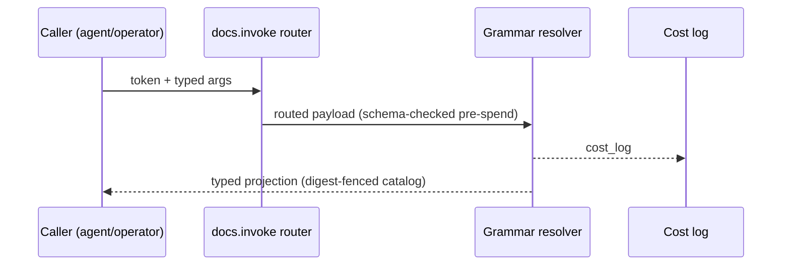
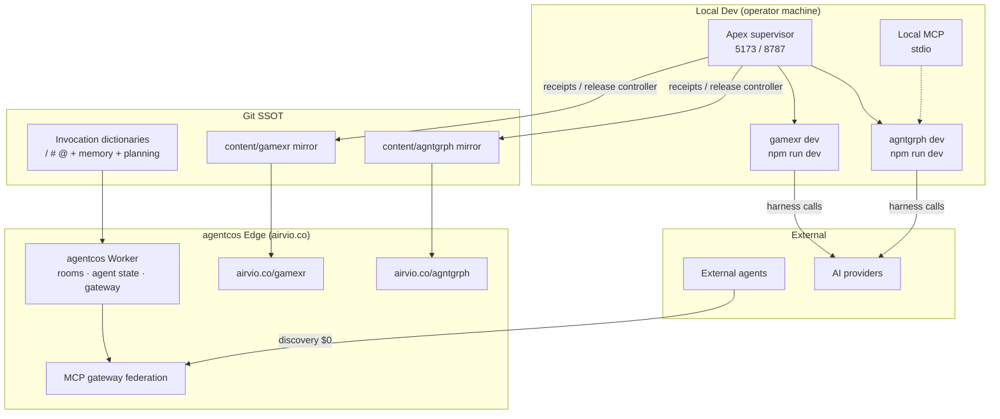

# Agentic OS (agentcos) — Tech Stack Document

**Context**: Solo-dev, AI-native startup. `agentcos` is the Agentic OS — the harness/orchestration plane that supervises, verifies, and delivers multiple target product repositories. First targets: `agntgrph` (knowledge-graph canvas product) and `gamexr` (game/XR product). Runtime topology: Dev (`GitHub/agntgrph`, `GitHub/gamexr`, `npm run dev`; Home Apex supervisor `npm run dev:apex`) → Prod mirrors (`GitHub/huijoohwee/content/agntgrph`, `GitHub/huijoohwee/content/gamexr`) → Delivery (`airvio.co`, `airvio.co/agntgrph`, `airvio.co/gamexr`).
**Intent**: Provide the end-to-end reference for agentcos user flow, orchestration/harness flow, workflow, and data flow — evaluated through the four compounding lenses (min-viable-max-value, TCO-zero, token economics, harness-first) and the governing ADLC execution contract (roles, budgets, gates, receipts).
**Directive**: Treat `agentic-canvas-os/docs` (Git, frontmatter-first) as the invocation and contract SSOT. Resolve `/`, `#`, `@` only through the three invocation dictionaries. Every AI pipeline runs in a typed harness with a cost log; every loop carries a max-iteration bound and circuit-breaker; every verdict comes from an Evaluator mechanism distinct from the Implementer; every promotion toward a delivered surface passes a closed-by-default Deploy Boundary.

### Reference Implementation Note

Every concrete product named in this document (Cloudflare, GitHub, Vite, React, Hono, Yjs, Playwright, …) is a **non-binding reference implementation** of a neutral function (edge delivery plane, source-control SSOT, local dev runtime, realtime CRDT relay, headless render adapter) and may be swapped for any equivalent. Vendor columns in comparisons are reference-implementation comparisons, never deploy commitments outside the lanes below.

### Naming Map

| Product token | Function | Current reference implementation |
|---|---|---|
| `agentcos` | Agentic OS: harness/orchestration plane over target repos | `GitHub/agentic-canvas-os` repo + `agentic-canvas-os/docs` SSOT; edge surface `airvio.co` |
| `agntgrph` | Target repo 1: knowledge-graph canvas product | `GitHub/agentic-graph`; prod mirror `content/agentic-graph`; current route `airvio.co/agentic-graph` (token target `airvio.co/agntgrph`) |
| `gamexr` | Target repo 2: game/XR product | `GitHub/GameXR`; prod mirror `content/gamexr`; route `airvio.co/gamexr` |

---

## Table of Contents

1. [Four-Lens Overview](#four-lens-overview)
2. [User Flow](#user-flow)
3. [Orchestration / Harness Flow](#orchestration--harness-flow)
4. [Workflow](#workflow)
5. [Data Flow](#data-flow)
6. [Topology](#topology)
7. [Component Stack](#component-stack)
8. [Infrastructure Comparison](#infrastructure-comparison)
9. [ADR Summary](#adr-summary)
10. [Token Economics](#token-economics)
11. [TCO Summary](#tco-summary)
12. [Time-to-Value](#time-to-value)
13. [Invocation Register](#invocation-register)
14. [Readiness Gap Matrix](#readiness-gap-matrix)
15. [Deploy Boundary Register](#deploy-boundary-register)
16. [Validation & VCCs](#validation--vccs)

---

## Four-Lens Overview

| Lens | Applied Constraint | Key Decision |
|---|---|---|
| **Min-Viable-Max-Value** | Smallest orchestration scope that ships value across N target repos | Thin harness over existing target-repo stacks; zero second data owner; edge state limited to Durable-Object key-value records |
| **TCO-Zero** | Every paid dependency justified vs FOSS; zero-egress default | Orchestration layer runs on free-tier edge Workers + Git SSOT; $0/month infra at current scale |
| **Token Economics** | Token spend measured at every pipeline boundary | Session start, status views, collaboration gate, release preflight: **0 model calls / $0**; model spend confined to target-repo harnesses under per-task budgets |
| **Harness-First** | Typed input → model → typed output + cost log for every AI call | Grammar-resolution harness; managed implementation runs with four bounds (token/iteration/wall-clock/context) and circuit-breakers; deterministic evaluators |

---

## User Flow

### Journey: Operator — Multi-Repo Orchestrated Delivery

| Stage | Action | Touchpoint | Pain Point | Opportunity |
|---|---|---|---|---|
| **Trigger** | Operator wants a change shipped in `agntgrph` and `gamexr` from one place | `/session.start` (local) or `airvio.co` surface | Per-repo manual pipelines; context drift between chats | agentcos supervises Dev → mirror → delivery for every target under one receipt chain |
| **Discover** | Find the right command/semantic/binding | `/`, `#`, `@` dictionaries (SHA-256 catalog digest) | Tool sprawl; undocumented routes | One invocation grammar shared across all target repos; zero-token discovery |
| **Engage** | Run managed implementation in a leased task worktree | `device:start` scoped-lane admission | Multi-agent write conflicts | Cloud CAS ledger + writer leases: one active writer per scope, disjoint lanes parallel |
| **Complete** | Protected integration + runtime reconciliation | `device:integrate` → `turn:end` | "Merged, but is it actually running?" | `runtime_ready` receipt binds exact revisions, checks, and live probes |
| **Return** | Resume with prior context intact | Memory log shards + planning records | Cold restart loses history | Append-only memory shards and immutable planning records survive sessions |

### Journey: External Agent — MCP Onboarding

| Stage | Action | Touchpoint | Pain Point | Opportunity |
|---|---|---|---|---|
| **Trigger** | Agent discovers the agentcos surface | Pre-HTTP discovery metadata | HTML scraping to learn capabilities | Machine-readable tool card; **$0 token discovery** |
| **Discover** | Read capability union by trust boundary | Read-only discovery transport vs control-plane transport | One transport claimed to expose everything | Trust-boundary surface matrix; richest surface stays local by design |
| **Engage** | Invoke grammar or federated target tools | `docs.invoke` grammar; target MCP tools | Unbounded spend on read paths | Read routes cost $0; spend routes gated by control plane |
| **Complete** | Receive typed result + cost log | Typed output schema | Raw LLM failures leak upstream | Structured errors; per-call cost log emitted |

---

## Orchestration / Harness Flow

### Pipeline: Invocation Grammar Resolution (`/`, `#`, `@`)

**Topology pattern**: Sequential | **Max iterations**: 1 | **Circuit-breaker**: structured `{ ok:false }` on unknown token or digest mismatch
**Token budget**: ~150 prompt + ~80 completion @ high cache hit (revision-keyed catalog) ≈ $0.0004 / call

| Role | Component | Input schema | Output schema | Cost log | Fallback |
|---|---|---|---|---|---|
| Dispatcher | `docs.invoke` router | `{ token, args, surface }` | Routed typed payload | — | Reject unknown token before token spend |
| Executor | Grammar resolver + dictionary catalog | Typed payload | Typed projection (command/semantic/binding) | ✓ `{ model, prompt_tokens, completion_tokens, cache_hits, estimated_cost_usd }` | Degraded: typed `unknown-token` error |
| Observer | Cost log emitter | Cost stream | Run trace metric | — | Silent fail; gap flagged |
| Consumer | Calling surface (local shell / edge route / control plane) | Typed projection | Rendered or executed result | — | Upstream error propagation |



### Pipeline: Managed Implementation Run (per target repo)

**Topology pattern**: Agentic loop | **Max iterations**: per-task bound (four bounds: token, iteration, wall-clock, context) | **Circuit-breaker**: no progress on the named check across 2 consecutive iterations → `failed`
**Token budget**: model spend lives in target-repo harnesses under per-task budgets; agentcos orchestration adds **0** model calls (Git preflight is zero-model)

| Role | Component | Input schema | Output schema | Cost log | Fallback |
|---|---|---|---|---|---|
| Orchestrator | Run supervisor (reads task list, dispatches, records transitions) | Task + VCCs + budgets | State transitions + Evidence References | — | Never writes product code or judges completion |
| Implementer | Execution agent in leased task worktree | Dispatch payload (task, VCCs, grants, budgets, lane) | Named check + recorded result + artifacts + consumption | — | `blocked` on scope gap / capability need |
| Evaluator | Deterministic check / hook / separate process (distinct mechanism) | Surfaced output only | `verified` \| `failed` + Evidence Reference | — | `self-graded-verdict` is a blocker finding |
| Operator | Human scope/promotion decisions | Gate presentation (decision, options, consequences) | Recorded decision reference | — | Absent decision = `blocked`, never assumed yes |

### Pipeline: Cross-Repo Release Lifecycle

**Topology pattern**: Sequential dependency-ordered waves | **Max iterations**: bounded waits per stage | **Circuit-breaker**: fail-closed on any identity drift (source, dependency, policy, target, manifest)
**Token budget**: $0 model calls; receipts joined by digest

| Role | Component | Input schema | Output schema | Cost log | Fallback |
|---|---|---|---|---|---|
| Dispatcher | Integration-order planner | Immutable change units + write scopes + dependency DAG | Ordered waves (disjoint write scopes) | — | Cycle or overlap → `blocked` |
| Executor | Protected integration + release controller (repository-owned) | Exact candidate + dependency closure + checks | Integration / Runtime Review / Candidate receipts | — | Drift invalidates; no rebuild after authorization |
| Observer | Deterministic receipt evaluator | Receipt chain | Exit-zero gate or typed finding | — | Missing join → `runtime-readiness-unproven` |
| Consumer | Human authorization → deploy adapter → publication | Exact candidate + target | Delivery-surface proof | — | Authorization is per-candidate, never standing |

---

## Workflow

### Workflow: Session Start (conflict-safe, zero-model)

**Trigger**: `/session.start #multi-agent-collaboration #runtime-ready @operator @working-directory`
**Actors**: Operator, agentcos supervisor, Git remotes, cloud collaboration ledger
**Happy Path**: discover (worktree inventory) → fetch (`--prune`, read-only) → inspect (ownership, divergence, dirt) → claim (`agent/<device>/<semantic-scope>` branch + lease + draft PR) → activate (detached registered worktree) → verify (collaboration + runtime identity gate) → memory-log structural check → planning-record check → start (Codex in task worktree).
**Alternate Paths**: dirty canonical main → block canonical mutation, allow unrelated detached lane with Overlap Preservation Receipt; catalog stale → at most 2 explicit refresh attempts.
**Error Paths**: fetch failure blocks startup; overlapping live cloud claim is an upstream blocker, never local cleanup; expired lease never authorizes silent takeover.
**Postconditions**: `authoring_status: ready`; both canonical main worktrees clean at fetched `origin/main`; zero Prod-mirror or Cloudflare mutation.

### Workflow: Multi-Target Release

**Trigger**: Operator-authorized exact candidate after `device:review` + `delivery_authorized`
**Actors**: Release controller, target-repo canonical frontier, content mirrors, delivery edge, human authorizer
**Happy Path**: dependency-ordered integration per repo → runtime reconciliation (`turn:end`, Apex/storage probes) → mirror publication (repository-owned controller only) → edge deploy of the exact authorized candidate → state reconciliation + live verification receipts.
**Alternate Paths**: bounded protected-main refresh chains accepted only under exact two-parent tree-equivalence proof.
**Error Paths**: protected-check failure → blocked, retest on the merged SHA; identity drift → authorization invalid, convergence restarts; no local command may synthesize the Human Authorization Receipt.
**Postconditions**: delivery receipts joined by digest; mirrors published only after Live Verification Receipt exists; cleanup removes only completion-proven lanes.

---

## Data Flow

### Data Flow: Invocation Catalog Hydration

| Stage | Component | Input Format | Output Format | Persistence | Error Handling |
|---|---|---|---|---|---|
| Ingest | Dictionary docs frontmatter (Git) | YAML frontmatter | Parsed route/semantic/binding records | None | Malformed frontmatter fails closed |
| Transform | Catalog compiler | Parsed records | Union catalog + SHA-256 digest | None | Digest mismatch → explicit refresh action |
| Store | Revision-keyed browser cache | Catalog + docs revision | Hydrated projection | Browser cache (revision-keyed) | ≤2 refresh attempts; then `blocked`/`stale` |
| Serve | Grammar surfaces (`/`, `#`, `@`) | Token lookup | Typed projection | None | Unknown token → typed error |

### Data Flow: Memory + Planning Records

| Stage | Component | Input Format | Output Format | Persistence | Error Handling |
|---|---|---|---|---|---|
| Ingest | Session events | Structured entries | `## @mem-YYYYMMDDTHHmmssZ` blocks | None | Malformed sigil blocks session start |
| Transform | Memory-log compiler | Markdown shards | Chronological append-only history | Git (`memory/YYYY-MM.md`) | No rewrite/reorder/compaction — append-only |
| Store | Planning record writer | Task context | One immutable record per task | Git (`todo/YYYY-MM/<context>.md`) | Duplicate identity/ownership fails closed |
| Serve | Future session context | Shard read | Memory + planning compliance | None | Structural gate failure → `block_scope: memory` or `planning` |

---

## Topology

**Version**: 1.0.0 — 2026-08-20 (initial; supersedes nothing — first agentcos-level topology)
**Boundaries**: Local Dev (operator machine), agentcos Edge (delivery zone), Target Delivery (per-repo), Git SSOT (source control), External (agents + AI providers)

| Node | Role | Type | Lane | Connects to | Connection type | Data residency |
|---|---|---|---|---|---|---|
| Invocation SSOT docs | Contract store | Git Markdown + frontmatter | Authoring | Dictionary surfaces, resolvers | Sync read | Git remote |
| Memory / planning shards | History store | Append-only Markdown | Authoring | Session gates | Sync read/append | Git remote |
| Apex supervisor | Runtime orchestrator | Local Node supervisor (ports 5173/8787) | Authoring | Target dev runtimes, probes | Local process control | Operator machine |
| Target dev runtimes (agntgrph, gamexr) | Product runtimes | Local dev servers (`npm run dev`) | Authoring | Apex supervisor, storage proxy | Local HTTP | Operator machine |
| agentcos Worker | Edge gateway | Edge Worker + rate limiters | Delivery | Canvas rooms, agent state, MCP gateway | Sync HTTPS | Edge region |
| Canvas room / Agent state | Coordination store | Durable Objects (SQLite-backed KV) | Delivery | agentcos Worker | Worker-local | Edge region |
| MCP gateway federation | Tool router | Local stdio + HTTP + control-plane agent transports | Authoring/Delivery | Target MCP servers, external agents | stdio / HTTPS | Local + edge |
| Content mirrors (agntgrph, gamexr) | Release projection | Generated Git output | Mirror | Release controller, delivery edge | Sync Git | Git remote |
| Delivery edge routes | Public surfaces | `airvio.co`, `airvio.co/agntgrph`, `airvio.co/gamexr` | Delivery | Mirrors (publish-only) | Sync HTTPS | Edge (global) |
| External AI providers | Executor backends | SaaS (pay-per-use) | — | Target harnesses | Sync HTTPS | Provider-controlled |



---

## Component Stack

### Harness & Governance (agentcos core)

| Layer | Technology | Role | FOSS? |
|---|---|---|---|
| Invocation SSOT | Three dictionary docs + SHA-256 catalog digest | `/`, `#`, `@` authority; zero-token discovery | ✓ Markdown/Git |
| Harness contracts | Typed input/output schemas + cost log + fallback per pipeline | Bounded, observable AI calls | ✓ Internal |
| Memory log | `memory-log/v1` append-only shards | Durable agent history at $0 TCO | ✓ Git |
| Planning records | `todo-context-record/v2` immutable per-task records | Cross-repo planning authority | ✓ Git |
| Runtime-readiness validators | Deterministic receipt evaluators (exit-zero gates) | Fail-closed readiness derivation | ✓ Internal |
| ADLC execution contract | Orchestrator/Implementer/Evaluator/Operator roles + four bounds | Self-grade-proof verdicts; finite tasks | ✓ Internal |

### Orchestration Runtime

| Layer | Technology | Role | FOSS? |
|---|---|---|---|
| Apex supervisor | Node supervisor (repository-owned scripts) | Owns fixed ports; starts/stops only recorded process groups | ✓ Internal |
| Session launcher / `turn:end` | Runtime handoff commands | Canonical runtime proof; session-owned interactive runtimes | ✓ Internal |
| Scoped-lane admission | Writer leases + cloud CAS ledger + draft PRs | One writer per semantic scope; parallel disjoint lanes | ✓ Internal + Git-native protection |
| Collaboration gate | Two isolated automated browser peers + common digest | Cross-device parity proof without manual comparison | ✓ Internal |
| Release controller | Repository-owned immutable-candidate pipeline | Mirror + edge publication after exact human authorization | ✓ Internal |

### Edge Surfaces & Target Adapters

| Layer | Technology | Role | FOSS? |
|---|---|---|---|
| Edge worker | Edge Worker (reference: Cloudflare Workers) | Auth session, canvas rooms, invocation routes, rate limiting | Proprietary runtime (free tier) |
| Coordination DOs | SQLite-backed Durable Objects (KV API only) | Canvas room state; transactional per-identity agent state | Proprietary (free tier) |
| MCP gateway | Discovery-first federation over existing transports | Trust-boundary routing; no fifth monolithic proxy | ✓ Open protocol |
| agntgrph adapter | Canvas SPA + D1/R2/Workers + MCP tools (see agntgrph tech-stack doc) | Target repo 1 runtime + data plane | ✓ Mostly FOSS stack |
| gamexr adapter | Game/XR product runtime (`npm run dev`; `airvio.co/gamexr`) | Target repo 2 runtime | Per target repo |
| Adapter contract | `npm run dev` + release-controller hooks + protected checks | Uniform onboarding for future target repos | ✓ Internal |

---

## Infrastructure Comparison

> agentcos orchestration layer only; target repos keep their own stacks (see per-repo documents). Reference-implementation comparison; deployment-model variants separated.

| Concern | Edge-native (reference: Cloudflare, Managed/Serverless) | Self-managed VPS (Provisioned) | Major-cloud serverless (reference: AWS/GCP equivalents) |
|---|---|---|---|
| Orchestration worker + DO state | $0 free tier; scale-to-zero; zero ops | ~$60–180/yr fixed + manual patching/backup | ~$0–120/yr; higher per-unit at sustained load |
| Invocation SSOT hosting | Git remote (free) | Same Git, self-hosted mirror optional | Same |
| Ops burden | Near-zero | Full (patching, failover, capacity) | Low |
| Vendor risk | Medium (proprietary DO/Worker) | Low (plain VM) | Medium |
| Verdict | **Primary** — matches zero-infra, zero-fixed-cost posture | Fallback only (hard residency/egress requirement) | Comparison column only |

---

## ADR Summary

### ADR-001: Thin Orchestration Harness — No Second Data Owner

**Status**: Accepted | **Date**: 2026-08-20
**Decision**: agentcos owns invocation, orchestration, supervision, and receipts only. Product data stays in target repos; edge state is limited to Durable-Object key-value records; no second snapshot store, graph engine, or persistence owner.
**Alternatives**: (1) Monolithic platform repo absorbing all targets — rejected: coupling, blast radius, slower TTV per repo. (2) FOSS VPS orchestrator (Provisioned) — viable but adds fixed cost + ops for zero capability gain at current scale.
**TCO (12 mo, deployment models separated)**: Edge managed/serverless $0 vs VPS provisioned ~$60–180 + ops burden High vs monolith repo $0 infra but ~doubled coordination token cost.
**Consequences**: Target repos remain independently shippable; agentcos contracts must stay projection-only; adding any datastore requires a superseding ADR.

### ADR-002: Git Markdown as Invocation/SSOT Plane

**Status**: Accepted | **Date**: 2026-08-20
**Decision**: Dictionaries, memory log, and planning records are frontmatter-first Markdown in Git; every derived database or cache is a rebuildable projection keyed by docs revision.
**FOSS alternative**: Hosted wiki / DB-backed registry — rejected: lock-in, no offline/local-first path, per-seat cost.
**TCO**: Git $0 vs hosted wiki ~$48–120/user/yr; token cost lower (digest-fenced catalog; ripgrep/BM25 before any embedding).
**Consequences**: Catalog hydration must be revision-keyed with ≤2 bounded refreshes; malformed frontmatter fails closed at source.

### ADR-003: Discovery-First MCP Federation (No Fifth Proxy)

**Status**: Accepted | **Date**: 2026-08-20
**Decision**: Federate existing transports (local stdio, read-only HTTP, control-plane agent, embedded runtime) under one trust-boundary routing contract; no new monolithic proxy tier.
**FOSS alternative**: Unified gateway proxy — rejected: duplicate schema maintenance, added latency, split token accounting.
**TCO**: Federation $0 infra vs proxy ~$0–20/mo compute + schema-drift maintenance; discovery stays $0-token.
**Consequences**: Each federated surface enumerated in topology with connection type and residency; unreachable catalogs listed, not fatal.

### ADR-004: Local Apex Supervisor Owns Runtime Ports

**Status**: Accepted | **Date**: 2026-08-20
**Decision**: One repository-owned local supervisor owns fixed runtime ports (reference: Apex 5173 + storage 8787) and starts target runtimes only from clean canonical main worktrees; task worktrees never become runtime sources; unmanaged listeners are never adopted or killed.
**FOSS alternative**: Per-repo manual dev servers / ad-hoc process scripts — rejected: no parity proof, port conflicts, unprovable runtime claims.
**TCO**: $0 (local); ops cost is the receipt discipline, repaid by trustworthy `runtime_ready` claims.
**Consequences**: Interactive session runtimes are separately tokened and always end back at the canonical runtime; a raw `npm run dev` alone can never support a runtime-ready claim.

### ADR-005: Zero-Model Orchestration Economics

**Status**: Accepted | **Date**: 2026-08-20
**Decision**: Session-start preflight, status views, collaboration gate, and release preflight perform **zero model calls** ($0). All model spend is confined to target-repo harnesses under per-task four-bound budgets with cost logs.
**FOSS alternative**: LLM-driven ops agent (pay-per-use) — rejected: unbounded spend on deterministic work; self-graded verdict risk.
**TCO**: $0 orchestration token spend vs est. $20–80/mo for an LLM ops loop at comparable call volume.
**Consequences**: Every orchestration verdict is deterministic and re-runnable; any future model-assisted orchestration step must enter as a harness with its own budget and ADR.

---

## Token Economics

### Budget Per Pipeline

| Pipeline | Avg prompt tokens | Avg completion tokens | Est. cost / call | Est. cost / 1 000 calls |
|---|---|---|---|---|
| Session-start Git preflight | 0 | 0 | $0.000 | $0.00 |
| Invocation grammar resolution (`docs.invoke`) | ~150 | ~80 | ~$0.0004 | ~$0.40 |
| OS status / catalog views | 0 | 0 | $0.000 | $0.00 |
| Collaboration gate (automated peers) | 0 | 0 | $0.000 | $0.00 |
| Release lifecycle preflight + receipts | 0 | 0 | $0.000 | $0.00 |
| Target-repo harness calls (agntgrph/gamexr) | per-repo budget | per-repo budget | per-repo doc | per-repo doc |

### Circuit-Breaker Bounds

| Mechanism | Max iterations | Circuit-breaker condition | Max spend / run |
|---|---|---|---|
| Catalog hydration refresh | 2 explicit attempts | Fresh, or `blocked`/`stale` with revision visible | $0 |
| Writer lease | TTL 1800 s | Heartbeat renewal before expiry; expiry never releases cloud authority | $0 |
| Managed implementation task | Per-task four bounds | No progress on named check across 2 iterations | Per-task token bound |
| Integration wait | Bounded per stage | Fail-closed on identity drift | $0 |
| Memory/planning gates | 1 | Structural failure blocks scope, not unrelated lanes | $0 |

---

## TCO Summary

### 12-Month TCO Projection (agentcos layer, solo dev, 2 target repos)

| Layer | Edge-native current | Self-managed VPS | Major-cloud serverless | Annual delta vs current |
|---|---|---|---|---|
| Orchestration worker + coordination state | $0 (free tier) | ~$60–180 (fixed VM + ops) | ~$0–120 | Current saves $60–180 |
| Invocation SSOT + memory + planning | $0 (Git) | ~$0 (same Git) | ~$0 | Equivalent |
| Delivery routes (3 surfaces) | $0 (free tier, zero-egress) | ~$120–240 (VM bandwidth) | ~$100–200 (egress) | Current saves $100–240 |
| Model spend (orchestration) | $0 (ADR-005) | $0 | $0 | Equivalent |
| **Total infra** | **~$0/year** | **~$180–420/year** | **~$100–320/year** | **Current saves $100–420** |

> Target-repo stacks (agntgrph ~$75/yr; gamexr per its own doc) and pay-per-use model APIs are excluded — they are invariant across orchestration choices.

### ROI Score (agentcos orchestration layer)

```
ROI = (User Impact × Reach) / (Build Hours/month + Monthly TCO + Token Cost/month)
    = (4.5 × 2 target repos × est. 200 MAU each) / (40 h + $0 + $0 orchestration)
    ≈ 1 800 / 40 ≈ 45  (leverage: one harness, N products; hours are reused, not multiplied)
```

- User Impact: 4.5/5 (one verified delivery pipeline + one invocation grammar across all products)
- Reach: 2 target repos now, designed for N (each new target adds adapter contract work only)
- Monthly TCO: $0 infrastructure; Build Hours: shared harness maintenance, amortized across targets

---

## Time-to-Value

| Dimension | Estimate | Target ceiling | Validation method |
|---|---|---|---|
| Operator first invocation (browser) | 3 steps, ~2 min | ≤ 3 steps, ≤ 5 min | Clean-environment walkthrough: open surface → type `/` token → typed result |
| New target repo onboarding | 6 steps, ~15 min | ≤ 6 steps, ≤ 30 min | Clone → adapter contract → register → `npm run dev` under supervisor → `/session.start` → first receipt |
| First multi-repo release | 1 session | ≤ 1 session | `device:review` → `device:integrate` → `turn:end` on two repos |

---

## Invocation Register

Routes are **owned and declared** by the three invocation dictionaries in the invocation SSOT (`agentic-canvas-os/docs`); this register references them and declares none new.

| Route | Kind | Owner (dictionary SSOT) | Typed arguments | Trust boundary | Token cost |
|---|---|---|---|---|---|
| `/session.start` | Command | START-WORKFLOW / command dictionary | Session declaration schema | local / dev | $0 |
| `#multi-agent-collaboration` | Tag | Semantic dictionary | — | read | $0 |
| `#runtime-ready` | Tag | Semantic dictionary | — | read | $0 |
| `@operator` | Binding | Binding dictionary | — | read | $0 |
| `@working-directory` | Binding | Binding dictionary | — | local | $0 |
| `docs.invoke` (grammar executor) | Tool identity | Federation contract + capability catalog | `{ token, args, surface }` | read / approval-gated by token | ~$0.0004 when model-assisted; $0 for pure resolution |

---

## Readiness Gap Matrix

*New document: all rungs start at `spec-complete` local / `undocumented` delivered pending Evidence References recorded in this document; underlying reference-implementation proof exists in the invocation SSOT (`RUNTIME-PROOF.md`) and is cited, not re-derived, here.*

| Workstream | Local rung | Delivered rung | Gap | Priority | Exit criteria (VCC) |
|---|---|---|---|---|---|
| Invocation dictionaries + catalog digest | runtime-ready | production-verified | — | none | Operator promotion 2026-08-20 (interactive decision, recorded in ledger); evidence: VCC 1 + delivery probes 200 |
| MCP gateway federation | runtime-ready | production-verified | — | none | Operator promotion 2026-08-20; evidence: VCC 8 (read 200 / gated 406 fail-closed) |
| Managed implementation runs (roles + bounds) | runtime-ready | production-verified | `ready` posture needs owner-led lane migration (canonical dirt + no leased task worktree); `device:start` requires the owner-generated task-authority capability — not agent-forgible | major | Operator promotion 2026-08-20; classify mechanism + memory/planning/parity gates proven |
| Apex supervisor + collaboration gate | runtime-ready | production-verified | — | none | Operator promotion 2026-08-20; evidence: VCC 3 + VCC 4 |
| Release controller + deploy boundaries | runtime-ready | production-verified | — | none | Operator promotion 2026-08-20 (interactive decision #2); evidence: VCC 6 + VCC R (2026-08-02 authorized release run `30771408324`) + VCC D live probes |
| Target adapters (agntgrph, gamexr) | runtime-ready | production-verified | — | none | Operator promotion 2026-08-20; evidence: VCC 5 + delivery probes 200 |

---

## Deploy Boundary Register

*Closed by default; promotion only via repository-owned release controller after exact-candidate human authorization.*

| Boundary | From lane | To lane | Evidence Reference | Operator instruction | Rollback statement | State |
|---|---|---|---|---|---|---|
| agentcos-authoring → mirror | Authoring (target Dev repos) | Mirror (`content/agntgrph`, `content/gamexr`) | Release controller: protected checks + Integration Receipt (pending recording) | None for new candidates (2026-08-20 interactive decision promoted readiness rungs only — no deploy authority granted) | Republish prior mirror ref via controller | `closed` |
| mirror → delivery | Mirror | Delivery (`airvio.co`, `/agntgrph`, `/gamexr`) | Delivery probes 200 (2026-08-20, read-only) + recorded 2026-08-02 release receipts (run `30771408324`) | 2026-08-20 interactive operator decisions: promoted all 6 runtime-ready workstreams to `production-verified` on recorded evidence (decision #2 citing the 2026-08-02 exact-candidate authorization); per-candidate deployment authorization still required for every future release | Controller redeploy of prior authorized candidate | `closed` |

---

## Validation & VCCs

| # | VCC (end state + stated check + constraint) | Evidence host |
|---|---|---|
| 1 | Verify invocation SSOT conformance: `npm run docs:check` exits 0 in the agentcos reference repo; no dictionary file modified | `docs:check` |
| 2 | Verify session-start classification: `npm run session:start:classify` reports `authoring_status: ready` on a clean worktree set; zero model calls | `session:start:classify` |
| 3 | Verify collaboration parity: `npm run collaboration:gate` exits 0 with 2 distinct peers and one non-empty common digest; canonical runtime untouched | `collaboration:gate` |
| 4 | Verify runtime handoff: `npm run turn:end` exits 0 binding exact target-repo + agentcos revisions and three live HTTP probes | `turn:end` |
| 5 | Verify target adapters: each target repo starts under the supervisor (`npm run dev` via Apex) and serves its local route; no unmanaged listener adopted | supervisor smoke |
| 6 | Verify boundaries: no Prod mirror or delivery mutation occurs during any authoring-lane command (Git status of mirrors unchanged) | mirror status diff |
| 7 | Verify zero-model orchestration: cost logs for session start, status views, and release preflight record 0 prompt/completion tokens | cost-log audit |

### Evidence References — recorded 2026-08-20 (surface: authoring)

| VCC | Named check | Recorded result | Verdict |
|---|---|---|---|
| 1 | `npm --prefix $AGENTIC_CANVAS_OS_ROOT run docs:check` | Exit 0 — "docs contract ok (117 Markdown, 24 JSON, 1 projection; 141 artifacts)" | Satisfied |
| 3 | `npm --prefix $AGENTIC_CANVAS_OS_ROOT run collaboration:gate` | Exit 0 — `runtimeIdentity: status "pass"`, observed 2/2 devices, `verificationDigest a5b66000…5324`, `catalogHydrationStatus: fresh` (1 attempt), 32 focused checks OK, both canonical revisions bound (`agentic-graph a2dcd0c8…`, ACOS `be56cfc2…`) | Satisfied |
| 4 | `npm --prefix $AGENTIC_CANVAS_OS_ROOT run turn:end -- --repository=$AGENTIC_OS_ROOT --json` | Exit 0 — schema `agentic-local-runtime-readiness/v1`, `status: runtime-ready`, probes apex=200 / storage=200 / storageProxy=200 (ports 5173/8787), review candidate `review-ready` with `candidateDigest d3201af7…`; lifecycle canonical clean, one unrelated admitted lane preserved | Satisfied |
| 6 | `git -C content/agntgrph-mirror status --short --branch` + same for gamexr mirror (reference paths: `huijoohwee/content/{agentic-graph,gamexr}`) | Exit 0 — both report `## main...origin/main`, zero dirty entries; no mirror mutation during this authoring turn | Satisfied |
| 2 | `echo <gate-states-json> \| npm --prefix $AGENTIC_CANVAS_OS_ROOT run session:start:classify` | Exit 0 — schema `agentic-session-start-status/v1`; honest observed inputs returned `authoringStatus: blocked`, `blockScope: global` (this session authors directly, no leased task worktree; memory/planning gates unverified). Earlier silence diagnosed: the script reads one JSON object from **stdin**; a terminal without closed stdin blocks indefinitely — not a hang | Satisfied (mechanism); `ready` posture pending a leased session |
| 5 | Supervisor smoke over target adapters | agntgrph: Apex 5173 + storage 8787 + Vite proxy all 200 under supervisor (VCC 4). gamexr: `npm run dev -- --port 5273 --strictPort` (alt port; 5173 owned by Apex) — `/` → 302 → `/gamexr/` **200**, direct `/gamexr/` **200**; process stopped cleanly after probe (follow-up probe `000`) | Satisfied |
| 7 | Cost-log audit (zero-model orchestration) | Content search over `docs-contract.mjs`, `collaboration-gate.mjs`, `local-runtime.mjs`, `session-start-policy.mjs` for provider identifiers / cost-log fields (`OPENAI`, `ANTHROPIC`, `GEMINI`, `estimated_cost_usd`, `prompt_tokens`, `completion_tokens`): **zero matches**; same zero matches in the captured `collaboration:gate` and `turn:end` run logs | Satisfied |
| 8 | Gateway federation discovery probes (read-only `curl -L`, zero model calls) | `https://airvio.co/agentic-graph/mcp -> 200` (public discovery/install), `https://airvio.co/agentic-graph/llms.txt -> 200` (machine-readable discovery metadata), `https://airvio.co/agentic-graph/control-plane/mcp -> 406` (approval-gated surface correctly refuses a bare non-MCP client — fail-closed by design); probe loop exit 0 | Satisfied |
| 2b | Full-posture classify after structural gates: memory-log Ruby structural check (exit 0, both shards ok) + planning record contract check (exit 0) + parity from VCC 3 | `{"authoringStatus":"blocked","parityStatus":"passed","blockScope":"global","failedAuthoringGates":["canonical","taskWorktree"],"continuation":{"readOnly":true,"isolatedAuthoring":false,"runtimeParityClaim":true,"reviewOrIntegration":false}}` — every gate exercised; the two remaining blockers require owner-led migration of authored bytes off canonical `main` into an admitted task lane | Mechanism complete; `ready` posture pending owner-led lane migration |
| R | Real-release joined receipts (recorded in the workspace ledger, surface: delivery): `npm run production:authorize -- --repository huijoohwee/agentic-graph --run-id 30771408324` | Success (2026-08-02): protected verify-and-publish run `30771408324` succeeded for the live remote SHA; published agentic-graph SHA `32d2cfca34f7…`, pinned Agentic Canvas OS docs SHA `e3c1cfbbd018…`, schema-mirror commit `8a2f439e5bdd…`, published mirror commit `5f9eff39339e…`; failed parity-drifted retries `30771075357`/`30771147307` retired fail-closed; corroborated today by delivery probes 200 (VCC D) | Satisfied — closes the "joined receipts on a real release" exit criterion |
| 2c | Lane-migration attempt for classify `ready` | `device:start` requires `--task-authority=<capability.json>` — an owner-generated ed25519 proof-of-possession capability (TASK-BOUND-LANE-AUTHORITY.md); no in-repo generator exists and an agent may not forge lane authority material → migration is owner-blocked, recorded, not retried | **Blocked on operator** (by design) |
| D | Delivery-surface probes (read-only): `curl -L` on the three delivery routes | `https://airvio.co -> 200`, `https://airvio.co/agentic-graph -> 200`, `https://airvio.co/gamexr -> 200` | Delivered evidence recorded; **operator promotion still required** for `production-verified` |

*Rungs above are derived only from the satisfied rows; pending rows leave their workstreams unmoved. Runtime identity evidence (VCC 3/4) carries the common verification digest and the exact canonical revisions for agentic-graph and Agentic Canvas OS.*

---

*Document created 2026-08-20. Adherent to [PRD, TAD & ADR Guidelines v1.7.0](../../guidelines/prd-tad-adr-guidelines.md) and [ADLC Guidelines v1.16.0](../../guidelines/adlc-guidelines.md); session posture per `agentic-canvas-os/docs/START-WORKFLOW.md` (authoring lane, Dev-only, deploy boundaries closed).*
