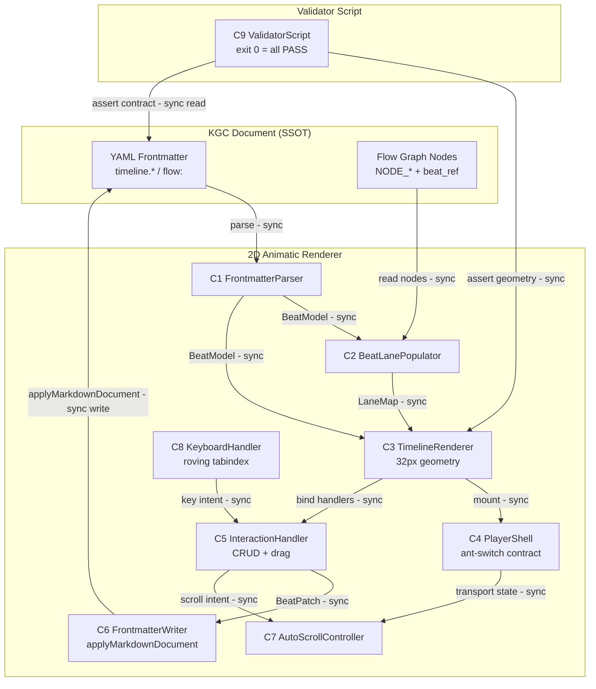
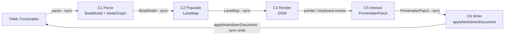
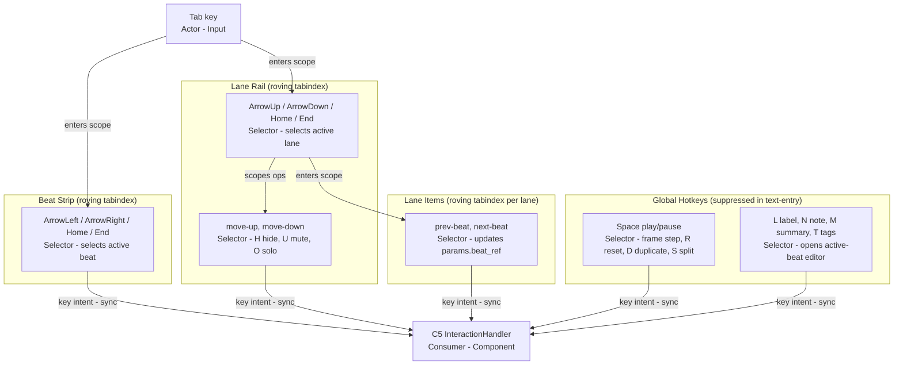

# Knowgrph Animatic Flows & Diagrams Module

## Scope & Ownership

Owns the runtime behaviour views: the two workflows, the data flows, and the architecture diagrams.

This module is loaded on demand from [Knowgrph Animatic PRD/TAD](./knowgrph-animatic-prd-tad.md), which keeps the binding rules and the index. It carries one responsibility and stays under the 600-line file budget.

---

## Workflow: Beat Drag-to-Move

**Trigger**: User pointer-down on a beat card body in the timeline strip.  
**Actors**: Content Author, InteractionHandler (C5), AutoScrollController (C7), FrontmatterWriter (C6).

**Happy Path**:
1. Author pointer-down → C5 enters drag mode, records `dragStartMs`
2. Author drags → C5 computes `deltaMs`; if pointer near rail edge → C7 scrolls continuously
3. Author releases → C5 checks non-overlap invariant; pushes following beats if needed
4. C5 dispatches `BeatPatch` → C6 writes `start_ms`/`end_ms` to frontmatter
5. C3 re-renders beat strip from updated model

**Alternate Paths**:
- Push causes cascade: C5 recomputes all downstream beats before dispatching single batch patch

**Error Paths**:
- `applyMarkdownDocument` fails: C6 rolls back in-memory model; displays error chip

**Postconditions**: `timeline.beats.<beat>.start_ms` and `end_ms` in frontmatter match post-drag
values; no beat overlap exists; timeline strip reflects new positions.

---

---

## Workflow: Validator Script Run

**Trigger**: `python3 ./scripts/validate_animatic_timeline_interactions.py`  
**Actors**: QA Validator, ValidatorScript (C9), mounted KGC surface.

**Happy Path**:
1. Validator loads test fixture markdown documents
2. For each test case: calls `applyMarkdownDocument(fixture)` on mounted surface
3. Asserts DOM state (element presence, class names, aria attributes, geometry)
4. Asserts frontmatter state (key values match expected)
5. Reports `PASS` per test case; exits 0

**Alternate Paths**:
- Partial renderer implementation: affected test cases report `FAIL` with named assertion

**Error Paths**:
- `applyMarkdownDocument` unavailable: script exits 1 with `SURFACE_NOT_MOUNTED` error

**Postconditions**: exit code 0 if all test cases pass; each failing test case named in output.

---

---

## Data Flows

### Data Flow: Frontmatter → Beat Model → DOM

| Stage     | Component               | Input Format                       | Output Format                  | Persistence          | Error Handling             |
|-----------|-------------------------|------------------------------------|--------------------------------|----------------------|----------------------------|
| Ingest    | FrontmatterParser (C1)  | YAML string (`flow:`, `timeline:`) | `BeatModel`, `NodeGraph`       | In-memory only       | Fallback to ordinal beats  |
| Transform | BeatLanePopulator (C2)  | `BeatModel`, `NodeGraph`           | `LaneMap`                      | In-memory only       | Unknown node → `Node` lane |
| Store     | TimelineRenderer (C3)   | `LaneMap`, `BeatModel`             | DOM tree                       | DOM (transient)      | Re-render on error         |
| Serve     | PlayerShell (C4)        | DOM tree                           | Rendered timeline UI           | None                 | Error chip                 |

### Data Flow: Interaction → Frontmatter Patch

| Stage     | Component                  | Input Format              | Output Format              | Persistence            | Error Handling            |
|-----------|----------------------------|---------------------------|----------------------------|------------------------|---------------------------|
| Ingest    | InteractionHandler (C5)    | Pointer/keyboard events   | `InteractionEvent`         | None                   | Drop malformed event      |
| Transform | InteractionHandler (C5)    | `InteractionEvent`        | `FrontmatterPatch`         | None                   | Rollback on invariant fail|
| Store     | FrontmatterWriter (C6)     | `FrontmatterPatch`        | Updated YAML string        | YAML frontmatter (SSOT)| Retry once; error chip    |
| Serve     | FrontmatterParser (C1)     | Updated YAML              | Refreshed `BeatModel`      | In-memory              | Re-parse on reload        |

---

---

## Architecture Diagrams

### Diagram 1 — Component Topology



### Diagram 2 — Beat Edit Workflow

```mermaid
sequenceDiagram
  actor Author
  participant C5 as InteractionHandler
  participant C7 as AutoScrollController
  participant C6 as FrontmatterWriter
  participant YAML as Frontmatter (SSOT)
  participant C3 as TimelineRenderer
  participant C1 as FrontmatterParser

  Author->>C5: pointer-down on beat card
  C5->>C5: enter drag mode; record dragStartMs
  loop drag active
    Author->>C5: pointer-move
    C5->>C7: check rail-edge proximity
    C7-->>C3: scroll if near edge
    C5->>C5: compute deltaMs
  end
  Author->>C5: pointer-up (release)
  C5->>C5: enforce non-overlap invariant; push following beats
  C5->>C6: dispatch BeatPatch
  C6->>YAML: applyMarkdownDocument({ name, text, ... })
  YAML-->>C1: re-parse
  C1-->>C3: updated BeatModel
  C3-->>Author: re-rendered beat strip
```

### Diagram 3 — Data Flow: Frontmatter → DOM → Frontmatter



### Diagram 4 — Keyboard Navigation Scopes



---
