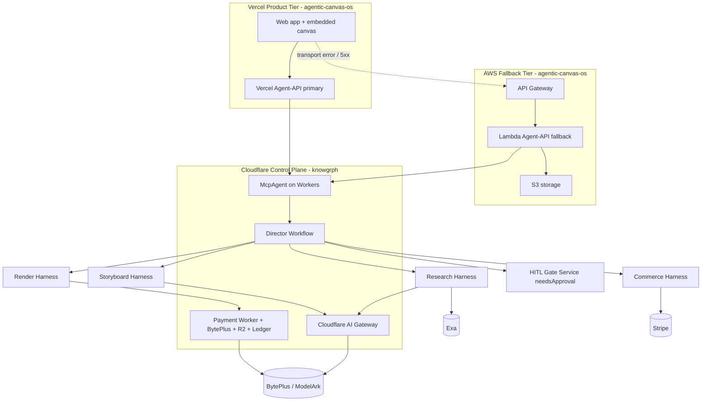
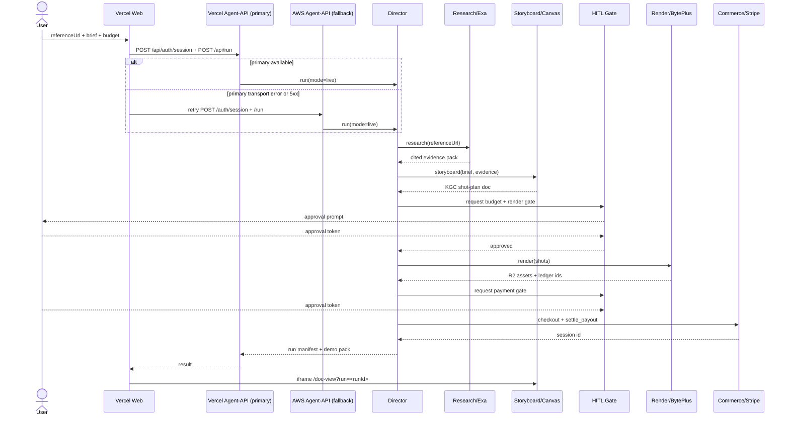

# Knowgrph MCP Agentic Canvas OS

> **SUPERSEDED (2026-07-03)**: this document is consolidated into
> [`knowgrph/docs/documents/knowgrph-agentic-os-prd-tad.md`](https://github.com/huijoohwee/knowgrph/blob/main/docs/documents/knowgrph-agentic-os-prd-tad.md) **v0.4.0**
> and [`knowgrph/docs/documents/knowgrph-agent-ready-document.md`](https://github.com/huijoohwee/knowgrph/blob/main/docs/documents/knowgrph-agent-ready-document.md) **v1.2.0**.
> The Vercel and AWS tiers described below are removed from the runtime topology; Supabase is permanently excluded.
> Retained for historical reference only.
>
> For the current publish-side MCP contract pages, open
> `docs/documents/knowgrph-mcp-service-prd-tad.md` for the implemented MCP
> baseline and `docs/documents/knowgrph-mcp-agentic-os-prd-tad.md` for the
> Agentic Canvas OS orchestration contract.
>
> For the current remote MCP onboarding path, start with
> `docs/documents/knowgrph-mcp-onboarding-index.md`, then use
> `docs/documents/knowgrph-mcp-install-contract.md` for the canonical
> `/knowgrph/mcp` vs `/knowgrph/control-plane/mcp` boundary.
> Map intent on `https://airvio.co/knowgrph/mcp`, orchestrate agents on
> `https://airvio.co/knowgrph/control-plane/mcp` only for session-capable
> hosts, and prove outcomes first with the source-side `README.md` or
> `docs/documents/knowgrph-superagent-harness.md` offline path.

## Consolidation Map (what moved where)

| Former content (this doc) | Current SSOT (native-in-repo) |
|---|---|
| Video_Remix Director + 5 stage harnesses | `knowgrph-agentic-os-prd-tad.md` → Component: Video_Remix Director; `mcp/video-remix-runtime.js` |
| Vercel frontend + Agent-API primary | **Removed** (ADR-3) → CF Pages product frontend |
| AWS Agent-API fallback + AgentCore | **Removed** (ADR-3) → Cloudflare `McpAgent` at `/knowgrph/control-plane/mcp` |
| Agent discovery + HTTP MCP | `knowgrph-agent-ready-document.md` → Pages HTTP MCP `/knowgrph/mcp` |
| MCP Gateway (unified agent onboarding) | `knowgrph-agentic-os-prd-tad.md` ADR-4 → four-surface federation + `knowgrph.os.status` |
| Agentic OS cross-harness visibility | `knowgrph-agentic-os-prd-tad.md` → `knowgrph.os.status` (5 read views) |
| Agentic OS follow-on (HITL / live / dashboard) | [`knowgrph-agentic-os-follow-on-prd-tad.md`](knowgrph-agentic-os-follow-on-prd-tad.md): Tracks A/B/C |
| HITL approval gates | Unchanged in-repo → `contracts/approval.schema.js`, `mcp/video-remix/approval-token-issuer.js` (local **implemented**) |
| Cloudflare AI Gateway model routing | Unchanged → Cloudflare Workers + AI Gateway binding |

## Current Publish Entry Points

Use these publish-side docs instead of this historical record for current MCP/runtime understanding:

- `docs/documents/knowgrph-mcp-onboarding-index.md`
- `docs/documents/knowgrph-mcp-install-contract.md`
- `docs/documents/knowgrph-mcp-service-prd-tad.md`
- `docs/documents/knowgrph-mcp-agentic-os-prd-tad.md`

## Markdown YAML Frontmatter Contract

- The opening YAML frontmatter block remains the first block and canonical metadata SSOT for this combined PRD/TAD.
- This document is a canonical authored PRD/TAD, not a typed validation fixture or generated registry surface.
- Frontmatter stays in plain YAML so the file demonstrates the default authoring path for product, deployment, and stack metadata.
- If typed `{key, type, value}` envelopes are needed for ingest -> parse -> render validation, that coverage should live in a dedicated fixture doc rather than replacing canonical PRD/TAD prose.
- Product, stack, and deployment decisions must be derived from parsed frontmatter and document content only, never from file path assumptions or downstream mirrors.

---

## Dev Implementation Status — 2026-06-09

- Implemented in Dev only: `knowgrph.video_remix.run` is now exposed through the existing local MCP server contract as an approval-gated video-remix run manifest.
- Shared owners: `mcp/video-remix-runtime.js`, `mcp/local-tool-contract.js`, `mcp/server.js`, and `canvas/src/features/agent-ready/knowgrphVdeoxplnContract.mjs`.
- Implemented acceptance coverage: live mode without approvals blocks with zero estimated cost and no provider execution log; source-card-backed research enforces citations; storyboard emits `kgc-computing-flow/v1` with one node per planned shot; checkout/payout requires `payment-action`; injected failure retries within `maxIterations` and fails closed.
- Non-implemented by design in this Dev pass: no Prod mirror, Cloudflare deploy, AWS deploy, Vercel deploy, Stripe mutation, Exa live fetch, BytePlus provider call, or payout settlement was executed.
- Local research evidence is source-card driven so validation can prove the contract without fabricating live Exa results or spending tokens.

# Part I — PRD

## Feature: Agentic Canvas OS Live Video-Remix Connector

### Problem Statement

A solo AI-native founder can already ship a deployed knowledge-graph product on Cloudflare (`airvio.co/knowgrph`) with a working video-generation pipeline (BytePlus), an Exa research integration, and a Stripe payment worker — but these capabilities are **disconnected dry-run surfaces**. There is no single autonomous agent that takes a creative goal and a reference video URL and drives the full loop: research -> plan -> generate -> sell, across the mandated hackathon stack (AWS backend, Vercel frontend, Exa, Stripe). The pain is **fragmentation and manual orchestration**: every stage is a separate tool invocation, there is no live execution mode, no human-approval gating across spend boundaries, and no judge-ready evidence pack. The opportunity is to turn the existing `knowgrph.agentic_canvas_os.plan` dry-run planner into the **live control plane** for a deployed product, `agentic-canvas-os`, reusing existing assets at near-zero incremental TCO.

### Personas

- **Solo Founder / AI Orchestrator** (primary): operates the whole stack alone; jobs-to-be-done — validate a creative idea fast, ship a live demo, keep spend observable, never lose control of paid actions.
- **End Creator User** (secondary): supplies a reference video URL and a creative brief; jobs-to-be-done — get a researched, storyboarded, remixed video and buy/license the output without touching infrastructure.
- **Hackathon Judge** (evaluator): jobs-to-be-done — verify agent autonomy, tool use, orchestration, human-in-the-loop, failure handling, and demo clarity against the four judging dimensions.

### User Journey

#### Journey: End Creator User — Remix a reference video into a sellable asset

| Stage    | Action                                   | Touchpoint                    | Pain Point                          | Opportunity                                  |
|----------|------------------------------------------|-------------------------------|-------------------------------------|----------------------------------------------|
| Trigger  | Pastes reference video URL + brief       | Vercel frontend chat          | Unclear what the agent will do/cost | Show planned stages + budget upfront         |
| Discover | Agent researches the reference           | Exa via knowgrph MCP          | Generic, unsourced suggestions      | Cited evidence pack from live web            |
| Engage   | Reviews storyboard on canvas             | knowgrph canvas (embedded)    | No visual of the plan               | Shot-plan graph, one node per shot           |
| Approve  | Approves budget + render                 | HITL gate in UI               | Fear of runaway spend               | Per-gate approval tokens, bounded budget     |
| Complete | Receives rendered remix + checkout       | Vercel UI + Stripe checkout   | No clear way to pay/own output      | One-click Stripe purchase, asset delivery    |
| Return   | Comes back for a new remix               | Saved runs / canvas history   | Loses prior context                 | Learning-loop recall of preferences          |

### User Stories

**As a** solo founder
**I want** one MCP tool that runs the full research-to-sale video pipeline in a live, approval-gated mode
**So that** I can ship and demo an autonomous product without hand-wiring each stage

**As an** end creator user
**I want** to paste a reference video and approve a budget
**So that** I receive a researched, storyboarded, remixed video I can buy

**As a** hackathon judge
**I want** an evidence pack mapped to the four judging dimensions
**So that** I can verify autonomy, tool use, orchestration, HITL, and failure handling

### Acceptance Criteria

**AC-1 (Live run, gated)**
**Given** a reference video URL, a creative brief, and a budget cap
**When** the operator calls `knowgrph.video_remix.run` in `mode:"live"` without approval tokens
**Then** the run halts at the first spend gate in `dry-run` state and emits the required approval gates, performing zero paid actions

> **`/goal` translation**: `knowgrph.video_remix.run live without approval tokens returns state "blocked" with approvalGates length >= 5 and budgetMeters.estimatedCostUsd == 0, and no Stripe/BytePlus/deploy call is logged`

**AC-2 (Research is sourced)**
**Given** a reference video URL
**When** the research stage runs
**Then** the evidence pack contains at least 3 Exa-cited sources and every downstream claim references a sourceId

> **`/goal` translation**: `evidencePack.sources length >= 3 and every marketRadar.claims[].sourceCardIds is non-empty`

**AC-3 (Storyboard materializes on canvas)**
**Given** an approved brief
**When** the storyboard stage runs
**Then** a KGC canvas document is produced with one node per planned shot and a valid frontmatter flow

> **`/goal` translation**: `the emitted canvas document parses as kgc-computing-flow/v1 and flow.nodes length == number of planned shots`

**AC-4 (Render reuses existing pipeline)**
**Given** an approved render gate
**When** the render stage runs
**Then** generation is dispatched through the existing Strytree/BytePlus queue and produces an R2-stored asset reference

> **`/goal` translation**: `render stage returns an asset URL under the knowgrph media bucket and a credit-ledger event id`

**AC-5 (Sale + payout gated)**
**Given** a published asset
**When** the checkout stage runs after the payment gate is approved
**Then** a Stripe checkout session is created and payout is settled only after explicit approval

> **`/goal` translation**: `checkout returns a Stripe session id and settle_payout is not invoked unless approvalGates["payment-action"].approvalState == "approved"`

**AC-6 (Failure is bounded)**
**Given** an injected single tool failure
**When** the director orchestrates
**Then** it retries within `maxIterations` and otherwise fails closed to `blocked` with evidence

> **`/goal` translation**: `with failOnceTool set, the run shows retryCount >= 1 then either completes or returns state "blocked" with a failure record, never exceeding maxIterations`

**AC-7 (Deployed live)**
**Given** approved deploy gates
**When** the product is deployed
**Then** the Vercel frontend URL is reachable, the primary/default Vercel Agent-API path works, and the AWS fallback endpoint is reachable and recorded in the demo pack

> **`/goal` translation**: `demoPack.urls contains a reachable Vercel URL, the primary product path succeeds through same-origin /api routes, and the AWS fallback endpoint returns 200 on its health route`

### Success Metrics

| Metric | Baseline | Target | Timeline |
|--------|----------|--------|----------|
| End-to-end run completion rate (gated) | 0% | >= 90% on happy path | Sprint 2 |
| Time from URL paste to storyboard | n/a | < 60 s | Sprint 2 |
| Research sources per run (Exa) | 0 | >= 3 cited | Sprint 1 |
| Token cost / month (orchestration) | unmeasured | <= $15 at demo load | Sprint 2 |
| Monthly TCO (incremental over Cloudflare) | $0 | <= $25 (AWS free-tier + Vercel hobby) | Sprint 2 |
| ROI Score | — | >= team threshold | Sprint 1 gate |
| Demo-pack judging coverage | 0/7 | 7/7 sections evidenced | Sprint 2 |

**ROI computation** (per ROI template): `ROI = (User Impact x Reach) / (Build Hours + Monthly TCO + Token Cost/Month)`. User Impact 5 (ships a live, sellable product from one prompt), Reach = demo + early-adopter sessions, Build Hours bounded by reuse of existing Cloudflare assets, Monthly TCO target <= $25, Token Cost target <= $15/mo. Reuse of the existing BytePlus/Stripe/Exa surfaces is the dominant ROI lever.

### MoSCoW Priority

- **Must** (high ROI, reuses existing assets):
  - Live execution mode + approval gates on `agentic_canvas_os` tool — ROI: high (unlocks everything, low build via reuse).
  - Video-remix director + 5 stage tools (research/storyboard/render/publish/checkout) — ROI: high.
  - HITL gates across spend boundaries — ROI: high (judging + safety).
  - Demo pack mapped to 7 judging sections — ROI: high (evaluation outcome).
- **Should**:
  - AWS fallback agent-api (API Gateway + Lambda + S3, thin adapter, no model keys) — ROI: medium (satisfies stack mandate; new infra cost).
  - Vercel frontend + serverless Agent-API primary path — ROI: medium.
  - Cloudflare AI Gateway wiring for all harnesses (token counting + caching) — ROI: high (token economics + observability).
  - Bounded-retry failure handling with injection test — ROI: medium-high.
- **Could**:
  - Learning-loop recall of user preferences — ROI: medium (retention, not demo-critical).
  - Multi-platform market radar across 9 platforms — ROI: low-medium for MVP.
- **Won't (this iteration)**:
  - Migrating the control plane off Cloudflare.
  - Onchain/x402 settlement beyond existing stubs.
  - Multi-tenant billing dashboards.

### Min-Viable Scope

One hero, fully gated end-to-end flow per AC-1..AC-7: a single director run that researches a reference video (Exa), storyboards onto the knowgrph canvas, renders via the existing BytePlus pipeline, and sells via Stripe — surfaced through a deployed Vercel UI using same-origin Vercel Agent-API routes as the primary path, with AWS retained as the fallback health-checked endpoint, and all spend behind approval tokens. Explicitly excludes all Could/Won't items.

### Out of Scope

- Control-plane migration away from Cloudflare/`airvio.co`.
- New proprietary model training; models are call-only (BytePlus/ModelArk via Cloudflare AI Gateway).
- Production-grade multi-tenant auth, SSO, or org management.
- Payout rails beyond existing Stripe + x402 stub.

### Dependencies

- Existing Cloudflare payment worker + Strytree pipeline (BytePlus video), Stripe, R2, queues, credit-ledger Durable Object.
- Cloudflare AI Gateway (account gateway id + `ai` binding) for all model routing.
- BytePlus / ModelArk credentials (chat + image + video) per `byteplus*Ssot.ts`.
- Agents SDK (`agents` package) for the `McpAgent` Worker control plane.
- Exa MCP (hosted-free or API-key) per `exaMcpSsot`.
- AWS account (CDK, Lambda, API Gateway, S3) — no model keys on AWS.
- Vercel account (project + static/frontend + serverless route deploy).
- Knowgrph MCP server + tool-contract registration.

### Open Questions

- Resolved: reasoning + media via BytePlus/ModelArk behind Cloudflare AI Gateway (ADR-5/ADR-6); AWS holds no model keys (ADR-3). AWS Bedrock deferred/optional.
- Resolved: model routing via Cloudflare AI Gateway, not Vercel AI Gateway (ADR-5).
- Resolved: the product surface is a thin Vercel-hosted web app plus same-origin serverless API routes; no Next.js-only assumption is required in the spec.
- Whether checkout sells per-asset (one-time) or subscription for MVP demo.
- Exa connection mode for demo: hosted-free vs API-key header.
- Whether to migrate the deployed HTTP MCP (`cloudflare/pages/knowgrph-agent-ready.mjs`) to an Agents SDK `McpAgent` Worker now or incrementally (ADR-7).

---

# Part II — TAD

## Architecture: Agentic Canvas OS Live Connector

### Overview

**From a reference video URL to a sold remix**: the Vercel frontend (in `agentic-canvas-os`) collects intent -> same-origin Vercel Agent-API routes mint/verify Auth_Tokens and forward the run to the knowgrph MCP control plane on Cloudflare -> if the Vercel route is unavailable or returns 5xx, the browser can retry against the AWS Agent-API fallback -> the control plane MCP server built on the **Agents SDK (`McpAgent`)** delegates to research (Exa), storyboard (knowgrph canvas), render (BytePlus via the existing payment worker), and commerce (Stripe) harnesses -> **every model call routes through Cloudflare AI Gateway** for caching, token counting, fallback, and unified billing -> human approval gates (`needsApproval`) bind every spend boundary -> the returned run manifest drives a run-scoped `doc-view` iframe so the product consumes the live knowgrph canvas rather than rebuilding it.

### Tech Stack (per repo)

> **Topology note (UPDATED):** the two columns below are now backed by two real
> repos. `knowgrph` remains the control-plane + contract SSOT. The split product
> shell lives in `agentic-canvas-os`, where the Vercel web app and same-origin
> serverless routes are the PRIMARY/DEFAULT product path and the AWS Agent-API is
> the FALLBACK path. Reference implementations remain mirrored in `knowgrph`
> (`knowgrph/aws/agent-api`, `knowgrph/web`, `knowgrph/contracts`,
> `knowgrph/aws/agentcore`) so the runtime seams can stay aligned. The stack
> boundary (R11) is enforced by repo ownership + secret-scan smoke tests, not by
> claims that MCP and canvas rendering are the same transport. SSOT:
> [`knowgrph/docs/knowgrph-acos-topology-decision.md`](../../knowgrph/docs/knowgrph-acos-topology-decision.md).

The two tiers own distinct stacks; the product (`agentic-canvas-os`) delegates all intelligence and spend-bearing actions to the knowgrph control plane.

| Concern | `knowgrph` (control plane) | `agentic-canvas-os` (product) |
|---|---|---|
| Host | Cloudflare Workers + Pages (`airvio.co`) | Vercel (frontend + primary/default Agent-API) + AWS (fallback Agent-API / additive AgentCore wrapper) |
| Agent runtime | MCP server on Cloudflare Workers via Agents SDK (`McpAgent`, `AgentWorkflow`) | thin Agent-API adapters calling the control plane |
| Model routing | Cloudflare AI Gateway (caching, token counting, fallback, unified billing) | routes model calls through the same Cloudflare AI Gateway |
| Reasoning + media models | BytePlus / ModelArk (chat, image, video) + BytePlus render | n/a (delegated) |
| Web research | Exa MCP (`web_search_exa`, `web_fetch_exa`) | n/a (delegated) |
| Payments | Stripe (payment worker, R2, queues, credit-ledger DO) | checkout UI + redirect |
| Compute / storage | Workers, Durable Objects, Queues, R2 | Vercel serverless routes + AWS Lambda/API Gateway fallback + S3 |
| HITL | Agents SDK `needsApproval` + approval-token gates | renders approval prompts and re-submits `approvals[]` |
| Observability | Cloudflare AI Gateway logs + Agents SDK diagnostics channel | surfaces run manifest + run-scoped canvas iframe |

**Stack boundary rule**: AWS and Vercel host the user-reachable product surface and durable artifacts, but never hold model keys, never call paid models directly, and never bypass an approval gate. All model spend flows through Cloudflare AI Gateway under the control plane; all paid actions pass an Agents SDK approval gate.

### Journey -> System Mapping

| Journey Stage | Workflow | Data Flow | Component |
|---------------|----------|-----------|-----------|
| Trigger | Submit intent | brief+url -> same-origin `/api/run` request -> MCP forward | Vercel frontend + Vercel Agent-API primary |
| Discover | Research | url -> Exa query -> evidence pack | Research harness |
| Engage | Storyboard | evidence -> shot plan -> KGC doc | Storyboard harness + knowgrph canvas |
| Approve | Gate | gate request -> approval token | HITL gate service |
| Complete | Render + Sell | shot -> BytePlus job -> R2 asset -> Stripe session | Render harness + Commerce harness |
| Return | Recall | trace -> recall cards | Learning-loop service |

### Work Flow: Video-Remix Director Run

**Trigger**: User submits a reference video URL, a creative brief, and a budget cap from the Vercel frontend.
**Actors**: End creator user; Vercel frontend; Vercel Agent-API (primary/default); AWS Agent-API (fallback); knowgrph MCP control plane (`McpAgent`); Director Workflow; Research/Storyboard/Render/Commerce harnesses; HITL Gate Service; Cloudflare AI Gateway; Exa; BytePlus; Stripe.

**Happy Path**:
1. User submits intent -> Vercel frontend POSTs to same-origin `/api/auth/session`, then `/api/run`.
2. Vercel Agent-API verifies the Auth_Token and forwards an MCP `knowgrph.video_remix.run` call (mode=live) -> control plane starts a Director `AgentWorkflow`.
3. If the Vercel Agent-API is unavailable or returns 5xx, the browser retries the same request against the configured AWS Agent-API fallback.
4. Research harness calls Exa (model summary via Cloudflare AI Gateway) -> emits cited evidence pack.
5. Storyboard harness reasons over evidence (BytePlus via Cloudflare AI Gateway) -> emits a KGC shot-plan canvas document.
6. Director raises a `needsApproval` budget + render gate -> user approves -> the browser re-submits `/api/run` with updated `approvals[]`.
7. Render harness dispatches per-shot generation through the existing BytePlus/Strytree queue -> R2 assets + credit-ledger events.
8. Director raises a `needsApproval` payment gate -> user approves -> Commerce harness publishes the asset and creates a Stripe checkout session.
9. On checkout webhook success, payout settles -> Director assembles the run manifest + demo pack -> Agent-API returns result -> frontend renders asset + receipt and embeds the run-scoped knowgrph `doc-view` iframe. Workflow completes.

**Alternate Paths**:
- Weak evidence (< 3 Exa sources): Director marks research `weak_signal`, surfaces a "collect more evidence" prompt, and pauses before storyboard rather than fabricating sources.
- Dry-run mode or missing approval token: any spend-bearing step resolves to a `dry-run` plan artifact instead of executing; the run returns `state: blocked` with the pending gate.
- Budget exceeded mid-run: render falls back to the deterministic mock provider; Director records `budget_exceeded` and stops.

**Error Paths**:
- Harness/tool failure: Agents SDK `this.retry()` with backoff (bounded by `maxIterations`); on repeated failure, Director fails closed to `blocked` with a failure record.
- AI Gateway / provider outage: fallback routing in Cloudflare AI Gateway; if all providers fail, harness returns a degraded structured error (never a raw failure) and the stage is marked blocked.
- Stripe webhook mismatch: payout withheld; reconciliation flagged; no settlement without a verified session.

**Postconditions**: Either (a) a sold, R2-stored remix asset with a Stripe session + settled payout and a 7/7 demo pack, or (b) a `blocked`/`budget_exceeded` run manifest with an evidence trail and zero unapproved spend. In all cases a cost log exists per model call and the credit ledger is consistent.

### Data Flow: Reference URL to Sold Asset

| Stage | Component | Input Format | Output Format | Persistence | Error Handling |
|-------|-----------|--------------|---------------|-------------|----------------|
| Ingest | Vercel Agent-API `/api/run` (primary) + AWS `/run` (fallback) | `{ referenceUrl, brief, budgetUsd, approvals[] }` JSON | validated MCP `run` args | none (pass-through) | 4xx on schema fail; fallback only on transport error or 5xx |
| Research | Research harness -> Exa (via AI Gateway) | `{ referenceUrl, query?, maxResults<=10 }` | `{ sources[], citations[], summary }` | run manifest (Workers SQLite) | degraded summary, `weak_signal`, never fabricate sources |
| Transform | Storyboard harness -> BytePlus (via AI Gateway) | `{ brief, evidencePack, shotCount? }` | `kgc-computing-flow/v1` markdown + `{ nodes[], edges[] }` | KGC doc in R2/Source Files | minimal single-scene fallback |
| Gate | HITL Gate Service (`needsApproval`) | `{ gateId, decision, token }` | approval token | Durable Object state | reject -> stage stays `approval_required` |
| Store/Render | Render harness -> BytePlus queue -> R2 | `{ shots[], renderGateToken }` | `{ assets:[{ shotId, assetUrl, ledgerEventId, costCents }] }` | R2 media bucket + credit-ledger DO | budget guard -> mock provider; queue retry/DLQ |
| Serve/Sell | Commerce harness -> Stripe | `{ assetUrl, priceId, paymentGateToken }` | `{ sessionId }` + signed asset URL | D1 order record + R2 asset | gate rejection; webhook reconciliation |
| Consume | Vercel frontend + knowgrph `doc-view` | run manifest + signed URLs + run-scoped canvas URL | rendered UI (asset + receipt + demo pack + iframe canvas) | CDN cache | fallback to manifest-only UI when canvas iframe is unavailable |

Every model-bearing stage emits a Cloudflare AI Gateway log `{ model, prompt_tokens, completion_tokens, cache_hits, estimated_cost_usd }`, satisfying the harness cost-log contract and the token-economics quality attribute.

### Component Specifications

**Component**: Director Orchestrator (`knowgrph.video_remix.run`)
**Responsibility**: Sequences stages, enforces budget and approval gates, applies bounded-retry failure handling.
**Runtime**: Cloudflare Worker MCP server via Agents SDK — a durable `AgentWorkflow` with `this.retry()` (backoff + jitter), `needsApproval` HITL gates, built-in `queue()`, and `diagnostics_channel` observability; tool surface exposed through `McpAgent` (Streamable HTTP transport on `airvio.co/knowgrph/mcp`).
**Interfaces**: MCP tool — input `{ referenceUrl, brief, budgetUsd, mode, approvals[] }`, output run manifest `{ state, stages[], approvalGates[], budgetMeters, demoPack }`.
**Dependencies**: research/storyboard/render/commerce harnesses; Cloudflare AI Gateway for all model calls; reuses `buildPlanner`, `buildToolCalls`, `buildApprovalGates`, `buildFailureHandling` from `mcp/agentic-canvas-os-lanes.js`.
**Configuration**: `maxIterations`, `tokenBudget`, `tcoBudgetUsd`, `mode` (dry-run|live), `AI_GATEWAY_ID`.
**FOSS / Vendor**: Agents SDK is OSS; orchestrates proprietary APIs gated per ADR-2/ADR-4.
**Orchestration Topology**: Agentic loop — max `maxIterations` (default 8), circuit-breaker: `state in {blocked, budget_exceeded, approval_required, verification_failed}`.
**`/goal` Conditions**: AC-1, AC-6.

**Component**: Research Harness (`knowgrph.video_remix.research`)
**Responsibility**: Retrieves and cites live web context about the reference video.
**Interfaces**: input `{ referenceUrl, query?, maxResults }`, output `{ sources[], citations[], summary }`.
**Dependencies**: Exa MCP (`web_search_exa`, `web_fetch_exa`) per `grph-shared/src/search/exaMcpSsot.ts`; summary reasoning via BytePlus through Cloudflare AI Gateway.
**FOSS / Vendor**: Proprietary (Exa, BytePlus) — see ADR-4/ADR-6; FOSS fallback documented.
**Harness Contract**:
  - Input schema: `{ referenceUrl: string, query?: string, maxResults: int<=10 }`
  - Output schema: `{ sources: [{ sourceId, url, platform, evidenceLevel }], citations: [{ sourceId, url }], summary: string }`
  - Cost log fields: `{ model, prompt_tokens, completion_tokens, cache_hits, estimated_cost_usd }` emitted by Cloudflare AI Gateway
  - Fallback path: on Exa error, return degraded `summary` with `sources: []` and mark stage `weak_signal`; never fabricate sources.
**Token Budget**: ~800 prompt + ~600 completion @ 30% AI Gateway cache = est. < $0.01/request (BytePlus summary model).
**Orchestration Topology**: Fan-out (parallel queries) -> fan-in (dedupe sources), max 1 round.
**`/goal` Conditions**: AC-2.

**Component**: Storyboard Harness (`knowgrph.video_remix.storyboard`)
**Responsibility**: Converts approved brief + evidence into a KGC canvas shot-plan document.
**Interfaces**: input `{ brief, evidencePack, shotCount? }`, output `{ canvasDocumentMarkdown, flow: { nodes[], edges[] } }`.
**Dependencies**: knowgrph KGC frontmatter-flow path (`kgc-computing-flow/v1`); canvas renderer; BytePlus chat model via Cloudflare AI Gateway.
**FOSS / Vendor**: FOSS (own code) + BytePlus reasoning (ADR-6).
**Harness Contract**:
  - Input schema: `{ brief: string, evidencePack: object, shotCount?: int }`
  - Output schema: `{ canvasDocumentMarkdown: string, flow: { nodes: [{ id, label, type, status }], edges: [...] } }`
  - Cost log fields: standard cost-log object via Cloudflare AI Gateway.
  - Fallback path: emit a minimal single-scene plan if reasoning fails.
**Token Budget**: ~1200 prompt + ~900 completion @ 20% AI Gateway cache = est. < $0.02/request.
**Orchestration Topology**: Sequential (after research approval).
**`/goal` Conditions**: AC-3.

**Component**: Render Harness (`knowgrph.video_remix.render`)
**Responsibility**: Dispatches per-shot video generation and returns stored asset references.
**Interfaces**: input `{ shots[], renderGateToken }`, output `{ assets: [{ shotId, assetUrl, ledgerEventId }] }`.
**Dependencies**: existing payment worker `strytreeApi.ts` (BytePlus/ModelArk video providers, queue, R2 bucket, `StrytreeCreditLedgerActor`); media-model calls route through Cloudflare AI Gateway where supported.
**FOSS / Vendor**: Proprietary (BytePlus) — gated; see ADR-2/ADR-6.
**Harness Contract**:
  - Input schema: `{ shots: [{ shotId, prompt, durationS }], renderGateToken: string }`
  - Output schema: `{ assets: [{ shotId, assetUrl, ledgerEventId, costCents }] }`
  - Cost log fields: standard cost-log object + `provider_spend_cents`.
  - Fallback path: deterministic mock provider when no API key / budget exceeded (mirrors existing `providerMode`).
**Token Budget**: n/a for LLM; provider spend bounded by `STRYTREE_DAILY_PROVIDER_BUDGET_CENTS`.
**Orchestration Topology**: Fan-out per shot via queue (`max_batch_size = 3`), fan-in on completion.
**`/goal` Conditions**: AC-4.

**Component**: Commerce Harness (`knowgrph.video_remix.publish` + `.checkout`)
**Responsibility**: Publishes the asset and creates a gated Stripe checkout + payout settlement.
**Interfaces**: publish `{ assets[] } -> { publishedUrls[] }`; checkout `{ assetUrl, priceId, paymentGateToken } -> { sessionId }`; payout gated.
**Dependencies**: payment worker (`payments.ts`, `agenticCommerce*`), Stripe (`STRIPE_CHECKOUT_PRICE_ID`), R2.
**FOSS / Vendor**: Proprietary (Stripe) — gated; see ADR-4.
**`/goal` Conditions**: AC-5.

**Component**: HITL Gate Service
**Responsibility**: Issues, stores, and verifies per-gate approval tokens before any spend.
**Interfaces**: `{ gateId, decision, token }`; verification on every paid action.
**Dependencies**: reuses `buildApprovalGates` gate ids (consumer-repo-write, cloud-deploy, paid-model-call, payment-action, authenticated-browser).
**FOSS / Vendor**: FOSS.
**`/goal` Conditions**: AC-1, AC-5, AC-7.

**Component**: Vercel Agent-API (`agentic-canvas-os/web/api/*`)
**Responsibility**: PRIMARY/DEFAULT product API path; mints/verifies Auth_Tokens and forwards `POST /run` to the knowgrph control plane.
**Interfaces**: HTTPS — same-origin `POST /api/auth/session`, `POST /api/run`; forwards MCP calls to the control plane (`McpAgent` over Streamable HTTP).
**Dependencies**: Vercel serverless functions over the platform-neutral `agentic-canvas-os/agent-api/src/app.js` core. No model keys; reasoning + media + payments are delegated to the Cloudflare control plane.
**FOSS / Vendor**: Vercel hosting proprietary; shared handler core is FOSS JavaScript.
**`/goal` Conditions**: AC-7.

**Component**: AWS Agent-API fallback (`agentic-canvas-os/agent-api`)
**Responsibility**: FALLBACK product API path and AWS proof surface; mirrors the same auth + MCP forward behavior when the primary Vercel path is unavailable or returns 5xx.
**Interfaces**: HTTPS — `POST /auth/session`, `POST /run`, `GET /health`, `GET /runs/{id}`; forwards MCP calls to the control plane (`McpAgent` over Streamable HTTP).
**Dependencies**: API Gateway + Lambda + S3 (ADR-3). No model keys; reasoning + media + payments are delegated to the Cloudflare control plane (BytePlus via Cloudflare AI Gateway). Direct AWS managed-AI (Bedrock) is deferred/optional, not on the MVP path.
**FOSS / Vendor**: Proprietary (AWS) — see ADR-3; least-privilege IAM, gated deploy.
**`/goal` Conditions**: AC-7.

**Component**: Vercel Frontend (`agentic-canvas-os/web`)
**Responsibility**: User-facing web app + embedded canvas; renders approval prompts; surfaces run manifest + assets.
**Interfaces**: HTTPS UI; auth-aware API client -> same-origin Vercel Agent-API primary -> AWS fallback only on transport error or 5xx -> MCP control plane. Canvas rendering is a run-scoped iframe to `https://airvio.co/knowgrph/doc-view?run=<runId>[&doc=<docId>]`, not an MCP browser transport.
**Dependencies**: static web shell, browser-safe config, Vercel hosting; optional AWS fallback base; no client-side model provider calls.
**FOSS / Vendor**: Static frontend code is FOSS; Vercel hosting proprietary (hobby tier) — see ADR-3.
**`/goal` Conditions**: AC-7.

### Integration Contracts

- **Interface**: Frontend -> Agent-API | **Protocol**: HTTPS/JSON | **Format**: same-origin `POST /api/auth/session`, `POST /api/run`, re-submit with updated `approvals[]` | **Errors**: 4xx validation/auth are definitive; fallback to AWS only on transport error or 5xx.
- **Interface**: Agent-API -> MCP control plane | **Protocol**: MCP Streamable HTTP (Agents SDK `McpAgent` on Workers) | **Format**: MCP tool call | **Errors**: typed MCP error -> mapped to gate or failure record.
- **Interface**: Frontend -> knowgrph canvas doc-view | **Protocol**: HTTPS iframe | **Format**: `/doc-view?run=<runId>[&doc=<docId>]` | **Errors**: canvas hidden when storyboard is not ready or the iframe route is unavailable.
- **Interface**: Harness -> model provider | **Protocol**: HTTPS via Cloudflare AI Gateway (`gateway.ai.cloudflare.com/v1/{account}/{gateway}`) | **Format**: OpenAI-compatible chat / provider passthrough to BytePlus | **Errors**: AI Gateway fallback routing; degraded structured error on total provider failure; per-call log `{ model, prompt_tokens, completion_tokens, cache_hits, estimated_cost_usd }`.
- **Interface**: Research harness -> Exa | **Protocol**: HTTPS MCP (`mcp.exa.ai/mcp`) | **Format**: `web_search_exa` args | **Errors**: degraded summary, `weak_signal`.
- **Interface**: Render harness -> payment worker | **Protocol**: HTTPS + Queue | **Format**: Strytree generation message (BytePlus video) | **Errors**: budget guard, mock fallback.
- **Interface**: Commerce harness -> Stripe | **Protocol**: HTTPS | **Format**: Checkout Session / payout | **Errors**: gate rejection, webhook reconciliation.

### Architectural Decisions

**ADR-1: Hybrid topology — Cloudflare control plane, Vercel primary product host, AWS fallback**
**Status**: Accepted
**Date**: 2026-06-09
**Context**: Hackathon stack mandates AWS + Vercel; knowgrph is Cloudflare-native with a working pipeline.
**Decision**: Keep the MCP control plane and video/payment pipeline on Cloudflare; use a Vercel frontend plus same-origin Vercel Agent-API as the primary/default product path, and retain an AWS Agent-API as the fallback/proof surface that delegates to the same control plane.
**Alternatives Considered**: (1) Full migration to AWS+Vercel — pros: single stack; cons: discards working Cloudflare assets, high build cost. (2) Cloudflare-only with AWS/Vercel as dry-run plans — pros: zero new TCO; cons: fails the live-product mandate. (3) FOSS alternative: self-host on Fly.io/Render — pros: portable; cons: more ops, no judging-stack credit.
**Rationale**: Maximizes reuse (lowest build hours), satisfies the mandated stack, isolates spend.
**TCO Impact**:

| Dimension | Chosen Option | Best FOSS Alternative | Delta / 12 months |
|---|---|---|---|
| Infra cost | AWS free-tier + Vercel hobby (~$0-25/mo) | Self-host Fly.io (~$5-15/mo) | + up to ~$120 |
| Egress cost | Cloudflare zero-egress core | same | $0 |
| Token cost | BytePlus via Cloudflare AI Gateway (cached) pay-per-use | local model (0 API) | variable |
| Vendor risk | Med (AWS+Vercel+BytePlus) | Low | — |

**Consequences**: Positive — reuse, stack credit, bounded spend. Negative — three providers to operate. Neutral — control plane stays Cloudflare; all model spend funnels through Cloudflare AI Gateway.

**ADR-2: Reuse existing Strytree/BytePlus pipeline for render**
**Status**: Accepted
**Context**: A deployed video-generation pipeline already exists in the payment worker.
**Decision**: Render harness dispatches to the existing queue/R2/ledger rather than building a new path.
**Alternatives Considered**: New AWS-side render via Bedrock video — cons: duplicate, higher cost. FOSS alternative: self-hosted ffmpeg/stable-video — pros: zero API cost; cons: heavy ops, lower quality.
**Rationale**: Min-viable-max-value; the pipeline is proven and budget-guarded.
**TCO Impact**: provider spend capped by `STRYTREE_DAILY_PROVIDER_BUDGET_CENTS`; mock fallback = $0.
**Consequences**: Positive — fast, bounded. Negative — BytePlus vendor coupling (mock fallback mitigates).

**ADR-3: AWS fallback agent-api on serverless (API Gateway + Lambda + S3), reasoning delegated**
**Status**: Proposed
**Context**: Need a real AWS backend for stack coverage, fallback routing, and durable runtime proof. Reasoning already lives on the Cloudflare control plane (BytePlus via Cloudflare AI Gateway), and the primary/default product path is Vercel same-origin serverless.
**Decision**: Serverless API Gateway + Lambda + S3 as the fallback Agent-API; the Lambda is a thin adapter that forwards to the control-plane `McpAgent`. AWS holds no model keys; AWS Bedrock is deferred/optional, not on the MVP path.
**Alternatives Considered**: (1) Bedrock as primary reasoning on AWS — cons: duplicates the BytePlus/AI-Gateway path, splits token accounting, raises TCO. (2) ECS/Fargate (always-on cost), EC2 (ops heavy). (3) FOSS alternative: containerized Hono on Fly.io — pros: portable, cheap; cons: no AWS stack credit.
**Rationale**: Lowest TCO that satisfies the AWS mandate while keeping a single, observable model-spend path through Cloudflare AI Gateway.
**TCO Impact**: ~$0 under free-tier at demo load; no AWS model spend on MVP path.
**Consequences**: Positive — scales to zero, unified token accounting. Negative — cold starts; an extra network hop to the control plane.

**ADR-4: Gate all paid/external actions behind approval tokens**
**Status**: Accepted
**Context**: Exa, BytePlus, Stripe, and deploys all incur spend or side effects.
**Decision**: No paid/external action executes in `mode:"live"` without a verified per-gate approval token (implemented with the Agents SDK `needsApproval` HITL pattern); default is dry-run.
**Alternatives Considered**: Trust-the-agent autonomous spend — cons: runaway cost, judging risk. FOSS alternative: n/a (policy, not dependency).
**Rationale**: Token economics + safety + human-in-the-loop judging dimension.
**TCO Impact**: bounds worst-case spend to approved budget.
**Consequences**: Positive — observable, safe. Negative — extra approval round-trips.

**ADR-5: Cloudflare AI Gateway as the single model control plane**
**Status**: Accepted
**Date**: 2026-06-09
**Context**: Every harness makes model calls; token cost is a first-class metric and the stack must stay observable and billable from one place.
**Decision**: Route all model calls (control plane and product) through Cloudflare AI Gateway for response caching, token counting, fallback routing, rate limiting, and unified billing ([Cloudflare AI Gateway](https://www.cloudflare.com/products/ai-gateway/)).
**Alternatives Considered**: (1) Direct provider SDK calls — cons: no shared cache, fragmented cost logs. (2) Vercel AI Gateway — cons: splits accounting off the Cloudflare control plane. (3) FOSS alternative: self-hosted LiteLLM proxy — pros: OSS, portable; cons: ops + hosting cost, no zero-egress edge cache.
**Rationale**: Satisfies the token-economics and observability quality attributes with zero added infra; caching directly lowers TCO.
**TCO Impact**: caching reduces redundant paid calls; gateway itself adds ~$0 at demo load.
**Consequences**: Positive — one cost-log source of truth, lower spend via cache. Negative — gateway is a shared dependency (mitigated by fallback routing).

**ADR-6: BytePlus / ModelArk as reasoning + media provider**
**Status**: Accepted
**Date**: 2026-06-09
**Context**: Need chat reasoning (research summary, storyboard) and image/video generation; knowgrph already ships BytePlus SSOTs.
**Decision**: Use BytePlus / ModelArk (chat + image + video) behind Cloudflare AI Gateway as the canonical model provider; reuse `byteplusChatApiSsot.ts`, `byteplusImageGenerationSsot.ts`, `byteplusVideoGenerationSsot.ts`.
**Alternatives Considered**: (1) OpenAI — pros: ubiquity; cons: cost, not pre-integrated. (2) AWS Bedrock — cons: splits the control plane. (3) FOSS alternative: self-hosted OSS models (Llama, Stable Video) — pros: zero API cost; cons: GPU hosting TCO and ops.
**Rationale**: Already integrated (lowest build hours), covers chat + media in one vendor, fronted by AI Gateway for portability.
**TCO Impact**: pay-per-use, capped by daily provider budget and AI Gateway cache.
**Consequences**: Positive — fast reuse, single provider. Negative — vendor coupling (mitigated by AI Gateway fallback + mock provider).

**ADR-7: MCP server on Cloudflare Workers via the Agents SDK (`McpAgent`)**
**Status**: Accepted
**Date**: 2026-06-09
**Context**: The control plane must expose live, stateful, durable, approval-gated tools to remote clients (AWS agent-api, MCP hosts).
**Decision**: Build the deployed MCP server as an Agents SDK `McpAgent` on Workers, using `AgentWorkflow` for durable orchestration, `needsApproval` for HITL, the built-in `queue()`/`this.retry()` for failure handling, and the diagnostics channel for observability; expose via Streamable HTTP transport.
**Alternatives Considered**: (1) Keep stdio-only `mcp/server.js` — cons: not remotely reachable for a live product. (2) Standalone Node MCP server on AWS — cons: duplicate runtime, idle cost, no edge. (3) FOSS alternative: bare `@modelcontextprotocol/sdk` HTTP server self-hosted — pros: portable; cons: rebuilds durability/HITL/queue/observability the Agents SDK already provides.
**Rationale**: The Agents SDK provides durability, HITL, queue, retry, and observability natively — directly mapping to the orchestration, human-in-the-loop, and failure-handling judging dimensions at near-zero build cost.
**TCO Impact**: Workers + DO usage at demo load ~$0; no idle compute.
**Consequences**: Positive — durable, observable, gated, edge-deployed. Negative — couples the control plane to the Agents SDK runtime model (OSS, mitigated).

### Quality Attributes

| Attribute | Scenario | Pattern | Validation |
|-----------|----------|---------|------------|
| Performance | URL paste -> storyboard < 60 s at demo load | Fan-out research + cached canvas render | Timed run log sampling |
| Scalability | N concurrent renders | Queue `max_batch_size = 3` + R2 | Load test queue depth |
| Security | No checked-in secrets; server-owned env | Cloudflare/AWS/Vercel env + IAM least-privilege | Secret scan + auth rejection smoke |
| Observability | Every stage and spend traceable | Run manifest + cost log per harness | Trace inspection; cost-log presence |
| Token Cost | Orchestration <= $15/mo at demo load | Harness budgets + caching + bounded loop | Cost-log p95 alert |
| TCO | Incremental <= $25/mo over Cloudflare | Serverless free-tier + hobby tier + zero-egress core | Monthly cost audit; ADR review |

### Deployment Strategy

- Control plane: existing Cloudflare deploy flow (`pages:build-sync-cloudflare`, workers deploy) — unchanged.
- AWS agent-api: CDK `cdk deploy` behind the `cloud-deploy` approval gate; rollback via `cdk destroy` / previous stack.
- Vercel frontend: `vercel deploy` (preview -> promote) behind the same deploy gate; rollback via instant previous-deployment promotion.
- Migration path: dry-run plan first (existing `knowgrph.agentic_canvas_os.plan`), then gated live deploy.

### Architecture Diagrams

#### Component topology



#### Director orchestration sequence



#### Data flow pipeline

```mermaid
flowchart LR
  url[Reference URL + brief] --> ingest[Vercel Agent-API validate (AWS fallback on 5xx)]
  ingest --> research[Research via Exa + AI Gateway]
  research --> evidence[(Evidence pack)]
  evidence --> story[Storyboard via BytePlus + AI Gateway]
  story --> kgc[(KGC shot-plan doc)]
  kgc --> gate{HITL gate approved?}
  gate -->|"no"| blocked[Blocked dry-run artifact]
  gate -->|"yes"| render[Render via BytePlus queue]
  render --> r2[(R2 asset + ledger)]
  r2 --> sell[Stripe checkout + payout]
  sell --> manifest[(Run manifest + demo pack)]
  manifest --> ui[Vercel UI asset + receipt]
```

### Component Inventory

| Layer | Component | File / Module | Status |
|-------|-----------|---------------|--------|
| Control plane | MCP server on Workers (Agents SDK `McpAgent`) | `knowgrph/cloudflare/workers/knowgrph-mcp`, `knowgrph/cloudflare/pages/knowgrph-agent-ready.mjs` | Exists |
| Control plane | Agentic Canvas OS runtime (add live mode) | `mcp/agentic-canvas-os-runtime.js` | Exists, extend |
| Control plane | Lane / gate / demo-pack builders | `mcp/agentic-canvas-os-lanes.js` | Exists, reuse |
| Control plane | Video-remix director + stage tools | `mcp/video-remix-runtime.js` | Implemented in Dev local MCP |
| Control plane | MCP tool registration | `mcp/server.js`, `mcp/local-tool-contract.js` | Extended with `knowgrph.video_remix.run` |
| Model routing | Cloudflare AI Gateway binding | `wrangler` `ai` binding + `AI_GATEWAY_ID` | New config |
| Reasoning + media | BytePlus / ModelArk SSOTs | `canvas/src/features/integrations/byteplus*Ssot.ts` | Exists, reuse |
| Research | Exa client SSOT | `grph-shared/src/search/exaMcpSsot.ts` | Exists, reuse |
| Storyboard | KGC frontmatter-flow + canvas | `canvas/src/features/agent-ready/*`, KGC apply path | Exists, reuse |
| Render | Strytree pipeline (BytePlus video) | `cloudflare/workers/knowgrph-payment/strytreeApi.ts` | Exists, reuse |
| Commerce | Stripe + agentic commerce | `cloudflare/workers/knowgrph-payment/payments.ts`, `agenticCommerce*.ts` | Exists, reuse |
| Commerce | Stripe SSOT | `grph-shared/src/payments/stripeMcpSsot.ts` | Exists, reuse |
| Backend | Vercel Agent-API primary | `agentic-canvas-os/web/api/*`, `agentic-canvas-os/agent-api/src/app.js` | Implemented |
| Backend | AWS Agent-API fallback | `agentic-canvas-os/agent-api` | Implemented, deploy proof pending |
| Frontend | Vercel web app | `agentic-canvas-os/web`, `agentic-canvas-os/src/*` | Implemented |
| Readiness | Agent-ready checks (extend) | `scripts/check-agent-ready.mjs` | Exists, extend |
| Validation | Local MCP contract coverage | `canvas/src/__tests__/mcpLocalToolContract.test.ts` | Extended for PRD/TAD acceptance shape |

---

## Traceability

| PRD (Epic-Story) | TAD (Component-Interface) | `/goal` condition |
|---|---|---|
| ACO-LiveRun ↔ AC-1 | Director-run, HITL Gate | `live without tokens -> state blocked, gates>=5, cost==0` |
| ACO-Research ↔ AC-2 | Research-Exa | `evidencePack.sources>=3, claims sourced` |
| ACO-Storyboard ↔ AC-3 | Storyboard-canvas | `kgc-computing-flow/v1 doc, nodes==shots` |
| ACO-Render ↔ AC-4 | Render-BytePlus | `asset URL + ledger event id` |
| ACO-Sale ↔ AC-5 | Commerce-Stripe | `session id; payout only if gate approved` |
| ACO-Failure ↔ AC-6 | Director-failure | `retry>=1 then complete or blocked, <=maxIterations` |
| ACO-Deploy ↔ AC-7 | Vercel Agent-API primary, AWS fallback, Vercel Web | `Vercel URL reachable, same-origin /api path succeeds, AWS /health 200 in demoPack.urls` |

## Judging-Criteria Mapping

| Judging dimension | Evidence source |
|---|---|
| Agent Overview | Director + 4 harnesses; PRD Feature + Component Specs |
| Autonomy & Decision-Making | Agentic-loop topology (Agents SDK `AgentWorkflow`), `buildPlanner` dependency graph, gate-aware branching |
| Actions & Tool Use | Exa search, BytePlus reasoning/media via Cloudflare AI Gateway, knowgrph canvas, BytePlus render, Stripe checkout, AWS/Vercel deploy |
| Orchestration | Director Workflow sequence diagram; fan-out render queue; stage dependencies |
| Human-in-the-Loop | HITL Gate Service via Agents SDK `needsApproval`; 5 approval gates (ADR-4) |
| Failure Handling | Bounded-retry fail-closed (AC-6, `buildFailureHandling`) |
| Demo & Presentation | 7-section demo pack with live URLs, citations, asset + Stripe evidence |

## Open Items Tracking

- Confirm checkout model (one-time vs subscription) for demo.
- Confirm Exa connection mode for demo (hosted-free vs API-key header).
- Confirm Agents SDK `McpAgent` migration cadence for the deployed HTTP MCP (ADR-7): big-bang vs incremental.
- Confirm BytePlus model ids for chat/image/video and per-model AI Gateway cache TTLs (ADR-5/ADR-6).

## Readiness Gap Matrix

### Definitions

- **Spec-complete**: documented, contract-shaped, locally testable, and aligned with the intended stack boundary.
- **Runtime-ready**: live-wired, deployable, reachable, and proven in the end-to-end product path with evidence.
- **Goal of this section**: convert the current partial Dev-only implementation into a MECE execution plan for live AWS + Vercel + Cloudflare delivery and a credible AgentCore integration story.

### Current Audit Summary

- **Strongest area**: the Cloudflare MCP control plane is architecturally strongest and closest to live readiness.
- **Partially complete area**: the AWS thin adapter and frontend product surface are well specified but not yet fully wired for deployed runtime use.
- **Primary blocker**: the current system is stronger as a control-plane design and local contract than as a deployed, judge-verifiable, live product path.
- **AgentCore implication**: near-term fit is best as an integration/wrapper layer over the existing control plane, not as an immediate full re-platform of the product runtime.

### Immediate High-ROI Remediation Checklist

The goal of this checklist is **not** to re-platform. The goal is to reach the
fastest truthful state that is both:

- **live-product ready immediately**: a real user can open the deployed frontend,
  obtain a session token, submit a run, approve gates, and watch the run advance
  through the real AWS -> Cloudflare -> provider path.
- **sample-native next**: the AgentCore tier then adopts the current
  `agentcore-cli` project conventions (`create` / `dev` / `deploy` /
  `invoke`, generated `agentcore/` config layout) without destabilizing the live
  product path.

#### Phase A — Truthful docs first

- **A1. Remove overstated live claims**: any doc that implies `/runs/{id}` read
  back, browser approval POSTs, or full sample-native AgentCore scaffolding are
  already deployed must say `implemented locally / partially wired / next seam`
  instead.
- **A2. Split the readiness story**: distinguish `live-product-ready now` from
  `sample-native AgentCore packaging next`; do not present them as already the
  same milestone.
- **A3. Freeze one hero path**: the hero flow is `frontend -> same-origin POST
  /api/auth/session -> same-origin POST /api/run -> approval re-submit with
  approvals[] -> manifest render + doc-view iframe`, with AWS described as the
  fallback path and `/runs/{id}` called out as a follow-on persistence seam.
- **A4. Add operator truth markers**: every demo/runbook step that still depends
  on deploy-time env vars (`MCP_ENDPOINT`, CORS origin, secrets) must say so
  explicitly.

#### Phase B — Thin AWS/web seams second

- **B1. Auth bootstrap**: the web app must mint its own Auth_Token through
  `POST /auth/session`; no injected global token should be required for the
  default path.
- **B2. Gate re-submit path**: the web app must turn approval clicks into updated
  `approvals[]` on a re-submitted `POST /run`, rather than depending on a
  non-existent `/approvals` backend route.
- **B3. AWS live forwarding env**: the CDK deploy path must pass the live MCP
  endpoint and related non-secret runtime env into the Lambda tier so the
  forwarder goes live without manual console patching.
- **B4. Browser reachability**: the Agent-API must emit CORS headers so the
  deployed Vercel surface can call it directly.
- **B5. Auth secret runtime seam**: the deployed Lambda auth path must be able
  to verify/mint tokens from the existing Secrets Manager ARN-based wiring, not
  only from an inline `AUTH_JWT_SECRET` env var.

#### Phase C — First live proof

- **C1. Golden path**: run one end-to-end approved flow through the deployed
  frontend and AWS endpoint, capturing the terminal manifest returned in-session.
- **C2. Safety proof**: run the zero-approval blocked flow and retain the
  evidence that estimated spend remains `0`.
- **C3. Demo pack minimum**: capture reachable frontend URL, AWS `/health`, MCP
  endpoint, cited evidence, render artifact, and checkout evidence from one
  golden-path run.

#### Phase D — Sample-native AgentCore follow-on

- **D1. Adopt the current CLI shape**: add the modern `agentcore-cli` project
  workflow (`dev`, `deploy`, `invoke`, `logs`) alongside the existing wrapper.
- **D2. Add generated project metadata**: align the repo with the current
  AgentCore CLI project structure instead of relying only on a custom
  `agentcore.config.json`.
- **D3. Keep the wrapper role**: AgentCore remains the additive MCP-hosted AWS
  entrypoint, not the system of record for orchestration, approvals, or provider
  spend.

#### Exit Criteria

- **Live-product-ready immediately**:
  - Deployed frontend can mint a session, submit a run, re-submit approvals, and
    render the returned manifest with no manual token injection.
  - Deployed AWS API forwards live with environment-only configuration and is
    reachable from the browser.
  - One real golden-path run and one blocked zero-spend run are captured.
- **Sample-native**:
  - The AgentCore tier can be driven with the current `agentcore-cli` flow and
    no longer depends on older `configure` / `launch` wording as the primary
    story.

### MECE Gap Matrix

| Workstream | Current State | Gap to Runtime-Ready | `spec-complete -> runtime-ready` tasks | Exit Criteria | Priority |
|---|---|---|---|---|---|
| Repo topology + SSOT | `knowgrph` is the control-plane + contract SSOT; `agentic-canvas-os` is a realized split product repo with the Vercel primary path and AWS fallback path implemented there | Some docs still reflected the older monorepo-only narrative and conflated MCP orchestration with canvas rendering | 1. Update PRD/TAD + demo docs to say `knowgrph` owns the control plane/canvas engine and `agentic-canvas-os` owns the thin product shell. 2. Mark Vercel Agent-API as primary/default and AWS as fallback. 3. State the canvas seam as `doc-view` iframe, not “browser canvas via MCP”. 4. Keep reference implementations in `knowgrph` called out as mirrors, not the only runtime location. | Repo layout, docs, deployment commands, and demo narrative all describe the same cross-repo topology without ambiguity | P0 |
| Cloudflare control plane | Existing MCP Worker, `McpAgent`, approval boundary, tool registry, and run-manifest persistence are implemented and locally validated | The control plane is closest to live readiness, but the full externally evidenced live path still needs one approved end-to-end proof | 1. Confirm which stage harnesses are live versus simulated. 2. Run one approved end-to-end flow through the deployed MCP worker. 3. Ensure run manifests capture stage evidence, URLs, gates, retries, and costs. 4. Freeze the MCP contract used by AWS and frontend tiers. | A deployed Cloudflare MCP endpoint completes one approved live run and returns a persisted manifest with evidence suitable for the demo pack. | P0 |
| AWS Agent-API | Source handlers and tests exist for `/auth/session`, `/run`, `/runs/{id}`, and `/health`; the thin-adapter boundary is well specified | The CDK deployment path still lags the handler contract and the live MCP forwarding seam is not yet the default runtime path | 1. Replace API Gateway placeholder/mock integrations with real Lambda integrations. 2. Wire the live MCP Streamable HTTP transport to the Cloudflare control plane. 3. Validate auth, run submission, and run-manifest read-back against deployed infrastructure. 4. Add focused deployed smoke checks for `/health`, `/run`, and `/runs/{id}`. | The deployed AWS endpoint returns `200` on `/health`, accepts authenticated `/run`, and resolves `/runs/{id}` with persisted live state. | P0 |
| Frontend product surface | The product/UI tier exists as a Vercel web app plus same-origin serverless API routes, and it already mirrors the doc-view iframe seam | The remaining gap is deployed proof, not framework choice; some docs still describe the browser path as AWS-first or MCP-rendered | 1. Keep the current thin Vercel web app; do not reopen the Next.js vs Vite decision. 2. Prove live submission through same-origin `/api/*` as the primary/default path. 3. Render approval gates, run status, citations, and artifact links. 4. Expose the final demo-pack URLs in the UI. | A reachable frontend URL allows a user to submit, approve, monitor, and open final outputs in a live deployed flow, with the same-origin Vercel path working first | P0 |
| Runtime boundary enforcement | The document clearly states that AWS/Vercel do not hold model keys and that spend-bearing actions remain behind Cloudflare approvals | The stack-boundary rule is documented, but it still needs explicit deployed proof and audit evidence | 1. Verify that frontend and AWS tiers do not call paid models directly. 2. Verify that only Cloudflare owns model-routing authority and spend gates. 3. Add a deployment-time audit checklist for secrets, gateways, approvals, and outbound calls. 4. Include one fail-closed smoke case without approval tokens. | Deployed environments prove that all model spend and spend-bearing actions remain under the Cloudflare control plane and approval system. | P0 |
| Observability + cost evidence | Quality attributes define traceability, token economics, and TCO targets clearly | Current evidence is still stronger at design/spec level than in deployed traceable telemetry | 1. Add per-stage structured logs across Cloudflare, AWS, and frontend. 2. Surface run timing, retries, approval states, and spend/cost signals in the manifest or adjacent telemetry. 3. Add smoke dashboards or query recipes for demo operations. 4. Validate the injected-failure path in deployed flow. | A single live run can be traced across tiers with visible stage timing, retries, gates, and cost evidence. | P1 |
| Demo pack + judging evidence | Judging dimensions are already mapped and the desired evidence pack is clearly specified | The evidence plan exists, but the live, externally reachable proof set is not yet fully assembled | 1. Auto-generate a demo pack from one live run. 2. Include frontend URL, AWS endpoint, run manifest, citations, rendered asset, and payment evidence. 3. Add a deterministic operator demo script. 4. Record one golden-path run for judging. | One live demo pack satisfies the judging dimensions with verifiable URLs and artifacts. | P0 |
| AgentCore packaging | The architecture is compatible with an AgentCore wrapper that invokes existing MCP/HTTP surfaces | There is no native AgentCore project scaffold or AgentCore entrypoint yet | 1. Create a thin AgentCore wrapper project rather than migrating the entire monorepo. 2. Implement an AgentCore entrypoint that invokes the existing AWS or Cloudflare control-plane surface. 3. Add `agentcore-cli` `dev`, `deploy`, `invoke`, and `logs` workflows. 4. Map the existing approval-gated flow into the AgentCore demo story. | `agentcore-cli` can run a wrapper agent that drives the live product path without re-platforming the control plane. | P1 |

### Transition Sequence: `spec-complete -> runtime-ready`

1. **Normalize topology and SSOT**
   - Freeze one truthful repo/deployment narrative before further live integration work.
   - Update all product and architecture docs so they match the implementation boundary actually being shipped.
2. **Finish the AWS live path**
   - Promote the existing handler contract into a deployed, reachable, non-placeholder Agent-API.
   - Wire the live MCP forwarding seam and validate health, submit, and read-back flows.
3. **Stand up the real frontend surface**
   - Implement the minimal user-facing app that can submit a run, present approval gates, and show evidence/artifacts.
   - Keep it as thin as possible and preserve the control-plane boundary.
4. **Prove one live end-to-end flow**
   - Execute the full approved path from user input -> research -> storyboard -> render -> publish -> checkout.
   - Persist the run manifest and attach all live URLs/evidence needed for the demo pack.
5. **Package AgentCore as a wrapper integration**
   - Add a thin AgentCore project after the live path works.
   - Use AgentCore to present a clean AWS-native execution story without re-platforming the control plane.
6. **Harden observability and demo operations**
   - Add traceability, failure evidence, token/cost visibility, and a deterministic demo script.
   - Use the resulting live run as the canonical judging artifact.

### Immediate P0 Execution Focus

- **P0.1 Repo + doc normalization**: resolve the product/control-plane topology ambiguity and align all docs.
- **P0.2 AWS Agent-API live wiring**: remove placeholder runtime behavior and validate deployed `/health`, `/run`, and `/runs/{id}`.
- **P0.3 Frontend live surface**: ship the smallest real user-facing app that can drive the flow.
- **P0.4 End-to-end live proof**: generate one approved run and convert it directly into the demo pack.

### Execution Tracker

| Track | Scope | Suggested owner | Target sprint | Blocking dependency | Completion signal |
|---|---|---|---|---|---|
| P0.1 | Repo + doc normalization | Product + architecture owner | Sprint 1 | Decision on single-repo vs true split-repo topology | PRD/TAD, repo README, deployment notes, and demo narrative all reflect the same topology |
| P0.2 | AWS Agent-API live wiring | Backend / AWS owner | Sprint 1 | Cloudflare MCP contract frozen for live forwarding | Deployed `/health` returns `200`, `/run` accepts authenticated submissions, `/runs/{id}` resolves persisted live state |
| P0.3 | Frontend live surface | Frontend / product owner | Sprint 1 | Vercel same-origin `/api/*` path and doc-view iframe seam frozen | Reachable frontend can submit a run, render approvals, show status, and link to artifacts |
| P0.4 | End-to-end live proof | Operator / demo owner | Sprint 2 | P0.2 and P0.3 complete; at least one approved live flow available | Demo pack includes live frontend URL, AWS endpoint, manifest, citations, asset, and commerce evidence |
| P1.1 | AgentCore wrapper packaging | Platform / orchestration owner | Sprint 2 | P0 live path stable and externally invocable | `agentcore-cli` can `dev`, `deploy`, and `invoke` a wrapper agent against the live system |
| P1.2 | Observability + demo hardening | Platform / ops owner | Sprint 2 | One golden-path live run completed | Traceability, failure evidence, token/cost visibility, and demo script all verified from live output |

### Dependency Order

1. **Topology decision first**
   - Prevents downstream rework across docs, deploy scripts, and AgentCore packaging.
2. **AWS live path before frontend completion**
   - Keeps the frontend thin and prevents UI work from guessing backend semantics.
3. **Frontend before demo-pack generation**
   - Ensures the judged product surface is the same surface used for the final live proof.
4. **Live proof before AgentCore wrapper**
   - Avoids wrapping a partially live path and preserves MVP stability.
5. **Observability after first live proof**
   - Lets the golden-path run define the minimum telemetry and evidence surface needed for operations and judging.

### Working Rule

- **No parallel drift across tiers**: freeze the contract between Cloudflare, AWS, and frontend before polishing UX or wrapping the system in AgentCore.
- **Prefer proof over scaffolding**: each completed track should end in a reachable URL, deployed endpoint, or reproducible live artifact.
- **Keep AWS and frontend thin**: all orchestration, provider routing, and paid actions continue to live behind the Cloudflare control plane.

### RAG Readiness View

- **Green**: Cloudflare MCP control plane, approval-gate design, run-manifest persistence, judging narrative.
- **Amber**: AWS handler structure, frontend pure logic, orchestration skeleton, observability design.
- **Red**: deployed AWS route wiring, deployed frontend product surface, AgentCore packaging, AC-7 live proof.

### Implementation Principle

- **Do not re-platform first**: keep `knowgrph` as the real control plane and preserve the existing Cloudflare-first architecture.
- **Use AWS as a thin facade**: satisfy the product and stack mandate without duplicating orchestration logic.
- **Use AgentCore as a wrapper**: adopt `agentcore-cli` only after the live product path is proven, so it amplifies the system instead of destabilizing it.
