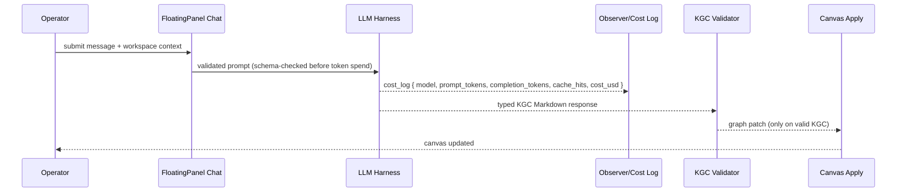
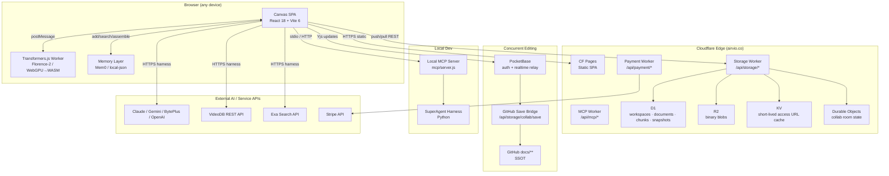

# Knowgrph — Tech Stack Document

**Context**: Solo-dev, AI-native knowledge graph and media intelligence platform. Canonical source: `huijoohwee/knowgrph`. Deployed at `airvio.co/knowgrph` via Cloudflare Pages + Workers.
**Intent**: Provide an end-to-end reference for the platform's user flow, orchestration/harness flow, workflow, and data flow — with a side-by-side infrastructure comparison across Cloudflare, Alibaba Cloud (Serverless App Engine / SAS), Alibaba Cloud (ECS), and AWS — evaluated through the four compounding lenses: min-viable-max-value, TCO-zero, token economics, and harness-first.
**Directive**: Treat GitHub `docs/**` as SSOT. Apply FOSS-first for every layer. Expose every AI pipeline through a typed harness. Cap all async loops with a circuit-breaker. Zero-egress infrastructure preferred by default. **Native-in-repo**: all runtime surfaces live in `huijoohwee/knowgrph` on the Cloudflare + local stack — Vercel, Supabase, and AWS are excluded from the runtime topology (per `knowgrph-agentic-os-prd-tad.md` ADR-3); AWS and Alibaba Cloud appear in this document only as TCO comparison columns, never as deploy targets.
**MCP install note**: For remote MCP onboarding, treat `https://airvio.co/knowgrph/mcp` as the canonical public install/discovery URL and `https://airvio.co/knowgrph/control-plane/mcp` as the separate approval-gated grammar/orchestration surface. Live `/`, `#`, and `@` grammar executes through `knowgrph.agentic_canvas_os.docs.invoke` on the control plane; current examples are `/mcp.capabilities`, `#mcp`, and `@mcp-gateway`. The operator-facing setup contract lives in `docs/documents/knowgrph-mcp-install-contract.md` in the source repo and mirrored publish docs. The shortest guided path now starts at `docs/documents/knowgrph-mcp-onboarding-index.md`. For the cheapest proof path before any hosted setup, use the source-side offline deterministic route in `huijoohwee/knowgrph` `README.md` or `docs/documents/knowgrph-superagent-harness.md`.

**Published MCP entry points**:
- `docs/documents/knowgrph-mcp-onboarding-index.md`
- `docs/documents/knowgrph-mcp-install-contract.md`
- `docs/documents/knowgrph-mcp-service-prd-tad.md`
- `docs/documents/knowgrph-mcp-agentic-os-prd-tad.md`
- `docs/documents/knowgrph-mcp-service-prd-tad.companion.md`
- `docs/documents/knowgrph-mcp-agentic-os-prd-tad.companion.md`

---

## Table of Contents

1. [Four-Lens Overview](#four-lens-overview)
2. [User Flow](#user-flow)
3. [Orchestration / Harness Flow](#orchestration--harness-flow)
4. [Workflow](#workflow)
5. [Data Flow](#data-flow)
6. [Topology](#topology)
7. [Component Stack](#component-stack)
8. [Infrastructure Comparison](#infrastructure-comparison)
9. [ADR Summary](#adr-summary)
10. [Token Economics](#token-economics)
11. [TCO Summary](#tco-summary)
12. [Agentic OS Follow-On Tracks](#agentic-os-follow-on-tracks)

---

## Four-Lens Overview

| Lens | Applied Constraint | Key Decision |
|---|---|---|
| **Min-Viable-Max-Value** | Ship the smallest scope delivering the largest user impact per sprint | Canvas SPA + CF Pages + D1 Worker before PocketBase collab or PG scale-up |
| **TCO-Zero** | Every paid dependency requires explicit TCO justification vs FOSS | R2 + D1 + CF Pages (zero-egress, zero-fixed-cost) over S3 + RDS; Transformers.js in-browser over paid vision API |
| **Token Economics** | LLM token spend is a measurable engineering metric at every pipeline boundary | Cost log emitted per harness call; 36 × 10s circuit-breaker on all async AI ops; prompt assembly bounded by `max_memory_tokens` |
| **Harness-First** | Every AI capability accessed through typed input → model → typed output + cost log | SuperAgent harness, memory layer harness, HTML video render job, visual annotation engine — all harness-wrapped |

---

## User Flow

### Journey: Operator — Build and Deploy a Knowledge Graph Canvas

| Stage | Action | Touchpoint | Pain Point | Opportunity |
|---|---|---|---|---|
| **Trigger** | Operator wants to visualise and extend a knowledge graph from docs | `airvio.co/knowgrph` SPA | Cold start with no workspace data | `ensureSeed()` auto-seeds from `workspace.import.defaultSourceUrl` |
| **Discover** | Browse canvas nodes, run vdeoxpln skill discovery | Canvas Flow Editor + FloatingPanel Chat | Unknown which AI skills are available | Vdeoxpln registry surfaces all agent capabilities per session |
| **Configure** | Set MCP server (Exa, VideoDB, Stripe, GrabMaps, etc.) in MainPanel MCP | `SettingsView mode="mcp"` | Credentials easy to leak into browser storage | Non-secret config only; `${API_KEY}` placeholder pattern enforced |
| **Engage** | Author markdown, run compute flows, invoke AI harnesses | Flow Editor nodes + FloatingPanel Chat | Token cost invisible; async jobs stall silently | Cost log per harness call; 36 × 10s circuit-breaker for async ops |
| **Complete** | Export artifact (image/video/annotation/script) to canvas | Rich Media Panel + Storage Worker | Persistence ambiguous (local vs Cloudflare) | R2 blob route + D1 manifest confirm dual-path persistence |
| **Return** | Re-enter workspace; previous state and memory layer intact | PocketBase + Yjs collab room or D1 export seed | Cold restart loses context | Memory layer (Mem0 / local-json) + Storage Sync 120 s poll keep state warm |

### Journey: Agent — Autonomous Pipeline Run via MCP

| Stage | Action | Touchpoint | Pain Point | Opportunity |
|---|---|---|---|---|
| **Trigger** | External agent calls `knowgrph.showrunner.start_run` | Local MCP server (`mcp/server.js`) | No durable run lifecycle | Pipeline_Run state machine: queued → running → awaiting_review → complete |
| **Execute** | Agent posts creative state, queries memory, dispatches video/annotation | MCP tools: `knowgrph.memory.search`, `knowgrph.annotate.image`, `knowgrph.html_video.render` | Runaway token spend | Token budget gate halts before each turn that would exceed budget |
| **Review** | Operator approves stage via `knowgrph.showrunner.approve_stage` | Approval-gate primitive | Manual approval blocks automation | Gate surfaced in Flow Editor; auto-skip option for trusted runs |
| **Complete** | Final artifact package written to Source Files | Source Files storage publication helper | Artifact location unknown | Artifact_Package manifest at `showrunner/runs/<run_id>/manifest.md` |

---

## Orchestration / Harness Flow

### Pipeline: FloatingPanel Chat → KGC → Canvas

**Topology pattern**: Sequential | **Max iterations**: 1 (single-turn) | **Circuit-breaker**: structured `{ ok: false }` on schema failure
**Token budget**: ~1 200 prompt + ~400 completion @ ~40% cache hit rate ≈ $0.002 / call (Claude Sonnet estimate)

| Role | Component | Input schema | Output schema | Cost log | Fallback |
|---|---|---|---|---|---|
| Dispatcher | `floatingPanelChat` router | `{ userMessage, workspaceContext }` | `{ modelId, promptTokens, systemPrompt }` | — | Reject with `{ ok:false, errorCode:"no_model_configured" }` |
| Executor | LLM harness (Claude / Gemini / BytePlus / OpenAI) | Typed prompt + tool schema | Typed KGC Markdown response | ✓ `{ model, prompt_tokens, completion_tokens, cache_hits, estimated_cost_usd }` | Degraded mode: return partial response; surface cost log gap |
| Observer | Cost log emitter | Cost log stream | Metric written to run trace | — | Silent fail; log gap flagged in monitoring |
| Consumer | `chatKgcCanvasApply.ts` | KGC-validated Markdown/frontmatter | Canvas graph patch | — | Upstream error propagation; no graph mutation on invalid KGC |



### Pipeline: HTML Video Render Job

**Topology pattern**: Sequential | **Max iterations**: 1 | **Circuit-breaker**: `{ ok:false, errorCode:"render_failed" }` after engine throws
**Token budget**: 0 (no LLM call — local render pipeline only)

| Role | Component | Input schema | Output schema | Cost log | Fallback |
|---|---|---|---|---|---|
| Dispatcher | `validateRenderSpec()` | `{ html, durationMs, fps, width, height, css?, data?, engineHint? }` | Validated `RenderSpec` | — | `{ ok:false, errorCode:"invalid_spec", field, reason }` |
| Executor | Active `RenderEngine` adapter (headless-browser / canvas-2d / server-side) | `Readonly<RenderSpec>` | `{ blob: Blob (video/*), engineId, durationMs, fps, width, height }` | ✓ emitted via `writeRichMediaWidgetRunOutputArtifact` | `{ ok:false, errorCode:"render_failed" }` |
| Observer | `richMediaRun.ts` artifact pipeline | Blob + manifest | `outputPath`, `outputManifestPath`, `outputStorageUrl` | — | Degraded success: `outputPath: null` |
| Consumer | Canvas apply | Typed `HtmlVideoRunOk` | Rich-media canvas node | — | Upstream error propagation |

### Pipeline: Visual Annotation Engine (Florence-2-base / Transformers.js)

**Topology pattern**: Sequential | **Max iterations**: 1 | **Circuit-breaker**: inference timeout 120 s → `{ ok:false, errorCode:"inference_failed", reason:"inference_timeout" }`
**Token budget**: 0 (in-browser WASM/WebGPU inference — zero LLM cost)

| Role | Component | Input schema | Output schema | Cost log | Fallback |
|---|---|---|---|---|---|
| Dispatcher | `validateAnnotationSpec()` | `{ assetUrl, assetType, tasks[], modelHint? }` | Validated `Annotation_Spec` | — | `{ ok:false, errorCode:"invalid_spec" }` |
| Executor | `Annotation_Worker` (Transformers.js pipeline, WebGPU → WASM fallback) | `Annotation_Spec` + model weights (IndexedDB cache) | `Annotation_Result { ok:true, annotationId, tasks, modelId, durationMs }` | ✓ `durationMs` recorded per run | `{ ok:false, errorCode:"inference_failed", modelId, reason }` |
| Observer | Progress events | `{ type:"progress", loaded, total }` | UI progress indicator | — | Silent fail on progress gap |
| Consumer | Canvas annotation node (`writeRichMediaWidgetRunOutputArtifact`) | `Annotation_Result` JSON | `kind:"annotation"` canvas node | — | `{ ok:false, errorCode:"artifact_write_failed" }` |

### Pipeline: AI Agents Memory Layer (Mem0 / local-json)

**Topology pattern**: Sequential (single-call) | **Max iterations**: 1 per operation | **Circuit-breaker**: structured MCP error on any failure
**Token budget**: add/search are bounded by `max_memory_tokens` in `assemble_prompt`; zero extra model calls for add or search

| Role | Component | Input schema | Output schema | Cost log | Fallback |
|---|---|---|---|---|---|
| Dispatcher | `requireMemoryScope()` | `{ text/messages, user_id?, agent_id?, run_id?, app_id? }` | Validated scope + text | — | MCP structured error on missing scope |
| Executor | `mcp/memory-layer-runtime.js` (local-json mode) | Scoped add/search request | Memory record or ranked results | ✓ `injected_token_estimate` in `assemble_prompt` | Empty result or structured error; agent turn continues |
| Observer | Token estimator | `memories`, `max_memory_tokens` | `injected_token_estimate` | — | Inject no context when zero fits budget |
| Consumer | Downstream agent prompt | Enriched system message | Agent turn with injected context | — | Agent proceeds without memory |

---

## Workflow

### Workflow: Storage Sync (Solo / Collaborative)

**Trigger**: Toolbar → Workspace View → Storage Sync toggled ON
**Actors**: Operator (browser), Storage Worker (CF Worker), GitHub save bridge, PocketBase + Yjs (concurrent edit)

**Happy Path (solo — Path A)**:
1. Operator edits `*.md` files in workspace → `sourceFilesStorageSync.ts` pushes to CF Worker
2. CF Worker upserts to D1 (`documents`, `document_chunks`, `graph_snapshots`)
3. 120 s poll loop pulls latest revisions → auto-clear stale outbox conflicts on no-change
4. Toolbar confirms sync state

**Happy Path (collaborative — Path F)**:
1. User A and User B open same `*.md` / `*.json` → editor joins PocketBase-backed Yjs room
2. PocketBase realtime relays Yjs update envelopes; `Y.Text` (md) / `Y.Map` (json) merge character/field-level
3. On save: GitHub save bridge serializes Y.Doc → commits to GitHub docs SSOT
4. Neither user touches Git directly; D1 remains read/export cache only

**Error Paths**:
- CF Worker unavailable: client push/pull fails gracefully; local cache persists until Worker returns
- PocketBase unreachable: Yjs room degrades to local-only; bridge commit deferred
- D1 write amplification: read-first `ensure*` guards skip writes on no-change

**Postconditions**: GitHub `docs/**` remains SSOT; D1 is a consistent read/export replica; no data loss on browser reload

### Workflow: Async Video Intelligence (VideoDB MCP + REST dual path)

**Trigger**: Operator dispatches approved Strybldr card to VideoDB pipeline (MCP or REST path)
**Actors**: Operator, MCP host, VideoDB REST API, Strybldr, FloatingPanel Chat

**Happy Path**:
1. Strybldr card approved → dispatch via `upload_video` (async, returns job_id)
2. `get_async_response` polled max 36 × 10 s (circuit-breaker)
3. `index_video` (async, poll) → `search_videos` (sync) → `stream_video` (sync)
4. Publish packet: `{ video_id, stream_url, search_results, transcript_text }` delivered to Canvas

**Error Paths**:
- `VIDEODB_API_KEY` absent: MainPanel MCP surfaces placeholder; no browser-stored literal
- Async timeout (36 iterations): circuit-breaker exits with partial result + iteration-limit error
- Fabricated IDs rejected: no `video_id`, `job_id`, or `stream_url` inferred from docs/fixtures

---

## Data Flow

### Data Flow: Workspace Document Sync

| Stage | Component | Input Format | Output Format | Persistence | Error Handling |
|---|---|---|---|---|---|
| Ingest | `workspaceSeedProvider.ts` → `ensureSeed()` | GitHub raw Markdown / D1 export JSON | Workspace FS entries | None (transient) | Retry on fetch fail; fallback to local cache |
| Transform | `sourceFilesStorageSync.ts` (push bridge) | Workspace FS entries | D1 `push` payload (documents + chunks + graph_snapshots) | None | Read-first ensure*; skip write on no-change |
| Store | CF D1 Worker (`documents`, `document_chunks`, `graph_snapshots`) | Push payload | SQL rows | D1 remote SQLite (CF edge) | Rollback on transaction fail; alert on D1 write error |
| Serve | `GET /api/storage/export/:workspaceId` | D1 query | Export JSON | None (on-demand) | 503 fallback on Worker unavailable |

### Data Flow: Generated Binary Artifact (R2 + D1 Manifest)

| Stage | Component | Input Format | Output Format | Persistence | Error Handling |
|---|---|---|---|---|---|
| Ingest | `uploadGeneratedWorkspaceBlobToKnowgrphStorage()` | Blob (image/video/binary) | POST to `/api/storage/blob/:workspaceId/:path*` | None | Fail-fast: no local artifact claim before R2 confirmation |
| Store (bytes) | CF R2 (`knowgrph-storage-blobs`) | Blob | R2 object (key = workspace/canonical-path) | R2 (persistent, zero-egress) | Retry × 3; error if key already exists with different hash |
| Store (manifest) | `writeKgcCompanionOutputBlob()` → D1 `documents` | Sibling Markdown manifest | D1 document row | D1 | Rollback manifest write if R2 upload fails |
| Serve | `GET /api/storage/blob/:workspaceId/:path*` | R2 object key | Blob body / HEAD metadata | R2 (cache) | 404 if key absent; 503 on Worker unavailable |

### Data Flow: Annotation Result → Canvas

| Stage | Component | Input Format | Output Format | Persistence | Error Handling |
|---|---|---|---|---|---|
| Ingest | `validateAnnotationSpec()` | `Annotation_Spec` JSON | Validated spec | None | `{ ok:false, errorCode:"invalid_spec" }` returned immediately |
| Transform | `Annotation_Worker` (Transformers.js, Florence-2-base) | Validated spec + cached model weights | `Annotation_Result` JSON | IndexedDB (model weights only) | Timeout 120 s → `inference_failed`; partial task success returns `ok:true` with per-task errors |
| Store | `writeRichMediaWidgetRunOutputArtifact` → Source Files | `Annotation_Result` JSON | Canvas node + optional Storage Worker manifest | Source Files (workspace) | `artifact_write_failed` on throw; degraded success on `outputPath:null` |
| Serve | Canvas flow editor renderer | Annotation canvas node | `kind:"annotation"` rich-media widget | In-memory canvas graph | Upstream error propagation |

---

## Topology

**Version**: 1.1.0 — 2026-07-02 (v1.1.0 adds the Agentic OS Os_Status_Tool aggregation node and records the ADR-3 vendor exclusions — no Vercel, Supabase, or AWS node exists or is added; v1.0.0 of 2026-06-29 archived in git history)
**Boundaries**: Dev (localhost), CF Edge (airvio.co), Concurrent Edit (PocketBase self-hosted), External APIs

| Node | Role | Type | Connects to | Connection type | Data residency |
|---|---|---|---|---|---|
| Canvas SPA | Consumer + Producer | React 18 SPA (Vite 6) | CF Pages, Storage Worker, PocketBase, MCP server | Sync HTTPS, Async WebSocket | Browser memory; IndexedDB (model weights) |
| CF Pages | Static host | CDN | Canvas SPA (static assets) | Sync HTTPS | CF edge (global CDN, zero-egress) |
| Storage Worker | Router + Store gateway | CF Worker (Hono) | D1, R2, KV, Durable Objects | Sync REST (`/api/storage/*`) | CF region (D1 = remote SQLite; R2 = object store) |
| D1 | Store | CF D1 (SQLite) | Storage Worker | Sync SQL (Worker-local) | CF region (configurable) |
| R2 | Store | CF R2 (object store) | Storage Worker, blob route | Sync HTTP (Worker-local) | CF region (zero-egress) |
| KV | Cache | CF KV | Storage Worker (media access URL cache) | Sync (Worker-local) | CF edge (global) |
| Durable Objects | State / collab room | CF Durable Object | Storage Worker, canvas room | Async (Worker-local) | CF region |
| Payment Worker | Router + gateway | CF Worker (Hono + x402) | Stripe API, x402 EVM | Sync REST (`/api/payment/*`) | CF region |
| MCP Worker | Tool gateway | CF Worker | MCP host (stdio / HTTP) | Sync REST + stdio | CF region |
| Local MCP server | Tool surface | Node.js stdio server (`mcp/server.js`) | Canvas SPA, AI agents | stdio (local) | Local dev |
| PocketBase | Auth + realtime relay | Self-hosted (Go) | Canvas SPA (Yjs update envelopes) | WebSocket (realtime) | Operator-controlled host |
| GitHub save bridge | SSOT commit writer | CF Worker route (`/api/storage/collab/save`) | GitHub Contents API, PocketBase | Sync HTTPS | GitHub (docs SSOT) |
| GitHub docs SSOT | Canonical store | Git repo (`docs/**`) | GitHub save bridge, `ensureSeed()` | Sync HTTPS (Contents API) | GitHub (remote) |
| External AI APIs | Executor backends | SaaS (Claude, Gemini, BytePlus, OpenAI, VideoDB, Exa) | FloatingPanel Chat harness | Sync HTTPS | Provider-controlled |
| Transformers.js Worker | In-browser executor | Web Worker (WASM / WebGPU) | Canvas SPA | postMessage (transferable) | Browser (IndexedDB weights cache) |
| SuperAgent harness | Orchestrator | Python subprocess | MCP tools, local filesystem | Subprocess / stdio | Local dev |
| Os_Status_Tool (Agentic OS) | Read-only aggregator + gateway | Node.js module (`mcp/os-status-runtime.js`), dispatched from `mcp/server.js` | Showrunner/Video_Remix/SuperAgent state, Vdeoxpln + local + Cloudflare `McpAgent` catalogs, cost-log/approval contracts | In-process sync reads + optional async MCP Streamable HTTP (CF catalog) | Local dev process memory (no persistence — zero new datastore) |



---

## Component Stack

### Frontend — Canvas SPA

| Layer | Technology | Version | Role | FOSS? |
|---|---|---|---|---|
| UI framework | React | 18.3.1 | Component tree, concurrent rendering | ✓ MIT |
| Build tool | Vite | 6.3.5 | Dev server, HMR, production bundler | ✓ MIT |
| Language | TypeScript | 5.8.3 | Type safety, compile-time contracts | ✓ Apache 2.0 |
| Routing | react-router-dom | 7.3.0 | SPA routing | ✓ MIT |
| State management | Zustand | 5.0.3 | Lightweight global stores | ✓ MIT |
| Styling | Tailwind CSS | 3.4.17 | Utility-first CSS | ✓ MIT |
| Icons | Lucide React | 0.562.0 | Icon library | ✓ ISC |
| Markdown parsing | markdown-it | 14.1.0 | SSOT Markdown renderer | ✓ MIT |
| Graph / math rendering | KaTeX | 0.16.11 | Equation rendering | ✓ MIT |
| Diagram rendering | Mermaid | 11.12.2 | Architecture / flow diagrams | ✓ MIT |
| Code editor | Monaco Editor | 0.53.0 | In-canvas code editing | ✓ MIT |
| 2D graph layout | Dagre | 0.8.5 | Flow editor DAG layout | ✓ MIT |
| Geo / map layer | MapLibre GL | 5.7.3 | Zero-cost tile rendering | ✓ BSD-3 |
| 3D canvas | Three.js + @react-three/fiber | 0.170.0 / 8.17.8 | 3D knowledge graph view | ✓ MIT |
| CRDT collaboration | Yjs | 13.6.31 | Y.Text / Y.Map concurrent editing | ✓ MIT |
| Collab auth/relay | PocketBase JS SDK | 0.27.0 | Realtime room management | ✓ MIT |
| In-browser ML | @huggingface/transformers | 4.2.0 | Transformers.js, Florence-2-base annotation | ✓ Apache 2.0 |
| Video encode (browser) | Native MediaRecorder | Browser-supported | Canvas capture recorder for the canvas-2d adapter; no imported muxer | Browser API |
| HTML-to-canvas | html2canvas | 1.4.1 | Canvas-2D render path for HTML video | ✓ MIT |
| Headless browser | Playwright | 1.60.0 | Headless-browser render adapter (dev/CI) | ✓ Apache 2.0 |
| Reactive streams | RxJS | 7.8.2 | Storage sync observables | ✓ Apache 2.0 |
| Date handling | dayjs | 1.11.19 | Timestamp formatting | ✓ MIT |
| PWA | vite-plugin-pwa + Workbox | 0.21.1 | Service worker, offline support | ✓ MIT |

### Runtime Selection Posture

| Option | Current role in knowgrph | Decision | Why |
|---|---|---|---|
| TypeScript / modern JS | Primary app/runtime language across Canvas SPA, Cloudflare Workers, MCP handlers, and shared contracts | **Primary** | Native fit for Cloudflare Workers and browser runtimes; fastest ship/debug loop for a solo dev; shared types reduce spec drift across UI, Worker, and MCP surfaces |
| WASM | Targeted acceleration layer inside the browser runtime | **Selective** | Use only where it removes paid API spend or unlocks bounded local inference, such as Transformers.js with WebGPU -> WASM fallback |
| Go | Productized dependency runtime only | **Not primary** | Keep isolated to PocketBase where the product already ships in Go; do not expand Go into the core knowgrph runtime without a measured bottleneck that TypeScript cannot meet |
| Other alts (Rust, Zig, C++) | Not in the current app/runtime path | **Deferred** | Additional toolchain and bridge cost does not beat the current TypeScript-first path for I/O-bound Cloudflare + MCP workloads |

### Backend — Cloudflare Workers

| Layer | Technology | Version | Role | FOSS? |
|---|---|---|---|---|
| Worker framework | Hono | 4.12.23 | Routing, middleware, typed handlers | ✓ MIT |
| Runtime query layer | Drizzle ORM | 0.45.2 | Typed runtime queries against D1 | ✓ Apache 2.0 |
| Schema migrations | Wrangler-managed D1 SQL migrations | — | Versioned SQL is the sole schema authority; no `drizzle-kit` ownership | Wrangler tooling |
| Database | Cloudflare D1 (SQLite) | — | Remote shared store; read/export cache | Proprietary (zero fixed cost; zero-egress) |
| Object store | Cloudflare R2 | — | Binary blob storage (zero-egress) | Proprietary (zero-egress; S3-compatible) |
| Cache | Cloudflare KV | — | Short-lived access URL cache | Proprietary (minimal cost) |
| State / rooms | Cloudflare Durable Objects | — | Collab room state, canvas room notifications | Proprietary |
| CDN / hosting | Cloudflare Pages | — | Static SPA hosting (zero-egress) | Proprietary (free tier) |
| Payments (on-chain) | @x402/hono + @x402/core | 2.13.0 | x402 HTTP payment protocol | ✓ Apache 2.0 |
| Auth tokens | jsonwebtoken | 9.0.2 | JWT verification in Worker | ✓ MIT |

Responsive deploy note: when a release changes mobile grammar reachability, heavy-runtime intent
policy, or touch-first behavior, Cloudflare Pages deploys stay blocked until the mobile keyboard
browser smoke, `pages:check-sync`, and the route-and-action review in
`docs/documents/knowgrph-feature-map.md` agree.

### AI / Agent Layer

| Layer | Technology | Role | Provider | FOSS / Zero-TCO? |
|---|---|---|---|---|
| LLM harness | FloatingPanel Chat → KGC pipeline | Multi-provider chat, structured output | Claude / Gemini / BytePlus / OpenAI | Harness FOSS; model calls pay-per-use |
| Memory layer | Mem0 / local-json runtime (`mcp/memory-layer-runtime.js`) | Cross-session agent memory | Local-json (FOSS, zero-TCO Dev) / Mem0 Platform (pay-per-use) | ✓ Dev path zero-TCO |
| MCP local server | `mcp/server.js` (@modelcontextprotocol/sdk) | Stdio MCP tool surface | Local dev | ✓ MIT |
| SuperAgent harness | `knowgrph_parser/superagent_harness.py` | Multi-role research → code → verify loop | Local Python + LLM | ✓ Python harness FOSS |
| Research compiler | `researchThesisContract.ts` | Investment thesis / research scout | Internal | ✓ Internal |
| Swarm prediction | `swarmPredictionEngine.ts` | Parallel ensemble scoring | Internal | ✓ Internal |
| AI showrunner | `mcp/showrunner-runtime.js` | Creative pipeline orchestration (podcast / narrative / writers' room) | Internal + MCP tools | ✓ Internal |
| Agentic OS (Os_Status_Tool) | `mcp/os-status-runtime.js` (`knowgrph.os.status`) | OS-level read-only unification | Internal ($0/call) | ✓ Implemented — see agentic-os PRD/TAD v0.4.1 |
| Agentic OS follow-on | `mcp/video-remix/approval-token-issuer.js`, `live-clients.js`, agentic canvas plan | HITL + live stages + dashboard lanes | Provider-dependent when live | Follow-on PRD/TAD v1.0.0 — local modules implemented |
| Vision annotation | Transformers.js + Florence-2-base (MIT) | In-browser image / video-frame annotation | Browser (WASM / WebGPU) | ✓ Zero-TCO |
| HTML video renderer | `htmlVideoRenderJob.ts` + engine adapters | HTML-to-video local render | Headless-browser (Playwright) / Canvas-2D / Server-side | ✓ Zero-TCO for canvas-2d path |
| Video intelligence | VideoDB Director MCP (`videodb-director-mcp`) | Upload / index / search / stream / AI gen | VideoDB API (pay-per-use) | FOSS MCP package; API pay-per-use |
| Web search | Exa MCP | Semantic web search | Exa API (pay-per-use) | FOSS MCP package; API pay-per-use |

### Collaboration Layer

| Layer | Technology | Role | FOSS? |
|---|---|---|---|
| CRDT engine | Yjs (`Y.Text`, `Y.Map`) | Character/field-level concurrent edit, zero conflicts | ✓ MIT |
| Realtime relay | PocketBase (`collab_rooms`, `collab_updates`, `collab_awareness`) | Auth, room metadata, update fanout | ✓ MIT |
| SSOT commit bridge | GitHub save bridge (Worker + Contents API) | Serialize Yjs snapshot → auto-commit to GitHub docs | ✓ Worker code FOSS; GitHub API free tier |

### Python Toolchain

| Component | Role | FOSS? |
|---|---|---|
| `knowgrph_parser/` | Markdown parsing, graph building, JSON-LD, codebase index, GraphRAG, YouTube / web ingest | ✓ Internal + FOSS deps |
| SuperAgent harness | Multi-role LLM pipeline runner, state.json + trace.jsonl | ✓ Internal |
| Playwright (Python) | Headless browser automation for video frame capture | ✓ Apache 2.0 |

---

## Infrastructure Comparison

> Side-by-side: Cloudflare (current) vs Alibaba Cloud (SAS — serverless/managed) vs Alibaba Cloud (ECS — self-managed VM) vs AWS — for each major flow in the Knowgrph stack. The Alibaba Cloud split isolates the "pay only for what runs" serverless path (Function Compute, Serverless App Engine, PolarDB Serverless) from the "pay for provisioned capacity" ECS + self-hosted path (Elastic Compute Service VMs running Docker/Nginx/Postgres/Redis directly), since these carry materially different TCO and ops-effort profiles.

### User Flow Infrastructure

| Component | User Flow Role | Cloudflare | Alibaba Cloud (SAS) | Alibaba Cloud (ECS) | AWS | Comments |
|---|---|---|---|---|---|---|
| Static SPA hosting | Serve Canvas SPA to browser | **CF Pages** (free tier, global CDN, zero-egress) | OSS + CDN (pay-per-GB egress) | ECS + Nginx (fixed VM cost + egress) | S3 + CloudFront (pay-per-GB egress) | CF Pages wins on TCO at typical indie traffic. Zero-egress is the decisive factor; ECS adds VM uptime cost even at zero traffic. |
| Domain / DNS | Route traffic | **CF DNS** (free, Anycast, DDoS protection) | Alibaba DNS (basic free) | Alibaba DNS (basic free) | Route 53 ($0.50/zone/month + queries) | CF DNS free tier covers all knowgrph DNS needs; identical DNS layer regardless of SAS/ECS choice. |
| Auth / session | Operator login | **CF Pages** (JWT via Worker) / PocketBase | RAM + ACM (managed) | RAM + self-hosted PocketBase on ECS | Cognito ($0.0055/MAU after 50 k) | PocketBase self-hosted is zero fixed cost beyond VPS; CF Worker JWT adds no per-user cost. |

### Orchestration / Harness Flow Infrastructure

| Component | Harness Role | Cloudflare | Alibaba Cloud (SAS) | Alibaba Cloud (ECS) | AWS | Comments |
|---|---|---|---|---|---|---|
| AI pipeline executor | LLM harness invocation | **CF Worker** (dispatcher + cost log; 128 MB, 10 ms CPU) | FC (Function Compute, 512 MB, 300 s timeout) | ECS VM + PM2/systemd process (no cold start, fixed cost) | Lambda (512 MB, 15 min timeout) | CF Workers 10 ms CPU limit requires streaming/chunked harness calls. Lambda 15 min timeout handles long SuperAgent runs. ECS avoids cold starts entirely but bills 24/7 regardless of call volume. |
| Async job polling | `get_async_response` 36 × 10 s circuit-breaker | CF Worker + Durable Objects (persistent timer) | FC + Message Queue | ECS cron/systemd timer + local state file | Lambda + SQS + EventBridge | CF Durable Objects owns the timer state natively with zero infra setup. ECS cron is simplest to reason about but has no built-in HA; SQS + EventBridge is more operationally complex but battle-tested at scale. |
| Token budget gate | Halt before over-budget agent turn | CF Worker (runtime check per turn) | FC (same) | ECS process (in-memory or local SQLite check) | Lambda (same) | Mechanically equivalent across all four; cost difference is negligible at solo-dev scale. |
| Circuit-breaker state | Max-iteration tracking | **Durable Objects** (named room, consistent state) | Redis (Tair, managed) | Self-hosted Redis on ECS | ElastiCache Redis | Durable Objects requires no additional infra. Self-hosted Redis on ECS is cheapest at scale but adds patching/backup burden; managed Tair/ElastiCache remove that burden at a premium. |

### Workflow Infrastructure

| Component | Workflow Role | Cloudflare | Alibaba Cloud (SAS) | Alibaba Cloud (ECS) | AWS | Comments |
|---|---|---|---|---|---|---|
| Database (sync store) | D1 — workspace / document / chunk rows | **CF D1** (SQLite, 10 GB free, zero-egress) | PolarDB Serverless / RDS MySQL (pay-per-GB + per-RCU) | Self-hosted MySQL/Postgres on ECS (fixed VM cost) | RDS / Aurora (pay-per-GB, egress costs) | D1 wins decisively on TCO at dev/indie scale. Self-hosted Postgres on ECS is cheapest at sustained high write volume but requires manual backup/failover; PolarDB/RDS trade cost for managed ops. |
| Object store (blobs) | R2 — binary artifact bytes | **CF R2** (zero-egress, S3-compatible, 10 GB free) | OSS (pay-per-GB egress) | ECS + local disk or mounted OSS (fixed VM cost + egress) | S3 (pay-per-GB egress) | R2 zero-egress is the single biggest TCO win vs S3/OSS for media-heavy workloads. Storing blobs directly on ECS disk is viable only at low volume and adds single-point-of-failure risk. |
| Cache layer | KV — short-lived access URLs | **CF KV** (1 GB free, global reads) | Redis (Tair, managed) | Self-hosted Redis on ECS | ElastiCache / DynamoDB TTL | CF KV is sufficient for URL cache use case at zero cost. Self-hosted Redis on ECS undercuts Tair/ElastiCache cost at scale but shifts ops burden to the solo dev. |
| CRDT relay | PocketBase realtime | Self-hosted PocketBase (zero cost on any VPS) | Serverless App Engine (SAE) container (pay-per-use) | **ECS VM + Docker** (fixed cost, matches current PocketBase deployment model) | ECS Fargate / EC2 + S3 | PocketBase is the only FOSS option with built-in realtime. Alibaba ECS is the closest architectural match to knowgrph's current "PocketBase on a VPS" pattern; SAE trades that fixed cost for pay-per-use at the cost of cold starts on a stateful WebSocket service (a poor fit). |
| GitHub SSOT bridge | Auto-commit Yjs snapshots | CF Worker route + GitHub Contents API | FC + GitHub API | ECS process + GitHub API | Lambda + GitHub API | Mechanically equivalent. CF Worker already deployed; no additional infra. |

### Data Flow Infrastructure

| Component | Data Flow Role | Cloudflare | Alibaba Cloud (SAS) | Alibaba Cloud (ECS) | AWS | Comments |
|---|---|---|---|---|---|---|
| Ingest / seed | `ensureSeed()` fetch from URL or D1 export | CF Worker (`GET /api/storage/export/:id`) | FC + OSS | ECS process + local/OSS read | Lambda + S3 | CF Worker handles this natively. No additional infra needed; ECS adds a persistent process for a low-frequency operation. |
| Transform / push | `sourceFilesStorageSync.ts` push payload | CF D1 via Worker | PolarDB write via FC | Self-hosted DB write via ECS process | RDS write via Lambda | Equivalent logic. CF D1 has no connection pool overhead (HTTP-native); ECS self-hosted DB avoids per-request connection setup but needs its own pool tuning. |
| Blob upload | R2 binary artifact | CF Worker blob route → R2 | FC → OSS | ECS process → OSS (or local disk) | Lambda → S3 | R2 zero-egress saves ~$0.09/GB on every read compared to S3/OSS. At 10 GB/month media traffic, that is $10.80/month savings vs both AWS and Alibaba paths regardless of SAS/ECS split. |
| Manifest store | D1 document row (sibling to R2 blob) | CF D1 | PolarDB / RDS | Self-hosted DB on ECS | RDS / Aurora | D1 row-level writes at D1 free tier limits easily cover knowgrph solo-dev volume; ECS self-hosted DB is cheapest at high sustained volume but adds backup/HA responsibility. |
| Serve / export | `GET /api/storage/blob/:workspaceId/:path*` | CF R2 via Worker | OSS + CDN | ECS + Nginx serving from local/mounted OSS | S3 + CloudFront | CF R2 + Worker: zero-egress. ECS + Nginx: fixed VM cost regardless of traffic, plus OSS egress if not cached locally. S3 + CloudFront: ~$0.085/GB transfer. |

### Typical Lean Startup Tech Stack (Similar Projects)

| Layer | Lean Startup Default | Knowgrph Actual | Alibaba Cloud (SAS) equiv. | Alibaba Cloud (ECS) equiv. | Delta vs Knowgrph Actual |
|---|---|---|---|---|---|
| Frontend | React + Vite + Vercel | React + Vite + **CF Pages** | OSS + CDN static hosting | ECS + Nginx static hosting | CF Pages is free-tier vs Vercel Pro $20/month and vs ECS fixed VM cost; zero-egress vs both Vercel bandwidth charges and OSS/ECS egress |
| Database | PlanetScale / Supabase | **CF D1** + Drizzle ORM | PolarDB Serverless / RDS MySQL | Self-hosted MySQL/Postgres on ECS | D1 free 10 GB vs Supabase $25/month for >500 MB; no connection pooling overhead vs both Alibaba paths |
| Object storage | AWS S3 | **CF R2** | OSS (Object Storage Service) | ECS local disk / mounted OSS | R2 zero-egress vs S3/OSS ~$0.08–0.09/GB egress; identical S3-compatible API |
| AI harness | LangChain / LlamaIndex | Custom typed harness (in-house) | Same harness on FC | Same harness on ECS process | Zero dependency on opinionated frameworks; lower token overhead; harness-first compliant regardless of hosting substrate |
| Memory layer | Redis + vector DB (Pinecone/Weaviate) | **Mem0 local-json** (Dev) → Mem0 Platform (Prod) | Tair (managed Redis) + PolarDB vector | Self-hosted Redis + pgvector on ECS | Local-json zero-TCO Dev path; Mem0 Platform ~$0.05/1k ops vs Pinecone $0.10/1k; self-hosted ECS cheapest at scale but highest ops burden |
| Realtime collab | Firebase / Supabase Realtime | **PocketBase + Yjs** | Serverless App Engine (SAE) container | **ECS VM + Docker** (closest architectural match) | PocketBase self-hosted ~$5/month VPS; Firebase Blaze ~$25+/month; Alibaba ECS mirrors the same self-hosted pattern at similar cost |
| Auth | Auth0 / Clerk | **JWT in CF Worker** (+ PocketBase for collab) | RAM + ACM (managed) | Self-hosted auth service on ECS | Zero per-MAU cost vs Auth0 $23/month for >7 500 MAU |
| Payments | Stripe (server-side only) | **Stripe + x402 on-chain** (CF Worker) | Stripe + FC webhook handler | Stripe + ECS webhook handler | x402 enables agent-to-agent micropayments on-chain; no additional infra beyond the existing CF Worker |
| Serverless compute | Vercel Functions / Netlify Functions | **CF Workers** (Hono) | FC (Function Compute) | ECS VM (always-on process) | CF Workers 100 k requests/day free vs Vercel 1 M/month free; ECS trades pay-per-use for fixed cost + no cold starts |
| In-browser ML | Not present in most lean stacks | **Transformers.js + Florence-2-base** | Alibaba Vision Intelligence API | Self-hosted inference server on GPU ECS instance | Zero-cost browser inference vs AWS Rekognition ~$0.001/image, Google Vision ~$0.0015/image, or Alibaba Vision Intelligence ~similar per-image pricing; GPU ECS instance adds ~$100+/month fixed cost even at low volume |

---

## ADR Summary

### ADR-001: Cloudflare-First Infrastructure

**Status**: Accepted | **Date**: 2026-06-01

**Decision**: Use CF Pages + CF Workers + CF D1 + CF R2 + CF KV + CF Durable Objects as the primary infrastructure layer.

**Rationale**: Zero-egress (R2, Pages), free-tier generous limits (D1 10 GB, Pages, Workers 100 k/day), edge-native latency, single-vendor deployment (`wrangler deploy`), no VPC or connection-pool management.

**FOSS alternative**: AWS (S3 + Lambda + RDS + CloudFront), Alibaba Cloud SAS (OSS + FC + PolarDB), or Alibaba Cloud ECS (self-hosted VM stack).

| Dimension | Cloudflare | AWS equiv. | Alibaba Cloud (SAS) equiv. | Alibaba Cloud (ECS) equiv. |
|---|---|---|---|---|
| Infra fixed cost/month | $0 (free tier) | ~$15–30 | ~$10–25 (pay-per-use, scales with traffic) | ~$25–50 (fixed VM cost regardless of traffic) |
| Egress cost/GB | $0 (R2/Pages) | ~$0.09 | ~$0.08 | ~$0.08 (plus VM bandwidth cap) |
| Token cost/month | $0 (no LLM in infra) | $0 | $0 | $0 |
| Ops burden | None (fully managed) | Low (managed services) | Low (managed services) | High (patching, backups, HA all manual) |
| Vendor risk | Medium (CF proprietary D1/R2/DO) | Medium (AWS lock-in) | High (Alibaba lock-in, China-centric) | Low (standard Linux/Docker; portable to any VPS) |

**Consequences**: D1 row limits and CF Workers 10 ms CPU cap require careful query design; migration to PostgreSQL (e.g., Neon) when D1 limits exceeded. The Alibaba ECS path has the lowest vendor lock-in of any alternative (plain VMs) but the highest ops burden for a solo dev — it is the correct fallback only if Alibaba data residency is a hard requirement.

---

### ADR-002: GitHub docs/** as SSOT (not D1)

**Status**: Accepted | **Date**: 2026-06-01

**Decision**: GitHub `docs/**` is the canonical authoring SSOT. D1 is a runtime read/export cache. PocketBase + Yjs is the concurrent editing layer; save bridge auto-commits to GitHub.

**Rationale**: Keeps docs in a portable, versionable, FOSS-accessible format. Avoids database-first lock-in. Collaborators never touch Git directly; bridge maintains SSOT integrity.

**Consequences**: Collaborators cannot edit while the save bridge is offline. Git history accumulates bridge auto-commits. D1 must be re-seeded after major GitHub history rewrites.

---

### ADR-003: In-Browser ML via Transformers.js (Florence-2-base)

**Status**: Accepted | **Date**: 2026-06-25

**Decision**: Use Transformers.js (Apache 2.0) + Florence-2-base (MIT) for image / video-frame annotation, running in a browser Web Worker with WebGPU → WASM fallback.

**FOSS alternative**: AWS Rekognition (~$0.001/image), Google Vision API (~$0.0015/image), Azure Computer Vision (~$0.001/image).

| Dimension | Transformers.js + Florence-2 | AWS Rekognition | Google Vision |
|---|---|---|---|
| Infra cost/month | $0 | ~$1/1 000 images | ~$1.50/1 000 images |
| Token cost | $0 | $0 | $0 |
| Egress | $0 (browser-local) | $0.09/GB response | $0 |
| Vendor risk | None (FOSS) | Medium | Medium |

**Consequences**: Model download (~300 MB) on first use; cached in IndexedDB thereafter. WebGPU not available in all browsers → WASM fallback adds ~2–5× inference latency. Complex scene understanding quality is lower than GPT-4V or Claude Vision; acceptable for structured JSON labelling use case.

---

### ADR-004: PocketBase + Yjs for Concurrent Editing (not Firebase / Supabase)

**Status**: Accepted | **Date**: 2026-06-18

**Decision**: Use PocketBase (self-hosted, Go, MIT) as the realtime relay and auth layer for collaborative editing. Use Yjs (MIT) as the CRDT engine.

**FOSS alternative**: Firebase Realtime DB / Supabase Realtime (proprietary SaaS).

| Dimension | PocketBase + Yjs | Firebase | Supabase Realtime |
|---|---|---|---|
| Fixed cost/month | ~$5 (VPS hosting) | $0–$25+ (Blaze plan) | $0–$25+ (Pro plan) |
| Vendor lock-in | None (self-hosted) | High (Firebase SDK) | Medium (Postgres-tied) |
| CRDT support | ✓ (Yjs is independent) | ✗ (operational transforms) | ✗ |

**Consequences**: PocketBase collection schema must be deployed before collaborative rooms work. CF D1 remains runtime cache only — PocketBase is not a D1 replacement.

---

### ADR-005: Custom Typed Harness (not LangChain / LlamaIndex)

**Status**: Accepted | **Date**: 2026-06-13

**Decision**: All AI pipelines use a custom typed harness (typed input schema → model call → typed output schema → cost log) rather than LangChain, LlamaIndex, or similar frameworks.

**FOSS alternative**: LangChain (MIT), LlamaIndex (MIT).

**Rationale**: LangChain/LlamaIndex introduce significant prompt overhead (~200–500 tokens/call), opinionated abstractions that conflict with harness-first design, and frequent breaking changes. The custom harness is 100–300 lines per pipeline and fully auditable.

**Consequences**: More implementation work per new pipeline. No community-maintained tool integrations. All tool schemas must be written and maintained in-house.

---

### ADR-006: Native-in-Repo Consolidation — Vercel, Supabase, and AWS Excluded from Runtime

**Status**: Accepted | **Date**: 2026-07-02

**Decision**: All runtime surfaces live in `huijoohwee/knowgrph` on the Cloudflare + local stack. The Vercel product tier and the AWS Agent-API / AgentCore lanes formerly documented in `knowgrph-mcp-agentic-canvas-os-prd-tad.md` are removed from the runtime topology; Supabase is permanently excluded (it was never in the runtime stack — it appears in this document only as a rejected lean-startup comparison). AWS and Alibaba Cloud remain in this document strictly as TCO comparison columns.

**Rationale and full TCO comparison**: see `knowgrph-agentic-os-prd-tad.md` ADR-3 (the normative SSOT for this decision). Summary: the removed tiers held no model keys, ran no orchestration, and stored no source-of-truth state; removing them eliminates two deploy pipelines, two secret-audit surfaces, and the documented spec-vs-runtime drift, at zero build cost and up to ~$300/year avoided exposure.

**FOSS alternative**: self-hosted VPS shell (Provisioned/Self-Managed, ~$60–180/year + manual ops) — rejected; it re-adds a deploy pipeline and fixed cost to replace something being deleted, not relocated.

**Consequences**: One vendor billing surface (Cloudflare) + pay-per-use model providers; the Cloudflare `McpAgent` is the sole remote MCP gateway; `aws/*` and `web/` reference implementations in-repo become archival, not deploy targets. Any future external tier requires a superseding ADR with a full deployment-model TCO comparison.

---

### ADR-007: TypeScript-First Runtime; WASM Only as a Targeted Accelerator

**Status**: Accepted | **Date**: 2026-07-10

**Decision**: Keep knowgrph TypeScript-first across the main runtime surfaces: Canvas SPA, Cloudflare Workers, MCP handlers, and shared contracts. Use WASM only as a targeted acceleration path inside browser-native workloads, and keep Go limited to PocketBase as an already-productized dependency rather than a precedent for rewriting the core runtime.

**FOSS alternative**: Go services, Rust/WASM, or other compiled runtimes for the primary app layer.

**Rationale**: knowgrph is dominated by I/O-bound work: Markdown parsing, JSON contracts, MCP dispatch, GitHub fetches, D1 queries, Worker routes, and browser-hosted orchestration. Cloudflare Workers and the browser are already V8-native, so TypeScript gives the fastest path from spec to runtime with shared types and the lowest maintenance surface for a solo dev. WASM remains valuable where it directly removes paid API calls or heavy browser-side compute, but it is not the right default for request/response orchestration. Go remains a good implementation language for PocketBase, yet expanding it into the core app stack would split contracts and slow the edit-test-deploy loop without a measured ROI win.

**Consequences**: No repo-wide rewrite to Go, Rust, or generic WASM. New runtime modules should default to TypeScript unless they prove a bounded hotspot with measurable cost or latency gains. Any future compiled-language expansion must show clear upside on TCO, token economics, and operator complexity before entering the main runtime path.

---

## Token Economics

### Budget Per Pipeline (at current model pricing, Claude Sonnet 4.5 / Gemini 2.0 Flash estimates)

| Pipeline | Avg prompt tokens | Avg completion tokens | Cache hit rate | Est. cost / call | Est. cost / 1 000 calls |
|---|---|---|---|---|---|
| FloatingPanel Chat (canvas KGC) | 1 200 | 400 | 40% | ~$0.002 | ~$2.00 |
| Memory layer `assemble_prompt` | 500 | 0 (local) | 100% | $0.000 | $0.00 |
| SuperAgent research turn | 3 000 | 800 | 20% | ~$0.008 | ~$8.00 |
| HTML Video Render Job | 0 | 0 | — | $0.000 | $0.00 |
| Visual Annotation (Florence-2) | 0 | 0 | — | $0.000 | $0.00 |
| VideoDB async op (via harness) | 200 (orchestration) | 100 | 0% | ~$0.001 | ~$1.00 |
| Showrunner agent turn (est.) | 2 500 | 600 | 30% | ~$0.006 | ~$6.00 |
| Agentic OS `knowgrph.os.status` (any view) | 0 | 0 | — | $0.000 | $0.00 |

### Circuit-Breaker Bounds

| Pipeline | Max iterations | Circuit-breaker condition | Max token spend / run |
|---|---|---|---|
| VideoDB async poll | 36 | Job complete or 36 × 10 s elapsed | N/A (no LLM) |
| SuperAgent research loop | 10 (configurable) | Verifier confirms completion | ~$0.08 |
| Showrunner pipeline run | Per-role `max_retries` in brief | `token_budget` in brief exhausted | Operator-defined |
| Visual annotation inference | 1 | Inference timeout 120 s | $0.00 |
| Memory layer per-call | 1 | Structured error on failure | $0.00 (local-json) |
| Agentic OS Os_Status_Tool | 1 (single-call, no loop) | Structured `{ ok:false, errorCode }` on registry failure | $0.00 (zero model calls) |

---

## TCO Summary

### 12-Month TCO Projection (solo-dev, ~1 000 MAU, ~500 GB media/year)

| Layer | Cloudflare (current) | AWS equivalent | Alibaba Cloud (SAS) | Alibaba Cloud (ECS) | Annual delta vs CF |
|---|---|---|---|---|---|
| Static hosting + CDN | $0 (CF Pages free) | ~$120 (CloudFront + S3 hosting) | ~$100 (OSS + CDN) | ~$180 (fixed VM, e.g. ecs.t6-c1m2.large ~$15/mo) | CF saves ~$100–180/year |
| Object storage (500 GB) | $0 (R2 free 10 GB; ~$15/year at 500 GB) | ~$54 (S3) + ~$45 egress = ~$99/year | ~$60 + ~$40 egress = ~$100/year | ~$60 (OSS mounted) + ~$40 egress = ~$100/year (same OSS billing; ECS adds only compute) | CF saves ~$85/year |
| Database | $0 (D1 free 10 GB) | ~$180/year (RDS t3.micro) | ~$150/year (PolarDB Serverless, pay-per-RCU) | ~$120/year (self-hosted Postgres on shared ECS VM; cheapest but manual backups) | CF saves ~$45–180/year |
| Serverless compute | $0 (Workers 100 k/day free) | ~$0 (Lambda free tier covers solo-dev) | ~$0 (FC free tier) | ~$180/year (always-on ecs.t6-c1m1.small ~$15/mo, no free tier) | CF saves ~$0–180/year; ECS bills 24/7 regardless of call volume |
| Cache | $0 (KV free 1 GB) | ~$120/year (ElastiCache t3.micro) | ~$100/year (Tair, managed) | ~$0 incremental (co-located Redis on the same compute ECS VM) | CF saves ~$0–120/year |
| Collaboration relay | ~$60/year (PocketBase on $5/month VPS) | ~$300/year (Firebase Blaze moderate use) | ~$240/year (SAE container, moderate use) | ~$180/year (PocketBase on ECS VM — architecturally identical to current setup) | CF's own $5/mo VPS is cheapest; Alibaba ECS is the next-closest match at ~$120/year more |
| Auth | $0 (JWT in Worker) | ~$0 (Cognito free 50 k MAU) | ~$0 (RAM/ACM free tier) | ~$0 incremental (co-located on same ECS VM) | Equivalent |
| In-browser ML | $0 (Transformers.js) | ~$600/year (Rekognition 500 k images) | ~$500/year (Vision Intelligence API) | ~$1 200+/year (dedicated GPU ECS instance, e.g. ecs.gn6i, for self-hosted inference) | CF path saves ~$500–1 200/year |
| **Total** | **~$75/year** | **~$1 179/year** | **~$1 090/year** | **~$1 920/year** (before consolidating compute onto a single VM) | **CF saves ~$1 000–1 850/year** |

> Note: LLM API costs (Claude, Gemini, OpenAI, VideoDB, Exa) are pay-per-use and identical across all four infrastructure options. They are excluded from the infra TCO comparison. AI API costs are the dominant variable cost at any serious usage level.
>
> The ECS total above sums each row's ECS-instance cost independently; in practice a single consolidated ECS VM can host compute + cache + collab relay + database together, which would bring the realistic Alibaba ECS total down to roughly ~$400–600/year — still 5–8× CF's cost, but the gap narrows once workloads are consolidated onto shared VM capacity. This is the standard "self-managed VM" tradeoff: lower per-service marginal cost at the price of manual capacity planning, patching, and no per-service isolation.

### ROI Score (Knowgrph platform, current state)

```
ROI Score = (User Impact × Reach) / (Build Hours/month + Monthly TCO + Token Cost/month)
          = (4.5 × est. 200 MAU) / (80 h + $6.25 + est. $50 AI API)
          ≈ 900 / 136.25
          ≈ 6.6  (strong positive ROI at current scale)
```

- User Impact: 4.5/5 (AI-native knowledge graph + media intelligence is high-value for target builders)
- Reach: 200 MAU (solo-dev indie estimate)
- Build Hours/month: 80 h (solo founder)
- Monthly TCO: $6.25 (CF infra + PocketBase VPS)
- Token Cost/month: ~$50 (estimated at 200 MAU, 5 AI calls/session)

---

## Agentic OS Follow-On Tracks

Must-tier Agentic OS + MCP Gateway federation is documented in
[`knowgrph-agentic-os-prd-tad.md`](https://github.com/huijoohwee/knowgrph/blob/main/docs/documents/knowgrph-agentic-os-prd-tad.md)
(v0.4.1). Remaining work is spec-complete in
[`knowgrph-agentic-os-follow-on-prd-tad.md`](knowgrph-agentic-os-follow-on-prd-tad.md).

| Track | Stack touchpoint | Local status | Deploy exit |
|---|---|---|---|
| **A — HITL durable store** | `knowgrph-mcp` Worker KV + `approval-token-issuer.js` | Issuance/verify/consume tests pass | Token survives Worker restart |
| **B — Live stage harnesses** | `live-clients.js` + Cloudflare AI Gateway + Exa | Exa/storyboard env-gated; render/commerce async scaffold | One gated live Director golden path |
| **C — Dashboard UI** | `knowgrph.agentic_canvas_os.plan` → Canvas Storyboard | Dry-run manifest implemented | Dashboard doc renders on Canvas |

Validation (repo root): `npm run runtime:test` plus follow-on harness tests listed in the follow-on PRD/TAD.

---

*Document updated 2026-07-10. Adherent to [PRD & TAD Guidelines v1.3.0](../../guidelines/prd-tad-guidelines.md). Follow-on: [`knowgrph-agentic-os-follow-on-prd-tad.md`](knowgrph-agentic-os-follow-on-prd-tad.md).*
