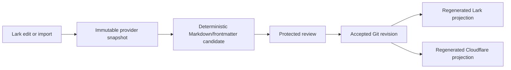

# Knowledge-Base SSOT Storage Projection

## Authority boundary

This document projects the accepted Knowgrph storage decision into the shared documentation repository. The normative product/runtime contract remains [`knowgrph/docs/documents/knowgrph-storage-sync-document.md`](https://github.com/huijoohwee/knowgrph/blob/main/docs/documents/knowgrph-storage-sync-document.md). This projection does not create a second storage authority or claim that a remote Lark adapter is implemented.

**Decision:** keep Git-backed Markdown plus YAML frontmatter as the portable knowledge-base SSOT. GitHub is the current protected forge and audit surface, not the content format. Integrate Lark Suite as a collaborative control-plane projection; generate Cloudflare serving and query projections; use CSV/JSON only for interchange.

## Store-role decision

| Store or format | Role | Minimum viable value | Authority boundary |
|---|---|---|---|
| Git-backed Markdown/frontmatter | **Canonical authored SSOT** | Portable files, agent-readable context, offline work, reviewable diffs, provenance, and rollback | Accepted protected revisions own product/runtime truth. |
| Lark Base (Bitable API) | Structured collaboration projection | Catalog fields, review state, assignments, and lightweight workflow | A row or callback cannot overwrite accepted source. |
| Lark Wiki/Docs | Human collaboration projection | Navigation, discussion, review, and linked editorial context | Page order, title, or timestamp cannot substitute for source revision and digest. |
| Browser local store | Recoverable working state | Offline save, outbox, cursor, and explicit conflict state | Local state is not cross-device authority. |
| Cloudflare Pages/static Markdown | Generated publication | Low-cost public reads at `airvio.co/knowgrph` | Published bytes are never an authoring root. |
| Cloudflare D1 | Rebuildable structured index | Search, relations, metadata, cursors, and runtime queries | Rows must retain accepted source provenance and remain reproducible. |
| Cloudflare R2/KV/Durable Objects | Bytes, cache, or live coordination | Media/snapshots, small caches, and one selected live room when justified | None becomes document authority; retention and consistency stay explicit. |
| CSV/JSON | Interchange | Bulk import/export, deterministic transforms, and recovery packages | Imported data is a candidate until normalized and reviewed. |
| Another database | Deferred option | Adopt only after measured query, scale, retention, or compliance need | Do not add a second durable authority for speculative scale. |

## Lark integration boundary

The [Lark Web App API](https://open.larksuite.com/document/client-docs/gadget/-web-app-api/api-overview) supplies the in-client web experience and short-lived user authorization flow. Durable Docs, Wiki, and Base operations belong to a host-owned adapter using scoped Open Platform access tokens. The browser must not receive an app secret, tenant credential, reusable user token, or direct unrestricted write capability.

Lark's server APIs enforce both application scopes and resource permissions. A Wiki space also requires the calling user or application to be an authorized member; a token alone does not grant document access. Start with read-only Base/Wiki/Docs discovery and supplied-snapshot import. Add outbound writes only after permission, event-verification, idempotency, conflict, audit, deletion, rollback, and cost checks pass.

## Accepted synchronization flow

The reverse path is never last-write-wins. Every external edit carries a provider revision and the accepted source base. A mismatch produces an explicit conflict or rejected candidate; it does not mutate canonical bytes.

## Projection envelope

Every Lark or Cloudflare copy must bind the following minimum fields:

| Field group | Required identity |
|---|---|
| Source | repository, repository-relative path, accepted Git revision, content digest |
| Projection | provider, resource identifier, provider revision, schema/mapping version |
| Direction | `source-to-projection` or `projection-to-candidate` |
| Review | candidate base, state, reviewer/automation receipt, accepted revision when available |
| Operation | idempotency key, attempt/result, generated time, prior projection identity |

Use a deterministic idempotency key derived from source identity, projection target, direction, and mapping version. Retry only the same operation; reject a key reused with different content.

## Agentic Canvas OS grammar

The global frontmatter and invocation dictionaries remain centralized in `agentic-canvas-os/docs`. Storage projections consume, but do not re-author, their meanings:

| Prefix | Meaning | Storage rule |
|---|---|---|
| `/` | action or command | Resolve through the central command dictionary; do not turn provider URLs into commands. |
| `#` | semantic scope/filter | Preserve the accepted source semantic identity across projections. |
| `@` | actor, agent, or owner binding | Bind authenticated responsibility; never infer authority from a display name. |

## Minimum-value rollout order

1. Freeze the Base field map, Wiki/Docs hierarchy, projection envelope, and deletion/retention policy in Markdown.
2. Prove server-side credential custody and least-privilege read-only discovery for one test knowledge space.
3. Import one immutable provider snapshot through the existing local-first outbox into an isolated Markdown candidate.
4. Prove deterministic re-import, source-base conflict rejection, unsupported-field preservation, and zero-secret browser output.
5. Publish accepted source to one Lark projection and one Cloudflare projection with digest parity and rollback evidence.
6. Enable external-edit event ingestion or outbound write-back only after measured demand justifies its operational cost.

## TCO and token economics

| Choice | Cash/TCO posture | Token posture | Recommendation |
|---|---|---|---|
| Git Markdown minimum | Existing forge and local tools | Zero LLM tokens for parse, diff, hash, and sync | Start here. |
| Lark collaboration | Plan-, quota-, and permission-dependent | Zero mandatory LLM tokens; deterministic mapping first | Add for proven collaboration value. |
| Cloudflare projections | Usage-dependent serving and storage | Zero mandatory LLM tokens; batch changed records only | Keep rebuildable and demand-driven. |
| FOSS self-hosted database | Software may be free; operations are not | Zero mandatory LLM tokens | Retain as portability fallback, not the MVP. |

Fetch frontmatter and projection metadata before document bodies, batch provider reads/writes, cache by immutable revision and content digest, and skip unchanged projections. LLM enrichment is optional and cannot sit on the correctness path.

## Current readiness

This is a documentation-only recommendation. It does not evidence remote Lark discovery, event verification, write-back, Cloudflare database mutation, deployment, or production readiness. Those remain closed until source-backed implementation and focused verification exist.

