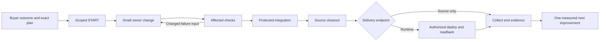

# Lean ADLC Economy

`ADLC-ECON-01@0.2.0` joins PRD, TAD, ADR, MVP and GTM. It succeeds the
[0.1.0 study][previous]; earlier authored bytes remain in Git history.

**Objective:** deliver the smallest accepted buyer outcome with less effort, repeated work,
resource use and delay. Keep one intent, one workflow lineage, scoped work and existing checks.
Measure the bottleneck, change its owner and compare equivalent quality and completion.

This is a specification increment; implementation and external effects need their own covered scope.
Savings, industry superiority, buyer demand and production readiness remain unproven.

## Codebase Grounding Record — Reference Implementation

Inspected on 2026-09-21: website `c7f5bff72d898f442a66063cbe6b0f0d34aaae76`; lifecycle owner
`580288976b35afbdb8d3bed81d9bfc1ffd8c7346`. The website and the three product consumers below pin
`c99988c7bcd7ef3c8c6a68428af4750e5b7a09cd`; a capability on owner main is not proof of consumer adoption.
Guideline 3.0.0 is present at the inspected website revision. Source inspection proves only the
stated implementation or configuration; live performance and effect completion require receipts.

| ID | Verified source or observation | Consequence for this increment |
|---|---|---|
| G01 | [Test inputs][inputs] bound 2,048 files, 499,000 bytes/file, 16 MiB total and 540,000 ms execution; [runner][runner] uses at most four workers | These are native test-runner limits, not a universal e2e delivery deadline |
| G02 | [Receipt owner][receipts] checks a one-hour age, command, log digest and result; runner compares the input fingerprint | Local result reuse already exists; age alone never grants reuse |
| G03 | [Validation contract][validation] separates local reuse, fresh CI and conservative dependency fallback | “No cross-call cache” concerns particular live-read caches; it does not mean no reusable validation results |
| G04 | [Observation guide][economy] and [workflow owner][workflow] already collect resources, CI timing, immutable manifests, exports and recommendations | Reuse these owners; do not start by building another comparison runner or ledger |
| G05 | [Review-body owner][review] already validates supplied title/body before publication and supports a consumer `reviewBodyCheck` | Audit adoption and the failing input first; a new generic preflight is not a proven gap |
| G06 | [Release wrapper][release-wrapper] warns when `completion:status` is absent; inspected consumer package manifests lack that alias | An operator-path gap exists; absence of an npm alias does not prove absence of the underlying completion API |
| G07 | [Fleet catalog][fleet] has seven rows, four with `releaseCommon: true`; website uses its own [START][site-start] and [RELEASE][site-release] bindings | Consume declared owner bindings; do not prescribe one npm alias to every repository |
| G08 | [Storage owner][storage] reports bounded observed logical/allocated bytes and incomplete scan reasons | Retained refs, mounted worktrees and disk consumption are different measurements; none authorizes cleanup |
| G09 | Website [validation policy][site-validation] always selects evaluators/naming; docs select guidelines/git contracts; checks declare `reuse: never` | Use affected selection, but do not promise cache hits for this consumer |
| G10 | Website [deploy contract][site-deploy] publishes `index.html` and `guidelines/` only | This `docs/documents/` edit can finish at source integration; it is not a Pages payload change |
| G11 | Inspected `validatePlanning` in both owner main and the installed pin requires a `prd-tad-adr-mvp-gtm.md` filename suffix; this file fails optional `start --plan` with `blocked-workflow-planning-binding` | Normal scoped START works; record the capture gap, never rename/copy the artifact just to manufacture evidence |
| G12 | The prior study supplies no joined comparable A/B record; its five block classes and 794.72-second example are historical observations | They motivate investigation, not a current rate, baseline, savings estimate or fleet-wide superiority claim |

Consumer snapshots for G06: Canvas `141e14604665ddfa1fdec8bfd5d532f6dc4f9298`,
Graph `b242ab5d82c49155808a86b45565c797f8e04f61`, Commerce
`ee9805d9b159ff1d33cd083efb8602eb1ed68d48`. Their `package.json` files were inspected;
Graph also declares `reviewBodyCheck: scripts/collaboration-contract.mjs`. Recheck revisions, pins,
profiles and current evidence before implementing any consumer change.

The previous `compare` command and generic preflight proposal are superseded: the command is absent
from inspected scripts and preflight already has an owner. Retained branches are not active worktrees.

## PRD

### Outcome, scope and priority

**CID:** C: G01–G12 identify existing controls and unmeasured overhead. I: shorten safe delivery.
D: reuse the e2e path, compare evidence and improve one demonstrated bottleneck.
**RAO/SVO:** the operator measures one workflow, producing its source-bound outcome, resource use,
blocker and next owner action.

Rank work by buyer pain, then proximity to a working solution, then a credible first-dollar path.
Separate an internal operator improvement from independently validated buyer demand.

| Pain / feature | Smallest solution | Priority and acceptance |
|---|---|---|
| P1 / F1: restarting, rereading and rechecking consume effort | Reuse the current workflow root, bounded context and valid exact-input proof | Must; VCC-1, VCC-2 |
| P2 / F2: preventable metadata, command and pin errors interrupt release | Inspect supported commands and existing preflight; repair only a confirmed owner/adoption gap | Must as a diagnostic obligation; VCC-3; code remains conditional |
| P3 / F3: a green merge can hide unfinished delivery | Carry the authorized intent through owner closeout, applicable deployment and runtime readback | Must; VCC-4 |
| P4 / F4: elapsed time and resource estimates are mistaken for cash/value | Pair compatible observations; keep time, resources, estimates and actual charges separate | Must; VCC-5, VCC-6 |
| P5 / F5: retained state creates unexplained storage/lookup overhead | Use bounded storage observation only when evidence identifies that bottleneck | Could; VCC-7; no automatic cleanup |

Independent buyer pain remains `unvalidated`; these observations support an internal pilot.
Exclude new services, stores, dashboards, executors, remote caches, paid capacity, higher caps,
weaker checks, automatic model switching, broad cleanup and unmeasured concurrency increases.

Reuse existing operator observations and agent/MCP/WebMCP discovery owners; add no route.
Retained evidence supports local/offline inspection; provider checks require connectivity.
Existing browser views must support mobile inspection without becoming a release dependency.

### Success measures and verifiable completion conditions

Optimize one declared primary metric per pilot; report the others as constraints. Correctness, unchanged
acceptance coverage, source identity and zero paid spend are hard gates. Faster failed or incomplete
work never counts as accepted delivery. Unknown cost/license eligibility blocks the affected execution.

| VCC | Observable result | Verification / target |
|---|---|---|
| VCC-1 | One intent joins source revision, scope, workflow locator, evidence and next action across resume | Resume from the exact root without creating a second lane or rerunning unchanged work; report missing capture explicitly |
| VCC-2 | The owner selects affected checks with reasons, keeps mandatory coverage and valid reuse boundaries | Retain selection and result receipts; unknown/shared impact broadens; fresh protected CI remains required |
| VCC-3 | Each avoidable block resolves to an existing owner, exact failing input and smallest corrective action | Reproduce the original failure and record whether existing preflight catches it before side effects; unsupported behavior remains a gap |
| VCC-4 | The declared delivery endpoint has every applicable receipt, or one explicit blocker/next owner | Source, integration, retirement, cleanup, sync, deployment and readback remain independently evidenced |
| VCC-5 | One comparable pair has provenance, quality coverage and time/resource/cost fields with missingness | Every number resolves to a receipt or labeled manual observation; invalid pairs produce no savings verdict |
| VCC-6 | A keep/rework/revert decision follows predeclared quality and economic criteria | Start with one pair; collect five eligible pairs before a cohort claim; publish counts/range and failures, not industry superiority |
| VCC-7 | A triggered storage report distinguishes retained refs, worktrees and observed bytes | Preserve scan bounds, incompleteness and shared-inode accounting; no deletion or cash claim follows from counts |

**TTV target:** from available archived receipts to one usable bottleneck/next-action decision in at
most four operator actions and ten active minutes. This is a proposed target, currently unmeasured;
it excludes neither setup nor provider waits from the separate total-delivery measure. Collecting five
pairs is a later pilot, not a ten-minute promise. Predeclare the minimum worthwhile improvement before
running it; record inconclusive results when the sample or resource coverage is insufficient.

## TAD

### One e2e path, existing owners

Use existing START/RELEASE/DEPLOY owners. Carry valid grants across turns; pause only the blocked
effect, continue independent covered work and resume from the retained outcome and next action.

| Step | Existing owner / action | Evidence and economy rule |
|---|---|---|
| 1. Select | Planning artifact and product owner select one accepted outcome and endpoint | Exact plan revision, scope, ETA and time/byte/module caps; no speculative adjacent work |
| 2. Admit | Native doctor/status/START reserve a scoped lane | Verify pins, hooks, commands and write scope once; preserve unrelated work; bind an existing workflow root when supported |
| 3. Build | Authored source owner implements the smallest vertical slice | Bounded lazy reads, deterministic tools first, explicit model input/output/fallback; reuse unchanged context |
| 4. Validate | Native selector and consumer checks | Cheap metadata/contract checks first, affected checks next; revalidate changed dependencies; no blind full-suite retry |
| 5. Integrate | Owner land/release path and protected provider checks | Final title/body before first publish; one exact candidate/run/attempt; source change invalidates dependent proof |
| 6. Close source | Owner completion, eligible cleanup and canonical sync | Separate receipts; retain blocked, dirty or ambiguous state; no repeated broad inventory to imply completion |
| 7. Deliver | Consumer deploy/rollback owner, when in scope | Exact authorized target and deployed identity plus readback; preserve verified rollback predecessor |
| 8. Learn | Existing collect/export/recommend owners | Immutable end successor of the same lineage; record result, gaps and one next improvement |

Steps 3–5 repeat only after a material input, failure or evidence change. Bound each repair sprint to
at most two corrective iterations; on the same unchanged failure, preserve evidence and revise the
plan at its owner. This bounds waste without weakening acceptance or abandoning covered work.
External waits report dependency, condition and next recheck; they have no invented completion ETA.

Journey: select → build → inspect → accept. Data: phase receipt → immutable root → read-only view
→ decision. Planning, scoped worktrees, provider checks and delivery retain separate owners/authority.

### Reference implementation: invocation and ownership

| Surface | Existing invocation / source | Meaning |
|---|---|---|
| Website authoring | `npm run doctor`; `npm run lane -- <scope> --write=<paths>` | Scoped START; read the consumer workflow instead of assuming a `release:common` script |
| Website validation | `npm run check:plan`; `npm test` | Selection preview then affected owner execution; not a universal full-test/cache promise |
| Website publication | `npm run land -- --message="<message>" --title="<title>" --body-file=<file>` | Mutating publication through owner checks; finalize review text first |
| Closeout | `node node_modules/agentic-os/bin/agentic-os.mjs completion status --ref=<lane>` | Existing diagnostic; follow the consumer RELEASE workflow for effects |
| Evidence | `node node_modules/agentic-os/bin/agentic-os.mjs workflow collect --input=<input>` | Writes an immutable archive; use the returned exact manifest path |
| Inspection | Same CLI: `workflow export --input=<manifest>` or `workflow recommend --input=<manifest>` | Bounded read-only observations; recommendations need current evidence and covered authority |
| Agent inspection | Existing `workflow.export` / `workflow.recommend` MCP and `/workflow.recommend #read-only @input:<manifest>` | Same owner; no second registry, model call or autonomous spending |

Supply real paths/IDs. Admission, publication and collection write state; inspection needs no model
call, although an agent reading it can use tokens. No new command is promised. G11 needs an authorized
owner fix before claiming planning-bound capture for this filename; never fabricate a root.

### Measurement contract: one decision record, referenced evidence

Begin with a small comparison table in existing private task artifacts, referencing original
manifest paths/digests. Keep archives immutable. Automate only demonstrated repeated manual effort
through the existing contract owner; add no ledger or copied span pages.

| Field group | Required content / interpretation |
|---|---|
| Identity | Pair ID; plan ID/revision; repository/base/head/tree; patch or task identity; manifest/receipt digests; owner pin; command/policy version |
| Cohort | Host/runner class, environment, dependency state, cache warmth, model/configuration when used, quality obligations, endpoint and trial order |
| Outcome | Accepted/failed/blocked/partial, scope and checks completed, defect/rework observations, missing phases and exclusion reason |
| Timing | Start/end timestamps with clock scope; active human/agent effort; local execution; provider wait/execution; rework; setup and measurement overhead |
| Resources | CPU user/system ms, maximum single-process RSS bytes, input/output/read bytes, calls, prompt/completion tokens and measurement coverage |
| Economics | Reported model-cost estimate, actual cash evidence, optional explicit labor rate, quota use/headroom, one-time setup and recurring maintenance |
| Decision | Primary metric, minimum worthwhile change, guardrails, paired deltas, keep/rework/revert/inconclusive and next owner |

Use `null` plus reason for unavailable values; preserve known zero, partial and reused states.
Historical reused CPU/tokens are not current consumption. Sum only non-overlapping executed stages;
never sum parent with child, memory peaks, parallel wall times or cross-host clocks. Report maximum
single-process RSS as such, never as concurrent process-tree memory. Initial provider wait and workflow
execution are distinct; neither measures billed CI minutes, job CPU or all later scheduling delays.

Total delivery lead time is end minus start on a declared comparable clock, including waits and
rework. Active effort is separately recorded; it cannot be inferred by subtracting arbitrary spans.
If clocks cannot be reconciled, retain per-phase timing and mark the total unknown.

### Comparable pilot and economic decision

1. Freeze the accepted outcome, quality obligations, endpoint, instrumentation and primary metric.
   Baseline A is the owner's existing supported path; B changes exactly one measured inefficiency.
   A plain protected-PR comparator is eligible only with equivalent checks and effect boundaries.
2. Prefer existing compatible evidence. If a replay is necessary and authorized, use isolated disposable
   fixtures for local stages. Do not double-merge, double-deploy or bypass protection to manufacture a pair.
   Label a local replay local-only; e2e claims require real comparable delivery observations.
3. Match task/patch class, pins, runner, tools/model and cache state; separate cold and warm trials.
   Alternate A/B order where possible, retain all failed attempts and account for setup/capture cost.
   If the patch or conditions differ materially, label the pair observational or incomparable.
4. Inspect one pair first. Expand to five eligible pairs only when useful and within free quotas.
   Report paired differences, median and range with the sample count; keep failures and coverage visible.
   Five pairs are a pilot, not statistical proof or a representative industry benchmark.
5. Keep B only if it meets the declared improvement floor without a correctness, resource-budget or
   completion regression. Mixed tradeoffs need an explicit owner decision; inconclusive evidence grants
   no savings claim. Roll back the changed source through the checked owner path when B regresses.

For each compatible metric, `delta = B - A`; reduction percentage is `100 × (A - B) / A` only when
A is positive and both measurements are known. A zero/unknown denominator has no percentage result.
Use cost per **accepted outcome** across all attempts, including failed/rework cost; a zero-success
cohort has no finite unit cost. Keep local, provider-CI and deployed-runtime cohorts separate.

Cash, estimates and opportunity cost stay unblended. Actual incremental cash requires source evidence;
free quota use still consumes capacity. Optional effort valuation is observed hours × a declared rate,
never a charge. Estimated model spend is not additive to a bill for the same usage. Break-even accepted
outcomes equal known one-time adoption cost divided by positive net recurring benefit per accepted
outcome, using consistent units and including maintenance/measurement overhead; otherwise it is unknown.

### Budgets and admission

Documentation increment: one authored file, <600 lines, ≤30 KB final content, zero runtime modules,
zero dependencies and zero always-load bytes. Implementation proposal: one bottleneck at a time,
≤3 owner modules and ≤30 KB changed source in a 30-active-minute sprint; refresh the plan on drift.
Pilot: one pair initially, at most five eligible pairs and two corrective iterations per sprint.

Native G01 bounds remain unchanged; consumer policies keep their own limits. Use FOSS components and
zero paid usage, addons or overages. Record current entitlement/headroom before provider work; if the
remaining free budget cannot cover a trial, retain local progress and wait or reduce the experiment.
Choose the smallest tool/model configuration that meets the acceptance contract; unknown quality or
cost is not permission to switch. Parallel work requires independent scopes and observed benefit after
coordination cost; serial execution remains the default for this documentation increment.

## ADR

| Decision | Constraints, alternatives and selection | Consequence / recovery |
|---|---|---|
| ADR-1: observe and reuse before building | Existing owners satisfy capture/export needs; a new harness adds setup and maintenance before value is known | F1/F4 start with referenced evidence; automate only a demonstrated repeated gap |
| ADR-2: repair the earliest confirmed owner gap | Generic preflight already exists (G05); missing adoption/alias/filename support must be demonstrated separately | F2 first diagnoses; F3 retains native completion; no gate removal or timeout increase |
| ADR-3: preserve equivalent quality and effect boundaries | A weaker baseline cannot establish better economics; production replay introduces unnecessary effects | Local experiments stay local; e2e comparisons require complete equivalent endpoints |
| ADR-4: one lineage, explicit unknowns | A parallel ledger or invented totals hide provenance; cross-call live-state caching cannot grant authority | F1/F4 extend existing projections only; preserve original receipts and missingness |
| ADR-5: optimize accepted value per total effort | Fast attempts and fewer tokens can still raise rework; hosted services violate this increment's cost/scope constraints | Rank one demonstrated bottleneck; keep/rework/revert from comparable evidence |
| ADR-6: first-dollar pilot before a hosted product | Constraints: existing capability, no paid infrastructure, voluntary independent payer evidence; no payer commitment is present | Optional bounded service offer outranks a new platform by build distance, not proven demand; defer monetization until authorized |

Selection: manual pairing and a local harness can meet zero-spend constraints; reuse wins on setup
and maintenance. The automation-saves-effort argument lacks repeated manual-cost evidence and remains
unaccepted. Hosted reporting fails constraints. Revisit ranking with independent pilot evidence.

## MVP

The first slice consumes F1–F4, VCC-1–VCC-6 and ADR-1–ADR-6: one outcome, workflow, bottleneck
decision and verified endpoint or blocker. G11 and closeout adoption remain separate implementation work.

| Order | Bounded action | Exit evidence |
|---|---|---|
| M1 | Inspect current owner bindings and available receipts | F1/F2 inventory; unsupported capture/commands stay explicit |
| M2 | Complete one authorized source or runtime workflow through existing owners | F3 applicable effect receipts; pending actions retained across turns |
| M3 | Form one compatible comparison using the measurement contract | F4 pair, quality coverage, missingness and provisional decision |
| M4 | If justified, authorize one owner fix and extend to five eligible pairs | Independent checks plus keep/rework/revert/inconclusive decision; no unmeasured superiority claim |

Demo target: select the exact manifest (30 s) → inspect costly/missing phases (60 s) → inspect one
comparable pair (60 s) → explain next action and completion boundary (30 s). The 180-second script is
an inspection demo target, not a claim that CI, deployment or a five-pair pilot completes in that time.

Validate with affected `npm test`, then review this document's metadata, joins, source links, budgets
and traceability. Guideline checks cover their own corpus, not performance claims. No new prose tests.
Rollback through a checked source revert; retain history and evidence.

## GTM

Candidate buyer: an independent solo maintainer losing measurable time to repeated release work.
The current operator is an internal pilot. Demand, payment and delivery economics remain unvalidated.

| Candidate | Pain → near-built solution → first dollar | Evidence / disposition |
|---|---|---|
| Bounded delivery-economy review | Demonstrated repeated delay → existing receipts plus one diagnosis → optional $1 paid pilot | ADR-6 provisional first choice; $1 is a price hypothesis, not revenue or permission to contact/charge anyone |
| Reusable local workflow kit | Repeatable diagnosis → existing FOSS path with measured onboarding → independently accepted offer | Defer until repeated demand; retain applicable licenses and free core |
| Hosted fleet reporting | Unvalidated fleet buyer → new operation/support costs → uncertain transaction | Excluded this increment; no hosted service or paid capacity |

Record pain, offer/price, acceptance, actual payment, fulfillment and operating cost separately.
Sandbox transactions and exports prove no demand. Feed outcomes, failures and support effort into
the next immutable planning revision; leave revenue and savings unknown without evidence.

## Readiness, Traceability and Remaining Gaps

| Feature | Design / decision | Acceptance evidence still required |
|---|---|---|
| F1 | Existing lineage/context; ADR-1/4 | VCC-1/2: source-bound resume and selected-check results |
| F2 | Existing owner preflight; ADR-2 | VCC-3: reproduced failure and earliest valid correction |
| F3 | E2e owner sequence; ADR-2/3 | VCC-4: every applicable terminal receipt, including runtime when requested |
| F4 | Comparable pair and economics; ADR-1/3/4/5/6 | VCC-5/6: eligible paired observations and independent decision |
| F5 | Existing storage projection; ADR-5 | VCC-7: bounded observation only if this feature is selected |

The defined VCCs support `local_rung: spec-complete`; no joined pilot Evidence Reference satisfies
them yet, and delivered capability remains `undocumented`. Source links and document validation do not
raise the runtime rung. A source-only request ends at its declared source endpoint; a production request
remains open until the consumer verifies the deployment and runtime. G10 explicitly excludes this file
from the current Pages payload; do not infer publication from its source merge.

Open gaps: comparable savings (VCC-5/6), plan capture G11 (VCC-1), closeout adoption G06 (VCC-4),
and independent buyer/payment evidence. Block only the corresponding claim/transition. Re-ground
affected rows whenever source, scope or evidence changes.

[previous]: https://github.com/huijoohwee/huijoohwee.github.io/blob/c7f5bff72d898f442a66063cbe6b0f0d34aaae76/docs/documents/prd-tad-adr-mvp-gtm-adlc-economy.md
[inputs]: https://github.com/huijoohwee/agentic-os/blob/580288976b35afbdb8d3bed81d9bfc1ffd8c7346/bin/agentic-os-test-inputs.mjs
[runner]: https://github.com/huijoohwee/agentic-os/blob/580288976b35afbdb8d3bed81d9bfc1ffd8c7346/bin/agentic-os-tests.mjs
[receipts]: https://github.com/huijoohwee/agentic-os/blob/580288976b35afbdb8d3bed81d9bfc1ffd8c7346/bin/agentic-os-test-receipt.mjs
[validation]: https://github.com/huijoohwee/agentic-os/blob/580288976b35afbdb8d3bed81d9bfc1ffd8c7346/guides/REPOSITORY-VALIDATION.md
[economy]: https://github.com/huijoohwee/agentic-os/blob/580288976b35afbdb8d3bed81d9bfc1ffd8c7346/guides/VALIDATION-ECONOMY.md
[workflow]: https://github.com/huijoohwee/agentic-os/blob/580288976b35afbdb8d3bed81d9bfc1ffd8c7346/bin/agentic-os-workflow.mjs
[review]: https://github.com/huijoohwee/agentic-os/blob/580288976b35afbdb8d3bed81d9bfc1ffd8c7346/bin/agentic-os-review-body.mjs
[release-wrapper]: https://github.com/huijoohwee/agentic-os/blob/580288976b35afbdb8d3bed81d9bfc1ffd8c7346/bin/agentic-os-release-common-wrapper.mjs
[fleet]: https://github.com/huijoohwee/agentic-os/blob/580288976b35afbdb8d3bed81d9bfc1ffd8c7346/test/repositories.json
[storage]: https://github.com/huijoohwee/agentic-os/blob/580288976b35afbdb8d3bed81d9bfc1ffd8c7346/bin/agentic-os-storage-report.mjs
[site-start]: https://github.com/huijoohwee/huijoohwee.github.io/blob/c7f5bff72d898f442a66063cbe6b0f0d34aaae76/docs/START-WORKFLOW.md
[site-release]: https://github.com/huijoohwee/huijoohwee.github.io/blob/c7f5bff72d898f442a66063cbe6b0f0d34aaae76/docs/RELEASE-WORKFLOW.md
[site-validation]: https://github.com/huijoohwee/huijoohwee.github.io/blob/c7f5bff72d898f442a66063cbe6b0f0d34aaae76/.agentic-os-validation.json
[site-deploy]: https://github.com/huijoohwee/huijoohwee.github.io/blob/c7f5bff72d898f442a66063cbe6b0f0d34aaae76/docs/DEPLOY-WORKFLOW.md
