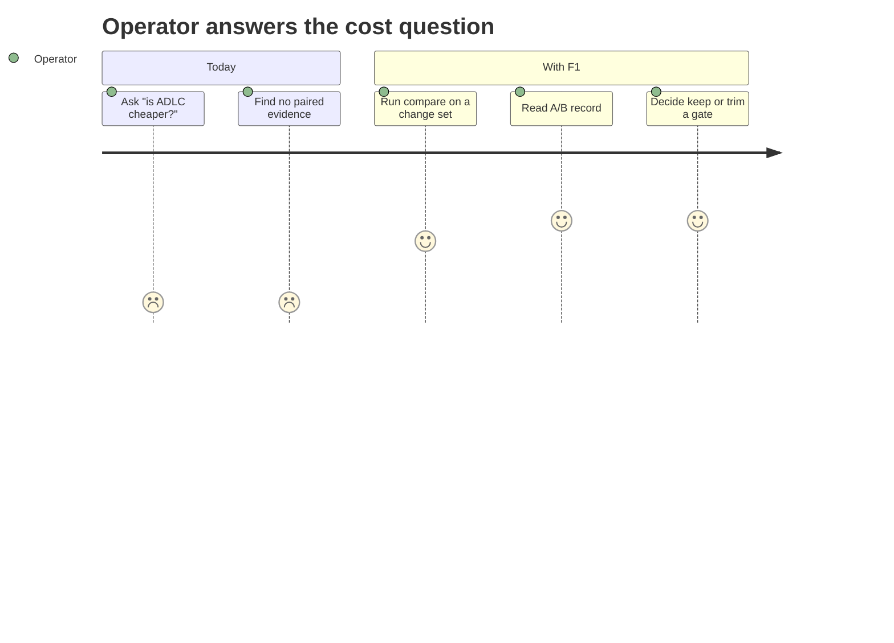
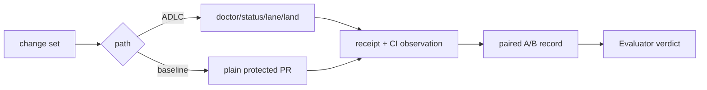
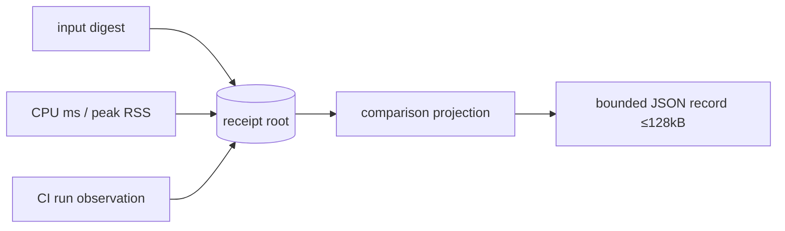
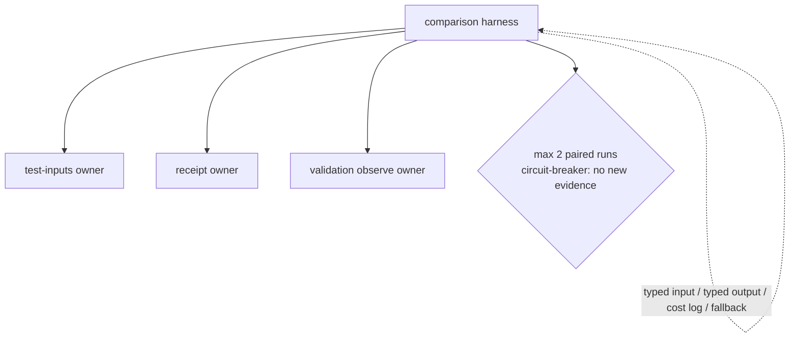
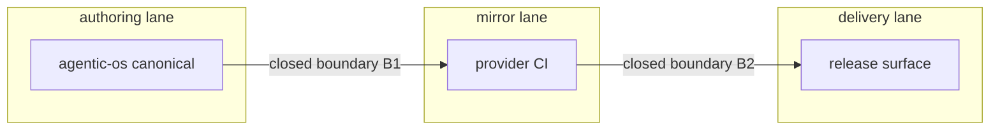

# Lean ADLC Economy

**Continuity**: `ADLC-ECON-01` @ source revision `25a38aa5b923e50092b5330895e38a0e1d15712a`.
PRD, TAD, ADR, MVP, and GTM below are section roles of this one joined artifact. MVP and GTM consume
PRD criteria, TAD elements, and ADR decisions; they originate no requirement, design, or decision.

**Governing claim under test**: the ADLC is *not* currently shown to be more time-, resource-, or
cost-performant than industry ADLC practice, and the repository's own economics guide declines the
claim. This artifact scopes the smallest work that makes the claim decidable, and the leanness
reductions that are independently justified whichever way the measurement lands.

---

## Codebase Grounding Record

**Input revision**: this document, authored at `ADLC-ECON-01` v0.1.0.
**Scoped codebase revisions**: OS `25a38aa5b923e50092b5330895e38a0e1d15712a`
(`origin/main` `580288976b35afbdb8d3bed81d9bfc1ffd8c7346`);
Canvas `1f3027d024ffdaa82c546d660621292e60975582`; Graph `cc74ce744dfa6f54c0c22b55a6dceb8f5545ab8f`;
Commerce `09152179fd4b59a63ecff22b8897650da25d02d1`.
**Guideline revision**: `e8d2a10a8d3e5735c43edf350a22523df05fdf91`.

| # | Material current-state claim | Evidence | Disposition |
|---|---|---|---|
| G01 | A local test receipt is reusable for one hour against exact inputs | `bin/agentic-os-test-receipt.mjs:75` (`now - receipt.finishedAt > 3_600_000`) | `confirmed` |
| G02 | Local execution is bounded at 540 s wall clock with 4 workers | `bin/agentic-os-test-inputs.mjs:9` `testMs: 540_000`; `bin/agentic-os-tests.mjs:131` `concurrency: 4` | `confirmed` |
| G03 | Input binding is capped at 2048 files / 499 kB per file / 16 MiB aggregate | `bin/agentic-os-test-inputs.mjs:8` | `confirmed` |
| G04 | A bound CI observation can defer the duplicate local suite | `bin/agentic-os-tests.mjs:33,117,154` (`boundCiCoverage`, `deferred local suite`) | `confirmed` |
| G05 | There is no cross-call result cache and CI never accepts local receipts | `guides/VALIDATION-ECONOMY.md` ("There is no cross-call cache", "CI never accepts local receipts") | `confirmed` |
| G06 | Per-command CPU ms and peak RSS are capturable beside each stage | `guides/VALIDATION-ECONOMY.md` AO-05 (waited-process accounting, optional host Python) | `confirmed` |
| G07 | A bounded provider read can attribute CI wait vs execution | `guides/VALIDATION-ECONOMY.md` AO-06 (`observe --root=. --ci-run=<run-id>`) | `confirmed` |
| G08 | Fleet membership and cleanup disposition are catalogued in one place | `test/repositories.json` schema `agentic-os/repository-check-catalog/v1`, 7 rows with `releaseCommon` / `worktreeCleanup` | `confirmed` |
| G09 | `complete` runs only from the canonical main worktree | `bin/agentic-os-release-common-wrapper.mjs`; observed `blocked-canonical-required` | `confirmed` |
| G10 | `completion:status` exists in OS but not in the three consumers | `package.json:226` present in OS; observed `warning-release-common-close` in Canvas, Commerce, Graph | `confirmed` |
| G11 | A prior Graph protected check block took 794.72 s | `guides/VALIDATION-ECONOMY.md` GTM/AO-01–AO-04, run `35097953831` | `confirmed` (single observation, not a baseline) |
| G12 | An industry-practice comparison baseline exists for this fleet | no paired run, no comparison harness found in OS, Canvas, Graph, or Commerce | `absent` |
| G13 | The ADLC reduces wall clock, CI minutes, or cost versus a plain protected-PR flow | no before/after evidence; guide states savings unmeasured | `unverified` |
| G14 | Per-merge ADLC overhead is material | observed 2026-09-21: 3 lanes, 5 distinct block classes before first green land | `confirmed` (one sample, not a rate) |

**Unresolved claims G12 and G13 block any performance superiority claim at baseline.** They do not
block the leanness work in `MVP-2`, which is justified by `G14` independently of the comparison.

---

## PRD

### Problem

The operator cannot answer whether the ADLC costs less or more than an ordinary protected-PR flow,
because nothing measures the two against each other. Meanwhile the per-merge overhead is visible and
unpriced: on 2026-09-21 a four-file change across three repositories hit five distinct block classes
(`blocked-review-body-invalid` twice, `blocked-invalid-arguments`,
`blocked-release-common-helper-missing`, `blocked-canonical-required`) plus one flaky provider check
before the first green land.

### Users

| User | Need |
|---|---|
| Solo Founder / AI Orchestrator | Decide whether to keep, trim, or replace ADLC gates on cost evidence |
| Evaluator mechanism | Derive a rung from recorded paired measurement, not narrative |
| Consumer-repository owner | Know the per-merge price of adopting the ADLC before adopting it |

### Pain-Point-to-Feature Mapping

| Pain point | Hook | Break | Fix | Close | Min-time-resource-max-value | Validation |
|---|---|---|---|---|---|---|
| P1 — the cost question is unanswerable | "Is this cheaper than a plain PR?" | No paired observation exists (`G12`) | `F1` Comparison harness | One command emits an A/B record | **Reuse**: AO-05 resource capture, AO-06 CI attribution, existing receipt writer. **New**: pairing and diff projection only | `unvalidated` |
| P2 — avoidable blocks cost operator minutes | Land fails on a form defect, not a code defect | Review-body and arity failures surface after the work, not before | `F2` Preflight arity/body gate | `land` refuses early with the exact missing input | **Reuse**: existing `doctor`/`status` preflight pass. **New**: two checks in the existing preflight | `unvalidated` |
| P3 — closeout degrades silently on consumers | `complete` warns instead of closing | `completion:status` present in OS, absent downstream (`G10`) | `F3` Consumer closeout parity | Closeout reports the same verdict in every `releaseCommon` repo | **Reuse**: OS `completion:status` implementation. **New**: catalog-driven presence check | `unvalidated` |
| P4 — retained lanes accumulate unpriced | ~100 unretired lanes in one repository | Cleanup is separately governed and never scheduled | `F4` Sprawl cost report | One report prices retained lanes and worktrees | **Reuse**: `agentic-os-storage-report.mjs`, quarantine manifest. **New**: projection only | `unvalidated` |

Every pain point is `unvalidated`: no user quote, ticket, or measured behaviour is attached yet, so
no `Must` in this artifact may claim demand. `P1` and `P2` rest on `G14`, a single observed session.

### Features (MoSCoW)

| ID | Feature | Priority | Pain point | Rationale |
|---|---|---|---|---|
| F1 | Paired ADLC-vs-baseline comparison record | Must | P1 | Without it every performance statement is `unverified` |
| F2 | Land preflight for review-body and command arity | Must | P2 | Cheapest observed defect class; zero new surface |
| F3 | Catalog-driven consumer closeout parity | Should | P3 | Degrades verdict quality, not correctness |
| F4 | Retained-lane and worktree cost report | Should | P4 | Priced visibility before any cleanup authority change |
| F5 | Cross-machine shared result cache | Won't (this increment) | — | Contradicts `G05` fail-closed posture; reopen only via a new ADR |
| F6 | Raise `testMs` or worker count | Won't (this increment) | — | Caps are the control being measured; moving them invalidates `F1` |

### Success Metrics

| Metric | Definition | Target | Source |
|---|---|---|---|
| **Time-to-Value (TTV)** | Elapsed time from `npm run compare -- --baseline` on a clean checkout to a readable A/B record | ≤ 4 steps, ≤ 10 min | Walked on a clean environment before Phase 3 sign-off |
| Paired coverage | Change sets measured on both paths | ≥ 5 | `F1` record count |
| Avoidable-block rate | Blocks attributable to form, not code, per 10 lands | Observed, then reduced | `F2` preflight counters |
| Overhead ratio | ADLC wall clock ÷ baseline wall clock, per change set | Reported, not targeted | `F1` record |
| Retained-lane count | Lanes past their integrated head | Reported | `F4` report |

No savings target is set. Setting one before `F1` exists would be the `unproven-claim` this artifact
is written to avoid.

### Verifiable Completion Conditions

| VCC | Measurable end state | Check | Constraints |
|---|---|---|---|
| VCC-1 | One change set produces an A/B record carrying wall clock, CPU ms, peak RSS, CI minutes, and block count for both paths | `npm run compare -- --record` exits 0 and emits the record | Reuses AO-05/AO-06; adds no service, daemon, or dependency |
| VCC-2 | A land missing `--body-file` or PR frontmatter fails in preflight, before any commit or push | `land` exits non-zero naming the missing input, with no new ref | Must not weaken the existing post-hoc validator |
| VCC-3 | Invoking an unsupported verb on a pinned consumer CLI names the supported verb set | Non-zero exit listing supported verbs | No change to the verb set itself |
| VCC-4 | Every `releaseCommon: true` row in the catalog reports a closeout verdict, never `warning-release-common-close` | Closeout run across catalog rows | Catalog stays the single membership SSOT |
| VCC-5 | One report prices retained lanes and mounted worktrees per repository | Report command exits 0 within its stated bound | Classification only; authorizes no deletion |

---

## TAD

### Division of Work — One Owner Per Capability

| Capability | Owning component | Consumers call, never re-implement |
|---|---|---|
| Input binding and digest | `bin/agentic-os-test-inputs.mjs` | comparison harness, preflight |
| Receipt write / reuse window | `bin/agentic-os-test-receipt.mjs` | comparison harness |
| Suite selection and bound-CI deferral | `bin/agentic-os-tests.mjs` | comparison harness |
| Provider CI observation | `bin/agentic-os-validation.mjs observe` | comparison harness |
| Release verb dispatch | `bin/agentic-os-release-common-wrapper.mjs` | every consumer `release:common` |
| Fleet membership and cleanup disposition | `test/repositories.json` | closeout parity, sprawl report |
| Storage / retained-object measurement | `bin/agentic-os-storage-report.mjs` | sprawl report |

**Reuse-or-new decisions**: `F1`, `F2`, `F3`, and `F4` are all extensions of the owners above. No new
store, ledger, service, or dependency is introduced. A second measurement ledger would be an
`unjustified-storage-duplication`; the comparison record extends the existing receipt root.

### Component Inventory

| ID | Component | Origin | Interface |
|---|---|---|---|
| C1 | Comparison harness | New — no existing component pairs two execution paths | CLI subcommand; emits one bounded JSON record |
| C2 | Land preflight extension | Reuse — extends the existing `doctor`/`status` preflight | Inline check inside the existing land path |
| C3 | Closeout parity check | Reuse — extends catalog validation | Reads `releaseCommon`; asserts script presence |
| C4 | Sprawl cost projection | Reuse — extends storage report | Read-only projection over existing manifests |

### Budgets

| Budget | Value | Source |
|---|---|---|
| Local test wall clock | 540 000 ms | `testMs`, unchanged |
| Worker concurrency | 4 | unchanged |
| Input files / per file / aggregate | 2048 / 499 kB / 16 MiB | unchanged |
| Receipt reuse window | 3 600 000 ms | unchanged |
| Comparison record size | ≤ 128 kB, matching the existing receipt ceiling | reuses `receiptBytes` |
| Source delta for this increment | ≤ 8 modules, ≤ 100 kB | stated bound |
| Token budget | Authoring ≤ 60 k tokens; execution harness emits a cost log per AI-assisted stage with typed input, typed output, and a stated fallback | Solo-operator orientation |
| Always-load delta | 0 bytes — no guide enters the always-load set | `cid-budget-exceeded` guard |

**TCO by deployment model, unblended**:

| Deployment model | Marginal cost of this increment |
|---|---|
| Local developer machine | CPU and wall clock only; no egress, no service |
| Provider-hosted CI | One additional baseline run per paired change set; no new job type |
| Hosted third-party cache service | Not adopted — see ADR-3 |

### Flow Patterns

**User journey**



**Workflow**



**Data flow** — anchored to the "Read A/B record" journey stage.



**Orchestration / harness flow** — anchored to the "Run compare" journey stage.



**Topology**



Every agentic loop in `C1` is bounded: maximum 2 paired runs per change set, circuit-breaker when a
run yields no new evidence.

### Invocation Register

| Route | Kind | Owner | Read cost |
|---|---|---|---|
| `compare` | CLI subcommand | C1 | zero-token |
| `completion status` | CLI subcommand | existing OS script | zero-token |
| `storage report` | CLI subcommand | existing storage owner | zero-token |

All three are read routes at zero token cost. No route is added outside the register.

---

## ADR

### ADR-1 — Make the comparison measurable before making the system faster

**Decision**: build `F1` before any optimization.
**Alternatives**: optimize first and measure later; assert superiority from design intent.
**Consequences**: one increment produces no speedup; every later speedup becomes checkable. Rejecting
this leaves `G13` permanently `unverified`.

### ADR-2 — Spend the increment on avoidable blocks, not on cap increases

**Decision**: `F2` and `F3`; explicitly `Won't` on `F6`.
**Alternatives**: raise `testMs`, raise worker count, relax the canonical-worktree rule.
**Consequences**: observed overhead falls without weakening any gate. Caps stay fixed so `F1`
measures one system, not two.

### ADR-3 — Selection: shared result caching

Illustrative candidates and criteria only; a future decision re-applies the criterion, not the names.

**Stage 1 — Constraints** (derived from this project's governing requirements: fail-closed
verification, no new always-running service, no new dependency, zero-egress preference).

| Candidate | Fail-closed verification | No new service | No new dependency | Disposition |
|---|---|---|---|---|
| Keep current no-cross-call-cache posture | pass | pass | pass | `pass` |
| Local-only content-addressed cache | pass | pass | pass | `pass` |
| Hosted remote build cache | — | fail | — | `fail-no-new-service` |

**Stage 2 — Outranking**: two candidates survive. On correctness-preservation they are equal; on
measurable speedup the local cache is strictly better only if `F1` shows repeated identical input
digests across runs. That fact is not yet observed, so the pair is **incomparable** and routes to
Stage 3. It is not collapsed into an order.

**Stage 3 — Argumentation**

| Claim | Support | Attack | Accepted |
|---|---|---|---|
| A1: a local cache would cut wall clock | G01 shows reuse already exists within one hour | A2 | no |
| A2: the existing one-hour receipt window may already capture most repeats | `bin/agentic-os-test-receipt.mjs:75` | — | yes |
| A3: a hosted cache is the industry answer | industry practice | constraint `fail-no-new-service`; a failed hard constraint is never waived by argumentation | no |

**Verdict** (Evaluator, holding no argument above): unresolved, deferred. `F5` is `Won't (this
increment)`. Reopen only if `F1` records repeated identical input digests.

#### Reference implementation — industry comparison baseline

Named comparators are non-binding examples of the general criterion, not a recommendation: remote
shared build caches of the Bazel, Nx, or Turborepo family, and a plain GitHub protected-branch PR
flow with one required check. The general criterion every future ADR re-applies is *shared-result
reuse across machines versus fail-closed per-call verification*, not these products.

### ADR-4 — Catalog remains the single fleet membership SSOT

**Decision**: `F3` and `F4` read `test/repositories.json`; neither introduces a second registry.
**Alternatives**: a parallel closeout registry; per-repository configuration.
**Consequences**: one edit point; a second registry would be a `duplicate-owner` finding.

---

## MVP

**Scope**: `F1` and `F2` only. `F3` and `F4` are `Should` and follow the same continuity ID.
**Bound**: ≤ 8 source modules, ≤ 100 kB of source edits, ≤ 90 active minutes across OS and consumers;
provider CI waits tracked separately. No new dependency, service, or always-load surface.
**Rollback**: revert through the owning checked PR; retain prior receipts and their provenance.

### Demo Skeleton

| Beat | Content | Bound |
|---|---|---|
| Hook | "Is the ADLC cheaper than a plain PR? Nobody here can answer that." | 20 s |
| Probe | Show the economics guide declining the claim, and the five block classes from one real session | 40 s |
| Reveal | Run `compare` on one change set; **VCC-1** holds the instant the A/B record prints both paths' wall clock, CPU ms, and CI minutes | 90 s |
| Decide | Operator reads the overhead ratio and marks one gate keep or trim | 30 s |
| Close | "The question is now answerable per change set, and the answer is recorded." | 20 s |

Total 200 s, within the 240 s feature budget.

### Domain-Object Rubric

**Domain object**: *a validated change set moving from authored edit to protected integration*. Not a
build artifact and not a deployment, so a build-system rubric does not apply unmodified.

| Level | Capability | State |
|---|---|---|
| L1 | Change set is bounded and digest-identified | pass (`G03`) |
| L2 | Execution is bounded and fails closed | pass (`G02`) |
| L3 | Results are reusable under exact-input proof | pass (`G01`, `G04`) |
| L4 | Cost of the change set is measured per path | **gap — blocking component: C1** |
| L5 | Cost is compared against an alternative path and drives a decision | gap — blocked by L4 |

Highest contiguous pass: **L3**. Each unclaimed rung names its blocker; no aspirational level claimed.

---

## GTM

### Monetization

| Stream | Segment exists now? | Distance to first dollar | Status |
|---|---|---|---|
| S1 — ADLC adoption engagement priced on measured overhead reduction | Yes, one operator with a 7-repository fleet | Nearest: needs `F1` output only | `mechanism-proven: no`, `demand-validated: no` |
| S2 — Hosted fleet-economy reporting | No such segment in this phase | Requires hosted service — excluded by ADR-3 constraints | `Should` at best |
| S3 — Guideline-set licensing | Segment unidentified | Farthest: no WTP signal at all | `Could` |

Ordering is by distance to a real first dollar: **S1 → S2 → S3**. No stream is `demand-validated`; no
priced conversation, pilot commitment, or payment has occurred. Calling `F1`'s output a savings proof
would be `monetization-demand-unvalidated`. The deferral is explicit rather than a silent
default-to-free: monetization is not pursued in this increment, and that is the recorded decision.

### Roadmap

| Phase | Feature | Reuses | Genuinely new | Priority rationale | Prerequisite |
|---|---|---|---|---|---|
| R1 | F2 preflight | Existing `doctor`/`status` preflight path | Two checks | Zero-code-change-adjacent; cheapest observed defect class | — |
| R2 | F1 comparison harness | AO-05 capture, AO-06 observation, receipt writer | Pairing + diff projection | Unblocks `G12`/`G13`; everything downstream depends on it | R1 (clean lands make clean measurements) |
| R3 | F3 closeout parity | OS `completion:status`, catalog | Presence check | Restores verdict quality across the fleet | R2 (measure before changing closeout) |
| R4 | F4 sprawl cost report | Storage report, quarantine manifest | Projection only | Prices retained state before any authority change | R2 |
| — | F5 shared cache | — | — | `Won't (this increment)` — ADR-3 verdict unresolved | — |
| — | F6 raise caps | — | — | `Won't (this increment)` — would invalidate R2 | — |

Phases are ordered by reuse-adjusted build cost, not nominal difficulty. R1 precedes R2 because a
land that fails on form pollutes the very measurement R2 produces; that divergence from a
"measure first" nominal order is stated here rather than left implicit.

---

## Readiness, Lanes, and Evidence

### Lane Topology and Deploy Boundary Register

| Boundary | From → To | State | Evidence required to open | Rollback |
|---|---|---|---|---|
| B1 | authoring → mirror | `closed` | Protected CI green on the exact head | Revert the merge commit |
| B2 | mirror → delivery | `closed` | Referenced operator instruction naming the exact candidate | Prior released revision |

Both boundaries are closed by default. No command in this artifact mutates a mirror or delivery
surface; deployment remains consumer-owned and is out of scope.

### Evidence References

| VCC | Named check | Recorded result | Rung effect |
|---|---|---|---|
| VCC-1 | `compare --record` | none yet | blocks `dev-proven` |
| VCC-2 | land preflight exit | none yet | blocks `dev-proven` |
| VCC-3 | unsupported-verb exit | none yet | blocks `dev-proven` |
| VCC-4 | catalog closeout run | none yet | blocks `dev-proven` |
| VCC-5 | sprawl report exit | none yet | blocks `dev-proven` |

`local_rung: spec-complete` and `delivered_rung: undocumented` are derived from this table: no VCC
carries a recorded result, so no higher rung is available. The Evaluator mechanism, distinct from the
implementing agent, derives the rung; it is never hand-authored here.

### Traceability

```
PRD-ADLCECON-F1 ↔ TAD-C1-compare ↔ VCC-1 ↔ Evidence[compare --record]
PRD-ADLCECON-F2 ↔ TAD-C2-preflight ↔ VCC-2, VCC-3 ↔ Evidence[land preflight exit]
PRD-ADLCECON-F3 ↔ TAD-C3-parity ↔ VCC-4 ↔ Evidence[catalog closeout run]
PRD-ADLCECON-F4 ↔ TAD-C4-sprawl ↔ VCC-5 ↔ Evidence[sprawl report exit]
```

The chain closes in both directions: every `Must`/`Should` feature reaches a VCC, and every VCC
resolves back to exactly one feature and one owning component.

### Open Findings

| Finding type | Severity | Anchor | Note |
|---|---|---|---|
| `unproven-claim` | blocker | Grounding G12, G13 | No comparison baseline exists; blocks any superiority claim, not the increment |
| `pain-point-not-validated` | major | Pain-Point Mapping P1–P4 | All four `unvalidated`; resolve before a `Must` claims demand at baseline |
| `work-tree-sprawl` | minor | Grounding G14 | Retained lanes and three mounted worktrees observed; raises visibility, authorizes no deletion |

Alignment gate is **not** discharged: one `blocker` remains open. Baseline sign-off is withheld.
Iteration bound: 3 alignment cycles; circuit-breaker on no reduction in open `blocker` findings
across two consecutive cycles.

### Conformance

Finding names, severities, and the recording contract are owned by the linked verification module of
the parent guideline set. This document defines no competing vocabulary, no second continuity scheme,
and no parallel finding enumeration.
