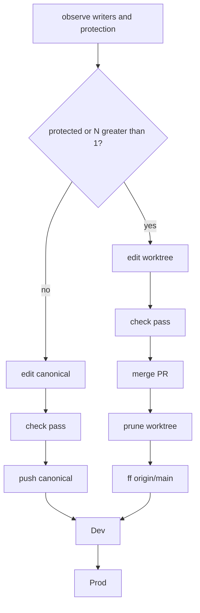
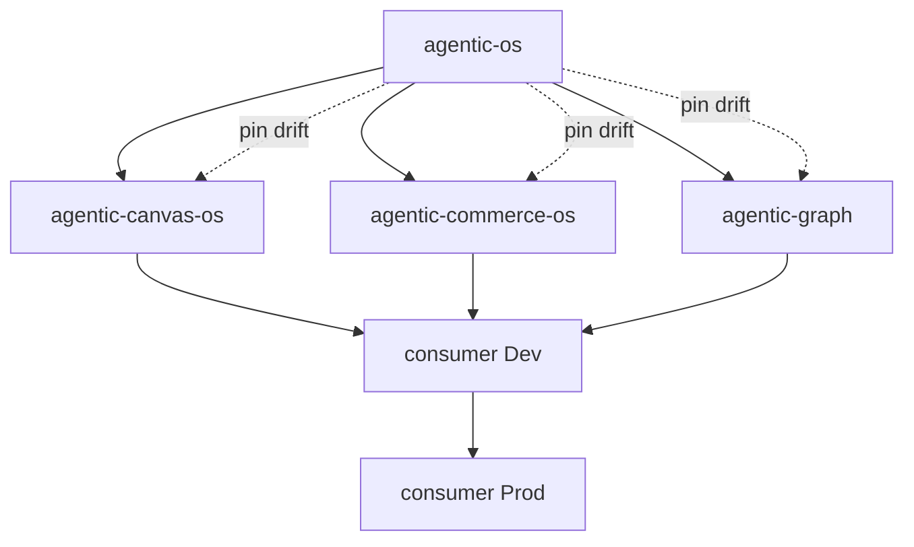

# Agentic OS leanification

Reduce the authored surface and the always-on lane ceremony of `agentic-os` so a change reaches
canonical, then Dev, then Prod, in the fewest receipts that still match concurrency and protection.

`PRD-TAD-ADR-ADLC-PIPELINE-001` owns the pipeline. This artifact owns only surface economy and
authoring posture. It introduces no lifecycle control of its own.

Governed by [PRD, TAD & ADR Guidelines](../../guidelines/prd-tad-adr-mvp-gtm-guidelines.md).
[ADLC Guidelines](../../guidelines/adlc-guidelines.md) own execution, integration, release, and
authority. Present-tense criteria describe required end states only. Every acceptance condition
stays Unsatisfied until an evidence-bearing check records the result.

**Reference implementation** — repository names, paths, commands, and revisions below are scoped to
the reviewed `agentic-os` surface and its first-party consumers. They illustrate this artifact only.

## Version History

v1.1.0 (2026-09-20):

- Bound authoring posture to actor count, concurrent-writer risk, and branch protection.
- Bound the release path to worktree completion, check pass, PR merge, worktree prune, canonical
  fast-forward, then closed Dev and Prod boundaries.
- Reordered the sprint by min-time-resource-to-value: posture and release collapse before export
  reduction.

v1.0.0 (2026-09-20):

- Established leanification as authored-surface economy, separate from lifecycle control.
- Bound the problem to measured caps, export surface, evaluator state, and consumer pin drift at
  `c65af44f8dd57a4a660cfeb354ed584560a63074`.

## Codebase Grounding Record

Input revision: this document at `1.1.0`.
Scoped codebase revision: `1fb3969c3473c247c61d968e69cd88e75adf6c97`.
v1.0 claims G1–G16 remain in force at that earlier revision; G1–G4, G13, G14, G17–G23 were
re-observed against the scoped revision above.

| # | Claim | Evidence | Disposition |
|---|---|---|---|
| G1 | `src/` uses 46 of 46 permitted modules | `npm run modules:check` | confirmed |
| G2 | `src/` uses 14,457 of 15,000 permitted lines | `npm run modules:check` | confirmed |
| G3 | Always-load set uses 40,960 of 40,960 bytes | `npm run docs:check` | confirmed |
| G4 | Caps are declared immovable | `docs/BUDGETS.md` | confirmed |
| G5 | 179 export subpaths are declared | `package.json` `exports` at v1.0 | confirmed |
| G6 | 106 tracked entrypoints in `bin/` | `git ls-files 'bin/*.mjs'` at v1.0 | confirmed |
| G7 | 222 tracked suites in `__tests__/` | `git ls-files` at v1.0 | confirmed |
| G8 | 37 guides totalling 531,744 bytes | `git ls-files 'guides/*.md'` at v1.0 | confirmed |
| G9 | 46 npm scripts are declared | `package.json` `scripts` at v1.0 | confirmed |
| G10 | Evaluators cost ~2.1s; selection ~1.5s | timed `evals`, `check:plan` at v1.0 | confirmed |
| G11 | Distinct consumer pins | three revisions at v1.0 | confirmed → **converged locally** to `c99988c7bcd7ef3c8c6a68428af4750e5b7a09cd` (2026-09-20); merge pending per consumer PR |
| G12 | One evaluator gate fails | `evals` → `docs/INVOCATION.md:5` at v1.0 | **superseded** — green at `c99988c7` / `6b8a91a` |
| G13 | Migration subpaths exist | `package.json` `./compat/*` | confirmed |
| G14 | A pin drift detector exists | `agentic-os pin --consumer` | confirmed |
| G15 | Every export is load-bearing somewhere | not measured at consumer revisions | unverified |
| G16 | Surface size drives measured token cost | no receipt binds size to consumption | unverified |
| G17 | Canonical commit and push are refused by default | `src/guard-main.mjs` `blocked-canonical-authoring` | confirmed |
| G18 | Canonical write exists only as an override | `AGENTIC_OS_ALLOW_CANONICAL_WRITE=1` | confirmed |
| G19 | Release start requires a lane worktree | `docs/START-WORKFLOW.md`, `docs/RELEASE-WORKFLOW.md` | confirmed |
| G20 | Cleanup now aligns to quarantine-by-profile; quarantine is not prune | `.agentic-os.json` `cleanup.worktree*: quarantine`, `docs/LIFECYCLE-COMPLETION.md` | confirmed |
| G21 | Required CI jobs are `test` and `budgets`; `merge_group` is required | `.github/workflows/ci.yml` | confirmed |
| G22 | Profile selects squash-preferred pull-request integration | `.agentic-os.json` `capabilities` | confirmed |
| G23 | Runtime and release authority are consumer-owned | `.agentic-os.json` `authority` | confirmed |
| G24 | Always-worktree costs more wall time than edit-main at N=1 | no before/after receipt | unverified |

G15, G16, and G24 are unresolved and cannot justify baseline, execution, or a rung. Directives that
depend on them stay measurement work, never a removal or skip warrant.

## PRD

### Problem

Two independent taxes now dominate time-to-value.

**Surface tax.** `agentic-os` sits on both hard caps at once (G1, G3) while caps are immovable (G4).
The next capability and the next always-load instruction are unauthorable. Evaluator wall time is
about two seconds (G10); the cost is authored bytes, not CPU.

**Ceremony tax.** Every change, including one actor with no concurrent writer, must open a lane
worktree (G17, G19). Canonical is a read-only observation surface. After protected integration,
cleanup now quarantines the worktree instead of retaining it (G20). The operator then still has to
fast-forward canonical to `origin/main`. That is the right path when writers can collide or the
branch is protected. It is the wrong default when they cannot.

A density rule already applies to consumers: a gate that narrows no observed failure and shortens
no time-to-first-dollar does not earn its place. Apply it to the harness.

### Authoring posture

Derive the write surface from concurrency and protection. Do not ask the caller to pick Fast or
Slow.

```text
1 actor, no concurrent writers, unprotected canonical
    → edit canonical (main)

N actors, or potential concurrent writers
    → edit worktree

Protected branch
    → edit worktree + PR

Cross-repo adoption
    → edit worktree + PR + squash
```

**Reference implementation** — `agentic-os` itself selects `protected-integration:pull-request` and
`integration-method:squash-preferred` (G22). For this repository the last two rows apply even at
N=1. The first row is for unprotected consumers, not a waiver of this repository's protection.

### Release path

One closed path from a completed worktree to Prod. Each arrow is a named receipt. No step grants
the next.

```text
worktree complete
  → check pass (local affected + required CI: test, budgets)
  → merge PR (provider; squash when cross-repo)
  → prune the PR worktree (cleanup receipt)
  → fast-forward canonical to origin/main (observation, not a second content merge)
  → Dev (consumer runtime boundary)
  → Prod (consumer release boundary)
```

Squash destroys ancestry, so integration proof is exact tree projection (G22, `docs/LANE.md`).
"Merge worktree into `origin/main`" means the provider already landed the squash; canonical then
fast-forwards to that remote. It does not mean a local merge of the retired worktree. Dev and Prod
stay consumer-owned (G23) and closed until a referenced operator instruction opens them.

### Users and value

| Epic | Story | Value |
|---|---|---|
| PRD-LEAN-E1 | As maintainer, I regain module and byte headroom | Unblocks authoring |
| PRD-LEAN-E2 | As consumer, I resolve one small declared API | Lower upgrade cost |
| PRD-LEAN-E3 | As operator, I converge three drifted pins | Removes triple maintenance |
| PRD-LEAN-E4 | As agent, I read a corpus whose cost is measured | Makes G16 decidable |
| PRD-LEAN-E5 | As solo operator, I skip the lane when N=1 and unprotected | Cuts TTV to one checkout |
| PRD-LEAN-E6 | As releaser, I follow one check→PR→prune→ff→Dev→Prod path | Cuts post-merge ceremony |

### Acceptance criteria

All Unsatisfied. A rung follows recorded evidence only.

**VCC-LEAN-HEADROOM-01** — Unsatisfied
- End state: `src/` reports at most 42 of 46 modules.
- Check: `npm run modules:check`.
- Constraints: no capability deleted; no cap edited.

**VCC-LEAN-ALWAYSLOAD-02** — Unsatisfied
- End state: always-load total reports at most 36,864 bytes.
- Check: `npm run docs:check`.
- Constraints: moved text lands in an on-demand owner, not deleted.

**VCC-LEAN-EXPORTS-03** — Unsatisfied
- End state: export count below 140; each removed path unreferenced or redirected.
- Check: `npm run check`, packaging stage.
- Constraints: no consumer resolution breaks at its pinned revision.

**VCC-LEAN-PINS-04** — Unsatisfied
- End state: all three consumers report zero drift against one revision.
- Check: `agentic-os pin --consumer=<root>` per consumer.
- Constraints: required provider checks remain unchanged.

**VCC-LEAN-GATE-05** — Unsatisfied
- End state: `npm run evals` exits zero.
- Check: `npm run evals`.
- Constraints: G12 repaired at its owner, never waived.

**VCC-LEAN-MEASURE-06** — Unsatisfied
- End state: one receipt binds guide bytes actually read to a recorded run.
- Check: `agentic-os workflow export`.
- Constraints: estimates stay labelled estimates.

**VCC-LEAN-POSTURE-07** — Unsatisfied
- End state: an unprotected profile with one actor and no overlapping write set commits on
  canonical without opening a lane; a protected or multi-writer profile still refuses canonical
  authoring.
- Check: existing guard and lane suites, plus one unprotected-profile fixture.
- Constraints: no new `src` module; posture is derived from profile + observed writers, not a
  caller-declared mode; `AGENTIC_OS_ALLOW_CANONICAL_WRITE` stays an explicit override, not the
  default path.

**VCC-LEAN-RELEASE-08** — Unsatisfied
- End state: `docs/RELEASE-WORKFLOW.md` names exactly: complete worktree, check pass, merge PR,
  prune worktree, fast-forward canonical to `origin/main`, Dev, Prod. Close, finish, and reap
  remain diagnostics, not required operator steps on the happy path.
- Check: document digest plus `npm run release:common --help` against that chain.
- Constraints: required CI job names unchanged (G21); Dev and Prod remain consumer-owned (G23).

**VCC-LEAN-PRUNE-09** — Unsatisfied
- End state: after exact integrated proof, the PR worktree is pruned (removed), not retained or
  merely quarantined, when the profile selects prune.
- Check: cleanup adapter and completion status.
- Constraints: prune requires integrate + retire receipts; canonical is never pruned; retain stays
  available for recovery-sensitive profiles.

### Success metrics

| Metric | Baseline | Target |
|---|---|---|
| Module headroom | 0 of 46 (G1) | at least 4 |
| Always-load headroom | 0 bytes (G3) | at least 4,096 bytes |
| Export subpaths | 179 (G5) | below 140 |
| Distinct consumer pins | 3 (G11) | 1 |
| Failing evaluator gates | 1 (G12) | 0 |
| Happy-path operator commands after edit | start, publish, complete, close, finish, reap, optional cleanup | check, merge, prune, ff |
| Time-to-value | unmeasured | unprotected N=1: edit, check, push, under 5 minutes; protected: start → Prod under 20 minutes excluding provider queue |

Time-to-value must be walked on a clean environment before sign-off. G24 stays unverified until then.

### Dependencies and assumptions

| Item | Type | Why it matters |
|---|---|---|
| Budget owners remain authoritative | dependency | VCC-LEAN-HEADROOM-01, ALWAYSLOAD-02 |
| `compat/*` stays a contract-only migration owner | dependency | staged export reduction |
| `src/guard-main.mjs` remains the canonical-write owner | dependency | VCC-LEAN-POSTURE-07 |
| Profile `capabilities` and `cleanup` remain committed SSOT | dependency | posture and prune are profile-selected |
| Consumer Dev/Prod owners stay outside this package | dependency | VCC-LEAN-RELEASE-08 must not absorb them |
| Headroom is recovered by merge and relocation, not deletion | assumption | forbids capability loss as a shortcut |
| Unprotected N=1 consumers exist or will exist | assumption | first posture row has a user |

### Open questions

- Which export subpaths do the three pinned consumer revisions actually resolve?
- Which always-load bytes can move on-demand without weakening required operator guidance?
- Which adjacent modules can merge while preserving current public contracts?
- What clean-environment TTV receipt replaces the Success metrics estimate?
- Does prune belong on `agentic-os` itself, or only on unprotected consumers, given G20 and G22?

## Pain-Point-to-Feature Mapping

Fixes rank by proximity: configuration first, extend an existing owner second, net-new last. All
pain points below are `unvalidated`. None may outrank a pain point that has willingness-to-pay
evidence.

**F6 Authoring posture** — `Must`, unvalidated
- Pain point: N=1 still pays the N>1 worktree tax (G17, G19).
- Hook: a solo edit cannot land on unprotected canonical.
- Break: start/lane/land is several minutes of ceremony before the first product byte.
- Fix: derive posture from profile protection + observed overlapping writers; reuse
  `src/guard-main.mjs` and `.agentic-os.json`.
- Close: 1 actor unprotected edits main; everyone else keeps worktrees.
- Min-time-resource-max-value: extend the existing guard; no new module; not a Fast/Slow flag.

**F7 Release collapse** — `Must`, unvalidated
- Pain point: happy path is start → publish → complete → close → finish → reap → retain (G19, G20).
- Hook: merge already happened at the provider; local tools keep asking for more.
- Break: worktrees accumulate; canonical stays stale until a separate sync.
- Fix: document and wire check pass → merge PR → prune worktree → ff `origin/main` → Dev → Prod.
- Close: diagnostics remain available; they are not the default chain.
- Min-time-resource-max-value: rewrite `docs/RELEASE-WORKFLOW.md` first (zero code); then map
  `release:common complete` onto prune+ff; Dev/Prod stay consumer receipts.

**F2 Always-load relief** — `Must`, unvalidated
- Pain point: zero byte headroom (G3) blocks the next instruction.
- Fix: move on-demand text from `docs/` into `guides/`.
- Min-time-resource-max-value: reuse `bin/agentic-os-doc-budget.mjs`.

**F3 Module relief** — `Must`, unvalidated
- Pain point: zero module headroom (G1) blocks the next capability.
- Fix: merge responsibility-adjacent modules within the 543 spare lines (G2).
- Min-time-resource-max-value: reuse the module budget owner.

**F1 Export reduction** — `Should`, unvalidated
- Pain point: 179 export subpaths are 179 compatibility obligations (G5).
- Fix: deprecate unreferenced paths; redirect through `compat/*` (G13) after G15 is observed.

**F4 Pin convergence** — `Should`, unvalidated
- Pain point: three consumers sit at three revisions (G11).
- Fix: `agentic-os pin --consumer` (G14), zero code change.

**F5 Read measurement** — `Should`, unvalidated
- Pain point: G16 is unverified.
- Fix: bind guide bytes read to a workflow receipt.

F6 and F7 outrank F2/F3 for this revision because they cut operator time before any module merge.
F2/F3 remain `Must` because they unblock further authoring. F1 drops to `Should` until G15 is
observed.

## TAD

### Division of Work

This artifact adds no `src` owner. G1 leaves no module with which to add one.

| Capability | Owning component |
|---|---|
| TAD-C1 module and line budget | `bin/agentic-os-module-budget.mjs` |
| TAD-C2 always-load byte budget | `bin/agentic-os-doc-budget.mjs` |
| TAD-C3 export surface proof | `__tests__/public-api.test.mjs`, packaging stage |
| TAD-C4 migration shims | `src/compat/*` |
| TAD-C5 consumer pin drift | `bin/agentic-os.mjs pin` |
| TAD-C6 evidence capture | workflow collector |
| TAD-C7 canonical write guard | `src/guard-main.mjs` |
| TAD-C8 repository posture | `.agentic-os.json` `capabilities`, `cleanup` |
| TAD-C9 release operator path | `docs/RELEASE-WORKFLOW.md`, `bin/agentic-os-release-common-*.mjs` |
| TAD-C10 worktree cleanup | `src/cleanup.mjs` / `adapters/worktree-cleanup` |
| TAD-C11 required CI | `.github/workflows/ci.yml` `test`, `budgets` |
| TAD-C12 Dev/Prod authority | consumer `authority.runtime`, `authority.release` |

### Interfaces

| Interface | Contract | Delta |
|---|---|---|
| TAD-C7-I1 | Refuse canonical commit/push unless override or derived solo-unprotected posture | derived allow when profile is unprotected and no overlapping writer |
| TAD-C8-I1 | Committed capabilities select protection, squash, cleanup | optional `canonical-authoring:solo-unprotected`; optional `cleanup.worktreeProjection: prune` |
| TAD-C9-I1 | Operator chain from start to close | happy path becomes check → merge → prune → ff |
| TAD-C10-I1 | Quarantine-only cleanup today | prune after exact integrate+retire when selected |
| TAD-C11-I1 | Required contexts `test` and `budgets` | none |
| TAD-C12-I1 | OS grants no Dev/Prod effect | none |

### Traceability

```
PRD-LEAN-E1 <-> TAD-C1, C2     <-> VCC-LEAN-HEADROOM-01, ALWAYSLOAD-02 <-> npm run check
PRD-LEAN-E2 <-> TAD-C3, C4     <-> VCC-LEAN-EXPORTS-03                 <-> packaging stage
PRD-LEAN-E3 <-> TAD-C5         <-> VCC-LEAN-PINS-04                    <-> pin --consumer
PRD-LEAN-E4 <-> TAD-C6         <-> VCC-LEAN-MEASURE-06                 <-> workflow export
PRD-LEAN-E5 <-> TAD-C7, C8     <-> VCC-LEAN-POSTURE-07                 <-> guard + profile fixture
PRD-LEAN-E6 <-> TAD-C9–C12     <-> VCC-LEAN-RELEASE-08, PRUNE-09       <-> release:common + cleanup
```

### Flow patterns

**User journey.** Solo unprotected: edit canonical, `npm run check`, push. Protected or N>1: start
lane, edit worktree, check, publish PR, wait required CI, merge, prune worktree, fast-forward
canonical, then consumer Dev and Prod.

**Workflow.**



**Data flow.** Profile capabilities and observed overlapping reservations select the write surface.
Check receipts bind source identity. Provider merge binds the PR head. Cleanup receipts bind the
exact worktree. Canonical sync observes `origin/main`. Consumer owners bind Dev and Prod. No new
store.

**Orchestration/harness flow.** Each step has typed input (reservation, check receipt, merge proof,
cleanup target), typed output (the next receipt), an emitted cost log through the existing receipt
owner, and a fallback: on failure, retain prior receipts and stop. Max iterations: 1 retry on
transient provider wait; circuit-breaker: unchanged failure is not retried.

**Topology.**



## ADR

### DR-1 Reduce surface through existing owners

Constraints: no new `src` module (G1); no new dependency; required checks preserved; pinned
consumers keep resolving.

| Candidate | Disposition |
|---|---|
| A. Raise the caps | fail-caps-immovable (G4) |
| B. Split into several packages | fail-new-module, fail-consumer-resolution |
| C. Reduce within existing owners | pass |
| D. Change nothing | fail-problem-unaddressed |

Only C is admitted. Removal of exports stays gated on the G15 observation.

### DR-2 Repair the failing gate at its owner

G12 is a real failing evaluator. Waiving it would make every downstream rung unfalsifiable. Repair
`__tests__/invocation.test.mjs` or its documented claim. VCC-LEAN-GATE-05 stays Unsatisfied until
`npm run evals` exits zero.

### DR-3 No caller-declared Fast/Slow mode

Rejected. Autonomy class is derived from the write set. A global mode would override protection and
concurrency signals at once, and `src/autonomy-class.mjs` is itself authority-controlling.

### DR-4 Derive authoring posture from concurrency and protection

**Constraints.** Same as DR-1, plus: do not weaken a protected profile; do not invent a second
guard.

| Candidate | Disposition |
|---|---|
| A. Always worktree (current) | fail-problem-unaddressed for unprotected N=1 |
| B. Always edit main | fail-protection (G22), fail-concurrency |
| C. Caller Fast/Slow flag | fail-DR-3 |
| D. Derived posture from profile + observed writers | pass |
| E. Document-only: tell operators to set the override | fail-unstated-default; override is not a posture |

**Outranking.** D is the sole admitted candidate. It is no worse than A on protection and strictly
better on unprotected N=1 TTV.

**Argumentation.**
- Claim: unprotected N=1 can edit canonical safely. Support: no overlapping reservation exists to
  collide with; Git serializes one working tree.
- Attack: a second agent can appear after the first commit starts.
- Rebuttal: overlapping write-set detection already exists for lanes; the derived path refuses
  canonical the moment a second reservation appears. Protected profiles never take this path.
- Accepted: D.

**Decision.** Extend TAD-C7/C8. Default for a protected profile remains worktree + PR. Default for
unprotected N=1 is canonical. Cross-repo stays worktree + PR + squash.

### DR-5 Collapse the happy-path release chain

**Constraints.** Required CI names unchanged (G21); Dev/Prod remain consumer-owned (G23); integrate
proof still required before prune; no new module.

| Candidate | Disposition |
|---|---|
| A. Keep start/publish/complete/close/finish/reap as the default | fail-ceremony |
| B. Skip CI and merge locally to main | fail-protection, fail-G21 |
| C. Check → merge PR → prune → ff `origin/main` → Dev → Prod | pass |
| D. Quarantine instead of prune | pass as profile option, not the lean default |

**Decision.** Adopt C as the documented happy path. Keep A as named diagnostics. D is now the
committed consumer profile via `cleanup.worktree*: quarantine`; prune remains opt-in on the profile,
not silent deletion.

**Consequences.** Positive: fewer operator commands; worktrees do not accumulate. Negative: prune
destroys a convenient checkout; recovery refs must remain if the profile asks. Rollback: revert
workflow docs and the complete-path mapping; receipts survive.

### DR-6 Do not rebuild FOSS owners

Git, GitHub merge queue, `git worktree`, `gh`, and Actions already own ordering, isolation, review,
and CI (G21, G22). This artifact extends guards and docs. It does not add a second queue, a second
worktree registry, or a second CI scheduler.

## MVP

Bounded slice. Budget: at most 12 authored files, 120 KB, 120 active minutes, one repository.
Provider waits are tracked separately. No new dependency, no new `src` module, no cap change.

**Sprint order** (min-time-resource-to-value):

1. F6 posture docs + guard fixture for unprotected N=1 versus protected refuse.
2. F7 rewrite `docs/RELEASE-WORKFLOW.md` to the check → merge → prune → ff → Dev → Prod chain.
3. F2/F3 headroom so the next capability is authorable.
4. VCC-LEAN-GATE-05 repair at its owner.

Later: F5 measurement, F1 exports after G15, F4 pin convergence, then prune implementation if the
profile selects it.

**Bounded loop.** Maximum 3 cycles. Circuit-breaker: stop when two consecutive cycles produce no
TTV or headroom improvement.

### Demo skeleton

Total budget 10 minutes. Domain action: `land`.

| Beat | Content | Bound |
|---|---|---|
| Hook | N=1 unprotected still refused on canonical (G17) | 1 min |
| Probe | Protected `agentic-os` still requires worktree + PR (G22) | 1 min |
| Reveal | Derived posture allows the first, refuses the second — VCC-LEAN-POSTURE-07 | 3 min |
| Land | Check pass → merge PR → prune → ff `origin/main` named as the happy path | 4 min |
| Close | Dev and Prod remain closed consumer boundaries | 1 min |

## GTM

### Pilot

The next protected `agentic-os` change uses F7 as the operator path. One unprotected consumer, if it
exists, uses F6. Compare only compatible cohorts.

### Monetization

`mechanism-proven` and `demand-validated` remain absent. Deferral is stated. No revenue is claimed.

Streams by distance to a first dollar:

1. Paid adoption by a multi-worktree team — nearest; today's consumers are first-party.
2. Hosted multi-repository view — unbuilt; `Should`.
3. Skill or catalog distribution — no channel; `Could`.

### Lane topology and deploy boundary

```text
authoring -> mirror -> delivery
```

| Boundary | Gate | Evidence | Rollback | State |
|---|---|---|---|---|
| authoring to mirror | `npm run check` and required `test`, `budgets` | check + CI receipts | revert source | closed |
| worktree to canonical | provider merge of the PR | integrate proof | revert merge | closed |
| canonical to Dev | consumer runtime owner | consumer receipt | consumer rollback | closed |
| Dev to Prod | referenced operator instruction | operator reference | revert release | closed |

No command in this artifact mutates Dev or Prod.

## Roadmap

| Phase | Feature | Reuses | New | Prerequisite |
|---|---|---|---|---|
| 1 | F6 posture | guard, profile | derived allow for unprotected N=1 | none |
| 2 | F7 release docs | RELEASE-WORKFLOW, release:common | happy-path chain | none |
| 3 | F2, F3 headroom | both budget owners | merged module boundaries | none |
| 4 | F7 prune option | cleanup adapter | `cleanup.worktreeProjection: prune` | phase 2, integrate+retire |
| 5 | F5 measurement | workflow collector | one receipt shape | phase 3 |
| 6 | F1 export reduction | `compat/*` | deprecation redirects | phase 5 / G15 |
| 7 | F4 pin convergence | `pin --consumer` | none | phase 6 |

`Won't (this increment)`: splitting the package; raising either cap; Fast/Slow mode (DR-3);
always-edit-main on protected branches (DR-4.B); consolidating the 222 suites; absorbing Dev/Prod
into `agentic-os`; a second merge-queue or worktree implementation (DR-6).

## Planning record

Joined to `PRD-TAD-ADR-OS-LEAN-001@1.1.0`.

| PRD-TAD-ADR-MVP-GTM | CID | RAO | Updated Date |
|---|---|---|---|
| PRD-LEAN-E5 | Always-worktree tax at N=1 | Maintainer / derive posture / canonical allowed iff unprotected and solo | 2026-09-20 |
| PRD-LEAN-E6 | Six-command happy path | Releaser / collapse chain / check→merge→prune→ff→Dev→Prod | 2026-09-20 |
| PRD-LEAN-E1 | Caps at zero headroom | Maintainer / merge / headroom above zero | 2026-09-20 |
| PRD-LEAN-E2 | 179 exports | Maintainer / redirect after G15 / count below 140 | 2026-09-20 |
| PRD-LEAN-E3 | Three pins | Operator / detect drift / one pin | 2026-09-20 |
| PRD-LEAN-E4 | G16 unverified | Maintainer / collect / decidable G16 | 2026-09-20 |

## Validation and rollback

Checks: `npm run modules:check`, `npm run docs:check`, `npm run check`, guard/lane suites,
`agentic-os pin --consumer` per consumer. Evaluator is those mechanisms, not the authoring agent.

Validation scope is the affected surface only. Rollback is a source revert. Receipts and workflow
archives are preserved, never rewritten.

This document is the website copy of the planning artifact. After protected integration it is the
file at `docs/documents/prd-tad-adr-mvp-gtm-leanification.md` on canonical `huijoohwee.github.io`.
It does not replace `agentic-os` execution documents until those owners change.
