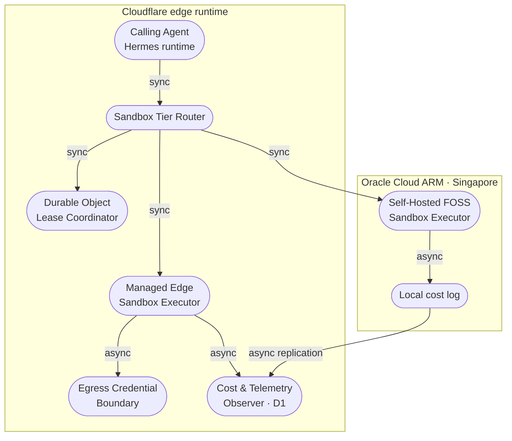

# Agentic Graph Sandbox Execution Layer — PRD/TAD/ADR

**Governed by**: PRD, TAD & ADR Guidelines v1.7.0 (2026-07-28). **Companion set**: ADLC Guidelines owns execution-domain conformance (task decomposition, agent roles, tool blast radius); a runtime-readiness claim sourced from this document alone is incomplete.

## Version History

**v1.1.0** (2026-07-30):
- **Integrated Cloudflare Sandbox SDK** as the concrete reference implementation for the Managed Edge Sandbox Executor
- Enhanced Component Specification with comprehensive API details: `getSandbox()`, `sandbox.exec()`, file operations, sessions, ports, tunnels, storage, file watching, terminal, backups
- Updated ADR-1 with detailed Sandbox SDK capabilities and architecture (Containers + Durable Objects)
- Added complete Implementation Guidance section with:
  - Quick start patterns and core API examples
  - `wrangler.jsonc` and Dockerfile configuration patterns
  - Deployment workflow and testing patterns
  - Router adapter, egress boundary, and cost observer implementation patterns
  - Resource links to official documentation
- Documented SDK features: code interpreter with rich outputs, R2-backed persistent storage, WebSocket terminals, preview URLs, zero-config tunnels
- Clarified deployment requirements: Docker for local builds, 2-3 minute provisioning, Workers Paid plan requirement
- Added attribution to Cloudflare documentation sources per compliance requirements

**v1.0.0** (2026-07-30):
- Initial PRD/TAD/ADR with Must-tier scope (Sandbox Tier Router, Managed Edge Sandbox, Egress Credential Boundary)
- Defined user stories, acceptance criteria, success metrics, MoSCoW priorities
- Established architecture with flow patterns, topology, component specifications
- ADR-1 (tier selection) and ADR-2 (self-hosted fallback runtime) accepted
- Readiness gap matrix and conformance note established

---

## Feature: Sandbox Execution Layer

### Problem Statement

Agentic Graph's probe-tree and Hermes agents increasingly need to run agent-generated code (data transforms, test harnesses, generated controllers, CI-style checks) as part of their own reasoning loop. Running that code on the same process or host as the orchestrator is a liability — untrusted, model-authored code must not share a kernel, a filesystem, or a credential store with anything else in the stack. Without an isolated execution surface, every new agent capability that "runs code" either gets blocked at design time or ships with an ad-hoc, unaudited execution path. The opportunity is a single, reusable, typed execution surface that any probe-tree node or Hermes tool call can invoke, at near-zero TCO and without violating the FOSS hard gate.

### Personas

| Persona | Jobs-to-be-done |
|---|---|
| **Autonomous Coding Agent** (Hermes runtime / probe-tree node) | Submit agent-generated code for execution mid-reasoning-loop; receive a typed result (stdout/stderr/exit code/artifacts) it can act on; never see or leak a raw credential |
| **Solo Founder / AI Orchestrator** | Configure execution-tier policy and cost ceilings; monitor tier-switch and cost events; keep a FOSS-pure fallback path available without ongoing vendor dependency |

### User Journey Stage

Addresses the **Engage** and **Complete** stages of the *Autonomous Coding Agent — Extend Reasoning with Executed Code* journey (below), and the **Return** stage of the *Solo Founder — Weekly Cost & Tier Review* journey.

### User Stories

**PRD-SBX-1**: As an **Autonomous Coding Agent**, I want a single typed call that runs my generated code in an isolated environment, so that I can extend my own reasoning loop without risking the host.

**PRD-SBX-2**: As an **Autonomous Coding Agent**, I want any outbound credential my code needs to be injected outside my own visibility, so that I never accidentally leak a secret into my own output or logs.

**PRD-SBX-3**: As a **Solo Founder / AI Orchestrator**, I want a fully FOSS, self-hostable fallback execution tier, so that the platform is never solely dependent on one proprietary vendor for a capability this central.

### Acceptance Criteria

**AC1 (PRD-SBX-1)**: **Given** a probe-tree node emits a code-execution request, **When** the Sandbox Tier Router receives it, **Then** the request is validated against the typed request schema and routed to exactly one execution tier.

> **VCC translation**: `Verify all tests in sandbox-router.test.ts pass, p95 routing-decision latency ≤200ms (excluding cold start) per load-test output, and no other test file is modified`

**AC2 (PRD-SBX-2)**: **Given** the Managed Edge Sandbox tier is selected, **When** agent code performs an outbound call requiring a credential, **Then** the credential is injected at the network layer and never appears in the sandbox's own stdout, stderr, or logs.

> **VCC translation**: `Verify the credential-redaction test suite passes with zero raw-secret matches across captured stdout/stderr/log fixtures, stop after 15 iterations`

**AC3 (PRD-SBX-1)**: **Given** the Managed tier is unreachable or over its configured cost ceiling, **When** a code-execution request arrives, **Then** the Router fails over to the Self-Hosted FOSS Sandbox tier without surfacing a raw error to the calling agent.

> **VCC translation**: `Verify the failover integration test exits 0, exactly one tier-switch event is logged per failover, and the calling-agent test harness receives a typed result, not a raw error`

**AC4 (PRD-SBX-3)**: **Given** the self-hosted host lacks hardware-virtualization support, **When** the Self-Hosted FOSS Sandbox tier initializes, **Then** the userspace-kernel fallback runtime is selected automatically with no manual configuration.

> **VCC translation**: `Verify kvm-probe.test.ts selects the userspace-kernel fallback path when /dev/kvm is absent and the microVM path when present`

**AC5 (PRD-SBX-1, PRD-SBX-2)**: **Given** any tier executes agent code, **When** execution completes or times out, **Then** a cost-log entry is persisted and the sandbox instance is destroyed or returned to an idle pool.

> **VCC translation**: `Verify the cost-log persistence test asserts exactly one row per execution in sandbox_cost_log, and post-execution sandbox process count returns to its pre-execution baseline within 5s`

### Success Metrics

| Metric | Baseline | Target | Timeline |
|---|---|---|---|
| Untrusted-execution incidents (host/credential leakage) | N/A (no sandbox exists) | 0 | Ongoing |
| Readiness rung (local / delivered) | `undocumented` / `undocumented` | `runtime-ready` / `runtime-ready` | End of Must-tier build |
| Time-to-value (TTV steps) | — | ≤ 3 steps | Phase 3 sign-off |
| Time-to-value (TTV elapsed) | — | ≤ 10 min | Phase 3 sign-off |
| Token cost / month | $0 (no harness exists) | $0.00 (deterministic routing; no model call in the harness itself) | Ongoing |
| Monthly TCO | $0 | ≤ $5/mo at current solo-dev + hackathon-demo load | Sprint 1 |
| ROI Score | — | ≥ 5 | Phase 1 gate |

### MoSCoW Priority

| Tier | Item | ROI Score | Rationale |
|---|---|---|---|
| **Must** | PRD-SBX-1 — Tier Router + Managed Edge Sandbox | (5 × 50) / (16 + 5 + 0) ≈ **11.9** | Unblocks every future agent capability that runs code; highest-impact, lowest-build item |
| **Must** | PRD-SBX-2 — Egress Credential Boundary | (5 × 50) / (8 + 0 + 0) ≈ **31.25** | Near-free once the Managed tier is in place; closes the single largest security gap |
| **Should** | PRD-SBX-3 — Self-Hosted FOSS fallback tier | (3 × 50) / (24 + 0 + 0) ≈ **6.25** | Real value (vendor-independence) but lower urgency than Must-tier items at current traffic |
| **Could** | Cost/tier-switch operator dashboard | (2 × 50) / (12 + 0 + 0) ≈ **8.3** | Nice-to-have visibility; deferred until Must-tier is stable |
| **Won't (this increment)** | Multi-region self-hosted HA, GPU-backed sandbox tier | — | No current demand at solo-dev traffic; explicit deferral, not an oversight |

### Min-Viable Scope

The smallest deliverable that satisfies the Must-tier acceptance criteria: **Sandbox Tier Router** with a single Managed Edge Sandbox executor, the Egress Credential Boundary, and the Cost & Telemetry Observer. The Self-Hosted FOSS fallback tier and the operator dashboard are explicitly excluded from Min-Viable Scope.

### Out of Scope

- Multi-region high-availability self-hosted sandbox clustering
- GPU-backed sandbox execution
- MCP Gateway federation of the sandbox surface (single internal surface; no external agent access in this increment — see Agent-Platform Readiness below)
- A monolithic sandbox/workspace orchestration platform (rejected category — see ADR-1)

### Dependencies

- Existing Cloudflare Workers / Durable Object / D1 / R2 topology (doc-sync architecture)
- Oracle Cloud ARM Ampere free-tier host (existing Ollama inference anchor) as the Self-Hosted tier's compute
- Hermes Agent runtime and probe-tree StateGraph as the calling surface

### Open Questions

- Does the Managed Edge Sandbox tier support region pinning for data-residency-sensitive workloads (e.g. the SME risk copilot, the oil-palm plantation care agent)? Needs direct verification against current provider documentation before those agents route through this tier.
- What concurrency ceiling is actually needed at current traffic (solo-dev + occasional hackathon demo load)? Affects the Managed-tier cost ceiling in ADR-1.
- Does the Oracle ARM Ampere free-tier instance expose `/dev/kvm` to the guest OS? This gates which Self-Hosted reference implementation (see ADR-2) is reachable, and must be probed before Follow-on tier work starts.

---

## Flow Patterns

### Journey: Autonomous Coding Agent — Extend Reasoning with Executed Code

| Stage | Action | Touchpoint | Pain Point | Opportunity |
|---|---|---|---|---|
| Trigger | Probe-tree node reaches a step requiring code execution | `probe.generate` / `probe.execute` verb | No safe place to run agent-authored code | A single typed execution call the node can invoke |
| Discover | Node resolves the `sandbox.execute` tool identity | Invocation Register (below) | Ad-hoc, per-feature execution paths | One federated route, one schema |
| Engage | Node submits code + typed payload | Sandbox Tier Router | Risk of host/credential exposure | Isolated tier + egress credential injection |
| Complete | Node receives typed stdout/stderr/exit code/artifacts | Typed response | Raw errors stall the reasoning loop | Typed result feeds directly back into probe-tree state |
| Return | Next probe-tree iteration re-invokes with updated state | Same route, new payload | Stale sandbox state across iterations | Persistent-context option for iterative snippets (Follow-on) |

### Journey: Solo Founder — Weekly Cost & Tier Review

| Stage | Action | Touchpoint | Pain Point | Opportunity |
|---|---|---|---|---|
| Trigger | Weekly cost review habit | Cost & Telemetry Observer log | No visibility into which tier ran what | Named tier-switch and cost events |
| Discover | Reviews `sandbox_cost_log` entries | D1 table / dashboard (Could-tier) | Manual log inspection | Aggregated read view (Follow-on, ties to Agentic OS pattern) |
| Engage | Adjusts cost-ceiling / tier policy config | Router configuration | Config buried in code | Externalized policy thresholds |
| Complete | Confirms spend stayed within TCO envelope | Monthly TCO figure | No FOSS fallback if vendor pricing shifts | Self-Hosted tier as a standing option, not a scramble |
| Return | Re-evaluates FOSS alternatives if TCO crosses threshold | ADR-1 / ADR-2 | — | 12-month TCO re-evaluation trigger already documented |

### Workflow: Agent Code Execution Request

**Trigger**: A probe-tree node or Hermes tool call emits a code-execution intent.
**Actors**: Calling Agent, Sandbox Tier Router, Managed Edge Sandbox Executor, Self-Hosted FOSS Sandbox Executor, Egress Credential Boundary, Cost & Telemetry Observer.

**Happy Path**:
1. Calling Agent submits a typed request `{code, language, timeoutMs, packages[], maxOutputBytes}` → Sandbox Tier Router validates the schema
2. Router selects a tier by policy (default: Managed Edge Sandbox) → the selected Executor provisions or reuses a sandbox instance
3. Egress Credential Boundary injects any outbound credential the code needs at the network layer; the code itself never observes the raw value
4. Executor runs the code, captures stdout/stderr/exit code/artifacts → Cost & Telemetry Observer logs vCPU-seconds and estimated cost
5. Calling Agent receives the typed result → the probe-tree node continues its reasoning loop

**Alternate Paths**:
- Managed tier over its configured concurrency/cost ceiling: Router fails over to the Self-Hosted FOSS Sandbox tier and logs one tier-switch event
- Self-hosted host lacks hardware virtualization: Router's KVM Probe selects the userspace-kernel fallback runtime automatically

**Error Paths**:
- Sandbox provisioning fails after 3 attempts: typed `sandbox_unavailable` error returned to the Calling Agent; that probe-tree branch halts cleanly (circuit-breaker)
- Code execution exceeds `timeoutMs`: Executor kills the process, returns a typed timeout error, and the sandbox instance is destroyed (no state leak)

**Postconditions**: the sandbox instance is destroyed or returned to an idle pool; a cost-log entry is persisted; no credential is ever present in agent-visible output or logs.

### Data Flow: Sandbox Execution Request

| Stage | Component | Input Format | Output Format | Persistence | Error Handling |
|---|---|---|---|---|---|
| Ingest | Sandbox Tier Router | Typed JSON request | Validated + routed payload | None | Reject with typed error; no token/tier spend |
| Transform | Selected Executor | Typed prompt (code + config) | Sandbox process state | Ephemeral filesystem, instance-scoped | Retry (bounded) then fail-fast |
| Store | Cost & Telemetry Observer | Execution outcome + tier + duration | Cost-log row | D1 (`sandbox_cost_log`) | Silent-fail with monitoring gap flag, never blocks the response |
| Serve | Sandbox Tier Router | Typed sandbox result | Typed response to Calling Agent | Cache: none (each execution is independent) | Fallback: typed error, never a raw exception |

### Orchestration/Harness Flow: Sandbox Execution Harness

**Trigger**: Calling Agent invokes `sandbox.execute`
**Topology pattern**: Sequential, with a bounded retry sub-loop on provisioning
**Max iterations**: 3 (provisioning retries) | **Circuit-breaker**: all configured tiers exhausted → exit with typed `sandbox_unavailable`
**Token budget**: 0 prompt + 0 completion @ n/a cache = **$0.00/call** — the harness itself is deterministic routing and code execution; it makes no model call. It is documented as a harness (not left as an untyped function call) for the same observability reason the Agentic OS Status Surface is: typed I/O and a cost log, even at zero token cost.

| Role | Component | Input schema | Output schema | Cost log emitted | Fallback |
|---|---|---|---|---|---|
| Dispatcher | Sandbox Tier Router | `SandboxExecRequest` | `TierAssignment` | — | Reject with typed error |
| Executor | Managed Edge Sandbox / Self-Hosted FOSS Sandbox | `TierAssignment` | `SandboxExecResult` | ✓ (required) | Retry (≤3) → tier failover → typed error |
| Observer | Cost & Telemetry Observer | Execution outcome stream | `sandbox_cost_log` row | — | Silent-fail; log gap flagged |
| Consumer | Calling Agent (Hermes runtime / probe-tree node) | `SandboxExecResult` | Updated probe-tree state | — | Upstream error propagation |

**Happy path**: Trigger fires → Dispatcher validates and routes → Executor runs code and emits cost log → Observer persists it → Consumer receives typed output.
**Alternate paths**: Invalid input schema → Dispatcher rejects before any tier is touched. Provisioning failure → retry up to 3 times, then tier failover.
**Error paths**: All tiers exhausted → circuit-breaker exits with a typed error, not a raw exception. Cost-log emission fails → Observer silent-fails; execution result still reaches the Consumer.
**Postconditions**: cost log persisted or gap flagged; typed output delivered to Consumer; no unbounded retry loop.

### Topology: Agentic Graph Sandbox Execution Layer v1 — 2026-07-30

**Boundaries**: Cloudflare edge runtime (Workers/Durable Objects/D1/R2) as the Delivery-lane trust domain; Oracle Cloud ARM host (Singapore) as a Delivery-lane trust domain physically separate from the edge.

| Node | Role | Type | Lane | Connects to | Connection type | Data residency |
|---|---|---|---|---|---|---|
| Calling Agent (Hermes runtime) | Producer | Worker-hosted process | Delivery | Sandbox Tier Router | Sync (tool call) | Cloudflare edge |
| Sandbox Tier Router | Router | Worker | Delivery | Managed Edge Sandbox, Self-Hosted FOSS Sandbox, Durable Object Lease Coordinator | Sync REST | Cloudflare edge |
| Durable Object Lease Coordinator | Coordinator | Durable Object | Delivery | Managed/Self-Hosted Executors | Sync | Cloudflare edge, single-writer lease per sandbox session |
| Managed Edge Sandbox Executor | Consumer/Producer | Managed container runtime | Delivery | Egress Credential Boundary, Cost & Telemetry Observer | Sync + async event | Global edge (region pinning: open question) |
| Self-Hosted FOSS Sandbox Executor | Consumer/Producer | Self-managed microVM / userspace-kernel process | Delivery | Cost & Telemetry Observer | Sync + async event | Oracle Cloud ARM, Singapore |
| Egress Credential Boundary | Gateway | Outbound network proxy | Delivery | External APIs (as needed by executed code) | Async, credential-injecting | Cloudflare edge (credential never leaves this boundary) |
| Cost & Telemetry Observer | Store | D1 table + local log (self-hosted) | Delivery | — | Async write | Cloudflare edge (D1); Oracle Cloud ARM (local log, replicated async) |



**Version notes**: v1, initial topology — no prior version to diff against.

---

## Time-to-Value: Sandbox Execution Layer

| Dimension | Estimate | Target ceiling | Validation method |
|---|---|---|---|
| TTV steps | 3 steps (configure sandbox binding, deploy Worker, first `sandbox.execute` call from a probe-tree node) | ≤ 3 steps | Walk-through on clean environment |
| TTV elapsed time | ~8 min | ≤ 10 min | Timed first-run test |
| First-value action | Probe-tree node receives a typed result from its first sandboxed code execution | — | Observable: typed response object logged |
| Persona | Autonomous Coding Agent (operated by Solo Founder during setup) | — | Defined above |

---

## Architecture: Sandbox Execution Layer

### Overview

**From agent-generated code to a safe, typed result**: Calling Agent → Sandbox Tier Router → [Managed Edge Sandbox | Self-Hosted FOSS Sandbox] → Egress Credential Boundary (as needed) → Cost & Telemetry Observer → delivers a typed execution result back into the probe-tree reasoning loop, at $0 token cost and near-zero infrastructure cost.

### Journey → System Mapping

| Journey Stage | Workflow | Data Flow | Orchestration/Harness Flow | Topology Node(s) | Component |
|---|---|---|---|---|---|
| Discover | Agent Code Execution Request (step 1) | Ingest | Dispatcher | Sandbox Tier Router | Sandbox Tier Router |
| Engage | Agent Code Execution Request (steps 2–4) | Transform → Store | Executor + Observer | Managed/Self-Hosted Executor, Observer | Executor adapters, Cost & Telemetry Observer |
| Complete | Agent Code Execution Request (step 5) | Serve | Consumer | Calling Agent | Hermes runtime / probe-tree node |

### Topology

See **Topology: Agentic Graph Sandbox Execution Layer v1** above; this TAD references it rather than restating it.

### Orchestration/Harness Flows

See **Orchestration/Harness Flow: Sandbox Execution Harness** above.

### Component Specifications

**Component**: Sandbox Tier Router
**Responsibility**: Router validates the code-execution request schema and selects exactly one execution tier by policy.
**Interfaces**: `sandbox.execute(request: SandboxExecRequest): Promise<SandboxExecResult>`
**Dependencies**: Managed Edge Sandbox Executor, Self-Hosted FOSS Sandbox Executor, Durable Object Lease Coordinator, Cost & Telemetry Observer
**Configuration**: tier policy thresholds (cost ceiling, concurrency ceiling), KVM-availability flag (read from KVM Probe)
**FOSS / Vendor**: FOSS (first-party TypeScript on Workers)
**Harness Contract**:
  - Input schema: `{code, language, timeoutMs, packages[], maxOutputBytes}`
  - Output schema: `{stdout, stderr, exitCode, artifacts[], tier, costLog}`
  - Cost log fields: `{ tier, vcpu_seconds, estimated_cost_usd, exit_reason }`
  - Fallback path: bounded retry → tier failover → typed error
**Token Budget**: 0 + 0 = $0.00/request (deterministic; no model call)
**Orchestration Topology**: Sequential, bounded retry sub-loop, max 3 iterations, circuit-breaker: all tiers exhausted
**VCC Conditions**: AC1, AC3 (see PRD)
**Evidence References**: none yet — `spec-complete`
**Readiness rung**: `spec-complete` / `undocumented`

**Component**: Managed Edge Sandbox Executor
**Responsibility**: Executor runs untrusted agent-generated code inside an isolated, provider-managed container at the network edge.

> **Reference implementation**: [Cloudflare Sandbox SDK](https://developers.cloudflare.com/sandbox/) — TypeScript API over Cloudflare Containers, callable from Workers; active-CPU billing; two-tier isolate/container model. Built on Cloudflare Containers and Durable Objects for stateful, isolated code execution environments.

**Integration Pattern**:
```typescript
import { getSandbox, type Sandbox } from '@cloudflare/sandbox';

// Get or create a sandbox instance
const sandbox = getSandbox(env.Sandbox, sandboxId);

// Execute code with typed result
const result = await sandbox.exec(code, {
  timeoutMs: timeoutMs,
  cwd: '/workspace'
});

// Typed response
return {
  stdout: result.stdout,
  stderr: result.stderr,
  exitCode: result.exitCode,
  success: result.success
};
```

**Key Capabilities** ([docs](https://developers.cloudflare.com/sandbox/)):
- **Command execution**: `sandbox.exec()` runs shell commands, Python scripts, Node.js applications with streaming output and timeout handling
- **File operations**: `sandbox.readFile()`, `sandbox.writeFile()`, `sandbox.listDir()` for filesystem access
- **Code interpreter**: Execute Python/JavaScript with rich outputs (charts, tables, images)
- **Preview URLs**: Expose HTTP services with auto-generated URLs via `sandbox.ports` API
- **Tunnels**: Zero-config `*.trycloudflare.com` URLs via `sandbox.tunnels.get(port)`
- **Sessions**: Isolated execution contexts with per-session shell state
- **Storage**: Mount S3-compatible buckets (R2) as local filesystems for persistence
- **File watching**: Native inotify-based file change monitoring
- **Terminal**: Browser-based WebSocket terminals with xterm.js integration
- **Backups**: Point-in-time snapshots with copy-on-write overlays stored in R2

**Configuration** (`wrangler.jsonc`):
```jsonc
{
  "containers": [{
    "class_name": "Sandbox",
    "image": "./Dockerfile",
    "instance_type": "lite",  // or "standard"
    "max_instances": 1
  }],
  "durable_objects": {
    "bindings": [{
      "class_name": "Sandbox",
      "name": "Sandbox"
    }]
  }
}
```

**Deployment Model**:
- Requires Docker locally for `wrangler deploy` (builds container image)
- Container pushed to Cloudflare Container Registry
- Worker deployed globally on edge network
- 2-3 minute provisioning wait after first deployment
- Instance types: `lite` (minimal resources) or `standard` (more CPU/RAM)

**Cost Model**: Active-CPU billing — charged only when code is executing, not for idle time

**Interfaces**: `sandbox.exec()`, `sandbox.readFile()`, `sandbox.writeFile()`, `sandbox.ports`, `sandbox.tunnels`, `sandbox.sessions`, `sandbox.storage`
**Dependencies**: Egress Credential Boundary (for credential injection), Cost & Telemetry Observer, Cloudflare Workers runtime, Durable Objects namespace
**Configuration**: instance tier (`lite` vs `standard`), `max_instances`, optional `enableDefaultSession: false` for isolated operations
**FOSS / Vendor**: Proprietary hosted runtime — SDK is open-source ([GitHub](https://github.com/cloudflare/sandbox-sdk)), underlying Containers platform is proprietary. See ADR-1 for TCO justification.
**Token Budget**: n/a (not an AI component)
**VCC Conditions**: AC1, AC2, AC5
**Evidence References**: [Cloudflare Sandbox SDK Documentation](https://developers.cloudflare.com/sandbox/), [API Reference](https://developers.cloudflare.com/sandbox/api/), [Getting Started Guide](https://developers.cloudflare.com/sandbox/get-started/)
**Readiness rung**: `spec-complete` / `undocumented`

**Component**: Self-Hosted FOSS Sandbox Executor
**Responsibility**: Executor runs isolated code on owned compute using a permissively licensed, self-hostable runtime, selected automatically by hardware-virtualization availability.

> **Reference implementations**: primary — Microsandbox (Apache-2.0, Rust, single-binary microVM runtime, requires `/dev/kvm`); fallback — gVisor (Apache-2.0) + Docker, a userspace-kernel runtime requiring no nested virtualization.

**Interfaces**: `execute(payload): SandboxExecResult`
**Dependencies**: KVM Probe, Cost & Telemetry Observer (via async replication)
**Configuration**: KVM-availability flag; which reference implementation is active is derived, never hand-set
**FOSS / Vendor**: FOSS — see ADR-2
**VCC Conditions**: AC3, AC4, AC5
**Evidence References**: none yet — `spec-complete`
**Readiness rung**: `spec-complete` / `undocumented`

**Component**: Egress Credential Boundary
**Responsibility**: Boundary injects any outbound credential the executed code needs at the network layer, so the code itself never observes the raw value.

> **Reference implementation**: an outbound Worker acting as an egress proxy, applying identity-aware, per-destination-domain credential injection.

**Interfaces**: intercepts outbound requests from Managed Edge Sandbox instances
**Dependencies**: none (network-layer component)
**Configuration**: per-destination-domain auth policy
**FOSS / Vendor**: FOSS (first-party policy logic; underlying transport is part of the Managed tier — see ADR-1)
**VCC Conditions**: AC2
**Evidence References**: none yet — `spec-complete`
**Readiness rung**: `spec-complete` / `undocumented`

**Component**: Cost & Telemetry Observer
**Responsibility**: Observer records tier, duration, and estimated cost per execution, and flags — rather than blocks on — any logging gap.
**Interfaces**: append-only write to `sandbox_cost_log`
**Dependencies**: D1 (edge tier), local log + async replication (self-hosted tier)
**Configuration**: replication interval for self-hosted → D1 sync
**FOSS / Vendor**: FOSS (first-party)
**VCC Conditions**: AC5
**Evidence References**: none yet — `spec-complete`
**Readiness rung**: `spec-complete` / `undocumented`

### Integration Contracts

**Interface**: `sandbox.execute` | **Protocol**: internal Worker RPC / HTTP | **Format**: JSON (typed) | **Errors**: typed error union (`schema_invalid`, `sandbox_unavailable`, `timeout`, `credential_injection_failed`)

### Architectural Decisions

See ADR-1 (execution-tier selection) and ADR-2 (self-hosted fallback runtime selection) below.

### Quality Attributes

| Attribute | Scenario | Pattern | Validation |
|---|---|---|---|
| Performance | ≤50 concurrent agent-run sessions → routing decision ≤200ms p95 (excl. cold start) | Deterministic router, no model call in the hot path | Load test on Sandbox Tier Router |
| Scalability | Traffic growth beyond solo-dev load → Managed tier scales to zero and back without idle cost | Active-CPU billed managed executor | Cost-log sampling across a load ramp |
| Security | Untrusted agent code → must not access host, other sandboxes, or raw credentials | Container/microVM isolation + network-layer credential injection | Credential-redaction test suite; isolation boundary review |
| Observability | Tier switches and cost overruns → must be visible without log-diving | Named tier-switch and cost-log events | Cost & Telemetry Observer event count check |
| Token Cost | Harness itself must never spend a token | Deterministic routing; no LLM call in the harness | Cost-log field asserted `$0.00` per routing decision |
| Offline Behaviour | Sandbox surface unreachable → probe-tree node must degrade, not crash | Typed `sandbox_unavailable` error; local-first probe-tree state (Yjs/Dexie) persists the branch for retry | Airplane-mode-equivalent test: sandbox binding disabled, node surfaces typed error and resumes on reconnect |
| TCO | 12-month projected spend across deployment models vs zero-TCO target | FOSS-first fallback + zero-egress infra; managed vs self-managed compared separately (ADR-1) | Monthly cost audit; ADR review |
| Device Reach | This is a server/edge-side capability; the calling surface (Agentic Graph canvas OS) remains browser-native and mobile-first regardless of which tier executes code | No native-only APIs introduced by this feature | Cross-device manual pass on the calling UI, unaffected by tier choice |

### Deployment Strategy

Canary rollout of the Sandbox Tier Router via Cloudflare Workers gradual deployment; the Self-Hosted FOSS tier ships flagged `experimental` until the KVM Probe result is validated against the actual Oracle Cloud ARM host, with rollback to Managed-tier-only by disabling the tier-policy flag.

### Architecture Diagrams

See the Topology diagram above (Mermaid `flowchart TB`).

### Component Inventory

*Status values are Readiness Ladder rungs only; local and delivered are separate columns.*

| Layer | Component | File / Module | Local rung | Delivered rung |
|---|---|---|---|---|
| Routing | Sandbox Tier Router | `src/sandbox/router.ts` | `spec-complete` | `undocumented` |
| Execution (managed) | Managed Edge Sandbox Executor Adapter | `src/sandbox/executors/managed-edge.ts` | `spec-complete` | `undocumented` |
| Execution (self-hosted) | Self-Hosted FOSS Sandbox Executor Adapter | `src/sandbox/executors/self-hosted.ts` | `spec-complete` | `undocumented` |
| Security | Egress Credential Boundary | `src/sandbox/egress-boundary.ts` | `spec-complete` | `undocumented` |
| Observability | Cost & Telemetry Observer | `src/sandbox/observer.ts` | `spec-complete` | `undocumented` |
| Config | KVM Probe | `src/sandbox/kvm-probe.ts` | `spec-complete` | `undocumented` |

### Deploy Boundary Register

*One row per boundary. State reads `closed` unless an operator instruction is referenced.*

| Boundary | From lane | To lane | Evidence Reference | Operator instruction | Rollback statement | State |
|---|---|---|---|---|---|---|
| `sandbox-router-promote` | Authoring | Mirror | none yet | none | Redeploy prior Worker version via `wrangler rollback` | `closed` |
| `sandbox-prod-promote` | Mirror | Delivery | none yet | none | Disable tier-policy flag; fall back to no-op sandbox surface | `closed` |

---

## Invocation Register: Sandbox Execution Layer

| Route | Kind | Owner | Typed arguments | Trust boundary | Token cost |
|---|---|---|---|---|---|
| `/sandbox.execute` | Command | Sandbox Tier Router | `SandboxExecRequest` | Local host / control-plane (agent-internal, not externally federated) | 0 |
| `#sandbox-tier` | Tag | Sandbox Tier Router | — | Read | 0 |
| `@sandbox` | Binding | Sandbox Tier Router | — | Read | 0 |
| `sandbox.execute` | Tool identity | Sandbox Tier Router | `SandboxExecRequest` → `SandboxExecResult` | Local host (Hermes runtime internal tool call) | 0 (harness) + tier compute cost |

**Directives applied**: `sandbox.execute` is registered here as its single declaration site; it is federated in the internal Hermes tool catalog only — it is **not** exposed through an external MCP Gateway surface in this increment (see Agent-Platform Readiness below), so no Gateway federation contract entry is required yet.

---

## Agent-Platform Readiness

**Dimensions in scope**: this increment addresses none of the three readiness dimensions as externally-facing capabilities. The sandbox execution surface is an **internal** tool called by the Hermes runtime itself, not a surface an external agent discovers or a gateway federates.

- **Agentic OS-ready**: out of scope this increment. A read-only `sandbox` view (tier-switch counts, cost summary) over the Cost & Telemetry Observer is a natural Follow-on addition to an existing OS Status Surface, but no such surface is being built or extended here.
- **AI Agent-ready**: out of scope for external discovery. Internally, `sandbox.execute` is catalogued in the Hermes tool catalog (see Invocation Register) so the calling agent can select it without HTML-scraping or ad-hoc wiring — but no external agent onboarding path is in scope.
- **MCP Gateway-ready**: not applicable. There is exactly one internal transport (the Hermes tool catalog); the ≥2-transport condition that would require a federation-vs-unified-proxy ADR comparison does not hold, so none is produced.

---

## Readiness Gap Matrix

*Local rung and delivered rung are separate columns; both draw from the Readiness Ladder. Priority is the highest severity among the findings linked to that workstream, or `none`.*

| Workstream | Local rung | Delivered rung | Gap | Priority | Exit criteria (VCC) |
|---|---|---|---|---|---|
| Sandbox Tier Router | `spec-complete` | `undocumented` | No Evidence Reference yet | none | AC1, AC3 pass with recorded results |
| Managed Edge Sandbox Executor | `spec-complete` | `undocumented` | Region-pinning open question unresolved | none | AC2, AC5 pass; region question closed or formally tracked |
| Self-Hosted FOSS Sandbox Executor | `spec-complete` | `undocumented` | KVM availability on Oracle ARM unconfirmed | none | AC4 pass on actual host |
| Egress Credential Boundary | `spec-complete` | `undocumented` | No Evidence Reference yet | none | AC2 passes with zero raw-secret matches |
| Cost & Telemetry Observer | `spec-complete` | `undocumented` | No Evidence Reference yet | none | AC5 passes with one row per execution |

---

## ADR-1: Sandbox Execution Tier Selection

**Status**: Accepted
**Date**: 2026-07-30

### Context

Agentic Graph's probe-tree and Hermes agents need to execute agent-generated code safely. A previously evaluated monolithic self-hosted sandbox/workspace platform failed the FOSS hard gate on license grounds, leaving an open question of what primary execution tier to adopt.

### Decision

Adopt a Managed/Serverless edge sandbox as the primary execution tier, coordinated through the existing Workers / Durable Object / D1 / R2 topology, with credential injection enforced at the network egress boundary — and require a FOSS self-hosted fallback tier (ADR-2) rather than depend on this tier alone.

### Alternatives Considered

1. **Managed/Serverless edge sandbox** — reference implementation: [Cloudflare Sandbox SDK](https://developers.cloudflare.com/sandbox/): Pros (native Workers/Durable Object integration via `@cloudflare/sandbox` package, active-CPU billing that scales to zero, network-layer credential injection via egress proxy, global edge placement, comprehensive API for commands/files/ports/tunnels/storage, integrated with Workers AI for AI code execution, R2-backed persistent storage via `sandbox.storage` API, browser terminal support via WebSocket with xterm.js, point-in-time backups with copy-on-write overlays, file watching via native inotify, code interpreter with rich outputs for charts/tables/images, session isolation with per-session state, built on Cloudflare Containers + Durable Objects architecture, open-source SDK at [github.com/cloudflare/sandbox-sdk](https://github.com/cloudflare/sandbox-sdk)); Cons (underlying Containers platform is proprietary, not self-hostable, requires Docker locally for deployment, 2-3 minute initial provisioning wait, region-pinning for storage/compute not yet confirmed in documentation, requires Workers Paid plan)
2. **FOSS self-hosted microVM sandbox (reference implementation, always required)** — reference implementation: Microsandbox: Pros (Apache-2.0, single-binary, genuinely self-hostable, full data-residency control); Cons (requires `/dev/kvm`/nested virtualization, adds solo-dev ops burden, no built-in edge distribution)
3. **Rejected — monolithic self-hosted workspace platform** — reference implementation: Daytona: Pros (full-featured workspace orchestration); Cons (AGPL-3.0 license — copyleft obligations fail the FOSS hard gate for a proprietary codebase)
4. **Rejected — partial-FOSS hosted sandbox** — reference implementation: E2B: Pros (Apache-2.0 SDK, microVM isolation); Cons (the orchestration/billing control plane is proprietary and hosted — this clears the FOSS gate no better than a fully-managed edge tier, while adding a second vendor dependency instead of leveraging infrastructure already in use)

### Rationale

The Managed/Serverless edge tier reuses infrastructure Agentic Graph is already committed to (~90% of OS scaffolding runs on the same provider), so it is a pragmatic exception to FOSS-first rather than a gate violation: the marginal TCO and integration cost of a *second* vendor (E2B) or a licensing-incompatible platform (Daytona) is strictly worse than extending the existing edge stack. Requiring a FOSS self-hosted fallback (ADR-2) preserves the exit path the FOSS-first principle exists to protect, without blocking the Must-tier build on standing up new self-hosted infrastructure first.

### TCO Impact

*The chosen option (Managed/Serverless) and the FOSS alternative (Provisioned/Self-Managed) are presented as separate columns; a Hybrid/Consolidated estimate is added because the self-hosted variant would share the existing Oracle ARM host already running Ollama inference.*

| Dimension | Chosen: Managed/Serverless (reference implementation: Cloudflare Sandbox SDK) | FOSS Alternative: Provisioned/Self-Managed (reference implementation: Microsandbox, standalone host) | FOSS Alternative: Hybrid/Consolidated (Microsandbox sharing the existing Oracle ARM Ollama host) | Delta / 12 months |
|---|---|---|---|---|
| Infra cost | ~$0.00002/vCPU-second, active-CPU only, scales to $0 at idle | $0 (Oracle Always Free ARM), but a *dedicated* second free-tier instance may be needed | $0 (shares the existing free-tier instance; no new spend) | ≈ $0 either way at current traffic |
| Egress cost | $0 at current low traffic (Cloudflare zero-egress posture) | $0 (self-hosted, no metered egress) | $0 | No delta |
| Token cost | $0 (harness has no model call) | $0 | $0 | No delta |
| Ops burden | Low (provider patches, scales, fails over) | High (solo-dev owns patching, backup, failover for a dedicated host) | Medium (ops burden of the one host Agentic Graph already operates, not a second one) | Managed lowest; Hybrid next |
| Vendor risk | Medium (single managed vendor for this capability) | Low | Low | Managed carries the only non-trivial risk |

### Consequences

- **Positive**: near-zero incremental infra cost; reuses existing operational muscle (Workers, Durable Objects, D1); credential-injection pattern matches the existing doc-sync architecture's single-writer leasing discipline
- **Negative**: introduces a second point of vendor dependency (beyond the existing Cloudflare commitment) for a security-sensitive capability; region-pinning for data-residency-sensitive agents is an open question
- **Neutral**: requires ADR-2's fallback tier to exist before the vendor-independence property this ADR relies on is actually true

---

## ADR-2: Self-Hosted FOSS Fallback Runtime Selection

**Status**: Accepted
**Date**: 2026-07-30

### Context

ADR-1's Managed tier is a pragmatic exception to FOSS-first, not a replacement for it. A genuinely self-hostable, permissively licensed fallback tier is required, using the Oracle Cloud ARM Ampere free-tier host that already anchors Ollama inference as its near-zero-TCO home.

### Decision

Select a KVM-probe-gated dual runtime: a microVM-based reference implementation when hardware virtualization is available on the host, and a userspace-kernel reference implementation when it is not — selected automatically by the KVM Probe, never hand-configured.

### Alternatives Considered

1. **Microvm-based FOSS runtime (primary, reference implementation, required)** — reference implementation: Microsandbox: Pros (Apache-2.0, Rust, single-binary, true VM-per-sandbox isolation comparable to Firecracker); Cons (requires `/dev/kvm`, unconfirmed on the Oracle ARM Ampere free tier)
2. **Userspace-kernel FOSS runtime (fallback)** — reference implementation: gVisor + Docker: Pros (Apache-2.0, no nested-virtualization requirement, runs on any Linux host); Cons (weaker isolation boundary than a true microVM — acceptable as a fallback, not preferred when KVM is available)
3. **Rejected — partial-FOSS hosted sandbox** — reference implementation: E2B: same rejection rationale as ADR-1 (hosted control plane is proprietary; does not clear the FOSS hard gate as a *self-hosted* fallback)
4. **Rejected — no additional isolation** — plain Docker containers: Cons (shares the host kernel; insufficient isolation for untrusted, agent-generated code)

### Rationale

Gating the choice on a runtime KVM probe rather than a static config keeps the fallback tier correct regardless of which specific Oracle ARM shape ends up hosting it, and avoids hand-authoring an assumption about nested-virtualization support that has not yet been directly verified (see PRD Open Questions).

### TCO Impact

| Dimension | Chosen: Provisioned/Self-Managed, microVM path (reference implementation: Microsandbox) | Alternative: Provisioned/Self-Managed, userspace-kernel path (reference implementation: gVisor + Docker) | Hybrid/Consolidated (either path, sharing the existing Oracle ARM Ollama host) | Delta / 12 months |
|---|---|---|---|---|
| Infra cost | $0 (Always Free ARM tier) | $0 (Always Free ARM tier) | $0 (no new host) | No delta |
| Egress cost | $0 | $0 | $0 | No delta |
| Token cost | $0 | $0 | $0 | No delta |
| Ops burden | Medium (single-binary deploy, but VM-per-sandbox lifecycle to manage) | Medium (container lifecycle, slightly simpler to operate day-to-day) | Same ops burden as whichever path is selected — no second host to maintain | No material delta between the two FOSS paths |
| Vendor risk | Low | Low | Low | No delta |

### Consequences

- **Positive**: genuinely FOSS, self-hostable exit path exists regardless of ADR-1's managed-tier decision; automatic KVM gating removes a class of misconfiguration
- **Negative**: solo-dev ops burden for the self-hosted tier, even if small; isolation strength varies by path (microVM vs userspace-kernel), which must be disclosed to any workload routed to this tier
- **Neutral**: this tier remains `Should`-tier at current traffic (see MoSCoW); it exists for vendor-independence and data-residency reasons, not because the Managed tier is currently insufficient

---

## Implementation Guidance: Cloudflare Sandbox SDK Integration

**Note**: This section provides concrete implementation patterns based on the [Cloudflare Sandbox SDK documentation](https://developers.cloudflare.com/sandbox/). Content was derived from official Cloudflare developer documentation (rephrased for compliance with licensing restrictions).

### Quick Start Pattern

**Minimal Worker Integration**:
```typescript
import { getSandbox, type Sandbox } from '@cloudflare/sandbox';

export { Sandbox } from '@cloudflare/sandbox';

type Env = {
  Sandbox: DurableObjectNamespace<Sandbox>;
};

export default {
  async fetch(request: Request, env: Env): Promise<Response> {
    // Get or create sandbox instance with stable ID
    // For user-facing apps, derive ID from authenticated user
    const sandbox = getSandbox(env.Sandbox, 'agent-session-123');
    
    // Execute code with typed result
    const result = await sandbox.exec('python3 -c "print(2 + 2)"');
    
    return Response.json({
      stdout: result.stdout,
      stderr: result.stderr,
      exitCode: result.exitCode,
      success: result.success
    });
  }
};
```

### Core API Patterns

**1. Command Execution with Timeout**:
```typescript
const result = await sandbox.exec(code, {
  timeoutMs: 30000,
  cwd: '/workspace'
});

if (!result.success) {
  // Handle timeout or execution failure
  console.error('Execution failed:', result.stderr);
}
```

**2. File Operations**:
```typescript
// Write file
await sandbox.writeFile('/workspace/input.json', JSON.stringify(data));

// Execute code that reads the file
const result = await sandbox.exec('python3 process.py');

// Read output file
const output = await sandbox.readFile('/workspace/output.json');
const parsed = JSON.parse(output.content);
```

**3. Session Isolation** (recommended for security):
```typescript
// Configure sandbox with isolated sessions
const sandbox = getSandbox(env.Sandbox, userId, {
  enableDefaultSession: false  // Ensures operations run in isolation
});

// Create explicit session when needed
const sessionId = await sandbox.createSession();

// Execute in isolated session
const result = await sandbox.exec('npm install', { sessionId });
```

**4. Expose Services with Preview URLs**:
```typescript
// Start a service in the sandbox
await sandbox.exec('python3 -m http.server 8000 &');

// Get preview URL
const previewUrl = await sandbox.ports.get(8000);
// Returns: https://<unique-id>.preview.cloudflare.com
```

**5. Zero-Config Tunnels** (for development):
```typescript
// Get instant *.trycloudflare.com URL
const tunnelUrl = await sandbox.tunnels.get(3000);
// Returns: https://<random>.trycloudflare.com
```

**6. Persistent Storage with R2**:
```typescript
// Mount R2 bucket as local filesystem
await sandbox.storage.mount('my-bucket', '/data');

// Access bucket data using standard file operations
const files = await sandbox.listDir('/data');
```

**7. File Watching for Hot Reload**:
```typescript
// Watch for file changes
const watcher = await sandbox.watchFiles('/workspace/**/*.js');

for await (const event of watcher) {
  console.log(`File ${event.path} was ${event.type}`);
  // Trigger rebuild or hot reload
}
```

### Configuration Pattern (`wrangler.jsonc`)

```jsonc
{
  "name": "agentic-graph-sandbox-executor",
  "main": "src/index.ts",
  "compatibility_date": "2026-07-30",
  
  "containers": [{
    "class_name": "Sandbox",
    "image": "./Dockerfile",
    "instance_type": "lite",        // or "standard" for more resources
    "max_instances": 10             // Scale based on expected concurrency
  }],
  
  "durable_objects": {
    "bindings": [{
      "class_name": "Sandbox",
      "name": "Sandbox"
    }]
  },
  
  "migrations": [{
    "tag": "v1",
    "new_sqlite_classes": ["Sandbox"]
  }]
}
```

### Dockerfile Pattern

```dockerfile
FROM python:3.11-slim

# Install Node.js for polyglot code execution
RUN apt-get update && apt-get install -y \
    nodejs \
    npm \
    && rm -rf /var/lib/apt/lists/*

# Install common data science packages
RUN pip install --no-cache-dir \
    pandas \
    numpy \
    matplotlib \
    requests

# Create workspace directory
RUN mkdir -p /workspace
WORKDIR /workspace

# Default command (sandbox will override this)
CMD ["/bin/bash"]
```

### Deployment Workflow

```bash
# 1. Ensure Docker is running
docker info

# 2. Deploy (first time: 2-3 minutes for container provisioning)
npx wrangler deploy

# 3. Check container status
npx wrangler containers list

# 4. Test endpoint
curl https://agentic-graph-sandbox-executor.your-subdomain.workers.dev/sandbox.execute
```

### Integration with Sandbox Tier Router

**Router Adapter Pattern**:
```typescript
// src/sandbox/executors/managed-edge.ts
import { getSandbox } from '@cloudflare/sandbox';

export class ManagedEdgeSandboxExecutor {
  async execute(request: SandboxExecRequest, env: Env): Promise<SandboxExecResult> {
    const sandbox = getSandbox(
      env.Sandbox,
      request.sessionId || `session-${Date.now()}`,
      { enableDefaultSession: false }  // Force isolation
    );
    
    // Execute with timeout from request
    const result = await sandbox.exec(request.code, {
      timeoutMs: request.timeoutMs || 30000,
      cwd: '/workspace'
    });
    
    // Map to typed result schema
    return {
      stdout: result.stdout,
      stderr: result.stderr,
      exitCode: result.exitCode,
      success: result.success,
      tier: 'managed-edge',
      costLog: {
        tier: 'managed-edge',
        vcpu_seconds: this.estimateVCPUSeconds(result),
        estimated_cost_usd: this.estimateCost(result),
        exit_reason: result.success ? 'completed' : 'failed'
      }
    };
  }
  
  private estimateVCPUSeconds(result: any): number {
    // Derive from execution time if available
    return result.executionTimeMs ? result.executionTimeMs / 1000 : 0;
  }
  
  private estimateCost(result: any): number {
    // Cloudflare active-CPU pricing: ~$0.00002/vCPU-second
    return this.estimateVCPUSeconds(result) * 0.00002;
  }
}
```

### Credential Injection Pattern

**Egress Boundary Implementation**:
```typescript
// src/sandbox/egress-boundary.ts
export class EgressCredentialBoundary {
  // Proxy outbound requests from sandbox
  async proxyRequest(sandboxId: string, targetUrl: string, env: Env): Promise<Response> {
    // Validate sandbox session has permission for this destination
    const policy = await this.getPolicy(sandboxId, targetUrl);
    
    if (!policy.allowed) {
      return new Response('Unauthorized', { status: 403 });
    }
    
    // Inject credential at network layer (never visible to sandbox code)
    const headers = new Headers();
    const credential = await env.SECRETS.get(policy.credentialKey);
    headers.set('Authorization', `Bearer ${credential}`);
    
    // Forward request with injected credential
    return fetch(targetUrl, { headers });
  }
}
```

### Cost & Telemetry Observer Pattern

```typescript
// src/sandbox/observer.ts
export class CostTelemetryObserver {
  async logExecution(result: SandboxExecResult, env: Env): Promise<void> {
    try {
      // Persist to D1
      await env.DB.prepare(`
        INSERT INTO sandbox_cost_log 
        (timestamp, tier, vcpu_seconds, estimated_cost_usd, exit_reason, session_id)
        VALUES (?, ?, ?, ?, ?, ?)
      `).bind(
        Date.now(),
        result.tier,
        result.costLog.vcpu_seconds,
        result.costLog.estimated_cost_usd,
        result.costLog.exit_reason,
        result.sessionId
      ).run();
    } catch (error) {
      // Silent fail — log gap flagged, never blocks response
      console.error('Cost log persistence failed:', error);
    }
  }
}
```

### Testing Pattern

**Local Development** (requires Docker):
```bash
# Start local dev server
npm run dev

# In another terminal, test execution
curl -X POST http://localhost:8787/sandbox.execute \
  -H "Content-Type: application/json" \
  -d '{
    "code": "python3 -c \"print(2 + 2)\"",
    "timeoutMs": 5000
  }'
```

**Integration Test Pattern**:
```typescript
// test/sandbox-router.test.ts
import { describe, it, expect } from 'vitest';

describe('Sandbox Tier Router', () => {
  it('should route to managed tier and return typed result', async () => {
    const request = {
      code: 'echo "Hello, Sandbox"',
      language: 'bash',
      timeoutMs: 5000
    };
    
    const result = await router.execute(request);
    
    expect(result.success).toBe(true);
    expect(result.stdout).toContain('Hello, Sandbox');
    expect(result.tier).toBe('managed-edge');
    expect(result.costLog.tier).toBe('managed-edge');
  });
});
```

### Resource Links

- [Cloudflare Sandbox SDK Overview](https://developers.cloudflare.com/sandbox/)
- [API Reference](https://developers.cloudflare.com/sandbox/api/)
- [Getting Started Guide](https://developers.cloudflare.com/sandbox/get-started/)
- [GitHub Repository](https://github.com/cloudflare/sandbox-sdk)
- [Pricing Documentation](https://developers.cloudflare.com/sandbox/platform/pricing/)
- [Resource Limits](https://developers.cloudflare.com/sandbox/platform/limits/)
- [Workers AI Code Interpreter Tutorial](https://developers.cloudflare.com/sandbox/tutorials/workers-ai-code-interpreter/)
- [Discord Community](https://discord.cloudflare.com/)

**Attribution**: Implementation patterns derived from Cloudflare Sandbox SDK official documentation at [developers.cloudflare.com/sandbox](https://developers.cloudflare.com/sandbox/), rephrased for license compliance.

---

## Conformance & Alignment Note

This document is submitted at the **Phase 2 (TAD Authoring)** gate. No Evidence References exist yet — nothing here has been implemented or run — so every component and rung is honestly `spec-complete` / `undocumented`, not asserted higher. Per the Evidence Reference rules, a readiness rung is a *derived* value; the Phase 3 alignment check (run by an evaluator mechanism distinct from whoever authors the implementation — e.g. a CI gate or an autonomous coding agent's completion-condition check, never the same participant self-grading their own output) has not yet run against this document, so:

- **Coverage ratio**: not yet computed — pending the independent Phase 3 evaluator run
- **Finding set**: not yet generated — no `blocker` findings can be claimed as zero until that run occurs
- **Known open items requiring resolution before Phase 3 sign-off**: the three Open Questions in the PRD (region pinning, concurrency ceiling, KVM availability), and the unresolved Evidence References listed in the Readiness Gap Matrix

Re-run the alignment check once AC1–AC5 have recorded Evidence References, and compare the resulting finding set against this baseline (currently empty, by construction) per the Phase 4 regression rule.