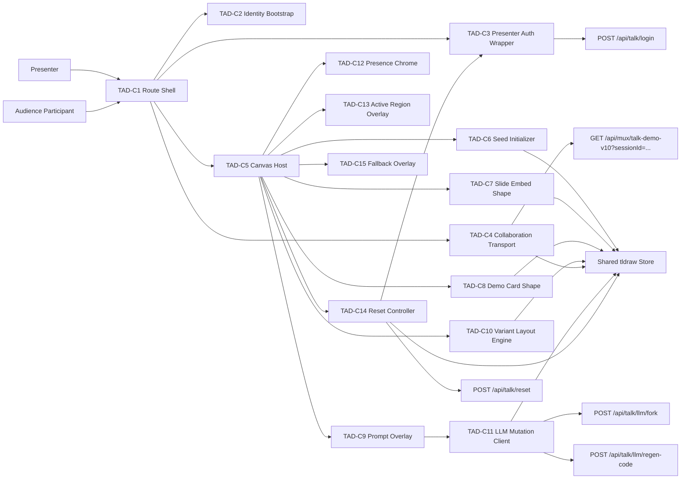
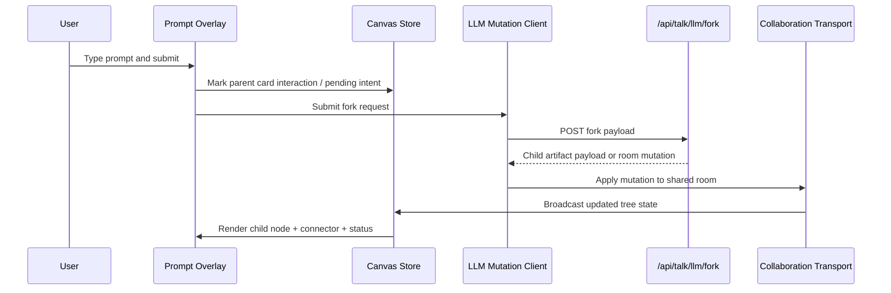

# Figma Slides Demo Canvas - PRD + TAD

## Markdown YAML Frontmatter Contract

- The opening YAML frontmatter block remains the first block and canonical metadata SSOT for this PRD/TAD.
- This document is a canonical authored PRD/TAD reconstruction, not a typed validation fixture or generated registry surface.
- Frontmatter stays in plain YAML so the file demonstrates the default authoring path for PRD/TAD, workflow, and architecture docs.
- If typed `{key, type, value}` envelopes are needed for ingest -> parse -> render validation, that coverage should live in a dedicated fixture doc rather than replacing canonical planning prose.
- Runtime, product, and architecture conclusions must be derived from parsed frontmatter and document content only, never from file path assumptions or downstream mirrors.

## 1. Document Purpose

This document reconstructs the likely product requirements and technical architecture behind the live `aoshe.ng/aie` experience: a collaborative canvas combining a Figma slide deck, seeded interactive demo cards, and inline AI-assisted branching/editing.

It follows the PRD/TAD separation rule:

- PRD sections define user value, scope, stories, acceptance criteria, and success metrics.
- TAD sections define components, data flows, contracts, architecture, quality attributes, and rebuild strategy.

## 2. Problem Discovery

### 2.1 Problem Statement

Live demo presenters often need to do three things in one place:

1. present prepared slides,
2. improvise with interactive artifacts,
3. and show AI-assisted iteration in front of an audience.

Traditional slide tools, whiteboards, and chat-based AI interfaces fragment that experience. The opportunity is a single live canvas where a presenter can move between prepared narrative and generative experimentation without changing tools or breaking audience context.

### 2.2 Hypothesis

If presenters can embed slides, spawn demo variants, and collaborate with audience members in one shared canvas, then live sessions will feel more fluid, more legible, and more participatory than a workflow split across separate slides, IDEs, and chat tabs.

### 2.3 Assumptions

- The product is optimized for live presentation or workshop settings rather than asynchronous planning.
- The `AIE` route is a specialized experience, not the site's default editor mode.
- The seeded game cards are presentation artifacts that demonstrate branching and AI editing, not the only supported content type.
- Presenter privileges are intentionally lightweight for speed during live sessions.

### 2.4 Scope of This Reconstruction

- Included: inferred product intent, reconstructed requirements, probable architecture, likely source tree, and a rebuild plan.
- Excluded: server-side implementation details not observable from the bundle, exact persistence schema, exact prompt templates, and internal org-specific operating procedures.

## 3. Personas and Jobs-to-be-Done

### 3.1 Persona: Presenter

Job-to-be-done:
"As a presenter, I want to show a prepared narrative and generate new demo variants live, so that I can adapt to the room without leaving the canvas."

Pain points:

- Context switching between slides, code, and chat
- Difficulty preserving audience attention during live edits
- Hard to visually explain branching and iteration

### 3.2 Persona: Audience Participant

Job-to-be-done:
"As a participant, I want to suggest changes directly on the live artifact, so that I can influence the demo without needing editor or code access."

Pain points:

- Chat suggestions are detached from the artifact they refer to
- Turn-taking in live sessions is ambiguous
- Collaborative edits can easily become chaotic

### 3.3 Persona: Technical Facilitator

Job-to-be-done:
"As a facilitator, I want safe reset and fallback mechanisms, so that the session can recover quickly when a demo branch goes wrong."

Pain points:

- Live demos drift into broken states
- Recovery paths are slow or embarrassing
- Presenter controls are often too hidden or too broad

## 4. User Journey Flow

## Journey: Presenter - Run a Live Interactive Demo

| Stage | Action | Touchpoint | Pain Point | Opportunity |
| --- | --- | --- | --- | --- |
| Trigger | Opens the `AIE` route before or during a talk | Browser route | Multiple tools usually needed | One route acts as presentation workspace |
| Discover | Sees seeded slides and demo cards already arranged | Shared canvas | Empty-canvas setup wastes time | Seeded content gives instant starting point |
| Engage | Selects a card and enters a prompt below it | Card prompt bar | Audience loses context in detached chat | Prompt is spatially attached to the artifact |
| Complete | Adds a fork or rewrites a card live | Inline actions + canvas | Iteration history is usually invisible | Branches become visible nodes with lineage |
| Return | Resets room or shows fallback recording | Top-right controls / overlay | Recovery from broken demo is clumsy | Fast reset and fallback preserve flow |

## Journey: Audience Participant - Contribute a Live Idea

| Stage | Action | Touchpoint | Pain Point | Opportunity |
| --- | --- | --- | --- | --- |
| Trigger | Joins shared route and enters a display name | Entry overlay | Anonymous presence is confusing | Lightweight identity makes collaboration legible |
| Discover | Sees cards, slide deck, and collaborator presence | Shared canvas | Hard to know where to comment | Cards expose specific prompt targets |
| Engage | Hovers a card and types a change request | Hover prompt bar | Suggestions in chat are disconnected | Suggestion lands on the exact node |
| Complete | Spawns a new node variant | `Add new node` action | Branching usually disappears into history | New branch is visible and spatially linked |
| Return | Revisits the canvas state later in the session | Live collaboration state | Hard to know what changed | Variant tree preserves demo evolution |

## 5. Workflow Flow

## Workflow: Join and Initialize Live Session

**Trigger**: User navigates to `/aie`

**Actors**: Browser client, identity bootstrapper, collaboration transport, canvas app

**Happy Path**:

1. Client loads route bundle and mounts the `AIE` app.
2. User enters a display name.
3. Client creates or retrieves local audience identity.
4. Client opens collaboration socket for the talk room.
5. Canvas mounts with seeded slide deck and demo cards.

**Alternate Paths**:

- If presenter credentials exist locally, presenter capabilities are enabled.
- If presenter credentials do not exist, user joins as normal participant.

**Error Paths**:

- If socket connection fails, app remains loaded but live collaboration is degraded.
- If seeded assets fail to initialize, route still loads but content is incomplete.

**Postconditions**:

- User has a visible identity in the collaborative canvas.
- Talk room content is mounted and viewport is zoomed to relevant bounds.

## Workflow: Prompt a Card and Create a Fork

**Trigger**: User hovers a `talk-game` card and submits a prompt

**Actors**: User, prompt UI, client mutation logic, LLM endpoint, collaboration store

**Happy Path**:

1. User types a prompt in the card prompt bar.
2. User presses Enter or clicks `Add new node`.
3. Client calls fork endpoint with parent card context and prompt.
4. New child card is created with `pending` status.
5. Server returns updated plan/source payload.
6. Card becomes `done`; layout and connectors update automatically.

**Alternate Paths**:

- User clicks `Make edits` instead of `Add new node`, rewriting the current node in place.

**Error Paths**:

- LLM call fails; card surfaces an error state.
- User exceeds pending-card threshold; fork action is disabled.

**Postconditions**:

- The branch tree reflects the new variant.
- Other collaborators see the new node in real time.

## Workflow: Reset the Room

**Trigger**: Presenter clicks `Reset`

**Actors**: Presenter UI, presenter-auth fetch wrapper, room state manager, collaboration store

**Happy Path**:

1. Presenter opens reset confirmation dialog.
2. Presenter confirms reset.
3. Client sends authenticated reset request.
4. Non-seed variant nodes are deleted.
5. Reset timestamp is updated to enforce cooldown.

**Alternate Paths**:

- Presenter cancels reset and returns to session unchanged.

**Error Paths**:

- Reset request fails; dialog remains with visible error feedback.

**Postconditions**:

- Room returns to seeded baseline.
- Reset cooldown is active.

## 6. PRD Requirements

### 6.1 Product Goals

- Unite slides, interactive artifacts, and AI-assisted iteration in one collaborative surface.
- Make demo evolution visible through spatial branching rather than hidden history.
- Support presenter control without making audience participation heavy or brittle.

### 6.2 Epics

#### PRD-E1 Seeded Live Presentation Surface

The system must present a ready-to-use collaborative canvas containing a slide deck and seeded artifacts.

User stories:

- `PRD-E1-S1`: As a presenter, I want the route to open into a prepared canvas, so that setup time is near zero.
- `PRD-E1-S2`: As a participant, I want to understand the main artifacts at a glance, so that I can orient quickly.

Acceptance criteria:

- Given a user opens `/aie`, when the app is ready, then a seeded slide deck and seeded demo cards are visible.
- Given seeded content exists, when the route loads, then the viewport auto-fits relevant content bounds.
- Given the talk theme is active, when the canvas renders, then default grid noise and excess editor chrome are suppressed.

#### PRD-E2 Inline AI-Assisted Card Iteration

The system must let users submit change prompts directly from the artifact they want to modify.

User stories:

- `PRD-E2-S1`: As a participant, I want to request a new branch from a card, so that my idea becomes a concrete variant.
- `PRD-E2-S2`: As a presenter, I want to rewrite a card in place, so that I can refine it without growing the tree.

Acceptance criteria:

- Given a card is idle, when the user enters a prompt, then `Add new node` and `Make edits` actions are available.
- Given the user chooses `Add new node`, when the request succeeds, then a linked child node appears.
- Given the user chooses `Make edits`, when the request succeeds, then the current card content updates in place.
- Given the card is already pending, when the user focuses the prompt bar, then editing actions are disabled and pending state is communicated.

#### PRD-E3 Multi-User Collaboration and Presence

The system must support multiple simultaneous viewers with legible identity and lightweight presence.

User stories:

- `PRD-E3-S1`: As a collaborator, I want to join with a simple name entry, so that I can participate quickly.
- `PRD-E3-S2`: As a presenter, I want to see collaborator presence, so that I can gauge room activity.

Acceptance criteria:

- Given a new viewer enters a valid name, when they join, then their identity is reflected in the canvas session.
- Given multiple collaborators are connected, when the top-right presence indicator renders, then it shows count and sampled colors.
- Given another collaborator is active on a card region, when I view the canvas, then their active region can be visually indicated.

#### PRD-E4 Presenter Recovery Controls

The system must help a presenter recover from failed branches or environment issues during a live session.

User stories:

- `PRD-E4-S1`: As a presenter, I want to reset the room safely, so that I can return to a known baseline.
- `PRD-E4-S2`: As a presenter, I want a fallback media overlay, so that I can continue the talk if the live demo stalls.

Acceptance criteria:

- Given the presenter confirms reset, when reset completes, then all non-seed variants are removed.
- Given a recent reset occurred, when the presenter views the control, then cooldown state is visible and prevents immediate repeat reset.
- Given the fallback shortcut is triggered, when a fallback video exists, then the overlay opens and playback is available.

### 6.3 MoSCoW Prioritization

| Priority | Items |
| --- | --- |
| Must | Seeded canvas, collaboration transport, slide embed, inline prompt bar, fork/edit actions, presence, reset |
| Should | Active-region indicators, fallback overlay, auto-layout of branches, seeded artifact zoom-to-fit |
| Could | Richer moderation controls, branch collapsing, replay mode, structured prompt templates |
| Won't (initially) | Full auth system, granular permissions matrix, general-purpose CMS for seeding, offline-first mode |

### 6.4 Success Metrics

| Metric | Baseline | Target | Timeline |
| --- | --- | --- | --- |
| Time from route open to interactive readiness | Unknown | Under 5 seconds on standard broadband | Initial release |
| Time from prompt submit to visible pending state | Unknown | Under 500 ms perceived feedback | Initial release |
| Time from presenter reset confirm to baseline room state | Unknown | Under 3 seconds | Initial release |
| Demo branch comprehension in user testing | Unknown | 80%+ of participants can identify parent/child relationship | First validation cycle |

### 6.5 Explicit Exclusions

- No requirement for general-purpose deck authoring inside the route
- No requirement for source-code editing inside the browser surface
- No requirement for persistent user accounts beyond lightweight presenter mode
- No requirement for arbitrary artifact types in version 1

### 6.6 Open Questions

1. Are seeded game cards stand-ins for a broader artifact model or a fixed content type?
2. Is room state persisted beyond the current collaboration session?
3. Is presenter auth intended only for trusted internal use?
4. Should audience write access remain universally enabled?

## 7. TAD Component Inventory

| TAD ID | Component | Responsibility | Maps to PRD |
| --- | --- | --- | --- |
| TAD-C1 | Route Shell | Mount `/aie` route and bootstrap app lifecycle | PRD-E1 |
| TAD-C2 | Identity Bootstrap | Collect display name, assign color, persist audience id | PRD-E3 |
| TAD-C3 | Presenter Auth Wrapper | Validate local presenter secret and attach privileged headers | PRD-E4 |
| TAD-C4 | Collaboration Transport | Connect client to room socket and sync shared state | PRD-E1, PRD-E3 |
| TAD-C5 | Canvas Host | Render `tldraw` canvas with custom theme and reduced chrome | PRD-E1 |
| TAD-C6 | Seed Initializer | Ensure slide deck and seed cards exist in room state | PRD-E1 |
| TAD-C7 | Slide Embed Shape | Render locked Figma slides artifact | PRD-E1 |
| TAD-C8 | Demo Card Shape | Render artifact cards with source, plan, status, and lineage | PRD-E1, PRD-E2 |
| TAD-C9 | Prompt Overlay | Attach inline prompt controls to cards | PRD-E2 |
| TAD-C10 | Variant Layout Engine | Place child branches and draw lineage connectors | PRD-E2 |
| TAD-C11 | LLM Mutation Client | Call fork and rewrite endpoints | PRD-E2 |
| TAD-C12 | Presence Chrome | Show collaborator count and lightweight identity cues | PRD-E3 |
| TAD-C13 | Active Region Overlay | Show collaborator attention on artifact regions | PRD-E3 |
| TAD-C14 | Reset Controller | Confirm, submit, and cool down room reset | PRD-E4 |
| TAD-C15 | Fallback Overlay | Show rehearsal media when triggered | PRD-E4 |

## 8. Component / Architecture Diagram



## 9. Data Flow

## Data Flow: Join and Sync Session

| Stage | Component | Input Format | Output Format | Persistence | Error Handling |
| --- | --- | --- | --- | --- | --- |
| Ingest | Identity Bootstrap | Name string | Local identity object | `sessionStorage` + in-memory | Disable entry until valid input |
| Transform | Presenter Auth Wrapper | Local password string | Presenter session state | `localStorage` + in-memory | Clear invalid password on auth failure |
| Serve | Collaboration Transport | Session id, user prefs | Live room state events | Shared server session | Reconnect / degraded mode |
| Consume | Canvas Host | Shared room state | Visible canvas scene | In-memory editor store | Render partial UI if sync degrades |

## Data Flow: Fork a Card Variant

| Stage | Component | Input Format | Output Format | Persistence | Error Handling |
| --- | --- | --- | --- | --- | --- |
| Ingest | Prompt Overlay | Prompt string + parent card id | Mutation request payload | None | Disable submit on empty input |
| Transform | LLM Mutation Client | Card context + prompt | HTTP request body | None | Surface pending/error states |
| Store | Server mutation endpoint | Request payload | Updated card artifact payload | Server-managed room state | Fail request and preserve prior state |
| Serve | Collaboration Transport | Updated shared state | Realtime room diff | Shared room session | Reconnect and resync |
| Consume | Variant Layout Engine + Canvas Host | Updated card tree | Repositioned nodes and connectors | In-memory editor store | Keep prior layout if update invalid |

## 10. Integration Contracts

### 10.1 Collaboration Socket

| Field | Value |
| --- | --- |
| Protocol | WebSocket-like transport behind `/api/mux/:roomId?sessionId=...` |
| Purpose | Synchronize shared canvas state |
| Request shape | Room id plus session id in URL |
| Response shape | Transport-specific shared document updates |
| Failure handling | Retry connection, keep UI mounted, surface degraded collaboration |

### 10.2 Presenter Login

| Field | Value |
| --- | --- |
| Endpoint | `POST /api/talk/login` |
| Auth | `X-Talk-Presenter-Password` header |
| Response | JSON with `ok` boolean |
| Failure handling | Remove invalid stored credential, keep user in participant mode |

### 10.3 Fork Variant

| Field | Value |
| --- | --- |
| Endpoint | `POST /api/talk/llm/fork` |
| Input | Parent card identity, prompt, audience/user context |
| Output | Child card state or room mutation |
| Failure handling | Card error state; preserve existing tree |

### 10.4 Rewrite Existing Node

| Field | Value |
| --- | --- |
| Endpoint | `POST /api/talk/llm/regen-code` |
| Input | Existing card identity, prompt, audience/user context |
| Output | Updated card state |
| Failure handling | Keep old card content; surface failure |

### 10.5 Reset Room

| Field | Value |
| --- | --- |
| Endpoint | `POST /api/talk/reset` |
| Auth | Presenter header via authenticated fetch wrapper |
| Output | Room reset acknowledgment and/or updated shared state |
| Failure handling | Modal remains open with error message |

## 11. Sequence Diagram



## 12. Architectural Decisions

### ADR-01: Use a collaborative canvas as the primary container

- Status: Accepted
- Decision: Build the experience on top of a shared canvas runtime instead of a traditional page layout.
- Rationale: Spatial branching, multi-user presence, and artifact adjacency are first-class needs.
- Trade-off: More complexity than a standard React page with panels.

### ADR-02: Model slides and demo cards as custom shapes

- Status: Accepted
- Decision: Represent the Figma deck and editable demo artifacts as domain-specific shapes inside the canvas.
- Rationale: This preserves a single interaction model and shared layout system.
- Trade-off: Requires custom rendering, selection behavior, and shape-level logic.

### ADR-03: Use HTTP mutations for AI actions and realtime sync for propagation

- Status: Accepted
- Decision: Call dedicated HTTP endpoints for fork/rewrite/reset, then reflect updates through the collaboration channel.
- Rationale: Mutation semantics remain explicit while collaboration remains eventually shared.
- Trade-off: Two coordination paths must stay consistent.

### ADR-04: Keep presenter auth lightweight

- Status: Accepted with caveat
- Decision: Store presenter secret in local browser storage and attach it to privileged requests.
- Rationale: Fast setup suits live demo conditions.
- Trade-off: Appropriate for trusted environments, weaker than account-backed auth.

## 13. Quality Attribute Scenarios

### Performance

- Scenario: Presenter submits a prompt during a live talk.
- Stimulus: User clicks `Add new node`.
- Response: UI should acknowledge pending state immediately, then reflect the new branch without manual refresh.
- Target: Immediate pending feedback; successful mutation visible within a few seconds under normal network conditions.

### Reliability

- Scenario: A generated branch fails or creates unusable state.
- Stimulus: Presenter invokes room reset.
- Response: System must restore seed state without reloading the entire app.

### Security

- Scenario: Non-presenter user attempts privileged reset.
- Stimulus: Reset request without valid presenter credential.
- Response: Server rejects the request; client remains in participant mode.

### Observability

- Scenario: A live session experiences degraded interactivity.
- Stimulus: Socket instability or mutation errors.
- Response: System should expose actionable client-visible states and server-side request traces for mutation endpoints.

### Usability

- Scenario: First-time participant joins mid-session.
- Stimulus: Route opens on active talk room.
- Response: User can identify what to look at and where to type within seconds.

## 14. Probable Source-Tree Reconstruction

```text
src/
  main.tsx
  router/
    routes.tsx
  routes/
    aie/
      AieRoute.tsx
      AieLoadingScreen.tsx
      AieNameEntry.tsx
      AieTalkShell.tsx
      context/
        TalkContext.tsx
      hooks/
        useAudienceId.ts
        usePresenterAuth.ts
        useTalkIdentity.ts
        useCollaboratorPresence.ts
        useActiveRegions.ts
      collaboration/
        createMuxSocket.ts
        talkRoomIds.ts
        tldrawStore.ts
      components/
        TopRightChrome.tsx
        ResetDialog.tsx
        FallbackOverlay.tsx
        CardPromptOverlay.tsx
        ActiveRegionOverlay.tsx
        GameConnectorOverlay.tsx
      shapes/
        TalkStateShape.tsx
        TalkGameShape.tsx
        TalkFigmaSlidesShape.tsx
      seed/
        seedTalkState.ts
        seedSlides.ts
        seedGames.ts
        layoutVariants.ts
        zoomToSeedBounds.ts
      llm/
        forkVariant.ts
        rewriteVariant.ts
      theme/
        talkTheme.css
        talkTokens.ts
      types/
        talk.ts
        gameCard.ts
        presenter.ts

public/
  talk-fallback/
    demo.mp4

server/
  api/
    talk/
      login.ts
      reset.ts
      llm/
        fork.ts
        regen-code.ts
    mux/
      [roomId].ts

shared/
  prompts/
    game-fork.prompt.ts
    game-rewrite.prompt.ts
  schemas/
    talkMutation.ts
    gameCard.ts
```

### Reconstruction Notes

- `React Router` is strongly indicated by the route table embedded in the production bundle.
- `tldraw` custom shape utilities are strongly indicated by the custom `talk-state`, `talk-game`, and `talk-figma-slides` shape types.
- The room id appears hardcoded as `talk-demo-v10` in the client bundle.
- Presenter mode is inferred from localStorage/sessionStorage use and authenticated fetch wrappers.

## 15. Requirement-to-Implementation Traceability

| Requirement | Components | Interfaces |
| --- | --- | --- |
| PRD-E1-S1 | TAD-C1, TAD-C5, TAD-C6, TAD-C7, TAD-C8 | Collaboration socket, seed initialization |
| PRD-E1-S2 | TAD-C5, TAD-C7, TAD-C8, TAD-C10 | Canvas rendering, layout engine |
| PRD-E2-S1 | TAD-C8, TAD-C9, TAD-C10, TAD-C11 | `POST /api/talk/llm/fork` |
| PRD-E2-S2 | TAD-C8, TAD-C9, TAD-C11 | `POST /api/talk/llm/regen-code` |
| PRD-E3-S1 | TAD-C2, TAD-C4, TAD-C5 | Session bootstrap, collaboration transport |
| PRD-E3-S2 | TAD-C12, TAD-C13 | Presence and active-region overlays |
| PRD-E4-S1 | TAD-C3, TAD-C14 | `POST /api/talk/login`, `POST /api/talk/reset` |
| PRD-E4-S2 | TAD-C15 | Fallback asset check and overlay logic |

## 16. How I'd Rebuild This

### Phase 0 - Confirm Product Shape

1. Validate whether the experience is presentation-first, workshop-first, or reusable as a general product surface.
2. Decide whether `talk-game` is a specific content type or a placeholder for a generic "AI artifact card."
3. Confirm trust model for presenter controls.

### Phase 1 - Ship the Narrowest Vertical Slice

1. Build a React route for `/aie`.
2. Mount a `tldraw` canvas with custom theme and reduced default chrome.
3. Add lightweight name entry and audience id persistence.
4. Seed one locked slide embed shape and one artifact card shape.
5. Connect a single collaboration room through the mux endpoint.

Deliverable:
A working shared canvas with slides and one editable card, but no forking yet.

### Phase 2 - Add Artifact Iteration

1. Define card schema with source, plan, status, lineage, and author metadata.
2. Implement prompt overlay anchored under selected/hovered cards.
3. Add `Make edits` and `Add new node` actions.
4. Wire rewrite and fork endpoints.
5. Render pending, success, and error states directly on cards.

Deliverable:
Users can mutate one artifact in place or create a visible branch.

### Phase 3 - Add Tree Semantics and Spatial Legibility

1. Implement lineage-aware layout for child variants.
2. Draw connectors between parent and child nodes.
3. Auto-zoom to seeded or changed regions when appropriate.
4. Add active-region highlighting for collaborators.

Deliverable:
The experience becomes legible as a branching narrative, not just a bag of cards.

### Phase 4 - Add Presenter Operations

1. Add presenter login check and local credential cache.
2. Wrap privileged requests with presenter-auth header injection.
3. Implement reset modal and cooldown behavior.
4. Add fallback overlay and shortcut-driven recovery mode.

Deliverable:
Presenter can recover gracefully during a live session.

### Phase 5 - Harden for Reuse

1. Replace hardcoded room ids and seed payloads with configuration.
2. Generalize artifact card type beyond game demos if product direction supports it.
3. Add telemetry for join, prompt submit, fork, rewrite, reset, and fallback usage.
4. Add server-side rate limiting and moderation policy for public sessions.

Deliverable:
A platform-ready version rather than a single curated demo route.

## 17. Implementation Risks

| Risk | Impact | Mitigation |
| --- | --- | --- |
| Hardcoded seeds and room ids limit reuse | Medium | Externalize content config and room configuration |
| Presenter auth stored locally is too weak for broader exposure | High | Move to account-backed auth or signed short-lived session tokens |
| AI mutation latency disrupts live flow | High | Show immediate pending states, precompute context, stream partial updates if possible |
| Branch trees become visually overwhelming | Medium | Add collapse, filtering, or branch focus modes |
| Collaboration and HTTP mutations drift out of sync | High | Use server-authoritative room updates and idempotent mutation reconciliation |

## 18. Review Checklist

- [x] User journeys documented before detailed stories
- [x] Epics decomposed into user stories with Given-When-Then criteria
- [x] MoSCoW prioritization included
- [x] Success metrics stated with measurable targets
- [x] Component inventory and architecture diagram included
- [x] Workflow and data flow sections included
- [x] Integration contracts documented
- [x] Requirement-to-implementation traceability included
- [x] Open questions and assumptions made explicit
