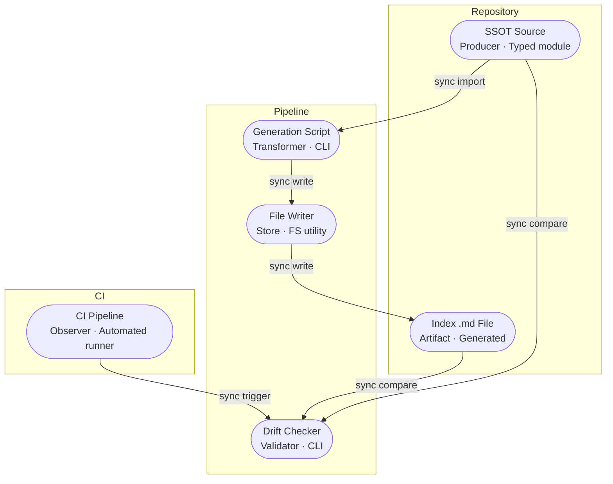

# API Reference Update Guidelines

## Scope & Neutrality Contract

- **Universal**: these guidelines apply to any product, domain, language, or runtime; nothing here assumes a specific company, repository, file path, framework, or vendor.
- **Neutral**: name capabilities and roles by their function, never by a brand. Where a concrete tool is shown, it appears only as a non-binding *reference implementation* and may be swapped for any equivalent.
- **Agnostic**: generation logic and index contracts are derived from SSOT source structure and parsed schema only — never from provider names, file paths, or project-specific conventions. Examples use placeholders (`[...]`) rather than real identifiers.
- **Modular**: each `##` section is self-contained and addressable by its heading anchor (see Module Index). Sections may be lifted into another guideline set without rewriting their internals.

## Module Index

- `scope--neutrality-contract` — universality, neutrality, agnosticism, modularity rules
- `overview` — what API reference update guidelines govern and the ruling standards
- `directive-grammar-cid` — Context/Intent/Directive grammar and sorting
- `from-0-to-1-index-regeneration-process` — phase-gated authoring process
- `flow-patterns` — data flow, workflow flow, topology for index generation pipeline
- `ssot-source-authoring-contract` — row schema, field requirements, and SSOT rules
- `generation-pipeline-contract` — CLI script contract, determinism, and provider-agnostic rules
- `drift-detection-contract` — check mode, CI integration, and exit code semantics
- `table-schema-contract` — output table column definitions and inference rules
- `adding-a-new-provider` — step-by-step process for extending generation coverage
- `cid-directive-matrix` — alphabetical, project-agnostic directives
- `anti-pattern-guards` — prohibited patterns and their corrections
- `validation-checklist` — pre-generation, post-generation, and pre-commit gates
- `role-action-outcome` — role-to-deliverable mapping

---

## Overview

**API reference index generation**: regenerate index files from a typed SSOT source to preserve single-source-of-truth accuracy; forbid manual edits to generated artifacts; enable drift detection via check mode; maintain provider-agnostic generation contracts.

**Governing standards**: typed source is the authoritative SSOT; index files are generated artifacts; the generation script produces deterministic output; drift detection prevents stale documentation; provider-specific logic lives in SSOT source rows, not in the generation pipeline.

**SSOT principle**: the typed source file (e.g., a TypeScript module, a YAML schema, or a JSON manifest) is the single authoritative definition of API parameter metadata. Any downstream artifact — markdown tables, rendered docs, validation schemas — is derived from it and must never diverge. When the source changes, all derived artifacts are regenerated atomically.

---

## Directive Grammar (CID)

Every directive in this guideline set is expressed with a uniform, project-agnostic grammar so it can be lifted into any context unchanged.

### Definition
- **Context**: focus domain of concern
- **Intent**: desired principle or guiding goal
- **Directive**: explicit prohibition or required safeguard

### Sorting
Each entry is organized alphabetically (A→Z) for clarity and neutrality.

---

## From 0 to 1: Index Regeneration Process

A sequential, phase-gated process for keeping API reference index files synchronized with typed SSOT source.

### Phase 0 — Source Authoring
**Before regenerating, ensure SSOT source rows are correct.**

1. Add, remove, or update rows in the typed SSOT source file
2. Each row must include the fields defined in the SSOT Source Authoring Contract (see below)
3. Verify row fields reflect current runtime behavior: defaults, ranges, constraints
4. Run existing tests to confirm no regressions from source changes

**Gate**: proceed only when SSOT source rows are validated and tests pass.

### Phase 1 — Generation
**Run the generation script to regenerate index files from SSOT source.**

1. Run the generate command to regenerate all index files
2. Or run with a filename filter to regenerate a specific file
3. Or run with a provider filter to regenerate by provider name
4. Script reads typed SSOT exports via dynamic import or equivalent mechanism
5. Script writes the index table to the configured output path

**Gate**: generation completes without errors; output files are written.

### Phase 2 — Drift Detection
**Verify generated output matches committed files.**

1. Run the check command to detect drift without modifying files
2. Script compares generated output against existing committed files
3. Exit code 0 = all files up to date; exit code 1 = drift detected
4. Integrate the check command into CI or a pre-push hook

**Gate**: drift check passes before committing generated files.

### Phase 3 — Commit
**Commit both SSOT source changes and regenerated index files together.**

1. Stage both typed source changes and regenerated index files
2. Commit with a message referencing the provider and change scope
3. Push only after drift check passes in CI

**Gate**: both source and generated artifacts are committed atomically.

### Phase 4 — Living Index
**Iterate index and SSOT source together as the API evolves.**

- Apply semantic versioning to every structural change in the table schema
- Update SSOT source and regenerate index whenever API parameters change
- Re-run drift detection for every change; forbid out-of-sync states on the main branch
- Archive superseded schema versions; do not delete
- Flag any provider whose SSOT source has not been validated against actual runtime behavior

---

## Flow Patterns

### Data Flow
**Traces how API parameter metadata moves from typed source to rendered index.**

```
[SSOT Source] → [Generation Script: import + transform] → [Index Table File] → [Committed Artifact]
```

| Stage     | Component            | Input Format        | Output Format    | Persistence    | Error Handling         |
|-----------|----------------------|---------------------|------------------|----------------|------------------------|
| Ingest    | Generation script    | Typed module path   | Row array        | None           | SKIP + log; continue   |
| Transform | Row builder          | Row + column spec   | Table row string | None           | Fallback to defaults   |
| Store     | File writer          | Markdown string     | Index `.md` file | Disk           | Create directory first |
| Serve     | Documentation site   | Index `.md` file    | Rendered table   | Version control | N/A                   |

**Directives**:
- Specify schema at every stage boundary; forbid undocumented format transitions
- Document error handling for every stage; forbid silent failures

### Workflow Flow
**Maps how index regeneration tasks sequence through actors and decisions.**

**Trigger**: SSOT source row changes, new provider integration, or scheduled drift check

**Happy Path**:
1. Author updates typed SSOT source rows
2. Author runs the generate command
3. Script imports SSOT, transforms rows, writes index file
4. Author runs the check command to verify
5. Author commits source and generated file together

**Alternate Paths**:
- Single file: run generate with a filename filter argument
- Single provider: run generate with a provider name argument
- Verbose output: run generate or check with a verbose flag

**Error Paths**:
- Source not found: log `SKIP: source not found`; continue to next provider
- Export not an array: log `SKIP: export is not an array`; continue
- Import failure: log `SKIP: failed to import [path]`; continue
- Drift detected: exit code 1; log `DRIFT: N file(s) differ`

**Postconditions**: all index files in the output directory reflect current SSOT source state.

### Topology
**Structural snapshot of the index generation pipeline components.**

**Version**: 1.0 — initial

| Node | Role | Type | Connects to | Connection type | Data residency |
|------|------|------|-------------|-----------------|----------------|
| SSOT Source | Producer | Typed module | Generation script | Sync import | Repository |
| Generation script | Transformer | CLI process | SSOT Source, File writer | Sync read | None (transient) |
| File writer | Store | File system utility | Disk | Sync write | Disk / repository |
| Index `.md` file | Artifact | Generated file | Documentation site, Drift checker | Read | Repository |
| Drift checker | Validator | CLI process | Index file, SSOT source | Sync compare | None (transient) |
| CI pipeline | Observer | Automated runner | Drift checker | Sync trigger | CI system |



---

## SSOT Source Authoring Contract

Every row in the SSOT source must include the following fields. Field names are placeholders; adapt to your runtime's naming convention.

| Field | Required | Description |
|-------|----------|-------------|
| `key` | Yes | Unique identifier for the parameter or configuration entry |
| `typeLabel` | Yes | Human-readable type label (e.g., `string`, `number`, `boolean`, `json`) |
| `value` | Yes | Default value, constraint description, or required-value marker |
| `responsibility` | Yes | SVO statement describing the key's purpose (Subject verbs Object) |
| `modules` | No | Source module paths where the key is used |
| `classes` | No | Related class names |
| `functions` | No | Related function names |

**Rules**:
- Every row must have a unique `key` within its provider scope
- `responsibility` must be a Subject–Verb–Object statement; forbid free-form descriptions
- `value` must state the default, range, or constraint; forbid empty or `null` value fields without a documented rationale
- `modules`, `classes`, `functions` are optional but must be included when the key is tied to specific source locations
- Forbid duplicating SSOT data in the generation script; all parameter metadata lives in source rows only

---

## Generation Pipeline Contract

### Provider Spec

Each provider maps a typed SSOT source to an output index file via a spec entry. The spec is the only place where source-to-output associations are defined.

| Spec field | Description |
|------------|-------------|
| `provider` | Human-readable provider name (e.g., `[Provider Name]`) |
| `sourcePath` | Path to the typed SSOT source module |
| `outputPath` | Path to the generated index `.md` file |
| `endpointPrefix` | Optional endpoint prefix applied to all rows in this spec |

**Rules**:
- Define one spec entry per provider per output file
- Forbid scattered source-to-output mappings outside the spec configuration
- Forbid provider-specific conditional logic inside the generation script; encode all variance in source rows

### Generation Script Contract

The generation script must:
- Import SSOT source via dynamic import or equivalent; forbid hardcoded file reads
- Transform rows using a single, provider-neutral row builder function
- Write deterministic output: same source rows always produce the same index file
- Log skipped providers with a reason code; never silently discard rows
- Support a `--verbose` flag for detailed per-row logging
- Support a filename or provider name filter argument for targeted regeneration
- Support a `--check` (or equivalent) mode that compares output to committed files without writing

**Rules**:
- Generation output must be deterministic; forbid timestamp, UUID, or random values in generated content
- Forbid hardcoded defaults or type inference outside of SSOT row metadata
- Forbid provider-specific branching inside the row builder; one builder handles all providers
- The check mode must exit with code 0 when no drift exists and code 1 when drift is detected

---

## Drift Detection Contract

Drift detection ensures the committed index files always reflect the current SSOT source state.

**Check mode behaviour**:
- Reads every provider spec
- Generates in-memory output for each spec
- Compares in-memory output to the committed file byte-for-byte (or line-for-line after normalization)
- Reports `DRIFT: N file(s) differ` and exits with code 1 if any file differs
- Reports `OK: all files up to date` and exits with code 0 if all files match

**CI integration rules**:
- Run drift check on every pull request and every push to the main branch
- Block merges when drift check exits with code 1
- Forbid committed index files that were not produced by the generation script

---

## Table Schema Contract

Every generated index file contains a single markdown table. The table schema defines the columns, their sources, and their inference rules. The schema is stable; column additions require a migration note and a version bump.

**Reference column set** *(adapt field names to your runtime; column count and semantics are the contract)*:

| Column | Source | Description |
|--------|--------|-------------|
| `endpoint` | Spec `endpointPrefix` or inferred from `key` | API endpoint path, or `ALL` for global config entries |
| `kind` | Row category tag | `config`, `param`, `proxy`, `runtime`, or equivalent |
| `key` | `row.key` | Parameter or configuration key name |
| `type` | Inferred from `row.typeLabel` | `string`, `number`, `boolean`, `json`, or equivalent |
| `value` | `row.value` | Default value or constraint description |
| `required` | Inferred from `row.value` prefix or tag | `yes` or `no` |
| `direction` | Constant or inferred | `in`, `out`, or `in/out` |
| `actor` | Inferred from key naming convention | Who supplies the value: Operator, Caller, Proxy, or equivalent |
| `seq-note` | Reserved | Reserved for sequence diagram annotations |
| `location` | Inferred or row field | Parameter location: `body`, `header`, `query`, `path` |
| `scope` | Reserved | Reserved for authorization scope annotations |
| `pattern` | Inferred from `row.typeLabel` | `scalar`, `array`, `union`, `map`, or equivalent |
| `key-description` | `row.responsibility` | SVO statement describing the key's purpose |
| `value-description` | `row.value` | Default, range, and impact description |
| `module` | `row.modules` or source file path | Source module paths |
| `class` | `row.classes` | Related class names |
| `function` | `row.functions` | Related function names |

**Rules**:
- All inference rules are applied in the row builder; forbid column-specific special-casing outside it
- Forbid omitting columns; all columns must appear in every generated row, using `—` for empty values
- Column count changes require a version bump in this document and a migration note in the commit message

---

## Adding a New Provider

1. Create the typed SSOT source file with an exported row array conforming to the SSOT Source Authoring Contract
2. Add a spec entry to the generation pipeline's spec configuration array
3. Run the generate command to produce the initial index file
4. Run the check command to verify the generated file matches
5. Commit the SSOT source file, the spec configuration change, and the generated index file atomically

**Checklist**:
- [ ] SSOT source file created; all rows include `key`, `typeLabel`, `value`, `responsibility`
- [ ] Spec entry added: `provider`, `sourcePath`, `outputPath` all populated
- [ ] Generate command runs without `SKIP` or error messages
- [ ] Check command exits with code 0
- [ ] Source, spec, and generated file committed in a single commit

---

## CID Directive Matrix

Each row is a universal, neutral, project-agnostic directive in `Context | Intent | Directive` grammar. Rows are sorted A→Z.

| Context | Intent | Directive |
|---------|--------|-----------|
| Artifacts | Treat index files as generated outputs | - [ ] Regenerate from source; treat index files as artifacts; forbid manual edits to generated files |
| Atomicity | Commit source and generated files together | - [ ] Stage source and generated files in the same commit; forbid split commits |
| Authority | Establish typed source as SSOT | - [ ] Derive all index content from SSOT source; forbid markdown-first changes |
| Automation | Enable script-driven regeneration | - [ ] Use the generation script for all regeneration; forbid manual copy-paste updates |
| Check | Detect drift between source and output | - [ ] Run drift detection before every commit; forbid unchecked stale index files |
| Columns | Maintain stable table schema | - [ ] Preserve column set and order; forbid column additions without a version bump and migration note |
| Commit | Reference provider and scope in message | - [ ] Include provider name and change scope in every commit touching index files |
| Defaults | Infer from SSOT row metadata | - [ ] Derive all defaults from row fields; forbid hardcoded default values in the generation script |
| Determinism | Produce identical output from identical input | - [ ] Generation is deterministic; forbid timestamps, random values, or volatile content in generated output |
| Drift | Prevent stale documentation | - [ ] Integrate drift check into CI; block merges on drift; forbid out-of-sync index files on the main branch |
| Errors | Log and continue on per-provider failures | - [ ] Log `SKIP` with reason code for every skipped provider; forbid silent failure or full-pipeline abort on one bad source |
| Filtering | Support targeted regeneration | - [ ] Allow filename or provider name filter; forbid all-or-nothing-only generation when targeted regeneration is needed |
| Inference | Derive column values from row metadata | - [ ] Apply all inference rules in the row builder; forbid column-specific special-casing outside the builder |
| Modularity | Keep each section independently liftable | - [ ] Each guideline section is self-contained; forbid cross-section coupling or implicit dependencies |
| Neutrality | Keep generation logic provider-agnostic | - [ ] Design provider-neutral pipeline; encode all provider variance in SSOT source rows; forbid provider-specific branching in the script |
| Output | Write deterministic markdown tables | - [ ] Produce stable, reproducible output; forbid non-deterministic generation |
| Provider | Map source to output via spec | - [ ] Define one spec entry per provider per output file; forbid implicit source-output associations |
| Reproducibility | Enable full regeneration from source alone | - [ ] Any contributor with SSOT source and the script must be able to reproduce every index file; forbid hidden state |
| Responsibility | Document every key with an SVO statement | - [ ] Every SSOT row `responsibility` field is an SVO statement; forbid free-form or ambiguous key descriptions |
| Rows | Transform SSOT rows uniformly | - [ ] One row builder handles all providers; forbid field-specific special cases in transformation logic |
| Schema | Version table schema changes | - [ ] Apply a version bump and migration note for every column addition or removal; forbid silent schema changes |
| Source | Read from typed SSOT exports only | - [ ] Import named exports; forbid duplicating parameter data in the script or in index files directly |
| Spec | Define source-to-output mapping explicitly | - [ ] Configure all mappings in the spec array; forbid scattered or implicit mapping logic |
| Traceability | Link index rows to SSOT source | - [ ] Every index row must be traceable to a SSOT source row; forbid rows with no source origin |
| Validation | Gate generation on source tests | - [ ] Run existing tests before generation; forbid generation after failing tests |
| Versioning | Stamp schema changes with version notes | - [ ] Version-stamp every structural schema change; archive prior schemas; forbid in-place overwrites without a version note |

---

## Anti-Pattern Guards

**Source and artifacts**:
❌ Manual edits to generated index files
→ ✅ Regenerate from SSOT source via the generation script; treat index files as build artifacts

❌ Split commits — source changed without generated file, or vice versa
→ ✅ Stage and commit SSOT source changes and generated index files atomically

❌ Markdown-first changes — editing the index file to update documentation
→ ✅ Update the SSOT source row; regenerate; commit both together

**Generation script**:
❌ Hardcoded default values or type inference outside SSOT row metadata
→ ✅ Derive all defaults and types from row fields; keep the script metadata-driven

❌ Provider-specific conditional logic inside the row builder
→ ✅ Encode all provider variance in SSOT source rows; one builder handles all providers

❌ Non-deterministic output (timestamps, random IDs, volatile content)
→ ✅ Generation is purely a function of SSOT source rows; same input always produces same output

❌ Silent failure or full-pipeline abort when one source file is missing or malformed
→ ✅ Log `SKIP: [reason]` per provider; continue to remaining providers

**Drift and CI**:
❌ Skipping drift check before pushing to the main branch
→ ✅ Integrate the check command into CI; block merges on drift (exit code 1)

❌ Committed index files not produced by the generation script
→ ✅ CI verifies every committed index file was generated from its SSOT source

**Schema**:
❌ Column additions or removals without a version bump or migration note
→ ✅ Apply a version bump to the table schema contract; include a migration note in the commit message

❌ Rows with empty or undocumented `responsibility` fields
→ ✅ Every row must have an SVO responsibility statement; forbid vague or free-form descriptions

---

## Validation Checklist

### Pre-Generation (Required)

- [ ] SSOT source rows are updated and all required fields are populated
- [ ] `responsibility` fields are SVO statements; no free-form descriptions
- [ ] Existing tests pass with source changes
- [ ] No manually edited index files pending in the working directory

### Post-Generation (Required)

- [ ] Check command exits with code 0 (no drift)
- [ ] Generated table columns match the table schema contract
- [ ] Row count in generated file matches SSOT source export length
- [ ] No `SKIP` or error messages in generation output
- [ ] Output is deterministic: running generate twice produces identical files

### Pre-Commit (Required)

- [ ] Both SSOT source and generated index files are staged
- [ ] Commit message references the provider name and change scope
- [ ] CI drift check passes (exit code 0)
- [ ] Schema version bumped if any column was added, removed, or renamed

---

## Role—Action—Outcome

**SSOT Author**
→ Action: adds, removes, or updates typed source rows with accurate parameter metadata; ensures every row has `key`, `typeLabel`, `value`, and an SVO `responsibility`
→ Outcome: produces authoritative API parameter definitions that the generation script can transform deterministically

**Generation Script Operator**
→ Action: runs the generate command; inspects SKIP logs; runs the check command to verify
→ Outcome: produces or validates markdown index files; keeps documentation synchronized with source

**Provider Integration Author**
→ Action: creates a new SSOT source file; adds a spec entry to the generation configuration; runs generate and check; commits atomically
→ Outcome: extends generation coverage to new providers while keeping the pipeline provider-agnostic

**CI Pipeline**
→ Action: runs the drift check on every push and pull request; blocks merges on exit code 1
→ Outcome: prevents documentation drift from reaching the main branch; enforces source-artifact synchronization

**Schema Steward**
→ Action: manages the table schema contract; applies version bumps for column changes; archives prior schema versions; documents migration notes
→ Outcome: ensures stable, traceable schema evolution without breaking downstream consumers of index files
