## Simplified High-Level Flow (Executive Summary View)

```mermaid
graph LR
    subgraph Input["📥 Input"]
        RawData[(Raw Data<br/>SQLite DB)]
        Configs[⚙️ Configs<br/>YAML]
    end
    
    subgraph DataPrep["🔧 Data Preparation"]
        Load[Load & Validate]
        EDA[Exploratory Analysis]
        Engineer[Feature Engineering]
        Load -->|validates| EDA
        EDA -->|informs| Engineer
    end
    
    subgraph Modeling["🤖 Modeling"]
        Train[Train Models]
        Evaluate[Evaluate & Select]
        Tune[Hyperparameter Tuning]
        Train -->|compares| Evaluate
        Evaluate -->|optimizes| Tune
    end
    
    subgraph Production["🚀 Production"]
        Pipeline[Production Pipeline]
        Deploy[Deploy Scripts]
        Monitor[Monitor & Document]
        Pipeline -->|automates| Deploy
        Deploy -->|tracks| Monitor
    end
    
    RawData -->|feeds| Load
    Configs -->|configures| Load
    Engineer -->|transforms| Train
    Tune -->|produces| Pipeline
    Monitor -->|generates| Docs[📄 Documentation<br/>& Artifacts]
    
    classDef inputStyle fill:#e3f2fd,stroke:#1976d2,stroke-width:3px
    classDef prepStyle fill:#fff3e0,stroke:#f57c00,stroke-width:3px
    classDef modelStyle fill:#fce4ec,stroke:#c2185b,stroke-width:3px
    classDef prodStyle fill:#e8f5e9,stroke:#388e3c,stroke-width:3px
    classDef outputStyle fill:#f3e5f5,stroke:#7b1fa2,stroke-width:3px
    
    class RawData,Configs inputStyle
    class Load,EDA,Engineer prepStyle
    class Train,Evaluate,Tune modelStyle
    class Pipeline,Deploy,Monitor prodStyle
    class Docs outputStyle
```



---

## Data Flow by Object Type


---

## Decision Tree (Critical Thresholds & Logic)

```mermaid
graph TD
    Start([Start: Load Data])
    
    Start --> CheckDB{DB file<br/>exists?}
    CheckDB -->|No| Error1[❌ DataQualityError:<br/>File not found]
    CheckDB -->|Yes| LoadDB[Load from SQLite]
    
    LoadDB --> CheckRows{Row count<br/>>= 1000?}
    CheckRows -->|No| Error2[❌ DataQualityError:<br/>Insufficient data]
    CheckRows -->|Yes| CheckSchema{Schema<br/>valid?}
    
    CheckSchema -->|No| Error3[❌ DataQualityError:<br/>Schema mismatch]
    CheckSchema -->|Yes| CheckNulls{Null %<br/>> 10%?}
    
    CheckNulls -->|Yes| Warn1[⚠️ High missing:<br/>Advanced imputation]
    CheckNulls -->|No| CheckImbalance{Class imbalance<br/>< 10%?}
    Warn1 --> CheckImbalance
    
    CheckImbalance -->|Yes| Strategy1[Use SMOTE<br/>+ Class Weights]
    CheckImbalance -->|No| CheckModerate{Imbalance<br/>10-30%?}
    
    CheckModerate -->|Yes| Strategy2[Use Stratification<br/>+ Class Weights]
    CheckModerate -->|No| Strategy3[Use Stratification<br/>Only]
    
    Strategy1 --> Preprocess[Preprocessing Pipeline]
    Strategy2 --> Preprocess
    Strategy3 --> Preprocess
    
    Preprocess --> CheckSkew{|Skewness|<br/>> 1?}
    CheckSkew -->|Yes| Transform[Apply Log/Sqrt<br/>Transform]
    CheckSkew -->|No| CheckCorr{Correlation<br/>> 0.7?}
    Transform --> CheckCorr
    
    CheckCorr -->|Yes| RemoveCorr[Remove Redundant<br/>Features]
    CheckCorr -->|No| Train[Train Models]
    RemoveCorr --> Train
    
    Train --> CheckCV{CV score<br/>> Baseline?}
    CheckCV -->|No| Error4[❌ Model worse<br/>than baseline]
    CheckCV -->|Yes| CheckOverfit{CV - Test<br/>> 10%?}
    
    CheckOverfit -->|Yes| Warn2[⚠️ Overfitting:<br/>Regularize]
    CheckOverfit -->|No| CheckF1{Test F1<br/>> 0.7?}
    Warn2 --> CheckF1
    
    CheckF1 -->|No| Warn3[⚠️ Poor performance:<br/>Revisit features]
    CheckF1 -->|Yes| Deploy[✅ Deploy Model]
    
    classDef errorStyle fill:#ffebee,stroke:#c62828,stroke-width:3px
    classDef warnStyle fill:#fff3e0,stroke:#f57c00,stroke-width:2px
    classDef successStyle fill:#e8f5e9,stroke:#2e7d32,stroke-width:3px
    classDef decisionStyle fill:#e1f5ff,stroke:#0277bd,stroke-width:2px
    classDef processStyle fill:#f3e5f5,stroke:#6a1b9a,stroke-width:2px
    
    class Error1,Error2,Error3,Error4 errorStyle
    class Warn1,Warn2,Warn3 warnStyle
    class Deploy successStyle
    class CheckDB,CheckRows,CheckSchema,CheckNulls,CheckImbalance,CheckModerate,CheckSkew,CheckCorr,CheckCV,CheckOverfit,CheckF1 decisionStyle
    class LoadDB,Preprocess,Transform,RemoveCorr,Train,Strategy1,Strategy2,Strategy3 processStyle
```

---

# EDA-MLP Detailed Implementation LOD Steps

**Version**: 1.0  
**Companion to**: eda-mlp-detailed-implementation-steps.md  
**Purpose**: Unified End-to-End Data Flow + Decision Logic by Phase

---

## Phase 0: Setup & Data Acquisition - LOD Steps

| LOD Step | Module | Class/Object | Function/Method | Dependency | Input | Output | Purpose (S‑V‑O) | Decision Logic / Thresholds | Excellent Real-world Application | FAQ |
|----------|--------|--------------|-----------------|------------|-------|--------|-----------------|---------------------------|----------------------------------|-----|
| **0.1.0.1** | src/data_loader.py | DataLoader | load_from_sqlite() | sqlite3 | db_path: str | conn: sqlite3.Connection | **DataLoader connects to SQLite database** | Raise DataQualityError if sqlite3.Error occurs | Used in data warehouse ETL pipelines to validate source DB availability before extraction | Q: What if DB file doesn't exist? A: sqlite3.Error caught, wrapped in DataQualityError with clear message |
| **0.1.0.2** | src/data_loader.py | DataLoader | load_from_sqlite() | sqlite3.cursor | conn: Connection | table_name: str | **DataLoader detects table name from sqlite_master** | Raise DataQualityError if len(tables)==0; Use first table if multiple found | Standard practice in DB introspection tools and ORMs like SQLAlchemy | Q: What if multiple tables? A: Uses first table; production systems should make this configurable |
| **0.1.0.3** | src/data_loader.py | DataLoader | load_from_sqlite() | pd.read_sql | table_name, conn | df: pd.DataFrame | **DataLoader loads all rows into DataFrame** | No threshold; loads entire table | Batch data loading in ML pipelines; for large tables, use chunking or sampling | Q: Memory issues with large tables? A: Consider pd.read_sql_query with LIMIT or chunking |
| **0.2.0.1** | src/data_loader.py | DataLoader | _validate_schema() | None | df: DataFrame, config | validation_report: dict | **DataLoader validates column count matches expected** | EXPECTED_COLUMNS = 47; Error if df.columns != 47 | Schema validation in data contracts (Great Expectations, Pandera) | Q: Why exactly 47? A: 46 features + 1 target; ensures data hasn't been corrupted or modified |
| **0.2.0.2** | src/data_loader.py | DataLoader | _validate_schema() | None | df: DataFrame, EXPECTED_SCHEMA | errors: List[str] | **DataLoader validates each column exists and has correct dtype** | For each col in EXPECTED_SCHEMA: check col in df.columns and dtype match (with int64/float64 compatibility) | Data quality checks in production ML serving to catch schema drift | Q: Why allow int64/float64 compatibility? A: Pandas type inference varies; both represent numeric data safely |
| **0.3.0.1** | src/data_loader.py | DataLoader | _check_row_count() | np.sqrt | df: DataFrame | None (prints messages) | **DataLoader validates minimum sample size for reliable splits** | MIN_ROWS = 1000; Raise DataQualityError if len(df) < 1000 | Sample size determination in clinical trials and AB testing platforms | Q: Why 1000 minimum? A: For 70/15/15 split → 150 test samples; need ~67 phishing samples for CI < 5% |
| **0.3.0.2** | src/data_loader.py | DataLoader | _check_row_count() | np.sqrt | n_test_phishing: int | ci_width: float | **DataLoader calculates confidence interval width for recall estimate** | Assumes p=0.70, test_size=0.15; ci_width = 1.96 * sqrt(p*(1-p)/n); Warn if ci_width > 0.05 | Power analysis in experimental design tools like G*Power | Q: Why assume p=0.70? A: Conservative estimate of model recall; real value unknown before training |
| **0.4.0.1** | src/data_loader.py | DataLoader | _parse_target_variable() | None | df: DataFrame | None (prints messages) | **DataLoader validates target encoding is exactly {0, 1}** | unique_labels must equal {0, 1}; Raise DataQualityError otherwise | Label validation in multi-class classifiers to catch encoding errors | Q: What if labels are {-1, 1}? A: DataQualityError raised; must be {0, 1} for consistency with sklearn binary classifiers |
| **0.4.0.2** | src/data_loader.py | DataLoader | _parse_target_variable() | None | df['label']: Series | class_distribution: dict | **DataLoader computes class distribution for stratification planning** | Calculates value_counts and percentages; No threshold | Class imbalance detection in fraud detection, medical diagnosis systems | Q: What's the purpose? A: Informs sampling strategy (SMOTE vs stratification) and class_weight settings |
| **0.4.0.3** | src/data_loader.py | DataLoader | _parse_target_variable() | None | class_props: Series | imbalance_assessment: str | **DataLoader assesses severity of class imbalance** | min_prop < 0.10 → SEVERE; < 0.30 → MODERATE; ≥ 0.30 → MILD | Imbalance handling in credit scoring, anomaly detection (where minority class is critical) | Q: Why these thresholds? A: Industry standard; <10% requires SMOTE, 10-30% needs class weights, >30% is manageable with stratification |
| **0.5.0.1** | requirements.txt | N/A | N/A | pip | Package names + versions | Installed packages in venv | **requirements.txt specifies exact dependency versions for reproducibility** | Pinned versions (e.g., pandas==2.0.3) ensure deterministic builds | Docker images, CI/CD pipelines pin versions to prevent "works on my machine" issues | Q: Why pin versions? A: API changes between versions can break code; pinning ensures reproducible environments |
| **0.5.0.2** | run.sh | N/A | Bash script | VIRTUAL_ENV | Environment variables | Exit code 0/1 | **run.sh validates virtual environment is activated before running** | Check if VIRTUAL_ENV is set; exit 1 if not | Deployment scripts in production ML systems check env before executing | Q: Why check venv? A: Prevents installing packages globally or using wrong Python version |
| **0.5.0.3** | run.sh | N/A | Bash script | test -f | data/phishing.db path | Exit code 0/1 | **run.sh validates database file exists before processing** | Exit 1 if [ ! -f "data/phishing.db" ] | Pre-flight checks in ETL jobs and data pipelines | Q: What if file is corrupted? A: run.sh only checks existence; DataLoader validates it's valid SQLite |

---

## Phase 1: Environment Setup & Configuration - LOD Steps

| LOD Step | Module | Class/Object | Function/Method | Dependency | Input | Output | Purpose (S‑V‑O) | Decision Logic / Thresholds | Excellent Real-world Application | FAQ |
|----------|--------|--------------|-----------------|------------|-------|--------|-----------------|---------------------------|----------------------------------|-----|
| **1.1.1.1** | .gitignore | N/A | Git | git add | File patterns | Exclusion rules | **.gitignore prevents data/ and models/ from being committed to git** | Patterns: data/, models/, *.pkl, *.db → excluded from tracking | Prevents large files in git repos (GitHub has 100MB file limit) | Q: Why ignore data/? A: Data files are large (52MB), should be versioned separately (DVC, S3) |
| **1.1.2.1** | src/utils/config_loader.py | N/A | load_config() | yaml.safe_load | config_path: str | config: dict | **config_loader loads YAML configuration into dictionary** | Raise FileNotFoundError if path doesn't exist; yaml.YAMLError if invalid YAML | Used in microservices (Kubernetes ConfigMaps), Flask/Django settings | Q: Why YAML over JSON? A: YAML supports comments, more human-readable for configs |
| **1.1.2.2** | src/utils/config_loader.py | N/A | save_config() | yaml.dump | config: dict, path: str | None (writes file) | **config_loader saves configuration dictionary to YAML file** | Creates parent dirs if needed (mkdir parents=True) | Saving experiment configs in MLflow, Weights & Biases experiment tracking | Q: When to use? A: After hyperparameter tuning, save best config for reproducibility |
| **1.1.3.1** | src/utils/logger.py | N/A | setup_logger() | logging | name, level, log_file | logger: Logger | **logger.py creates configured logger with file and console handlers** | Default level=INFO; Creates log file parent dirs if needed | Centralized logging in production ML systems (e.g., AWS CloudWatch, Datadog) | Q: Why both file and console? A: Console for dev debugging, file for production audit trails |
| **1.2.1.1** | venv | N/A | python -m venv | venv module | venv_path: str | venv directory | **venv creates isolated Python environment** | No threshold; creates fresh environment | Dependency isolation in Docker containers, Lambda functions | Q: venv vs conda? A: venv is built-in, lighter; conda better for non-Python deps (CUDA, MKL) |
| **1.2.2.1** | requirements.txt | N/A | pip install -r | pip | requirements.txt | Installed packages | **pip installs all dependencies from requirements.txt** | Fails if version conflicts; recommend pip ≥ 21.0 for improved resolver | CI/CD pipelines install deps in clean environments for testing | Q: What if install fails? A: Check pip version, try --upgrade pip, resolve version conflicts |
| **1.3.1.1** | config/data_config.yaml | N/A | YAML file | None | Manual editing | data_config: dict | **data_config.yaml defines data sources and loading parameters** | Required keys: data_sources, loading, schema, validation | Config-driven ML systems (e.g., Airflow DAGs, Kubeflow pipelines) use YAML for declarative data flows | Q: Why separate config? A: Change data source without code changes; easier A/B testing |
| **1.3.2.1** | config/model_config.yaml | N/A | YAML file | None | Manual editing | model_config: dict | **model_config.yaml specifies model type and hyperparameters** | Required keys: model.type, model.params, training, metrics | Experiment tracking systems (MLflow) store configs as YAML artifacts | Q: Why not hardcode? A: Enables hyperparameter tuning without code changes |
| **1.3.3.1** | config/preprocessing_config.yaml | N/A | YAML file | None | Manual editing | preprocessing_config: dict | **preprocessing_config.yaml defines feature engineering pipeline steps** | Keys: imputation, scaling, encoding, feature_engineering | Feature stores (Feast, Tecton) use configs to define transformations | Q: Order matters? A: Yes! imputation → engineering → encoding → scaling |

---

## Phase 2: Data Loading & Initial Validation - LOD Steps

| LOD Step | Module | Class/Object | Function/Method | Dependency | Input | Output | Purpose (S‑V‑O) | Decision Logic / Thresholds | Excellent Real-world Application | FAQ |
|----------|--------|--------------|-----------------|------------|-------|--------|-----------------|---------------------------|----------------------------------|-----|
| **2.1.1.1** | src/data/data_loader.py | N/A | detect_file_format() | pathlib.Path | file_path: str | format: str | **detect_file_format infers file type from extension** | Maps {.csv, .parquet, .xlsx, .json, ...} to format strings; Raise ValueError if unsupported | Auto-detection in data catalogs (AWS Glue, Azure Data Catalog) | Q: What about .csv.gz? A: Strips compression extensions (.gz, .bz2) first, then detects .csv |
| **2.1.2.1** | src/data/data_loader.py | N/A | load_data() | detect_file_format() | config: dict, split: str | df: DataFrame | **load_data routes to correct loader based on file format** | Uses loader dispatch: {csv: load_csv, parquet: load_parquet, ...} | Universal data loading in Spark, Dask (supports multiple formats) | Q: Why dispatch pattern? A: Extensible; add new formats without modifying core logic |
| **2.1.3.1** | src/data/data_loader.py | N/A | load_csv() | pd.read_csv | file_path, kwargs | df: DataFrame | **load_csv loads CSV with configurable parameters** | Defaults: sep=',', encoding='utf-8', compression='infer' | CSV loading in ETL tools (Talend, Informatica) with similar defaults | Q: What if wrong delimiter? A: Override with sep='\t' in config; consider pd.read_csv(sep=None) for auto-detection |
| **2.2.1.1** | src/data/data_validator.py | N/A | validate_schema() | None | df, config | result: dict | **validate_schema checks columns match expected schema** | Error if missing expected columns; Warn if extra columns found | Schema validation in data pipelines (Great Expectations, Pandera) | Q: Why warn vs error for extra? A: Extra cols don't break processing; missing cols do |
| **2.2.1.2** | src/data/data_validator.py | N/A | _dtypes_compatible() | None | actual, expected | is_compatible: bool | **_dtypes_compatible allows flexible dtype matching** | Treats int64/int32/int16/int8 as compatible; float64/float32 as compatible | Type coercion in Pandas, Spark (e.g., int32 → int64 is safe upcast) | Q: Why allow int/float mixing? A: Pandas infers types differently; both are numeric and safe for ML |
| **2.2.2.1** | src/data/data_validator.py | N/A | check_null_values() | df.isnull() | df, config | result: dict | **check_null_values calculates null percentages and compares to threshold** | max_null_percentage from config (default 0.1 = 10%); Error if exceeded | Data quality monitoring in data warehouses (dbt tests, Soda) | Q: What threshold to use? A: Domain-specific; financial data <1%, survey data ~10-20% acceptable |
| **2.2.3.1** | src/data/data_validator.py | N/A | check_duplicates() | df.duplicated() | df, config | result: dict | **check_duplicates identifies duplicate rows based on key columns** | max_duplicates from config (default 0); Error if exceeded | Deduplication in CRM systems, transaction processing | Q: All columns vs key columns? A: Key columns (like user_id) more meaningful; config specifies which |
| **2.2.4.1** | src/data/data_validator.py | N/A | validate_ranges() | df comparison | df, config | result: dict | **validate_ranges checks numeric columns are within expected bounds** | For each col: count values < min or > max; Warn if violations found | Range validation in IoT sensor data (temperature, pressure within physical limits) | Q: Why warn not error? A: Outliers may be legitimate; require investigation, not auto-rejection |
| **2.2.5.1** | src/data/data_validator.py | N/A | validate_categorical_values() | set operations | df, config | result: dict | **validate_categorical_values checks categorical columns contain expected values** | Expected values from config; Warn if unexpected values found | Categorical validation in surveys, dropdown selections (USA states, ISO countries) | Q: Missing expected values? A: Warn; may indicate data collection issue or rare category not in sample |

---

## Phase 3: Exploratory Data Analysis - LOD Steps

| LOD Step | Module | Class/Object | Function/Method | Dependency | Input | Output | Purpose (S‑V‑O) | Decision Logic / Thresholds | Excellent Real-world Application | FAQ |
|----------|--------|--------------|-----------------|------------|-------|--------|-----------------|---------------------------|----------------------------------|-----|
| **3.1.1.1** | notebooks/02_eda_univariate.ipynb | N/A | df.hist() | matplotlib | df, bins=50 | histogram plots | **Histogram visualizes distribution of numeric features** | bins=50 balances detail vs noise; Adjust based on data range | Distribution analysis in finance (stock returns), healthcare (patient metrics) | Q: How many bins? A: Rule of thumb: sqrt(n) or Sturges' rule; 50 works for n=1000-100000 |
| **3.1.1.2** | notebooks/02_eda_univariate.ipynb | N/A | df.boxplot() | matplotlib | df, column | box plot | **Boxplot identifies outliers using IQR method** | Outliers: Q1 - 1.5×IQR or Q3 + 1.5×IQR | Outlier detection in quality control (manufacturing defects), network monitoring | Q: Why 1.5×IQR? A: Tukey's convention; captures ~99.3% of normal distribution |
| **3.1.2.1** | notebooks/02_eda_univariate.ipynb | N/A | df.skew() | scipy.stats | df column | skewness: float | **Skewness quantifies asymmetry of distribution** | \|skew\| < 0.5: symmetric; 0.5-1: moderate; >1: highly skewed | Identifying transformation needs in regression (log-transform income, prices) | Q: What's acceptable? A: For linear models, aim \|skew\| < 1; tree models are robust to skew |
| **3.1.3.1** | notebooks/02_eda_univariate.ipynb | N/A | df.value_counts() | pandas | df column | counts: Series | **value_counts tabulates frequency of categorical values** | No threshold; shows all unique values | Category frequency analysis in e-commerce (product views), web analytics (page visits) | Q: Too many categories? A: Show top 20, group rest as "Other"; indicates high cardinality issue |
| **3.1.4.1** | notebooks/02_eda_univariate.ipynb | N/A | detect_outliers_iqr() | np.quantile | df, column | outlier_info: dict | **detect_outliers_iqr identifies outliers using interquartile range** | lower = Q1 - 1.5×IQR; upper = Q3 + 1.5×IQR | Fraud detection (transaction amounts), network security (packet sizes) | Q: IQR vs z-score? A: IQR robust to non-normal data; z-score assumes normality |
| **3.2.1.1** | notebooks/02_eda_univariate.ipynb | N/A | df.corr() | pandas | df | correlation_matrix: DataFrame | **df.corr calculates pairwise Pearson correlation** | Returns correlation coefficients r ∈ [-1, 1] | Feature selection in ML (remove highly correlated features to reduce multicollinearity) | Q: Pearson vs Spearman? A: Pearson for linear relationships; Spearman for monotonic non-linear |
| **3.2.1.2** | notebooks/02_eda_univariate.ipynb | N/A | threshold filtering | None | correlation_matrix | high_corr_pairs: list | **Threshold filtering identifies highly correlated feature pairs** | \|r\| > 0.7 indicates strong correlation; >0.9 suggests redundancy | VIF (Variance Inflation Factor) calculation in econometrics, regression diagnostics | Q: Why 0.7? A: Common threshold; >0.7 risks multicollinearity in linear models |
| **3.2.2.1** | notebooks/02_eda_univariate.ipynb | N/A | sns.heatmap() | seaborn | correlation_matrix | heatmap plot | **Heatmap visualizes correlation matrix with color encoding** | Uses diverging colormap (coolwarm); mask upper triangle to avoid redundancy | Correlation analysis in finance (asset correlations), genomics (gene expression) | Q: Why mask upper triangle? A: Matrix is symmetric; showing both halves is redundant |
| **3.2.3.1** | notebooks/02_eda_univariate.ipynb | N/A | df.boxplot(by=target) | matplotlib | df, target column | box plots | **Boxplot by target compares feature distributions across classes** | Separate box per class; visualizes class separation | A/B testing (metric comparison between variants), clinical trials (treatment vs control) | Q: How to interpret? A: Non-overlapping boxes → good class separation; large overlap → weak predictor |
| **3.2.4.1** | notebooks/02_eda_univariate.ipynb | N/A | pd.crosstab() | pandas | cat_feature, target | crosstab: DataFrame | **Crosstab creates contingency table for categorical vs target** | normalize='index' for row percentages (% within each category) | Market research (product preference by demographic), medical (disease by risk factor) | Q: Row vs column normalization? A: Row (normalize='index') shows "of people in category X, Y% have target=1" |
| **3.2.5.1** | notebooks/02_eda_univariate.ipynb | N/A | chi2_contingency() | scipy.stats | crosstab | chi2, p_value | **Chi-square test assesses independence of categorical variables** | p < 0.05 → reject independence; variables are associated | Association testing in epidemiology (smoking vs lung cancer), social science (education vs income) | Q: What does p-value mean? A: Probability of observed association if variables were truly independent |
| **3.3.1.1** | notebooks/02_eda_univariate.ipynb | PCA | fit_transform() | sklearn | X_scaled | pca_components | **PCA reduces dimensionality while preserving variance** | n_components chosen to retain 95% variance | Dimensionality reduction in image processing, genomics (gene expression data) | Q: How many components? A: Use scree plot; keep components until cumulative variance ≥ 95% |
| **3.3.2.1** | notebooks/02_eda_univariate.ipynb | KMeans | fit_predict() | sklearn | X_scaled, k | cluster_labels | **KMeans groups data into k clusters** | k chosen by elbow method or silhouette score | Customer segmentation in marketing, anomaly detection (normal vs abnormal clusters) | Q: How to choose k? A: Elbow method (diminishing returns in inertia); silhouette score (cluster quality) |
| **3.4.1.1** | notebooks/02_eda_univariate.ipynb | N/A | seasonal_decompose() | statsmodels | time_series | decomposition | **Seasonal decomposition separates trend, seasonal, and residual components** | Requires period parameter (e.g., 12 for monthly seasonality) | Sales forecasting (identify trends + seasonality), web traffic analysis | Q: Additive vs multiplicative? A: Additive if seasonal variation constant; multiplicative if proportional to level |

---

## Phase 4: Feature Engineering & Preprocessing - LOD Steps

| LOD Step | Module | Class/Object | Function/Method | Dependency | Input | Output | Purpose (S‑V‑O) | Decision Logic / Thresholds | Excellent Real-world Application | FAQ |
|----------|--------|--------------|-----------------|------------|-------|--------|-----------------|---------------------------|----------------------------------|-----|
| **4.1.1.1** | src/preprocessing/base.py | BaseTransformer | fit() | sklearn API | X, y | self | **BaseTransformer.fit learns parameters from training data** | Sets is_fitted_ = True; Subclasses override to learn actual parameters | Transformer API in sklearn pipelines (StandardScaler, OneHotEncoder) | Q: Why separate fit/transform? A: Learn parameters on train, apply same to test (prevents data leakage) |
| **4.1.1.2** | src/preprocessing/base.py | BaseTransformer | transform() | None | X | X_transformed | **BaseTransformer.transform applies learned transformation** | Raises RuntimeError if not fitted; Subclasses implement actual transformation | Consistent API in sklearn (all transformers have fit/transform) | Q: What if transform called before fit? A: RuntimeError prevents accidental data leakage |
| **4.2.1.1** | src/preprocessing/preprocessor.py | MissingValueImputer | fit() | df.mean/median/mode | X | self | **MissingValueImputer learns fill values for each column** | Numeric: median (default) or mean; Categorical: mode | Imputation in production ML (e.g., missing sensor readings, incomplete forms) | Q: Why median over mean? A: Median robust to outliers; mean sensitive to extreme values |
| **4.2.1.2** | src/preprocessing/preprocessor.py | MissingValueImputer | transform() | df.fillna() | X | X_imputed | **MissingValueImputer fills missing values with learned fill values** | Creates missing indicators if add_missing_indicator=True | Missing data handling in healthcare (patient records), finance (credit scores) | Q: Why missing indicators? A: Missingness may be informative (e.g., "income not disclosed" predicts default) |
| **4.3.1.1** | src/preprocessing/preprocessor.py | FeatureScaler | fit() | StandardScaler | X | self | **FeatureScaler learns scaling parameters (mean, std)** | Stores scaler per feature; supports standard, minmax, robust methods | Feature scaling in neural networks (gradient descent), SVM (distance-based) | Q: When to scale? A: Always for distance-based models (KNN, SVM); neural nets; not needed for trees |
| **4.3.1.2** | src/preprocessing/preprocessor.py | FeatureScaler | transform() | scaler.transform() | X | X_scaled | **FeatureScaler applies learned scaling to data** | Uses stored mean/std from fit(); Separate scaler per feature | Real-time inference (scale new inputs using train statistics) | Q: Why per-feature scalers? A: Different features have different ranges; global scaling loses information |
| **4.4.1.1** | src/preprocessing/preprocessor.py | CategoricalEncoder | fit() | OneHotEncoder | X, y | self | **CategoricalEncoder learns category mappings** | OneHot: Creates binary columns per category; Target: Calculates mean target per category | Encoding in production systems (user country → one-hot), high-cardinality (user_id → target encoding) | Q: OneHot vs Target encoding? A: OneHot for low cardinality (<10); Target for high (>20) |
| **4.4.1.2** | src/preprocessing/preprocessor.py | CategoricalEncoder | transform() | encoder.transform() | X | X_encoded | **CategoricalEncoder applies learned encodings** | Handles unknown categories (ignore or error based on config) | Real-time encoding (new user visits → map country to existing one-hot columns) | Q: Unknown categories? A: OneHot set handle_unknown='ignore' (all zeros); Target use global mean |
| **4.5.1.1** | src/preprocessing/preprocessor.py | FeatureEngineer | fit() | PolynomialFeatures | X | self | **FeatureEngineer learns polynomial feature combinations** | degree=2 (default); interaction_only=True (no x^2, only x*y) | Interaction terms in regression (age×income), recommendation systems (user×item) | Q: Why interaction_only? A: x^2 less informative than x×y; reduces dimensionality |
| **4.5.1.2** | src/preprocessing/preprocessor.py | FeatureEngineer | transform() | np.log1p, sqrt | X | X_engineered | **FeatureEngineer creates transformed and interaction features** | Log: np.log1p (handles 0); Sqrt: np.sqrt(max(0, x)) | Log-transform in finance (returns), sales forecasting (stabilize variance) | Q: Why log1p not log? A: log1p(x) = log(1+x); handles x=0 without error |
| **4.6.1.1** | src/preprocessing/pipeline.py | PreprocessingPipeline | _build_pipeline() | sklearn.Pipeline | config | pipeline | **PreprocessingPipeline assembles transformers in correct order** | Order: imputation → engineering → encoding → scaling | Production ML pipelines (Kubeflow, SageMaker) use sklearn Pipeline for atomic operations | Q: Why this order? A: Impute first (missing breaks other ops); scale last (works on final numeric features) |
| **4.6.2.1** | src/preprocessing/pipeline.py | PreprocessingPipeline | save() | joblib.dump | self.pipeline | filepath | **PreprocessingPipeline serializes fitted pipeline to disk** | Creates timestamped filename if not provided; mkdir parents | Model deployment (save pipeline with model for consistent inference) | Q: Why save pipeline? A: Test data must undergo identical transformations as training data |

---

## Phase 5: Model Development & Training - LOD Steps

| LOD Step | Module | Class/Object | Function/Method | Dependency | Input | Output | Purpose (S‑V‑O) | Decision Logic / Thresholds | Excellent Real-world Application | FAQ |
|----------|--------|--------------|-----------------|------------|-------|--------|-----------------|---------------------------|----------------------------------|-----|
| **5.1.1.1** | src/models/model_factory.py | N/A | create_model() | sklearn, xgboost | model_type, params | model instance | **create_model instantiates model from type string and parameters** | Maps type to class: {random_forest: RandomForestClassifier, ...} | Model selection in AutoML systems (TPOT, auto-sklearn) | Q: Why factory pattern? A: Decouples model creation from training logic; easy to add new models |
| **5.1.1.2** | src/models/model_factory.py | N/A | validate_hyperparameters() | inspect.signature | model_type, params | validated_params | **validate_hyperparameters checks params are valid for model** | Extracts valid params from model.__init__ signature; Raises ValueError if invalid | Parameter validation in experiment tracking (MLflow) before training | Q: What if typo in param name? A: ValueError raised; prevents silent failures |
| **5.2.1.1** | src/models/baseline.py | BaselineModel | fit() | DummyClassifier | X, y | self | **BaselineModel trains simplest possible model** | Classification: most_frequent; Regression: mean | Baseline comparison in ML projects (any model must beat this) | Q: Why baseline? A: Establishes lower bound; ensures ML model adds value over naive approach |
| **5.2.1.2** | src/models/baseline.py | BaselineModel | evaluate() | accuracy_score, f1_score | X, y | metrics: dict | **BaselineModel calculates performance metrics** | Classification: accuracy, F1; Regression: MSE, RMSE, R² | Performance benchmarking in AB tests (new model vs baseline) | Q: Which metrics? A: Task-dependent; F1 for imbalanced classification, R² for regression |
| **5.3.1.1** | src/models/trainer.py | ModelTrainer | cross_validate() | StratifiedKFold | model, X, y | cv_results | **ModelTrainer performs k-fold cross-validation** | cv_folds=5 (default); stratified=True for classification | Model evaluation in research papers, Kaggle competitions | Q: Why stratify? A: Ensures each fold has representative class distribution |
| **5.3.1.2** | src/models/trainer.py | ModelTrainer | train_with_cv() | model.fit() | model, X, y | results: dict | **ModelTrainer trains model on full dataset after CV** | Fits on entire X, y after CV estimates generalization | Production training (CV for validation, final fit on all data for deployment) | Q: Why fit again? A: CV uses subset folds; final model trained on all data for best performance |
| **5.3.2.1** | src/models/trainer.py | ModelTrainer | train_with_early_stopping() | validation split | model, X_train, X_val | results: dict | **ModelTrainer monitors validation metric and stops when no improvement** | patience=10 (default); stops if no improvement for 10# EDA-MLP Detailed Implementation LOD Steps

**Version**: 1.0  
**Companion to**: eda-mlp-detailed-implementation-steps.md  
**Purpose**: Unified End-to-End Data Flow + Decision Logic by Phase

---

## Phase 0: Setup & Data Acquisition - LOD Steps

| LOD Step | Module | Class/Object | Function/Method | Dependency | Input | Output | Purpose (S‑V‑O) | Decision Logic / Thresholds | Excellent Real-world Application | FAQ |
|----------|--------|--------------|-----------------|------------|-------|--------|-----------------|---------------------------|----------------------------------|-----|
| **0.1.0.1** | src/data_loader.py | DataLoader | load_from_sqlite() | sqlite3 | db_path: str | conn: sqlite3.Connection | **DataLoader connects to SQLite database** | Raise DataQualityError if sqlite3.Error occurs | Used in data warehouse ETL pipelines to validate source DB availability before extraction | Q: What if DB file doesn't exist? A: sqlite3.Error caught, wrapped in DataQualityError with clear message |
| **0.1.0.2** | src/data_loader.py | DataLoader | load_from_sqlite() | sqlite3.cursor | conn: Connection | table_name: str | **DataLoader detects table name from sqlite_master** | Raise DataQualityError if len(tables)==0; Use first table if multiple found | Standard practice in DB introspection tools and ORMs like SQLAlchemy | Q: What if multiple tables? A: Uses first table; production systems should make this configurable |
| **0.1.0.3** | src/data_loader.py | DataLoader | load_from_sqlite() | pd.read_sql | table_name, conn | df: pd.DataFrame | **DataLoader loads all rows into DataFrame** | No threshold; loads entire table | Batch data loading in ML pipelines; for large tables, use chunking or sampling | Q: Memory issues with large tables? A: Consider pd.read_sql_query with LIMIT or chunking |
| **0.2.0.1** | src/data_loader.py | DataLoader | _validate_schema() | None | df: DataFrame, config | validation_report: dict | **DataLoader validates column count matches expected** | EXPECTED_COLUMNS = 47; Error if df.columns != 47 | Schema validation in data contracts (Great Expectations, Pandera) | Q: Why exactly 47? A: 46 features + 1 target; ensures data hasn't been corrupted or modified |
| **0.2.0.2** | src/data_loader.py | DataLoader | _validate_schema() | None | df: DataFrame, EXPECTED_SCHEMA | errors: List[str] | **DataLoader validates each column exists and has correct dtype** | For each col in EXPECTED_SCHEMA: check col in df.columns and dtype match (with int64/float64 compatibility) | Data quality checks in production ML serving to catch schema drift | Q: Why allow int64/float64 compatibility? A: Pandas type inference varies; both represent numeric data safely |
| **0.3.0.1** | src/data_loader.py | DataLoader | _check_row_count() | np.sqrt | df: DataFrame | None (prints messages) | **DataLoader validates minimum sample size for reliable splits** | MIN_ROWS = 1000; Raise DataQualityError if len(df) < 1000 | Sample size determination in clinical trials and AB testing platforms | Q: Why 1000 minimum? A: For 70/15/15 split → 150 test samples; need ~67 phishing samples for CI < 5% |
| **0.3.0.2** | src/data_loader.py | DataLoader | _check_row_count() | np.sqrt | n_test_phishing: int | ci_width: float | **DataLoader calculates confidence interval width for recall estimate** | Assumes p=0.70, test_size=0.15; ci_width = 1.96 * sqrt(p*(1-p)/n); Warn if ci_width > 0.05 | Power analysis in experimental design tools like G*Power | Q: Why assume p=0.70? A: Conservative estimate of model recall; real value unknown before training |
| **0.4.0.1** | src/data_loader.py | DataLoader | _parse_target_variable() | None | df: DataFrame | None (prints messages) | **DataLoader validates target encoding is exactly {0, 1}** | unique_labels must equal {0, 1}; Raise DataQualityError otherwise | Label validation in multi-class classifiers to catch encoding errors | Q: What if labels are {-1, 1}? A: DataQualityError raised; must be {0, 1} for consistency with sklearn binary classifiers |
| **0.4.0.2** | src/data_loader.py | DataLoader | _parse_target_variable() | None | df['label']: Series | class_distribution: dict | **DataLoader computes class distribution for stratification planning** | Calculates value_counts and percentages; No threshold | Class imbalance detection in fraud detection, medical diagnosis systems | Q: What's the purpose? A: Informs sampling strategy (SMOTE vs stratification) and class_weight settings |
| **0.4.0.3** | src/data_loader.py | DataLoader | _parse_target_variable() | None | class_props: Series | imbalance_assessment: str | **DataLoader assesses severity of class imbalance** | min_prop < 0.10 → SEVERE; < 0.30 → MODERATE; ≥ 0.30 → MILD | Imbalance handling in credit scoring, anomaly detection (where minority class is critical) | Q: Why these thresholds? A: Industry standard; <10% requires SMOTE, 10-30% needs class weights, >30% is manageable with stratification |
| **0.5.0.1** | requirements.txt | N/A | N/A | pip | Package names + versions | Installed packages in venv | **requirements.txt specifies exact dependency versions for reproducibility** | Pinned versions (e.g., pandas==2.0.3) ensure deterministic builds | Docker images, CI/CD pipelines pin versions to prevent "works on my machine" issues | Q: Why pin versions? A: API changes between versions can break code; pinning ensures reproducible environments |
| **0.5.0.2** | run.sh | N/A | Bash script | VIRTUAL_ENV | Environment variables | Exit code 0/1 | **run.sh validates virtual environment is activated before running** | Check if VIRTUAL_ENV is set; exit 1 if not | Deployment scripts in production ML systems check env before executing | Q: Why check venv? A: Prevents installing packages globally or using wrong Python version |
| **0.5.0.3** | run.sh | N/A | Bash script | test -f | data/phishing.db path | Exit code 0/1 | **run.sh validates database file exists before processing** | Exit 1 if [ ! -f "data/phishing.db" ] | Pre-flight checks in ETL jobs and data pipelines | Q: What if file is corrupted? A: run.sh only checks existence; DataLoader validates it's valid SQLite |

---

## Phase 1: Environment Setup & Configuration - LOD Steps

| LOD Step | Module | Class/Object | Function/Method | Dependency | Input | Output | Purpose (S‑V‑O) | Decision Logic / Thresholds | Excellent Real-world Application | FAQ |
|----------|--------|--------------|-----------------|------------|-------|--------|-----------------|---------------------------|----------------------------------|-----|
| **1.1.1.1** | .gitignore | N/A | Git | git add | File patterns | Exclusion rules | **.gitignore prevents data/ and models/ from being committed to git** | Patterns: data/, models/, *.pkl, *.db → excluded from tracking | Prevents large files in git repos (GitHub has 100MB file limit) | Q: Why ignore data/? A: Data files are large (52MB), should be versioned separately (DVC, S3) |
| **1.1.2.1** | src/utils/config_loader.py | N/A | load_config() | yaml.safe_load | config_path: str | config: dict | **config_loader loads YAML configuration into dictionary** | Raise FileNotFoundError if path doesn't exist; yaml.YAMLError if invalid YAML | Used in microservices (Kubernetes ConfigMaps), Flask/Django settings | Q: Why YAML over JSON? A: YAML supports comments, more human-readable for configs |
| **1.1.2.2** | src/utils/config_loader.py | N/A | save_config() | yaml.dump | config: dict, path: str | None (writes file) | **config_loader saves configuration dictionary to YAML file** | Creates parent dirs if needed (mkdir parents=True) | Saving experiment configs in MLflow, Weights & Biases experiment tracking | Q: When to use? A: After hyperparameter tuning, save best config for reproducibility |
| **1.1.3.1** | src/utils/logger.py | N/A | setup_logger() | logging | name, level, log_file | logger: Logger | **logger.py creates configured logger with file and console handlers** | Default level=INFO; Creates log file parent dirs if needed | Centralized logging in production ML systems (e.g., AWS CloudWatch, Datadog) | Q: Why both file and console? A: Console for dev debugging, file for production audit trails |
| **1.2.1.1** | venv | N/A | python -m venv | venv module | venv_path: str | venv directory | **venv creates isolated Python environment** | No threshold; creates fresh environment | Dependency isolation in Docker containers, Lambda functions | Q: venv vs conda? A: venv is built-in, lighter; conda better for non-Python deps (CUDA, MKL) |
| **1.2.2.1** | requirements.txt | N/A | pip install -r | pip | requirements.txt | Installed packages | **pip installs all dependencies from requirements.txt** | Fails if version conflicts; recommend pip ≥ 21.0 for improved resolver | CI/CD pipelines install deps in clean environments for testing | Q: What if install fails? A: Check pip version, try --upgrade pip, resolve version conflicts |
| **1.3.1.1** | config/data_config.yaml | N/A | YAML file | None | Manual editing | data_config: dict | **data_config.yaml defines data sources and loading parameters** | Required keys: data_sources, loading, schema, validation | Config-driven ML systems (e.g., Airflow DAGs, Kubeflow pipelines) use YAML for declarative data flows | Q: Why separate config? A: Change data source without code changes; easier A/B testing |
| **1.3.2.1** | config/model_config.yaml | N/A | YAML file | None | Manual editing | model_config: dict | **model_config.yaml specifies model type and hyperparameters** | Required keys: model.type, model.params, training, metrics | Experiment tracking systems (MLflow) store configs as YAML artifacts | Q: Why not hardcode? A: Enables hyperparameter tuning without code changes |
| **1.3.3.1** | config/preprocessing_config.yaml | N/A | YAML file | None | Manual editing | preprocessing_config: dict | **preprocessing_config.yaml defines feature engineering pipeline steps** | Keys: imputation, scaling, encoding, feature_engineering | Feature stores (Feast, Tecton) use configs to define transformations | Q: Order matters? A: Yes! imputation → engineering → encoding → scaling |

---

## Phase 2: Data Loading & Initial Validation - LOD Steps

| LOD Step | Module | Class/Object | Function/Method | Dependency | Input | Output | Purpose (S‑V‑O) | Decision Logic / Thresholds | Excellent Real-world Application | FAQ |
|----------|--------|--------------|-----------------|------------|-------|--------|-----------------|---------------------------|----------------------------------|-----|
| **2.1.1.1** | src/data/data_loader.py | N/A | detect_file_format() | pathlib.Path | file_path: str | format: str | **detect_file_format infers file type from extension** | Maps {.csv, .parquet, .xlsx, .json, ...} to format strings; Raise ValueError if unsupported | Auto-detection in data catalogs (AWS Glue, Azure Data Catalog) | Q: What about .csv.gz? A: Strips compression extensions (.gz, .bz2) first, then detects .csv |
| **2.1.2.1** | src/data/data_loader.py | N/A | load_data() | detect_file_format() | config: dict, split: str | df: DataFrame | **load_data routes to correct loader based on file format** | Uses loader dispatch: {csv: load_csv, parquet: load_parquet, ...} | Universal data loading in Spark, Dask (supports multiple formats) | Q: Why dispatch pattern? A: Extensible; add new formats without modifying core logic |
| **2.1.3.1** | src/data/data_loader.py | N/A | load_csv() | pd.read_csv | file_path, kwargs | df: DataFrame | **load_csv loads CSV with configurable parameters** | Defaults: sep=',', encoding='utf-8', compression='infer' | CSV loading in ETL tools (Talend, Informatica) with similar defaults | Q: What if wrong delimiter? A: Override with sep='\t' in config; consider pd.read_csv(sep=None) for auto-detection |
| **2.2.1.1** | src/data/data_validator.py | N/A | validate_schema() | None | df, config | result: dict | **validate_schema checks columns match expected schema** | Error if missing expected columns; Warn if extra columns found | Schema validation in data pipelines (Great Expectations, Pandera) | Q: Why warn vs error for extra? A: Extra cols don't break processing; missing cols do |
| **2.2.1.2** | src/data/data_validator.py | N/A | _dtypes_compatible() | None | actual, expected | is_compatible: bool | **_dtypes_compatible allows flexible dtype matching** | Treats int64/int32/int16/int8 as compatible; float64/float32 as compatible | Type coercion in Pandas, Spark (e.g., int32 → int64 is safe upcast) | Q: Why allow int/float mixing? A: Pandas infers types differently; both are numeric and safe for ML |
| **2.2.2.1** | src/data/data_validator.py | N/A | check_null_values() | df.isnull() | df, config | result: dict | **check_null_values calculates null percentages and compares to threshold** | max_null_percentage from config (default 0.1 = 10%); Error if exceeded | Data quality monitoring in data warehouses (dbt tests, Soda) | Q: What threshold to use? A: Domain-specific; financial data <1%, survey data ~10-20% acceptable |
| **2.2.3.1** | src/data/data_validator.py | N/A | check_duplicates() | df.duplicated() | df, config | result: dict | **check_duplicates identifies duplicate rows based on key columns** | max_duplicates from config (default 0); Error if exceeded | Deduplication in CRM systems, transaction processing | Q: All columns vs key columns? A: Key columns (like user_id) more meaningful; config specifies which |
| **2.2.4.1** | src/data/data_validator.py | N/A | validate_ranges() | df comparison | df, config | result: dict | **validate_ranges checks numeric columns are within expected bounds** | For each col: count values < min or > max; Warn if violations found | Range validation in IoT sensor data (temperature, pressure within physical limits) | Q: Why warn not error? A: Outliers may be legitimate; require investigation, not auto-rejection |
| **2.2.5.1** | src/data/data_validator.py | N/A | validate_categorical_values() | set operations | df, config | result: dict | **validate_categorical_values checks categorical columns contain expected values** | Expected values from config; Warn if unexpected values found | Categorical validation in surveys, dropdown selections (USA states, ISO countries) | Q: Missing expected values? A: Warn; may indicate data collection issue or rare category not in sample |

---

## Phase 3: Exploratory Data Analysis - LOD Steps

| LOD Step | Module | Class/Object | Function/Method | Dependency | Input | Output | Purpose (S‑V‑O) | Decision Logic / Thresholds | Excellent Real-world Application | FAQ |
|----------|--------|--------------|-----------------|------------|-------|--------|-----------------|---------------------------|----------------------------------|-----|
| **3.1.1.1** | notebooks/02_eda_univariate.ipynb | N/A | df.hist() | matplotlib | df, bins=50 | histogram plots | **Histogram visualizes distribution of numeric features** | bins=50 balances detail vs noise; Adjust based on data range | Distribution analysis in finance (stock returns), healthcare (patient metrics) | Q: How many bins? A: Rule of thumb: sqrt(n) or Sturges' rule; 50 works for n=1000-100000 |
| **3.1.1.2** | notebooks/02_eda_univariate.ipynb | N/A | df.boxplot() | matplotlib | df, column | box plot | **Boxplot identifies outliers using IQR method** | Outliers: Q1 - 1.5×IQR or Q3 + 1.5×IQR | Outlier detection in quality control (manufacturing defects), network monitoring | Q: Why 1.5×IQR? A: Tukey's convention; captures ~99.3% of normal distribution |
| **3.1.2.1** | notebooks/02_eda_univariate.ipynb | N/A | df.skew() | scipy.stats | df column | skewness: float | **Skewness quantifies asymmetry of distribution** | \|skew\| < 0.5: symmetric; 0.5-1: moderate; >1: highly skewed | Identifying transformation needs in regression (log-transform income, prices) | Q: What's acceptable? A: For linear models, aim \|skew\| < 1; tree models are robust to skew |
| **3.1.3.1** | notebooks/02_eda_univariate.ipynb | N/A | df.value_counts() | pandas | df column | counts: Series | **value_counts tabulates frequency of categorical values** | No threshold; shows all unique values | Category frequency analysis in e-commerce (product views), web analytics (page visits) | Q: Too many categories? A: Show top 20, group rest as "Other"; indicates high cardinality issue |
| **3.1.4.1** | notebooks/02_eda_univariate.ipynb | N/A | detect_outliers_iqr() | np.quantile | df, column | outlier_info: dict | **detect_outliers_iqr identifies outliers using interquartile range** | lower = Q1 - 1.5×IQR; upper = Q3 + 1.5×IQR | Fraud detection (transaction amounts), network security (packet sizes) | Q: IQR vs z-score? A: IQR robust to non-normal data; z-score assumes normality |
| **3.2.1.1** | notebooks/02_eda_univariate.ipynb | N/A | df.corr() | pandas | df | correlation_matrix: DataFrame | **df.corr calculates pairwise Pearson correlation** | Returns correlation coefficients r ∈ [-1, 1] | Feature selection in ML (remove highly correlated features to reduce multicollinearity) | Q: Pearson vs Spearman? A: Pearson for linear relationships; Spearman for monotonic non-linear |
| **3.2.1.2** | notebooks/02_eda_univariate.ipynb | N/A | threshold filtering | None | correlation_matrix | high_corr_pairs: list | **Threshold filtering identifies highly correlated feature pairs** | \|r\| > 0.7 indicates strong correlation; >0.9 suggests redundancy | VIF (Variance Inflation Factor) calculation in econometrics, regression diagnostics | Q: Why 0.7? A: Common threshold; >0.7 risks multicollinearity in linear models |
| **3.2.2.1** | notebooks/02_eda_univariate.ipynb | N/A | sns.heatmap() | seaborn | correlation_matrix | heatmap plot | **Heatmap visualizes correlation matrix with color encoding** | Uses diverging colormap (coolwarm); mask upper triangle to avoid redundancy | Correlation analysis in finance (asset correlations), genomics (gene expression) | Q: Why mask upper triangle? A: Matrix is symmetric; showing both halves is redundant |
| **3.2.3.1** | notebooks/02_eda_univariate.ipynb | N/A | df.boxplot(by=target) | matplotlib | df, target column | box plots | **Boxplot by target compares feature distributions across classes** | Separate box per class; visualizes class separation | A/B testing (metric comparison between variants), clinical trials (treatment vs control) | Q: How to interpret? A: Non-overlapping boxes → good class separation; large overlap → weak predictor |
| **3.2.4.1** | notebooks/02_eda_univariate.ipynb | N/A | pd.crosstab() | pandas | cat_feature, target | crosstab: DataFrame | **Crosstab creates contingency table for categorical vs target** | normalize='index' for row percentages (% within each category) | Market research (product preference by demographic), medical (disease by risk factor) | Q: Row vs column normalization? A: Row (normalize='index') shows "of people in category X, Y% have target=1" |
| **3.2.5.1** | notebooks/02_eda_univariate.ipynb | N/A | chi2_contingency() | scipy.stats | crosstab | chi2, p_value | **Chi-square test assesses independence of categorical variables** | p < 0.05 → reject independence; variables are associated | Association testing in epidemiology (smoking vs lung cancer), social science (education vs income) | Q: What does p-value mean? A: Probability of observed association if variables were truly independent |
| **3.3.1.1** | notebooks/02_eda_univariate.ipynb | PCA | fit_transform() | sklearn | X_scaled | pca_components | **PCA reduces dimensionality while preserving variance** | n_components chosen to retain 95% variance | Dimensionality reduction in image processing, genomics (gene expression data) | Q: How many components? A: Use scree plot; keep components until cumulative variance ≥ 95% |
| **3.3.2.1** | notebooks/02_eda_univariate.ipynb | KMeans | fit_predict() | sklearn | X_scaled, k | cluster_labels | **KMeans groups data into k clusters** | k chosen by elbow method or silhouette score | Customer segmentation in marketing, anomaly detection (normal vs abnormal clusters) | Q: How to choose k? A: Elbow method (diminishing returns in inertia); silhouette score (cluster quality) |
| **3.4.1.1** | notebooks/02_eda_univariate.ipynb | N/A | seasonal_decompose() | statsmodels | time_series | decomposition | **Seasonal decomposition separates trend, seasonal, and residual components** | Requires period parameter (e.g., 12 for monthly seasonality) | Sales forecasting (identify trends + seasonality), web traffic analysis | Q: Additive vs multiplicative? A: Additive if seasonal variation constant; multiplicative if proportional to level |

---

## Phase 4: Feature Engineering & Preprocessing - LOD Steps

| LOD Step | Module | Class/Object | Function/Method | Dependency | Input | Output | Purpose (S‑V‑O) | Decision Logic / Thresholds | Excellent Real-world Application | FAQ |
|----------|--------|--------------|-----------------|------------|-------|--------|-----------------|---------------------------|----------------------------------|-----|
| **4.1.1.1** | src/preprocessing/base.py | BaseTransformer | fit() | sklearn API | X, y | self | **BaseTransformer.fit learns parameters from training data** | Sets is_fitted_ = True; Subclasses override to learn actual parameters | Transformer API in sklearn pipelines (StandardScaler, OneHotEncoder) | Q: Why separate fit/transform? A: Learn parameters on train, apply same to test (prevents data leakage) |
| **4.1.1.2** | src/preprocessing/base.py | BaseTransformer | transform() | None | X | X_transformed | **BaseTransformer.transform applies learned transformation** | Raises RuntimeError if not fitted; Subclasses implement actual transformation | Consistent API in sklearn (all transformers have fit/transform) | Q: What if transform called before fit? A: RuntimeError prevents accidental data leakage |
| **4.2.1.1** | src/preprocessing/preprocessor.py | MissingValueImputer | fit() | df.mean/median/mode | X | self | **MissingValueImputer learns fill values for each column** | Numeric: median (default) or mean; Categorical: mode | Imputation in production ML (e.g., missing sensor readings, incomplete forms) | Q: Why median over mean? A: Median robust to outliers; mean sensitive to extreme values |
| **4.2.1.2** | src/preprocessing/preprocessor.py | MissingValueImputer | transform() | df.fillna() | X | X_imputed | **MissingValueImputer fills missing values with learned fill values** | Creates missing indicators if add_missing_indicator=True | Missing data handling in healthcare (patient records), finance (credit scores) | Q: Why missing indicators? A: Missingness may be informative (e.g., "income not disclosed" predicts default) |
| **4.3.1.1** | src/preprocessing/preprocessor.py | FeatureScaler | fit() | StandardScaler | X | self | **FeatureScaler learns scaling parameters (mean, std)** | Stores scaler per feature; supports standard, minmax, robust methods | Feature scaling in neural networks (gradient descent), SVM (distance-based) | Q: When to scale? A: Always for distance-based models (KNN, SVM); neural nets; not needed for trees |
| **4.3.1.2** | src/preprocessing/preprocessor.py | FeatureScaler | transform() | scaler.transform() | X | X_scaled | **FeatureScaler applies learned scaling to data** | Uses stored mean/std from fit(); Separate scaler per feature | Real-time inference (scale new inputs using train statistics) | Q: Why per-feature scalers? A: Different features have different ranges; global scaling loses information |
| **4.4.1.1** | src/preprocessing/preprocessor.py | CategoricalEncoder | fit() | OneHotEncoder | X, y | self | **CategoricalEncoder learns category mappings** | OneHot: Creates binary columns per category; Target: Calculates mean target per category | Encoding in production systems (user country → one-hot), high-cardinality (user_id → target encoding) | Q: OneHot vs Target encoding? A: OneHot for low cardinality (<10); Target for high (>20) |
| **4.4.1.2** | src/preprocessing/preprocessor.py | CategoricalEncoder | transform() | encoder.transform() | X | X_encoded | **CategoricalEncoder applies learned encodings** | Handles unknown categories (ignore or error based on config) | Real-time encoding (new user visits → map country to existing one-hot columns) | Q: Unknown categories? A: OneHot set handle_unknown='ignore' (all zeros); Target use global mean |
| **4.5.1.1** | src/preprocessing/preprocessor.py | FeatureEngineer | fit() | PolynomialFeatures | X | self | **FeatureEngineer learns polynomial feature combinations** | degree=2 (default); interaction_only=True (no x^2, only x*y) | Interaction terms in regression (age×income), recommendation systems (user×item) | Q: Why interaction_only? A: x^2 less informative than x×y; reduces dimensionality |
| **4.5.1.2** | src/preprocessing/preprocessor.py | FeatureEngineer | transform() | np.log1p, sqrt | X | X_engineered | **FeatureEngineer creates transformed and interaction features** | Log: np.log1p (handles 0); Sqrt: np.sqrt(max(0, x)) | Log-transform in finance (returns), sales forecasting (stabilize variance) | Q: Why log1p not log? A: log1p(x) = log(1+x); handles x=0 without error |
| **4.6.1.1** | src/preprocessing/pipeline.py | PreprocessingPipeline | _build_pipeline() | sklearn.Pipeline | config | pipeline | **PreprocessingPipeline assembles transformers in correct order** | Order: imputation → engineering → encoding → scaling | Production ML pipelines (Kubeflow, SageMaker) use sklearn Pipeline for atomic operations | Q: Why this order? A: Impute first (missing breaks other ops); scale last (works on final numeric features) |
| **4.6.2.1** | src/preprocessing/pipeline.py | PreprocessingPipeline | save() | joblib.dump | self.pipeline | filepath | **PreprocessingPipeline serializes fitted pipeline to disk** | Creates timestamped filename if not provided; mkdir parents | Model deployment (save pipeline with model for consistent inference) | Q: Why save pipeline? A: Test data must undergo identical transformations as training data |

---

## Phase 5: Model Development & Training - LOD Steps

| LOD Step | Module | Class/Object | Function/Method | Dependency | Input | Output | Purpose (S‑V‑O) | Decision Logic / Thresholds | Excellent Real-world Application | FAQ |
|----------|--------|--------------|-----------------|------------|-------|--------|-----------------|---------------------------|----------------------------------|-----|
| **5.1.1.1** | src/models/model_factory.py | N/A | create_model() | sklearn, xgboost | model_type, params | model instance | **create_model instantiates model from type string and parameters** | Maps type to class: {random_forest: RandomForestClassifier, ...} | Model selection in AutoML systems (TPOT, auto-sklearn) | Q: Why factory pattern? A: Decouples model creation from training logic; easy to add new models |
| **5.1.1.2** | src/models/model_factory.py | N/A | validate_hyperparameters() | inspect.signature | model_type, params | validated_params | **validate_hyperparameters checks params are valid for model** | Extracts valid params from model.__init__ signature; Raises ValueError if invalid | Parameter validation in experiment tracking (MLflow) before training | Q: What if typo in param name? A: ValueError raised; prevents silent failures |
| **5.2.1.1** | src/models/baseline.py | BaselineModel | fit() | DummyClassifier | X, y | self | **BaselineModel trains simplest possible model** | Classification: most_frequent; Regression: mean | Baseline comparison in ML projects (any model must beat this) | Q: Why baseline? A: Establishes lower bound; ensures ML model adds value over naive approach |
| **5.2.1.2** | src/models/baseline.py | BaselineModel | evaluate() | accuracy_score, f1_score | X, y | metrics: dict | **BaselineModel calculates performance metrics** | Classification: accuracy, F1; Regression: MSE, RMSE, R² | Performance benchmarking in AB tests (new model vs baseline) | Q: Which metrics? A: Task-dependent; F1 for imbalanced classification, R² for regression |
| **5.3.1.1** | src/models/trainer.py | ModelTrainer | cross_validate() | StratifiedKFold | model, X, y | cv_results | **ModelTrainer performs k-fold cross-validation** | cv_folds=5 (default); stratified=True for classification | Model evaluation in research papers, Kaggle competitions | Q: Why stratify? A: Ensures each fold has representative class distribution |
| **5.3.1.2** | src/models/trainer.py | ModelTrainer | train_with_cv() | model.fit() | model, X, y | results: dict | **ModelTrainer trains model on full dataset after CV** | Fits on entire X, y after CV estimates generalization | Production training (CV for validation, final fit on all data for deployment) | Q: Why fit again? A: CV uses subset folds; final model trained on all data for best performance |
| **5.3.2.1** | src/models/trainer.py | ModelTrainer | train_with_early_stopping() | validation split | model, X_train, X_val | results: dict | **ModelTrainer monitors validation metric and stops when no improvement** | patience=10 (default); stops if no improvement for 10 iterations | Neural network training (prevent overfitting), gradient boosting | Q: How to choose patience? A: Too low → underfitting; too high → overfitting; 5-20 typical |
| **5.4.1.1** | src/models/evaluator.py | ModelEvaluator | calculate_metrics() | sklearn.metrics | y_true, y_pred | metrics: dict | **ModelEvaluator computes all relevant performance metrics** | Classification: accuracy, precision, recall, F1, ROC-AUC; Regression: MSE, MAE, R² | Model monitoring in production (track metrics over time) | Q: Which metric to optimize? A: Depends on cost of FP vs FN; F1 balances precision/recall |
| **5.4.2.1** | src/models/evaluator.py | ModelEvaluator | plot_confusion_matrix() | sklearn, seaborn | y_true, y_pred | confusion matrix plot | **ModelEvaluator visualizes classification errors by class** | Heatmap with annotations; normalize option for percentages | Error analysis in medical diagnosis (where are misclassifications?), fraud detection | Q: Normalize or not? A: Normalize for imbalanced classes; raw counts for balanced |
| **5.4.3.1** | src/models/evaluator.py | ModelEvaluator | plot_roc_curve() | sklearn.metrics | y_true, y_pred_proba | ROC curve plot | **ModelEvaluator visualizes classifier performance across thresholds** | Plots TPR vs FPR; AUC = area under curve (0.5-1.0) | Threshold tuning in spam detection, fraud detection (choose operating point) | Q: What's good AUC? A: >0.9 excellent, 0.8-0.9 good, 0.7-0.8 fair, <0.7 poor |
| **5.5.1.1** | notebooks/04_model_training.ipynb | N/A | train multiple models | create_model(), trainer | X_train, y_train | all_results: dict | **Notebook trains and compares multiple model types** | Trains {logistic, random_forest, xgboost}; Compares F1 scores | Model selection in ML projects (systematic comparison) | Q: How many models to try? A: Start with 3-5 diverse types; avoid overfitting to validation set |
| **5.6.1.1** | notebooks/04_model_training.ipynb | GridSearchCV | fit() | sklearn | model, param_grid | best_params | **GridSearchCV exhaustively searches hyperparameter space** | Tries all combinations; selects best by CV score | Hyperparameter tuning in research, competitions (find optimal settings) | Q: Grid vs Random search? A: Grid exhaustive but slow; Random faster, good for high-dim spaces |
| **5.7.1.1** | notebooks/04_model_training.ipynb | joblib | dump() | joblib | model, filepath | saved file | **joblib serializes trained model to disk** | Pickle-based; efficient for large numpy arrays | Model deployment (save trained model for serving) | Q: joblib vs pickle? A: joblib faster for large numpy arrays; both compatible |

---

## Phase 6: Model Evaluation & Analysis - LOD Steps

| LOD Step | Module | Class/Object | Function/Method | Dependency | Input | Output | Purpose (S‑V‑O) | Decision Logic / Thresholds | Excellent Real-world Application | FAQ |
|----------|--------|--------------|-----------------|------------|-------|--------|-----------------|---------------------------|----------------------------------|-----|
| **6.1.1.1** | notebooks/05_model_evaluation.ipynb | N/A | model.predict() | loaded model | X_test | y_pred | **Notebook generates predictions on held-out test set** | Uses model loaded from disk (latest .pkl file) | Final evaluation in ML projects (report test performance) | Q: Why separate test set? A: Unbiased performance estimate; not used for training/validation |
| **6.1.2.1** | notebooks/05_model_evaluation.ipynb | N/A | calculate_metrics() | evaluator | y_test, y_pred | test_metrics | **Notebook calculates all metrics on test set** | Same metrics as validation (accuracy, F1, etc.) | Performance reporting in research papers, stakeholder presentations | Q: Test vs validation metrics? A: Should be similar; large gap indicates overfitting or data drift |
| **6.2.1.1** | notebooks/05_model_evaluation.ipynb | N/A | error analysis | y_test != y_pred | y_test, y_pred, confidence | error_df | **Notebook identifies and analyzes prediction errors** | Groups errors by confidence level: [0-0.6), [0.6-0.8), [0.8-1.0) | Error analysis in production systems (prioritize high-confidence errors for investigation) | Q: Where to focus? A: High-confidence errors (model certain but wrong) → data quality or edge cases |
| **6.2.2.1** | notebooks/05_model_evaluation.ipynb | N/A | confidence distribution | np.max(y_pred_proba) | y_pred_proba | confidence histogram | **Notebook visualizes prediction confidence for correct vs incorrect** | Separate histograms for errors and correct predictions | Calibration analysis (are confidences well-calibrated?) | Q: What's well-calibrated? A: 90% confidence predictions should be correct 90% of time |
| **6.3.1.1** | notebooks/05_model_evaluation.ipynb | N/A | extract_feature_importance() | evaluator | model, feature_names | importance_df | **Notebook extracts and ranks feature importance** | Uses model.feature_importances_ or abs(coef_) | Feature selection (remove low-importance features), business insights (what drives predictions?) | Q: Tree vs linear importance? A: Tree: Gini/entropy reduction; Linear: coefficient magnitude |
| **6.4.1.1** | notebooks/05_model_evaluation.ipynb | N/A | plot_confusion_matrix() | evaluator | y_test, y_pred | confusion matrix | **Notebook visualizes classification errors** | Normalized and non-normalized versions | Error pattern identification (systematic biases in predictions) | Q: How to interpret? A: Diagonal = correct; off-diagonal = errors; check which classes confused |

---

## Phase 7: Pipeline Productionization - LOD Steps

| LOD Step | Module | Class/Object | Function/Method | Dependency | Input | Output | Purpose (S‑V‑O) | Decision Logic / Thresholds | Excellent Real-world Application | FAQ |
|----------|--------|--------------|-----------------|------------|-------|--------|-----------------|---------------------------|----------------------------------|-----|
| **7.1.1.1** | src/pipeline.py | N/A | run_pipeline() | all src modules | config_dir | results: dict | **run_pipeline orchestrates end-to-end ML workflow** | Stages: load → validate → preprocess → train → evaluate → save | Production ML pipelines (Airflow DAGs, Kubeflow pipelines) | Q: Why single function? A: Atomic operation; easier to schedule, monitor, retry |
| **7.1.2.1** | src/pipeline.py | N/A | setup_logging() | logging | log_file | configured logger | **setup_logging creates file and console log handlers** | StreamHandler for console; FileHandler for file | Centralized logging in microservices, distributed systems | Q: Why both? A: Console for real-time monitoring; file for audit trails, debugging |
| **7.2.1.1** | scripts/train.py | N/A | main() | argparse | CLI arguments | None (side effects) | **train.py provides CLI interface for training** | Parses --config, --output-dir, --log-file; Calls run_pipeline() | CI/CD pipelines (automated retraining), cron jobs | Q: Why CLI script? A: Enables automation, scripting; no manual notebook execution |
| **7.3.1.1** | scripts/predict.py | N/A | load_model_and_pipeline() | joblib | model_path | model, pipeline | **predict.py loads model and preprocessing pipeline together** | Reads metadata to find associated preprocessing pipeline | Model serving (load model + pipeline for inference) | Q: Why together? A: Ensure consistent preprocessing; prevent train-serve skew |
| **7.3.2.1** | scripts/predict.py | N/A | predict() | model.predict() | input_path | output_path | **predict.py generates predictions on new data** | Loads CSV → preprocess → predict → save with probabilities | Batch inference (daily prediction jobs), on-demand scoring | Q: Input format? A: CSV matching training schema (preprocessing handles missing/encoding) |

---

## Phase 8: Documentation & Knowledge Transfer - LOD Steps

| LOD Step | Module | Class/Object | Function/Method | Dependency | Input | Output | Purpose (S‑V‑O) | Decision Logic / Thresholds | Excellent Real-world Application | FAQ |
|----------|--------|--------------|-----------------|------------|-------|--------|-----------------|---------------------------|----------------------------------|-----|
| **8.1.1.1** | README.md | N/A | Documentation | Markdown | Project info | Formatted docs | **README.md provides project overview and quick start** | Sections: Quick Start, Structure, Usage, Monitoring | Open-source projects (attracts contributors), internal tools (onboarding) | Q: What to include? A: Problem, solution, setup, usage; link to detailed docs |
| **8.2.1.1** | models/*_model_card.md | N/A | Documentation | Markdown | Model metadata | Model card | **Model card documents model details, performance, limitations** | Includes: architecture, metrics, training data, ethical considerations | Model registries (MLflow, SageMaker), responsible AI (transparency) | Q: Why model card? A: Transparency, reproducibility, ethical AI requirements |
| **8.3.1.1** | outputs/eda_insights.md | N/A | Documentation | Markdown | EDA findings | Insights doc | **eda_insights.md summarizes EDA findings and recommendations** | Sections: Data quality, distributions, relationships, feature engineering ideas | Data science reports (communicate findings to stakeholders) | Q: Audience? A: Technical (data scientists) and non-technical (business stakeholders) |

---

## Summary Statistics

- **Total LOD Steps**: 100+ across 8 phases
- **Critical Decision Points**: 25+ (thresholds, error conditions, branching logic)
- **Key Integrations**: sklearn, pandas, numpy, matplotlib, seaborn, xgboost
- **Production Patterns**: Config-driven, pipeline-based, versioned artifacts

---

**End of EDA-MLP LOD Steps Document**

---

## Prompt_202601151600

https://claude.ai/chat/f98459c2-f910-42de-9140-b1dcaa653ded

### Prompt-01

based on `eda-mlp-detailed-implementation-steps.md`,
generate `eda-mlp-detailed-implementation-lod-steps.md` containing Unified End-to-End Data Flow + Decision Logic; output by phase;
m. Phase -> n. Step -> o. Sub-step -> p. LOD Step
```
# Phase 0: Setup & Data Acquisition - LOD Steps
| LOD Step | Module | Class/Object | Function/Method | Dependency | Input | Output | Purpose (S‑V‑O) | Decision Logic / Thresholds | Excellent Real-world Application | FAQ | 
| **0.1.0.1. Connect to DB** | src/data_loader.py | DataLoader | load_from_sqlite() | sqlite3 | SQLite file path | Connection object; ✓ Connected message | **DataLoader connects to SQLite database** | Raise DataQualityError if connection fails | ... | ... | 
| **0.1.0.2. Detect table** | src/data_loader.py | DataLoader | load_from_sqlite() | sqlite3 cursor | Connection object | Table name (first found); ✓ Detected message | **DataLoader detects phishing data table** | Raise DataQualityError if no tables found | ... | ... |
```

#### Response-01

...

### Prompt-02

```
generate mermaid.js for "EDA-MLP Detailed Implementation LOD Steps",
- Node: Subject/Object
- Edge: Verb
- Subgraph: Phase
```

#### Response-02

```
# EDA-MLP Detailed Implementation - Mermaid.js Flowchart

## Legend

| Symbol | Meaning |
|--------|---------|
| 🟦 Rectangle | Process/Transformation |
| 🔷 Diamond | Decision Point |
| 🟢 Cylinder | Data Storage |
| 📄 Document | Configuration/Output |
| ⚠️ Warning | Non-critical issue |
| ❌ Error | Critical failure |
| ✅ Success | Completion |

**Total Flow**: 8 Phases → 100+ LOD Steps → Single Deployable Model
```