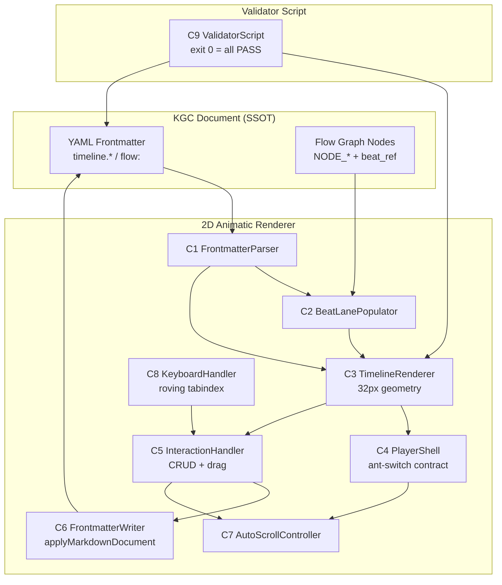
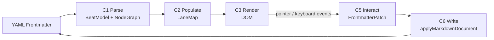
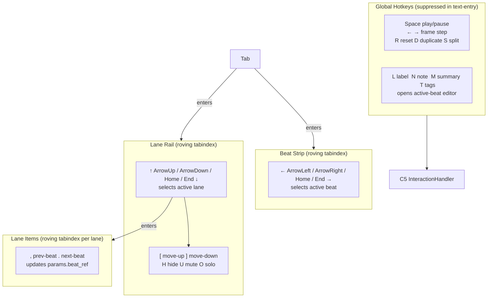

# Knowgrph Animatic — PRD + TAD

**PRD v1.1.0 · TAD v1.1.0 · Enhanced Baseline 2026-05-25**  
Source: `knowgrph-animatic-demo.md § Validation Goals`  
Standard: `prd-tad-guidelines.md`

## Markdown YAML Frontmatter Contract

- This PRD/TAD and its referenced animatic source docs use the opening YAML frontmatter block as the canonical metadata and renderer-activation contract.
- `kgCanvas2dRenderer: animatic` remains the single frontmatter trigger for the animatic renderer; no duplicate renderer-only bootstrap path is allowed.
- Canonical animatic authoring keeps `flow:` and `timeline.beats.*` in plain YAML; normalized `{key, type, value}` wrappers are reserved for dedicated validation fixtures, not baseline authored animatic docs.
- Invalid YAML frontmatter is an acceptance failure because parser warning or repair paths are recovery mechanisms, not release-authoring targets.
- Scalars with reserved punctuation must be quoted so animatic docs stay valid under strict YAML parsing during ingest, reload, and validation automation.

## Current Runtime Owners

- Renderer registry SSOT: `knowgrph/canvas/src/lib/config.render.ts`
- Surface mount owner: `knowgrph/canvas/src/components/CanvasViewport.tsx`
- Runtime shell + DOM/CSS contract: `knowgrph/canvas/src/components/AnimaticCanvas.tsx`,
  `knowgrph/canvas/src/components/AnimaticCanvas.css`
- Timeline model + frontmatter rewrite owner:
  `knowgrph/canvas/src/components/AnimaticCanvas/animaticTimeline.ts`
- Lane presentation owner:
  `knowgrph/canvas/src/components/AnimaticCanvas/animaticLaneControls.ts`
- Keyboard policy owner:
  `knowgrph/canvas/src/components/AnimaticCanvas/animaticKeyboard.ts`
- Browser-facing runtime command owner:
  `knowgrph/canvas/src/features/agent-ready/workspaceRuntimeCommand.ts`
- Mounted validator owner:
  `knowgrph/canvas/scripts/validate_animatic_timeline_interactions.py`
- Canonical validator entry command: `npm run validate:animatic-interactions`

---

# Part 1 — Product Requirements (PRD)

---

## Phase 0 — Problem Discovery

### Problem Statement

Content authors and renderer implementers working with the Knowgrph 2D Animatic surface lack a
structured, auditable acceptance baseline. Without it, renderer patches introduce regressions in
timing fidelity, player-shell DOM contracts, keyboard accessibility, and frontmatter persistence —
each detectable only through manual inspection. The opportunity is a fully specified, autonomously
verifiable acceptance suite that drives both implementation and CI validation from a single
frontmatter-backed document.

### Personas

**P1 — Content Author**  
Jobs-to-be-done: author `timeline.beats.*` and `flow:` YAML in a Markdown document; play back the
resulting animatic in the KGC canvas; edit beat timing and metadata without leaving the renderer;
rely on keyboard shortcuts for efficient navigation.

**P2 — Renderer Implementer**  
Jobs-to-be-done: implement or patch the 2D Animatic renderer against a stable contract; confirm
that every frontmatter mutation survives a document reload; avoid copying vendor timeline code into
the repo.

**P3 — QA Validator**  
Jobs-to-be-done: run `python3 ./scripts/validate_animatic_timeline_interactions.py` or
`npm run validate:animatic-interactions` and receive
a pass/fail verdict with named failure reasons; confirm acceptance criteria without manual
browser inspection.

---

## User Journey — Content Author: Author → Playback → Edit

| Stage    | Action                                              | Touchpoint                        | Pain Point                                     | Opportunity                                  |
|----------|-----------------------------------------------------|-----------------------------------|------------------------------------------------|----------------------------------------------|
| Trigger  | Opens a `kgCanvas2dRenderer: animatic` document    | KGC canvas surface                | Renderer fails to activate from frontmatter    | Single-field activation from YAML            |
| Discover | Sees timeline rail with beat lanes and player shell | Timeline Editor UI                | Inconsistent lane population from node params  | `beat_ref` drives lane assignment reliably   |
| Engage   | Drags beats, edits metadata, uses keyboard shortcuts| Timeline strip + inspector panel  | Timing edits lost on reload; no keyboard nav   | Frontmatter write-back + roving tabindex     |
| Complete | Plays back animatic with auto-scroll enabled       | Player shell                      | Auto-scroll breaks or ignores DOM contract     | Exact switch DOM contract enforced           |
| Return   | Re-opens document; validates persisted state        | KGC canvas + frontmatter          | Lane controls and order not restored           | `timeline.lane_controls` / `lane_order` SSOT |

---

## Epics & User Stories

---

### Epic E1 — Renderer Activation & Schema Ownership

**Problem**: The renderer may activate via hardcoded demo paths or duplicate config surfaces rather
than reading exclusively from frontmatter.

#### E1-S1 — Frontmatter-driven activation

**As a** Content Author **I want** the 2D Animatic renderer to activate solely from
`kgCanvas2dRenderer: animatic` in YAML frontmatter **so that** no out-of-band configuration is
needed to start the renderer.

**Acceptance Criteria**

- **Given** a document with `kgCanvas2dRenderer: animatic` in frontmatter **When** the KGC canvas
  loads the document **Then** the animatic renderer activates and the timeline rail renders without
  any additional configuration.

  > **`/goal` translation**: `renderer activates and timeline rail is present in DOM verified by
  > python3 ./scripts/validate_animatic_timeline_interactions.py exits 0 and no hardcoded demo
  > bootstrap path is called`

- **Given** a document that uses `flow:` YAML authoring surface **When** the animatic renderer
  reads it **Then** it reuses the same canonical Flow Editor frontmatter syntax with no
  parallel animatic-only markdown block.

  > **`/goal` translation**: `grep for animatic-only markdown block returns no match and
  > flow: key is present in frontmatter verified by file content check`

#### E1-S2 — timeline.scale as single scale owner

**As a** Content Author **I want** `timeline.scale.*` to be the only configuration surface for
scale rail, major interval, split count, rail width, and leading offset **so that** no renderer-only
config path overrides or duplicates scale values.

**Acceptance Criteria**

- **Given** `timeline.scale.scale`, `scale_split_count`, `scale_width`, `start_left` set in
  frontmatter **When** the renderer renders the scale rail **Then** it reads exclusively those
  values with no parallel renderer-only override path.

  > **`/goal` translation**: `timeline scale rail values match frontmatter scale.* values verified
  > by validator script and no renderer-only config key exists in source`

#### E1-S3 — Beat timing from frontmatter only

**As a** Renderer Implementer **I want** `timeline.beats.*` to drive all beat labels and timing
**so that** no hardcoded demo rows exist in the renderer code.

**Acceptance Criteria**

- **Given** a document with `timeline.beats.*` entries **When** timing data is absent **Then** the
  renderer falls back to ordinal beat order rather than fixture-only fake data.

  > **`/goal` translation**: `renderer renders ordinal beats when timing absent verified by
  > validator and no fixture data constant exists in renderer source`

**MoSCoW**: Must  
**Success Metrics**

| Metric                               | Baseline       | Target                    | Timeline |
|--------------------------------------|----------------|---------------------------|----------|
| Renderer activation failures         | Unknown        | 0 per 100 document opens  | v1.0     |
| Hardcoded demo fixtures in renderer  | Unknown        | 0                         | v1.0     |
| Scale config surfaces                | Unknown        | Exactly 1 (`timeline.scale.*`) | v1.0 |

---

### Epic E2 — Timeline Lane Population & Graph Binding

**Problem**: Graph nodes with `beat_ref` or canonical IDs do not reliably populate the correct beat
lane, causing mismatches between the visual timeline and the frontmatter graph.

#### E2-S1 — beat_ref drives lane assignment

**As a** Content Author **I want** graph nodes with `params.beat_ref` pointing at a beat key to
appear in the correct lane **so that** the visual timeline reflects the frontmatter graph structure.

**Acceptance Criteria**

- **Given** `NODE_CLIP_01` with `params.beat_ref: beat_01` **When** the renderer renders lanes
  **Then** the node appears in the Clip lane under beat_01.

  > **`/goal` translation**: `NODE_CLIP_01 is in lane Clip under beat_01 verified by
  > validator exits 0`

- **Given** `NODE_AUDIO_02` with `params.beat_ref: beat_02` **When** the renderer renders lanes
  **Then** the node appears in the Audio lane under beat_02.

  > **`/goal` translation**: `NODE_AUDIO_02 is in lane Audio under beat_02 verified by
  > validator exits 0`

- **Given** any node linked by canonical id (e.g. `NODE_OVERLAY_01`) **When** the renderer reads
  the active graph **Then** it populates the matching beat lane without requiring explicit
  `beat_ref` duplication.

  > **`/goal` translation**: `NODE_OVERLAY_01 is in lane Overlay verified by validator exits 0`

**MoSCoW**: Must  
**Success Metrics**

| Metric                          | Baseline | Target    | Timeline |
|---------------------------------|----------|-----------|----------|
| Lane misassignment rate         | Unknown  | 0         | v1.0     |
| Nodes requiring beat_ref re-map | Unknown  | 0         | v1.0     |

---

### Epic E3 — Player Shell & Compact Geometry

**Problem**: The player shell DOM contract deviates from the reference spec, and non-player controls
inflate geometry beyond the compact 32 px target.

#### E3-S1 — Auto-scroll switch DOM contract

**As a** QA Validator **I want** the `Enable Runtime Auto Scroll` switch to match the exact
reference DOM shape **so that** automated selectors targeting the switch remain stable.

**Acceptance Criteria**

- **Given** the timeline player is rendered **When** the auto-scroll switch is present **Then** the
  DOM shape is exactly `div.player-config > button[role="switch"][aria-checked="true"]
  .ant-switch.ant-switch-checked[ant-click-animating="true"][style="margin-bottom:20px"]`
  containing `div.ant-switch-handle`, `span.ant-switch-inner`, `div.ant-click-animating-node`.

  > **`/goal` translation**: `DOM query for player-config > button[role=switch] returns element
  > with aria-checked=true and class ant-switch-checked verified by validator exits 0`

#### E3-S2 — Player shell wrapper contract

**As a** Renderer Implementer **I want** the player shell to use `timeline-player`,
`play-control`, `time`, and `rate-control` surface names **so that** no bespoke wrapper aliases
are introduced.

**Acceptance Criteria**

- **Given** the rendered player shell **When** inspected **Then** wrapper names match the reference
  contract exactly, with no local-only player meta chips inside the shell and no oversized
  header-only lane/item banners.

  > **`/goal` translation**: `DOM contains timeline-player, play-control, time, rate-control and
  > no bespoke wrapper alias exists verified by validator exits 0`

#### E3-S3 — Compact geometry (32 px targets)

**As a** Content Author **I want** the timeline editor geometry to use compact 32 px row heights
**so that** the timeline rail maximises visible beat density.

**Acceptance Criteria**

- **Given** the timeline editor is rendered **When** geometry is measured **Then**
  `timeline-editor-time-area` is 32 px, lane rows are 32 px, mounted action pills are 28 px height,
  and no oversized header-only banners inflate the rail.

  > **`/goal` translation**: `timeline-editor-time-area height is 32px and lane rows are 32px
  > and action pills are 28px verified by validator exits 0`

**MoSCoW**: Must  
**Success Metrics**

| Metric                              | Baseline | Target        | Timeline |
|-------------------------------------|----------|---------------|----------|
| DOM contract deviations             | Unknown  | 0             | v1.0     |
| Row height violations (>32 px)      | Unknown  | 0             | v1.0     |
| Bespoke wrapper aliases             | Unknown  | 0             | v1.0     |

---

### Epic E4 — Beat CRUD & Timing Interactions

**Problem**: Beat drag/resize operations either silently no-op or fail to commit updated timing back
into frontmatter, and contiguous-beat push logic is unimplemented.

#### E4-S1 — Drag-to-move and edge-drag-to-resize

**As a** Content Author **I want** to drag beats to move them and drag their edges to resize them
**so that** I can adjust timing directly on the timeline without editing YAML manually.

**Acceptance Criteria**

- **Given** a beat card in the timeline strip **When** the user drags the beat body **Then** it
  moves to the new position and `start_ms`/`end_ms` update in frontmatter on release.

  > **`/goal` translation**: `validator move test exits 0 and frontmatter start_ms/end_ms match
  > post-drag values with no other beat modified unless pushed`

- **Given** a beat card near the viewport edge while being dragged **When** the pointer is held at
  the rail edge **Then** the timeline auto-scrolls horizontally continuously until the pointer is
  released.

  > **`/goal` translation**: `validator edge-hold auto-scroll test exits 0`

- **Given** a drag or right-resize that pushes into the next beat **When** the operation is
  committed **Then** following beats carry forward to preserve a non-overlapping sequence with no
  silent no-op.

  > **`/goal` translation**: `validator contiguous-push test exits 0 and no beat overlap exists
  > in frontmatter after operation`

#### E4-S2 — Beat Insert, Delete, Split, Duplicate, Merge, Remove Gap

**As a** Content Author **I want** full beat lifecycle operations (insert, delete, split, duplicate,
merge, remove gap) with appropriate guards **so that** the beat sequence stays consistent and
non-overlapping at all times.

**Acceptance Criteria**

- **Given** a beat is active **When** Insert Before or Insert After is triggered **Then** a new
  beat is placed relative to the active beat with all following beats shifted to preserve
  non-overlapping absolute timing.

  > **`/goal` translation**: `validator Insert Before timing shift test exits 0 and no overlap
  > in resulting frontmatter beats`

- **Given** a beat is non-empty **When** Delete Beat is triggered **Then** the action is rejected
  and no frontmatter mutation occurs.

  > **`/goal` translation**: `validator non-empty delete guard test exits 0 and beat count
  > unchanged in frontmatter`

- **Given** a beat is empty **When** Delete Beat is triggered **Then** the beat is removed and
  following beats compact backward.

  > **`/goal` translation**: `validator empty-beat delete compaction test exits 0 and frontmatter
  > beat count decremented by 1`

- **Given** a beat is active **When** Split Beat is triggered **Then** the split occurs at the
  playhead position snapped to the active grid step, and two non-overlapping beats replace the
  original.

  > **`/goal` translation**: `validator Split midpoint continuity test exits 0 and split point
  > matches grid-snapped playhead in frontmatter`

- **Given** a beat is active **When** Duplicate Beat is triggered **Then** a copied beat is placed
  after the active beat and following beats shift forward by the duplicated duration.

  > **`/goal` translation**: `validator Duplicate forward-shift compaction test exits 0`

- **Given** the adjacent next beat is empty **When** Merge Next is triggered **Then** the active
  beat extends through the empty next beat window without orphaning any items.

  > **`/goal` translation**: `validator Merge Next guard/empty-beat merge test exits 0 and
  > merged beat end_ms equals original next beat end_ms`

- **Given** a positive absolute-timing gap exists before the active beat **When** Remove Gap is
  triggered **Then** the active beat and following beats compact back to the previous beat boundary.

  > **`/goal` translation**: `validator Remove Gap guard/backward compaction test exits 0`

- **Given** each beat card **When** the pointer hovers **Then** native quick-action icons for
  delete, insert-before, insert-after, label-rename, note, duplicate, and split are visible.

  > **`/goal` translation**: `validator hover quick-action icon presence test exits 0 for all
  > seven icon types`

**MoSCoW**: Must  
**Success Metrics**

| Metric                            | Baseline | Target              | Timeline |
|-----------------------------------|----------|---------------------|----------|
| Silent no-ops on drag/resize      | Unknown  | 0                   | v1.0     |
| Frontmatter sync failures         | Unknown  | 0 after any CRUD op | v1.0     |
| Beat overlap after any operation  | Unknown  | 0                   | v1.0     |

---

### Epic E5 — Beat Metadata & Inline Display

**Problem**: Beat cards display no inline metadata (summary, tags, item count, per-lane chips),
forcing authors to open separate inspectors for information available on the strip.

#### E5-S1 — Inline metadata on beat cards

**As a** Content Author **I want** beat cards to show summary, tags, item count, and per-lane
item chips inline **so that** I can review beat density at a glance without leaving the timeline
strip.

**Acceptance Criteria**

- **Given** a beat with a saved summary **When** the beat card renders **Then** the summary is
  visible inline without entering edit mode.

  > **`/goal` translation**: `beat card contains summary text matching frontmatter
  > timeline.beats.<beat>.summary verified by validator exits 0`

- **Given** a beat with saved tags **When** the beat card renders **Then** tags appear as inline
  chips with overflow collapsed into a `+N` badge.

  > **`/goal` translation**: `beat card tag chips render and overflow badge present when count
  > exceeds threshold verified by validator exits 0`

- **Given** a beat with lane items **When** the beat card renders **Then** the item count is shown
  inline and per-lane item summary chips are present with `+N` badge overflow.

  > **`/goal` translation**: `beat card item count matches lane item count and per-lane chips
  > render verified by validator exits 0`

- **Given** a beat-card lane summary chip is clicked **When** the navigation fires **Then** the
  matching lane row scrolls into view and briefly highlights without mutating frontmatter
  lane-control state.

  > **`/goal` translation**: `validator lane chip scroll test exits 0 and lane_controls
  > frontmatter unchanged after chip click`

#### E5-S2 — Active beat metadata editing

**As a** Content Author **I want** to edit the active beat's label, note, summary, and tags from
the renderer **so that** I never need to manually edit the YAML frontmatter for metadata.

**Acceptance Criteria**

- **Given** the active beat **When** label, note, summary, or tag is edited and saved **Then** the
  corresponding `timeline.beats.<beat>.*` key is updated in frontmatter.

  > **`/goal` translation**: `frontmatter timeline.beats.<beat>.label/note/summary/tags match
  > editor-committed values verified by validator exits 0`

- **Given** a multiline note or summary editor is open **When** `Cmd/Ctrl+Enter` is pressed
  **Then** the value is saved; when `Escape` is pressed **Then** the edit is cancelled without
  mutation.

  > **`/goal` translation**: `Cmd/Ctrl+Enter commits note to frontmatter and Escape leaves
  > frontmatter unchanged verified by validator exits 0`

- **Given** tag editing is active **When** a tag value is committed **Then** no duplicate tag
  values appear in `timeline.beats.<beat>.tags[]`.

  > **`/goal` translation**: `frontmatter tags array has no duplicates after commit verified
  > by validator exits 0`

**MoSCoW**: Should  
**Success Metrics**

| Metric                                 | Baseline | Target | Timeline |
|----------------------------------------|----------|--------|----------|
| Metadata edits requiring manual YAML   | Unknown  | 0      | v1.0     |
| Duplicate tag entries after edit       | Unknown  | 0      | v1.0     |

---

### Epic E6 — Lane Controls & Order Persistence

**Problem**: Lane Hide/Mute/Solo and lane order changes are not persisted to frontmatter and are
lost on document reload.

#### E6-S1 — Lane control state persistence

**As a** Content Author **I want** Hide, Mute, and Solo lane actions to persist into frontmatter
and restore on reload **so that** my lane configuration survives document round-trips.

**Acceptance Criteria**

- **Given** a lane is hidden, muted, or set to solo **When** the mutation fires **Then**
  `timeline.lane_controls.hidden|muted|solo` is updated in frontmatter.

  > **`/goal` translation**: `frontmatter lane_controls reflects mutation within one write cycle
  > verified by validator exits 0`

- **Given** a document is reloaded after lane control mutations **When** the renderer re-renders
  **Then** hidden, muted, and solo states are restored to the persisted values.

  > **`/goal` translation**: `validator lane Hide/Mute/Solo persist/clear/restore test exits 0`

- **Given** the original markdown is re-applied **When** the renderer re-renders **Then**
  lane control state clears to the original document defaults.

  > **`/goal` translation**: `validator lane control clear-on-reapply test exits 0`

#### E6-S2 — Lane order persistence

**As a** Content Author **I want** lane reorder actions to persist into `timeline.lane_order`
and restore on reload **so that** my preferred lane sequence is retained.

**Acceptance Criteria**

- **Given** lane up/down controls are used **When** the mutation fires **Then**
  `timeline.lane_order` is updated in frontmatter.

  > **`/goal` translation**: `frontmatter lane_order array reflects new sequence after move
  > verified by validator exits 0`

- **Given** a document is reloaded after lane order mutation **When** the renderer re-renders
  **Then** the lane rail follows the persisted `timeline.lane_order` sequence.

  > **`/goal` translation**: `validator lane order persist/clear/restore test exits 0`

**MoSCoW**: Should  
**Success Metrics**

| Metric                             | Baseline | Target | Timeline |
|------------------------------------|----------|--------|----------|
| Lane state lost on reload          | Unknown  | 0      | v1.0     |
| Lane order deviations after reload | Unknown  | 0      | v1.0     |

---

### Epic E7 — Keyboard Navigation & Accessibility

**Problem**: Timeline interactions are mouse-only, making the renderer inaccessible to keyboard
users and incompatible with power-user shortcut workflows.

#### E7-S1 — Playback and beat-editing hotkeys

**As a** Content Author **I want** keyboard shortcuts for playback and beat editing **so that**
I can operate the timeline without reaching for the mouse.

**Acceptance Criteria**

- **Given** focus is outside a text-entry control **When** `Space`, `Left Arrow`, `Right Arrow`,
  `R`, `D`, or `S` is pressed **Then** the corresponding playback or beat-editing action fires.

  > **`/goal` translation**: `validator playback hotkey test exits 0 for all six keys and no
  > action fires when focus is in text input`

- **Given** focus is inside a beat label, note, summary, or tags editor **When** any hotkey is
  pressed **Then** no timeline action fires (hotkeys suppressed in text-entry controls).

  > **`/goal` translation**: `validator hotkey suppression test exits 0 with focus inside
  > text-entry control`

#### E7-S2 — Active beat metadata hotkeys

**As a** Content Author **I want** keyboard shortcuts `L`, `N`, `M`, `T` to open the
corresponding active-beat editor **so that** metadata editing is keyboard-reachable.

**Acceptance Criteria**

- **Given** focus is outside text-entry **When** `L`, `N`, `M`, or `T` is pressed **Then** the
  corresponding label, note, summary, or tags editor opens without bypassing the frontmatter-backed
  save/cancel flow.

  > **`/goal` translation**: `validator metadata hotkey open test exits 0 for all four keys`

#### E7-S3 — Lane and beat-strip roving tabindex

**As a** Content Author **I want** lanes and the beat strip to support roving tabindex keyboard
navigation **so that** all timeline interactions are reachable without a mouse.

**Acceptance Criteria**

- **Given** the lane rail **When** `Tab` enters it **Then** one tab stop focuses the first lane;
  `Arrow Up`, `Arrow Down`, `Home`, `End` move focus/selection between lanes using roving tabindex.

  > **`/goal` translation**: `validator lane roving tabindex test exits 0 and aria-selected
  > matches focused lane`

- **Given** a lane is selected **When** `[`, `]`, `H`, `U`, or `O` is pressed **Then** the
  corresponding reorder or lane-control action fires and commits to frontmatter.

  > **`/goal` translation**: `validator lane shortcut test exits 0 for all five keys and
  > frontmatter reflects mutation`

- **Given** a lane item is selected **When** `,` or `.` is pressed **Then** the item's
  `params.beat_ref` is updated to the previous or next beat in frontmatter.

  > **`/goal` translation**: `validator item reassignment hotkey test exits 0 and
  > params.beat_ref updated in frontmatter`

- **Given** the beat strip **When** `Tab` enters it **Then** one tab stop focuses the first beat;
  `Arrow Left`, `Arrow Right`, `Home`, `End` move focus between beats.

  > **`/goal` translation**: `validator beat strip roving tabindex test exits 0`

- **Given** selected lane hint chips **When** rendered **Then** they are compact shorthand with
  tooltip-expanded meaning, not multi-line helper labels inflating row height.

  > **`/goal` translation**: `validator hint chip height test exits 0 with no chip exceeding
  > row height`

**MoSCoW**: Should  
**Success Metrics**

| Metric                                    | Baseline | Target     | Timeline |
|-------------------------------------------|----------|------------|----------|
| Timeline interactions keyboard-unreachable| Unknown  | 0          | v1.0     |
| Hotkey suppression failures in text input | Unknown  | 0          | v1.0     |

---

### Epic E8 — Validator Script Coverage

**Problem**: Without a mounted-surface validator, acceptance criteria can only be verified
manually through browser inspection.

#### E8-S1 — Validator script proves all acceptance criteria

**As a** QA Validator **I want** `python3 ./scripts/validate_animatic_timeline_interactions.py`
to verify every runtime interaction **so that** acceptance is deterministic and CI-runnable.

**Acceptance Criteria**

- **Given** the validator script is run against the mounted surface **When** all renderer
  interactions are correctly implemented **Then** the script exits 0 and each named test case
  passes.

  > **`/goal` translation**: `python3 ./scripts/validate_animatic_timeline_interactions.py
  > exits 0 with all named test cases reported as PASS`

- **Given** any acceptance criterion from E1–E7 **When** the validator runs the corresponding
  test case **Then** it proves the criterion by applying
  `window.knowgrphWorkspaceCommand.applyMarkdownDocument(...)` and asserting the resulting DOM and
  frontmatter state.

  > **`/goal` translation**: `all validator test cases reference applyMarkdownDocument and
  > produce deterministic PASS/FAIL output verified by script exit code`

**MoSCoW**: Must  
**Success Metrics**

| Metric                               | Baseline | Target | Timeline |
|--------------------------------------|----------|--------|----------|
| Validator exit 0 on correct renderer | Unknown  | 100%   | v1.0     |
| Manual browser checks required       | Unknown  | 0      | v1.0     |

---

## Scope Boundaries

**In scope**: 2D Animatic renderer surface; `timeline.beats.*` authoring; player shell DOM
contract; beat CRUD interactions; lane controls; keyboard navigation; validator script.

**Out of scope**: 3D renderer surfaces; video export pipeline; multi-user real-time CRDT sync;
external audio engine integration; i18n/localisation; mobile touch gesture handling.

---

## Implementation Constraints

- Canonical 2D renderer id and surface stay `animatic`; do not preserve legacy `animation`
  aliases or remaps.
- Animatic reuses the shared `flow:` authoring surface and may extend it with `timeline.*`;
  do not introduce a parallel animatic-only markdown syntax.
- Runtime stays native in-repo; do not copy vendor timeline runtime code or bolt on downstream
  compatibility wrappers.
- Reuse shared semantic owners and utilities first, especially renderer registry helpers,
  Toolbar row-scroll utilities, icon sizing, and the browser-facing workspace runtime command.
- Frontmatter remains the only persisted state surface for timing, metadata, lane controls,
  and lane order; do not create a parallel renderer-local persistence layer.

---

## Decisions & Open Questions

| ID  | Question                                                                    | Owner      | Status   |
|-----|-----------------------------------------------------------------------------|------------|----------|
| D1 | What is the current validator execution baseline? | QA | Resolved: headless Playwright Chromium via `validate_animatic_timeline_interactions.py` against the mounted app surface |
| D2 | Should `timeline.lane_controls` use arrays or keyed objects? | Arch | Resolved: arrays for `hiddenLaneIds` / `mutedLaneIds`, scalar `soloLaneId` |
| D3 | Is `ant-switch` still the acceptance baseline for the runtime auto-scroll switch? | Impl | Resolved: yes for current reference-fidelity contract; any future replacement must preserve the same DOM contract |
| D4 | Does grid snap affect `Split Beat` at non-integer playhead positions? | Impl | Resolved: yes, split snaps to the active grid step before frontmatter commit |
| OQ1 | Should validation expand beyond Chromium to Firefox/WebKit after the baseline stabilizes? | QA | Open |

---

---

# Part 2 — Technical Architecture (TAD)

---

## Architecture Overview

**From frontmatter to rendered, interactable timeline**: `config.render.ts` declares the canonical
`animatic` renderer id, and `CanvasViewport.tsx` mounts `AnimaticCanvas.tsx` when the active 2D
surface resolves to `animatic`. `AnimaticCanvas.tsx` renders the Player Shell, Scale Rail, Beat
Strip, and Lane Rows. `animaticTimeline.ts` parses frontmatter, builds the timeline model, and
rewrites markdown for timing, metadata, lane controls, and lane order updates. `animaticLaneControls.ts`
projects lane presentation state, and `animaticKeyboard.ts` owns hotkey mapping/suppression rules.
Mounted validation runs through `validate_animatic_timeline_interactions.py`, which drives the live
surface via `window.knowgrphWorkspaceCommand.applyMarkdownDocument(...)` exposed by
`workspaceRuntimeCommand.ts`.

**Mapping note**: the components below are logical responsibilities. Several are co-owned by the
same runtime file family rather than by one file per component.

---

## Journey → System Mapping

| Journey Stage | Workflow                      | Data Flow                            | Runtime Owner |
|---------------|-------------------------------|--------------------------------------|---------------|
| Trigger       | Renderer Activation           | YAML → renderer id → surface mount   | `config.render.ts`, `CanvasViewport.tsx` |
| Discover      | Lane Population               | Graph Nodes + `timeline.*` → model   | `animaticTimeline.ts` |
| Engage        | Beat CRUD & Metadata Edit     | Interaction → delta compute → markdown rewrite | `AnimaticCanvas.tsx`, `animaticTimeline.ts` |
| Complete      | Playback + Auto Scroll        | Player events → edge-scroll loop     | `AnimaticCanvas.tsx` |
| Return        | Reload & State Restoration    | markdown reapply → state re-parse    | `animaticTimeline.ts`, `AnimaticCanvas.tsx` |

---

## Component Specifications

---

### C1 — FrontmatterParser

**Responsibility**: Parses YAML frontmatter from the active KGC document into typed Beat Model,
Scale Config, and Node Graph structures; emits no side effects.

**Interfaces**:
- Input: raw YAML string (`flow:`, `timeline:` keys)
- Output: `BeatModel { beats: Record<string, Beat>, scale: ScaleConfig }`, `NodeGraph { nodes: Node[] }`

**Dependencies**: KGC document store

**Configuration**: none (reads exclusively from frontmatter)

**`/goal` Conditions** (from E1-S1, E1-S2, E1-S3):
- `renderer activates from kgCanvas2dRenderer: animatic and no demo fixture is loaded`
- `timeline.scale.* is sole scale source and no renderer-only override exists`
- `ordinal fallback renders when timing absent`

---

### C2 — BeatLanePopulator

**Responsibility**: Reads `params.beat_ref` from each graph node and assigns nodes to the correct
lane row; resolves canonical node IDs (e.g. `NODE_CLIP_01`) to their lane type.

**Interfaces**:
- Input: `NodeGraph`, `BeatModel`
- Output: `LaneMap { [beatKey]: { [laneType]: Node[] } }`

**Dependencies**: C1 FrontmatterParser output

**Configuration**: lane-type lookup table (Clip, Overlay, Audio, Scene, Node)

**`/goal` Conditions** (from E2-S1):
- `NODE_CLIP_01 in Clip lane under beat_01`
- `NODE_AUDIO_02 in Audio lane under beat_02`
- `NODE_OVERLAY_01 in Overlay lane by canonical id`

---

### C3 — TimelineRenderer

**Responsibility**: Renders the Timeline Editor DOM: Scale Rail, Beat Strip, Lane Rows, and beat
card inline metadata (summary, tags, item count, per-lane chips); enforces compact geometry
(32 px rows, 28 px action pills).

**Interfaces**:
- Input: `BeatModel`, `LaneMap`, `LaneControlState`, `LaneOrder`
- Output: DOM tree rooted at `timeline-editor-time-area`

**Dependencies**: C2 BeatLanePopulator, C4 PlayerShell, shared Toolbar icon-button utilities

**Configuration**: compact row height (`32px`), action pill height (`28px`)

**`/goal` Conditions** (from E3-S3, E5-S1):
- `timeline-editor-time-area height 32px`
- `lane rows 32px`
- `action pills 28px`
- `beat card summary, tags, item count, per-lane chips present`

---

### C4 — PlayerShell

**Responsibility**: Renders the `timeline-player` wrapper with `play-control`, `time`, and
`rate-control` surfaces; owns the `Enable Runtime Auto Scroll` switch at the exact reference DOM
contract; keeps non-player controls visually secondary.

**Interfaces**:
- Input: playback state, auto-scroll flag
- Output: DOM rooted at `div.timeline-player` containing `div.player-config > button[role="switch"]`

**Dependencies**: C7 AutoScrollController

**Configuration**: `ant-switch` component class names (reference-fidelity locked)

**`/goal` Conditions** (from E3-S1, E3-S2):
- `player-config > button[role=switch][aria-checked=true][class~=ant-switch-checked] present`
- `div.ant-switch-handle, span.ant-switch-inner, div.ant-click-animating-node children present`
- `timeline-player, play-control, time, rate-control wrappers present and no aliases`

---

### C5 — InteractionHandler

**Responsibility**: Captures drag-to-move, edge-drag-to-resize, and beat CRUD events from the
timeline strip; computes timing deltas; enforces non-overlap invariant; dispatches patches.

**Interfaces**:
- Input: DOM pointer events, keyboard events
- Output: `BeatPatch { beatKey: string, start_ms: number, end_ms: number }` or `BeatCRUDOp`

**Dependencies**: C6 FrontmatterWriter, C7 AutoScrollController, SnapGrid service

**Configuration**: grid snap steps (ms), auto-scroll trigger zone (px)

**`/goal` Conditions** (from E4-S1, E4-S2):
- `drag commits start_ms/end_ms to frontmatter on release`
- `edge-hold auto-scroll fires continuously at rail edge`
- `contiguous push carries following beats forward with no overlap`
- `non-empty delete guard rejects operation`
- `Split midpoint snaps to grid`
- `Duplicate forward-shifts following beats`
- `Merge Next guard requires empty adjacent beat`
- `Remove Gap requires positive timing gap`

---

### C6 — FrontmatterWriter

**Responsibility**: Accepts typed patch objects and rewrites the relevant YAML frontmatter slices
for the active document, then commits them through the canonical workspace runtime command
`window.knowgrphWorkspaceCommand.applyMarkdownDocument(...)`; preserves unrelated document state and
allows explicit beat insert/delete/reorder mutations when the interaction requires them.

**Interfaces**:
- Input: `FrontmatterPatch` (typed union: `BeatPatch | LaneControlPatch | LaneOrderPatch | MetadataPatch`)
- Output: updated YAML string committed to document store

**Dependencies**: KGC document store, `applyMarkdownDocument` workspace command

**Configuration**: targeted frontmatter rewrite policy; no parallel persistence store

**`/goal` Conditions** (from E4, E5, E6):
- `frontmatter updated within one write cycle after any interaction`
- `no unrelated key deleted on any patch`
- `lane_controls and lane_order persist and restore after reload`

---

### C7 — AutoScrollController

**Responsibility**: Monitors pointer position during drag interactions; triggers continuous
horizontal scroll when pointer is within the auto-scroll trigger zone near the rail edge.

**Interfaces**:
- Input: pointer x-position, rail bounds, drag-active flag
- Output: scroll delta applied to `timeline-editor-time-area`

**Dependencies**: C5 InteractionHandler (drag-active signal)

**Configuration**: trigger zone width (px), scroll velocity (px/frame)

**`/goal` Conditions** (from E4-S1):
- `horizontal scroll fires continuously when pointer held at rail edge during drag`

---

### C8 — KeyboardHandler

**Responsibility**: Maps keyboard events to playback actions (`Space`, `Left/Right`, `R`, `D`,
`S`) and metadata editor openers (`L`, `N`, `M`, `T`); suppresses all hotkeys when focus is inside
a text-entry control; routes lane/item/beat-strip roving tabindex events.

**Interfaces**:
- Input: `KeyboardEvent` stream, focus context flag
- Output: `TimelineAction` dispatched to C5 or metadata editor; roving tabindex mutations

**Dependencies**: C5 InteractionHandler, C3 TimelineRenderer (focus context)

**Configuration**: hotkey map (externalized); roving tabindex scope selectors

**`/goal` Conditions** (from E7-S1, E7-S2, E7-S3):
- `Space/Left/Right/R/D/S fire actions outside text-entry`
- `all hotkeys suppressed inside text-entry`
- `L/N/M/T open corresponding editor`
- `lane, item, beat-strip roving tabindex navigation correct`
- `hint chips compact with tooltip expansion`

---

### C9 — ValidatorScript

**Responsibility**: Provides the mounted-surface test harness at
`./scripts/validate_animatic_timeline_interactions.py`; applies markdown documents via
`applyMarkdownDocument`; asserts DOM state and frontmatter values; exits 0 on full pass.

**Interfaces**:
- Input: mounted KGC surface, test fixtures (markdown documents)
- Output: `PASS` / `FAIL` per named test case; process exit code 0 (pass) or 1 (fail)

**Dependencies**: `window.knowgrphWorkspaceCommand.applyMarkdownDocument`, DOM query APIs

**Configuration**: test fixture markdown blocks, named test case registry, Playwright Chromium

**`/goal` Conditions** (from E8-S1):
- `script exits 0 with all named test cases PASS`
- `every test case references applyMarkdownDocument`

---

## Integration Contracts

| Interface                    | Protocol      | Format             | Error Handling                              |
|------------------------------|---------------|--------------------|---------------------------------------------|
| FrontmatterParser → BeatModel| In-process    | TypeScript object  | Throw + renderer fallback to ordinal beats  |
| BeatLanePopulator → LaneMap  | In-process    | TypeScript object  | Unknown node type → lane `Node` fallback    |
| InteractionHandler → FMWriter| In-process    | `FrontmatterPatch` | Rollback patch on write failure; alert user |
| FMWriter → applyMarkdownDocument | Browser command | `WorkspaceRuntimeCommandApplyDocumentArgs` | Fail fast; preserve current runtime state when apply returns `applied: false` |
| ValidatorScript → mounted DOM| Playwright Chromium | browser-evaluated command calls + DOM assertions | Test case FAIL on assertion error |

---

## Workflow: Beat Drag-to-Move

**Trigger**: User pointer-down on a beat card body in the timeline strip.  
**Actors**: Content Author, InteractionHandler (C5), AutoScrollController (C7), FrontmatterWriter (C6).

**Happy Path**:
1. Author pointer-down → C5 enters drag mode, records `dragStartMs`
2. Author drags → C5 computes `deltaMs`; if pointer near rail edge → C7 scrolls continuously
3. Author releases → C5 checks non-overlap invariant; pushes following beats if needed
4. C5 dispatches `BeatPatch` → C6 writes `start_ms`/`end_ms` to frontmatter
5. C3 re-renders beat strip from updated model

**Alternate Paths**:
- Push causes cascade: C5 recomputes all downstream beats before dispatching single batch patch

**Error Paths**:
- `applyMarkdownDocument` fails: C6 rolls back in-memory model; displays error chip

**Postconditions**: `timeline.beats.<beat>.start_ms` and `end_ms` in frontmatter match post-drag
values; no beat overlap exists; timeline strip reflects new positions.

---

## Workflow: Validator Script Run

**Trigger**: `python3 ./scripts/validate_animatic_timeline_interactions.py`  
**Actors**: QA Validator, ValidatorScript (C9), mounted KGC surface.

**Happy Path**:
1. Validator loads test fixture markdown documents
2. For each test case: calls `applyMarkdownDocument(fixture)` on mounted surface
3. Asserts DOM state (element presence, class names, aria attributes, geometry)
4. Asserts frontmatter state (key values match expected)
5. Reports `PASS` per test case; exits 0

**Alternate Paths**:
- Partial renderer implementation: affected test cases report `FAIL` with named assertion

**Error Paths**:
- `applyMarkdownDocument` unavailable: script exits 1 with `SURFACE_NOT_MOUNTED` error

**Postconditions**: exit code 0 if all test cases pass; each failing test case named in output.

---

## Data Flows

### Data Flow: Frontmatter → Beat Model → DOM

| Stage     | Component               | Input Format                       | Output Format                  | Persistence          | Error Handling             |
|-----------|-------------------------|------------------------------------|--------------------------------|----------------------|----------------------------|
| Ingest    | FrontmatterParser (C1)  | YAML string (`flow:`, `timeline:`) | `BeatModel`, `NodeGraph`       | In-memory only       | Fallback to ordinal beats  |
| Transform | BeatLanePopulator (C2)  | `BeatModel`, `NodeGraph`           | `LaneMap`                      | In-memory only       | Unknown node → `Node` lane |
| Store     | TimelineRenderer (C3)   | `LaneMap`, `BeatModel`             | DOM tree                       | DOM (transient)      | Re-render on error         |
| Serve     | PlayerShell (C4)        | DOM tree                           | Rendered timeline UI           | None                 | Error chip                 |

### Data Flow: Interaction → Frontmatter Patch

| Stage     | Component                  | Input Format              | Output Format              | Persistence            | Error Handling            |
|-----------|----------------------------|---------------------------|----------------------------|------------------------|---------------------------|
| Ingest    | InteractionHandler (C5)    | Pointer/keyboard events   | `InteractionEvent`         | None                   | Drop malformed event      |
| Transform | InteractionHandler (C5)    | `InteractionEvent`        | `FrontmatterPatch`         | None                   | Rollback on invariant fail|
| Store     | FrontmatterWriter (C6)     | `FrontmatterPatch`        | Updated YAML string        | YAML frontmatter (SSOT)| Retry once; error chip    |
| Serve     | FrontmatterParser (C1)     | Updated YAML              | Refreshed `BeatModel`      | In-memory              | Re-parse on reload        |

---

## Architectural Decisions

### ADR-1: Frontmatter as Single Source of Truth for All animatic State
**Status**: Accepted  
**Date**: 2026-05-25

#### Context
animatic timing, lane controls, beat metadata, and lane order could live in a renderer-internal
store, a separate animatic config block, or the existing YAML frontmatter.

#### Decision
All animatic state (`timeline.beats.*`, `timeline.scale.*`, `timeline.lane_controls`,
`timeline.lane_order`) lives exclusively in YAML frontmatter. The renderer reads from and writes
back to frontmatter only.

#### Alternatives Considered
1. Renderer-internal store: fast reads / Cons: state lost on reload, no diffability
2. Separate animatic config block: clean separation / Cons: duplicate surface, sync complexity

#### Rationale
Frontmatter as SSOT enables Git-diffable history, document reload determinism, and alignment with
the existing KGC `flow:` authoring surface. It eliminates sync bugs between a renderer store and
the document.

#### Consequences
- **Positive**: Reload restores full state; state is human-readable and version-controlled
- **Negative**: Write latency for high-frequency drag events (mitigated by batch patch dispatch)
- **Neutral**: All renderer state must be serializable to YAML

---

### ADR-2: applyMarkdownDocument as the Canonical Write Path
**Status**: Accepted  
**Date**: 2026-05-25

#### Context
FrontmatterWriter needs a write mechanism to commit patches. Options include direct DOM mutation,
a REST API, or the workspace command API.

#### Decision
Use `window.knowgrphWorkspaceCommand.applyMarkdownDocument(...)` as the sole write path.

#### Alternatives Considered
1. Direct localStorage write: simple / Cons: bypasses document lifecycle, no undo support
2. REST API: decoupled / Cons: network round-trip latency, auth complexity

#### Rationale
`applyMarkdownDocument` is the existing workspace command contract; reusing it preserves document
lifecycle semantics (undo, reload, version) without new infrastructure.

#### Consequences
- **Positive**: Undo/redo, reload consistency, single write surface
- **Negative**: Patch must be serialized to full YAML string; no partial-key writes
- **Neutral**: Validator script can use the same API for test fixture application

---

### ADR-3: Roving Tabindex for Keyboard Navigation
**Status**: Accepted  
**Date**: 2026-05-25

#### Context
Keyboard navigation across lanes, items, and beat strip requires a focus management strategy.
Options: global event listeners, dedicated focus component, or roving tabindex.

#### Decision
Roving tabindex: one `tabindex="0"` on the focused element; all others `tabindex="-1"`. Arrow keys
move focus within each navigation scope (lane rail, lane items, beat strip).

#### Alternatives Considered
1. Global key listeners: simple / Cons: no visible focus, inaccessible, hotkey conflicts
2. Dedicated focus component: explicit / Cons: additional state layer, sync with DOM

#### Rationale
Roving tabindex is the ARIA-recommended pattern for composite widgets (listbox, grid, toolbar).
It provides visible focus styling, correct Tab behavior, and maps directly to the KGC compact
lane geometry without a separate focus store.

#### Consequences
- **Positive**: ARIA-compliant, visible focus, single Tab entry point per scope
- **Negative**: Requires `tabindex` mutation on every arrow-key event
- **Neutral**: Each navigation scope (lanes, items, beats) is independently roving

---

### ADR-4: Validator Script as Mounted-Surface Test Harness
**Status**: Accepted  
**Date**: 2026-05-25

#### Context
Acceptance criteria for timeline interactions require observing both DOM state and frontmatter
mutations after interactions. Options: unit tests, Playwright E2E, or a custom mounted-surface
script.

#### Decision
A single Python validator script at `./scripts/validate_animatic_timeline_interactions.py`
drives the mounted surface in headless Playwright Chromium via `applyMarkdownDocument` and asserts
DOM + frontmatter state.

#### Alternatives Considered
1. Playwright E2E suite: standard / Cons: full browser overhead, separate test infra
2. Unit tests only: fast / Cons: cannot assert mounted DOM or frontmatter write-back

#### Rationale
The validator script reuses the mounted surface directly, testing the integration between the
renderer, interaction handler, and frontmatter writer in a single pass without a separate test
infrastructure. Exit code 0/1 maps cleanly to CI pass/fail.

#### Consequences
- **Positive**: Full integration coverage; CI-runnable; deterministic pass/fail
- **Negative**: Requires mounted surface (cannot run in pure unit test environment)
- **Neutral**: Python chosen for scripting convenience; Playwright can be added as an option (OQ4)

---

## Quality Attributes

| Attribute     | Scenario                                              | Pattern                                     | Validation                                     |
|---------------|-------------------------------------------------------|---------------------------------------------|------------------------------------------------|
| Performance   | Drag event at 60 fps → frontmatter patch latency ≤16 ms | Batch patch dispatch; debounce on release  | Validator measures patch round-trip time       |
| Scalability   | 50-beat document → renderer renders without jank      | Virtual lane row rendering for large beat count | Validator document with 50 beats exits 0   |
| Security      | `applyMarkdownDocument` called with arbitrary string  | Input schema validation before write        | Malformed YAML patch rejected; no document corruption |
| Observability | Frontmatter write failure is silent                   | Error chip surface in PlayerShell; console warn | Validator asserts error chip present on failed write |

---

## Deployment Strategy

**Strategy**: Enhancement-first, rolling. No vendor timeline runtime code is copied into the repo.
Each epic ships as an incremental enhancement against the existing renderer surface. The validator
script is run on every commit touching the renderer or `timeline.*` frontmatter schema.

**Rollback**: Any commit that causes `npm run validate:animatic-interactions` to exit non-zero
is reverted. The frontmatter SSOT ensures document state is always recoverable from the YAML source.

---

## Architecture Diagrams

### Diagram 1 — Component Topology



### Diagram 2 — Beat Edit Workflow

```mermaid
sequenceDiagram
  actor Author
  participant C5 as InteractionHandler
  participant C7 as AutoScrollController
  participant C6 as FrontmatterWriter
  participant YAML as Frontmatter (SSOT)
  participant C3 as TimelineRenderer

  Author->>C5: pointer-down on beat card
  C5->>C5: enter drag mode; record dragStartMs
  loop drag active
    Author->>C5: pointer-move
    C5->>C7: check rail-edge proximity
    C7-->>C3: scroll if near edge
    C5->>C5: compute deltaMs
  end
  Author->>C5: pointer-up (release)
  C5->>C5: enforce non-overlap invariant; push following beats
  C5->>C6: dispatch BeatPatch
  C6->>YAML: applyMarkdownDocument({ name, text, ... })
  YAML-->>C1: re-parse
  C1-->>C3: updated BeatModel
  C3-->>Author: re-rendered beat strip
```

### Diagram 3 — Data Flow: Frontmatter → DOM → Frontmatter



### Diagram 4 — Keyboard Navigation Scopes



---

## Component Inventory

| Layer          | Component              | File / Module                                           | Status      |
|----------------|------------------------|---------------------------------------------------------|-------------|
| Registry       | Surface registry + mount | `knowgrph/canvas/src/lib/config.render.ts`, `knowgrph/canvas/src/components/CanvasViewport.tsx` | Live |
| Parse + Model  | C1 FrontmatterParser / C2 BeatLanePopulator | `knowgrph/canvas/src/components/AnimaticCanvas/animaticTimeline.ts` | Live |
| Render         | C3 TimelineRenderer    | `knowgrph/canvas/src/components/AnimaticCanvas.tsx`, `knowgrph/canvas/src/components/AnimaticCanvas.css` | Live |
| Player         | C4 PlayerShell         | `knowgrph/canvas/src/components/AnimaticCanvas.tsx`, `knowgrph/canvas/src/components/AnimaticCanvas.css` | Live |
| Interaction    | C5 InteractionHandler  | `knowgrph/canvas/src/components/AnimaticCanvas.tsx`, `knowgrph/canvas/src/components/AnimaticCanvas/animaticTimeline.ts` | Live |
| Write          | C6 FrontmatterWriter   | `knowgrph/canvas/src/components/AnimaticCanvas/animaticTimeline.ts`, `knowgrph/canvas/src/features/agent-ready/workspaceRuntimeCommand.ts` | Live |
| Scroll         | C7 AutoScrollController| `knowgrph/canvas/src/components/AnimaticCanvas.tsx` | Live |
| Keyboard       | C8 KeyboardHandler     | `knowgrph/canvas/src/components/AnimaticCanvas/animaticKeyboard.ts`, `knowgrph/canvas/src/components/AnimaticCanvas.tsx` | Live |
| Lane State     | Lane presentation      | `knowgrph/canvas/src/components/AnimaticCanvas/animaticLaneControls.ts` | Live |
| Validation     | C9 ValidatorScript     | `knowgrph/canvas/scripts/validate_animatic_timeline_interactions.py`, `knowgrph/canvas/package.json` | Live |

---

# Traceability Matrix

| PRD Story    | Acceptance Criterion (summary)                               | TAD Component            | `/goal` Condition                                                                   |
|--------------|--------------------------------------------------------------|--------------------------|--------------------------------------------------------------------------------------|
| E1-S1        | Renderer activates from `kgCanvas2dRenderer: animatic`      | C1, C3                   | `renderer activates and no demo fixture loaded; validator exits 0`                  |
| E1-S1        | Canonical flow: YAML syntax reused; no parallel block        | C1                       | `grep animatic-only block returns no match`                                        |
| E1-S2        | `timeline.scale.*` sole scale config source                  | C1, C3                   | `scale rail matches frontmatter; no renderer-only key in source`                    |
| E1-S3        | Ordinal fallback when timing absent                          | C1, C3                   | `ordinal beats render when timing absent; validator exits 0`                        |
| E2-S1        | `NODE_CLIP_01` in Clip lane under beat_01                    | C2                       | `NODE_CLIP_01 in Clip/beat_01; validator exits 0`                                   |
| E2-S1        | `NODE_AUDIO_02` in Audio lane under beat_02                  | C2                       | `NODE_AUDIO_02 in Audio/beat_02; validator exits 0`                                 |
| E2-S1        | `NODE_OVERLAY_01` by canonical id                            | C2                       | `NODE_OVERLAY_01 in Overlay; validator exits 0`                                     |
| E3-S1        | Auto-scroll switch exact DOM contract                        | C4                       | `button[role=switch][aria-checked=true][class~=ant-switch-checked] present`         |
| E3-S2        | Player shell wrapper contract                                | C4                       | `timeline-player, play-control, time, rate-control present; no aliases`             |
| E3-S3        | 32 px row geometry; 28 px action pills                       | C3                       | `time-area 32px; lane rows 32px; pills 28px; validator exits 0`                     |
| E4-S1        | Drag commits `start_ms`/`end_ms` on release                  | C5, C6                   | `frontmatter start_ms/end_ms match post-drag; validator move test exits 0`          |
| E4-S1        | Auto-scroll at rail edge during drag                         | C5, C7                   | `validator edge-hold auto-scroll test exits 0`                                      |
| E4-S1        | Contiguous push carries following beats                      | C5, C6                   | `validator contiguous-push test exits 0; no overlap in frontmatter`                 |
| E4-S2        | Insert Before / After with non-overlap shift                 | C5, C6                   | `validator Insert Before timing shift test exits 0`                                 |
| E4-S2        | Non-empty delete guard rejects operation                     | C5, C6                   | `validator non-empty delete guard test exits 0; beat count unchanged`               |
| E4-S2        | Empty beat delete with backward compaction                   | C5, C6                   | `validator empty-beat delete compaction test exits 0`                               |
| E4-S2        | Split at grid-snapped playhead                               | C5, C6                   | `validator Split midpoint continuity test exits 0`                                  |
| E4-S2        | Duplicate with forward-shift                                 | C5, C6                   | `validator Duplicate forward-shift compaction test exits 0`                         |
| E4-S2        | Merge Next with empty-adjacent guard                         | C5, C6                   | `validator Merge Next guard test exits 0`                                           |
| E4-S2        | Remove Gap with positive-gap guard                           | C5, C6                   | `validator Remove Gap guard test exits 0`                                           |
| E4-S2        | Hover quick-action icons present                             | C3                       | `validator hover icon presence test exits 0 for all 7 icon types`                  |
| E5-S1        | Summary visible inline on beat card                          | C3                       | `beat card summary text matches frontmatter.summary; validator exits 0`             |
| E5-S1        | Tags as inline chips with `+N` overflow                      | C3                       | `tag chips render; overflow badge present; validator exits 0`                       |
| E5-S1        | Item count + per-lane chips with `+N` overflow               | C3                       | `item count and per-lane chips correct; validator exits 0`                          |
| E5-S1        | Lane chip click scrolls row without mutating state           | C3, C6                   | `validator lane chip scroll test exits 0; lane_controls unchanged`                  |
| E5-S2        | Label/note/summary/tags edit commits to frontmatter          | C5, C6, C8               | `frontmatter beat.* keys match committed values; validator exits 0`                 |
| E5-S2        | `Cmd/Ctrl+Enter` saves; `Escape` cancels                     | C8, C6                   | `Cmd+Enter commits; Escape leaves frontmatter unchanged; validator exits 0`         |
| E5-S2        | No duplicate tags after commit                               | C6                       | `tags array has no duplicates; validator exits 0`                                   |
| E6-S1        | Hide/Mute/Solo commit to `lane_controls`                     | C5, C6                   | `frontmatter lane_controls reflects mutation; validator exits 0`                    |
| E6-S1        | Lane controls restore on reload                              | C1, C3                   | `validator lane Hide/Mute/Solo persist/clear/restore test exits 0`                  |
| E6-S2        | Lane order commits to `lane_order`                           | C5, C6                   | `frontmatter lane_order reflects new sequence; validator exits 0`                   |
| E6-S2        | Lane order restores on reload                                | C1, C3                   | `validator lane order persist/clear/restore test exits 0`                           |
| E7-S1        | Playback hotkeys fire outside text-entry                     | C8, C5                   | `validator playback hotkey test exits 0 for 6 keys`                                 |
| E7-S1        | Hotkeys suppressed in text-entry                             | C8                       | `validator hotkey suppression test exits 0`                                         |
| E7-S2        | `L/N/M/T` open metadata editors                              | C8, C3                   | `validator metadata hotkey open test exits 0 for 4 keys`                            |
| E7-S3        | Lane roving tabindex + `[]/H/U/O` shortcuts                  | C8, C3, C6               | `validator lane roving tabindex and shortcut test exits 0`                          |
| E7-S3        | Item `,`/`.` reassignment updates `beat_ref`                 | C8, C6                   | `validator item reassignment hotkey test exits 0; beat_ref updated`                 |
| E7-S3        | Beat strip roving tabindex                                   | C8, C3                   | `validator beat strip roving tabindex test exits 0`                                 |
| E7-S3        | Hint chips compact with tooltip expansion                    | C3                       | `validator hint chip height test exits 0`                                           |
| E8-S1        | Validator exits 0 on correct renderer                        | C9                       | `python3 ./scripts/validate_animatic_timeline_interactions.py exits 0`             |
| E8-S1        | All test cases reference `applyMarkdownDocument`             | C9                       | `all test cases call applyMarkdownDocument; deterministic PASS/FAIL output`         |

---

*End of document. PRD v1.1.0 · TAD v1.1.0 · Enhanced Baseline 2026-05-25.*
