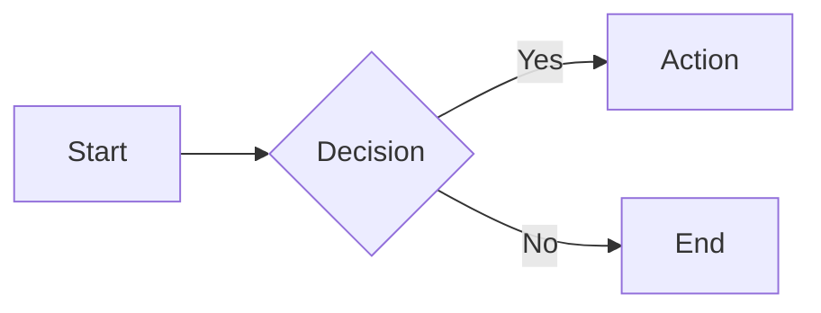
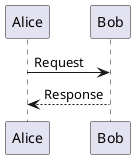

# Markdown Slide Styling Guidelines

Universal syntax guide for presentation frameworks

> Status: This document distinguishes between **fully supported semantics** in the Knowgrph canvas markdown viewer and **structurally accepted only** features that are rendered as plain content without special behavior.

---

## Frontmatter Configuration (fully supported in Knowgrph viewer)

```yaml
---
theme: default
background: /cover.jpg
class: text-center
transition: slide-left
layout: cover
aspectRatio: '16/9'
lang: en-US
mermaid: |
  graph LR
    A[Start] --> B[End]
---
```

**Purpose**: Configures presentation-wide settings via YAML metadata block

**Common keys**: `theme`, `background`, `class`, `transition`, `layout`, `aspectRatio`, `lang`

**Academic / Metadata keys (fully supported):**
- `authors`: List of authors (string or array)
- `meeting`: Conference or meeting name
- `date`: Presentation date
- `venue`: Presentation venue
- `institution`: Institution or organization name (displays in footer)
- `url`: Link to paper or project
- `theme`: Theme style (e.g., `default`, `academic`)
- `mermaid`: Global mermaid diagram definition (string)

**Effect**: When these keys are present, a persistent footer is rendered on slides (except `cover` and `intro` layouts).
- **Default Theme**: Meeting/Venue/Institution/Date (Left), Authors/URL (Right), Page Numbers (Right).
- **Academic Theme** (`theme: academic`): Meeting + Authors (Left), Institution/Venue + Page X / Y (Right).

---

## Text Styling (fully supported)

**Bold:** `**text**` → **text**  
**Italic:** `*text*` → *text*  
**Bold+Italic:** `***text***` → ***text***  
**Underline:** `<u>text</u>` → <u>text</u>  
**Highlight:** `==text==` or `<mark>text</mark>` → <mark>text</mark>  
**Strikethrough:** `~~text~~` → ~~text~~  
**Subscript:** `~text~` → <sub>text</sub>  
**Superscript:** `^text^` → <sup>text</sup>  
**Code:** `` `text` `` → `text`

**Custom span:**
```html
<span class="custom-class">styled text</span>
```

---

## Lists (fully supported)

**Unordered:**
```markdown
- Item one
- Item two
  - Nested item
```

**Ordered:**
```markdown
1. Step one
2. Step two
```

**Task:**
```markdown
- [x] Completed
- [ ] Pending
```

---

## Footnotes (fully supported)

```markdown
Here is a footnote reference[^1].

[^1]: This is the footnote content.
```

**Purpose**: Add citations or additional context at the bottom of the slide/document.

---

## Headings and IDs (fully supported)

```markdown
# Heading Level 1 {#custom-id}
## Heading Level 2
```

**Auto-generated IDs**: Headings automatically get IDs derived from their text (kebab-case).
**Custom IDs**: You can specify a custom ID using the `{#id}` syntax.
**Linking**: Link to headings using `[Link Text](#custom-id)`.

---

## Tables (fully supported)

```markdown
| Column A | Column B | Column C |
|----------|----------|----------|
| Data 1   | Data 2   | Data 3   |
| Data 4   | Data 5   | Data 6   |
```

**Alignment:** `:---` (left), `:---:` (center), `---:` (right)

**Example:**
```markdown
| Metric | Before | After |
|:-------|-------:|:-----:|
| Speed  | 3.2s   | 0.8s  |
```

---

## Blockquotes (fully supported)

```markdown
> Single-line quote

> **Multi-line quote:**
>
> - Point one
> - Point two
> - Point three
```

**Purpose**: Highlights citations, callouts, or emphasized content blocks

---

## Code Blocks (fully supported as static code)

**Basic:**
````markdown
```javascript
function example() {
  return 42;
}
```
````

**With language hint:**
````markdown
```python
def calculate(x):
    return x * 2
```
````

**Supported languages:** `javascript`, `python`, `java`, `cpp`, `go`, `rust`, `sql`, `bash`, `css`, `html`, `json`, `yaml`, `markdown`

---

## Code: Line Highlighting (structural only today)

````markdown
```js {1,3-5}
const a = 1;     // Highlighted
const b = 2;
const c = 3;     // Highlighted
const d = 4;     // Highlighted
const e = 5;     // Highlighted
```
````

**Progressive steps:**
````markdown
```js {1|3-5|all}
// Step 1: line 1
// Step 2: lines 3-5
// Step 3: all lines
```
````

---

## Code: Advanced Features (structural only today)

**Line numbers:**
````markdown
```python {lines:true}
def example():
    pass
```
````

**Diff syntax:**
````markdown
```diff
- removed_line()
+ added_line()
  unchanged_line()
```
````

**Editable code:**
````markdown
```js {monaco}
const editable = true;
```
````

---

## Math: LaTeX (structural only today)

**Inline:** `$E = mc^2$` renders inline equation

**Block:**
```markdown
$$
\int_{-\infty}^{\infty} e^{-x^2} dx = \sqrt{\pi}
$$
```

**Matrix:**
```markdown
$$
\begin{bmatrix}
a & b \\
c & d
\end{bmatrix}
$$
```

---

## Images (fully supported)

**Basic:**
```markdown

```

**With size attributes:**
```markdown


```

**Background image:**
```markdown


```

---

## Links (fully supported)

```markdown
[Link text](https://example.com)
[Link with title](https://example.com "Tooltip text")
```

**Auto-linking:**
```markdown
<https://example.com>
```

---

## Horizontal Rules (fully supported)

```markdown
---
```

**Purpose**: Separates slides or sections depending on framework configuration

**Alternative syntax:**
```markdown
***
___
```

---

## Slide Separation and Reordering in Knowgrph

```markdown
# Slide 1

---

# Slide 2
```

**Semantics in Knowgrph:**
- Top-of-document YAML frontmatter (`---` … `---` at the very start) is treated as metadata and does not create a slide break.
- `---` lines that appear outside YAML frontmatter and outside fenced code blocks are treated as slide separators by the Knowgrph markdown viewer and fullscreen slide gallery.
- `---` that appear inside fenced code blocks or inside YAML frontmatter are treated as literal content, not slide breaks.

**Reordering behavior:**
- The fullscreen Markdown slide gallery sidebar lets you drag thumbnails to change slide order; Knowgrph rewrites the underlying markdown to match that order so the editor, viewer, and on-disk file stay aligned.
- Reordering operates on slide-sized chunks, preserving per-slide YAML blocks, notes, and fenced code blocks (including those that contain `---`) as intact units.
- When Knowgrph rewrites a deck after reordering, it normalizes slide separators to the form:

  ```markdown
  <last non-empty line of previous slide>
  
  ---
  
  <first non-empty line of next slide>
  ```

  enforcing a single blank line before and after each `---` separator.

**Fullscreen frame, zoom, and scroll semantics in Knowgrph:**
- The fullscreen slide gallery renders each slide inside a static frame; the frame border, corner radius, and drop shadow do not zoom.
- The slide content inside the frame can be zoomed and panned for detail inspection, while the frame stays fixed.
- Mouse wheel or trackpad scroll **inside the frame** scrolls the slide content; it does not trigger zoom.
- Zoom gestures are modifier-based: holding `Ctrl` (or `Cmd` on macOS) while scrolling zooms; plain scroll without modifiers only scrolls.

---

## Two-Column Layout: HTML (structural only)

```html
<div class="two-column">
<div>

**Left column:**
- Content A
- Content B

</div>
<div>

**Right column:**
- Content C
- Content D

</div>
</div>
```

**Requires CSS:** `.two-column { display: grid; grid-template-columns: 1fr 1fr; }`

---

## Two-Column Layout: Native (fully supported)

```markdown
---
layout: two-cols
---

Left column content

::right::

Right column content
```

**Purpose**: Framework-specific delimiter for column splitting

---

## Click-Based Progressive Disclosure (fully supported in Knowgrph viewer)

**Group animation:**
```html
<v-clicks>

- Appears on click 1
- Appears on click 2
- Appears on click 3

</v-clicks>
```

**Individual control (step-based reveal):**
```html
<v-click>Block appears on click</v-click>

<v-click at="2">Appears at step 2</v-click>
```

**Knowgrph semantics:**
- `<v-click>` blocks are treated as slide fragments.
- `at="N"` sets the explicit fragment index for ordering.
- When presentation mode is enabled and fragments are configured, fragments appear as the presenter advances steps.

---

## Inline Text Markers (partially supported in Knowgrph viewer)

```html
<v-mark color="red">red highlight</v-mark>
<v-mark color="yellow">yellow highlight</v-mark>
<v-mark type="circle">circled</v-mark>
<v-mark type="underline">underlined</v-mark>
<v-mark type="strike-through">strikethrough</v-mark>
```

**Colors:** `red`, `orange`, `yellow`, `green`, `blue`, `purple`, `gray`

**Types:** `highlight`, `circle`, `underline`, `strike-through`

**Knowgrph semantics:**
- `<v-mark>` blocks participate in fragment stepping like `<v-click>`.
- Color and type attributes are treated as plain content (no special styling today).

---

## Slide-Specific Directives (partially supported)

**Per-slide YAML:**
```markdown
---
layout: center
class: text-center
background: #1a1a2e
transition: fade
fragments:
  enabled: true
  steps: 3
---

Slide content

Additional fragment configuration keys understood by the Knowgrph viewer:
- `fragmentTags`: overrides the default fragment tag list (`['v-click', 'v-mark']`).
- `fragmentClassNames`: overrides the default fragment class list (`['fragment']`).
- `fragmentSteps` / `fragmentStepCount`: alternative way to specify total steps.
```

**HTML comments:**
```markdown
<!-- _class: lead -->
<!-- _backgroundColor: #ffffff -->
<!-- _color: #333333 -->

Slide content
```

---

## Layout Types (partially supported)

**Common layouts:**
- `default` - Standard content
- `cover` - Title slide
- `intro` - Introduction
- `center` - Centered content
- `two-cols` - Two columns
- `image-right` - Image on right
- `image-left` - Image on left
- `quote` - Large quote
- `fact` - Large number/fact
- `section` - Section divider

---

## Background Control (fully supported)

**Image:**
```yaml
---
background: /path/to/image.jpg
backgroundSize: cover
backgroundPosition: center
---
```

**Gradient:**
```yaml
---
background: linear-gradient(135deg, #667eea, #764ba2)
---
```

**Color:**
```yaml
---
background: '#1a1a2e'
---
```

---

## Transition Effects (structural only today)

```yaml
---
transition: slide-left
---
```

**Options:**
- `none` - No transition
- `fade` - Crossfade
- `slide-left` - Slide from right
- `slide-right` - Slide from left
- `slide-up` - Slide from bottom
- `slide-down` - Slide from top
- `zoom` - Zoom effect

---

## Fragment Animations (fully supported in Knowgrph viewer)

```html
<p class="fragment">Default fade-in</p>
<p class="fragment fade-out">Fade out</p>
<p class="fragment fade-up">Fade up</p>
<p class="fragment highlight-red">Highlight red</p>
<p class="fragment grow">Grow</p>
<p class="fragment shrink">Shrink</p>
```

**Ordering:**
```html
<p class="fragment" data-fragment-index="1">First</p>
<p class="fragment" data-fragment-index="2">Second</p>
```

**Knowgrph semantics:**
- Elements with `class="fragment"` are treated as slide fragments.
- `data-fragment-index="N"` controls the ordering; when omitted, order follows document flow.
- Fragment visibility is driven by the current presentation “step” within the active slide.

**Knowgrph-only minimal fragment deck (copy-paste template):**

```markdown
---
layout: center
aspectRatio: '16/9'
fragments:
  enabled: true
  steps: 3
---

# Demo: Fragments

Intro text (always visible)

<p class="fragment">First fragment (step 1)</p>
<p class="fragment">Second fragment (step 2)</p>

---

# Demo: v-click

<v-click>Appears at step 1</v-click>
<v-click at="2">Appears at step 2</v-click>
<v-click at="3">Appears at step 3</v-click>
```

---

## Speaker Notes (partially supported)

**Method 1: HTML comments**
```markdown
## Slide Content

<!--
Speaker notes here
- Not visible to audience
- Accessible via presenter mode
-->
```

**Method 2: Note delimiter**
```markdown
## Slide Content

Note:
- Speaker note line 1
- Speaker note line 2
```

---

## Diagrams: Mermaid (fully supported)

````markdown

````

**Diagram types:** `graph`, `flowchart`, `sequenceDiagram`, `classDiagram`, `stateDiagram`, `gantt`, `pie`

---

## Diagrams: PlantUML (structural only today)

````markdown

````

**Purpose**: Generates UML diagrams from text syntax

---

## Custom CSS Classes (fully supported where expressed via HTML and CSS classes)

**Framework utilities:**
```html
<div class="text-center opacity-50">Centered, semi-transparent</div>
<div class="grid grid-cols-3 gap-4">Three columns</div>
<div class="absolute top-10 right-10">Positioned</div>
```

**Common utilities:** `text-center`, `flex`, `grid`, `absolute`, `relative`, `opacity-*`, `scale-*`

---

## Scoped Styling (structural only today)

```markdown
<style scoped>
h1 { color: #667eea; }
section { background: #1a1a2e; }
code { font-size: 1.2em; }
</style>

# Styled Slide
Content affected by scoped styles
```

**Scope:** Applies only to current slide, not globally

---

## Embedded Components (structural only today)

**QR Code:**
```html
<QRCode value="https://example.com" :size="200" />
```

**Chart:**
```html
<ChartJS type="bar" :data="{
  labels: ['A', 'B', 'C'],
  datasets: [{ data: [10, 20, 30] }]
}" />
```

**Icons:**
```html
<carbon-logo-github />
<mdi-check-circle class="text-3xl" />
```

---

## Absolute Positioning (fully supported where expressed via HTML classes)

```html
<div class="absolute top-0 left-0">
  Top-left corner
</div>

<div class="absolute bottom-0 right-0">
  Bottom-right corner
</div>

<div class="absolute top-50% left-50% transform -translate-x-50% -translate-y-50%">
  Center
</div>
```

---

## Grid Layouts (fully supported where expressed via HTML classes)

```html
<div class="grid grid-cols-3 gap-4">
  <div>Column 1</div>
  <div>Column 2</div>
  <div>Column 3</div>
</div>

<div class="grid grid-cols-2 grid-rows-2 gap-2">
  <div>Cell 1</div>
  <div>Cell 2</div>
  <div>Cell 3</div>
  <div>Cell 4</div>
</div>
```

---

## Aspect Ratio Configuration (fully supported)

```yaml
---
aspectRatio: '16/9'   # Widescreen (default)
# aspectRatio: '4/3'  # Standard
# aspectRatio: '16/10' # Wide
---
```

**Purpose**: Controls slide dimensions for target display

---

## Font Configuration (structural only today)

```yaml
---
fonts:
  sans: 'Inter'
  serif: 'Merriweather'
  mono: 'Fira Code'
  provider: 'google'
---
```

**Providers:** `google`, `local`, `none`

---

## Export Configuration (framework-dependent, structural only)

```yaml
---
download: true
exportFilename: presentation
---
```

**Export commands (framework-dependent):**
```bash
export --format pdf
export --format png
export --format pptx
export --with-clicks
```

---

## Keyboard Navigation (partially supported)

| Action | Keys |
|--------|------|
| Next slide | `Space`, `→`, `Page Down` |
| Previous slide | `←`, `Page Up` |
| First slide | `Home` |
| Last slide | `End` |
| Overview mode | `O`, `Esc` |
| Speaker view | `S` |
| Fullscreen | `F`, `F11` |
| Drawing mode | `D` |
| Go to slide | `G` |

---

## Drawing Mode (structural only today)

```yaml
---
drawings:
  enabled: true
  persist: false
  presenterOnly: false
---
```

**Purpose**: Enables on-slide annotations during presentation

**Activation:** Press `D` key during presentation

---

## Multi-language Support (structural only today)

```yaml
---
lang: en-US
# lang: zh-CN
---
```

**RTL support:**
```yaml
---
dir: rtl
lang: ar
---
```

---

## Theme Customization (structural only today)

```css
:root {
  --primary-color: #667eea;
  --secondary-color: #764ba2;
  --text-color: #333333;
  --background-color: #ffffff;
  --code-background: #1a1a2e;
}

.slidev-layout {
  font-family: 'Inter', sans-serif;
}

h1 {
  color: var(--primary-color);
}
```

---

## Plugin System (framework-dependent, structural only)

```javascript
// config.js
export default {
  plugins: [
    'plugin-qrcode',
    'plugin-charts',
    'plugin-diagrams'
  ]
}
```

**Purpose**: Extends framework capabilities via modular plugins

---

## Configuration Inheritance (framework-dependent, structural only)

```yaml
---
extends: ./base.md
---
```

**Purpose**: Reuses common configuration across multiple presentations

**Effect**: Current file inherits settings from base file, overriding as needed

---

## Feature Comparison

| Feature | Framework A | Framework B | Framework C |
|---------|-------------|-------------|-------------|
| Components | ✅ | ❌ | ❌ |
| Live reload | ✅ | ✅ | ❌ |
| PDF export | ✅ | ✅ | ✅ |
| PPTX export | ❌ | ✅ | ❌ |
| Drawing | ✅ | ❌ | ✅ |
| Monaco editor | ✅ | ❌ | ❌ |

**Purpose**: Compare capabilities across presentation frameworks

---

## Best Practices

**Content structure:**
- One concept per slide
- Maximum 6 bullet points
- Maximum 6 words per point
- Prioritize visuals over text

**Code presentation:**
- Highlight changed lines
- Limit blocks to 15 lines
- Include language hints
- Use syntax highlighting

**Accessibility:**
- High contrast (4.5:1 minimum)
- Readable fonts (20px+)
- Semantic HTML structure
- Alternative text for images

---

# Complete Reference

**45 slides** • **Universal syntax** • **Zero duplication** • **Production-ready**
