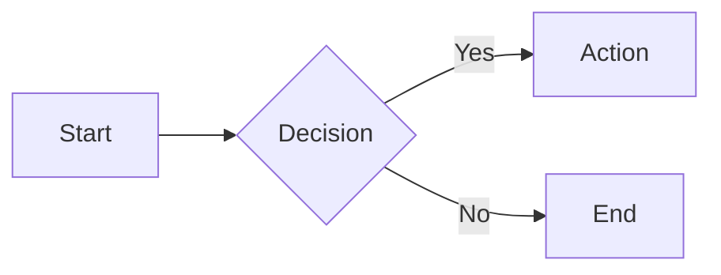
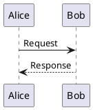

# Markdown Slide Theming & Extensibility Module

## Scope & Ownership

Owns appearance and extension surfaces: diagrams, custom CSS, scoped styling, embedded components, fonts, export, localisation, themes, plugins, and configuration inheritance.

This module is loaded on demand from [Markdown Slide Styling Guidelines](./markdown-slide-styling-guidelines.md), which keeps the binding rules and the index. It carries one responsibility and stays under the 600-line file budget.

---

## Diagrams: Mermaid (fully supported)

````markdown

````

**Diagram types:** `graph`, `flowchart`, `sequenceDiagram`, `classDiagram`, `stateDiagram`, `gantt`, `pie`

---

---

## Diagrams: PlantUML (structural only today)

````markdown

````

**Purpose**: Generates UML diagrams from text syntax

---

---

## Custom CSS Classes (fully supported where expressed via HTML and CSS classes)

**Framework utilities:**
```html
<div class="text-center opacity-50">Centered, semi-transparent</div>
<div class="grid grid-cols-3 gap-4">Three columns</div>
<div class="absolute top-10 right-10">Positioned</div>
```

**Common utilities:** `text-center`, `flex`, `grid`, `absolute`, `relative`, `opacity-*`, `scale-*`

---

---

## Scoped Styling (structural only today)

```markdown
<style scoped>
h1 { color: #667eea; }
section { background: #1a1a2e; }
code { font-size: 1.2em; }
</style>

# Styled Slide
Content affected by scoped styles
```

**Scope:** Applies only to current slide, not globally

---

---

## Embedded Components (structural only today)

**QR Code:**
```html
<QRCode value="https://example.com" :size="200" />
```

**Chart:**
```html
<ChartJS type="bar" :data="{
  labels: ['A', 'B', 'C'],
  datasets: [{ data: [10, 20, 30] }]
}" />
```

**Icons:**
```html
<carbon-logo-github />
<mdi-check-circle class="text-3xl" />
```

---

---

## Font Configuration (structural only today)

```yaml
---
fonts:
  sans: 'Inter'
  serif: 'Merriweather'
  mono: 'Fira Code'
  provider: 'google'
---
```

**Providers:** `google`, `local`, `none`

---

---

## Export Configuration (framework-dependent, structural only)

```yaml
---
download: true
exportFilename: presentation
---
```

**Export commands (framework-dependent):**
```bash
export --format pdf
export --format png
export --format pptx
export --with-clicks
```

---

---

## Multi-language Support (structural only today)

```yaml
---
lang: en-US
# lang: zh-CN
---
```

**RTL support:**
```yaml
---
dir: rtl
lang: ar
---
```

---

---

## Theme Customization (structural only today)

```css
:root {
  --primary-color: #667eea;
  --secondary-color: #764ba2;
  --text-color: #333333;
  --background-color: #ffffff;
  --code-background: #1a1a2e;
}

.slidev-layout {
  font-family: 'Inter', sans-serif;
}

h1 {
  color: var(--primary-color);
}
```

---

---

## Plugin System (framework-dependent, structural only)

```javascript
// config.js
export default {
  plugins: [
    'plugin-qrcode',
    'plugin-charts',
    'plugin-diagrams'
  ]
}
```

**Purpose**: Extends framework capabilities via modular plugins

---

---

## Configuration Inheritance (framework-dependent, structural only)

```yaml
---
extends: ./base.md
---
```

**Purpose**: Reuses common configuration across multiple presentations

**Effect**: Current file inherits settings from base file, overriding as needed

---
