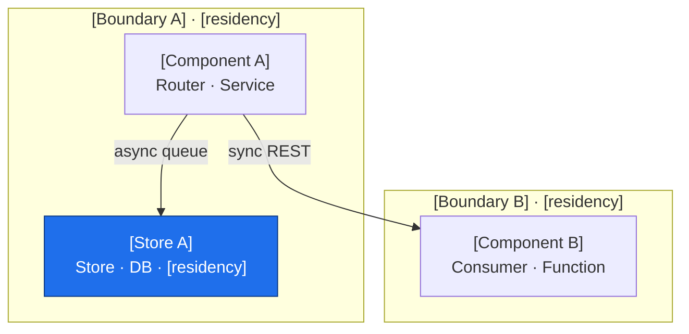
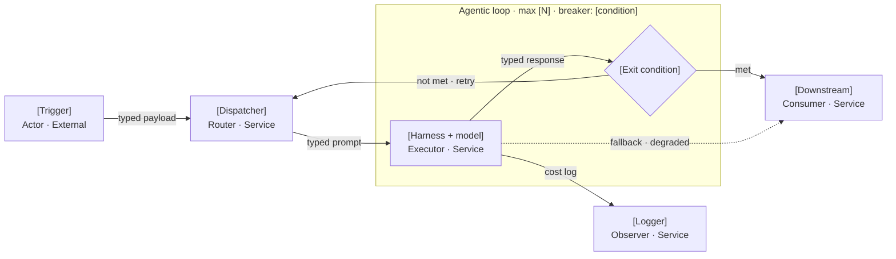
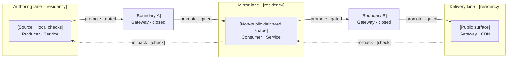
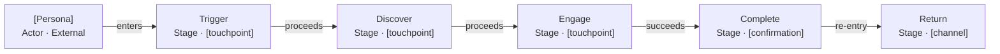
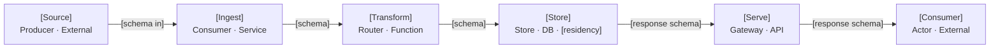
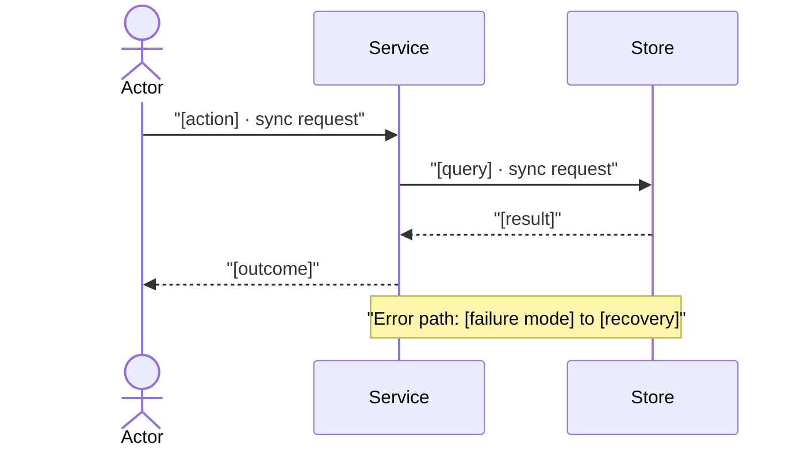
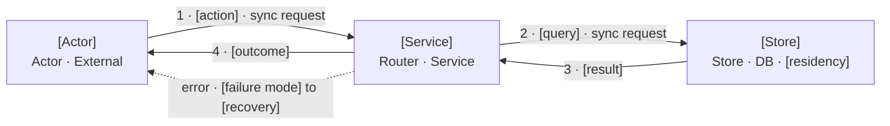
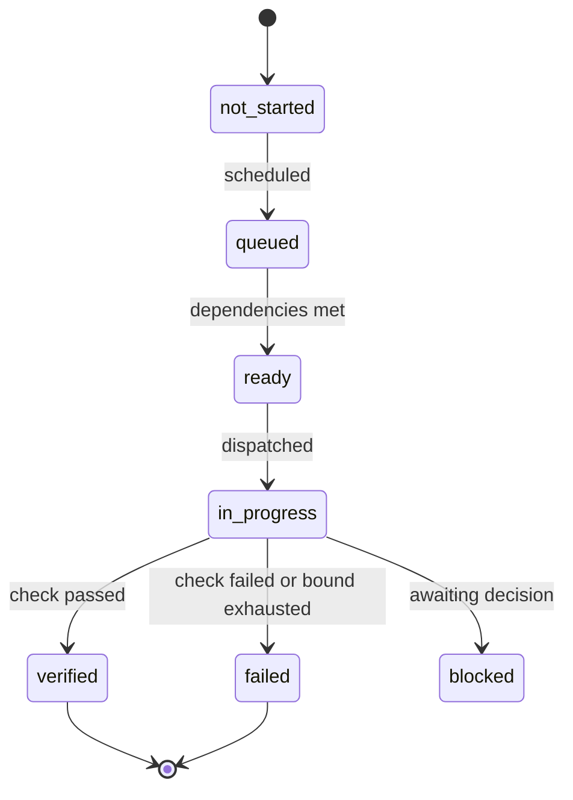
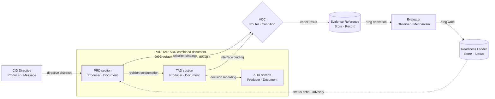

# PRD, TAD & ADR Diagram Templates (Companion)

## Scope & Ownership

This module carries **only templates**. It states no rules of its own: every template here is a copy-ready instance of rules owned elsewhere, and a template that disagrees with its owning rule is a defect in this module, not a permitted variant.

| Concern | Owner |
|---|---|
| Diagram identity, class catalog, notation rules, labelling, complexity budget | **PRD, TAD & ADR Diagram Guidelines** companion |
| Render-target declaration, ingest surfaces, graph element contract, projection rules | **PRD, TAD & ADR Diagram Canvas-Render Contract** companion |
| Document contents, Readiness Ladder, authoring-domain findings | **PRD, TAD & ADR Guidelines** |
| Copy-ready template bodies for every diagram class | **This module** |

Every template is authored to the **portable intersection**: explicit direction, identifier-safe node keys, human text in labels, canonical `|label|` edge form, named boundary groups, `role · type` node labels, and presentation through style or class statements. That intersection is what lets one source satisfy both a static notation renderer and a graph canvas surface.

Placeholders (`[...]`) stand in for product-specific identifiers. Diagram IDs shown (`TOP-1`, `ORC-1`, …) are illustrative; assign your own per the diagram identity contract.

## Module Index

- `scope--ownership` — what this module carries and what it defers
- `template-preamble` — the header, caption, and surface declaration every template assumes
- `runtime-topology` — structural snapshot with boundaries and residency
- `orchestration--harness-flow` — AI control path with bounds and cost log
- `lane--deploy-boundary` — ordered lanes with named, closed-by-default gates
- `journey-stage-map` — persona path to value
- `data-flow` — stage-to-stage movement with schemas
- `user-workflow` — multi-actor sequence, with a portable projecting variant
- `state--lifecycle` — legal states of one entity
- `component-inventory` — the table that pairs with every diagram
- `diagram-register` — the per-document index of diagrams and their surfaces

---

## Template Preamble

Every template below assumes two things already present in the owning document.

**Surface declaration** *(frontmatter, once per document)*:

```yaml
agenticOsCanvasRenderMode: "2d"
agenticOsCanvas2dRenderer: "[primary surface id]"
surfaces:
  - "[primary surface label]"
  - "[secondary surface label]"
```

**Diagram header** *(immediately before every notation block)*:

```markdown
**Diagram [ID]** · Class: [class] · Notation: [notation + direction] · Surface: [primary surface] · Version: [N] — [date]
**Caption**: [What the reader should conclude from this diagram.]
```

---

## Runtime Topology

Class: Runtime topology · Notation: `flowchart TB` · Projects a node-link graph.

```markdown
**Diagram [TOP-1]** · Class: Runtime topology · Notation: flowchart TB · Surface: [primary] · Version: [N] — [date]
**Caption**: [What the reader should conclude.]

| Node | Role | Type | Lane | Connects to | Connection type | Data residency |
|---|---|---|---|---|---|---|
| [Component A] | Router | Service | Authoring | [Component B] | sync REST | [residency] |
| [Store A] | Store | DB | Authoring | — | — | [residency] |
```



---

## Orchestration / Harness Flow

Class: Orchestration / harness flow · Notation: `flowchart LR` · Projects a node-link graph. The loop subgraph carries its bound and circuit-breaker in the group name, so the bound survives projection as cluster identity.

```markdown
**Diagram [ORC-1]** · Class: Orchestration / harness flow · Notation: flowchart LR · Surface: [primary] · Version: [N] — [date]
**Caption**: [Control path, and where token spend is bounded.]
**Topology pattern**: [Sequential | Fan-out/Fan-in | Agentic loop] · **Max iterations**: [N] · **Circuit-breaker**: [condition]
**Token budget**: [avg prompt] + [avg completion] @ [cache hit rate] = [est. cost/call]

| Role | Component | Input schema | Output schema | Cost log | Fallback |
|---|---|---|---|---|---|
| Dispatcher | [Component] | [typed payload] | [routed payload] | — | [typed error] |
| Executor | [Harness + model] | [typed prompt] | [typed response] | required | [degraded / retry] |
| Observer | [Logger] | [cost log stream] | [metric / alert] | — | [silent fail; gap flagged] |
| Consumer | [Downstream] | [typed response] | [artifact / state] | — | [upstream error] |
```



---

## Lane & Deploy Boundary

Class: Lane & deploy boundary · Notation: `flowchart LR` · Projects a node-link graph. Each boundary is its own node so the gate is addressable, and boundary state is in the label so `closed` survives projection.

```markdown
**Diagram [LANE-1]** · Class: Lane & deploy boundary · Notation: flowchart LR · Surface: [primary] · Version: [N] — [date]
**Caption**: [Which boundaries are closed, and what opens them.]

| Boundary | From lane | To lane | Evidence Reference | Operator instruction | Rollback statement | State |
|---|---|---|---|---|---|---|
| [Boundary A] | Authoring | Mirror | [named check + result] | [reference or `none`] | [path + check] | `closed` |
| [Boundary B] | Mirror | Delivery | [named check + result] | [reference or `none`] | [path + check] | `closed` |
```



---

## Journey Stage Map

Class: Journey stage map · Notation: `flowchart LR` · Projects a node-link graph.

```markdown
**Diagram [JRN-1]** · Class: Journey stage map · Notation: flowchart LR · Surface: [primary] · Version: [N] — [date]
**Caption**: [Persona], [goal], and where friction concentrates.

| Stage | Action | Touchpoint | Pain point | Opportunity |
|---|---|---|---|---|
| Trigger | [action] | [entry channel] | [friction] | [improvement] |
| Discover | [action] | [surface] | [friction] | [improvement] |
| Engage | [core task] | [surface] | [friction] | [improvement] |
| Complete | [goal achieved] | [confirmation] | [drop-off risk] | [delight moment] |
| Return | [re-entry] | [channel] | [churn risk] | [retention hook] |
```



---

## Data Flow

Class: Data flow · Notation: `flowchart LR` · Projects a node-link graph.

```markdown
**Diagram [DAT-1]** · Class: Data flow · Notation: flowchart LR · Surface: [primary] · Version: [N] — [date]
**Caption**: [What moves, in what shape, and where it persists.]

| Stage | Component | Input format | Output format | Persistence | Error handling |
|---|---|---|---|---|---|
| Ingest | [Component] | [schema] | [schema] | [none/queue] | [retry/DLQ] |
| Transform | [Component] | [schema] | [schema] | [none/cache] | [retry/fail-fast] |
| Store | [Storage] | [schema] | [schema] | [DB/blob] | [rollback/alert] |
| Serve | [API] | [query params] | [response schema] | [cache/CDN] | [fallback/503] |
```



---

## User Workflow

Class: User workflow. This class has two forms, and the choice is a real tradeoff rather than a preference.

**Form A — sequence notation.** Reads best for multi-actor request/response, and is the right default when the document's only consumer is a static renderer. A sequence kind typically **does not project** into a node-link graph, so on a canvas surface it renders on its own surface and contributes zero graph elements. That is the expected result, not a defect — but do not claim graph projection for it.



**Form B — portable projecting variant.** Use when the workflow must also project onto a graph surface. Actors become nodes, steps become labelled edges, and ordering is carried by edge labels rather than by vertical position.



**Postconditions** *(required in prose beside either form)*: [observable system state after the workflow completes].

---

## State / Lifecycle

Class: State / lifecycle · Notation: `stateDiagram-v2`. Like sequence notation, a state kind commonly renders on its own surface without projecting graph elements; state it as such rather than claiming projection.

```markdown
**Diagram [STA-1]** · Class: State / lifecycle · Notation: stateDiagram-v2 · Surface: [primary] · Version: [N] — [date]
**Caption**: [Which states are terminal, and who may set each transition.]

| From | To | Trigger | Who may set it | Reason recorded |
|---|---|---|---|---|
| [state] | [state] | [event] | [role] | [yes/no] |
```



---

## Component Inventory

The table that pairs with every diagram. Status values are Readiness Ladder rungs only, and local and delivered are separate columns.

```markdown
### Component Inventory — Diagram [ID]

| Layer | Component | Node key | Role · Type | Local rung | Delivered rung |
|---|---|---|---|---|---|
| [layer] | [Component] | `[node_key]` | [role] · [type] | [rung] | [rung] |
```

---

## Diagram Register

One per document that carries any diagram. It is the join target for every canvas render check and the fallback for a reader who cannot see a render.

```markdown
## Diagram Register: [Document Name]

| Diagram | Class | Notation | Surface | Projects | Nodes | Edges | Clusters | Version |
|---|---|---|---|---|---|---|---|---|
| [TOP-1] | Runtime topology | flowchart TB | [surface] | yes | [N] | [N] | [N] | [N] |
| [ORC-1] | Orchestration / harness flow | flowchart LR | [surface] | yes | [N] | [N] | [N] | [N] |
| [WFL-1] | User workflow | sequenceDiagram | [surface] | no | 0 | 0 | 0 | [N] |
```

**Recorded counts are the Evidence Reference** for a canvas-renderable claim. A register row with an empty count column is a `render-proof-absent` finding under the canvas-render contract.

## Reference Architecture Diagram

**Diagram `PRD-TAD-ADR-01`** · Class: Data flow · Notation: `flowchart LR` · Version: 1 — 2026-09-03
**Caption**: `DOC` defaults to `PRD-TAD-ADR` — one combined, non-split document — and a single CID directive traces through its PRD, TAD, and ADR sections to a VCC, an Evidence Reference, and a derived Readiness Ladder rung; the rung echoes back only as an advisory, never as a second status source.



**Data Flow table**

| Node | Role · type | Description |
|---|---|---|
| `CID` | Producer · Message | The dispatched CID directive that opens the authoring loop (Directive Grammar (CID)) |
| `PRD` | Producer · Document | PRD section of the combined document — Context, Intent, Directives, and VCCs |
| `TAD` | Producer · Document | TAD section — consumes the exact PRD revision it names, owns the structural response |
| `ADR` | Producer · Document | ADR section — one grounded decision and its consequences |
| `VCC` | Router · Condition | The evaluable completion condition a PRD/TAD pairing produces |
| `Evidence Reference` | Store · Record | The recorded check result that satisfies a VCC |
| `Evaluator` | Observer · Mechanism | The mechanism that derives `local_rung`/`delivered_rung` from Evidence References only |
| `Readiness Ladder` | Store · Status | The derived rung; never an authored status |

**Directives**:
- Read the solid edges above as the authoring-to-evidence chain and the single dotted edge as the sole advisory relationship in this diagram, per the diagram companion's Labelling Contract; forbid adding a second dotted edge without restating what "advisory" means for it
- Forbid deriving `local_rung` or `delivered_rung` from this diagram directly; the Evaluator's read of Evidence References is the sole source, per Readiness Ladder and the diagram companion's Readiness on Diagrams
- Keep this diagram's `PRD`, `TAD`, `ADR` node set and the Artifact Continuity Authoring Seam's prose in agreement; a node or role named in one and absent from the other is `diagram-spec-drift`

---
