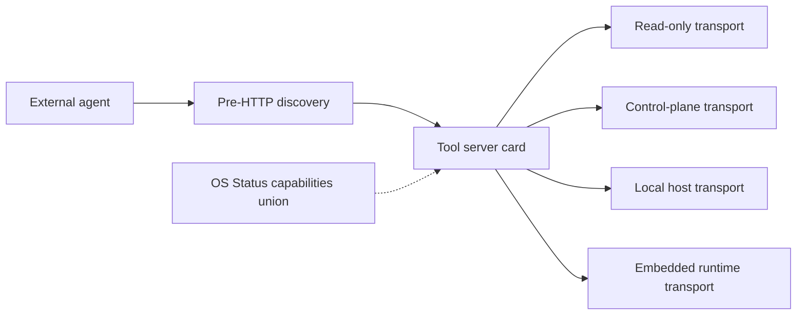

# PRD, TAD & ADR Guidelines

## Scope & Neutrality Contract

- **Universal**: these guidelines apply to any product, domain, language, or runtime; nothing here assumes a specific company, repository, file path, framework, or vendor.
- **Neutral**: name capabilities and roles by their function, never by a brand. Where a concrete tool is shown, it appears only as a non-binding *reference implementation* and may be swapped for any equivalent. Every brand, product, or vendor name must sit under a heading or block whose own text contains the words "reference implementation"; a brand named outside such a label is a `vendor-coupling` finding regardless of surrounding intent.
- **Agnosticity**: requirements are derived from document content and parsed frontmatter only — never from file names, directory layout, or downstream mirrors. Examples use placeholders (`[...]`) rather than real identifiers.
- **Modular**: each `##` section is self-contained and addressable by its heading anchor (see Module Index). Sections may be lifted into another guideline set without rewriting their internals.
- **Enforceable**: every rule in this set is written so a conformance check can record a typed finding against it (see Conformance Findings). A statement that cannot be violated observably is guidance, not a rule, and is labelled as such.

## Module Index

- `scope--neutrality-contract` — universality, neutrality, agnosticity, modularity, enforceability rules
- `rule-identity--classification` — stable rule addressing and the artifact-bearing vs advisory split
- `markdown-yaml-frontmatter-enforcement` — authoring contract for frontmatter SSOT
- `overview` — what PRD/TAD are and the governing standards
- `solo-dev-ai-native-orientation` — the four compounding lenses, harness, orchestration, ROI, FOSS rules, deployment-model TCO variants
- `directive-grammar-cid` — Context/Intent/Directive grammar and sorting
- `from-0-to-1-prd--tad-creation-process` — phase-gated authoring process
- `flow-patterns` — user journey, workflow, data flow, orchestration/harness flow, and topology templates
- `time-to-value` — first-success latency gate, metric, and template (Phase 0 gate + PRD metric)
- `readiness-ladder` — the ordered status vocabulary and the evidence rule that governs each rung
- `agent-platform-readiness` — Agentic OS-, AI Agent-, and MCP Gateway-ready definitions, tiers, and execution order
- `lane-topology--deploy-boundary` — lane sequence, named boundaries, closed-by-default promotion rule
- `autonomous-implementation-verification` — the Verifiable Completion Condition (VCC) primitive, Evidence Reference, criterion completeness, and closure rules
- `as-is--to-be-baseline-contract` — observed / assumed / intended grades, baseline identifiers, and the rung-derivation restriction
- `recorded-tensions` — naming conflicting constraints, the resolving criterion, and resolution annotations
- `deferred-decision-register` — deliberate deferral with a deciding phase, candidates, and the criterion it becomes
- `derived-vocabulary-contract` — derive-don't-duplicate for authored values, and declaring derivation limits
- `cid-directive-matrix` — alphabetical, project-agnostic directive mantras
- `core-templates` — PRD, TAD, and ADR templates
- `architecture-diagram-standards` — diagram format rules
- `prd--tad-integration` — separation of concerns, traceability, and closure rules
- `anti-pattern-guards` — prohibited patterns and their corrections
- `conformance-findings` — the typed finding vocabulary, severities, and recording contract
- `validation-checklist` — pre-implementation, post-documentation, and alignment gates
- `roleactionoutcome` — role-to-deliverable mapping
- `mantra-application` — the framing mantra

**Companion set**: this document is the authority for **authoring** — what a PRD, TAD, or ADR must contain and how conformance is named. Execution — task decomposition, agent roles and independence, tool blast radius, per-task budgets, and run state — is owned by the **Agentic SDLC Guidelines** companion set. Neither set restates the other; each names the other where a rule crosses the boundary. A claim about execution sourced from this document alone is incomplete.

## Rule Identity & Classification

**Makes every individual rule separately addressable and separately classifiable.** Section anchors address a *group* of rules; a conformance check needs to address *one*. Without per-rule identity, two different violations inside one section collapse into a single finding and the regression comparison in Conformance Findings silently stops working.

### Rule Identifier

Every rule carries a **Rule ID** that is stable across edits to unrelated rules:

```
Rule ID = [owning section anchor] + "#" + [ordinal of the rule within that section, in document order]
```

**Directives**:
- Derive the Rule ID from the owning `##` section anchor and the rule's position within that section; forbid deriving it from a file name, a line number, or a directory
- Treat the Rule ID as stable while the rule's own text and owning section are unchanged; inserting an unrelated rule earlier in the same section re-ordinals the rules after it, so record the rule text alongside the ID wherever a finding is stored
- Where two rules in one section carry identical text, disambiguate by ascending document-order ordinal; forbid merging them into one addressable rule
- Use the Rule ID, not the section anchor alone, as the `rule anchor` field of a finding and as a component of the deduplication key
- Rules authored before this section existed inherit their ID by the same derivation; no retroactive hand-labelling is required, and none is permitted to override the derivation

### Artifact-Bearing vs Advisory

Every rule is exactly one of two classes, and the class decides whether an unmet rule is a defect or a preference:

| Class | Definition | Unmet consequence |
|---|---|---|
| **Artifact-bearing** | The rule requires a named, locatable output: a document, a section, a template field, a schema, a diagram, a recorded status, a named check | `unimplemented-guideline` |
| **Advisory** | The rule states a preference, a framing, or a judgement that produces no separately locatable output | No finding; counted as advisory coverage |

**Directives**:
- Classify a rule as artifact-bearing when its text names a produced output; classify it as advisory otherwise; forbid a third class and forbid leaving a rule unclassified
- Derive the class from the rule text, so the classification is recomputable and cannot drift from the rule it describes
- Report the coverage ratio as linked artifact-bearing rules over total artifact-bearing rules; forbid an alignment claim that omits that ratio
- Forbid inflating the defect count by classifying advice as artifact-bearing; a high count achieved that way measures labelling, not conformance
- Count advisory rules separately and report the count; an advisory rule with no artifact is expected, not a gap

---

## Markdown YAML Frontmatter Enforcement

- Canonical PRD, TAD, and combined PRD/TAD Markdown docs must start with a valid YAML frontmatter block as the first block in the file.
- Frontmatter is the SSOT for document identity, status, versioning, renderer activation, and reusable metadata referenced by the body specification.
- Canonical authored PRD/TAD docs use plain YAML for frontmatter and related schema-bearing blocks; do not replace normal authoring syntax with typed wrapper records.
- Normalized `{key, type, value}` wrappers are permitted only in dedicated validation fixtures that explicitly test ingest -> parse -> render or ingest -> parse -> validate fidelity.
- Scalars that contain reserved punctuation, including inline `:` content, must be quoted so strict YAML parsers read planning and architecture metadata deterministically.
- Parser warning, repair, or fallback behavior is recovery-only; malformed YAML frontmatter remains an upstream authoring defect that must be fixed at source.
- **Baseline required keys** for any canonical PRD, TAD, or ADR doc: `title`, `doc_type`, `version` (semantic), `date`, `lang`. Extend with domain-specific keys as needed (e.g. `parent` / `parent_version` for a linked Follow-On PRD/TAD per the Agent-Platform Readiness template) without dropping the baseline set.
- **Conformance keys** are required in addition to the baseline set, because the rules in this guideline set read them and the agnosticity rule forbids recovering them from a path or a directory:

| Key | Value domain | Read by |
|---|---|---|
| `owner` | One named accountable function | `duplicate-owner` |
| `local_rung` | One Readiness Ladder rung | Readiness Ladder, `status-conflict` |
| `delivered_rung` | One Readiness Ladder rung | Readiness Ladder, `blended-status` |
| `lane` | `authoring` \| `mirror` \| `delivery` | Lane Topology & Deploy Boundary |
| `universal_scope` | `true` \| `false` | Scope & Neutrality Contract modularity rule |

- Declare exactly one `owner` per document; two documents claiming ownership of one contract is a `duplicate-owner` finding, and a document with no `owner` cannot be assigned a rung
- Keep `local_rung` and `delivered_rung` as two separate keys; a single blended `status` key is a `blended-status` finding
- Treat every conformance key as derived where a derivation exists: `local_rung` and `delivered_rung` are computed from Evidence References and written back, never authored ahead of the evidence

## Overview

**Product Requirements Documentation (PRD)**: defines user value propositions, specifies acceptance criteria, prioritizes features systematically, aligns stakeholders, validates assumptions iteratively, and maintains bidirectional traceability.

**Technical Architecture Documentation (TAD)**: designs component interactions, specifies integration contracts, documents decision rationale, establishes quality attributes, defines deployment strategies, and traces requirements to implementation.

**Governing standards**: structure documents with user-centric narratives; design architectures with domain-agnostic patterns; specify measurable outcomes; maintain requirement-to-implementation traceability; apply iterative refinement; separate concerns systematically.

**Enforceability**: these standards are written to be checked, not only read. Each rule is phrased so a violation is observable, each violation has a name and a severity (see Conformance Findings), each readiness claim is a value derived from recorded evidence (see Readiness Ladder), and each step toward a public surface passes a named gate that is closed by default (see Lane Topology & Deploy Boundary). A rule that cannot fail a check is guidance; this set labels the difference rather than blurring it.

**Solo-dev AI-native orientation**: these guidelines are calibrated for a solo founder or small team operating an AI-native product stack. Every decision is evaluated through four compounding lenses — **min-viable-max-value** (ship the smallest artifact that delivers the largest user impact), **TCO-zero** (prefer FOSS and zero-egress infrastructure; make cost a first-class architectural constraint), **token economics** (treat LLM token consumption as a measurable engineering metric at every pipeline boundary), and **harness-first** (orchestrate AI capabilities through composable, observable harnesses rather than ad-hoc prompt calls). These lenses do not replace the core PRD/TAD standards — they sharpen prioritization, constrain architecture choices, and accelerate validation cycles.

---

## Solo-Dev AI-Native Orientation

### Four Compounding Lenses

| Lens | Definition | Applied In |
|---|---|---|
| **Min-Viable-Max-Value** | Ship the smallest scope that maximises user impact per hour invested | Phase 0 validation, MoSCoW, success metrics |
| **TCO-Zero** | Total cost of ownership defaults to zero; every paid dependency requires explicit justification against a FOSS alternative | Phase 0 gate, ADR, Quality Attributes |
| **Token Economics** | LLM token consumption (input + output + cache hit rate) is a measurable system metric, not an afterthought | Data flows, Component specs, Quality Attributes |
| **Harness-First** | AI capabilities are accessed through structured, observable harnesses (typed inputs → typed outputs → logged decisions) rather than raw prompt calls | TAD components, Integration contracts, orchestration diagrams |

### Guideline Load Budget

Token economics applies to this guideline set itself, not only to the product pipelines it governs. A guideline set that must be loaded whole on every authoring turn taxes every turn.

| Phase | Sections to load | Rationale |
|---|---|---|
| Phase 0 | `solo-dev-ai-native-orientation`, `time-to-value` | ROI, TCO, TTV ceiling only |
| Phase 1 | `core-templates` (PRD), `flow-patterns` (journey), `time-to-value`, `as-is--to-be-baseline-contract`, `recorded-tensions`, `deferred-decision-register` | Authoring the PRD |
| Phase 2 | `core-templates` (TAD, ADR), `flow-patterns` (all), `readiness-ladder`, `lane-topology--deploy-boundary`, `agent-platform-readiness`, `derived-vocabulary-contract`, `deferred-decision-register` | Authoring the TAD |
| Phase 3 | `rule-identity--classification`, `conformance-findings`, `validation-checklist`, `autonomous-implementation-verification`, `recorded-tensions`, `deferred-decision-register` | Running the alignment check |
| Phase 4 | `conformance-findings`, `readiness-ladder`, `as-is--to-be-baseline-contract` | Re-derivation and regression comparison |
| Any phase | `scope--neutrality-contract`, `module-index` | Always in scope; smallest sections in the set |

**Directives**:
- Load by section anchor for the current phase; forbid loading the whole set as a precondition for a single-phase task
- Keep `scope--neutrality-contract` and `module-index` small enough to be always-loaded; a growing contract section raises the floor cost of every turn
- Record the guideline load cost as a line item in the authoring loop's token budget; an unmeasured compliance cost is an `missing-economics-metric` against the process, not only against the product
- Prefer adding a new `##` section over lengthening an existing one, so phase-scoped loading stays possible; this is the modularity rule expressed as a cost constraint

### AI-Native Harness Pattern

Every AI-powered component in the TAD must conform to the harness contract:

```
Caller → [Harness: schema-validated input] → [LLM / model] → [Harness: schema-validated output + cost log] → Consumer
```

**Harness requirements**:
- Input schema validated before token spend; reject malformed inputs without calling the model
- Output schema validated after response; surface structured errors, not raw LLM failures
- Cost log emitted per call: `{ model, prompt_tokens, completion_tokens, cache_hits, estimated_cost_usd }`
- Fallback path defined for every harness: degraded-mode response or upstream error propagation

### Orchestration Topology

Document AI orchestration as one of three patterns:

| Pattern | Structure | When to Use |
|---|---|---|
| **Sequential** | A → B → C, each harness feeds the next | Single-path pipelines, linear enrichment |
| **Fan-out / Fan-in** | A → [B, C, D] → E aggregates | Parallel model calls, ensemble scoring |
| **Agentic loop** | A → decision → [branch or retry] → exit condition | Multi-step reasoning, tool-use agents, completion-condition-driven tasks |

Render orchestration topology as a `flowchart LR` or `sequenceDiagram` in the TAD. Every loop must specify a **max-iteration bound** and a **circuit-breaker condition** to cap runaway token spend.

### ROI Calculation Template

For every feature, estimate return on investment before implementation:

```
ROI Score = (User Impact × Reach) / (Build Hours + Monthly TCO + Token Cost / Month)

User Impact : 1–5 scale (pain severity × frequency)
Reach       : estimated monthly active users or sessions
Build Hours : solo-dev estimate including documentation
Monthly TCO : infrastructure + API cost at target load
Token Cost  : estimated tokens/month × model price/1M tokens
```

Features below ROI threshold (solo-dev or team-defined) are deferred to `Could / Won't` in MoSCoW. Document the calculation in the PRD success metrics section.

### FOSS-First Decision Rule

When selecting any dependency, library, or infrastructure component:
1. **Identify FOSS alternatives** — document at least one in every ADR
2. **Default to FOSS** unless the proprietary option provides >2× value at <0.5× TCO over 12 months
3. **Prefer zero-egress** storage and CDN over metered alternatives
4. **Record the decision** in the ADR with explicit TCO comparison at projected scale
5. **Compare deployment models within each candidate** — see Deployment-Model TCO Variants below; do not collapse a candidate's managed and self-managed variants into a single TCO figure

### Deployment-Model TCO Variants

A single infrastructure candidate (a vendor, a FOSS stack, or a hosting category) frequently offers more than one **deployment model**, and each model carries a distinct cost and operations profile. Collapsing these into one TCO figure hides material tradeoffs. Evaluate deployment models by function, never by brand:

| Deployment Model | Definition | Cost Profile | Ops Profile |
|---|---|---|---|
| **Managed / Serverless** | Provider operates the runtime; caller pays per invocation, request, or consumed resource | Scales to zero; no idle cost; per-unit price may exceed provisioned equivalents at sustained high load | Near-zero ops burden; provider handles patching, scaling, failover |
| **Provisioned / Self-Managed** | Team operates a fixed-capacity runtime (a VM, container host, or cluster) directly | Fixed cost regardless of utilization; cheaper per-unit at sustained high load; idle capacity is wasted spend | Full ops burden: patching, backup, failover, capacity planning are the team's responsibility |
| **Hybrid / Consolidated** | Multiple workloads share one provisioned runtime to amortize its fixed cost | Fixed cost divided across workloads; total drops as more workloads consolidate | Ops burden of one Provisioned/Self-Managed runtime, not one per workload |

**Directives**:
- When an ADR or infrastructure comparison names a candidate that offers both a Managed/Serverless and a Provisioned/Self-Managed variant, present both as separate rows or columns; forbid a single blended TCO number that hides which variant it assumes
- State the ops-burden delta explicitly (e.g. "near-zero" vs "manual patching, backup, and failover"), not only the cost delta; a cheaper provisioned variant with unaccounted ops burden is not a valid FOSS-first justification
- When a Provisioned/Self-Managed total is computed by summing per-service costs independently, add a Hybrid/Consolidated estimate showing the realistic total once workloads share the same provisioned runtime; forbid presenting only the unconsolidated sum when consolidation is operationally realistic
- Apply this comparison symmetrically: a zero-egress managed candidate must still be compared against the self-managed variant of every alternative under consideration, not only against that alternative's managed variant

---

## Directive Grammar (CID)

Every directive in this guideline set is expressed with a uniform, project-agnostic grammar so it can be lifted into any context unchanged. The `CID Directive Matrix` section applies this grammar.

### Definition
- **Context**: focus domain of concern
- **Intent**: desired principle or guiding goal
- **Directive**: explicit prohibition or required safeguard

### Sorting
Each entry is organized alphabetically (A→Z) for clarity and neutrality.

---

## From 0 to 1: PRD & TAD Creation Process

A sequential, phase-gated process for producing aligned PRD and TAD from scratch.

### Phase 0 — Problem Discovery
**Before writing any document, validate the problem exists.**

1. Identify target personas and their pain points via research
2. Quantify problem impact with observable metrics
3. Map the current user journey to locate friction points
4. State a falsifiable problem hypothesis
5. Gain stakeholder alignment on problem scope
6. Run a preliminary **ROI score** and **TCO estimate**; confirm problem is worth solving at projected cost
7. Identify whether the solution requires an AI harness, FOSS tools, or proprietary APIs — flag any dependency with non-zero egress or token cost
8. Estimate **time-to-value (TTV)**: count the minimum steps a target persona must complete from zero state (prerequisites installed, no configuration done) to first successful outcome; set an acceptable TTV ceiling before Phase 1 begins; flag if TTV exceeds threshold

**Gate**: proceed only when problem is validated, scoped, ROI-positive at estimated TCO, and TTV is within acceptable ceiling.

### Phase 1 — PRD Authoring
**Translate validated problems into structured requirements.**

1. Write problem statement: pain point → user impact → opportunity
2. Define personas with jobs-to-be-done
3. Map user journey: trigger → steps → decision points → outcome
4. Decompose epics into user stories (As a… I want… So that…)
5. Write Given-When-Then acceptance criteria per story
6. Apply MoSCoW prioritization to feature set **with explicit ROI score and TCO estimate per feature**; use **min-viable-max-value** framing — default to the smallest scope delivering the highest impact
7. Define success metrics: baseline → target → timeline; include **token cost / month**, **monthly TCO**, and **time-to-value (TTV)** as first-class metrics for any AI-powered feature
8. Enumerate scope boundaries and explicit exclusions
9. Log open questions and unresolved assumptions
10. Flag every dependency: FOSS, zero-TCO, or justify proprietary selection inline

**Gate**: architects review PRD for technical feasibility **and TCO/token-budget alignment** before Phase 2.

### Phase 2 — TAD Authoring
**Translate PRD requirements into verifiable architecture.**

1. Derive component list from PRD epics and acceptance criteria
2. Assign single responsibility to each component (SRP)
3. Map data flows: source → transform → store → consume
4. Specify integration contracts: protocol, payload schema, error handling
5. Map user workflows to system sequence diagrams
6. Map **Orchestration/Harness Flow** for every AI-powered pipeline: define dispatcher, executor, observer, and consumer roles; specify routing logic, max-iteration bound, and circuit-breaker condition
7. Map **Topology**: enumerate all runtime components, their lane, their connection types (sync/async/stream), trust boundaries, and data residency; then map **Lane Topology & Deploy Boundary** for the movement between lanes
8. Document architectural decisions with ADR format; **every ADR must include a TCO comparison and FOSS-first evaluation**
9. Define quality attribute scenarios: performance, security, scalability, observability, **token cost, TCO**
10. Design AI-powered components as **harnesses** (typed input schema → model call → typed output schema → cost log); specify the orchestration topology (sequential / fan-out / agentic loop) and **max-iteration bound** for every loop
11. Estimate **token budget per pipeline**: average prompt tokens + completion tokens + cache hit rate at target load; flag pipelines exceeding budget threshold
12. Plan deployment strategy and migration path; default to zero-egress infrastructure
13. Render architecture diagrams (Mermaid); compile component inventory table
14. Derive Verifiable Completion Conditions (VCCs) from acceptance criteria — each criterion must be expressible as a condition an autonomous agent can evaluate from its own surfaced output

**Gate**: product manager validates TAD preserves user value **and** ROI/TCO envelope before Phase 3.

### Phase 3 — Alignment & Review
**Verify PRD ↔ TAD coherence and stakeholder sign-off.**

1. Establish bidirectional traceability: `PRD-[Epic]-[Story] ↔ TAD-[Component]-[Interface]`
2. Confirm no implementation detail in PRD; no business logic in TAD
3. QA validates all acceptance criteria are testable **and expressible as VCCs** — each criterion must have a stated check the agent can surface in its own output (exit code, file count, test result, queue state)
4. Stakeholders approve scope and success metrics; **confirm token budget, TCO, and TTV target are within acceptable envelope**
5. Verify every AI-powered component has a harness contract, orchestration topology, and max-iteration bound documented
6. Confirm Topology diagram is present and data residency is stated for every storage node
7. Confirm agent-platform readiness dimensions in scope are documented with tier (Must/Follow-on), execution order, and VCCs per dimension
8. Confirm FOSS-first decisions are recorded in ADRs with explicit TCO comparison
9. Run the **alignment check**: verify closure in both directions per the Closure Rules, confirm every readiness rung is derived from an Evidence Reference, and record the resulting findings with their types and severities
10. Confirm every lane and Deploy Boundary is documented and that every boundary reads `closed` absent a referenced operator instruction
11. Resolve or formally track all open questions

**Gate**: both documents version-stamped and baselined, and the alignment check reporting zero `blocker` findings, before implementation begins.

### Phase 4 — Living Documents
**Iterate documents as product and architecture evolve.**

- Apply semantic versioning to every change
- Update PRD and TAD together whenever requirements shift
- Re-run relevant gate reviews for breaking changes
- Archive superseded ADRs; do not delete
- Re-derive VCCs whenever acceptance criteria change; stale conditions produce false completions
- **Re-derive every readiness rung** whenever a VCC or an Evidence Reference changes; a rung is a computed value, so leaving it pinned after the evidence moves is a false completion
- **Re-run the alignment check** on every baselined change and compare the finding set against the prior run; a new `blocker` finding is a regression, not a note
- **Bound the iteration**: each Phase 4 revision cycle carries a max-iteration bound and a circuit-breaker, exactly as required of every other loop in this guideline set. The default circuit-breaker is *no reduction in open `blocker` findings across two consecutive cycles*; on breaking the circuit, stop revising and escalate the unresolved findings as a scope or design decision rather than continuing to iterate
- **Track token cost actuals vs estimates** each sprint; update budget projections when model pricing or traffic changes
- **Re-evaluate FOSS alternatives** whenever a dependency's TCO crosses the 12-month justification threshold

---

## Flow Patterns

Five canonical flow types bridge user intent (PRD) to system behavior (TAD). Every feature must trace through all five.

### User Journey Flow
**Maps how a persona moves from trigger to outcome across system touchpoints.**

```
Persona → Trigger → Step 1 → [Decision?] → Step N → Outcome → Value / Emotion
```

**User Journey Template**:
```markdown
## Journey: [Persona] — [Goal]

| Stage    | Action               | Touchpoint        | Pain Point      | Opportunity      |
|----------|----------------------|-------------------|-----------------|------------------|
| Trigger  | [What prompts user]  | [Entry channel]   | [Friction]      | [Improvement]    |
| Discover | [User action]        | [UI/API/surface]  | [Friction]      | [Improvement]    |
| Engage   | [Core task]          | [UI/API/surface]  | [Friction]      | [Improvement]    |
| Complete | [Goal achieved]      | [Confirmation]    | [Drop-off risk] | [Delight moment] |
| Return   | [Re-entry trigger]   | [Channel]         | [Churn risk]    | [Retention hook] |
```

**Directives**:
- Map journeys before writing user stories; every story must be anchored to a journey stage
- Capture emotion and friction at each stage; forbid journey-free feature specifications
- One journey per persona-goal pair; forbid omnibus journeys combining multiple goals

### Workflow Flow
**Maps how tasks sequence through actors, decisions, and system states.**

```
Trigger → [Actor: Task] → [Decision ◇] → [Branch] → Output → Next Actor
```

**Workflow Template**:
```markdown
## Workflow: [Name]

**Trigger**: [Event or condition initiating the workflow]
**Actors**: [Human roles and system components involved]

**Happy Path**:
1. [Actor] performs [action] → [system state changes]
2. [System] processes [input] → [output artifact]
3. [Actor] receives [output] → workflow complete

**Alternate Paths**:
- [Condition]: [divergent steps] → [resolution]

**Error Paths**:
- [Failure mode]: [error handling] → [recovery or escalation]

**Postconditions**: [Observable system state after workflow completes]
```

**Directives**:
- Every workflow must define: trigger, happy path, at least one alternate path, at least one error path, and postconditions
- Forbid workflows without defined postconditions
- Use `sequenceDiagram` for multi-actor workflows; use `flowchart` for single-actor task flows

### Data Flow
**Traces how data moves from source through transformation to consumption.**

```
Source → [Ingest] → [Transform] → [Store] → [Serve] → Consumer
```

**Data Flow Template**:
```markdown
## Data Flow: [Name]

| Stage     | Component        | Input Format     | Output Format    | Persistence       | Error Handling    |
|-----------|------------------|------------------|------------------|-------------------|-------------------|
| Ingest    | [Component]      | [Schema/format]  | [Schema/format]  | [None/queue/db]   | [Retry/DLQ/skip]  |
| Transform | [Component]      | [Schema/format]  | [Schema/format]  | [None/cache]      | [Retry/fail-fast] |
| Store     | [Storage layer]  | [Schema/format]  | [Schema/format]  | [DB/blob/index]   | [Rollback/alert]  |
| Serve     | [API/stream]     | [Query params]   | [Response schema]| [Cache/CDN]       | [Fallback/503]    |
```

**Directives**:
- Specify data schema at every stage boundary; forbid undocumented format transitions
- Document persistence layer and retention policy for every Store stage
- Map every TAD data flow to a PRD user journey stage; forbid orphaned data flows

### Orchestration/Harness Flow
**Maps how an agent harness routes, dispatches, executes, and observes AI calls through a pipeline.**

Distinct from Workflow (task-actor sequencing) and Data Flow (data movement): Orchestration/Harness Flow traces the *control path* — how inputs are validated, which executor handles them, how outputs are verified, and how cost is observed.

```
Trigger → [Harness: validate input] → [Dispatcher/Router] → [Executor: model call] → [Harness: validate output + emit cost log] → [Consumer] ↘ [Observer/Logger]
```

**Orchestration/Harness Flow Template**:
```markdown
## Orchestration/Harness Flow: [Pipeline Name]

**Trigger**: [Event or condition initiating the pipeline]
**Topology pattern**: [Sequential | Fan-out/Fan-in | Agentic loop]
**Max iterations** *(loops only)*: [N] | **Circuit-breaker**: [exit condition]
**Token budget**: [avg prompt tokens] + [avg completion tokens] @ [cache hit rate] = [est. cost/call]

| Role       | Component          | Input schema        | Output schema       | Cost log emitted | Fallback                    |
|------------|--------------------|---------------------|---------------------|------------------|-----------------------------|
| Dispatcher | [Component]        | [Typed payload]     | [Routed payload]    | —                | [Reject with typed error]   |
| Executor   | [Harness + model]  | [Typed prompt]      | [Typed response]    | ✓ (required)     | [Degraded mode / retry / upstream error] |
| Observer   | [Logger / monitor] | [Cost log stream]   | [Metric / alert]    | —                | [Silent fail; log gap]      |
| Consumer   | [Downstream]       | [Typed response]    | [Artifact / state]  | —                | [Upstream error propagation]|
```

**Happy path** *(inline after table)*:
1. Trigger fires → Dispatcher validates input schema → routes to Executor
2. Executor calls model → Harness validates output schema → emits cost log
3. Observer records cost log → Consumer receives typed output
4. If loop: evaluate exit condition; if not met and iterations < max → repeat from step 1

**Alternate paths**:
- Input schema invalid: Dispatcher rejects before token spend; returns typed error upstream
- Output schema invalid: Harness retries up to N; escalates to fallback after max retries
- Max iterations reached without meeting circuit-breaker: exit with partial result; surface iteration-limit error

**Error paths**:
- Model API unavailable: Executor fallback activates; degraded response or upstream error propagated
- Cost log emission fails: Observer silent-fails; pipeline continues; gap flagged in monitoring

**Postconditions**: cost log persisted; typed output delivered to Consumer or typed error returned; no unbounded token spend

**Directives**:
- Document an Orchestration/Harness Flow for every AI-powered pipeline before implementation; forbid AI pipelines with no flow spec
- Every Executor role must emit a cost log entry per call; forbid Executor nodes with no cost log field
- Every agentic loop must state max iterations and a circuit-breaker condition in the flow template; forbid unbounded loops
- Map every Orchestration/Harness Flow to its parent Workflow and its Data Flow; forbid orphaned harness flows with no journey anchor
- Render Orchestration/Harness Flows with `sequenceDiagram` (multi-actor) or `flowchart LR` (single-path); use subgraphs to bound loop sections

### Topology
**Maps the structural connection and runtime placement of all components at a stated point in time.**

Distinct from Orchestration/Harness Flow (execution sequence) and Data Flow (data movement): Topology is a *structural snapshot* — which components exist, where they run, how they connect, and where data lives.

```
[Boundary: runtime / zone / trust domain]
  └─ [Node A: role · type] ──sync──▶ [Node B: role · type]
                            ──async─▶ [Node C: role · type] ──▶ [Store D: persistence type · residency]
```

**Topology Template**:
```markdown
## Topology: [System Name] v[version] — [Date or milestone]

**Boundaries**: [Runtime environments, network zones, or trust domains in scope]

| Node        | Role                                         | Type                         | Lane                | Connects to   | Connection type     | Data residency     |
|-------------|----------------------------------------------|------------------------------|---------------------|---------------|---------------------|--------------------|
| [Component] | [Producer / Consumer / Router / Store / Gateway] | [Service / Function / DB / Queue / CDN] | [Authoring / Mirror / Delivery] | [Node(s)] | [Sync REST / Async queue / Stream / Batch] | [Local / Region / Cloud provider] |

**Runtime diagram**: [Mermaid `flowchart TB` — nodes grouped by boundary using subgraphs]
**Version notes**: [What changed from prior topology version]
```

**Directives**:
- Document topology for every system with ≥3 components; forbid undocumented multi-component connection maps
- Name every connection type explicitly (sync REST, async queue, event stream, batch job); forbid implicit or unlabelled connections
- State data residency for every storage node; forbid topology diagrams with unlocated data stores
- Map every Topology node to a Component Specification in the TAD; forbid topology nodes without a corresponding TAD entry
- Version-stamp every topology update; archive prior versions; forbid in-place overwrites without a version note
- Render Topology with `flowchart TB` using subgraphs per boundary; forbid mixing topology with data flow or sequence diagrams

---

## Time-to-Value

**Time-to-value (TTV)** measures the minimum number of steps and elapsed time for a target persona to move from zero state to first successful outcome.

TTV is not a flow diagram — it is a gate metric that governs all five Flow Patterns. It is estimated in Phase 0, stated as a target in PRD success metrics, and validated by tracing the shortest possible path through the User Journey Flow, Workflow Flow, and Orchestration/Harness Flow end-to-end.

```
T₀ (zero state: prerequisites only, no config) → T₁ (install / configure) → T₂ (first input) → T✓ (first successful outcome)

TTV = T✓ − T₀   (elapsed clock time for target persona)
TTV steps = count of distinct manual actions between T₀ and T✓
```

**TTV Template** *(recorded in PRD success metrics)*:
```markdown
## Time-to-Value: [Feature / Product]

| Dimension          | Estimate      | Target ceiling | Validation method          |
|--------------------|---------------|----------------|----------------------------|
| TTV steps          | [N steps]     | [≤ N steps]    | Walk-through on clean env  |
| TTV elapsed time   | [N min]       | [≤ N min]      | Timed first-run test       |
| First-value action | [Description] | —              | Observable output defined  |
| Persona            | [ID]          | —              | Persona defined in PRD     |
```

**Directives**:
- Estimate TTV steps and elapsed time in Phase 0 before writing any PRD story; flag if TTV exceeds the acceptable ceiling
- Include TTV as a named row in PRD success metrics; forbid success metric tables without a TTV entry for any user-facing feature
- Validate TTV on a clean environment before Phase 3 sign-off; forbid TTV estimates that have never been walked through
- Reduce TTV by shortening the Orchestration/Harness Flow (fewer required inputs before first output) and the Topology (fewer required services before first run); forbid TTV reductions that compromise security or data integrity

---

## Readiness Ladder

**Defines the single ordered status vocabulary used by every readiness claim in this guideline set, and binds each rung to the evidence that earns it.** Any section that states a status — Readiness Tiers, Readiness Gap Matrix, Component Inventory, Follow-On PRD/TAD — draws its value from this ladder and no other.

A status is a **derived** value, never an authored opinion. It is computed from the Evidence References attached to a capability (see Autonomous Implementation Verification). Writing a rung by hand without the evidence that earns it is an `unproven-claim`.

### The Ladder

Strictly ordered, lowest to highest:

```
undocumented  <  spec-complete  <  dev-proven  <  runtime-ready  <  production-verified
```

| Rung | Earned when | Evidence required |
|---|---|---|
| **`undocumented`** | The capability has no VCC and no Evidence Reference | — |
| **`spec-complete`** | At least one VCC is stated; no Evidence Reference yet satisfies it | VCC present, unproven |
| **`dev-proven`** | At least one VCC is satisfied by a reproducible local check with a recorded result | ≥1 local Evidence Reference |
| **`runtime-ready`** | **Every** VCC attached to the capability carries a satisfying Evidence Reference | Complete local evidence set |
| **`production-verified`** | The capability is `runtime-ready` **and** carries a recorded delivery-surface check result **and** a referenced explicit operator promotion instruction | Complete evidence + delivery proof + operator instruction |

### Directives

- Assign exactly one rung per capability; forbid ranges, hedges, and compound values such as "mostly runtime-ready"
- Derive every rung from Evidence References only; forbid deriving a rung from a file name, a directory layout, a downstream mirror, or a narrative claim
- Report **local readiness** and **delivered readiness** as two separate fields; forbid one status field that blends them (`blended-status`)
- Treat the ladder as monotone under evidence: adding an Evidence Reference while retaining every existing one must never lower a rung; a drop under added evidence is a defect in the derivation, not a status change
- Never skip a rung: `production-verified` requires the `runtime-ready` condition to hold first
- A claim of `runtime-ready` with any unproven VCC is an `unproven-claim` at `blocker` severity; a claim of `production-verified` with no referenced operator promotion instruction is an `ungated-promotion`
- Re-derive every rung whenever acceptance criteria or VCCs change (see Phase 4); a stale rung produces a false completion
- Declare a status value outside this ladder only after extending this section; an unrecognised value is an `unknown-status`

---

## Agent-Platform Readiness

**Maps how a product documents and delivers three complementary readiness dimensions for AI-native systems: unified operator visibility (Agentic OS), external agent onboarding (AI Agent), and tool-surface federation (MCP Gateway).** This section is vendor-, protocol-, and repository-neutral. Placeholders (`[...]`) stand in for product-specific identifiers; concrete stacks appear only as non-binding reference patterns.

### Readiness Dimensions

| Dimension | Function (neutral name) | Primary consumer | Default token cost | Spend boundary |
|---|---|---|---|---|
| **Agentic OS-ready** | **OS Status Surface** — read-only aggregation over existing harness run state, capability catalogs, cost ledgers, approval-gate catalogs, and circuit-breaker bounds | Operator, maintainer | **$0** — zero model calls on every view | Read-only; must not issue, verify, or consume approval tokens |
| **AI Agent-ready** | **Agent Discovery Surface** — machine-discoverable metadata, typed harness contracts, and callable tool surfaces segmented by trust boundary | External agent, MCP host, browser agent | **$0** on discovery; harness-dependent on execution | Discovery paths must not invoke paid models; execution routes through existing spend gates |
| **MCP Gateway-ready** | **Gateway Federation Contract** — coordinated routing across multiple existing tool transports without a new monolithic proxy tier | External agent resolver | **$0** on federation/discovery | Orchestration/spend routes to the control-plane surface; read-only routes to discovery surfaces |

**Directives**:
- Name all three dimensions in PRD scope or explicit exclusions; forbid ambiguous “agent-ready” claims that do not state which dimension(s) are in scope
- Derive readiness from document content and frontmatter only; forbid inferring readiness from directory layout, file names, or downstream mirrors
- Each dimension must be expressible as VCCs, and each VCC must carry an Evidence Reference, before status is promoted to `runtime-ready` on the Readiness Ladder
- State each dimension's rung using Readiness Ladder values only; forbid dimension-local status vocabularies

### Readiness Tiers

| Tier | Definition | Typical PRD home | Promotion gate | Minimum rung to exit |
|---|---|---|---|---|
| **Must** | Smallest artifact that makes the dimension truthful at demo/load: visibility, discovery, or federation without new persistent stores or proxy tiers | Combined PRD/TAD or product PRD | VCC proof on clean environment with a recorded Evidence Reference; TTV recorded | `runtime-ready` |
| **Follow-on** | Closes spend-safety, live orchestration, or operator-UI gaps left open by Must-tier | Separate follow-on PRD/TAD linked from parent | VCC proof per track with a recorded Evidence Reference; no Must-tier rung regression | `runtime-ready` per track |
| **Won't (this increment)** | Explicit deferrals: monolithic proxy gateway, unbounded remote tool parity, auto-approval | Parent PRD Out of Scope | — | `undocumented` (declared, not implied) |

### Agentic OS-Ready

The **OS Status Surface** exposes one or more read views (e.g. process list, capability union, cost summary, gate catalog, circuit breakers) over state that **already exists** in harness runtimes — computed at read time, not copied into a new OS-level database.

**Agentic OS Template**:
```markdown
## Agentic OS: [Product / Feature Name]

**Tool surface**: `[...]` (single combined tool with `view` argument **or** separate per-view tools — document choice in ADR)
**Read views**: `[process_list | capabilities | cost_summary | gate_catalog | circuit_breakers | ...]`
**Aggregation rule**: read-time only; zero new persistent datastore
**Token budget**: 0 prompt + 0 completion = $0.00 / call (non-zero cost log = defect)
**Partial failure**: `unavailableSources[]` / `unreachableCatalogs[]` / `validationFailures[]` — call succeeds; omitting a source is not a silent success

### Acceptance (example)
**Given** readable harness state exists **When** OS Status Surface is called **Then** normalized entries return and no harness state file is modified

> **VCC**: `Verify [view] response shape matches schema and before/after snapshot diff of every read harness state source is empty`
```

**Directives**:
- Prefer one combined OS Status tool with a typed `view` enum when wiring surface is the constraint; document the ergonomics tradeoff in an ADR
- Gate Catalog views are read/describe-only unless a separate story explicitly adds token issuance
- Map every OS read view to Orchestration/Harness Flow (zero-token sequential, max 1 iteration)

### AI Agent-Ready

**AI Agent-ready** means an external agent can **discover**, **select the correct surface**, and **invoke typed tools** without scraping HTML or learning each harness catalog independently.

**Discovery chain** (reference pattern — adapt transport names to product):

```
Resolver → [Pre-HTTP discovery metadata] → [Service entry + link headers] → [Machine-readable tool card]
         → [OS Status `capabilities` view **or** equivalent catalog union] → Surface selection by trust boundary
```

**Surface selection by trust boundary** (document in TAD topology):

| Trust need | Route to | Typical scope |
|---|---|---|
| Read-only public content | Discovery / read transport | Search, fetch, metadata |
| Approval-gated orchestration | Control-plane transport | Multi-stage harness runs, spend-bearing tools |
| Richest local/dev surface | Local host transport | Full harness set not exposed remotely by design |
| In-browser inspection | Embedded runtime transport | Page-local read tools |

**Directives**:
- Document surface separation explicitly; forbid claiming one transport exposes the full harness set when policy restricts remote parity
- Every public discovery path must spend **zero LLM tokens** before optional chat/orchestration
- Agent Discovery Surface metadata must stay aligned with the canonical tool contract owner; forbid duplicate schema registries

### MCP Gateway-Ready

**MCP Gateway-ready** does not require a fifth monolithic proxy. The **Gateway Federation Contract** coordinates **existing** transports under shared tool/cost/approval schemas.

**Anti-pattern**: single unified proxy that re-implements dispatch already owned by local and control-plane servers — duplicates schema maintenance, adds latency, and splits token accounting.

**Preferred pattern — discovery-first federation**:



**Gateway Federation Template**:
```markdown
## Gateway Federation: [System Name]

**Surfaces in federation**: [N] (list role + transport type each)
**Catalog union source**: [OS Status capabilities view | equivalent]
**Routing rule**: [trust boundary → surface matrix]
**Excluded**: monolithic proxy tier (ADR required if ever reconsidered)
```

**Directives**:
- Enumerate every federated surface in Topology with connection type and data residency
- Record gateway federation decision in ADR with TCO comparison vs unified-proxy alternative
- Capabilities union must deduplicate by tool id and name contributing catalogs in `sourceCatalogs[]` (or equivalent)

### Execution Order Guidelines

Readiness work follows a **dependency-ordered sequence**. Must-tier dimensions ship before Follow-on tracks; tracks ship in an order that respects spend safety and proof-before-UI.

**Relationship to the phase model**: the phase model (`from-0-to-1-prd--tad-creation-process`) and this execution order are **not** two competing sequences. Phases 0–3 produce the documents; this order sequences the *workstreams those documents describe*, and every workstream below sits inside Phase 3's exit and Phase 4's iteration. The canonical order used by `gate-order-drift` is the phase model; a documented workstream order that contradicts the table below is `gate-order-drift` scoped to this section, not to the phase model.

| Phase | Produces | Governs which workstreams |
|---|---|---|
| Phase 0 | Validated problem, ROI, TCO, TTV ceiling | All, before any workstream starts |
| Phase 1 | PRD with criteria and rungs targeted | All Must-tier scoping |
| Phase 2 | TAD with VCCs, topology, lanes, registers | All, per workstream |
| Phase 3 | Baselined pair, alignment check at zero blockers | Gate for Must-tier start |
| Phase 4 | Bounded revision cycles | Follow-on tracks and rung re-derivation |

**Canonical execution order**:

```
Phase 0 — Problem + ROI + TTV ceiling (all dimensions)
    ↓
Must-tier A — Agentic OS (OS Status Surface, read-only, $0)
    ↓
Must-tier B — AI Agent discovery (metadata + read transport + tool card)
    ↓
Must-tier C — MCP Gateway federation (surface matrix + capabilities union; no new proxy)
    ↓
Follow-on Track 1 — Spend safety (durable approval-token store on control plane; single-use; TTL)
    ↓
Follow-on Track 2 — Live orchestration proof (env-gated harnesses; one golden-path run; Cost_Log validation)
    ↓
Follow-on Track 3 — Operator UI projection (dashboard document → existing UI apply path; no second pipeline)
```

| Track | Depends on | Blocks | Min-viable exit (VCC pattern) |
|---|---|---|---|
| Must: Agentic OS | Harness state exists | Gateway capabilities union | OS views return typed JSON; $0 cost log; no state mutation |
| Must: AI Agent discovery | Discovery metadata owners | External agent onboarding | Discovery checks exit 0; zero token spend on discovery |
| Must: Gateway federation | Must A + B | Follow-on 2 routing clarity | Capabilities union deduplicates; unreachable catalogs listed, not fatal |
| Follow-on 1: Spend safety | Must C + control plane | Follow-on 2 live spend | Token survives restart within TTL; reuse fails closed |
| Follow-on 2: Live orchestration | Follow-on 1 | Demo-grade autonomy proof | One approved run persists run manifest; blocked run cost == 0 |
| Follow-on 3: Operator UI | Must A (visibility) | — | Dashboard doc renders through existing UI bridge; no duplicate graph pipeline |

**Directives**:
- Document execution order in parent PRD/TAD and expand Follow-on tracks in a linked follow-on PRD/TAD; forbid parallel drift across surfaces before gateway contract is frozen
- Follow-on Track 2 must not start until Follow-on Track 1 exit criteria pass or an ADR records explicit acceptance of in-memory-only tokens with stated risk
- Prefer **proof over scaffolding**: each track ends in a VCC-demonstrable artifact (test exit code, persisted manifest, reachable URL) — not narrative “implemented” claims
- Re-run Must-tier regression checks when any Follow-on track merges

### Invocation Surface Contract

**Defines what an invocation route is, where it is declared, and who owns it**, so that route and tool findings are raisable rather than nominal. Sigils are notation, not vendor syntax; substitute an equivalent notation and the rules hold unchanged.

| Route kind | Notation | Resolves to | Declaration site |
|---|---|---|---|
| **Command route** | `/[name]` | One invocable operation with typed arguments | The owning document's Invocation Register |
| **Semantic tag** | `#[name]` | One addressable context or artifact class | The owning document's Invocation Register |
| **Binding** | `@[name]` | One named entity: a surface, a role, or a catalog | The owning document's Invocation Register |
| **Tool identity** | `[namespace].[tool]` | One callable tool contract | The federation contract, and the capability catalog |

**Invocation Register template** *(one per document that declares any route)*:
```markdown
## Invocation Register: [Document / Surface Name]

| Route | Kind | Owner | Typed arguments | Trust boundary | Token cost |
|---|---|---|---|---|---|
| `/[name]` | Command | [owning function] | [typed schema] | [read / approval-gated / local] | [0 for discovery] |
| `#[name]` | Tag | [owning function] | — | [read] | 0 |
| `@[name]` | Binding | [owning function] | — | [read] | 0 |
| `[ns].[tool]` | Tool identity | [owning function] | [typed schema] | [read / approval-gated] | [harness-dependent] |
```

**Directives**:
- Declare every route in exactly one Invocation Register; a route declared nowhere is an `orphan-route`, and a route declared in two registers is an `ambiguous-route`
- Match route identity on the full token including its sigil, with case preserved; forbid case-insensitive or prefix matching, which manufactures ambiguity that does not exist
- Register every tool identity in **both** the federation contract and the capability catalog; absence from the federation contract is an `unfederated-tool` and absence from the capability catalog is an `uncatalogued-tool`
- Derive the route set from declared document content only; forbid deriving a route from a file name, a directory, or a URL path
- Keep every discovery and read route at zero token cost, consistent with the Readiness Dimensions spend boundaries; a non-zero cost on a read route is a `paid-read-path`
- Name the trust boundary per route and route approval-gated and spend-bearing routes through the control-plane surface; forbid a read surface that exposes a spend-bearing route

### Readiness Gap Matrix Template

```markdown
## Readiness Gap Matrix

*Local rung and delivered rung are separate columns; both draw from the Readiness Ladder. Priority is the highest severity among the findings linked to that workstream, or `none`.*

| Workstream | Local rung | Delivered rung | Gap | Priority | Exit criteria (VCC) |
|---|---|---|---|---|---|
| OS Status Surface (local) | [rung] | [rung] | [...] | blocker/major/minor/none | [...] |
| OS Status Surface (remote) | [rung] | [rung] | [...] | blocker/major/minor/none | [...] |
| Gateway discovery | [rung] | [rung] | [...] | blocker/major/minor/none | [...] |
| Control-plane orchestration | [rung] | [rung] | [...] | blocker/major/minor/none | [...] |
| Spend safety (tokens) | [rung] | [rung] | [...] | blocker/major/minor/none | [...] |
| Live harness proof | [rung] | [rung] | [...] | blocker/major/minor/none | [...] |
| Operator UI projection | [rung] | [rung] | [...] | blocker/major/minor/none | [...] |
```

### Follow-On PRD/TAD Template (linked increment)

When Must-tier readiness ships with open spend or UI gaps, add a **follow-on combined PRD/TAD** that:
- References parent version in frontmatter (`parent`, `parent_version`)
- Defines tracks using neutral names (Track 1/2/3 mapped to spend safety, live orchestration, operator UI)
- States local-vs-delivered status separately using Readiness Ladder rungs; forbid blending them in one status field
- Includes topology **version note** for delta only (do not overwrite parent topology in place)
- Lists validation commands as VCC hosts (mechanism-agnostic); each command named here is the Evidence Reference host for its rung

---

## Lane Topology & Deploy Boundary

**Maps the ordered environment lanes a change traverses from authoring to public delivery, and the gate between each pair.** Distinct from Topology (structural component snapshot within one lane): this section governs *movement between* lanes. Lanes are named by function; forbid naming a lane after a vendor, a host, a repository, or a path.

### Canonical Lane Sequence

```
[Authoring lane] ──boundary A──▶ [Mirror lane] ──boundary B──▶ [Delivery lane]
```

| Lane | Function | Mutation rights | Default readiness ceiling |
|---|---|---|---|
| **Authoring lane** | Where change is written and proven locally against reproducible checks | Full: source, tests, and local state | `runtime-ready` |
| **Mirror lane** | A faithful non-public copy used to prove the delivered shape before exposure | Publish-only, from an approved authoring state | `runtime-ready` |
| **Delivery lane** | The publicly reachable surface | Publish-only, from an approved mirror state | `production-verified` |

### Deploy Boundary Contract

Every boundary between adjacent lanes is a **named** gate carrying four required parts:

| Part | Definition |
|---|---|
| **Name** | A stable identifier for the boundary, referenced by every promotion record |
| **Evidence Reference** | The reproducible check plus recorded result that qualifies the source state for promotion |
| **Operator instruction** | An explicit, referenced human authorisation; forbid implicit, scheduled, or inferred approval |
| **Rollback statement** | The stated path back to the prior delivered state, with its own check |

### Directives

- **A Deploy Boundary is `closed` by default.** Absent a referenced operator instruction, no promotion occurs and `production-verified` is unreachable. Forbid a default-open boundary and forbid a boundary whose state is undocumented
- Document all three lanes with their boundaries before the first promotion; a missing lane is a `missing-lane`, a boundary missing any of its four parts is an `incomplete-lane-transition`
- Forbid any authoring-lane command that mutates a mirror or delivery surface; such a command is a `deploy-boundary-breach` at `blocker` severity regardless of how convenient the shortcut is
- Promote only whole approved states; forbid promoting a partial state or promoting directly from the authoring lane to the delivery lane, skipping the mirror lane
- State data residency per lane, not only per node; a component that changes residency across a boundary must say so in the topology version note
- Record every promotion with its boundary name, its Evidence Reference, and its operator instruction reference; an unrecorded promotion is an `ungated-promotion`
- Keep the rollback statement current: a rollback path that no longer resolves is `stale-evidence`

---

## Autonomous Implementation Verification

A well-formed PRD acceptance criterion **is** a well-formed **Verifiable Completion Condition (VCC)**. A VCC is a tool-agnostic primitive: a single, evaluator-checkable end state plus the proof of how it is demonstrated. This section is intentionally vendor-neutral — it defines the VCC contract, then lists interchangeable reference implementations.

### The VCC Primitive

A VCC has three required parts and one optional bound:

| Part | Definition |
|---|---|
| **End state** | One measurable, observable outcome (test result, build exit code, file count, empty queue, response time) |
| **Stated check** | How the outcome is demonstrated (`<test command> exits 0`, `status is clean`) |
| **Constraint** | What must not change while reaching the end state |
| **Bound** *(optional)* | A cap such as "stop after N iterations" to prevent runaway loops |

A VCC is judged against what the executing agent has **already surfaced in its own output** — the evaluator does not independently run commands or read files. Write conditions as things the agent's output can demonstrate.

### The Criterion → Condition Pipeline

Every acceptance criterion written at Phase 1 is traceable to a VCC used at implementation time. The three properties that make a criterion testable make a VCC evaluable:

| PRD Property | VCC Property | Shared Requirement |
|---|---|---|
| Observable outcome | Evaluator-verifiable | The agent surfaces proof in its own output |
| Stated check | Stated check | How completion is demonstrated (`<test command>`, `status check`, etc.) |
| Scope constraint | Constraint clause | What must not change on the way there |

**Translation pattern**:
```
Given [context] When [action] Then [outcome]
   ↓
Verify [outcome] by [check] with [constraint] (optionally: stop after N iterations)
```

**Example** (placeholders only — substitute your own identifiers):
```
Criterion:  Given a valid token, when the refresh endpoint is called, then a 200 response is returned within 200 ms with a refreshed token.

VCC:  all tests in [auth test suite] pass, the refresh endpoint returns 200 under 200 ms per load-test output, and no other test file is modified
```

### Writing Strong VCCs

**Well-formed examples** (directly derivable from Given-When-Then criteria):
```
Verify: all tests in [auth test suite] pass and the lint step exits 0

Verify: [changelog] has an entry for every merged change this sprint and no existing entries are modified

Verify: the migration runs without errors and row counts in [table A] and [table B] match pre-migration snapshots, or stop after 15 iterations
```

**Anti-patterns** (mirror vague acceptance criteria):
```
❌ Verify: the code looks good          → no observable proof
❌ Verify: refactoring is complete       → no stated check, no end state
❌ Verify: performance is improved       → no measurable threshold
```

### Criterion Completeness

A criterion can be perfectly well-formed on its own and still be uncheckable because the vocabulary it draws on is incomplete, because two sections state its scope differently, or because its guard was widened until it stopped excluding anything. These are completeness defects, not phrasing defects, and they are observable without running the check.

| Completeness obligation | Satisfied when | Unmet consequence |
|---|---|---|
| **Closed vocabulary** | Every value a criterion references appears in the closed enumeration that governs that value's domain | `unenumerated-value` |
| **Agreeing scope** | Every statement of the same scope list or coverage map agrees with every other statement of it | `scope-list-disagreement` |
| **Honest guard** | A conditional guard narrows the subject set for a stated reason, and guard-failing subjects are exempt by the criterion's own terms | `manufactured-coverage`, `redundant-exception` |

**Directives**:
- Enumerate every value a criterion references in the closed enumeration that governs it; a referenced-but-unenumerated value is an `unenumerated-value`, because the criterion cannot be evaluated against a domain that does not contain the value it names
- Extend the governing enumeration first, then reference the new value from a criterion; forbid the reverse order, which is the same ordering rule the finding enumeration already carries
- State a scope list or coverage map in one owning location and derive every other statement of it (see Derived Vocabulary Contract); where the same scope is stated in more than one section, disagreement between two statements of it is a `scope-list-disagreement` regardless of which one is correct
- Treat a conditionally guarded criterion (a `WHERE`-style guard) as **satisfied by its own terms** for every subject that fails the guard: the exemption is the criterion working as written, not a gap to be patched. Forbid authoring a separate exception clause for subjects the guard already exempts; a duplicate exemption for the same subject set is a `redundant-exception`
- Forbid widening a guard so that more subjects pass it and coverage appears higher; a guard edited to raise a coverage figure rather than to correct the subject set is `manufactured-coverage`. Where the widened guard supports a `runtime-ready` or higher claim, the severity is `blocker`
- State the guard's subject set and its exempt set explicitly, so the coverage ratio in Rule Identity & Classification is computed over the intended denominator rather than over whatever the guard currently admits

### Reference Implementations

A VCC is mechanism-independent. Any of the following can host it; choose by what triggers the next iteration and how completion is judged. Each is a non-binding example — swap freely.

| Mechanism class | Next iteration starts when | Completion judged by | Example tooling |
|---|---|---|---|
| Completion-condition command | Previous iteration finishes | Independent evaluator confirms the condition | An autonomous coding agent's "goal/condition" command (e.g. Claude Code [`/goal`](https://code.claude.com/docs/en/goal)) |
| Timed loop | A time interval elapses | Operator stops it, or agent judges done | Any scheduler/poller running a recurring check |
| Stop/exit hook | Previous iteration finishes | A deterministic script decides | CI gate, pre-merge hook, custom evaluator script |

**Implementation-neutral requirements** (apply regardless of mechanism):
- A **separate evaluator** decides completion, independent of the agent doing the work, so the verdict is not self-graded. **Independence is mechanical, not organisational**: the requirement is satisfied when the evaluator is a different *mechanism* from the implementer — a deterministic check, a hook, or a separate evaluating process — and it is not satisfied by a different job title running the same judgement. A solo operator therefore satisfies this rule by delegating the verdict to a check they do not adjudicate, and violates it by reading their own output and declaring it done. Role collapse in Role—Action—Outcome applies to authoring functions; it does not extend to the evaluator.
- The evaluator judges only **surfaced output**; the agent must emit the proof (logs, exit codes, counts) into its own transcript.
- Every loop carries an explicit **iteration bound** and circuit-breaker, consistent with the Orchestration Topology rules.

### The Evidence Reference

A VCC states what must be true. An **Evidence Reference** records that it *was* true, and is the only currency the Readiness Ladder accepts.

| Part | Definition |
|---|---|
| **Named check** | The reproducible check that was run, named exactly as it is invocable |
| **Recorded result** | The surfaced outcome of that run (exit code, count, test summary, response measurement) |
| **Surface** | Which lane the check ran in: authoring, mirror, or delivery |

**Directives**:
- Attach every Evidence Reference to the VCC it satisfies; an Evidence Reference with no VCC proves nothing and an unsatisfied VCC caps the rung
- Name the check as it is actually invocable; an Evidence Reference naming a check that no longer exists is `stale-evidence`
- Record a result, not an assertion that a result exists; a named check with no recorded result cannot raise a rung
- Keep the surface explicit, because it decides whether the evidence counts toward local or delivered readiness

### Traceability Extension

Extend the traceability pattern through to the evidence that closes it:

```
PRD-[Epic]-[Story] ↔ TAD-[Component]-[Interface] ↔ VCC [condition] ↔ Evidence Reference [check + result] → Readiness rung
```

Record derived VCCs in the TAD component specification alongside the acceptance criteria they implement, so conditions stay synchronized when requirements evolve (see Phase 4). Record the Evidence Reference beside the VCC so the rung is recomputable from the document alone.

### Closure Rules

The chain is bidirectional, and a break in **either** direction is a defect rather than a gap to be tolerated:

| Break | Finding | Meaning |
|---|---|---|
| A rule requiring an artifact has no artifact | `unimplemented-guideline` | The rule is decorative |
| An artifact answers to no rule | `unguided-artifact` | The artifact is unowned |
| A readiness claim has no satisfying evidence | `unproven-claim` | The status is asserted, not earned |
| A reference names a target that does not resolve | `unresolvable-reference` | The chain is broken mid-link |

**Directives**:
- Distinguish artifact-bearing rules from advisory guidance explicitly; only artifact-bearing rules can produce an `unimplemented-guideline`, and mislabelling advice as a rule inflates the defect count without improving the product
- Report coverage as a ratio of linked artifact-bearing rules to total artifact-bearing rules; forbid claiming alignment without stating that ratio
- Resolve or formally track every break; forbid silently accepting a broken link because the surrounding document reads well

---

## As-Is / To-Be Baseline Contract

**Defines how a document that describes both current reality and intended reality keeps the two separable at the level of the individual assertion.** Distinct from the Readiness Ladder, which grades a *capability*: this section grades an *assertion*. Nearly every overclaim in a specification enters the same way — a sentence about what the system will do sits beside a sentence about what it does, in one undifferentiated block, and a later reader cannot tell which is which.

A preamble stating "this document describes the current and target states" does not discharge this contract. Separation is required at block granularity, because a reader lands on a block, not on a preamble, and a conformance check reads a block, not an intent.

### Assertion Grades

Every assertion about system behaviour carries exactly one of three grades:

| Grade | Definition | Evidence expectation | Contributes to a rung |
|---|---|---|---|
| **`observed`** | States current behaviour and carries an Evidence Reference (named check + recorded result + surface) | Required | Yes |
| **`assumed`** | States current behaviour, is not verified, and is labelled as an assumption | None; the label is mandatory | No |
| **`intended`** | States target behaviour the document is arguing for | None expected | No |

### Baseline Identifier

An `observed` assertion is only re-verifiable if the reader knows *what it was observed against*. The **baseline identifier** names that state by its own version or milestone — the same identifier the Evidence Reference's surface was captured in — so staleness is detectable by comparison rather than by memory.

**Directives**:
- Distinguish `observed` from `intended` at block granularity — per section, per table row, per list item, per criterion; a block that asserts both without separating them is a `blended-baseline-assertion`, and where the blended block supports a `runtime-ready` or higher claim the severity is `blocker`
- Attach an Evidence Reference to every as-is assertion, or downgrade the assertion to `assumed` and label it; an as-is assertion presented as fact with no Evidence Reference and no assumption label is an `unlabelled-assumption`
- Label an assumption where it is asserted, not only in a collected assumptions list; a list entry does not make the in-body sentence readable as an assumption
- Name the baseline identifier the as-is half was observed against; an as-is claim with no baseline identifier cannot be re-verified and is an `unbaselined-as-is-claim`
- Derive every readiness rung from `observed` assertions and their Evidence References only; a rung that draws on an `intended` or `assumed` assertion is an `unproven-claim`, because a target is not a result
- Forbid promoting an `assumed` assertion to `observed` by verifying something adjacent to it; the Evidence Reference must satisfy the assertion as written
- Re-derive the affected rung and re-check every dependent document whenever an as-is assertion's baseline identifier changes; an as-is assertion still pointing at a superseded baseline is `stale-evidence`
- Keep the grade explicit rather than inferable from tense or mood; a reader distinguishing "does" from "will" by grammar is guidance-level reliability, not an observable contract
- This section governs how a grade is **authored** and separated; how a check is run and its result captured is owned by the **Agentic SDLC Guidelines** companion set. An `observed` grade sourced from this document alone states that evidence is attached, not that the run was well-formed

---

## Recorded Tensions

**Defines how a document records two constraints that genuinely conflict, and how that conflict is resolved without erasing the fact that a choice was made.** A specification of any size contains constraints that pull against each other — cost against latency, coverage against determinism, derivation against expressiveness. The failure mode is not the conflict; it is resolving the conflict silently, in the author's head, and presenting the result as the only possibility. A later reader then cannot tell that a decision exists, cannot find its rationale, and re-opens it by accident.

### Tension Record

| Part | Definition |
|---|---|
| **Name** | A stable identifier for the tension, referenced wherever either constraint is stated |
| **Constraint A** | The first constraint, stated in full, with its owning rule or criterion |
| **Constraint B** | The second constraint, stated in full, with its owning rule or criterion |
| **Resolving criterion** | The criterion, decision record, or Deferred Decision Register entry that settles which constraint governs, and under what condition |
| **Resolution annotation** | Added when the tension is resolved: the resolving criterion, and what the losing constraint gives up |

**Recorded Tensions template** *(one per document that contains any tension)*:
```markdown
## Recorded Tensions: [Document / Surface Name]

| Tension | Constraint A | Constraint B | Resolving criterion | State |
|---|---|---|---|---|
| [name] | [constraint + owning rule] | [constraint + owning rule] | [criterion reference, or register entry] | [`open` / `resolved`] |

**Resolution notes** *(resolved tensions only)*:
- `[name]` — resolved by [criterion]; [losing constraint] yields [what it gives up] under [condition]
```

**Directives**:
- Name every tension and state both conflicting constraints in full; a document that contains conflicting constraints with no named tension is an `unresolved-tension`
- Point every tension at the criterion or decision that resolves it; a tension carrying no resolving criterion at baseline time is an `unresolved-tension`, because the document is baselining a decision it has not recorded
- Annotate a resolved tension rather than deleting it: keep the record, add the resolving criterion, and state what the losing constraint gives up; deleting the record on resolution is a `concealed-tension`, since the reasoning is what a later reader needs and the outcome is already visible in the criterion
- Forbid presenting a contested design choice as though it were forced. A choice with a real alternative is stated with its alternative and its resolving criterion; asserting "the only option" over an unstated alternative is a `concealed-tension`
- Where a tension is resolved by choosing between named options with a cost comparison, record it as an architectural decision as well; the tension record names the conflict, the decision record carries the rationale
- Route a tension that cannot be resolved in the current phase to the Deferred Decision Register with its deciding phase; forbid leaving it `open` with no register entry, which is an `unresolved-tension` at baseline

---

## Deferred Decision Register

**Defines how a document defers a decision to a later phase on purpose.** Deferral is a legitimate authoring act and the only alternative to two worse ones: guessing early, which manufactures a constraint nobody validated, or leaving the decision implicit, which lets whichever phase notices first decide it silently. A deferral is only legitimate when it is *registered* — when the document names who decides, when, among what, and what the decision will become.

### Register Entry

| Part | Definition |
|---|---|
| **Decision** | The open question, stated as a decision rather than as a topic |
| **Deciding phase** | The phase that owns the decision, named from the phase model |
| **Candidates** | The options known at authoring time, or an explicit "unknown" |
| **Target criterion** | The criterion, enumeration value, or quality-attribute scenario the decision will become once made |
| **Consuming phase** | The phase that cannot be baselined until the decision is resolved |

**Deferred Decision Register template** *(one per document that defers any decision)*:
```markdown
## Deferred Decision Register: [Document / Surface Name]

| Decision | Deciding phase | Candidates | Target criterion | Consuming phase |
|---|---|---|---|---|
| [decision] | [phase] | [option / option / `unknown`] | [criterion it becomes] | [phase] |
```

**Directives**:
- State every deferred decision with its deciding phase, its candidates or an explicit "unknown", and the target criterion it will become; an entry missing any of those parts is an `incomplete-deferral`, because a deferral with no target criterion is indistinguishable from an open question nobody owns
- Resolve every deferred decision into its target criterion before the consuming phase is baselined; a decision still open when its consuming phase baselines is an `unresolved-deferred-decision`
- Remove the register entry once the decision has become a criterion; a register entry retained beside the criterion it produced is a second copy of an authored value and is a `duplicated-vocabulary` (see Derived Vocabulary Contract)
- Forbid a downstream phase deciding an item the register assigned to an earlier phase. A later phase that quietly picks a candidate is a `misplaced-decision`, and the register entry is the evidence that the ownership was stated before the drift happened
- Forbid carrying a deferred decision past the phase that needs it by restating it as an open question, an assumption, or a to-be assertion; each of those relabellings hides the same `unresolved-deferred-decision`
- Assign no readiness rung above `spec-complete` to a capability whose behaviour depends on an unresolved register entry; the VCC cannot be written until the decision exists
- Keep the register distinct from the open-questions list: an open question needs research, a deferred decision needs a deciding phase and a target criterion. Recording a deferral only as an open question is an `incomplete-deferral`
- This section governs the **authored** register: its entries, their completeness, and the phase that owns each decision. Scheduling and assigning the work that resolves an entry is owned by the **Agentic SDLC Guidelines** companion set

---

## Derived Vocabulary Contract

**Defines the derive-don't-duplicate rule for any authored value, ordered list, or enumeration.** A value authored in one location and copied into a second is not two records of one fact; it is two facts that happen to agree today. Every copy is a drift surface, and drift in an authored vocabulary is the failure that makes a conformance check disagree with the document it is checking.

### Ownership and Derivation

| Role | Obligation |
|---|---|
| **Owning location** | Exactly one location authors the value, the ordering, or the enumeration; it is named, and it is what every consumer resolves against |
| **Consumer** | Derives the value at read time from the owning location; holds no literal copy, not even as a default or a fallback |
| **Derivation limit** | Where derivation yields a structurally weaker result than a literal would, the limitation is stated beside the rule that requires the derivation |

**Directives**:
- Author every value, ordered list, and enumeration in exactly one owning location and name it; a second copy anywhere is a `duplicated-vocabulary`, whether the copy is a literal, a comment, an example, or a restated default
- Derive at read time in every consumer; forbid a copy justified as a cache, a convenience, or a fallback, since a stale fallback is indistinguishable from a correct value at the moment it is read
- Treat a further copy of an already-mirrored value as a compounding defect: where a value is already stated in more than one place, adding another is a `duplicated-vocabulary` recorded against the added copy, and the pre-existing mirrors remain separately recordable
- **Record the limitation rather than concealing it** when derivation forces a structurally weaker result than duplication would allow; the undeclared weakness is an `undeclared-derivation-limit`. A derived mapping that pairs one ordered list to another **by position** rather than by meaning is acceptable only when its shift behaviour is stated: what every downstream pairing becomes when an entry in the owning list is inserted, removed, or reordered
- State the derivation limit beside the rule that requires the derivation, not in a separate caveats section; a reader applying the rule must see the limit at the same moment
- Forbid resolving the tension between derivation and expressiveness by reintroducing the literal. That tension is real and is recorded per Recorded Tensions with the derivation as the resolving criterion; reintroducing the copy is a `duplicated-vocabulary` and additionally erases the tension record, which is a `concealed-tension`
- Extend or reorder a vocabulary in its owning location only, then re-derive every consumer and re-check every criterion that references it; an edit applied to a consumer instead of the owner is a `duplicated-vocabulary` even when the resulting values agree

---

## CID Directive Matrix

Each row is a universal, neutral, project-agnostic mantra in `Context | Intent | Directive` grammar (see Directive Grammar (CID)). Rows are sorted A→Z and contain no project, vendor, or file references.

| Context         | Intent                               | Directive                                                                                      |
|-----------------|--------------------------------------|-----------------------------------------------------------------------------------------------|
| Acceptance      | Define verifiable criteria           | - [ ] Specify testable criteria expressible as VCCs; enable verification; forbid ambiguous requirements |
| Accountability  | Assign clear ownership               | - [ ] Name responsible parties; assign ownership; forbid unassigned features                  |
| Adaptability    | Enable configuration-driven design   | - [ ] Design configurably; enable adaptation; forbid hardcoded solutions                      |
| Agent readiness | Enable external agent onboarding   | - [ ] Document discovery chain, surface matrix by trust boundary, and zero-token discovery paths; forbid HTML-scrape-only onboarding |
| Agentic OS      | Unify harness visibility read-only   | - [ ] Spec OS Status Surface views with $0 token budget, read-time aggregation, and partial-failure fields; forbid OS-level write paths or new persistent OS datastore |
| Alignment       | Synchronize team understanding       | - [ ] Review with stakeholders; synchronize understanding; forbid siloed development          |
| Alternatives    | Document rejected options            | - [ ] Record considered options; document alternatives; forbid undocumented decisions         |
| Ambiguity       | Ensure specification clarity         | - [ ] Write precisely; ensure clarity; forbid vague requirements                              |
| API             | Specify integration contracts        | - [ ] Define API contracts; specify interfaces; forbid implicit interfaces                    |
| Architecture    | Design component interactions        | - [ ] Map component relationships; design interactions; forbid undocumented dependencies      |
| Assumptions     | Validate iteratively                 | - [ ] Test assumptions early; validate iteratively; forbid untested assumptions               |
| Baseline        | Separate observed from intended state | - [ ] Grade every behavioural assertion `observed` (Evidence Reference attached), `assumed` (labelled, unverified), or `intended` (target) at block granularity; name the baseline identifier every as-is claim was observed against; forbid blending as-is and to-be in one block and forbid deriving a rung from a target |
| Boundaries      | Define system scope                  | - [ ] Establish clear scope; define boundaries; forbid scope creep                            |
| Capacity        | Specify performance limits           | - [ ] Define load requirements; specify capacity; forbid unspecified scalability              |
| Changes         | Track requirement evolution          | - [ ] Version requirement changes; track evolution; forbid unversioned modifications          |
| Components      | Specify modular units                | - [ ] Define component boundaries; specify modules; forbid monolithic designs                 |
| Conformance     | Make every rule violation recordable | - [ ] Map every rule to a Finding Type with a severity; deduplicate on type, anchor, and artifact; order by severity then type; forbid `forbid` statements with no typed finding name |
| Constraints     | Document limitations explicitly      | - [ ] State constraints clearly; document limitations; forbid implicit restrictions           |
| Contracts       | Define interface agreements          | - [ ] Specify interface contracts; define agreements; forbid implicit assumptions             |
| Data            | Specify flow and storage             | - [ ] Map data flows; specify storage; forbid undocumented persistence                        |
| Decisions       | Document rationale                   | - [ ] Record decision reasoning; document rationale; forbid unexplained choices               |
| Decomposition   | Break complex features               | - [ ] Decompose into stories; break complexity; forbid monolithic requirements                |
| Deferral        | Defer decisions on purpose           | - [ ] Register every deferred decision with its deciding phase, candidates, target criterion, and consuming phase; resolve it into a criterion before the consuming phase baselines and remove the entry; forbid carrying a deferral past the phase that needs it and forbid a later phase deciding an item the register assigned earlier |
| Dependencies    | Map component relationships          | - [ ] Identify dependencies; map relationships; forbid undeclared coupling                    |
| Deployment      | Specify release strategies           | - [ ] Plan deployment approach; specify strategies; forbid ad-hoc deployments                 |
| Derivation      | Derive authored values, never copy them | - [ ] Author every value, ordered list, and enumeration in exactly one owning location and derive it at read time in every consumer; state the derivation limit beside the rule when derivation is structurally weaker than a literal; forbid a second copy and forbid reintroducing the literal to regain expressiveness |
| Design          | Justify architectural patterns       | - [ ] Document design patterns; justify architecture; forbid pattern-free implementations     |
| Edge            | Specify boundary conditions          | - [ ] Define edge cases; specify boundaries; forbid untested limits                           |
| Enumeration     | Close the vocabulary a criterion reads | - [ ] Enumerate every value a criterion references in the enumeration that governs it; keep every restatement of one scope list in agreement; treat guard-failing subjects as satisfied by the criterion's own terms; forbid referencing an unenumerated value, forbid a duplicate exception for guard-exempt subjects, and forbid widening a guard to raise coverage |
| Error           | Specify handling strategies          | - [ ] Define error responses; specify handling; forbid undefined error states                 |
| Evidence        | Prove claims with recorded checks    | - [ ] Attach an Evidence Reference (named invocable check + recorded result + surface) to every VCC; forbid readiness claims backed by narrative instead of a recorded result |
| Evolution       | Version documents systematically     | - [ ] Apply semantic versioning; track evolution; forbid untracked changes                    |
| Failures        | Document failure modes               | - [ ] Analyze failure scenarios; document modes; forbid undocumented edge cases               |
| Features        | Prioritize systematically            | - [ ] Apply MoSCoW framework; prioritize features; forbid arbitrary ordering                  |
| Feedback        | Incorporate user insights            | - [ ] Gather user input; incorporate feedback; forbid assumption-only design                  |
| FOSS            | Default to open-source dependencies  | - [ ] Identify FOSS alternative before any proprietary selection; document TCO comparison in ADR; forbid undocumented vendor lock-in |
| Gateway         | Federate tool surfaces without proxy duplication | - [ ] Document discovery-first federation across existing transports; compare unified-proxy alternative in ADR; forbid undocumented fifth-proxy gateway |
| Goals           | Define measurable, evaluable objectives | - [ ] Set quantifiable goals expressible as VCCs; define objectives; forbid vague aspirations |
| Harness         | Wrap AI calls in typed, observable contracts | - [ ] Define harness input/output schemas; emit cost log per call; specify fallback path; forbid raw unstructured prompt calls in production pipelines |
| Hypotheses      | State testable assumptions           | - [ ] Formulate testable claims; state hypotheses; forbid untestable claims                   |
| Impact          | Assess user value                    | - [ ] Estimate value delivery; assess impact; forbid value-free features                      |
| Integration     | Specify connection points            | - [ ] Define integration interfaces; specify connections; forbid undocumented interfaces      |
| Interfaces      | Define contracts explicitly          | - [ ] Document API contracts; define interfaces; forbid implicit agreements                   |
| Iteration       | Refine incrementally                 | - [ ] Update iteratively; refine continuously; forbid waterfall documentation                 |
| Jobs            | Define user tasks                    | - [ ] Specify jobs-to-be-done; define tasks; forbid solution-centric requirements             |
| Journeys        | Map user workflows                   | - [ ] Chart user paths; map journeys; forbid feature-centric views                            |
| Knowledge       | Capture domain insights              | - [ ] Document domain knowledge; capture insights; forbid undocumented context                |
| Lanes           | Gate movement toward public surfaces | - [ ] Document authoring, mirror, and delivery lanes with a named Deploy Boundary carrying evidence, operator instruction, and rollback; keep boundaries `closed` by default; forbid authoring-lane commands that mutate a delivered surface |
| Maintainability | Design for evolution                 | - [ ] Plan for change; design maintainably; forbid rigid architectures                        |
| Mapping         | Trace requirements to implementation | - [ ] Link specs to code; trace mapping; forbid orphaned requirements                         |
| Metrics         | Define success measures              | - [ ] Specify KPIs; define metrics; forbid unmeasured outcomes                                |
| Migration       | Plan transition strategies           | - [ ] Define migration paths; plan transitions; forbid breaking changes without migration     |
| Min-Viable      | Maximise value per scope unit        | - [ ] Define the smallest deliverable that satisfies the acceptance criterion; score ROI before expanding scope; forbid feature bloat without user-impact justification |
| Modularity      | Design independent components        | - [ ] Enforce module boundaries; design modularly; forbid monolithic systems                  |
| Monitoring      | Specify observability needs          | - [ ] Define telemetry requirements; specify monitoring; forbid unmonitored systems           |
| MoSCoW          | Prioritize via framework             | - [ ] Apply Must/Should/Could/Won't; prioritize systematically; forbid unprioritized backlogs |
| Narratives      | Structure user-centric stories       | - [ ] Write from user perspective; structure narratives; forbid technical-only descriptions   |
| Neutrality      | Maintain domain independence         | - [ ] Design domain-neutral; maintain independence; forbid coupled designs                    |
| Non-functional  | Specify quality attributes           | - [ ] Define performance/security/usability; specify attributes; forbid functional-only reqs  |
| Objectives      | Align with business goals            | - [ ] Connect to strategy; align objectives; forbid misaligned features                       |
| Observability   | Enable system transparency           | - [ ] Design for monitoring; enable observability; forbid black-box implementations           |
| Orchestration   | Design composable AI pipelines       | - [ ] Specify orchestration topology (sequential/fan-out/agentic loop); set max-iteration bounds; forbid unbounded agentic loops without circuit-breaker conditions |
| Outcomes        | Define measurable results            | - [ ] Specify outcome metrics; define results; forbid output-only metrics                     |
| Patterns        | Apply proven solutions               | - [ ] Use established patterns; apply solutions; forbid anti-patterns                         |
| Performance     | Specify response requirements        | - [ ] Define latency/throughput; specify performance; forbid unspecified latency              |
| Personas        | Define user archetypes               | - [ ] Create user personas; define archetypes; forbid generic user assumptions                |
| Prioritization  | Rank systematically                  | - [ ] Use value/effort matrix; rank systematically; forbid first-come ordering                |
| Problems        | Define user pain points              | - [ ] Identify user problems; define pain points; forbid solution-first thinking              |
| Protocols       | Specify communication standards      | - [ ] Define message formats; specify protocols; forbid proprietary interfaces                |
| Quality         | Define acceptance standards          | - [ ] Set quality thresholds; define standards; forbid subjective quality gates               |
| Rationale       | Document decision reasoning          | - [ ] Explain why decisions; document reasoning; forbid unexplained choices                   |
| Readiness       | Derive status from evidence          | - [ ] Assign exactly one Readiness Ladder rung per capability, derived from Evidence References; report local and delivered rungs separately; forbid hand-authored status and forbid values outside the ladder |
| Recovery        | Specify failure handling             | - [ ] Define disaster recovery; specify handling; forbid undefined disaster responses         |
| Requirements    | Structure hierarchically             | - [ ] Organize Epic→Story→Task; structure hierarchy; forbid flat requirement lists            |
| Resilience      | Design for failure tolerance         | - [ ] Plan for failures; design resiliently; forbid fragile systems                           |
| Reuse           | Leverage existing components         | - [ ] Identify reusable parts; leverage existing; forbid reinvention                          |
| Risk            | Assess potential issues              | - [ ] Identify risks; assess impact; forbid risk-blind planning                               |
| ROI             | Justify investment with return       | - [ ] Compute ROI score `(impact × reach) / (build + TCO + token cost)` before Phase 1 gate; rank features by ROI; forbid zero-ROI items in Must/Should tiers |
| Scalability     | Specify growth requirements          | - [ ] Define scale targets; specify growth; forbid fixed-capacity designs                     |
| Scenarios       | Provide usage examples               | - [ ] Write scenario walkthroughs; provide examples; forbid example-free specifications       |
| Scope           | Define boundaries explicitly         | - [ ] State what's included/excluded; define scope; forbid unbounded features                 |
| Security        | Specify protection requirements      | - [ ] Define security needs; specify requirements; forbid security-as-afterthought            |
| Separation      | Maintain concern boundaries          | - [ ] Keep PRD/TAD separate; maintain boundaries; forbid mixed responsibilities               |
| Sequencing      | Order feature delivery               | - [ ] Plan release sequence using agent-platform execution order (Must OS → discovery → federation → spend safety → live proof → operator UI); forbid dependency-blind scheduling and parallel surface drift before gateway contract freeze |
| Simplicity      | Prefer minimal solutions             | - [ ] Choose simple approaches; prefer minimalism; forbid over-engineering                    |
| Stories         | Write user narratives                | - [ ] Use "As a…I want…So that"; write narratives; forbid technical task lists                |
| Success         | Define completion criteria           | - [ ] Specify done conditions as observable, evaluator-verifiable states; define success; forbid ambiguous done states |
| TCO             | Make total cost of ownership explicit | - [ ] Estimate 12-month TCO for every dependency (infra + API + egress + token spend) across each deployment model it offers (managed/serverless, provisioned/self-managed, hybrid/consolidated); document in ADR; forbid uncosted architectural decisions and forbid blending deployment-model variants into one figure |
| Tensions        | Record conflicts instead of resolving them silently | - [ ] Name every tension with both conflicting constraints and the criterion that resolves it; annotate a resolved tension rather than deleting it; forbid an unresolved tension at baseline and forbid presenting a contested design choice as forced |
| Testability     | Enable verification                  | - [ ] Design for testing; enable verification; forbid untestable requirements                 |
| Timelines       | Define delivery schedules            | - [ ] Set release dates; define timelines; forbid open-ended commitments                      |
| Time-to-Value   | Minimise first-success latency       | - [ ] Estimate TTV steps and elapsed time in Phase 0; include TTV as a named success metric in every user-facing PRD; validate on a clean environment before Phase 3 sign-off; forbid TTV reductions that compromise security or data integrity |
| Token Economics | Treat token spend as an engineering metric | - [ ] Estimate prompt + completion tokens per pipeline call; track cache hit rate; set cost-per-request budget; forbid pipelines without token budget estimates |
| Topology        | Map structural component connections       | - [ ] Document runtime topology for systems with ≥3 components; name every connection type and data residency; version-stamp every topology change; forbid unlabelled connections or unlocated data stores |
| Traceability    | Link requirements to implementation  | - [ ] Maintain requirement IDs; link specs; forbid orphaned specs                             |
| Trade-offs      | Document decision factors            | - [ ] Analyze pros/cons; document trade-offs; forbid unexplored alternatives                  |
| Uncertainty     | Acknowledge unknowns                 | - [ ] Flag assumptions; acknowledge uncertainty; forbid false certainty                       |
| Usability       | Specify user experience requirements | - [ ] Define UX requirements; specify usability; forbid UX-free designs                       |
| User            | Center on user needs                 | - [ ] Start with user problems; center on users; forbid technology-first requirements         |
| Validation      | Define acceptance tests              | - [ ] Specify test scenarios; define validation; forbid subjective validation                 |
| Value           | Justify feature investment           | - [ ] Estimate ROI; justify value; forbid value-free development                              |
| Vendor          | Evaluate dependency risk             | - [ ] Assess vendor lock-in risk; document exit strategy for every proprietary dependency; forbid undocumented single-vendor dependencies |
| Versioning      | Track document evolution             | - [ ] Use semantic versioning; track changes; forbid unversioned changes                      |
| Workflows       | Map user processes                   | - [ ] Chart process flows; map workflows; forbid workflow-free features                       |

---

## Core Templates

### PRD Template

```markdown
## Feature: [Name]

### Problem Statement
[User pain point → impact → opportunity]

### Personas
[Who experiences this problem and their jobs-to-be-done]

### User Journey Stage
[Which stage of which journey this feature addresses]

### User Stories
**As a** [persona] **I want** [capability] **So that** [benefit]

### Acceptance Criteria
**Given** [context] **When** [action] **Then** [outcome]

> **VCC translation**: `Verify [outcome] by [stated check] with [constraint]`
> Example: `all tests in [feature test suite] pass and no other test file is modified`

### Success Metrics
| Metric | Baseline | Target | Timeline |
|--------|----------|--------|----------|
| [User metric] | | | |
| Readiness rung (local / delivered) | [rung] / [rung] | [rung] / [rung] | |
| Time-to-value (TTV steps) | [est.] | [≤ N steps] | |
| Time-to-value (TTV elapsed) | [est.] | [≤ N min] | |
| Token cost / month | [est.] | [budget] | |
| Monthly TCO | [est.] | [budget] | |
| ROI Score | — | [threshold] | [sprint] |

### MoSCoW Priority
[Must / Should / Could / Won't — with ROI score and rationale per tier]

### Min-Viable Scope
[Smallest deliverable that satisfies the Must-tier acceptance criteria; explicitly excludes all Could/Won't items]

### Out of Scope
[Explicitly excluded items]

### Dependencies
[Required features, services, or infrastructure]

### Open Questions
[Unresolved uncertainties requiring research]
```

### TAD Template

```markdown
## Architecture: [System / Feature Name]

### Overview
**From [input] to [output]**: System → [component flow] → delivers [outcome]

### Journey → System Mapping
| Journey Stage | Workflow        | Data Flow       | Orchestration/Harness Flow | Topology Node(s) | Component        |
|---------------|-----------------|-----------------|---------------------------|------------------|------------------|

### Topology
**Version**: [N] — [Date or milestone]
**Boundaries**: [Runtime environments, zones, or trust domains]

| Node | Role | Type | Lane | Connects to | Connection type | Data residency |
|------|------|------|------|-------------|----------------|----------------|
| [Component] | [Producer/Consumer/Router/Store/Gateway] | [Service/Function/DB/Queue] | [Authoring/Mirror/Delivery] | [Node(s)] | [Sync/Async/Stream] | [Local/Region/Cloud] |

```mermaid
flowchart TB
  subgraph [Boundary name]
    [NodeA]([Component A\nrole])
    [NodeB]([Component B\nrole])
  end
  [NodeA] -- sync --> [NodeB]
```

### Orchestration/Harness Flows
*(One block per AI-powered pipeline)*

**Pipeline**: [Name]  
**Topology pattern**: [Sequential | Fan-out/Fan-in | Agentic loop] | **Max iterations**: [N] | **Circuit-breaker**: [condition]  
**Token budget**: [avg prompt tokens] + [avg completion tokens] @ [cache hit rate] = [est. cost/call]

| Role | Component | Input schema | Output schema | Cost log | Fallback |
|------|-----------|-------------|--------------|----------|----------|
| Dispatcher | [Component] | [Typed payload] | [Routed payload] | — | [Typed error] |
| Executor | [Harness + model] | [Typed prompt] | [Typed response] | ✓ required | [Degraded / retry] |
| Observer | [Logger] | [Cost log stream] | [Metric / alert] | — | [Silent fail] |
| Consumer | [Downstream] | [Typed response] | [Artifact / state] | — | [Upstream error] |

### Component Specifications
**Component**: [Name]
**Responsibility**: [Single responsibility — Subject-Verb-Object (SVO) format, e.g. "Component validates input schema"]
**Interfaces**: [API contracts]
**Dependencies**: [Required components/services]
**Configuration**: [Externalized parameters]
**FOSS / Vendor**: [FOSS | Proprietary — if proprietary, link to ADR with TCO justification]
**Harness Contract** *(AI components only)*:
  - Input schema: [typed fields]
  - Output schema: [typed fields]
  - Cost log fields: `{ model, prompt_tokens, completion_tokens, cache_hits, estimated_cost_usd }`
  - Fallback path: [degraded response | upstream error]
**Token Budget** *(AI components only)*: [avg prompt tokens] + [avg completion tokens] @ [cache hit rate] = [est. cost/request]
**Orchestration Topology** *(AI components only)*: [Sequential | Fan-out | Agentic loop — max N iterations, circuit-breaker: condition]
**VCC Conditions**: [Derived from acceptance criteria — one evaluable condition per criterion]
**Evidence References**: [Per VCC — named invocable check + recorded result + surface (authoring / mirror / delivery)]
**Readiness rung**: [Local: rung] / [Delivered: rung] — derived from the Evidence References above, never authored directly

### Integration Contracts
**Interface**: [Name] | **Protocol**: [HTTP/gRPC/etc] | **Format**: [JSON/Protobuf] | **Errors**: [Strategy]

### Architectural Decisions
See ADR-[N] for each significant decision.

### Quality Attributes
| Attribute       | Scenario                                      | Pattern                   | Validation              |
|-----------------|-----------------------------------------------|---------------------------|-------------------------|
| Performance     | [Load → latency requirement]                  | [Architectural fix]       | [Test approach]         |
| Scalability     | [Growth → capacity requirement]               | [Architectural fix]       | [Test approach]         |
| Security        | [Threat → protection requirement]             | [Architectural fix]       | [Test approach]         |
| Observability   | [Signal → monitoring requirement]             | [Architectural fix]       | [Test approach]         |
| Token Cost      | [Target load → max tokens/request budget]     | Harness + caching + prompt compression | Cost log sampling; alert on p95 overrun |
| Offline Behaviour | [Connectivity loss → which capabilities remain available and which degrade] | Local-first state with deferred reconciliation; explicit degraded mode | Airplane-mode pass; reconciliation replay test |
| TCO             | [12-month projected spend per deployment model vs zero-TCO target] | FOSS-first + zero-egress infra; managed vs self-managed compared separately | Monthly cost audit; ADR review |
| Device Reach    | [Target device mix → mobile-first, browser-based, zero-infra runtime requirement] | Responsive/PWA-capable UI; no native-only APIs; static or edge-only delivery | Cross-device manual pass; mobile audit |

### Deployment Strategy
[Blue-green / canary / rolling — with rollback plan]

### Architecture Diagrams
[Mermaid flowchart TB / LR / sequenceDiagram per diagram standards]

### Component Inventory
*Status values are Readiness Ladder rungs only; local and delivered are separate columns.*

| Layer | Component | File / Module | Local rung | Delivered rung |
|-------|-----------|---------------|------------|----------------|

### Deploy Boundary Register
*One row per boundary. State reads `closed` unless an operator instruction is referenced.*

| Boundary | From lane | To lane | Evidence Reference | Operator instruction | Rollback statement | State |
|---|---|---|---|---|---|---|
| [Name] | [Authoring / Mirror] | [Mirror / Delivery] | [named check + result] | [reference, or `none`] | [path + check] | [`closed` / `open`] |
```

### ADR Template

```markdown
## ADR-[N]: [Decision Title]
**Status**: [Proposed | Accepted | Deprecated | Superseded]
**Date**: [YYYY-MM-DD]

### Context
[Problem requiring decision]

### Decision
[Chosen approach]

### Alternatives Considered
1. [Option]: [Pros / Cons]
2. [FOSS alternative]: [Pros / Cons — always required]

### Rationale
[Why this decision]

### TCO Impact

*If either the chosen option or the FOSS alternative offers more than one deployment model (Managed/Serverless, Provisioned/Self-Managed, Hybrid/Consolidated — see Deployment-Model TCO Variants), add one column per variant rather than blending them.*

| Dimension | Chosen Option [variant] | Best FOSS Alternative [variant] | Best FOSS Alternative [other variant, if applicable] | Delta / 12 months |
|---|---|---|---|---|
| Infra cost | [$/mo] | [$/mo] | [$/mo] | [+/- $] |
| Egress cost | [$/mo] | [$/mo] | [$/mo] | [+/- $] |
| Token cost  | [$/mo] | [$/mo] | [$/mo] | [+/- $] |
| Ops burden | [Low/Med/High] | [Low/Med/High] | [Low/Med/High] | — |
| Vendor risk | [Low/Med/High] | [Low] | [Low] | — |

### Consequences
- **Positive**: [Benefits]
- **Negative**: [Costs / Risks]
- **Neutral**: [Other impacts]
```

---

## Architecture Diagram Standards

**Mermaid is the mandatory diagram format.**

| Diagram Type               | Mermaid Syntax                | When to Use                                                  |
|----------------------------|-------------------------------|--------------------------------------------------------------|
| Component topology         | `flowchart TB`                | System architecture, module relationships                    |
| Data flow / pipeline       | `flowchart LR`                | Linear stages, DAG pipelines                                 |
| User workflow              | `sequenceDiagram`             | Multi-actor flows, request/response, events                  |
| Parallel orchestration     | `flowchart TB` + subgraphs    | Multi-agent, concurrent, multi-locale flows                  |
| Orchestration/Harness flow | `sequenceDiagram` or `flowchart LR` | AI pipeline routing, dispatcher→executor→observer→consumer chain, loop bounds |
| Topology                   | `flowchart TB` + subgraphs per boundary | Runtime component map, connection types, trust boundaries, data residency |
| Component inventory        | Markdown table                | Module inventory, status tracking, file mapping              |

- Forbid ASCII art for any diagram exceeding 5 nodes
- Every architecture diagram must be accompanied by a component inventory table
- Retain plain code blocks for JSON contracts, API payloads, and configuration examples

**Token Economics**: Mermaid reduces LLM context token consumption ~70–85% vs equivalent ASCII art, while providing auto-layout, platform-native rendering (most Markdown hosts and viewers), and structured parseability.

---

## PRD ↔ TAD Integration

### Separation of Concerns
- PRD describes **WHAT** and **WHY**: user value, business logic
- TAD describes **HOW**: technical approach, architecture
- Forbid implementation details in PRDs; forbid business logic in TADs
- **Boundary**: PRD stops at acceptance criteria; TAD starts at architectural approach

### Traceability Pattern
```
PRD-[Epic-ID]-[Story-ID] ↔ TAD-[Component-ID]-[Interface-ID] ↔ VCC [condition] ↔ Evidence Reference [check + result]
```

The chain is bidirectional and must close in both directions. A link that resolves one way only is a defect with a named Finding Type — see Closure Rules in Autonomous Implementation Verification.

### Iterative Refinement

**Max iterations**: 3 alignment cycles | **Circuit-breaker**: no reduction in open `blocker` findings between two consecutive cycles

1. The authoring function drafts the PRD from user research
2. The architecture function reviews the PRD for feasibility → drafts the TAD
3. The authoring function validates the TAD preserves user value
4. Run the alignment check; if `blocker` findings remain and the circuit-breaker has not tripped, repeat from step 2
5. On reaching the max-iteration bound or tripping the circuit-breaker, stop and escalate the unresolved findings as an explicit scope or design decision; forbid continuing to iterate past the bound

---

## Anti-Pattern Guards

❌ Missing or malformed YAML frontmatter in canonical PRD/TAD/ADR docs; unquoted scalars containing reserved punctuation; typed `{key, type, value}` wrappers used in authored docs instead of validation fixtures  
→ ✅ Frontmatter present as the first block in every canonical doc; scalars with reserved punctuation quoted; typed wrappers reserved for ingest→parse→render or ingest→parse→validate fixtures only; malformed YAML fixed at source, not silently repaired downstream

❌ Solution-first PRDs, implementation detail in PRDs, vague acceptance criteria  
→ ✅ Problem-first approach, business-focused PRDs, testable Given-When-Then criteria

❌ Undocumented decisions, unexplored trade-offs, domain-coupled architectures  
→ ✅ ADR documentation, explicit trade-off analysis, domain-agnostic designs

❌ Orphaned requirements, conflicting PRD/TAD, unversioned documents  
→ ✅ Traced requirements, aligned specifications, version-controlled docs

❌ Waterfall documentation, static architectures, journey-free features  
→ ✅ Iterative living documents, evolvable designs, journey-anchored stories

❌ Data flows without typed schemas, workflows without error paths, journeys without friction mapping  
→ ✅ Typed schemas at every boundary, full-path workflows, stage-complete journeys

❌ Acceptance criteria that cannot be demonstrated by the executing agent's own output ("looks good", "is complete", "is improved")  
→ ✅ Every criterion expressible as a VCC: one measurable end state + a stated check + any scope constraints

❌ VCCs set at implementation without re-checking the PRD when requirements change  
→ ✅ Traceability maintained across `PRD-[Epic]-[Story] ↔ TAD-[Component]-[Interface] ↔ VCC [condition]`; conditions updated in lockstep with criteria

❌ Raw, unstructured LLM prompt calls in production pipelines; no input/output validation; no cost logging  
→ ✅ Every AI call wrapped in a harness with typed schemas, cost log emission, and a documented fallback path

❌ Unbounded agentic loops; orchestration topologies with no max-iteration bound or circuit-breaker  
→ ✅ Every loop specifies max iterations and a circuit-breaker exit condition; token spend is bounded and observable

❌ Proprietary dependencies selected without a FOSS comparison; undocumented vendor lock-in; uncosted egress  
→ ✅ Every ADR lists a FOSS alternative with 12-month TCO comparison; zero-egress infrastructure preferred by default

❌ A candidate's Managed/Serverless and Provisioned/Self-Managed deployment models blended into one TCO figure; ops burden omitted from the comparison; a Provisioned/Self-Managed total computed by naively summing independent per-service costs with no Hybrid/Consolidated estimate  
→ ✅ Each deployment model a candidate offers gets its own TCO row or column with an explicit ops-burden rating; a Hybrid/Consolidated estimate is added whenever multiple workloads could realistically share one provisioned runtime

❌ Features sized without ROI scoring; Must-tier items with no user impact justification; scope bloat  
→ ✅ Every feature carries an explicit ROI score before entering MoSCoW; min-viable scope defined before implementation begins

❌ Token cost treated as invisible or negligible; no prompt/completion budget per pipeline  
→ ✅ Token budget (prompt + completion + cache hit rate) estimated in TAD; actuals tracked each sprint and compared to estimates

❌ Time-to-value not estimated in Phase 0; no TTV target in PRD success metrics; first-run path never walked through on a clean environment  
→ ✅ TTV steps and elapsed time estimated in Phase 0; TTV stated as a named success metric in PRD; validated on a clean environment before Phase 3 sign-off

❌ AI pipelines documented only as data flows or workflows; no named dispatcher, executor, observer, or consumer roles; no cost log field specified; no circuit-breaker for loops  
→ ✅ Every AI pipeline has an Orchestration/Harness Flow with typed roles, cost log fields, fallback paths, and — for loops — a max-iteration bound and circuit-breaker condition

❌ Multi-component systems with no topology diagram; connection types left implicit; storage nodes with no data residency stated; topology overwritten in place with no version note  
→ ✅ Topology documented for every system with ≥3 components; every connection labelled (sync/async/stream); every storage node carries data residency; topology version-stamped on every change

❌ Vague “agent-ready” claims without naming Agentic OS, AI Agent discovery, or Gateway federation dimensions; OS Status Surface that mutates harness state or performs model calls  
→ ✅ Each readiness dimension scoped, tiered, and backed by VCCs; OS Status Surface read-only at $0 token cost; partial failures surfaced explicitly

❌ Monolithic MCP/API proxy duplicating existing dispatch layers; discovery paths that invoke paid models; Follow-on live orchestration before spend-safety track exits  
→ ✅ Discovery-first gateway federation over existing transports (ADR compares unified-proxy alternative); execution order enforced: Must visibility/discovery → federation → spend safety → live proof → operator UI

❌ A readiness status authored by hand with no satisfying evidence; a status value outside the Readiness Ladder; one status field blending local and delivered readiness  
→ ✅ Every rung derived from Evidence References only; values drawn from the Readiness Ladder; local and delivered readiness reported as two separate fields

❌ Current behaviour and target behaviour blended inside one block, separated only by a preamble; an as-is claim with no baseline identifier, so it can never be re-verified; an unverified as-is claim asserted as fact with no assumption label; a rung derived from a to-be assertion  
→ ✅ Every behavioural assertion graded `observed`, `assumed`, or `intended` at block granularity; every `observed` assertion carrying an Evidence Reference and a baseline identifier; every unverified as-is claim labelled where it is asserted; rung derivation reading `observed` evidence only

❌ Conflicting constraints resolved silently in the author's head; a contested design choice presented as the only option; a tension record deleted once the tension is resolved, taking the reasoning with it; a tension left `open` at baseline with no resolving criterion and no register entry  
→ ✅ Every tension named with both constraints in full and the criterion that resolves it; resolved tensions annotated rather than deleted, stating what the losing constraint gives up; unresolvable-in-phase tensions routed to the Deferred Decision Register

❌ A decision guessed early to avoid an empty field, or left implicit so whichever phase notices first decides it; a deferral carried past the phase that consumes it, relabelled as an open question or an assumption; a downstream phase quietly picking a candidate the register assigned to an earlier phase  
→ ✅ Every deferral registered with its deciding phase, candidates, target criterion, and consuming phase; resolved into a criterion before the consuming phase baselines and then removed from the register; ownership of the decision readable from the register before any drift occurs

❌ An authored value, ordered list, or enumeration copied into a second location as a literal, a default, or a fallback; a further copy added where the value is already mirrored; a derivation's structural weakness left unstated so a positional mapping reads as a semantic one; the derivation-vs-expressiveness tension resolved by reintroducing the literal  
→ ✅ Exactly one named owning location per authored value, with every consumer deriving at read time; the derivation limit stated beside the rule that requires it, including shift behaviour for any positional mapping; the tension recorded with the derivation as its resolving criterion

❌ A criterion referencing a value that the enumeration governing it never lists; one scope list or coverage map stated differently in two sections; a separate exception clause invented for subjects a conditional guard already exempts; a guard widened until coverage looks higher  
→ ✅ Every referenced value present in its governing enumeration, extended before it is referenced; one owning location per scope list with every restatement derived from it; guard-failing subjects treated as satisfied by the criterion's own terms; guard subject and exempt sets stated explicitly so coverage is computed over the intended denominator

❌ A rule that requires an artifact but names none; an artifact that answers to no rule; a reference to a target that does not resolve  
→ ✅ Bidirectional closure enforced per the Closure Rules; coverage stated as a ratio; every break resolved or formally tracked

❌ Promotion between lanes with no named boundary, no evidence, no operator instruction, or no rollback path; an authoring-lane command that mutates a mirror or delivery surface; a boundary that is open by default  
→ ✅ Every boundary named and carrying all four parts; boundaries `closed` by default; authoring-lane commands structurally unable to reach a delivered surface

❌ A `forbid` statement with no typed finding name, so a violation cannot be recorded, compared, or regression-tracked  
→ ✅ Every rule maps to a Finding Type with a severity; findings deduplicated, ordered, and comparable across runs

❌ Findings anchored to a section rather than a rule, collapsing distinct violations into one; rules left unclassified so the coverage ratio cannot be computed  
→ ✅ Every finding anchored to a Rule ID; every rule classified artifact-bearing or advisory; coverage ratio and advisory count both reported

❌ A Finding Type in the enumeration whose triggering concept the guideline set never defines, so the type can never be raised  
→ ✅ Every type has a rule that can raise it; a type whose concept is undefined is either defined or removed

❌ A conformance check that depends on wall clock, random source, or filesystem ordering, making the regression comparison unreliable  
→ ✅ Deterministic, order-independent, additive, bounded, and comparable by construction; degraded inputs yield typed findings and a completed run

❌ Rules that read an `owner`, a status, or a lane that the frontmatter contract never requires, forcing recovery from a path or a directory  
→ ✅ Conformance keys required in frontmatter; every rule reads a declared field

❌ The evaluator collapsed into the implementing role in a solo-dev context, producing self-graded verdicts  
→ ✅ Evaluator independence enforced mechanically: a check the participant does not adjudicate; role collapse limited to authoring functions

❌ A guideline set that must be loaded whole on every turn, with its own compliance cost unmeasured  
→ ✅ Phase-scoped section loading; guideline load cost recorded as a line item in the authoring loop's token budget

---

## Conformance Findings

**Defines the typed vocabulary a conformance check records against this guideline set.** The Anti-Pattern Guards section states *what* is prohibited in prose; this section makes each prohibition addressable, comparable, and regression-trackable. Without it, a violation can be discussed but not counted.

### Recording Contract

Every finding carries exactly six fields:

| Field | Definition |
|---|---|
| **Finding Type** | One member of the enumeration below; forbid ad-hoc type strings |
| **Severity** | Exactly one of `blocker`, `major`, `minor` |
| **Rule anchor** | The **Rule ID** of the violated rule per Rule Identity & Classification, not the section anchor alone |
| **Artifact reference** | The artifact involved, or an explicit not-applicable marker when none is |
| **Evidence excerpt** | The offending text, quoted verbatim and bounded in length |
| **Remediation** | Exactly one of a documentation change, a specification change, or a locally reproducible check |

### Severity Assignment

| Severity | Assigned when |
|---|---|
| **`blocker`** | The violation contradicts a `runtime-ready` or higher claim, breaches a Deploy Boundary, or leaves token spend unbounded |
| **`major`** | An artifact-bearing rule has no resolvable artifact or no evidence |
| **`minor`** | Every other violation |

### Finding Enumeration

| Rule family | Finding Type | Severity |
|---|---|---|
| Frontmatter | `missing-frontmatter-key` | `minor` |
| Frontmatter | `malformed-document` | `major` |
| Readiness Ladder | `unknown-status` | `minor` |
| Readiness Ladder | `unproven-claim` | `blocker` |
| Readiness Ladder | `blended-status` | `minor` |
| Baseline contract | `blended-baseline-assertion` | `major` |
| Baseline contract | `unbaselined-as-is-claim` | `major` |
| Baseline contract | `unlabelled-assumption` | `major` |
| Recorded tensions | `unresolved-tension` | `major` |
| Recorded tensions | `concealed-tension` | `major` |
| Deferred decisions | `incomplete-deferral` | `major` |
| Deferred decisions | `unresolved-deferred-decision` | `major` |
| Deferred decisions | `misplaced-decision` | `major` |
| Derived vocabulary | `duplicated-vocabulary` | `major` |
| Derived vocabulary | `undeclared-derivation-limit` | `major` |
| Criterion completeness | `unenumerated-value` | `major` |
| Criterion completeness | `scope-list-disagreement` | `major` |
| Criterion completeness | `manufactured-coverage` | `major` |
| Criterion completeness | `redundant-exception` | `minor` |
| Traceability closure | `unimplemented-guideline` | `major` |
| Traceability closure | `unguided-artifact` | `minor` |
| Traceability closure | `unresolvable-reference` | `major` |
| Traceability closure | `stale-evidence` | `major` |
| Traceability closure | `missing-companion` | `major` |
| Ownership | `duplicate-owner` | `major` |
| Ownership | `status-conflict` | `major` |
| Phase gates | `gate-order-drift` | `major` |
| Phase gates | `gate-sequence-violation` | `major` |
| Scope & neutrality | `vendor-coupling` | `major` |
| Scope & neutrality | `path-derived-claim` | `major` |
| Scope & neutrality | `non-modular-section` | `minor` |
| Economics | `missing-economics-metric` | `major` |
| Economics | `blended-deployment-tco` | `major` |
| Economics | `missing-foss-comparison` | `major` |
| Economics | `unbounded-loop` | `blocker` |
| Economics | `paid-read-path` | `major` |
| Delivery reach | `incomplete-delivery-reach` | `major` |
| Invocation surface | `orphan-route` | `major` |
| Invocation surface | `ambiguous-route` | `major` |
| Invocation surface | `unfederated-tool` | `major` |
| Invocation surface | `uncatalogued-tool` | `major` |
| Lane topology | `missing-lane` | `blocker` |
| Lane topology | `incomplete-lane-transition` | `major` |
| Lane topology | `deploy-boundary-breach` | `blocker` |
| Lane topology | `ungated-promotion` | `blocker` |
| Topology | `incomplete-topology-node` | `major` |

### Directives

- Treat this enumeration as the single source of truth for **authoring-domain** finding names; execution-domain findings (task, agent, and tool-permission violations) are owned by the Agentic SDLC Guidelines companion set, and the conformance vocabulary is the union of the two. Forbid either set redefining a type the other owns
- A check that invents a type string cannot be compared against a prior run
- Where a rule states a severity inline, that stated severity governs over the table default
- Deduplicate on the triple `(Finding Type, Rule ID, artifact reference)`; one violation is one finding no matter how many passes observe it, and Rule ID granularity keeps two distinct violations in one section distinct
- Order findings by severity, then Finding Type, then Rule ID, so any finding set yields exactly one review order
- Report a zero count for every type with no finding; an omitted row is indistinguishable from an unchecked rule
- Keep the finding count bounded by the number of rules plus the number of artifacts; an unbounded count means the check is multiplying rather than classifying
- Extend the enumeration by adding a row here first, then the rule that raises it; forbid the reverse order
- Forbid a Finding Type with no rule that can raise it. A type whose triggering concept is undefined in this set is unraisable, which makes the enumeration overstate what is being checked; either define the concept or remove the type

### Check Determinism

The regression comparison above is meaningless unless two runs over the same inputs are comparable by construction:

- **Deterministic**: two runs over byte-identical inputs and equal configuration produce identical finding sets; forbid a check whose output depends on a wall clock, a random source, or a filesystem enumeration order
- **Order-independent**: processing the audited documents in any order produces one identical finding set
- **Additive**: adding a document preserves every finding already raised against the unchanged documents; a new document that silently clears an existing finding indicates the check is reading across document boundaries in an unstated way
- **Bounded**: the finding count stays at or below the number of rules plus the number of artifacts
- **Comparable**: finding-set equality is judged on Finding Type, severity, Rule ID, artifact reference, evidence excerpt, and remediation only; forbid comparing run timestamps, ordering, or elapsed time
- **Complete on degraded input**: a malformed or unreadable document yields a typed finding and the run completes; forbid aborting a run because one input is defective

---

## Validation Checklist

**Pre-Implementation**:
- [ ] **Frontmatter present** as the first block in every canonical PRD/TAD/ADR doc; scalars with reserved punctuation quoted; no typed wrappers outside validation fixtures
- [ ] User journey mapped before stories written; every story anchored to a journey stage
- [ ] Workflows defined with trigger, happy path, alternate paths, error paths, and postconditions
- [ ] Data flows typed at every stage boundary with persistence and error handling documented
- [ ] User stories follow "As a… I want… So that" format
- [ ] Acceptance criteria use Given-When-Then with observable outcomes
- [ ] Every acceptance criterion translatable to a VCC: one measurable end state + a stated check + scope constraints
- [ ] **Every value a criterion references present in the enumeration that governs it**; the enumeration extended before the value is referenced
- [ ] **Scope lists and coverage maps agree** wherever the same scope is stated in more than one section; one owning location named for each
- [ ] **Conditional guards stated with their subject set and their exempt set**; no separate exception clause for subjects the guard already exempts; no guard widened to raise a coverage figure
- [ ] **As-is and to-be separated at block granularity**; every behavioural assertion graded `observed`, `assumed`, or `intended`; a preamble alone does not discharge this
- [ ] **Baseline identifier named** for every as-is assertion; every `observed` assertion carrying an Evidence Reference; every unverified as-is claim labelled as an assumption where it is asserted
- [ ] **Recorded Tensions present** for every conflicting constraint pair: both constraints in full plus the resolving criterion; no tension left `open` at baseline without a Deferred Decision Register entry
- [ ] **Deferred Decision Register present** with deciding phase, candidates or explicit "unknown", target criterion, and consuming phase per entry
- [ ] **One owning location per authored value, ordered list, and enumeration**; every consumer derives at read time; no literal, default, or fallback copy
- [ ] **Derivation limits stated** beside the rule that requires the derivation, including shift behaviour for any mapping that pairs ordered lists by position rather than by meaning
- [ ] Features prioritized via MoSCoW **with ROI score and rationale per feature**
- [ ] **Min-viable scope** explicitly stated for Must-tier features before implementation begins
- [ ] **Token budget estimated** for every AI-powered pipeline: prompt tokens + completion tokens + cache hit rate at target load
- [ ] **Monthly TCO estimated** for every dependency; FOSS-first decision recorded in ADR
- [ ] **Deployment-model variants separated** in every TCO comparison where a candidate offers more than one (managed/serverless vs provisioned/self-managed vs hybrid/consolidated); ops burden stated alongside cost for each variant
- [ ] **ROI score computed** for every Must/Should feature using `(impact × reach) / (build + TCO + token cost)`
- [ ] **Time-to-value (TTV) estimated** in Phase 0 — steps and elapsed time recorded; TTV target stated as a named row in PRD success metrics for every user-facing feature
- [ ] **Orchestration/Harness Flow documented** for every AI-powered pipeline: dispatcher, executor, observer, and consumer roles named; cost log fields specified; fallback paths defined
- [ ] **Agentic loops** carry max-iteration bound and circuit-breaker condition in the Orchestration/Harness Flow template
- [ ] **Topology documented** for every system with ≥3 components: all connection types labelled (sync/async/stream); data residency stated for every storage node; Mermaid `flowchart TB` with subgraphs per boundary present
- [ ] Components have single responsibility; interfaces specified with explicit contracts
- [ ] **AI components have harness contract**: typed input schema, typed output schema, cost log fields, fallback path
- [ ] **Orchestration topology specified** for every AI pipeline: sequential / fan-out / agentic loop; max-iteration bound and circuit-breaker condition defined for loops
- [ ] Architectural decisions documented with ADRs **including TCO comparison and FOSS alternative**
- [ ] Architecture diagrams use Mermaid (not ASCII for >5 nodes)
- [ ] Component inventory table accompanies every architecture diagram
- [ ] PRD-to-TAD traceability established via `PRD-[Epic]-[Story] ↔ TAD-[Component]-[Interface]`
- [ ] VCCs recorded in TAD component specs and traced to source criteria
- [ ] No implementation detail in PRD; no business logic in TAD
- [ ] **Agent-platform readiness** documented when in scope: Agentic OS (OS Status Surface), AI Agent (discovery + surface matrix), MCP Gateway (federation contract); ambiguous “agent-ready” claims forbidden
- [ ] **Readiness tiers** stated (Must vs Follow-on vs Won't) with execution order and linked follow-on PRD/TAD when Follow-on tracks exist
- [ ] **Gateway federation ADR** compares discovery-first pattern vs unified-proxy alternative when ≥2 tool transports exist

**Post-Documentation Review**:
- [ ] **Frontmatter validated** against the SSOT contract (identity, status, versioning fields) before baseline sign-off
- [ ] Stakeholders validate PRD addresses user problems
- [ ] Development team confirms TAD provides sufficient guidance
- [ ] QA confirms acceptance criteria are objectively testable
- [ ] Success metrics defined with baseline, target, and timeline
- [ ] Quality attributes specified with measurable scenarios; **token cost and TCO attributes present for AI-powered components**
- [ ] Open questions resolved or formally tracked
- [ ] **Every tension resolved or annotated**: resolved entries name the resolving criterion and what the losing constraint gives up; no tension record deleted on resolution
- [ ] **Deferred Decision Register clear for every consumed phase**: each entry resolved into its target criterion and the entry removed; no entry restated as an open question, an assumption, or a to-be assertion
- [ ] **No capability above `spec-complete`** whose behaviour depends on an unresolved register entry
- [ ] **Baseline identifiers current**: every as-is assertion re-checked against its named baseline; affected rungs and dependent documents re-derived where a baseline changed
- [ ] **Vocabulary edits applied at the owning location only**, then re-derived in every consumer and re-checked against every criterion that references them
- [ ] **TTV validated** on a clean environment (prerequisites only, no pre-configuration); actual steps and elapsed time recorded and compared to Phase 0 estimate
- [ ] **Topology diagram reviewed**: all nodes map to TAD Component Specifications; no orphaned topology nodes; version note present
- [ ] **Token budget actuals vs estimates reviewed** each sprint; projections updated on model pricing or traffic changes
- [ ] **FOSS alternatives re-evaluated** if any dependency TCO crosses the 12-month justification threshold
- [ ] **Agent-platform execution order reviewed**: Follow-on tracks not started before Must-tier VCCs pass; spend-safety track precedes live orchestration unless ADR accepts risk
- [ ] **Readiness gap matrix** present when any dimension is below `runtime-ready`; local and delivered rungs in separate columns

**Alignment Gate** *(discharges the Phase 3 alignment check; every item maps to a Finding Type)*:
- [ ] **Readiness rungs derived**, not authored: every rung traces to an Evidence Reference with a named check and a recorded result — else `unproven-claim`
- [ ] **Status vocabulary closed**: every status value appears in the Readiness Ladder — else `unknown-status`
- [ ] **Local and delivered readiness separated** into two fields everywhere a status appears — else `blended-status`
- [ ] **As-is and to-be separated** at block granularity, every as-is assertion carrying a baseline identifier, and every unverified as-is claim labelled — else `blended-baseline-assertion`, `unbaselined-as-is-claim`, or `unlabelled-assumption`
- [ ] **Tensions recorded and resolved**: both constraints stated, a resolving criterion named at baseline, no record deleted on resolution and no contested choice presented as forced — else `unresolved-tension` or `concealed-tension`
- [ ] **Deferrals registered and discharged**: every entry complete, resolved before its consuming phase baselines, and decided by the phase the register names — else `incomplete-deferral`, `unresolved-deferred-decision`, or `misplaced-decision`
- [ ] **Authored vocabularies derived, not copied**, with every derivation limit stated beside the rule requiring it — else `duplicated-vocabulary` or `undeclared-derivation-limit`
- [ ] **Criterion vocabulary closed and scopes in agreement**, with honest guards and no duplicate exemptions — else `unenumerated-value`, `scope-list-disagreement`, `manufactured-coverage`, or `redundant-exception`
- [ ] **Forward closure**: every artifact-bearing rule names at least one artifact — else `unimplemented-guideline`
- [ ] **Reverse closure**: every artifact answers to at least one rule — else `unguided-artifact`
- [ ] **Coverage ratio stated**: linked artifact-bearing rules over total artifact-bearing rules, reported as a number
- [ ] **References resolve**: every named document, command, and companion resolves — else `unresolvable-reference` or `missing-companion`
- [ ] **Evidence current**: every named check is still invocable — else `stale-evidence`
- [ ] **Single owner per contract**: no contract claimed by two documents — else `duplicate-owner`; no capability carrying two different rungs — else `status-conflict`
- [ ] **Phase order intact**: documented stage order matches this guideline set's phase order and no later gate passes while an earlier one fails — else `gate-order-drift` or `gate-sequence-violation`
- [ ] **Neutrality held**: no brand outside a labelled reference-implementation block, no claim derived from a path, every `##` section liftable — else `vendor-coupling`, `path-derived-claim`, or `non-modular-section`
- [ ] **Economics complete**: ROI, 12-month TCO per deployment model, token budget, and TTV present and quantified; every loop bounded; every read path zero-cost — else `missing-economics-metric`, `blended-deployment-tco`, `missing-foss-comparison`, `unbounded-loop`, or `paid-read-path`
- [ ] **Delivery reach stated**: browser reach, mobile reach, and offline behaviour named per user-facing capability — else `incomplete-delivery-reach`
- [ ] **Invocation routes resolve** to exactly one owner; every tool identity federated and catalogued — else `orphan-route`, `ambiguous-route`, `unfederated-tool`, or `uncatalogued-tool`
- [ ] **Lanes and boundaries complete**: three lanes documented, each boundary carrying its four parts and reading `closed` absent a referenced operator instruction; no authoring-lane command mutating a delivered surface — else `missing-lane`, `incomplete-lane-transition`, `ungated-promotion`, or `deploy-boundary-breach`
- [ ] **Rule IDs used** as the finding anchor and in the deduplication key; every rule classified artifact-bearing or advisory; advisory count reported separately
- [ ] **Conformance frontmatter keys present**: `owner`, `local_rung`, `delivered_rung`, `lane`, `universal_scope` — no blended `status` key
- [ ] **Invocation Register present** for every document declaring a route; every tool identity in both the federation contract and the capability catalog
- [ ] **Every loop in this guideline set's own process bounded**, including the Phase 4 revision cycle and Iterative Refinement
- [ ] **Check determinism satisfied**: deterministic, order-independent, additive, bounded, comparable, and complete on degraded input
- [ ] **Evaluator is a distinct mechanism** from the implementer; role collapse does not extend to the Evaluator
- [ ] **Guideline load budget respected**: sections loaded per phase; guideline load cost recorded in the authoring loop's token budget
- [ ] **Execution-domain conformance discharged** against the Agentic SDLC Guidelines companion set; a runtime-readiness claim sourced from this document alone is incomplete
- [ ] **Zero `blocker` findings** before baseline sign-off; `major` and `minor` findings resolved or formally tracked with an owner
- [ ] **Finding set compared** against the prior run; any new `blocker` treated as a regression

---

## Role—Action—Outcome

**Product Manager** → defines user problems, maps user journeys, writes stories and acceptance criteria, prioritizes via MoSCoW, defines success metrics → produces user-centric PRDs enabling valuable feature delivery

**System Architect** → designs component interactions, maps data flows, specifies interfaces, documents ADRs, defines quality attributes, plans deployment → establishes technical foundation enabling scalable implementation

**Solo Founder / AI Orchestrator** *(collapses all **authoring** roles in a solo-dev context; does not collapse the Evaluator)* → validates ROI before writing any doc, applies min-viable-max-value lens to MoSCoW, designs harness contracts for every AI component, sets token budgets, maintains FOSS-first ADRs, tracks TCO actuals each sprint → ships high-ROI features at near-zero infrastructure cost while keeping the codebase auditable and the AI pipelines observable

**Evaluator** *(a mechanism, never a person; the one role that must not collapse into any other)* → judges each VCC against the surfaced output only, records the Evidence Reference, derives the readiness rung, and emits the finding set with types and severities → produces verdicts no participant can self-grade, which is what makes a rung and an alignment claim trustworthy. See the Agentic SDLC Guidelines companion set for how this role is instantiated and bounded during execution.

**UX Designer** → creates personas, maps user journeys, validates usability requirements, provides design guidance → ensures user-centered design principles guide feature development

**Engineering Lead** → reviews TAD feasibility, validates architectural patterns, identifies technical risks, suggests alternatives → ensures technical approach is implementable and maintainable

**QA Engineer** → validates testability of acceptance criteria, creates test plans from PRD, defines automation strategy → ensures requirements are verifiable and quality is measurable

**Technical Writer** → structures documents, maintains templates, ensures consistency, tracks versions, manages traceability → maintains clear documentation supporting team alignment

**Stakeholder** → provides business context, validates user problems, reviews requirements, approves scope → ensures product development aligns with business objectives

---

## Mantra Application

**"CID frames PRD/TAD standards · Flow patterns anchor stories to reality · Agent-platform readiness sequences Must before Follow-on · RAO aligns team responsibilities · SVO clarifies requirement semantics · VCC closes the loop from criterion to verified implementation · Evidence earns the rung · Findings make the rules checkable · Boundaries stay closed until an operator opens them"**

- **CID frames**: establishes scope (product + technical), purpose (user value + clarity), rules (problem-first · domain-agnostic · traceable)
- **Flow patterns anchor**: user journeys, workflows, data flows, orchestration/harness flows, and topology connect abstract requirements to observable system behavior; every feature traces through all five; time-to-value is the gate metric that validates the shortest path through them
- **Agent-platform readiness sequences**: Agentic OS visibility → AI Agent discovery → Gateway federation (Must); then spend safety → live orchestration proof → operator UI (Follow-on); forbid proxy duplication and dependency-blind parallel surface work
- **RAO aligns**: maps each role to documentation deliverables with clear accountability and measurable outcomes
- **SVO (Subject-Verb-Object) clarifies**: expresses all requirements with grammatical precision — users accomplish tasks → systems process data → components deliver artifacts — enabling unambiguous implementation
- **Evidence earns**: a readiness rung is computed from named checks with recorded results, never asserted; the ladder is monotone under added evidence, so status can only be raised by proof
- **Findings make checkable**: every prohibition carries a type and a severity, so alignment is a comparable measurement across runs rather than an impression that resets each review
- **Boundaries stay closed**: promotion toward a public surface requires a named gate, its evidence, its rollback path, and a referenced operator instruction; the default state is closed, so nothing reaches the delivery lane by momentum
- **VCC closes**: every acceptance criterion becomes an evaluable completion condition (mechanism-agnostic); the traceability chain extends from PRD through TAD to autonomous implementation verification