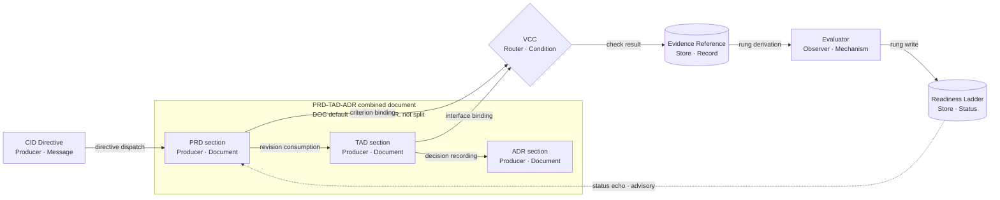

# PRD, TAD & ADR Guidelines

## Scope & Neutrality Contract

- **Universal**: these guidelines apply to any product, domain, language, or runtime; nothing here assumes a specific company, repository, file path, framework, or vendor.
- **Neutral**: name capabilities and roles by their function, never by a brand. Where a concrete tool is shown, it appears only as a non-binding *reference implementation* and may be swapped for any equivalent. Every brand, product, or vendor name must sit under a heading or block whose own text contains the words "reference implementation"; a brand named outside such a label is a `vendor-coupling` finding regardless of surrounding intent.
- **Agnosticity**: requirements are derived from document content and parsed frontmatter only — never from file names, directory layout, or downstream mirrors. Examples use placeholders (`[...]`) rather than real identifiers.
- **Simple**: a rule earns its place by being checkable and load-bearing. Ceremony, Complication, Verbosity, and Clutter are named anti-patterns of the Directive Grammar (CID) Density Rules and apply at document scope as much as directive scope; a rule stateable in fewer words with no loss of observable consequence, and left unstated that way, is a `cid-density-violation` finding. Clutter is the artifact-scope case specifically: an unreferenced template field, an orphaned finding type, or a stale example carried past the rule that produced it, with no consumer left to read it, is a `cid-density-violation` finding at the artifact it clutters, not only at the rule that authored it.
- **Autonomous**: a rule or dispatched directive — human-, LLM-, or agent-authored — is completable by its named role using only the checks, evidence, and grounding this set defines, with no synchronous, unstated manual approval standing between dispatch and outcome; a directive whose completion silently depends on an unnamed human gate outside the stated Deploy Boundary or Evaluator path is a `human-gate-unstated` finding. Lane Topology & Deploy Boundary's closed-by-default rule is this principle's own promotion instance: the gate is named and evidenced, never a silent hold.
- **Modular**: each `##` section is self-contained and addressable by its heading anchor (see Module Index). Sections may be lifted into another guideline set without rewriting their internals.
- **Reusable**: extend or reference an existing rule, template, finding type, or component before authoring a new one. A newly authored rule that restates an existing rule's observable consequence without extending it is a `non-modular-section` finding.
- **Interoperable**: every module's inputs and outputs — frontmatter keys, Rule IDs, Finding Types, continuity IDs — are declared once and consumed by exact name across the set. A module that reads or writes an undeclared key is an `unresolvable-reference` finding.
- **Portable**: a module's own text carries what it needs to be lifted into another guideline set, with no hidden dependency on this document's line numbers, file path, or heading order beyond the anchors it explicitly names. An anchor-order dependency is a `non-modular-section` finding.
- **Coherent**: PRD, TAD, and ADR share exactly one CID/RAO/SVO schema (Directive Grammar (CID)) and one Finding Type enumeration (Conformance Findings). A document in this set that defines a competing schema or a parallel vocabulary is a `cid-schema-noncompliant` finding regardless of artifact type.
- **Enforceable**: every rule in this set is written so a conformance check can record a typed finding against it (see Conformance Findings). A statement that cannot be violated observably is guidance, not a rule, and is labelled as such.

---

## Module Index

- `scope--neutrality-contract` — universality, neutrality, agnosticity, simplicity, autonomy, modularity, reusability, interoperability, portability, coherence, enforceability rules
- `rule-identity--classification` — stable rule addressing and the artifact-bearing vs advisory split
- `markdown-yaml-frontmatter-enforcement` — authoring contract for frontmatter SSOT, including concurrency provenance keys
- `overview` — what PRD/TAD are, the governing standards, and the ADLC/MCP-/WebMCP-native operating posture
- `solo-operator-ai-native-orientation` — binding lens, harness, and bound obligations -> [Economics & Time-to-Value](./prd-tad-adr-economics.md)
- `directive-grammar-cid` — binding CID/RAO/SVO message schema, WBS Task Node decomposition, grounding, and budget obligations -> [CID Template](./CID-template.md)
- `artifact-continuity-authoring-seam` — PRD/TAD/ADR CID ownership, codebase grounding, revision joins, RAO grounding, and execution handoff
- `concurrent-collaboration--work-tree-integrity` — binding multi-device, multi-LLM, multi-agent, multi-work-tree obligations -> [Concurrency & Work-Tree Protocol](./prd-tad-adr-concurrency.md)
- `from-0-to-1-prd--tad-creation-process` — binding gate order -> [Process & Flow Patterns](./prd-tad-adr-process-flows.md)
- `flow-patterns` — binding five-pattern coverage -> [Process & Flow Patterns](./prd-tad-adr-process-flows.md)
- `time-to-value` — binding TTV metric obligation -> [Economics & Time-to-Value](./prd-tad-adr-economics.md)
- `readiness-ladder` — binding status vocabulary -> [Readiness & Lane Topology](./prd-tad-adr-readiness.md)
- `agent-platform-readiness` — binding dimension and route obligations -> [Readiness & Lane Topology](./prd-tad-adr-readiness.md)
- `lane-topology--deploy-boundary` — binding closed-by-default rule -> [Readiness & Lane Topology](./prd-tad-adr-readiness.md)
- `autonomous-implementation-verification` — binding VCC and Evidence obligations -> [Verification & Conformance](./prd-tad-adr-verification.md)
- `cid-directive-matrix` — lookup surface -> [CID Directive Matrix](./prd-tad-adr-cid-matrix.md)
- `core-templates` — binding template-field obligations -> [Core Templates](./prd-tad-adr-templates.md)
- `platform-specific-selection-criteria--multi-agent-reasoning-pipeline` — binding constraints → outranking → argumentation obligation for any platform/vendor/provider choice -> [Selection Criteria](./prd-tad-adr-selection-criteria.md)
- `pain-point-to-feature-mapping` — binding pain-point-to-feature traceability obligation -> [Pain-Point Mapping](./prd-tad-adr-pain-point-mapping.md)
- `demo-skeleton` — binding time-boxed demonstration obligation -> [Demo Skeleton](./prd-tad-adr-demo-skeleton.md)
- `domain-object-rubric-assessment` — binding breakthrough-level self-assessment obligation -> [Domain-Object Rubric](./prd-tad-adr-domain-object-rubric.md)
- `roadmap` — binding phased reuse/delta sequencing obligation -> [Roadmap](./prd-tad-adr-roadmap.md)
- `monetization` — binding real-payer validation obligation -> [Monetization](./prd-tad-adr-monetization.md)
- `architecture-diagram-standards` — diagram format obligations, and the seam to the diagram companion set
- [Diagram Guidelines](./prd-tad-adr-diagram-guidelines.companion.md) — diagram identity, class catalog, notation, labelling, complexity, drift, diagram-domain findings
- [Diagram Canvas-Render Contract](./prd-tad-adr-diagram-canvas-render.companion.md) — surface declaration, ingest surfaces, graph element contract, projection rules, canvas-domain findings
- [Diagram Templates](./prd-tad-adr-diagram-templates.companion.md) — copy-ready, portable-intersection templates per class
- `prd--tad-integration` — separation of concerns, traceability, and closure rules
- `anti-pattern-guards` — prohibited patterns -> [CID Directive Matrix](./prd-tad-adr-cid-matrix.md)
- `conformance-findings` — binding recording contract -> [Verification & Conformance](./prd-tad-adr-verification.md)
- `validation-checklist` — binding alignment gate -> [Verification & Conformance](./prd-tad-adr-verification.md)
- `division-of-work` — binding capability-ownership obligation, single-writer across concurrent work trees -> [Division of Work](./prd-tad-adr-division-of-work.md)
- `roleactionoutcome` — role-to-deliverable mapping
- `mantra-application` — the framing mantra

**Modular set**: this document is the always-loaded index and binding layer; it aggregates pointers to every companion module and is the one file in the set exempted from the per-module line ceiling below, since aggregation is its sole responsibility and it owns no module's protocol content. Each `##` section states only what binds a PRD, TAD, or ADR directly; the full protocol for a section lives in the module its entry names. Every **companion** module stays under 600 lines and carries one responsibility, so a single-phase task loads one module rather than the whole set.

**Companion sets**: this document is the authority for **authoring** — what a PRD, TAD, or ADR must contain and how conformance is named. Execution — task decomposition, agent roles and independence, tool blast radius, per-task budgets, and run state — is owned by the **Agentic SDLC Guidelines** companion set. Concurrent multi-device, multi-LLM, multi-agent, multi-work-tree collaboration is owned by the **Concurrency & Work-Tree Protocol** module. The **diagram domain** — diagram identity, class selection, notation, labelling, canvas projection, and templates — is owned by the three diagram companion modules named in the Module Index. No set restates another; each names the others where a rule crosses the boundary, and the conformance vocabulary is the union of their enumerations. A claim about execution, concurrency, or a diagram's canvas-renderability, sourced from this document alone is incomplete.

**Continuity companion**: the [Artifact Continuity Module](./agentic-sdlc-artifact-continuity.md) owns the universal CID-to-RAO seam, companion-artifact joins, outcome evidence, revision freshness, and successor feedback. This authoring set supplies its PRD, TAD, and ADR inputs; it does not redefine the continuity vocabulary.

**Message envelope companion**: the [CID Template module](./CID-template.md) owns the Context/Intent/Directive, Role/Action/Outcome, and Subject/Verb/Object message schema — its frontmatter contract, Sender/Receiver Grounding protocol, Clarification Protocol, Composition Rule, Density Rules, Reinforced Constraints, ADLC Budgets, WBS Task Node dispatch form, File Naming convention, and Forbidden-pattern list. Every `**Directives**:` block in this document, and every authoring-to-execution or agent-to-agent dispatch message — including across work trees, devices, and LLMs — instantiates that schema; this document publishes only the Field Contract vocabulary (see Directive Grammar (CID)) and does not redefine it.

---

## Rule Identity & Classification

**Makes every individual rule separately addressable and separately classifiable.** Section anchors address a *group* of rules; a conformance check needs to address *one*. Without per-rule identity, two different violations inside one section collapse into a single finding and the regression comparison in Conformance Findings silently stops working.

### Rule Identifier

Every rule carries a **Rule ID** that is stable across edits to unrelated rules:

```
Rule ID = [owning section anchor] + "#" + [ordinal of the rule within that section, in document order]
```

**Directives**:
- Derive the Rule ID from the owning `##` section anchor and the rule's position within that section; forbid deriving it from a file name, a line number, or a directory
- Treat the Rule ID as stable while the rule's own text and owning section are unchanged; inserting an unrelated rule earlier in the same section re-ordinals the rules after it, so record the rule text alongside the ID wherever a finding is stored
- Where two rules in one section carry identical text, disambiguate by ascending document-order ordinal; forbid merging them into one addressable rule
- Use the Rule ID, not the section anchor alone, as the `rule anchor` field of a finding and as a component of the deduplication key
- Rules authored before this section existed inherit their ID by the same derivation; no retroactive hand-labelling is required, and none is permitted to override the derivation

### Artifact-Bearing vs Advisory

Every rule is exactly one of two classes, and the class decides whether an unmet rule is a defect or a preference:

| Class | Definition | Unmet consequence |
|---|---|---|
| **Artifact-bearing** | The rule requires a named, locatable output: a document, a section, a template field, a schema, a diagram, a recorded status, a named check | `unimplemented-guideline` |
| **Advisory** | The rule states a preference, a framing, or a judgement that produces no separately locatable output | No finding; counted as advisory coverage |

**Directives**:
- Classify a rule as artifact-bearing when its text names a produced output; classify it as advisory otherwise; forbid a third class and forbid leaving a rule unclassified
- Derive the class from the rule text, so the classification is recomputable and cannot drift from the rule it describes
- Report the coverage ratio as linked artifact-bearing rules over total artifact-bearing rules; forbid an alignment claim that omits that ratio
- Distinguish the two classes explicitly, because only artifact-bearing rules can produce an `unimplemented-guideline`; mislabelling advice as a rule inflates the defect count without improving the product
- Forbid inflating the defect count by classifying advice as artifact-bearing; a high count achieved that way measures labelling, not conformance
- Count advisory rules separately and report the count; an advisory rule with no artifact is expected, not a gap

---

## Markdown YAML Frontmatter Enforcement

- Canonical PRD, TAD, and combined PRD/TAD Markdown docs must start with a valid YAML frontmatter block as the first block in the file.
- Frontmatter is the SSOT for document identity, status, versioning, renderer activation, and reusable metadata referenced by the body specification.
- Canonical authored PRD/TAD docs use plain YAML for frontmatter and related schema-bearing blocks; do not replace normal authoring syntax with typed wrapper records.
- Normalized `{key, type, value}` wrappers are permitted only in dedicated validation fixtures that explicitly test ingest -> parse -> render or ingest -> parse -> validate fidelity.
- Scalars that contain reserved punctuation, including inline `:` content, must be quoted so strict YAML parsers read planning and architecture metadata deterministically.
- Parser warning, repair, or fallback behavior is recovery-only; malformed YAML frontmatter remains an upstream authoring defect that must be fixed at source.
- **Baseline required keys** for any canonical PRD, TAD, or ADR doc: `title`, `doc_type`, `version` (semantic), `date`, `lang`. Extend with domain-specific keys as needed (e.g. `parent` / `parent_version` for a linked Follow-On PRD/TAD per the Agent-Platform Readiness template) without dropping the baseline set.
- **Conformance keys** are required in addition to the baseline set, because the rules in this guideline set read them and the agnosticity rule forbids recovering them from a path or a directory:

| Key | Value domain | Read by |
|---|---|---|
| `owner` | One named accountable function | `duplicate-owner` |
| `local_rung` | One Readiness Ladder rung | Readiness Ladder, `status-conflict` |
| `delivered_rung` | One Readiness Ladder rung | Readiness Ladder, `blended-status` |
| `lane` | `authoring` \| `mirror` \| `delivery` | Lane Topology & Deploy Boundary |
| `universal_scope` | `true` \| `false` | Scope & Neutrality Contract modularity rule |
| `worktree_id` | One stable identifier for the work tree that produced this revision (spans one device or many in sync) | Concurrent Collaboration & Work-Tree Integrity, `worktree-provenance-missing` |
| `agent_id` | One stable identifier for the authoring agent or session — human or LLM | Concurrent Collaboration & Work-Tree Integrity, `worktree-provenance-missing` |

- Declare exactly one `owner` per document; two documents claiming ownership of one contract is a `duplicate-owner` finding, and a document with no `owner` cannot be assigned a rung
- Keep `local_rung` and `delivered_rung` as two separate keys; a single blended `status` key is a `blended-status` finding
- Treat every conformance key as derived where a derivation exists: `local_rung` and `delivered_rung` are computed from Evidence References and written back, never authored ahead of the evidence
- Carry `worktree_id` and `agent_id` on every revision authored under concurrent multi-device, multi-agent, or multi-work-tree conditions; a revision missing either where more than one work tree is active on the same document is a `worktree-provenance-missing` finding

---

## Overview

**Product Requirements Documentation (PRD)**: defines user value propositions, specifies acceptance criteria, prioritizes features systematically, aligns stakeholders, validates assumptions iteratively, and maintains bidirectional traceability.

**Technical Architecture Documentation (TAD)**: designs component interactions, specifies integration contracts, documents decision rationale, establishes quality attributes, defines deployment strategies, and traces requirements to implementation.

**Governing standards**: structure documents with user-centric narratives; design architectures with domain-agnostic patterns; specify measurable outcomes; maintain requirement-to-implementation traceability; apply iterative refinement; separate concerns systematically.

**Enforceability**: these standards are written to be checked, not only read. Each rule is phrased so a violation is observable, each violation has a name and a severity (see Conformance Findings), each readiness claim is a value derived from recorded evidence (see Readiness Ladder), and each step toward a public surface passes a named gate that is closed by default (see Lane Topology & Deploy Boundary). A rule that cannot fail a check is guidance; this set labels the difference rather than blurring it. The apparatus exists to keep the 0-to-1 loop fast and honest — a gate earns its place by narrowing a real, previously observed failure or by shortening time-to-first-dollar; a gate that does neither is itself a `cid-density-violation`, not a virtue.

**Solo-operator AI-native orientation**: these guidelines are calibrated for a solo founder or small team operating an AI-native product stack across an Agentic Development Lifecycle (ADLC), MCP-/WebMCP-native by default, and routinely running multiple devices, multiple LLMs, multiple agents, and multiple work trees in hybrid cloud/local concurrency. Every decision is evaluated through five compounding lenses — **min-viable-max-value** (ship the smallest artifact that delivers the largest user impact), **TCO-zero** (prefer FOSS and zero-egress infrastructure; make cost a first-class architectural constraint), **token economics** (treat LLM token consumption as a measurable engineering metric at every pipeline boundary), **harness-first** (orchestrate AI capabilities through composable, observable, MCP-/WebMCP-conformant harnesses rather than ad-hoc prompt calls), and **concurrency-safe** (every artifact, directive, and merge holds under multiple simultaneous work trees, devices, and agents without deadlock, corruption, or hallucinated state). These lenses do not replace the core PRD/TAD standards — they sharpen prioritization, constrain architecture choices, and accelerate validation cycles.

**Reference implementation** — one instantiation of this orientation, non-binding per Scope & Neutrality (a project instantiating this set states its own domain here in its place): a from-0-to-1, production-runtime-ready agentic-commerce/marketplace MVP — agent-to-agent discovery, agentic payment settlement, and AI-agent economics as the domain objects (Domain-Object Rubric Assessment) — drawing architectural inspiration from Anthropic's open-source `commerce-agents` reference architecture, run end-to-end on the ADLC and federated through an MCP-/WebMCP-conformant gateway per Agent-Platform Readiness, with `/`, `#`, and `@` as its three invocable routes declared in one Invocation Register. Neither the commerce domain, the inspiring architecture, nor the three route glyphs are universal; they name this project's own choices under the label this rule requires, and every future ADR in this project's set re-applies the general criterion, not the named example.

---

## Solo-Operator AI-Native Orientation

The separately loadable [Solo-Operator AI-Native Orientation module](./prd-tad-adr-economics.md) owns the five compounding lenses, the guideline load budget, the AI-native harness pattern, orchestration topology, the ROI template, the FOSS-first rule, and deployment-model TCO variants. This section owns only the obligations that bind a PRD, TAD, or ADR directly.

**Directives**:
- Evaluate every decision through the five lenses named in that module — min-viable-max-value, TCO-zero, token economics, harness-first, concurrency-safe; forbid a scope or architecture decision that names none of them
- Wrap every AI-powered component in a harness with typed input, typed output, an emitted cost log, and a stated fallback; a raw prompt call in a production pipeline is an anti-pattern guard violation
- Prefer an MCP- or WebMCP-conformant tool contract for every AI Agent discovery, invocation, and harness route, labelled as a reference implementation per Scope & Neutrality; a proprietary protocol substituted where a conformant path exists, without a stated reason, is a `vendor-coupling` finding
- Bound every agentic loop with a max-iteration count and a circuit-breaker condition; an unbounded loop is an `unbounded-loop` finding at `blocker` severity
- Separate every candidate's deployment-model variants in a TCO comparison; a blended figure is a `blended-deployment-tco` finding
- Weigh every new rule, gate, or template field against the pain-point-to-feature and monetization loops it protects; a rule that adds authoring cost without narrowing an observed failure mode or shortening time-to-first-dollar is a `cid-density-violation`

---

## Directive Grammar (CID)

Every directive in this guideline set — and every authoring-to-execution or agent-to-agent dispatch message that consumes it, including one dispatched across work trees, devices, or LLMs — is expressed with the uniform, project-agnostic schema owned by the separately loadable [CID Template module](./CID-template.md). That module owns the full frontmatter contract, Sender/Receiver Grounding, the Clarification Protocol, the Composition Rule (including SVO derivation from RAO), Density Rules, Reinforced Constraints, ADLC Budgets, the WBS Task Node dispatch form, the File Naming convention, and the Forbidden-pattern list. This section publishes the **Field Contract** vocabulary, because every `**Directives**:` block in this document instantiates it and a consumed interface belongs with the index rather than behind a load.

This is the *only* `role`/`action`/`outcome`/`subject`/`verb`/`object` schema this document defines. Every other place "RAO" or "SVO" appears here is one of two things, never a competing schema:
- **A granularity extension of this same triad.** Role—Action—Outcome states each role's default `role`/`action`/`outcome` envelope at document scope; Division of Work re-extends the identical triad to component scope (`role` = owning component — still function, not persona, per the Field Contract), and Concurrent Collaboration & Work-Tree Integrity re-extends it again to work-tree scope (`role` = owning work tree for a capability's current write). Artifact Continuity Authoring Seam's RAO Steps are literal CID `role`/`action`/`outcome` instances, one per execution step, decomposed via the module's WBS Task Node schema whenever a step's `outcome` spans more than one atomic action or ADLC phase.
- **An unrelated reuse of the same three letters.** Mantra Application's "SVO clarifies" names general subject-verb-object grammatical clarity for requirement prose (a PRD user story, a TAD data-flow line, an ADR consequence) — a writing discipline, not this module's `subject`/`verb`/`object` field. That field is the mechanical, per-directive atomic-command derived from `action` per the Composition Rule, and its `subject` defaults to `agent` regardless of which grammatical subject a requirement sentence names.

### Field Contract

```yaml
context:      # situational grounding — what's true right now (state, constraints, prior turns), file/path-cited
intent:       # why this message exists — the goal behind the ask, not the ask itself
directive:    # the imperative — what the receiver must do, stated as a command, traceable to real repo state

role:         # who the receiver is acting as (function, not persona)
action:       # the verb-phrase the role performs
outcome:      # the state that must exist when action is complete — the exit condition

subject:      # actor executing the action
verb:         # the action itself, single transitive verb where possible
object:       # what the verb acts on
```

`context + intent + directive` scopes *why/what*; `role + action + outcome` scopes *who/how/done*; `subject + verb + object` is the atomic, derived restatement a receiver parses if it drops everything else. All three tiers must resolve to the same instruction at increasing compression — see Composition Rule in the module.

### Sorting
Each `CID Directive Matrix` entry is organized alphabetically (A→Z) for clarity and neutrality.

**Directives**:
- Express every directive in this set, and every dispatched agent-to-agent message, as the Field Contract above; a directive or message missing a required field is a `cid-schema-noncompliant` finding
- Cite `context` and `directive` against real, locatable state — a file path, a revision, a Rule ID, a command output — or state `source=unverified` explicitly, per the module's Sender Grounding contract; an uncited or silently-paraphrased citation is a `cid-context-uncited` finding
- Require the receiving agent to open and diff every cited path against actual content before acting on the directive, per Receiver Grounding — this applies with no exception when the cited state was produced by a different work tree, device, or LLM; proceeding on an unverified citation is a `cid-grounding-unverified` finding
- Resolve genuine ambiguity through the Clarification Protocol — one bounded recommendation with a binary confirm/reject outcome, never an open question; an open-ended clarification request is a `cid-clarification-malformed` finding
- Keep the three grammar tiers convergent per the Composition Rule; a `context`/`intent`/`directive` that resolves to a different instruction than its own `role`/`action`/`outcome` or `subject`/`verb`/`object` is a `cid-composition-divergence` finding
- Apply the module's Density Rules and forbid its named anti-patterns — Ceremony, Complication, Verbosity — in every directive; a violation of either is a `cid-density-violation` finding
- Decompose a directive into WBS Task Nodes, per the module's schema, when its `outcome` spans more than one atomic action or more than one ADLC phase; a multi-action directive dispatched as a single undecomposed CID is a `cid-decomposition-missing` finding
- Stay within the ADLC Budgets on every always-load surface this document or its companions define; a directive that grows such a surface without stating its projected byte/module delta is a `cid-budget-exceeded` finding
- Name any persisted CID message file per the module's File Naming convention (`CID-YYYYMMDDTHHmmZ-<max15char-desc>.md`, one file per decision); a non-conforming filename is a `cid-naming-noncompliant` finding

---

## Artifact Continuity Authoring Seam

The [Artifact Continuity Module](./agentic-sdlc-artifact-continuity.md) owns the reusable seam and its complete validation contract. PRD owns the product Context, Intent, Directives, normative criteria, and VCCs. TAD consumes that exact PRD revision and owns the structural response. ADR records one grounded decision and its consequences, including the risk it accepts, the mitigation or rollback it commits to, and the failure mode it was written to avoid. The execution companion consumes their joined projection as bounded RAO Steps — each one a CID `role`/`action`/`outcome` instance per Directive Grammar (CID), decomposed via the module's WBS Task Node schema wherever a step's `outcome` spans more than one atomic action or ADLC phase; evidence, demonstration, and successor planning remain downstream companions rather than authoring phases. Where PRD, TAD, or ADR revisions arrive from more than one concurrently active work tree, the join additionally satisfies Concurrent Collaboration & Work-Tree Integrity before baseline.

**Directives**:
- Declare stable continuity IDs and exact revisions across PRD, TAD, and ADR; forbid prose, filename, or co-location joins
- Name every generated PRD, TAD, or ADR file `<DOC>-<YYYYMMDDTHHmmZ>-<worktree_id>-<slug>.md` (`DOC` = `PRD`\|`TAD`\|`ADR`\|`PRD-TAD-ADR`), mirroring the CID Template's File Naming convention (Directive Grammar (CID)) rather than a sequential counter, since a shared counter collides under concurrent multi-work-tree authoring; the timestamp marks creation only, the filename stays fixed for the document's lifetime, and the join to its companions is carried by the continuity ID above, never by the filename — a non-conforming filename, or one touched to reflect a revision, is an `artifact-naming-noncompliant` finding
- Default `DOC` to `PRD-TAD-ADR` — one combined, non-split document carrying all three sections — under the Solo-Operator AI-Native Orientation's min-viable-max-value lens; split into separate `PRD`, `TAD`, `ADR` files only on a stated reason (independent review cadence, cross-team ownership, or a size past the Guideline Load Budget); an unstated split is a `cid-density-violation` finding, since a split that protects nothing costs an extra continuity join for no narrowed failure mode
- Carry the continuity ID and exact revision as the join between the `PRD`, `TAD`, and `ADR` sections whether combined in one file or split across several; a filename-based join is `artifact-naming-noncompliant` in either shape
- Before baseline, produce an embedded or linked **Codebase Grounding Record** for every externally authored, generated, or imported document (a non-native input) used as specification input, including any PRD: bind the input revision and scoped codebase revision or digest; enumerate every material current-state claim used for capability existence, ownership, reuse, dependency or interface/configuration choice, feasibility, or readiness; cite source, configuration, schema, test, or runtime-contract evidence; and disposition each claim as `confirmed`, `contradicted`, `absent`, or `unverified`. Document provenance and internal consistency are not implementation evidence, while codebase evidence never silently rewrites product intent; a missing record or unresolved claim used to justify baseline, execution, or readiness is an `unproven-claim`
- Close PRD-to-TAD coverage, TAD grounding, and applicable ADR joins before deriving RAO Steps
- Re-run Directive-to-RAO coverage and affected re-derivation after any upstream revision, including one that arrived from a different work tree
- Require joined independent evidence before satisfaction or readiness advances; forbid narrative or self-graded completion
- Reuse the Artifact Continuity Module's findings and reference projections; forbid a parallel continuity vocabulary

**Authoring-to-execution gate**: advance only when Codebase Grounding Record closure, PRD-to-TAD coverage, TAD grounding, Directive-to-RAO coverage, RAO grounding, revision freshness, and evaluator independence are complete. An absent or failing join yields a typed finding and a blocked transition, never an inferred approval.

---

## Concurrent Collaboration & Work-Tree Integrity

The separately loadable [Concurrency & Work-Tree Protocol module](./prd-tad-adr-concurrency.md) owns the full merge protocol, the lease-free coordination pattern, and the reap-or-merge cadence for hybrid cloud/local operation across multiple devices, multiple LLMs, multiple agents, and multiple work trees. This section owns only the obligations that bind a PRD, TAD, or ADR directly, and states the failure modes this guideline set forbids by name: **deadlock**, **corruption**, **hallucination**, **drift**, and **work-tree sprawl**. Every cross-work-tree transfer this set governs is additionally required to be **lossless** — content present in either parent revision survives the merge — as the positive obligation `drift` and `corruption` are the negative image of.

**Directives**:
- Carry `worktree_id` and `agent_id` on every revision per Markdown YAML Frontmatter Enforcement whenever more than one work tree is concurrently active on the same document; an unattributed revision under those conditions is a `worktree-provenance-missing` finding
- Enforce single-writer-per-capability from Division of Work across every concurrent work tree and agent, not only within one; two work trees mutating the same owning component's capability without a recorded, merged reuse decision is a `duplicate-capability-owner` finding
- Require every cross-work-tree merge to be idempotent and additive — replaying the same merge twice yields the same state — and require every persisted CID message to be append-only per the File Naming convention; a merge whose result depends on ordering or replay count is a `merge-non-idempotent` finding at `major` severity
- Require every cross-work-tree merge to be lossless in addition to idempotent: no field, constraint, Evidence Reference, or continuity ID present in either parent revision may be dropped or silently overwritten; a merge that loses content present in a parent revision is a `merge-lossy` finding at `major` severity, distinct from `merge-non-idempotent`
- Treat any recorded state that no longer matches its governing source — a phase order, a diagram, a status vocabulary, a continuity ID, a rung — as **drift** the moment it is observed; forbid letting it stand once named, and route it through the specific Finding Type its governing section already owns (`gate-order-drift`, `diagram-spec-drift`, `status-conflict`, or the closest section-owned equivalent) rather than inventing a parallel drift vocabulary
- Forbid any lock, lease, or wait condition spanning more than one work tree or device without a stated timeout and an escalation path to the Evaluator; an unbounded cross-work-tree wait is a `deadlock-unbounded-wait` finding at `blocker` severity
- Apply Receiver Grounding (Directive Grammar (CID)) with no exception to state produced by another work tree, device, or LLM before acting on it; treat an unverified cross-origin claim as a hallucination risk, not a shortcut — proceeding on it is a `cid-grounding-unverified` finding
- Cap the count of simultaneously open, unmerged work trees per capability at a project-stated ceiling and observe a stated reap-or-merge cadence; a work tree left open past that cadence with no active directive is a `work-tree-sprawl` finding at `minor` severity
- Route every irreconcilable concurrent claim — two work trees each asserting a different `outcome` for the same directive — to the Evaluator for a binding verdict; forbid resolving such a conflict by whichever write lands last
- Treat a hybrid cloud/local topology as a deployment-model variant of one coordination protocol, never a separate one; a claim authored locally and one authored in cloud CI reconcile through the identical merge and grounding rules, with no silent preference for either origin

---

## From 0 to 1: PRD & TAD Creation Process

The separately loadable [From 0 to 1: PRD & TAD Creation Process module](./prd-tad-adr-process-flows.md) owns the five phases, their numbered steps, and the gate that closes each one. This section owns only the obligations that bind a PRD, TAD, or ADR directly.

**Directives**:
- Treat the phase order in that module as the canonical order; a documented stage order that contradicts it is a `gate-order-drift` finding, and a later gate passing while an earlier one fails is a `gate-sequence-violation`
- Pass every gate before proceeding; Phase 3 exits only with both documents version-stamped and the alignment check reporting zero `blocker` findings
- Bound the Phase 4 revision cycle like every other loop in this set: a max-iteration count plus a circuit-breaker on no reduction in open `blocker` findings across two consecutive cycles

---

## Flow Patterns

The separately loadable [Flow Patterns module](./prd-tad-adr-process-flows.md) owns the five canonical flow types — user journey, workflow, data flow, orchestration/harness flow, and topology — with a template and directives for each. This section owns only the obligations that bind a PRD, TAD, or ADR directly.

**Directives**:
- Trace every feature through all five flow patterns; a feature that skips one is incompletely specified
- Render each flow pattern as its bound diagram class per the diagram companion set; a missing rendering is a `missing-required-diagram` finding in the diagram domain
- Anchor every data flow and harness flow to a journey stage; an orphaned flow has no user value to preserve

---

## Time-to-Value

The separately loadable [Time-to-Value module](./prd-tad-adr-economics.md) owns the TTV definition, its metric template, and its validation method. This section owns only the obligations that bind a PRD, TAD, or ADR directly.

**Directives**:
- Estimate TTV steps and elapsed time in Phase 0 and state TTV as a named row in PRD success metrics for every user-facing feature; an absent TTV is a `missing-economics-metric` finding
- Validate TTV on a clean environment before Phase 3 sign-off; forbid an estimate that has never been walked through

---

## Readiness Ladder

The separately loadable [Readiness Ladder module](./prd-tad-adr-readiness.md) owns what earns each rung and the evidence rule that governs it. This section publishes the **vocabulary**, because other documents consume it and a consumed interface belongs with the index rather than behind a load.

Strictly ordered, lowest to highest:

```
undocumented  <  spec-complete  <  dev-proven  <  runtime-ready  <  production-verified
```

| Rung | Earned when |
|---|---|
| `undocumented` | No VCC and no Evidence Reference exists |
| `spec-complete` | At least one VCC is stated, none yet satisfied |
| `dev-proven` | At least one VCC is satisfied by a reproducible local check with a recorded result |
| `runtime-ready` | Every VCC carries a satisfying Evidence Reference |
| `production-verified` | `runtime-ready` plus a recorded delivery-surface result and a referenced operator promotion instruction |

**Directives**:
- Draw every status value from that ladder and no other vocabulary; an unrecognised value is an `unknown-status` finding
- Derive every rung from Evidence References only; a hand-authored rung is an `unproven-claim` at `blocker` severity
- Report local and delivered readiness as two separate fields; one blended field is a `blended-status` finding

---

## Agent-Platform Readiness

The separately loadable [Agent-Platform Readiness module](./prd-tad-adr-readiness.md) owns the three readiness dimensions, their tiers, the execution order, the Invocation Surface Contract, the readiness gap matrix, and the follow-on document template. This section owns only the obligations that bind a PRD, TAD, or ADR directly.

**Directives**:
- Name which dimensions are in scope; an unqualified "agent-ready" claim is unverifiable
- Keep every discovery and read route at zero token cost; a non-zero cost on a read route is a `paid-read-path` finding
- Declare every `/`, `#`, `@`, and tool-identity route in exactly one Invocation Register; a route declared nowhere is an `orphan-route` and one declared twice is an `ambiguous-route`
- Federate every AI Agent discovery and invocation route through an MCP- or WebMCP-conformant gateway wherever one is available, per Solo-Operator AI-Native Orientation; an agent-callable route left outside the federated gateway with no stated reason is an `unfederated-tool` finding

---

## Lane Topology & Deploy Boundary

The separately loadable [Lane Topology & Deploy Boundary module](./prd-tad-adr-readiness.md) owns the canonical lane sequence, the four required parts of every boundary, and the closed-by-default promotion rule. This section owns only the obligations that bind a PRD, TAD, or ADR directly.

**Directives**:
- Document all three lanes and every boundary before the first promotion; a missing lane is a `missing-lane` finding at `blocker` severity
- Keep every Deploy Boundary `closed` absent a referenced operator instruction; an unrecorded promotion is an `ungated-promotion`
- Forbid any authoring-lane command that mutates a mirror or delivery surface; such a command is a `deploy-boundary-breach` at `blocker` severity

---

## Autonomous Implementation Verification

The separately loadable [Autonomous Implementation Verification module](./prd-tad-adr-verification.md) owns the VCC primitive, the criterion-to-condition pipeline, evaluator independence, the Evidence Reference, the traceability extension, and the closure rules. This section owns only the obligations that bind a PRD, TAD, or ADR directly.

**Directives**:
- Express every acceptance criterion as a VCC with one measurable end state, a stated check, and its constraints; a criterion that cannot be demonstrated from surfaced output is not testable
- Attach an Evidence Reference — named invocable check, recorded result, surface — to every satisfied VCC; a named check with no recorded result cannot raise a rung
- Keep the Evaluator a distinct mechanism from the implementer, and from every work tree or agent whose output it judges; a self-graded verdict is not a verdict

---

## CID Directive Matrix

The separately loadable [CID Directive Matrix module](./prd-tad-adr-cid-matrix.md) owns the alphabetical Context/Intent/Directive mantras covering every concern in this set. This section owns only the obligations that bind a PRD, TAD, or ADR directly.

**Directives**:
- Use the matrix as the lookup surface for a concern's directive; it summarises obligations owned by the sections named in the Module Index and adds none of its own

---

## Core Templates

The separately loadable [Core Templates module](./prd-tad-adr-templates.md) owns the copy-ready PRD, TAD, and ADR template bodies, including the component inventory, Diagram Register, and Deploy Boundary Register. This section owns only the obligations that bind a PRD, TAD, or ADR directly.

**Directives**:
- Instantiate the templates rather than reinventing their fields; a template field exists because a rule in this set requires the artifact it names
- Keep every template field that carries a conformance obligation — rungs, Evidence References, VCCs, token budget, TCO per deployment model, boundary state, work-tree provenance; dropping one silently removes the check that reads it

---

## Platform-Specific Selection Criteria — Multi-Agent Reasoning Pipeline

The separately loadable [Selection Criteria module](./prd-tad-adr-selection-criteria.md) owns the full constraint worksheet, outranking worksheet, argumentation-graph schema, and worked examples. This section owns only the obligations that bind a PRD, TAD, or ADR directly. Any platform-, vendor-, or provider-level choice runs through three ordered stages — **constraints → outranking → argumentation** — each with a distinct agent role and a distinct recorded artifact; no stage's output may be replaced by a single scalar score standing in for the others, and legacy single-pass weighted-sum or distance-to-ideal scoring (including TOPSIS) is retired from this set.

### Stage 1 — Constraints

A gating pass, run before any comparison: every candidate is disposed `pass` or `fail-<named-constraint>` against the project's stated non-negotiable requirements (a license, a deployment model, an offline-capability floor). A `fail` candidate is named and excluded; it is never scored further.

**Directives**:
- State every disqualifying constraint explicitly before comparing any candidate; a candidate carried into outranking without a recorded `pass` disposition against every stated constraint is a `constraint-gate-skipped` finding at `major` severity
- Record disposition per candidate, not an aggregate score; naming a losing candidate's low overall score in place of its specific failed constraint is a `vendor-preference-unscored` finding
- Derive constraints from the product's own governing requirements — economics, deployment model, deployment platform, offline/edge posture, AI-native compute/token/embedding needs, license compliance — never from a candidate's own marketing or feature list; a constraint set that happens to match exactly one vendor's differentiators is a `vendor-coupling` finding under Scope & Neutrality

### Stage 2 — Outranking

Surviving candidates are compared pairwise against a project-stated, explicitly weighted criteria set using a non-compensatory outranking method — concordance, discordance, and (where the method uses it) credibility per pair — or an equivalent auditable multi-criteria outranking method. The output is a partial order: some pairs resolve to "outranks," some do not resolve at all, and an unresolved pair is a legitimate result, not a defect.

**Directives**:
- Score every surviving candidate pairwise against the weighted criteria set and record concordance and discordance (or the equivalent intermediate values for a substituted outranking method) per pair; a ranking presented without that pairwise record is unauditable and is an `outranking-relation-unstated` finding at `minor` severity
- Preserve incomparability where the outranking relation does not resolve a pair; forbid collapsing an unresolved pair into an arbitrary total order — a forced order over an unresolved pair is an `outranking-incomparability-collapsed` finding at `minor` severity, and every pair it leaves unresolved routes to Stage 3
- Derive criteria weights from the same governing-requirements source as Stage 1's constraints, never from a candidate's own claims; a criteria set matching one vendor's differentiators is a `vendor-coupling` finding under Scope & Neutrality

### Stage 3 — Argumentation

Every pair the outranking relation leaves unresolved, and every contested verdict, is routed to structured multi-agent argumentation: independent agents each submit an argument — a claim, its support, and its attack or support relation to prior arguments — for or against a candidate, forming an argument graph. The Evaluator (Role—Action—Outcome), distinct from every agent whose argument appears in the graph, renders the binding verdict from the graph's accepted extension (or the equivalent semantics of a substituted argumentation framework).

**Directives**:
- Build and persist the argument graph — claims, attack/support edges, accepted extension — for every candidate pair reaching this stage; an unresolved pair closed with no recorded argument graph is an `argumentation-graph-missing` finding at `major` severity
- Require the rendering Evaluator to hold no argument of its own in the graph it adjudicates; a verdict authored by the same agent that submitted a winning argument is an `argumentation-self-graded` finding at `blocker` severity, extending Evaluator independence (Autonomous Implementation Verification) into the selection pipeline
- Attach the persisted argument graph to the selection ADR as its Evidence Reference; a selection ADR whose contested candidates carry no linked argument graph is an `unproven-claim`

**Directives (cross-stage)**:
- Label the outcome by its pipeline derivation, never by preference: a write-up naming a winning candidate without its Stage 1 disposition, Stage 2 pairwise record, and (where invoked) Stage 3 argument graph is a `vendor-preference-unscored` finding regardless of whether the ranking itself was sound
- Present illustrative constraints, criteria, and candidates only under a heading or block whose own text contains the words "reference implementation," per the Scope & Neutrality Contract; a checklist or candidate list naming real vendors outside such a label is a `vendor-coupling` finding

**Reference implementation** — for a solo-operator, AI-native, MCP-/WebMCP-native, edge-native product (any project instantiates its own constraint set, criteria set, and candidates; none of this is universal): Stage 1 constraints typically include license compliance, offline/edge capability, and zero-infra posture; Stage 2 criteria typically include AI-native fit (embedding/vector and agentic-workload support), total cost of ownership, primary-deployment-platform fit, and a mobile-/web-/offline-first delivery triad — browser-based (web-first) delivery, mobile-first delivery, and offline-first operation via on-device/edge execution and local-first data ownership — scored alongside concurrency-safety under multi-device/multi-agent use, token performance and economics, min-viable-max-value, time-to-value, and ROI, with an ELECTRE- or PROMETHEE-style outranking relation; Stage 3 argumentation typically uses an abstract argumentation framework (Dung-style attack graph with grounded or preferred extension). A project's "primary-platform fit" criterion names whichever platform that project has already adopted as primary as a reference implementation of the general criterion — the criterion itself, not the named platform or method, is what every future ADR in that project's set re-applies.

---

## Pain-Point-to-Feature Mapping

The separately loadable [Pain-Point Mapping module](./prd-tad-adr-pain-point-mapping.md) owns the fixed six-field card form and its authoring procedure. This section owns only the obligations that bind a PRD directly.

**Directives**:
- Trace every `Must`-priority feature to exactly one named pain point stated as: pain point, hook, break, fix, close, and a min-time-resource-max-value note; a feature with no traceable pain point is unscoped, not merely under-documented
- State the min-time-resource-max-value note as an explicit reuse-or-build split against components named in Division of Work; forbid presenting a fix as net-new when an existing capability already covers it
- Label a pain point `unvalidated` until it carries a named evidence reference (a user quote, a ticket, a measured drop-off), and label it `demand-proven` only when that evidence is a real paying customer — a signed pilot, an active subscription, a completed transaction — rather than expressed interest; an `unvalidated` pain point still backing a `Must` feature at baseline sign-off is a `pain-point-not-validated` finding at `major` severity
- Rank competing fixes for the same pain point by proximity to what is already built — zero-code-change configuration first, minimal-code-change extension of an existing component second, net-new build last — before weighing any other feasibility factor; a fix ranked above a lower-cost equivalent with no stated reason is a `roadmap-order-unexplained` finding
- Prioritize among qualifying pain points by evidence of willingness-to-pay (WTP) magnitude — a stated price point, deal size, or committed budget — ahead of build cost or technical elegance; a `Must` ranking that inverts a recorded WTP ordering with no stated reason is a `roadmap-order-unexplained` finding, and a pain point with no WTP evidence at all cannot outrank one that has it
- Forbid a hook or close that implies a capability the fix does not have; both restate the pain point, they do not extend the claim beyond it

---

## Demo Skeleton

The separately loadable [Demo Skeleton module](./prd-tad-adr-demo-skeleton.md) owns the beat catalog and timing conventions. This section owns only the obligations that bind a PRD directly.

**Directives**:
- Require a fixed, time-boxed beat table — Hook, Probe, Reveal, `[domain action]`, Close — for every feature claiming `Must` priority or a Domain-Object Rubric rung of L3 or above; a beat with no stated time bound is a `missing-demo-beat` finding
- Bound total demonstration time to the budget stated in the feature entry; forbid beats whose stated durations sum past that budget
- Anchor the Reveal beat to the feature's own VCC — the instant the demo shows the acceptance condition holding, not a narrated claim of it
- Name the `[domain action]` beat by the product's own interaction (approve, swipe, confirm, sign); forbid a skeleton hardcoded to one input device or channel

---

## Domain-Object Rubric Assessment

The separately loadable [Domain-Object Rubric module](./prd-tad-adr-domain-object-rubric.md) owns the leveled rubric catalog and scoring procedure. This section owns only the obligations that bind a PRD or TAD directly.

**Directives**:
- Identify the product's actual domain object before applying any external leveled capability rubric; forbid scoring against a rubric's supplied example object when the product's own domain object is structurally different
- Report the rubric level as the lowest level not yet cleared, not the highest level partially attempted; a self-assessment reporting an aspirational level while a lower level's named prerequisite is absent is an `overclaimed-rubric-level` finding at `major` severity
- Name the specific blocking component for every unclaimed rung between the current and target level; an unclaimed rung with no stated blocker is an `unresolved-rubric-gap` finding
- Permit closing a rubric gap by reusing an existing capability from another artifact in this set; require an explicit cross-artifact reference per Division of Work rather than a silent re-implementation

---

## Roadmap

The separately loadable [Roadmap module](./prd-tad-adr-roadmap.md) owns the phase-table template and sequencing procedure. This section owns only the obligations that bind a PRD or TAD directly.

**Directives**:
- State, for every roadmap phase: the feature, what it reuses (naming the specific existing component or artifact), what is genuinely new, and a priority rationale; a phase with an empty reuse statement and no stated justification is a `roadmap-reuse-unstated` finding
- Order phases by reuse-adjusted build cost, not solely by an external rubric's nominal difficulty order; state any divergence from that nominal order explicitly, or record it as a `roadmap-order-unexplained` finding
- Gate a later phase on an earlier phase's named prerequisite component wherever one exists; the gate must be stated, not merely honored by coincidence
- Mark a deliberately deferred, real idea `Won't (this increment)` rather than omitting it; an omitted-but-known idea is a `roadmap-scope-silently-dropped` finding

---

## Monetization

The separately loadable [Monetization module](./prd-tad-adr-monetization.md) owns the stream-labelling procedure and validation-action catalog. This section owns only the obligations that bind a PRD directly.

**Directives**:
- Label every monetization stream exactly one of `mechanism-proven` (the pricing/settlement logic works against test data) or `demand-validated` (a named customer segment has indicated willingness to pay, or has paid); presenting `mechanism-proven` as `demand-validated` is a `monetization-demand-unvalidated` finding at `major` severity
- Select the nearest-term stream by which customer segment already exists in the current phase, not by which stream is technically simplest; a stream requiring a segment gated behind a later phase is `Should`/`Could` at best until that segment exists, never `Must`
- Order every viable stream by its distance to a real first dollar — the fewest unvalidated assumptions and the least unbuilt infrastructure between today and one paying transaction — and state that ordering explicitly; a monetization section that proposes multiple streams without ranking them by time-to-first-dollar is a `monetization-demand-unvalidated` finding
- Require a stated validation action — a customer conversation, a priced pilot, real signups — before using the `demand-validated` label
- Forbid deferring a monetization decision without stating the deferral explicitly; an undocumented default-to-free stance forecloses the test of whether a real payer exists

---

## Architecture Diagram Standards

**A declarative, text-authored diagram notation is the mandatory diagram format.** Diagrams are source, not images: the notation block is what agents load, reviewers diff, and checks parse.

The diagram domain is owned by a three-module companion set, and this section states only the obligations that bind a PRD or TAD directly:

| Module | Owns |
|---|---|
| [Diagram Guidelines](./prd-tad-adr-diagram-guidelines.companion.md) | Diagram identity, the closed class catalog, class selection, notation rules, the labelling contract, complexity budget, render reach, versioning and drift, and the diagram-domain finding vocabulary |
| [Diagram Canvas-Render Contract](./prd-tad-adr-diagram-canvas-render.companion.md) | Render-target declaration, ingest surfaces, the graph element contract, convertibility, projection rules, and the canvas-domain finding vocabulary |
| [Diagram Templates](./prd-tad-adr-diagram-templates.companion.md) | Copy-ready, portable-intersection template bodies per class |

**Directives**:
- Author every diagram in the mandated notation and keep the source block present; forbid ASCII art for any diagram exceeding 5 nodes and forbid a rendered image as a diagram's only representation
- Give every diagram an ID, a declared class, a caption, and an accompanying inventory table; the diagram companion owns the full identity contract, and a diagram missing any part is raisable there
- Render each of the five Flow Patterns and the Lane Topology as its bound diagram class; the class-to-pattern binding is the diagram companion's
- Retain plain code blocks — not diagrams — for schemas, API payloads, and configuration examples
- Declare a target render surface and satisfy the Canvas-Render Contract wherever a diagram must also project into a graph canvas surface; a canvas-renderable claim requires recorded projected element counts, not a visual check
- Discharge the diagram-domain and canvas-domain gates alongside this set's Alignment Gate; the conformance vocabulary is the union of the authoring, execution, diagram, and canvas enumerations

**Token Economics**: the mandated notation reduces LLM context token consumption ~70–85% vs equivalent ASCII art, while providing auto-layout, platform-native rendering, and structured parseability. Diagram source cost is a line item in the authoring loop's token budget, per the Guideline Load Budget.

### PRD-TAD-ADR Diagram

**Diagram `PRD-TAD-ADR-01`** · Class: Data flow · Notation: `flowchart LR` · Version: 1 — 2026-09-03
**Caption**: `DOC` defaults to `PRD-TAD-ADR` — one combined, non-split document — and a single CID directive traces through its PRD, TAD, and ADR sections to a VCC, an Evidence Reference, and a derived Readiness Ladder rung; the rung echoes back only as an advisory, never as a second status source.



**Data Flow table**

| Node | Role · type | Description |
|---|---|---|
| `CID` | Producer · Message | The dispatched CID directive that opens the authoring loop (Directive Grammar (CID)) |
| `PRD` | Producer · Document | PRD section of the combined document — Context, Intent, Directives, and VCCs |
| `TAD` | Producer · Document | TAD section — consumes the exact PRD revision it names, owns the structural response |
| `ADR` | Producer · Document | ADR section — one grounded decision and its consequences |
| `VCC` | Router · Condition | The evaluable completion condition a PRD/TAD pairing produces |
| `Evidence Reference` | Store · Record | The recorded check result that satisfies a VCC |
| `Evaluator` | Observer · Mechanism | The mechanism that derives `local_rung`/`delivered_rung` from Evidence References only |
| `Readiness Ladder` | Store · Status | The derived rung; never an authored status |

**Directives**:
- Read the solid edges above as the authoring-to-evidence chain and the single dotted edge as the sole advisory relationship in this diagram, per the diagram companion's Labelling Contract; forbid adding a second dotted edge without restating what "advisory" means for it
- Forbid deriving `local_rung` or `delivered_rung` from this diagram directly; the Evaluator's read of Evidence References is the sole source, per Readiness Ladder and the diagram companion's Readiness on Diagrams
- Keep this diagram's `PRD`, `TAD`, `ADR` node set and the Artifact Continuity Authoring Seam's prose in agreement; a node or role named in one and absent from the other is `diagram-spec-drift`

---

## PRD ↔ TAD Integration

### Separation of Concerns
- PRD describes **WHAT** and **WHY**: user value, business logic
- TAD describes **HOW**: technical approach, architecture
- Forbid implementation details in PRDs; forbid business logic in TADs
- **Boundary**: PRD stops at acceptance criteria; TAD starts at architectural approach

### Traceability Pattern
```
PRD-[Epic-ID]-[Story-ID] ↔ TAD-[Component-ID]-[Interface-ID] ↔ VCC [condition] ↔ Evidence Reference [check + result]
```

The chain is bidirectional and must close in both directions. A link that resolves one way only is a defect with a named Finding Type — see Closure Rules in Autonomous Implementation Verification.

### Iterative Refinement

**Max iterations**: 3 alignment cycles | **Circuit-breaker**: no reduction in open `blocker` findings between two consecutive cycles

1. The authoring function drafts the PRD from user research
2. The architecture function reviews the PRD for feasibility → drafts the TAD
3. The authoring function validates the TAD preserves user value
4. Run the alignment check; if `blocker` findings remain and the circuit-breaker has not tripped, repeat from step 2
5. On reaching the max-iteration bound or tripping the circuit-breaker, stop and escalate the unresolved findings as an explicit scope or design decision; forbid continuing to iterate past the bound

---

## Anti-Pattern Guards

The separately loadable [Anti-Pattern Guards module](./prd-tad-adr-cid-matrix.md) owns the prohibited patterns and their corrections, stated as paired guards. This section owns only the obligations that bind a PRD, TAD, or ADR directly.

**Directives**:
- Read each guard as the prose form of a typed finding; a guard with no corresponding Finding Type cannot be recorded, compared, or regression-tracked

---

## Conformance Findings

The separately loadable [Conformance Findings module](./prd-tad-adr-verification.md) owns the recording contract, severity assignment, the authoring-domain type enumeration, and the check determinism properties. This section owns only the obligations that bind a PRD, TAD, or ADR directly.

**Directives**:
- Record every finding with all six fields and anchor it to a Rule ID, not a section anchor alone
- Treat that enumeration as the single source of truth for **authoring-domain** finding names; forbid either set redefining a type the other owns, because the conformance vocabulary is the union of the authoring, execution, concurrency, diagram, and canvas enumerations
- Report a zero count for every type with no finding; an omitted row is indistinguishable from an unchecked rule
- Satisfy every determinism property before comparing two runs: deterministic, order-independent, additive, bounded, comparable, and complete on degraded input

### Finding Enumeration

*The published authoring-domain vocabulary. The module owns the recording procedure; this table is the interface other documents and checks read.*

| Rule family | Finding Type | Severity |
|---|---|---|
| Frontmatter | `missing-frontmatter-key` | `minor` |
| Frontmatter | `malformed-document` | `major` |
| Directive Grammar (CID) | `cid-schema-noncompliant` | `minor` |
| Directive Grammar (CID) | `cid-context-uncited` | `major` |
| Directive Grammar (CID) | `cid-grounding-unverified` | `blocker` |
| Directive Grammar (CID) | `cid-clarification-malformed` | `minor` |
| Directive Grammar (CID) | `cid-composition-divergence` | `major` |
| Directive Grammar (CID) | `cid-density-violation` | `minor` |
| Directive Grammar (CID) | `cid-decomposition-missing` | `major` |
| Directive Grammar (CID) | `cid-budget-exceeded` | `major` |
| Directive Grammar (CID) | `cid-naming-noncompliant` | `minor` |
| Readiness Ladder | `unknown-status` | `minor` |
| Readiness Ladder | `unproven-claim` | `blocker` |
| Readiness Ladder | `blended-status` | `minor` |
| Traceability closure | `unimplemented-guideline` | `major` |
| Traceability closure | `unguided-artifact` | `minor` |
| Traceability closure | `unresolvable-reference` | `major` |
| Traceability closure | `stale-evidence` | `major` |
| Traceability closure | `missing-companion` | `major` |
| Traceability closure | `artifact-naming-noncompliant` | `minor` |
| Ownership | `duplicate-owner` | `major` |
| Ownership | `status-conflict` | `major` |
| Phase gates | `gate-order-drift` | `major` |
| Phase gates | `gate-sequence-violation` | `major` |
| Scope & neutrality | `vendor-coupling` | `major` |
| Scope & neutrality | `path-derived-claim` | `major` |
| Scope & neutrality | `non-modular-section` | `minor` |
| Scope & neutrality | `human-gate-unstated` | `major` |
| Economics | `missing-economics-metric` | `major` |
| Economics | `blended-deployment-tco` | `major` |
| Economics | `missing-foss-comparison` | `major` |
| Economics | `unbounded-loop` | `blocker` |
| Economics | `paid-read-path` | `major` |
| Delivery reach | `incomplete-delivery-reach` | `major` |
| Invocation surface | `orphan-route` | `major` |
| Invocation surface | `ambiguous-route` | `major` |
| Invocation surface | `unfederated-tool` | `major` |
| Invocation surface | `uncatalogued-tool` | `major` |
| Lane topology | `missing-lane` | `blocker` |
| Lane topology | `incomplete-lane-transition` | `major` |
| Lane topology | `deploy-boundary-breach` | `blocker` |
| Lane topology | `ungated-promotion` | `blocker` |
| Topology | `incomplete-topology-node` | `major` |
| Product-Market Fit | `pain-point-not-validated` | `major` |
| Demonstration | `missing-demo-beat` | `minor` |
| Domain-Object Rubric | `overclaimed-rubric-level` | `major` |
| Domain-Object Rubric | `unresolved-rubric-gap` | `minor` |
| Roadmap | `roadmap-reuse-unstated` | `major` |
| Roadmap | `roadmap-order-unexplained` | `minor` |
| Roadmap | `roadmap-scope-silently-dropped` | `minor` |
| Platform Selection | `vendor-preference-unscored` | `major` |
| Platform Selection | `constraint-gate-skipped` | `major` |
| Platform Selection | `outranking-relation-unstated` | `minor` |
| Platform Selection | `outranking-incomparability-collapsed` | `minor` |
| Platform Selection | `argumentation-graph-missing` | `major` |
| Platform Selection | `argumentation-self-graded` | `blocker` |
| Monetization | `monetization-demand-unvalidated` | `major` |
| Division of Work | `duplicate-capability-owner` | `major` |
| Division of Work | `component-origin-unstated` | `minor` |
| Division of Work | `unjustified-storage-duplication` | `major` |
| Concurrent Collaboration | `worktree-provenance-missing` | `minor` |
| Concurrent Collaboration | `merge-non-idempotent` | `major` |
| Concurrent Collaboration | `merge-lossy` | `major` |
| Concurrent Collaboration | `deadlock-unbounded-wait` | `blocker` |
| Concurrent Collaboration | `work-tree-sprawl` | `minor` |

---

## Validation Checklist

The separately loadable [Validation Checklist module](./prd-tad-adr-verification.md) owns the pre-implementation, post-documentation, and alignment-gate checklists, each item mapped to a Finding Type. This section owns only the obligations that bind a PRD, TAD, or ADR directly.

**Directives**:
- Require current artifact continuity before baseline sign-off: Codebase Grounding Records for non-native inputs, CID-to-RAO coverage, companion joins, artifact revisions, independent evidence, demonstration references, and successor references must satisfy the Artifact Continuity Module
- Require current work-tree integrity before baseline sign-off whenever more than one work tree contributed: provenance keys, merge idempotency, and zero open `deadlock-unbounded-wait` or unresolved concurrent-claim findings must satisfy Concurrent Collaboration & Work-Tree Integrity
- Discharge the alignment gate before baseline sign-off; zero `blocker` findings is the exit condition, and `major` and `minor` findings are resolved or formally tracked with an owner
- Compare the finding set against the prior run on every baselined change; a new `blocker` is a regression, not a note

---

## Division of Work

The separately loadable [Division of Work module](./prd-tad-adr-division-of-work.md) owns the capability-ownership procedure and the reuse-decision record form. This section owns only the obligations that bind a TAD or ADR directly, and extends the CID `role`/`action`/`outcome` triad (Directive Grammar (CID)) from human-role granularity — as catalogued in Role—Action—Outcome — to component granularity: `role` names the owning component (still function, not persona, per the Field Contract), `action` names the capability it performs, `outcome` is that capability existing and reachable only through that component. Concurrent Collaboration & Work-Tree Integrity re-applies this same single-writer-per-capability rule across simultaneously active work trees, devices, and agents.

**Directives**:
- Assign exactly one owning component per capability (a pricing computation, a state-change detection, a ledger mutation); every other consumer calls the owning component rather than re-implementing its logic; a second implementation of an existing capability is a `duplicate-capability-owner` finding at `major` severity, extending `duplicate-owner` from document ownership to component ownership
- Record an explicit reuse-or-new decision, as an ADR or equivalent, for every component added to an architecture; a component with neither a stated reuse rationale nor a stated new-dependency rationale is a `component-origin-unstated` finding
- Prefer extending an existing store, function, or ledger with a new dimension (a flag, a field, a row type) over introducing a second one for structurally identical data; an unjustified second store is an `unjustified-storage-duplication` finding at `major` severity
- Permit cross-artifact reuse on the same terms as within-artifact reuse; require the consuming artifact to name the exact owning artifact and its version, not merely describe the capability in its own words

---

## Role—Action—Outcome

Each entry is the document-scope default `role`/`action`/`outcome` envelope defined in Directive Grammar (CID): the range of `action`s a directive naming this `role` typically performs, and the `outcome` category its completed directives produce. An individual directive's own `outcome` narrows this envelope; it never contradicts it. A role may be instantiated by one human, one LLM, or several LLMs across several concurrently active work trees; the envelope binds the function, not the instantiation count.

**Product Manager** → defines user problems, maps user journeys, writes stories and acceptance criteria, prioritizes via MoSCoW, defines success metrics → produces user-centric PRDs enabling valuable feature delivery

**System Architect** → designs component interactions, maps data flows, specifies interfaces, documents ADRs, defines quality attributes, plans deployment → establishes technical foundation enabling scalable implementation

**Solo Founder / AI Orchestrator** *(collapses all **authoring** roles in a solo-operator context, however many concurrent work trees, devices, or LLM agents carry the work; does not collapse the Evaluator)* → validates ROI before writing any doc, applies min-viable-max-value lens to MoSCoW, designs harness contracts for every AI component, sets token budgets, maintains FOSS-first ADRs, tracks TCO actuals each sprint, keeps concurrent work trees within the reap-or-merge cadence → ships high-ROI features at near-zero infrastructure cost while keeping the codebase auditable and the AI pipelines observable

**Evaluator** *(a mechanism, never a person; the one role that must not collapse into any other, including any work tree or agent whose output it judges)* → judges each VCC against the surfaced output only, records the Evidence Reference, derives the readiness rung, resolves irreconcilable concurrent claims, renders selection verdicts from an argumentation graph it holds no argument in, and emits the finding set with types and severities → produces verdicts no participant can self-grade, which is what makes a rung and an alignment claim trustworthy. See the Agentic SDLC Guidelines companion set for how this role is instantiated and bounded during execution.

**UX Designer** → creates personas, maps user journeys, validates usability requirements, provides design guidance → ensures user-centered design principles guide feature development

**Engineering Lead** → reviews TAD feasibility, validates architectural patterns, identifies technical risks, suggests alternatives → ensures technical approach is implementable and maintainable

**QA Engineer** → validates testability of acceptance criteria, creates test plans from PRD, defines automation strategy → ensures requirements are verifiable and quality is measurable

**Technical Writer** → structures documents, maintains templates, ensures consistency, tracks versions, manages traceability → maintains clear documentation supporting team alignment

**Stakeholder** → provides business context, validates user problems, reviews requirements, approves scope → ensures product development aligns with business objectives

---

## Mantra Application

**"CID frames PRD/TAD standards · Flow patterns anchor stories to reality · Agent-platform readiness sequences Must before Follow-on · Pain points ground every feature · Demo skeletons prove the story in one sitting · Domain-object rubrics name the breakthrough honestly · Roadmaps sequence reuse before invention · Monetization tests a real payer before it tests a mechanism · RAO aligns team responsibilities · Division of work gives each capability exactly one owner · Concurrent collaboration keeps every work tree honest without a single point of blocking · SVO clarifies requirement semantics · VCC closes the loop from criterion to verified implementation · Evidence earns the rung · Findings make the rules checkable · Boundaries stay closed until an operator opens them"**

- **CID frames**: establishes scope (product + technical), purpose (user value + clarity), rules (problem-first · domain-agnostic · traceable), every directive cited against real state and held to the CID Template's grounding, density, and ADLC-budget obligations
- **Flow patterns anchor**: user journeys, workflows, data flows, orchestration/harness flows, and topology connect abstract requirements to observable system behavior; every feature traces through all five; time-to-value is the gate metric that validates the shortest path through them
- **Agent-platform readiness sequences**: Agentic OS visibility → AI Agent discovery → Gateway federation (Must); then spend safety → live orchestration proof → operator UI (Follow-on); forbid proxy duplication and dependency-blind parallel surface work
- **Pain points ground**: every `Must` feature traces to one named pain point in fixed form, labelled `unvalidated` until an evidence reference exists — a feature with no pain point is unscoped, not merely under-documented
- **Demo skeletons prove**: a fixed, time-boxed beat table anchors the Reveal beat to the feature's own VCC, so the demonstration shows the acceptance condition holding rather than narrating a claim of it
- **Domain-object rubrics name**: the product's actual domain object is identified before any external rubric is applied, and the reported level is the lowest not yet cleared — never the highest aspired to
- **Roadmaps sequence**: phases order by reuse-adjusted build cost, each stating what it reuses and what is genuinely new; a real, deferred idea is marked `Won't (this increment)`, never silently dropped
- **Monetization tests**: a stream is `mechanism-proven` or `demand-validated`, never presented as one when it is only the other, and the nearest-term stream is chosen by which customer segment already exists, not by which mechanism is simplest to build
- **RAO aligns**: maps each role to documentation deliverables with clear accountability and measurable outcomes — the document-granularity instance of the CID `role`/`action`/`outcome` triad (Directive Grammar (CID))
- **Division of work**: assigns exactly one owning component per capability, extending the CID `role`/`action`/`outcome` triad from roles-to-documents into components-to-capabilities — every other consumer calls the owner rather than re-implementing it
- **Concurrent collaboration keeps honest**: re-applies single-writer-per-capability across simultaneously active work trees, devices, and agents; merges are idempotent and lossless, waits are timeboxed with an escalation path, and cross-origin claims are re-grounded before use — deadlock, corruption, hallucination, drift, and work-tree sprawl are named failure modes, not incidental risks
- **SVO (Subject-Verb-Object) clarifies**: expresses every requirement sentence — a PRD user story, a TAD data-flow line, an ADR consequence — with grammatical precision (users accomplish tasks → systems process data → components deliver artifacts), enabling unambiguous implementation; distinct from the CID module's `subject`/`verb`/`object` field, which is the mechanical atomic-command derived from a single directive's `action` (Directive Grammar (CID))
- **Evidence earns**: a readiness rung is computed from named checks with recorded results, never asserted; the ladder is monotone under added evidence, so status can only be raised by proof
- **Findings make checkable**: every prohibition carries a type and a severity, so alignment is a comparable measurement across runs rather than an impression that resets each review
- **Boundaries stay closed**: promotion toward a public surface requires a named gate, its evidence, its rollback path, and a referenced operator instruction; the default state is closed, so nothing reaches the delivery lane by momentum
- **VCC closes**: every acceptance criterion becomes an evaluable completion condition (mechanism-agnostic); the traceability chain extends from PRD through TAD to autonomous implementation verification
