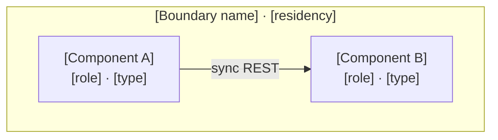

# PRD, TAD & ADR Core Templates Module

## Scope & Ownership

This module owns the copy-ready PRD, TAD, ADR, MVP and GTM template bodies. It states no rules: every field here is required by a rule owned elsewhere, and a template that disagrees with its owning rule is a defect in this module.

It inherits the parent set's Scope & Neutrality Contract, Rule Identity derivation, and finding recording contract without restating them. Rule IDs derive from the owning `##` section anchor and the rule's document-order ordinal, exactly as in the parent.

---

## Core Templates

### Shared Continuity Header

Use the parent's [metadata contract](./prd-tad-adr-mvp-gtm-guidelines.md#markdown-yaml-frontmatter-enforcement)
and [planning record](./prd-tad-adr-mvp-gtm-planning-record.md); the same join connects all five roles
and any size-bounded companion. Replace bracketed values with source-grounded values.

```yaml
title: "[Product or bounded capability]"
doc_type: "PRD-TAD-ADR-MVP-GTM"
version: "[semantic version]"
revision: "[exact joined revision]"
date: "[YYYY-MM-DD]"
lang: "[language]"
frontmatter_contract: "required"
owner: "[one accountable function]"
continuity_id: "[stable capability ID]"
prd_revision: "[exact joined revision]"
tad_revision: "[exact joined revision]"
adr_revision: "[exact joined revision]"
mvp_revision: "[exact joined revision]"
gtm_revision: "[exact joined revision]"
local_rung: "[evidence-derived rung]"
delivered_rung: "[evidence-derived rung]"
lane: "authoring"
universal_scope: false
worktree_id: "[producing worktree]"
agent_id: "[producing agent]"
```

For appearance or identity work, include the [native adoption record](design-theme-contract.md#adoption-record) in this same join. Bind existing Settings, tokens, interface/code typography, icons/ideograms and illustrations to source owners and named checks. Record unsupported dimensions as gaps; metadata does not prove browser acceptance.

### Native Design Adoption Record

Copy this table into the existing PRD–TAD–ADR–MVP–GTM join. Replace every bracketed value;
keep one owner per row and put unverified behavior in the gap column. The owning rule is the
[native design contract](design-theme-contract.md#adoption-record).

| Concern | Native owner at exact revision | Reused surface or utility | Acceptance check and result | Gap / next check |
|---|---|---|---|---|
| Identity and illustration | [path, symbol, revision] | [asset/voice owner] | [check, result] | [gap] |
| Settings and preferences | [path, symbol, revision] | [existing settings/search/reset] | [check, result] | [gap] |
| Tokens and render adapters | [path, symbol, revision] | [shared token source and native adapter] | [check, result] | [gap] |
| Typography and ideograms | [path, symbol, revision] | [interface/code font and icon owners] | [check, result] | [gap] |
| Editor surface | [path, symbol, revision] | [one active editor panel and launch paths] | [check, result] | [gap] |
| Status and evidence | [path, symbol, revision] | [warning, disclosure and metric components] | [check, result] | [gap] |

### PRD Template

```markdown
## Feature: [Name]

### Problem Statement
[User pain point → impact → opportunity]

### Personas
[Who experiences this problem and their jobs-to-be-done]

### User Journey Stage
[Which stage of which journey this feature addresses]

### User Stories
**As a** [persona] **I want** [capability] **So that** [benefit]

### Acceptance Criteria
**Given** [context] **When** [action] **Then** [outcome]

> **VCC translation**: `Verify [outcome] by [stated check] with [constraint]`
> Example: `all tests in [feature test suite] pass and no other test file is modified`

### Success Metrics
| Metric | Baseline | Target | Timeline |
|--------|----------|--------|----------|
| [User metric] | | | |
| Readiness rung (local / delivered) | [rung] / [rung] | [rung] / [rung] | |
| Time-to-value (TTV steps) | [est.] | [≤ N steps] | |
| Time-to-value (TTV elapsed) | [est.] | [≤ N min] | |
| Token cost / month | [est.] | [budget] | |
| Monthly TCO | [est.] | [budget] | |
| ROI Score | — | [threshold] | [sprint] |

### Agent experience assessment (when applicable)
[Link the maturity rubric revision and one assessment at this continuity ID/revision: four ratings or unassessed, environment, check/result/reference, rationale, gap owner and next check. Keep readiness, WTP and collected revenue separate.]

### MoSCoW Priority
[Must / Should / Could / Won't — with ROI score and rationale per tier]

### Min-Viable Scope
[Smallest deliverable that satisfies the Must-tier acceptance criteria; explicitly excludes all Could/Won't items]

### Out of Scope
[Explicitly excluded items]

### Dependencies
[Required features, services, or infrastructure]

### Ecosystem Outcome and Evidence
[User / buyer / beneficiary / operator jobs; value exchanged; pain/WTP evidence or explicit hypothesis;
one measurable outcome and observation window; join to the TAD Ecosystem Contract at this revision.]

### Reuse Outcome
[Pain/VCC, concrete consumers, observed duplicate behavior or drift; baseline and target integration time,
failed/repeated actions and support cost. Unknown savings stay unmeasured; join the TAD reuse record.]

### Open Questions
[Unresolved uncertainties requiring research]
```

### TAD Template

```markdown
## Architecture: [System / Feature Name]

### Overview
**From [input] to [output]**: System → [component flow] → delivers [outcome]

### Journey → System Mapping
| Journey Stage | Workflow        | Data Flow       | Orchestration/Harness Flow | Topology Node(s) | Component        |
|---------------|-----------------|-----------------|---------------------------|------------------|------------------|

### Topology
**Version**: [N] — [Date or milestone]
**Boundaries**: [Runtime environments, zones, or trust domains]

| Node | Role | Type | Lane | Connects to | Connection type | Data residency |
|------|------|------|------|-------------|----------------|----------------|
| [Component] | [Producer/Consumer/Router/Store/Gateway] | [Service/Function/DB/Queue] | [Authoring/Mirror/Delivery] | [Node(s)] | [Sync/Async/Stream] | [Local/Region/Cloud] |



*Node keys are identifier-safe and human text sits in labels; a bracketed key such as `[NodeA]` does not parse. Edge labels use the canonical inline form, and boundaries are named subgraphs so they project as cluster elements. See the diagram companion set for the full notation and canvas-projection rules.*

### Orchestration/Harness Flows
*(One block per AI-powered pipeline)*

**Pipeline**: [Name]  
**Topology pattern**: [Sequential | Fan-out/Fan-in | Agentic loop] | **Max iterations**: [N] | **Circuit-breaker**: [condition]  
**Token budget**: [avg prompt tokens] + [avg completion tokens] @ [cache hit rate] = [est. cost/call]

| Role | Component | Input schema | Output schema | Cost log | Fallback |
|------|-----------|-------------|--------------|----------|----------|
| Dispatcher | [Component] | [Typed payload] | [Routed payload] | — | [Typed error] |
| Executor | [Harness + model] | [Typed prompt] | [Typed response] | ✓ required | [Degraded / retry] |
| Observer | [Logger] | [Cost log stream] | [Metric / alert] | — | [Silent fail] |
| Consumer | [Downstream] | [Typed response] | [Artifact / state] | — | [Upstream error] |

### Component Specifications
**Component**: [Name]
**Responsibility**: [Single responsibility — Subject-Verb-Object (SVO) format, e.g. "Component validates input schema"]
**Interfaces**: [API contracts]
**Dependencies**: [Required components/services]
**Configuration**: [Externalized parameters]
**FOSS / Vendor**: [FOSS | Proprietary — if proprietary, link to ADR with TCO justification]
**Harness Contract** *(AI components only)*:
  - Input schema: [typed fields]
  - Output schema: [typed fields]
  - Cost log fields: `{ model, prompt_tokens, completion_tokens, cache_hits, estimated_cost_usd }`
  - Fallback path: [degraded response | upstream error]
**Token Budget** *(AI components only)*: [avg prompt tokens] + [avg completion tokens] @ [cache hit rate] = [est. cost/request]
**Orchestration Topology** *(AI components only)*: [Sequential | Fan-out | Agentic loop — max N iterations, circuit-breaker: condition]
**VCC Conditions**: [Derived from acceptance criteria — one evaluable condition per criterion]
**Evidence References**: [Per VCC — named invocable check + recorded result + surface (authoring / mirror / delivery)]
**Readiness rung**: [Local: rung] / [Delivered: rung] — derived from the Evidence References above, never authored directly

### Integration Contracts
**Interface**: [Name] | **Protocol**: [HTTP/gRPC/etc] | **Format**: [JSON/Protobuf] | **Errors**: [Strategy]

### Ecosystem Contract
**Owns**: the parent's Ecosystem record at [continuity_id@revision]; PRD owns the customer outcome.
| Participant / job | Value exchange / payer | Native owner / exact revision | Interface / authority | Current evidence / gap | Cost, privacy and exit |
|---|---|---|---|---|---|
| [applicable user, buyer, operator, developer, agent, provider or assurance role] | [benefit / consideration] | [source path, symbol, revision / reuse or smallest delta] | [contract, trust boundary / effect permission] | [check + result + surface / next check] | [license, quota, retention / recovery] |

**Developer path**: [discovery → local rehearsal → authenticated invocation → events → reconciliation → support → version retirement].
**Invocation join**: [existing browser/API/MCP/WebMCP and applicable /, #, @ register; unsupported routes and offline/device/accessibility limits].
**Dependency order**: [acyclic build/release order, distinct from runtime request/reply relationships].
**External seams**: [cost/license provenance, zero-spend fallback, permitted reference provenance and exit].

### Shared Utility and Invocation Reuse
**Owns**: the parent's Shared Utilities and Invocation Reuse record at [continuity_id@revision].
**Inventory join**: [existing component IDs; no parallel ownership register].
| Capability / pain-VCC | Source export / exact revision / current consumers and pins | Decision / smallest delta | Runtime boundary / deliberate differences | Acceptance check / removal or retention |
|---|---|---|---|---|
| [component ID / criterion] | [native owner and inspected symbol; at least two consumers for extraction] | [reuse, extend-owner, retain-local or defer / ADR] | [pure, domain, transport or view; browser/edge/Node constraints] | [input/output/errors/bytes/digests/effects / former implementation and retirement trigger] |

**Dependency order**: [portable contract → domain owner → transport adapter → view; exact public exports
or versioned protocol, consumer pin/lock changes and cycle check].
| Invocation Register join / capability ID | Surface and actual name | Input/output contract / dispatch owner | Mode / principal and effect boundary | Conformance evidence / unsupported reason |
|---|---|---|---|---|
| [existing register entry] | [browser, HTTP, MCP, WebMCP, / command, @ binding, # semantic, skill, command entrypoint] | [schema/version and handler; skill orchestrates those same handlers] | [supported, read-only, prepare-only or unsupported / server gate] | [check + result at exact revision / next check] |

**Compatibility cases**: [valid/invalid inputs, binding arguments, ordering/encoding/newlines, digests,
error mapping, limits, cancellation, replay/expiry and cross-principal attempts; distinguish domain result
parity from legitimate transport differences].
**Migration and recovery**: [owner export/check → consumer pin/lock → projection; remove replaced code;
bounded shim callers/retirement; rollback pins and persisted-data compatibility].
**Budgets**: [always-load delta, lazy chunk bytes, module count, zero-spend bound and baseline measurement].

### Value-Moving Flow and Policy Evidence (When Applicable)
| Phase | Native owner / input → output | Authority and invariant | Failure / evidence / next action |
|---|---|---|---|
| [intent, authorization, submission, unknown outcome, settlement, fulfillment or reversal] | [exact existing contract / proposed delta] | [actor, recipient, asset/network, integer precision, fees, expiry and idempotency binding] | [race/replay/reconciliation check and immutable receipt] |
**Policy**: [versioned inputs, provenance/freshness, decision/reason, evidence reference and enforcement owner].
**Boundaries**: [authentication ≠ business permission ≠ jurisdiction-specific obligations; missing evidence blocks the dependent effect].
**Inapplicability**: [rationale and reviewer if no value-moving flow; reuse the C01–C16 coverage record].

### Architectural Decisions
See ADR-[N] for each significant decision.

### Quality Attributes
| Attribute       | Scenario                                      | Pattern                   | Validation              |
|-----------------|-----------------------------------------------|---------------------------|-------------------------|
| Performance     | [Load → latency requirement]                  | [Architectural fix]       | [Test approach]         |
| Scalability     | [Growth → capacity requirement]               | [Architectural fix]       | [Test approach]         |
| Security        | [Threat → protection requirement]             | [Architectural fix]       | [Test approach]         |
| Observability   | [Signal → monitoring requirement]             | [Architectural fix]       | [Test approach]         |
| Token Cost      | [Target load → max tokens/request budget]     | Harness + caching + prompt compression | Cost log sampling; alert on p95 overrun |
| Offline Behaviour | [Connectivity loss → which capabilities remain available and which degrade] | Local-first state with deferred reconciliation; explicit degraded mode | Airplane-mode pass; reconciliation replay test |
| TCO             | [12-month projected spend per deployment model vs zero-TCO target] | FOSS-first + zero-egress infra; managed vs self-managed compared separately | Monthly cost audit; ADR review |
| Device Reach    | [Target device mix → mobile-first, browser-based, zero-infra runtime requirement] | Responsive/PWA-capable UI; no native-only APIs; static or edge-only delivery | Cross-device manual pass; mobile audit |

### Deployment Strategy
[Blue-green / canary / rolling — with rollback plan]

### Architecture Diagrams
[One block per diagram, each carrying its ID, class, notation, target surface, version, and caption per the diagram companion set]

### Diagram Register
*One row per diagram. Projected counts are the Evidence Reference for any canvas-renderable claim; a non-projecting class records zero.*

| Diagram | Class | Notation | Surface | Projects | Nodes | Edges | Clusters | Version |
|---|---|---|---|---|---|---|---|---|
| [ID] | [class] | [notation + direction] | [surface] | [yes/no] | [N] | [N] | [N] | [N] |

### Component Inventory
*Status values are Readiness Ladder rungs only; local and delivered are separate columns.*

| Layer | Component | File / Module | Local rung | Delivered rung |
|-------|-----------|---------------|------------|----------------|

### Deploy Boundary Register
*One row per boundary. State reads `closed` unless an operator instruction is referenced.*

| Boundary | From lane | To lane | Evidence Reference | Operator instruction | Rollback statement | State |
|---|---|---|---|---|---|---|
| [Name] | [Authoring / Mirror] | [Mirror / Delivery] | [named check + result] | [reference, or `none`] | [path + check] | [`closed` / `open`] |
```

### ADR Template

```markdown
## ADR-[N]: [Decision Title]
**Status**: [Proposed | Accepted | Deprecated | Superseded]
**Date**: [YYYY-MM-DD]

### Context
[Problem requiring decision]

### Decision
[Chosen approach]

### Alternatives Considered
1. [Option]: [Pros / Cons]
2. [FOSS alternative]: [Pros / Cons — always required]

### Rationale
[Why this decision]

### Reuse Compatibility Decision
[Compare direct owner reuse, contract-only adapter, intentional local semantics and extraction.
Record differing input/error/digest/effect contracts, equivalence evidence, two consumers if extracting,
chosen dependency owner, removed implementation, migration/rollback and revisit trigger.]

### TCO Impact

*If either the chosen option or the FOSS alternative offers more than one deployment model (Managed/Serverless, Provisioned/Self-Managed, Hybrid/Consolidated — see Deployment-Model TCO Variants), add one column per variant rather than blending them.*

| Dimension | Chosen Option [variant] | Best FOSS Alternative [variant] | Best FOSS Alternative [other variant, if applicable] | Delta / 12 months |
|---|---|---|---|---|
| Infra cost | [$/mo] | [$/mo] | [$/mo] | [+/- $] |
| Egress cost | [$/mo] | [$/mo] | [$/mo] | [+/- $] |
| Token cost  | [$/mo] | [$/mo] | [$/mo] | [+/- $] |
| Ops burden | [Low/Med/High] | [Low/Med/High] | [Low/Med/High] | — |
| Vendor risk | [Low/Med/High] | [Low] | [Low] | — |

### Consequences
- **Positive**: [Benefits]
- **Negative**: [Costs / Risks]
- **Neutral**: [Other impacts]
```

### MVP Template

```markdown
## MVP: [Slice name]
**Projects**: PRD `Must` features [ids] · TAD components [ids] · ADR [ids] at `continuity_id@revision`

| Feature | VCC | Evidence Reference | Local rung | Delivered rung |
|---|---|---|---|---|
| [Must id] | [condition] | [check + result + surface] | [rung] | [rung] |

**Demo Skeleton**: Hook / Probe / Reveal=VCC [id] / [domain action] / Close — total [N]s
**Domain-Object Rubric**: current contiguous level [L] · blocker for next [component]
**Min-viable scope**: [what is in] · **Won't (this increment)**: [what is out]

### Roadmap
**Owner and join**: [one product-owned roadmap / continuity_id@revision; portfolio views reference it].
| Phase / outcome | Pain evidence / rank | Reuse / new delta / owner | Prerequisite / exit VCC | Bounds / wait condition | Stop, recovery / next check |
|---|---|---|---|---|---|
| [measurable buyer outcome] | [validated pain/WTP or hypothesis / reuse-adjusted priority rationale] | [named source / smallest extension / accountable function] | [earlier phase / observable acceptance evidence] | [active-time ETA and time/byte/module/token/spend caps; lazy-load delta / external unblock condition] | [stop or pivot threshold / rollback / successor trigger] |
**Reuse rollout**: [TAD reuse rows / owner checks → export → exact consumer pins → adapters → affected conformance; rollback and deletion evidence].
**Deferred ideas**: [Won't this increment / reason / dependency / owner / revisit trigger].
**Milestones**: [documentation, local proof, source release, deployment, first collection and repeat demand each link their own evidence].
```

### GTM Template

```markdown
## GTM: [Segment]
**Projects**: MVP slice · pain [P-id] · WTP evidence at `continuity_id@revision`

| Stream | Segment exists now | Distance to first dollar | Mechanism | Demand | Collected revenue |
|---|---|---|---|---|---|
| [S-id] | yes/no | [rank] | proven/no | validated/no | [amount or none] |

**Learn loop**: [completed outcome / paid conversion / operating cost] → successor Context [id]
**Ecosystem dependency**: [TAD participant/value row and PRD pain ID at the same revision].
**Reuse outcome measurement**: [same buyer journey / before-after integration time, failed or repeated actions and support cost / observation period; savings, payment and demand each need separate evidence].
**Roadmap join**: [MVP phase / observed outcome / continue, pivot or stop threshold; no second roadmap].
```

### From-0-to-1 Coverage Record

Copy into the joined artifact; use the parent's [C01–C16 domain IDs](./prd-tad-adr-mvp-gtm-guidelines.md#from-0-to-1-coverage-contract).

```markdown
**Join**: [continuity_id@revision] · **As of**: [date] · **Owner**: [function]
**0**: [grounded opportunity + unknowns] · **1**: [target outcome + scope + observation window]
| Domain ID | Decision | Source section@revision | Evidence / gap | Owner | Next check / trigger |
|---|---|---|---|---|---|
| [one row each C01–C16] | covered / deferred / not-applicable | [exact join] | [evidence, or reason and dependency] | [function] | [check, revisit trigger or applicability reviewer] |
**Coverage**: [n]/16 dispositioned; [k]/[applicable] covered; [d] deferred; [x] not applicable.
**Local / delivered readiness**: [evidence-derived rungs, kept separate from coverage].
```

### Pitch Deck / Business Plan / Financial Model

Instantiate the [Venture Record module](./prd-tad-adr-mvp-gtm-venture.md) registers: Slide Register covering twelve roles, business-plan section contract, assumption register, driver schedules, unit economics, three linked statements, capitalization, use of funds, ADLC Cost Ledger, and reconciled Base/Downside/Upside. For each deck variant, instantiate the [Pitch Deck Guidelines](./pitch-deck-guidelines.md) records: Variant Register, ask fields, Claim Manifest, Objection Register, and Delivery & Outcome Log. Do not duplicate those tables here.


---

---
