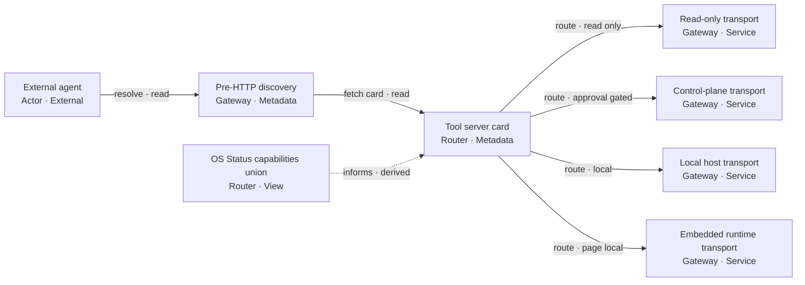

# PRD, TAD & ADR Readiness & Lane Topology Module

## Scope & Ownership

This module owns the ordered status vocabulary, the agent-platform readiness dimensions, the invocation surface contract, and the lane sequence with its deploy boundaries. Every readiness claim in the set draws its value from here.

It inherits the parent set's Scope & Neutrality Contract, Rule Identity derivation, and finding recording contract without restating them. Rule IDs derive from the owning `##` section anchor and the rule's document-order ordinal, exactly as in the parent.

---

## Readiness Ladder

**Defines the single ordered status vocabulary used by every readiness claim in this guideline set, and binds each rung to the evidence that earns it.** Any section that states a status — Readiness Tiers, Readiness Gap Matrix, Component Inventory, Follow-On PRD/TAD — draws its value from this ladder and no other.

A status is a **derived** value, never an authored opinion. It is computed from the Evidence References attached to a capability (see Autonomous Implementation Verification). Writing a rung by hand without the evidence that earns it is an `unproven-claim`.

### The Ladder

Strictly ordered, lowest to highest:

```
undocumented  <  spec-complete  <  dev-proven  <  runtime-ready  <  production-verified
```

| Rung | Earned when | Evidence required |
|---|---|---|
| **`undocumented`** | The capability has no VCC and no Evidence Reference | — |
| **`spec-complete`** | At least one VCC is stated; no Evidence Reference yet satisfies it | VCC present, unproven |
| **`dev-proven`** | At least one VCC is satisfied by a reproducible local check with a recorded result | ≥1 local Evidence Reference |
| **`runtime-ready`** | **Every** VCC attached to the capability carries a satisfying Evidence Reference | Complete local evidence set |
| **`production-verified`** | The capability is `runtime-ready` **and** carries a recorded delivery-surface check result **and** a referenced explicit operator promotion instruction | Complete evidence + delivery proof + operator instruction |

### Directives

- Assign exactly one rung per capability; forbid ranges, hedges, and compound values such as "mostly runtime-ready"
- Derive every rung from Evidence References only; forbid deriving a rung from a file name, a directory layout, a downstream mirror, or a narrative claim
- Report **local readiness** and **delivered readiness** as two separate fields; forbid one status field that blends them (`blended-status`)
- Treat the ladder as monotone under evidence: adding an Evidence Reference while retaining every existing one must never lower a rung; a drop under added evidence is a defect in the derivation, not a status change
- Never skip a rung: `production-verified` requires the `runtime-ready` condition to hold first
- A claim of `runtime-ready` with any unproven VCC is an `unproven-claim` at `blocker` severity; a claim of `production-verified` with no referenced operator promotion instruction is an `ungated-promotion`
- Re-derive every rung whenever acceptance criteria or VCCs change (see Phase 4); a stale rung produces a false completion
- Declare a status value outside this ladder only after extending this section; an unrecognised value is an `unknown-status`

---

---

## Agent-Platform Readiness

**Maps how a product documents and delivers three complementary readiness dimensions for AI-native systems: unified operator visibility (Agentic OS), external agent onboarding (AI Agent), and tool-surface federation (MCP Gateway).** This section is vendor-, protocol-, and repository-neutral. Placeholders (`[...]`) stand in for product-specific identifiers; concrete stacks appear only as non-binding reference patterns.

### Readiness Dimensions

| Dimension | Function (neutral name) | Primary consumer | Default token cost | Spend boundary |
|---|---|---|---|---|
| **Agentic OS-ready** | **OS Status Surface** — read-only aggregation over existing harness run state, capability catalogs, cost ledgers, approval-gate catalogs, and circuit-breaker bounds | Operator, maintainer | **$0** — zero model calls on every view | Read-only; must not issue, verify, or consume approval tokens |
| **AI Agent-ready** | **Agent Discovery Surface** — machine-discoverable metadata, typed harness contracts, and callable tool surfaces segmented by trust boundary | External agent, MCP host, browser agent | **$0** on discovery; harness-dependent on execution | Discovery paths must not invoke paid models; execution routes through existing spend gates |
| **MCP Gateway-ready** | **Gateway Federation Contract** — coordinated routing across multiple existing tool transports without a new monolithic proxy tier | External agent resolver | **$0** on federation/discovery | Orchestration/spend routes to the control-plane surface; read-only routes to discovery surfaces |

**Directives**:
- Name all three dimensions in PRD scope or explicit exclusions; forbid ambiguous “agent-ready” claims that do not state which dimension(s) are in scope
- Derive readiness from document content and frontmatter only; forbid inferring readiness from directory layout, file names, or downstream mirrors
- Each dimension must be expressible as VCCs, and each VCC must carry an Evidence Reference, before status is promoted to `runtime-ready` on the Readiness Ladder
- State each dimension's rung using Readiness Ladder values only; forbid dimension-local status vocabularies

### Readiness Tiers

| Tier | Definition | Typical PRD home | Promotion gate | Minimum rung to exit |
|---|---|---|---|---|
| **Must** | Smallest artifact that makes the dimension truthful at demo/load: visibility, discovery, or federation without new persistent stores or proxy tiers | Combined PRD/TAD or product PRD | VCC proof on clean environment with a recorded Evidence Reference; TTV recorded | `runtime-ready` |
| **Follow-on** | Closes spend-safety, live orchestration, or operator-UI gaps left open by Must-tier | Separate follow-on PRD/TAD linked from parent | VCC proof per track with a recorded Evidence Reference; no Must-tier rung regression | `runtime-ready` per track |
| **Won't (this increment)** | Explicit deferrals: monolithic proxy gateway, unbounded remote tool parity, auto-approval | Parent PRD Out of Scope | — | `undocumented` (declared, not implied) |

### Agentic OS-Ready

The **OS Status Surface** exposes one or more read views (e.g. process list, capability union, cost summary, gate catalog, circuit breakers) over state that **already exists** in harness runtimes — computed at read time, not copied into a new OS-level database.

**Agentic OS Template**:
```markdown
## Agentic OS: [Product / Feature Name]

**Tool surface**: `[...]` (single combined tool with `view` argument **or** separate per-view tools — document choice in ADR)
**Read views**: `[process_list | capabilities | cost_summary | gate_catalog | circuit_breakers | ...]`
**Aggregation rule**: read-time only; zero new persistent datastore
**Token budget**: 0 prompt + 0 completion = $0.00 / call (non-zero cost log = defect)
**Partial failure**: `unavailableSources[]` / `unreachableCatalogs[]` / `validationFailures[]` — call succeeds; omitting a source is not a silent success

### Acceptance (example)
**Given** readable harness state exists **When** OS Status Surface is called **Then** normalized entries return and no harness state file is modified

> **VCC**: `Verify [view] response shape matches schema and before/after snapshot diff of every read harness state source is empty`
```

**Directives**:
- Prefer one combined OS Status tool with a typed `view` enum when wiring surface is the constraint; document the ergonomics tradeoff in an ADR
- Gate Catalog views are read/describe-only unless a separate story explicitly adds token issuance
- Map every OS read view to Orchestration/Harness Flow (zero-token sequential, max 1 iteration)

### AI Agent-Ready

**AI Agent-ready** means an external agent can **discover**, **select the correct surface**, and **invoke typed tools** without scraping HTML or learning each harness catalog independently.

**Discovery chain** (reference pattern — adapt transport names to product):

```
Resolver → [Pre-HTTP discovery metadata] → [Service entry + link headers] → [Machine-readable tool card]
         → [OS Status `capabilities` view **or** equivalent catalog union] → Surface selection by trust boundary
```

**Surface selection by trust boundary** (document in TAD topology):

| Trust need | Route to | Typical scope |
|---|---|---|
| Read-only public content | Discovery / read transport | Search, fetch, metadata |
| Approval-gated orchestration | Control-plane transport | Multi-stage harness runs, spend-bearing tools |
| Richest local/dev surface | Local host transport | Full harness set not exposed remotely by design |
| In-browser inspection | Embedded runtime transport | Page-local read tools |

**Directives**:
- Document surface separation explicitly; forbid claiming one transport exposes the full harness set when policy restricts remote parity
- Every public discovery path must spend **zero LLM tokens** before optional chat/orchestration
- Agent Discovery Surface metadata must stay aligned with the canonical tool contract owner; forbid duplicate schema registries

### MCP Gateway-Ready

**MCP Gateway-ready** does not require a fifth monolithic proxy. The **Gateway Federation Contract** coordinates **existing** transports under shared tool/cost/approval schemas.

**Anti-pattern**: single unified proxy that re-implements dispatch already owned by local and control-plane servers — duplicates schema maintenance, adds latency, and splits token accounting.

**Preferred pattern — discovery-first federation**:

**Diagram GWF-1** · Class: Component topology · Notation: `flowchart LR` · Surface: any projecting graph surface · Version: 1
**Caption**: One discovery chain fans out to four existing transports; the capabilities union informs the tool card rather than proxying it.



| Node | Role · Type | Trust boundary | Token cost |
|---|---|---|---|
| `Agent` | Actor · External | — | — |
| `Disc` | Gateway · Metadata | read | 0 |
| `Card` | Router · Metadata | read | 0 |
| `Read` | Gateway · Service | read | 0 |
| `Ctrl` | Gateway · Service | approval-gated | harness-dependent |
| `Local` | Gateway · Service | local | harness-dependent |
| `Embed` | Gateway · Service | read | 0 |
| `Union` | Router · View | read | 0 |

**Gateway Federation Template**:
```markdown
## Gateway Federation: [System Name]

**Surfaces in federation**: [N] (list role + transport type each)
**Catalog union source**: [OS Status capabilities view | equivalent]
**Routing rule**: [trust boundary → surface matrix]
**Excluded**: monolithic proxy tier (ADR required if ever reconsidered)
```

**Directives**:
- Enumerate every federated surface in Topology with connection type and data residency
- Record gateway federation decision in ADR with TCO comparison vs unified-proxy alternative
- Capabilities union must deduplicate by tool id and name contributing catalogs in `sourceCatalogs[]` (or equivalent)

### Execution Order Guidelines

Readiness work follows a **dependency-ordered sequence**. Must-tier dimensions ship before Follow-on tracks; tracks ship in an order that respects spend safety and proof-before-UI.

**Relationship to the phase model**: the phase model (`from-0-to-1-prd--tad-creation-process`) and this execution order are **not** two competing sequences. Phases 0–3 produce the documents; this order sequences the *workstreams those documents describe*, and every workstream below sits inside Phase 3's exit and Phase 4's iteration. The canonical order used by `gate-order-drift` is the phase model; a documented workstream order that contradicts the table below is `gate-order-drift` scoped to this section, not to the phase model.

| Phase | Produces | Governs which workstreams |
|---|---|---|
| Phase 0 | Validated problem, ROI, TCO, TTV ceiling | All, before any workstream starts |
| Phase 1 | PRD with criteria and rungs targeted | All Must-tier scoping |
| Phase 2 | TAD with VCCs, topology, lanes, registers | All, per workstream |
| Phase 3 | Baselined pair, alignment check at zero blockers | Gate for Must-tier start |
| Phase 4 | Bounded revision cycles | Follow-on tracks and rung re-derivation |

**Canonical execution order**:

```
Phase 0 — Problem + ROI + TTV ceiling (all dimensions)
    ↓
Must-tier A — Agentic OS (OS Status Surface, read-only, $0)
    ↓
Must-tier B — AI Agent discovery (metadata + read transport + tool card)
    ↓
Must-tier C — MCP Gateway federation (surface matrix + capabilities union; no new proxy)
    ↓
Follow-on Track 1 — Spend safety (durable approval-token store on control plane; single-use; TTL)
    ↓
Follow-on Track 2 — Live orchestration proof (env-gated harnesses; one golden-path run; Cost_Log validation)
    ↓
Follow-on Track 3 — Operator UI projection (dashboard document → existing UI apply path; no second pipeline)
```

| Track | Depends on | Blocks | Min-viable exit (VCC pattern) |
|---|---|---|---|
| Must: Agentic OS | Harness state exists | Gateway capabilities union | OS views return typed JSON; $0 cost log; no state mutation |
| Must: AI Agent discovery | Discovery metadata owners | External agent onboarding | Discovery checks exit 0; zero token spend on discovery |
| Must: Gateway federation | Must A + B | Follow-on 2 routing clarity | Capabilities union deduplicates; unreachable catalogs listed, not fatal |
| Follow-on 1: Spend safety | Must C + control plane | Follow-on 2 live spend | Token survives restart within TTL; reuse fails closed |
| Follow-on 2: Live orchestration | Follow-on 1 | Demo-grade autonomy proof | One approved run persists run manifest; blocked run cost == 0 |
| Follow-on 3: Operator UI | Must A (visibility) | — | Dashboard doc renders through existing UI bridge; no duplicate graph pipeline |

**Directives**:
- Document execution order in parent PRD/TAD and expand Follow-on tracks in a linked follow-on PRD/TAD; forbid parallel drift across surfaces before gateway contract is frozen
- Follow-on Track 2 must not start until Follow-on Track 1 exit criteria pass or an ADR records explicit acceptance of in-memory-only tokens with stated risk
- Prefer **proof over scaffolding**: each track ends in a VCC-demonstrable artifact (test exit code, persisted manifest, reachable URL) — not narrative “implemented” claims
- Re-run Must-tier regression checks when any Follow-on track merges

### Invocation Surface Contract

**Defines what an invocation route is, where it is declared, and who owns it**, so that route and tool findings are raisable rather than nominal. Sigils are notation, not vendor syntax; substitute an equivalent notation and the rules hold unchanged.

| Route kind | Notation | Resolves to | Declaration site |
|---|---|---|---|
| **Command route** | `/[name]` | One invocable operation with typed arguments | The owning document's Invocation Register |
| **Semantic tag** | `#[name]` | One addressable context or artifact class | The owning document's Invocation Register |
| **Binding** | `@[name]` | One named entity: a surface, a role, or a catalog | The owning document's Invocation Register |
| **Tool identity** | `[namespace].[tool]` | One callable tool contract | The federation contract, and the capability catalog |

**Invocation Register template** *(one per document that declares any route)*:
```markdown
## Invocation Register: [Document / Surface Name]

| Route | Kind | Owner | Typed arguments | Trust boundary | Token cost |
|---|---|---|---|---|---|
| `/[name]` | Command | [owning function] | [typed schema] | [read / approval-gated / local] | [0 for discovery] |
| `#[name]` | Tag | [owning function] | — | [read] | 0 |
| `@[name]` | Binding | [owning function] | — | [read] | 0 |
| `[ns].[tool]` | Tool identity | [owning function] | [typed schema] | [read / approval-gated] | [harness-dependent] |
```

**Directives**:
- Declare every route in exactly one Invocation Register; a route declared nowhere is an `orphan-route`, and a route declared in two registers is an `ambiguous-route`
- Match route identity on the full token including its sigil, with case preserved; forbid case-insensitive or prefix matching, which manufactures ambiguity that does not exist
- Register every tool identity in **both** the federation contract and the capability catalog; absence from the federation contract is an `unfederated-tool` and absence from the capability catalog is an `uncatalogued-tool`
- Derive the route set from declared document content only; forbid deriving a route from a file name, a directory, or a URL path
- Keep every discovery and read route at zero token cost, consistent with the Readiness Dimensions spend boundaries; a non-zero cost on a read route is a `paid-read-path`
- Name the trust boundary per route and route approval-gated and spend-bearing routes through the control-plane surface; forbid a read surface that exposes a spend-bearing route

### Readiness Gap Matrix Template

```markdown
## Readiness Gap Matrix

*Local rung and delivered rung are separate columns; both draw from the Readiness Ladder. Priority is the highest severity among the findings linked to that workstream, or `none`.*

| Workstream | Local rung | Delivered rung | Gap | Priority | Exit criteria (VCC) |
|---|---|---|---|---|---|
| OS Status Surface (local) | [rung] | [rung] | [...] | blocker/major/minor/none | [...] |
| OS Status Surface (remote) | [rung] | [rung] | [...] | blocker/major/minor/none | [...] |
| Gateway discovery | [rung] | [rung] | [...] | blocker/major/minor/none | [...] |
| Control-plane orchestration | [rung] | [rung] | [...] | blocker/major/minor/none | [...] |
| Spend safety (tokens) | [rung] | [rung] | [...] | blocker/major/minor/none | [...] |
| Live harness proof | [rung] | [rung] | [...] | blocker/major/minor/none | [...] |
| Operator UI projection | [rung] | [rung] | [...] | blocker/major/minor/none | [...] |
```

### Follow-On PRD/TAD Template (linked increment)

When Must-tier readiness ships with open spend or UI gaps, add a **follow-on combined PRD/TAD** that:
- References parent version in frontmatter (`parent`, `parent_version`)
- Defines tracks using neutral names (Track 1/2/3 mapped to spend safety, live orchestration, operator UI)
- States local-vs-delivered status separately using Readiness Ladder rungs; forbid blending them in one status field
- Includes topology **version note** for delta only (do not overwrite parent topology in place)
- Lists validation commands as VCC hosts (mechanism-agnostic); each command named here is the Evidence Reference host for its rung

---

---

## Lane Topology & Deploy Boundary

**Maps the ordered environment lanes a change traverses from authoring to public delivery, and the gate between each pair.** Distinct from Topology (structural component snapshot within one lane): this section governs *movement between* lanes. Lanes are named by function; forbid naming a lane after a vendor, a host, a repository, or a path.

### Canonical Lane Sequence

```
[Authoring lane] ──boundary A──▶ [Mirror lane] ──boundary B──▶ [Delivery lane]
```

| Lane | Function | Mutation rights | Default readiness ceiling |
|---|---|---|---|
| **Authoring lane** | Where change is written and proven locally against reproducible checks | Full: source, tests, and local state | `runtime-ready` |
| **Mirror lane** | A faithful non-public copy used to prove the delivered shape before exposure | Publish-only, from an approved authoring state | `runtime-ready` |
| **Delivery lane** | The publicly reachable surface | Publish-only, from an approved mirror state | `production-verified` |

### Deploy Boundary Contract

Every boundary between adjacent lanes is a **named** gate carrying four required parts:

| Part | Definition |
|---|---|
| **Name** | A stable identifier for the boundary, referenced by every promotion record |
| **Evidence Reference** | The reproducible check plus recorded result that qualifies the source state for promotion |
| **Operator instruction** | An explicit, referenced human authorisation; forbid implicit, scheduled, or inferred approval |
| **Rollback statement** | The stated path back to the prior delivered state, with its own check |

### Directives

- **A Deploy Boundary is `closed` by default.** Absent a referenced operator instruction, no promotion occurs and `production-verified` is unreachable. Forbid a default-open boundary and forbid a boundary whose state is undocumented
- Document all three lanes with their boundaries before the first promotion; a missing lane is a `missing-lane`, a boundary missing any of its four parts is an `incomplete-lane-transition`
- Forbid any authoring-lane command that mutates a mirror or delivery surface; such a command is a `deploy-boundary-breach` at `blocker` severity regardless of how convenient the shortcut is
- Promote only whole approved states; forbid promoting a partial state or promoting directly from the authoring lane to the delivery lane, skipping the mirror lane
- State data residency per lane, not only per node; a component that changes residency across a boundary must say so in the topology version note
- Record every promotion with its boundary name, its Evidence Reference, and its operator instruction reference; an unrecorded promotion is an `ungated-promotion`
- Keep the rollback statement current: a rollback path that no longer resolves is `stale-evidence`

---

---
