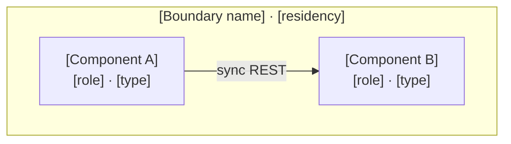

# PRD, TAD & ADR Core Templates Module

## Scope & Ownership

This module owns the copy-ready PRD, TAD, and ADR template bodies. It states no rules: every field here is required by a rule owned elsewhere, and a template that disagrees with its owning rule is a defect in this module.

It inherits the parent set's Scope & Neutrality Contract, Rule Identity derivation, and finding recording contract without restating them. Rule IDs derive from the owning `##` section anchor and the rule's document-order ordinal, exactly as in the parent.

---

## Core Templates

### PRD Template

```markdown
## Feature: [Name]

### Problem Statement
[User pain point → impact → opportunity]

### Personas
[Who experiences this problem and their jobs-to-be-done]

### User Journey Stage
[Which stage of which journey this feature addresses]

### User Stories
**As a** [persona] **I want** [capability] **So that** [benefit]

### Acceptance Criteria
**Given** [context] **When** [action] **Then** [outcome]

> **VCC translation**: `Verify [outcome] by [stated check] with [constraint]`
> Example: `all tests in [feature test suite] pass and no other test file is modified`

### Success Metrics
| Metric | Baseline | Target | Timeline |
|--------|----------|--------|----------|
| [User metric] | | | |
| Readiness rung (local / delivered) | [rung] / [rung] | [rung] / [rung] | |
| Time-to-value (TTV steps) | [est.] | [≤ N steps] | |
| Time-to-value (TTV elapsed) | [est.] | [≤ N min] | |
| Token cost / month | [est.] | [budget] | |
| Monthly TCO | [est.] | [budget] | |
| ROI Score | — | [threshold] | [sprint] |

### MoSCoW Priority
[Must / Should / Could / Won't — with ROI score and rationale per tier]

### Min-Viable Scope
[Smallest deliverable that satisfies the Must-tier acceptance criteria; explicitly excludes all Could/Won't items]

### Out of Scope
[Explicitly excluded items]

### Dependencies
[Required features, services, or infrastructure]

### Open Questions
[Unresolved uncertainties requiring research]
```

### TAD Template

```markdown
## Architecture: [System / Feature Name]

### Overview
**From [input] to [output]**: System → [component flow] → delivers [outcome]

### Journey → System Mapping
| Journey Stage | Workflow        | Data Flow       | Orchestration/Harness Flow | Topology Node(s) | Component        |
|---------------|-----------------|-----------------|---------------------------|------------------|------------------|

### Topology
**Version**: [N] — [Date or milestone]
**Boundaries**: [Runtime environments, zones, or trust domains]

| Node | Role | Type | Lane | Connects to | Connection type | Data residency |
|------|------|------|------|-------------|----------------|----------------|
| [Component] | [Producer/Consumer/Router/Store/Gateway] | [Service/Function/DB/Queue] | [Authoring/Mirror/Delivery] | [Node(s)] | [Sync/Async/Stream] | [Local/Region/Cloud] |



*Node keys are identifier-safe and human text sits in labels; a bracketed key such as `[NodeA]` does not parse. Edge labels use the canonical inline form, and boundaries are named subgraphs so they project as cluster elements. See the diagram companion set for the full notation and canvas-projection rules.*

### Orchestration/Harness Flows
*(One block per AI-powered pipeline)*

**Pipeline**: [Name]  
**Topology pattern**: [Sequential | Fan-out/Fan-in | Agentic loop] | **Max iterations**: [N] | **Circuit-breaker**: [condition]  
**Token budget**: [avg prompt tokens] + [avg completion tokens] @ [cache hit rate] = [est. cost/call]

| Role | Component | Input schema | Output schema | Cost log | Fallback |
|------|-----------|-------------|--------------|----------|----------|
| Dispatcher | [Component] | [Typed payload] | [Routed payload] | — | [Typed error] |
| Executor | [Harness + model] | [Typed prompt] | [Typed response] | ✓ required | [Degraded / retry] |
| Observer | [Logger] | [Cost log stream] | [Metric / alert] | — | [Silent fail] |
| Consumer | [Downstream] | [Typed response] | [Artifact / state] | — | [Upstream error] |

### Component Specifications
**Component**: [Name]
**Responsibility**: [Single responsibility — Subject-Verb-Object (SVO) format, e.g. "Component validates input schema"]
**Interfaces**: [API contracts]
**Dependencies**: [Required components/services]
**Configuration**: [Externalized parameters]
**FOSS / Vendor**: [FOSS | Proprietary — if proprietary, link to ADR with TCO justification]
**Harness Contract** *(AI components only)*:
  - Input schema: [typed fields]
  - Output schema: [typed fields]
  - Cost log fields: `{ model, prompt_tokens, completion_tokens, cache_hits, estimated_cost_usd }`
  - Fallback path: [degraded response | upstream error]
**Token Budget** *(AI components only)*: [avg prompt tokens] + [avg completion tokens] @ [cache hit rate] = [est. cost/request]
**Orchestration Topology** *(AI components only)*: [Sequential | Fan-out | Agentic loop — max N iterations, circuit-breaker: condition]
**VCC Conditions**: [Derived from acceptance criteria — one evaluable condition per criterion]
**Evidence References**: [Per VCC — named invocable check + recorded result + surface (authoring / mirror / delivery)]
**Readiness rung**: [Local: rung] / [Delivered: rung] — derived from the Evidence References above, never authored directly

### Integration Contracts
**Interface**: [Name] | **Protocol**: [HTTP/gRPC/etc] | **Format**: [JSON/Protobuf] | **Errors**: [Strategy]

### Architectural Decisions
See ADR-[N] for each significant decision.

### Quality Attributes
| Attribute       | Scenario                                      | Pattern                   | Validation              |
|-----------------|-----------------------------------------------|---------------------------|-------------------------|
| Performance     | [Load → latency requirement]                  | [Architectural fix]       | [Test approach]         |
| Scalability     | [Growth → capacity requirement]               | [Architectural fix]       | [Test approach]         |
| Security        | [Threat → protection requirement]             | [Architectural fix]       | [Test approach]         |
| Observability   | [Signal → monitoring requirement]             | [Architectural fix]       | [Test approach]         |
| Token Cost      | [Target load → max tokens/request budget]     | Harness + caching + prompt compression | Cost log sampling; alert on p95 overrun |
| Offline Behaviour | [Connectivity loss → which capabilities remain available and which degrade] | Local-first state with deferred reconciliation; explicit degraded mode | Airplane-mode pass; reconciliation replay test |
| TCO             | [12-month projected spend per deployment model vs zero-TCO target] | FOSS-first + zero-egress infra; managed vs self-managed compared separately | Monthly cost audit; ADR review |
| Device Reach    | [Target device mix → mobile-first, browser-based, zero-infra runtime requirement] | Responsive/PWA-capable UI; no native-only APIs; static or edge-only delivery | Cross-device manual pass; mobile audit |

### Deployment Strategy
[Blue-green / canary / rolling — with rollback plan]

### Architecture Diagrams
[One block per diagram, each carrying its ID, class, notation, target surface, version, and caption per the diagram companion set]

### Diagram Register
*One row per diagram. Projected counts are the Evidence Reference for any canvas-renderable claim; a non-projecting class records zero.*

| Diagram | Class | Notation | Surface | Projects | Nodes | Edges | Clusters | Version |
|---|---|---|---|---|---|---|---|---|
| [ID] | [class] | [notation + direction] | [surface] | [yes/no] | [N] | [N] | [N] | [N] |

### Component Inventory
*Status values are Readiness Ladder rungs only; local and delivered are separate columns.*

| Layer | Component | File / Module | Local rung | Delivered rung |
|-------|-----------|---------------|------------|----------------|

### Deploy Boundary Register
*One row per boundary. State reads `closed` unless an operator instruction is referenced.*

| Boundary | From lane | To lane | Evidence Reference | Operator instruction | Rollback statement | State |
|---|---|---|---|---|---|---|
| [Name] | [Authoring / Mirror] | [Mirror / Delivery] | [named check + result] | [reference, or `none`] | [path + check] | [`closed` / `open`] |
```

### ADR Template

```markdown
## ADR-[N]: [Decision Title]
**Status**: [Proposed | Accepted | Deprecated | Superseded]
**Date**: [YYYY-MM-DD]

### Context
[Problem requiring decision]

### Decision
[Chosen approach]

### Alternatives Considered
1. [Option]: [Pros / Cons]
2. [FOSS alternative]: [Pros / Cons — always required]

### Rationale
[Why this decision]

### TCO Impact

*If either the chosen option or the FOSS alternative offers more than one deployment model (Managed/Serverless, Provisioned/Self-Managed, Hybrid/Consolidated — see Deployment-Model TCO Variants), add one column per variant rather than blending them.*

| Dimension | Chosen Option [variant] | Best FOSS Alternative [variant] | Best FOSS Alternative [other variant, if applicable] | Delta / 12 months |
|---|---|---|---|---|
| Infra cost | [$/mo] | [$/mo] | [$/mo] | [+/- $] |
| Egress cost | [$/mo] | [$/mo] | [$/mo] | [+/- $] |
| Token cost  | [$/mo] | [$/mo] | [$/mo] | [+/- $] |
| Ops burden | [Low/Med/High] | [Low/Med/High] | [Low/Med/High] | — |
| Vendor risk | [Low/Med/High] | [Low] | [Low] | — |

### Consequences
- **Positive**: [Benefits]
- **Negative**: [Costs / Risks]
- **Neutral**: [Other impacts]
```

---

---
