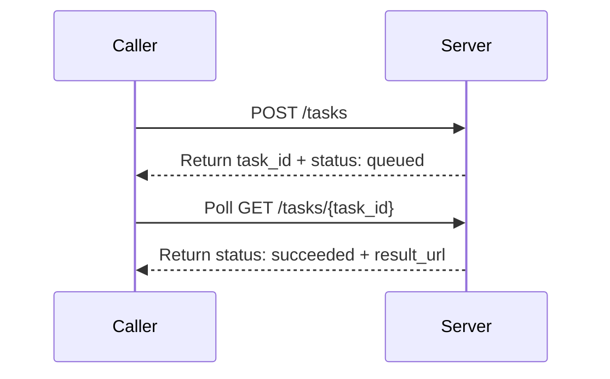

# {{provider}} · {{api_family}}

---

## Schema Legend

### Column Order & Zone Logic

```
[ANCHOR]       [CLASSIFY]        [IDENTITY]        [CONTRACT]                                      [SEQUENCE]              [CLASSIFY-2]               [PROSE]                              [BINDING]
endpoint       kind              key · type · val  required · direction                            actor · seq-note        location · scope · pattern key-description · value-description  module · class · function
```

`endpoint` is col 1 because it is the primary grouping key — every other column is subordinate to it. A reader scans endpoint first to locate their context, then reads right into the row.

Zones read left-to-right from most structural (machine-queryable, sparse-friendly) to most discursive (human prose, binding metadata). The four sparsest columns (`module · class · function`, often blank during API reference pass) land at the far right so the informational core stays compact.

The `[SEQUENCE]` zone (`actor · seq-note`) sits between `[CONTRACT]` and `[CLASSIFY-2]` so that the direction of data flow (`direction`) is resolved before the participant (`actor`) and message label (`seq-note`) are assigned — enabling direct, lossless export to a Mermaid `sequenceDiagram` without touching any other column.

---

### Column Definitions

#### `endpoint`
The API operation this row belongs to. Format: `METHOD /path` (relative to `base-url`), e.g. `POST /api/v3/images/generations`. Use `ALL` for rows that apply globally across every endpoint (base URL, auth headers). Sort rows by endpoint, then by kind order within each endpoint.

**Kind sort order within an endpoint:** `config → header → path → param → return → enum → error`
This mirrors the natural implementation read order: setup → request → response → reference → errors.

---

#### `kind`
Controlled vocabulary. Classifies what type of entity the row describes. Determines which other columns are applicable (see sparsity rules below).

| kind | meaning | typical `direction` | `required` |
|------|---------|-------------------|------------|
| `config` | Operational/environment-level setting not part of the wire format | `in` or `out` | `yes` or `—` |
| `header` | HTTP request or response header | `in` or `out` | `yes` or `no` |
| `path` | URL path segment variable, interpolated before the request is sent | `in` | `yes` |
| `param` | Request body or query string parameter | `in` | `yes`, `no`, or `conditional` |
| `return` | Response body field | `out` | `yes`, `no`, or `conditional` |
| `enum` | Enumerated valid value for a `param` or `return` key | same as parent | `—` |
| `error` | HTTP status code or named error code returned by the server | `out` | `—` |

---

#### `key`
The canonical field name as it appears on the wire (API param name, header name, response field, error code key). For nested fields use dot-notation: `data[].url`, `error.code`. For codebase binding rows, use the internal symbol name and cross-reference via `key-description`.

**Key sort order:** a→z within each `kind` group within each `endpoint`, except `enum` rows which sort a→z by `value`.

---

#### `type`
Data type of the field. Use wire-format types: `string`, `integer`, `boolean`, `float`, `array<T>`, `object`, `string (url)`, `string (base64)`, `integer (unix)`. For enums, repeat the parent type (usually `string`). For discriminated union arrays, use `array<object (union)>`.

---

#### `value`
The fixed, default, or example value for this field. Use backtick formatting for literal values: `` `application/json` ``. Leave blank if the value is caller-supplied and has no fixed default. For `enum` rows, this column carries the specific enum value being documented.

---

#### `required`
Whether the field must be present. Controlled vocabulary:

| value | meaning |
|-------|---------|
| `yes` | Always required |
| `no` | Optional |
| `conditional` | Required only under specific conditions (explain in `value-description`) |
| `—` | Not applicable (used for `enum` and `error` rows) |

---

#### `direction`
Data flow relative to the caller.

| value | meaning |
|-------|---------|
| `in` | Caller → Server (request) |
| `out` | Server → Caller (response) |

---

#### `actor`
The named participant that **sends** this message in a `sequenceDiagram`. Decouples participant identity from the binary `direction` axis so multi-party flows (e.g. server → webhook → caller) are unambiguous.

Controlled vocabulary (`actor-vocab` in frontmatter):

| value | meaning |
|-------|---------|
| `Caller` | The API consumer (client application, SDK, browser) |
| `Server` | The API provider endpoint handling the request |
| `Broker` | An intermediary layer (queue, gateway, proxy) that relays messages between participants |
| `Webhook` | An external receiver the server POSTs callbacks to (owned by Caller but distinct from it in sequence) |
| `—` | Not applicable (`config`, `enum`, `error` rows that produce no diagram arrow) |

**Sparsity rule:** populate `—` for `config`, `enum`, and `error` rows. All other kinds must carry a named participant.

**Mermaid mapping:**
- `direction = in` → arrow from `actor` to the other participant (typically `Server`)
- `direction = out` → arrow from `actor` to the other participant (typically `Caller`)
- Multi-party: any non-`Caller`/`Server` actor signals a third participant node in the diagram

---

#### `seq-note`
A terse (≤ 60 characters) message label suitable for use as the arrow annotation in a Mermaid `sequenceDiagram`. Must be self-contained at a glance — no placeholders, no prose.

**Format:** imperative verb phrase or noun phrase that names the action, e.g.:
- `POST /images/generations`
- `Return task_id + status: queued`
- `Poll GET /tasks/{task_id}`
- `Callback: task succeeded`
- `401 Unauthorized`

**Rules:**
- No angle-bracket placeholders (`{{…}}`); use the actual key name or a short literal
- Prefer the HTTP method + path for top-level request rows
- Prefer `Return <key>` or `Respond <status>` for response rows
- For webhook flows, prefix with `Callback:`
- For polling steps, prefix with `Poll`
- Leave `—` for `config`, `enum`, and `error` rows that do not map to a diagram arrow

**Mermaid export note:** these values feed directly into the `->>` / `-->>` label position. Keep them free of Markdown special characters (no `|`, `"`, backticks).

---

#### `location`
Where on the wire this field lives. Disambiguates `param` rows and is always populated for `path`, `header`, `param`, and `return` kinds. Use `—` for `config`, `enum`, and `error` rows.

| value | meaning |
|-------|---------|
| `path` | Interpolated into the URL path, e.g. `/tasks/{id}` |
| `query` | Appended to the URL as a query string, e.g. `?limit=10` |
| `body` | Sent in the HTTP request or response body (JSON unless noted) |
| `header` | Transmitted in an HTTP header |
| `—` | Not applicable (`config`, `enum`, `error`) |

---

#### `scope`
Applicability constraint for this row — which versions, plans, tiers, or named variants the field applies to. Leave blank (populate with `—`) when the field applies universally to all variants of this endpoint.

**Format:** a pipe-separated list of named applicability tokens, e.g. `v2 | v2-fast`, `pro | enterprise`, `i2v-only`, `t2v-only`, `flex-tier`.

Use the API's own version/model/plan naming conventions verbatim. Do not invent abbreviations.

**Sparsity rule:** populate only when the field is genuinely restricted. A field available in all variants must carry `—`, not a list of every variant. Use `scope` to flag **exclusions**, not to repeat the universal case.

---

#### `pattern`
Structural pattern of this field's value shape. Enables tooling to select the correct parsing and validation strategy without reading prose.

| value | meaning |
|-------|---------|
| `scalar` | Single atomic value (string, integer, boolean, float) |
| `union` | Object whose shape is determined by a discriminant field (`type`, `kind`, etc.) |
| `array<union>` | Array where each element is a discriminated union object |
| `webhook` | String field that, when set, causes the server to POST responses to the supplied URL rather than (or in addition to) returning them inline |
| `state-machine` | Enumerable field whose values represent discrete lifecycle states with defined legal transitions |
| `—` | Not applicable or pattern is trivially scalar (use for `header`, `path`, `enum`, `error`, `config`) |

**Sparsity rule:** use `scalar` only when the distinction matters (i.e. the field is in a context where non-scalar patterns also appear). For `header`, `path`, `enum`, `error`, and most `config` rows, populate with `—`.

---

#### `key-description`
**Pattern: role → action → outcome**
Who uses this field → what it does mechanically → why it matters / what it affects downstream.

Format: `{Actor} → {verb phrase} → {consequence}`

- Actor is typically `Caller`, `Server`, or `Operator`
- Each clause is load-bearing; omit decorative clauses
- Do not describe the value range here (that belongs in `value-description`)

**Example:**
> `Caller → fix random seed → enables reproducible outputs across calls with identical parameters`

---

#### `value-description`
**Pattern: structured prose with `{{placeholders}}`**
Describes the valid value space, defaults, constraints, and behavioural notes for the field.

**For numeric / bounded fields:**
> `Default: {{default}}; Min: {{min}}; Max: {{max}}; Interval: {{interval}}; {{expansion_note}}; {{contraction_note}}`

**For enum fields:**
> `Default: {{default}}; Options: {{enum_a}} → {{desc_a}} | {{enum_b}} → {{desc_b}}; {{selection_note}}`

**For string fields:**
> `Default: {{default}}; Max: {{max_length}}; {{constraint_note}}`

**For boolean fields:**
> `Default: {{default}}; true → {{true_consequence}}; false → {{false_consequence}}`

**For URL / expiring resource fields:**
> `{{format_note}}; expires {{ttl}}; {{fallback_note}}`

**For record-level TTL (the whole resource expires, not just a URL):**
> `Record retained for {{ttl}} from {{anchor_timestamp}}; auto-deleted on expiry; caller-adjustable via {{control_param}} (Min: {{min}}; Max: {{max}})`

**For media / binary input fields (`pattern = union` sub-fields):**
> `Formats: {{fmt_list}}; Max size: {{per_item_limit}} per item, {{request_limit}} per request; Dimensions: {{dimension_constraints}}; Count: {{count_range}} {{count_note}}`

**For discriminated union arrays (`pattern = array<union>`):**
> `Discriminant: {{discriminant_key}}; Variants: {{variant_a}} → {{desc_a}} | {{variant_b}} → {{desc_b}}; Combination rules: {{combination_note}}`

**For webhook fields (`pattern = webhook`):**
> `Server POSTs to this URL on status change; payload mirrors {{mirrored_endpoint}} response body; retry policy: {{retry_note}}; states that trigger callback: {{state_list}}`

**For state-machine fields (`pattern = state-machine`):**
> `States: {{state_a}} → {{desc_a}} | {{state_b}} → {{desc_b}}; Transitions: {{transition_rules}}; Terminal states: {{terminal_list}}`

**For dual-method / alternative invocation fields:**
> `Primary: {{primary_method}}; Alt: {{alt_method}}; Validation: primary uses strict validation (error on mismatch); alt uses lenient validation (mismatch silently ignored or errors)`

Omit inapplicable sub-clauses. Conditions under which a `conditional` field is required must be stated here.

**Example (numeric):**
> `Default: 2; Min: 1; Max: 8; Interval: 1; More hops expands reach; fewer narrows scope`

**Example (enum):**
> `Default: url; Options: url → time-limited HTTPS link (~1h TTL) | b64_json → base64-encoded PNG in response body; use b64_json if downstream cannot follow redirects`

**Example (state-machine):**
> `States: queued → awaiting processing | running → actively executing | succeeded → output available | failed → terminal error | cancelled → manually stopped | expired → exceeded execution threshold; Transitions: queued → running | running → succeeded | failed | expired; Terminal states: succeeded, failed, cancelled, expired`

---

#### `module · class · function`
Codebase binding columns. Leave blank during the API reference pass. Populated in a separate binding pass via static analysis or manual mapping. Together they locate where in the implementation this key is read, written, or transformed.

| column | meaning |
|--------|---------|
| `module` | File or package that owns the logic (e.g. `services/image`, `api/byteplus`) |
| `class` | Class or component name (e.g. `ImageClient`, `GenerationService`) |
| `function` | Method or function name (e.g. `generate`, `pollTask`, `parseResponse`) |

---

### Categorisation Decisions

**`kind = config` vs `kind = param`**
`config` is for environment-level or operational settings not part of the wire request body (base URL, polling interval, TTL constants). `param` is for per-request fields sent in the HTTP body or query string.

**`kind = path`**
Use for URL path segment variables — values interpolated into the URL before the request is sent, e.g. `{id}` in `/tasks/{id}`. Always `required = yes`, `direction = in`, `location = path`. Never conflate with `param` (body/query) even though both are `in`.

**`kind = enum` rows**
Each valid value for a constrained field gets its own `enum` row. The `key` column repeats the parent param key. The `value` column carries the specific enum value. `required = —`. This makes each option independently queryable and annotatable without embedding all options in a single `value-description` cell.

**`required = conditional`**
Use when a field is required only in certain configurations. Always state the triggering condition in `value-description`.

**`endpoint = ALL`**
Use only for rows that are literally universal — apply to every endpoint in this document regardless of method or path. Typically: `base_url` config, `Authorization` header, `Content-Type` header. Do not use `ALL` as a shortcut for "most endpoints".

**`key` for nested fields**
Use dot-notation for response object fields: `data[].url`, `data[].b64_json`, `error.code`. Bracket notation `[]` indicates array element. Keep nesting explicit so rows are independently parseable without reading surrounding context.

**`value` column sparsity**
Leave `value` blank when the field is caller-supplied with no fixed or default value. Only populate when the value is fixed (headers), defaulted (optional params), or is a specific enum value being documented.

**`scope` sparsity**
Default is `—` (universal). Only populate when a row is genuinely restricted to a subset of versions, tiers, or named variants. Never list all variants for a universally applicable row.

**`pattern` sparsity**
Default is `—` for `header`, `path`, `enum`, `error`, and `config` kinds. Populate `pattern` for `param` and `return` rows where the structural shape is non-trivial or where a tool would need to select a different parsing strategy.

**`actor` and `seq-note` for non-arrow rows**
Set both `actor = —` and `seq-note = —` for `config`, `enum`, and `error` rows. These rows describe constraints and reference data, not message-passing events, and produce no arrow in a `sequenceDiagram`.

**`actor` in multi-party flows**
When the API involves a third participant (e.g. a webhook receiver, an async broker, a callback server), introduce it with a distinct `actor` token in `actor-vocab` in the frontmatter. Do not overload `Caller` or `Server` to represent a third party.

**`seq-note` and `actor` coherence check**
If `direction = in` and `actor = Caller`, the arrow is `Caller ->> Server`. If `direction = out` and `actor = Server`, the arrow is `Server -->> Caller`. If the actors do not match the direction, the row represents a non-standard relay and a comment should be added in `key-description`.

**Async APIs and the `async-pattern` frontmatter key**
When an API is asynchronous, record the mechanism in `async-pattern` (`poll`, `webhook`, or `stream`). The resource ID returned by the creating endpoint should carry `key-description` text that explains the polling flow. The status field of the polled resource should carry `pattern = state-machine`. In the `seq-note` column, polling steps should be prefixed with `Poll` and webhook callbacks prefixed with `Callback:` so a diagram generator can assign the correct arrow style.

**Discriminated unions**
When a request or response field is an array of objects whose shape varies by a discriminant key (e.g. `type`), mark the parent array field with `pattern = array<union>`. Each variant's sub-fields are documented as nested dot-notation rows under the parent key; each sub-schema group should open with the discriminant key row (`pattern = union`, `value = <discriminant_value>`).

---

### Mermaid `sequenceDiagram` Export Guide

The two new columns enable mechanical export. The mapping is:

| table column | `sequenceDiagram` construct |
|---|---|
| `actor` | participant / actor node label |
| `direction = in` | `->>` (synchronous) or `-)` (async) arrow from `actor` to counterpart |
| `direction = out` | `-->>` (synchronous) or `--)` (async) return arrow from `actor` to counterpart |
| `seq-note` | arrow label text |
| `pattern = webhook` | activates a `Webhook` participant node; arrow style `->>` Server to Webhook |
| `pattern = state-machine` | candidates for `Note over Server: state` annotations |
| `scope` | optionally gates the arrow inside an `opt` or `alt` block |

**Minimal export algorithm (pseudocode):**

```
participants = distinct non-"—" values of actor column + inferred counterparts
for each row where actor != "—" and seq-note != "—":
    sender = actor
    receiver = counterpart(direction, actor)   # Caller↔Server, or named third-party
    style   = "-->" if direction == "out" else "->"
    emit:  sender style receiver : seq-note
```

**Example output** (two-step async poll flow):



All four arrow labels are drawn directly from the `seq-note` column of the corresponding rows.

---

## Table

| endpoint | kind | key | type | value | required | direction | actor | seq-note | location | scope | pattern | key-description | value-description | module | class | function |
|----------|------|-----|------|-------|----------|-----------|-------|----------|----------|-------|---------|-----------------|-------------------|--------|-------|----------|
| ALL | config | base_url | string | `{{base_url}}` | yes | in | — | — | — | — | — | Operator → set regional base URL → scopes all requests to the correct inference cluster | Fixed per region; region mismatch causes 401 or 404; no trailing slash | | | |
| ALL | header | Authorization | string | `{{auth_scheme}}` | yes | in | Caller | Authenticate request | header | — | — | Caller → authenticate request → grants access to the API | {{auth_value_description}} | | | |
| ALL | header | Content-Type | string | `application/json` | yes | in | Caller | Declare JSON body encoding | header | — | — | Caller → declare request body encoding → ensures server parses JSON body correctly | Fixed value; no other encoding accepted | | | |
| {{METHOD}} {{/path}} | path | {{key}} | string | | yes | in | Caller | {{METHOD}} {{/path}} | path | — | — | {{key_description}} | {{value_description}} | | | |
| {{METHOD}} {{/path}} | param | {{key}} | {{type}} | {{value}} | {{required}} | in | Caller | {{METHOD}} {{/path}} | body | {{scope}} | {{pattern}} | {{key_description}} | {{value_description}} | | | |
| {{METHOD}} {{/path}} | return | {{key}} | {{type}} | {{value}} | {{required}} | out | Server | Return {{key}} | body | {{scope}} | {{pattern}} | {{key_description}} | {{value_description}} | | | |
| {{METHOD}} {{/path}} | enum | {{key}} | {{type}} | `{{enum_value}}` | — | {{direction}} | — | — | — | {{scope}} | — | {{key_description}} | {{value_description}} | | | |
| {{METHOD}} {{/path}} | error | error.code | string | `{{http_status_or_code}}` | — | out | — | — | — | — | — | {{error_name}} | {{error_description}} | | | |
| {{METHOD}} {{/path}} | config | {{key}} | {{type}} | `{{value}}` | — | {{direction}} | — | — | — | — | — | {{key_description}} | {{value_description}} | | | |

---

*Source: {{provider}} {{api_family}} · docs ID {{source_id}} · retrieved {{retrieved_date}}*
*fetch-status: {{fetch_status}}*
*`module · class · function` columns intentionally blank — pending codebase binding pass*